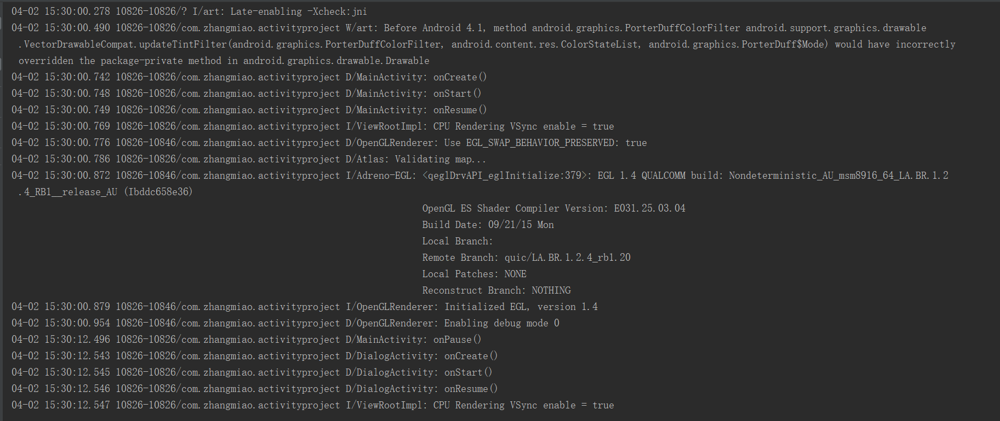
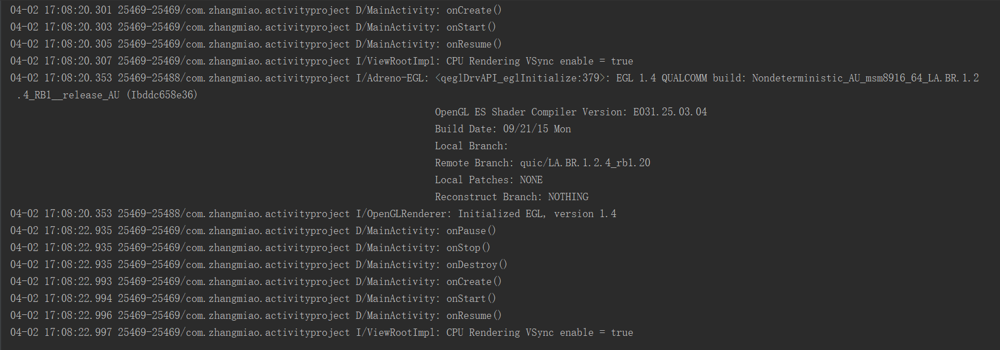
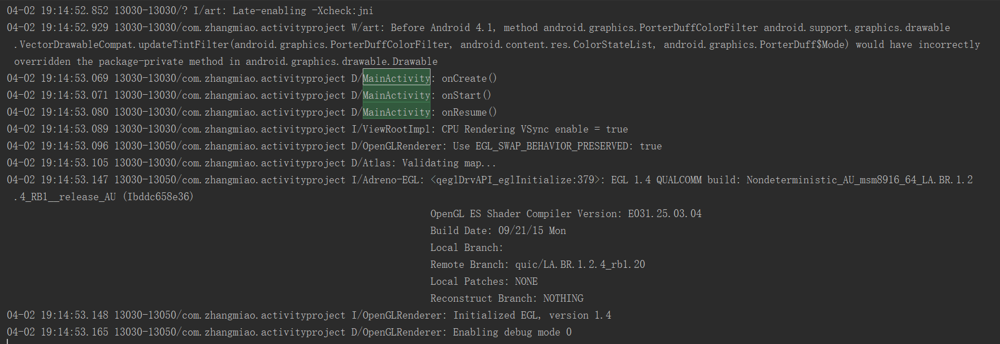

# Activity 知识之一：概述

## Activity 介绍
　　Activity 是 Android 的四大组件之一，主要用于提供窗口与用户进行交互。

## Activity 的生命周期
### 生命周期图
　　拿到官网的 Activity 的生命周期图：


　　解释图中个方法的作用：

| 生命周期方法 | 作用 | 说明 |
| -------- | -------- | -------- |
| onCreate | 表示 Activity 正在被创建 | activity 被创建时调用，一般在这个方法中进行活动的初始化工作，如设置布局工作、加载数据、绑定控件等。 |
| onRestart | 表示 Activity 正在重新启动 | 这个回调代表了 Activity 由完全不可见重新变为可见的过程，当 Activity 经历了 onStop() 回调变为完全不可见后，如果用户返回原 Activity，便会触发该回调，并且紧接着会触发 onStart() 来使活动重新可见。 |
| onStart | 表示 Activity 正在被启动 | 经历该回调后，Activity 由不可见变为可见，但此时处于后台可见，还不能和用户进行交互。 |
| onResume | 表示 Activity 已经可见 | 已经可见的 Activity 从后台来到前台，可以和用户进行交互。 |
| onPause | 表示 Activity 正在停止 | 当用户启动了新的 Activity ，原来的 Activity 不再处于前台，也无法与用户进行交互，并且紧接着就会调用 onStop() 方法，但如果用户这时立刻按返回键回到原 Activity ，就会调用 onResume() 方法让活动重新回到前台。而且在官方文档中给出了说明，不允许在 onPause() 方法中执行耗时操作，因为这会影响到新 Activity 的启动。 |
| onStop | 表示 Activity 即将停止 | 这个回调代表了 Activity 由可见变为完全不可见，在这里可以进行一些稍微重量级的操作。需要注意的是，处于 onPause() 和 onStop() 回调后的 Activity 优先级很低，当有优先级更高的应用需要内存时，该应用就会被杀死，那么当再次返回原 Activity 的时候，会重新调用 Activity 的onCreate()方法。 |
| onDestroy | 表示 Activity 即将被销毁 | 来到了这个回调，说明 Activity 即将被销毁，应该将资源的回收和释放工作在该方法中执行。 |

### 正常情况下的生命周期分析
* 写一个 MainActivity 类，来观察 Activity 的生命周期方法的调用
** MainActivity.java **

```
package com.zhangmiao.activityproject;

import android.os.Bundle;
import android.support.v7.app.AppCompatActivity;
import android.util.Log;

public class MainActivity extends AppCompatActivity {

    private static final String TAG = MainActivity.class.getSimpleName();

    @Override
    protected void onCreate(Bundle savedInstanceState) {
        super.onCreate(savedInstanceState);
        setContentView(R.layout.activity_main);
        Log.d(TAG, "onCreate()");
    }

    @Override
    protected void onRestart() {
        super.onRestart();
        Log.d(TAG, "onRestart()");
    }

    @Override
    protected void onStart() {
        super.onStart();
        Log.d(TAG, "onStart()");
    }

    @Override
    protected void onResume() {
        super.onResume();
        Log.d(TAG, "onResume()");
    }

    @Override
    protected void onPause() {
        super.onPause();
        Log.d(TAG, "onPause()");
    }

    @Override
    protected void onStop() {
        super.onStop();
        Log.d(TAG, "onStop()");
    }

    @Override
    protected void onDestroy() {
        super.onDestroy();
        Log.d(TAG, "onDestroy()");
    }
}
```

** activity_main.xml **
```
<?xml version="1.0" encoding="utf-8"?>
<LinearLayout xmlns:android="http://schemas.android.com/apk/res/android"
    android:layout_width="match_parent"
    android:layout_height="match_parent"
    android:orientation="vertical">

    <TextView
        android:layout_width="wrap_content"
        android:layout_height="wrap_content"
        android:text="这是 MainActivity" />

</LinearLayout>
```

* 点击应用到界面显示出来的生命周期


* 在显示界面点击返回键退出的生命周期


##### 关于生命周期的一些常见问题

###### 1.由活动A启动活动B时。活动A的 onPause() 与活动B的 onResume() 哪一个先执行？
* 在 MainActivity 界面中添加一个按钮，点击按钮跳转 FirstActivity 界面。

** activity_main.xml **
```
<?xml version="1.0" encoding="utf-8"?>
<LinearLayout xmlns:android="http://schemas.android.com/apk/res/android"
    android:layout_width="match_parent"
    android:layout_height="match_parent"
    android:orientation="vertical">

	...

    <Button
        android:id="@+id/goto_first_activity"
        android:layout_width="wrap_content"
        android:layout_height="wrap_content"
        android:text="跳转firstActivity" />

</LinearLayout>
```

**MainActivity.java**
```
    @Override
    protected void onCreate(Bundle savedInstanceState) {
        super.onCreate(savedInstanceState);
        setContentView(R.layout.activity_main);
        findViewById(R.id.goto_first_activity).setOnClickListener(this);
        Log.d(TAG, "onCreate()");
    }
	...
	@Override
    public void onClick(View view) {
        switch (view.getId()) {
            case R.id.goto_first_activity:
                Log.d(TAG, "跳转FirstActivity");
                Intent intent = new Intent(MainActivity.this, FirstActivity.class);
                startActivity(intent);
                break;
            default:
                break;
        }
    }
```

**activity_first.xml**
```
<?xml version="1.0" encoding="utf-8"?>
<LinearLayout xmlns:android="http://schemas.android.com/apk/res/android"
    android:layout_width="match_parent"
    android:layout_height="match_parent"
    android:orientation="vertical">

    <TextView
        android:layout_width="wrap_content"
        android:layout_height="wrap_content"
        android:text="这是 FirstActivity" />

</LinearLayout>
```

**FirstActivity.xml**
```
package com.zhangmiao.activityproject;

import android.os.Bundle;
import android.support.v7.app.AppCompatActivity;
import android.util.Log;

public class FirstActivity extends AppCompatActivity {

    private static final String TAG = FirstActivity.class.getSimpleName();

    @Override
    protected void onCreate(Bundle savedInstanceState) {
        super.onCreate(savedInstanceState);
        setContentView(R.layout.activity_first);
        Log.d(TAG, "onCreate()");
    }

    @Override
    protected void onRestart() {
        super.onRestart();
        Log.d(TAG, "onRestart()");
    }

    @Override
    protected void onStart() {
        super.onStart();
        Log.d(TAG, "onStart()");
    }

    @Override
    protected void onResume() {
        super.onResume();
        Log.d(TAG, "onResume()");
    }

    @Override
    protected void onPause() {
        super.onPause();
        Log.d(TAG, "onPause()");
    }

    @Override
    protected void onStop() {
        super.onStop();
        Log.d(TAG, "onStop()");
    }

    @Override
    protected void onDestroy() {
        super.onDestroy();
        Log.d(TAG, "onDestroy()");
    }
}
```

* 创建两个 Activity ，由 MainActivity 跳转到 FirstAcivity ，运行结果如下：


　　可以看到，是 MainActivity 先执行了 onPause() ， FirstActivity 的 onResume() 后执行的。

* 点击返回看一下执行的顺序：


　　点击返回后，可以看到是 FirstActivity 的 onPause() 先执行，MainActivity 的 onResume() 后执行。

　　所以，当活动 A 启动活动B时，是活动 A 的 onPause() 方法先执行，活动 B 的 onResume() 方法后执行。

###### 2.dialog 是否会对生命周期产生影响？

　　查看 Activity 声明周期的描述，如果 Activity 不在前台，且并非完全不可见时， Activity 就会处在 onPause() 的暂停状态。但是事实如何，用代码说话，测试三种情况：一，弹出标准的 AlertDialog ；二，弹出全屏的 AlertDialog ；三，弹出主题为 Theme.AppCompat.Dialog 的 Activity ，查看这三种情况下的生命周期的变化：

**弹出标准的 AlertDialog**
* 在 MainActivity 的布局中添加一个弹出标准 AlertDialog 的按钮，用于观察 MainActivity 在弹出 AlertDialog 和隐藏 AlertDialog 的情况下的生命周期变化。
**activity_main.xml**

```
<?xml version="1.0" encoding="utf-8"?>
<LinearLayout xmlns:android="http://schemas.android.com/apk/res/android"
    android:layout_width="match_parent"
    android:layout_height="match_parent"
    android:orientation="vertical">

    ...

    <Button
        android:id="@+id/show_standard_alert_dialog"
        android:layout_width="wrap_content"
        android:layout_height="wrap_content"
        android:text="弹出标准的AlertDialog" />

</LinearLayout>
```
**MainActivity.java**
```
    @Override
    protected void onCreate(Bundle savedInstanceState) {
        ...
        findViewById(R.id.show_standard_alert_dialog).setOnClickListener(this);
    }
	...
	@Override
    public void onClick(View view) {
        switch (view.getId()) {
            ...
            case R.id.show_standard_alert_dialog:
                AlertDialog.Builder builder = new AlertDialog.Builder(MainActivity.this);
                builder.setTitle("这是一个标准的AlertDialog");
                builder.setPositiveButton("确定", new DialogInterface.OnClickListener() {
                    @Override
                    public void onClick(DialogInterface dialog, int which) {
                        dialog.dismiss();
                    }
                });
                AlertDialog alertDialog = builder.create();
                alertDialog.show();
                break;
            default:
                break;
        }
    }
```

* 点击弹出标准 AlertDialog 的生命周期的运行

　　可以看到弹出标准的 AlertDialog 并不会对 MainActivity 的生命周期有任何的影响。

* 点击 AlertDialog 的“确定”按钮，对 AlertDialog 进行隐藏，观察 MainActivity 的生命周期的变化
　　点击 AlertDialog 的“确定”按钮后，看到没有任何的日志打印出来，所有隐藏标准 AlertDialog 也不会对 MainActivity 的生命周期有任何的影响。

**弹出全屏的 AlertDialog**

* 在 MainActivity 的布局中添加一个弹出全屏 AlertDialog 的按钮，用于观察 MainActivity 在弹出全屏 AlertDialog 和隐藏全屏 AlertDialog 的情况下的生命周期变化。

**activity_main.xml**

```
<?xml version="1.0" encoding="utf-8"?>
<LinearLayout xmlns:android="http://schemas.android.com/apk/res/android"
    android:layout_width="match_parent"
    android:layout_height="match_parent"
    android:orientation="vertical">

    ...

    <Button
        android:id="@+id/show_full_alert_dialog"
        android:layout_width="wrap_content"
        android:layout_height="wrap_content"
        android:text="弹出全屏的AlertDialog" />

</LinearLayout>
```
**全屏 AlertDialog 的 style**
```
    <style name="Dialog_Fullscreen">
        <item name="android:windowFullscreen">true</item>
        <item name="android:windowNoTitle">true</item>
        <item name="windowActionBar">false</item>
        <item name="android:windowCloseOnTouchOutside">true</item>
    </style>
```
**Activity_main.java**
```
    @Override
    protected void onCreate(Bundle savedInstanceState) {
        ...
        findViewById(R.id.show_full_alert_dialog).setOnClickListener(this);
    }
	...
	@Override
    public void onClick(View view) {
        switch (view.getId()) {
            ...
            case R.id.show_full_alert_dialog:
                AlertDialog.Builder fullBuilder = new AlertDialog.Builder(MainActivity.this, R.style.Dialog_Fullscreen);
                fullBuilder.setTitle("这是一个全屏的AlertDialog");
                fullBuilder.setPositiveButton("确定", new DialogInterface.OnClickListener() {
                    @Override
                    public void onClick(DialogInterface dialog, int which) {
                        dialog.dismiss();
                    }
                });
                AlertDialog fullAlertDialog = fullBuilder.create();
                fullAlertDialog.show();
				break;
            default:
                break;
        }
    }
```

* 点击弹出全屏 AlertDialog 的生命周期的运行

　　可以看到弹出全屏的 AlertDialog 并不会对 MainActivity 的生命周期有任何的影响。

* 点击 AlertDialog 的“确定”按钮，对 AlertDialog 进行隐藏，观察 MainActivity 的生命周期的变化
　　点击 AlertDialog 的“确定”按钮后，看到没有任何的日志打印出来，所有隐藏全屏 AlertDialog 也不会对 MainActivity 的生命周期有任何的影响。

**跳转主题为 Theme.AppCompat.Dialog 的 Activity **

* 在 MainActivity 的布局中添加一个跳转主题为 Theme.AppCompat.Dialog 的 Activity 的按钮，用于观察 MainActivity 在跳转主题为 Theme.AppCompat.Dialog 的 Activity 和从 主题为 Theme.AppCompat.Dialog 的 Activity 返回的情况下的生命周期变化。

**activity_main.xml**

```
<?xml version="1.0" encoding="utf-8"?>
<LinearLayout xmlns:android="http://schemas.android.com/apk/res/android"
    android:layout_width="match_parent"
    android:layout_height="match_parent"
    android:orientation="vertical">

    ...

    <Button
        android:id="@+id/goto_dialog_activity"
        android:layout_width="wrap_content"
        android:layout_height="wrap_content"
        android:text="弹出主题为Dialog的Activity" />

</LinearLayout>
```

**DialogActivity**
```
package com.zhangmiao.activityproject;

import android.os.Bundle;
import android.support.v7.app.AppCompatActivity;
import android.util.Log;

public class DialogActivity extends AppCompatActivity {

    private static final String TAG = DialogActivity.class.getSimpleName();

    @Override
    protected void onCreate(Bundle savedInstanceState) {
        super.onCreate(savedInstanceState);
        setContentView(R.layout.activity_dialog);
        Log.d(TAG, "onCreate()");
    }

    @Override
    protected void onRestart() {
        super.onRestart();
        Log.d(TAG, "onRestart()");
    }

    @Override
    protected void onStart() {
        super.onStart();
        Log.d(TAG, "onStart()");
    }

    @Override
    protected void onResume() {
        super.onResume();
        Log.d(TAG, "onResume()");
    }

    @Override
    protected void onPause() {
        super.onPause();
        Log.d(TAG, "onPause()");
    }

    @Override
    protected void onStop() {
        super.onStop();
        Log.d(TAG, "onStop()");
    }

    @Override
    protected void onDestroy() {
        super.onDestroy();
        Log.d(TAG, "onDestroy()");
    }
}
```

**activity_dialog**
```
<?xml version="1.0" encoding="utf-8"?>
<LinearLayout xmlns:android="http://schemas.android.com/apk/res/android"
    android:layout_width="match_parent"
    android:layout_height="match_parent"
    android:orientation="vertical">
    <TextView
        android:layout_width="wrap_content"
        android:layout_height="wrap_content"
        android:text="Theme 为 Dialog 的 Activity" />
</LinearLayout>
```
**在AndroidManifest.xml中设置DialogActivity的主题为Dialog**
```
<?xml version="1.0" encoding="utf-8"?>
<manifest xmlns:android="http://schemas.android.com/apk/res/android"
    package="com.zhangmiao.activityproject">

    <application
        ...>
        ...
        <activity
            android:name=".DialogActivity"
            android:theme="@style/Theme.AppCompat.Dialog" />
    </application>

</manifest>
```
**Activity_main.java**
```
    @Override
    protected void onCreate(Bundle savedInstanceState) {
        ...
        findViewById(R.id.goto_dialog_activity).setOnClickListener(this);
    }
	...
	@Override
    public void onClick(View view) {
        switch (view.getId()) {
            ...
            case R.id.goto_dialog_activity:
                Intent DialogIntent = new Intent(MainActivity.this, DialogActivity.class);
                startActivity(DialogIntent);
				break;
            default:
                break;
        }
    }
```

* 跳转主题为 Dialog 的 Activity 的生命周期变化

　　可以看到跳转主题为 Dialog 的 Activity 会对 MainActivity 的生命周期产生影响，生命周期的变化与跳转 Activity 的变化相同。

* 在主题为 Dialog 的 Activity 下点击返回键的生命周期变化

　　在主题为 Dialog 的 Activity 下点击返回键，返回到 MainActivity 的界面，从运行结果可以看出，与跳转 Activity 之后返回的声明周期变化不同，MainActivity 只调用了 onResume() 方法，并没有调用 onRestart() 与 onStart() 两个方法，DialogActivity 调用 onPause()、onStop() 与 onDestory() 方法。

### 异常状态下活动的生命周期
　　当 Activity 在运行过程中发生一些情况时，生命周期流程也会发生变化。常见的异常情况有两种，一种是资源配置改变；另一是内存不足导致生命周期流程发生变化。

#### 资源配置改变导致 Activity 重建
　　资源配置最常见的情况就是横竖屏切换导致资源的变化，当程序启动时，会根据不同的配置加载不同的资源，例如横竖屏两个状态对应着两张不同的资源图片。如果在使用过程中屏幕突然旋转，那么 Activity 就会因为系统配置发生改变而销毁重建，加载合适的资源。
下面是 MainActivity 在横竖屏切换时生命周期变化的过程：


#### 低优先级 Activity 由于内存不足被杀死
　　当设备的内存空间不足时，系统为了保证用户的体验，会按照进程优先级将一些低优先级的进程杀死，以来保证用户的体验。
　　系统回收进程的优先级：
（1） 前台进程
　　持有用户正在交互的 Activty，即生命周期处于 onResume 状态的活动。
　　该进程有绑定到正在交互的 Activity 的 service  或前台 service。
（2） 可见进程
　　这种进程虽然不在前台，但是仍然可见。
　　该进程持有的 Activity 执行了 onPause 但未执行 onStop 。例如原活动启动了一个 dialog 主题的 Activity，但此时原活动并非完全不可见。
　　该进程有 service 绑定到可见的或前台 Activity。
（3）服务进程
　　进程中持有一个 service，同时不属于上面两种情况。
（4）后台进程
　　不属于上面三种情况，但进程持有一个不可见的 Activity，即执行了 onStop 但未执行 onDestory 的状态。
（5）空进程
　　不包含任何活跃的应用组件，作用是加快下次启动这个进程中组件所需要的时间，优先级低。

　　模拟内存不足杀死应用：先打开应用，然后按 home 键，使应用进入后台，然后使用命令 `adb shell am kill 包名`将应用杀死。
　　从打开应用到杀死应用的生命周期变化如下：

　　在按 home 键之后，MainActivty 调用了 onPause() 与 onStop() 方法，并没有调用 onDestory() 方法，所以主进程现在属于后台进程。
　　然后在点击应用的图标，打开应用，生命周期变化如下：

　　可以看到 MainActivity 调用了 onCreate()、onStart() 和 onResume() 方法，Activity 重新创建了。
#### 异常情况下的处理
　　在发生异常情况后，用户再次回到 Activity，原 Activity 会重新建立，原已有的数据就会丢失，比如用户选择了对，重建之后用户就看不到之前的选择，在异常的情况下如何给用户带来好的体验，有两种办法。

##### 数据保存
　　第一种就是系统提供的 onSaveInstanceState 和 onRestoreInstanceState 方法，onSaveInstanceState 方法会在 Activity 异常销毁之前调用，用来保存需要保存的数据，onRestoreInstanceState 方法在 Activity 重建之后获取保存的数据。
　　在活动异常销毁之前，系统会调用 onSaveInstanceState，可以在 Bundle 类型的参数中保存想要的信息，之后这个 Bundle 对象会作为参数传递给 onRestoreInstanceState 和 onCreate 方法，这样在重新创建时就乐意获取数据了。
　　关于 onSaveInstanceState 与 onRestoreInstanceState 方法需要注意的一些问题：
　　1. onSaveInstanceState 方法的调用时机是在 onStop 之前，与 onPause 没有固定的时序关系。而 onestoreInstanceState 方法则是在 onStart 之后调用。
　　2. 正常情况下的活动销毁并不胡调用这两个方法，只有当活动异常销毁并且有机会重现展示的时候才会进行调用，除了资源配置的改变外，activity 因内存不足被销毁也是通过这两个方法保存数据。
　　3. 在 onRestoreInstanceState 和 onCreate 都可以进行数据恢复工作，但是根据官方文档建议采用在 onRestoreInstanceState 中去恢复。
　　4. 在 onSaveInstanceState 和 onRestoreInstanceState 这两个方法中，系统会默认为我们进行一定的恢复工作，例如 EditText 中的文本信息、ListView 中的滚动位置等，下面对一些空间观察实际保存效果。

　　在 MainActivity 中覆盖 onSaveInstanceState 和 onRestoreInstanceState 两个方法：
```
...
public class MainActivity extends AppCompatActivity implements View.OnClickListener {
	...
    @Override
    protected void onSaveInstanceState(Bundle outState) {
        Log.d(TAG, "onSaveInstanceState()");
        super.onSaveInstanceState(outState);
        outState.putString("message", "onSaveInstanceState");
    }

    @Override
    protected void onRestoreInstanceState(Bundle savedInstanceState) {
        Log.d(TAG, "onRestoreInstanceState()");
        super.onRestoreInstanceState(savedInstanceState);
        if (savedInstanceState != null) {
            String message = savedInstanceState.getString("message");
            Log.d(TAG, "onRestoreInstanceState message:" + message);
        }
    }
}
```
　　在 onSaveInstanceState 方法中保存 key 值为 message ,值为 onSaveInstanceState 的数值，在 onRestoreInstanceState 方法中获取 key 值为 message 对应的数值，使用横竖屏切换来测试这两个方法的调用，以及保存数值的获取。
　　从 MainActivity 开启到切换横竖屏的生命周期变化如下：

　　横竖屏切换时，MainActivity 调用了 onSaveInstanceState() 方法，切换之后 MainActivity 重新创建，并且调用了 onRestoreInstanceState() 方法，并从 Bundle 中取得了 onSaveInstanceState() 方法中保存的数据。
　　再切换回来的生命周期变化如下:

　　切换回来与切换的时候的生命周期变化一样，先调用了 onSaveInstanceState() 方法，切换后 MainActivity 重新创建并调用 onRestoreInstanceState() 方法，并从Bundle 中取得了 onSaveInstanceState() 方法中保存的数据。
　　onCreate() 方法中也能获取 onSaveInstanceState 方法中保存的数据，在 MainActivity 的 onCreate() 方法中增加获取代码：
```
...
public class MainActivity extends AppCompatActivity implements View.OnClickListener {
	...
    @Override
    protected void onCreate(Bundle savedInstanceState) {
        super.onCreate(savedInstanceState);
        setContentView(R.layout.activity_main);
        findViewById(R.id.goto_first_activity).setOnClickListener(this);
        findViewById(R.id.show_standard_alert_dialog).setOnClickListener(this);
        findViewById(R.id.show_full_alert_dialog).setOnClickListener(this);
        findViewById(R.id.goto_dialog_activity).setOnClickListener(this);
        Log.d(TAG, "onCreate()");
        if (savedInstanceState != null) {
            String message = savedInstanceState.getString("message");
            Log.d(TAG, "onCreate message:" + message);
        }
    }
	...
}
```
　　横竖屏切换之后 onCreate() 打印的日志如下:

　　在 MainActivity 重新创建时，调用了 onCreate() 方法，并从 onCreate() 方法的 Bundle 中获取到 onSaveInstanceState() 方法中存储的值。注意：onCreate() 中从 Bundle 中获取数据之前，一定要判空，因为第一次进入的时候，Bundle 是空的，会有空指针异常。

* EditText：（通过转屏观察信息，要加 id 才行）
　　在 MainActivity 的布局文件中添加 EditText，打开应用后，在输入框内输入一些文字。在横竖屏切换后观察输入框内的文字是否和切换之前的文字相同。
** activity_main.xml **

** MainActivity.java **


　　从打开应用，到横竖屏切换之后输入框的文字内容如下：


* TextView：（通过转屏观察信息，这里只是通过 setText 方法动态设置文本内容，在这种情况下加了 id 也无法自动保存，这种情况可以通过给 TextView 设置 freezesText 属性才能自动保存，当然这条属性对 EditText 也同样适用）
　　打开应用后修改 TextView 的内容，横竖屏切换后，观察 TextView 的内容是否和切换之前的文字相同。

** MainActivity.java **

　　从打开应用，到横竖屏切换之后 TextView 的文字内容如下：


##### 防止重建
　　在默认情况下，资源配置改变会导致活动的重新创建，但是可以通过对活动的 android:configChanges 属性的设置使活动防止重新被创建。

** android:configChanges 属性值**

| 属性值 | 含义 |
|--------|--------|
| mcc | SIM 卡唯一标识IMSI（国际移动用户标识码）中的国家代码，由三位数字组成，中国为：460，这里标识 mcc 代码发生了变化 |
| mnc | SIM 卡唯一标识 IMSI（国际移动用户标识码）中的运营商代码，有两位数字组成，中国移动 TD 系统为 00 ，中国联通为 01，电信为 03，此项标识 mnc 发生了改变 |
| locale | 设备的本地位置发生了改变，一般指的是切换了系统语言 |
| touchscreen | 触摸屏发生了改变 |
| keyboard | 键盘类型发生了改变，比如用户使用了外接键盘 |
| keyboardHidden | 键盘的可访问性发生了改变，比如用户调出了键盘 |
| navigation | 系统导航方式发生了改变 |
| screenLayout | 屏幕布局发生了改变，很可能是用户激活了另外一个显示设备 |
| fontScale | 系统字体缩放比例发生了改变，比如用户选择了个新的字号 |
| uiMode | 用户界面模式发生了改变，比如开启夜间模式 -API8 新添加 |
| orientation | 屏幕方向发生改变，比如旋转了手机屏幕 |
| screenSize | 当屏幕尺寸信息发生改变（当编译选项中的 minSdkVersion 和 targeSdkVersion 均低于 13 时不会导致 Activity 重启 ） API 13 新添加 |
| smallestScreenSize | 设备的物理尺寸发生改变，这个和屏幕方向没关系，比如切换到外部显示设备 -API13 新添加 |
| layoutDirection | 当布局方向发生改变的时候，正常情况下无法修改布局的 layoutDirection 的属性-API17 新添加 |
　　将 MainActivity 的 android:configChanges 设置为 orientation ，在横竖屏切换的时候防止重新被创建。
** AndroidManifest.xml **


　　横竖屏切换时，生命周期的变化如下:


## 参考文章：
1. [老生常谈-Activity](https://juejin.im/post/5adab7b6518825670c457de3)
2. [全面了解 Activity](https://juejin.im/entry/589847f7128fe10058ebd803)
3. [Activity 必知必会](https://juejin.im/post/5aef0d215188253dc612991b)
4. [Android:“万能”Activity 重构篇](https://juejin.im/entry/574b7ec52e958a005eed0788)
5. [Android Activity 全面解析](https://juejin.im/entry/57db6332d203090069d3466d)
6. [Android之Activity系列总结（一）--Activity概览](https://www.cnblogs.com/jycboy/p/6367282.html)
7. [Android之Activity系列总结(二)--任务和返回栈](https://www.cnblogs.com/jycboy/p/6367330.html)
8. [Android之Activity系列总结(三)--Activity的四种启动模式](https://www.cnblogs.com/jycboy/p/6367829.html)
9. [Android 旋转屏幕--处理Activity与AsyncTask的最佳解决方案](http://www.cnblogs.com/jycboy/p/save_state_data.html)
10. [Activity之概览屏幕(Overview Screen)](https://www.cnblogs.com/jycboy/p/overview_screen.html)
11. [Android四大组件之Activity详解](https://www.cnblogs.com/caobotao/p/4987015.html)
12. [Android之Activity系列总结（一）--Activity概览](https://www.cnblogs.com/jycboy/p/6367282.html)
13. [3分钟看懂Activity启动流程](https://www.jianshu.com/p/9ecea420eb52)
14. [Android configChanges的属性值和含义(详细)](https://blog.csdn.net/qq_33544860/article/details/54863895)