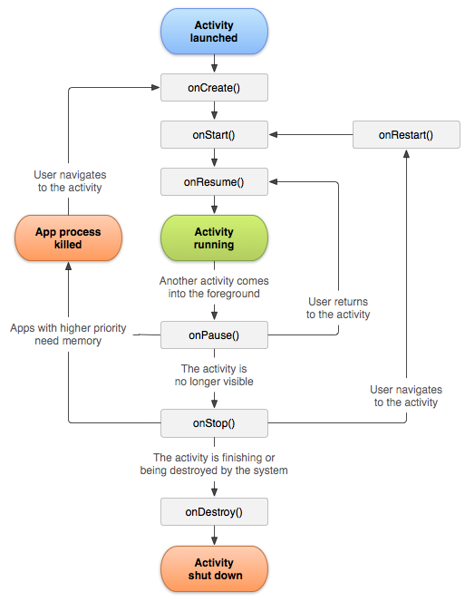

# Activity 知识之一：概述

## Activity 介绍
　　Activity 是 Android 的四大组件之一，主要用于提供窗口与用户进行交互。

## Activity 的生命周期
#### 生命周期图
　　官网的 Activity 的生命周期图：

　　解释图中个方法的作用：

| 生命周期方法 | 作用 | 说明 |
| -------- | -------- | -------- |
| onCreate | 表示 Activity 正在被创建 | activity 被创建时调用，一般在这个方法中进行活动的初始化工作，如设置布局工作、加载数据、绑定控件等。 |
| onRestart | 表示 Activity 正在重新启动 | 这个回调代表了 Activity 由完全不可见重新变为可见的过程，当 Activity 经历了 onStop() 回调变为完全不可见后，如果用户返回原 Activity，便会触发该回调，并且紧接着会触发 onStart() 来使活动重新可见。 |
| onStart | 表示 Activity 正在被启动 | 经历该回调后，Activity 由不可见变为可见，但此时处于后台可见，还不能和用户进行交互。 |
| onResume | 表示 Activity 已经可见 | 已经可见的 Activity 从后台来到前台，可以和用户进行交互。 |
| onPause | 表示 Activity 正在停止 | 当用户启动了新的 Activity ，原来的 Activity 不再处于前台，也无法与用户进行交互，并且紧接着就会调用 onStop() 方法，但如果用户这时立刻按返回键回到原 Activity ，就会调用 onResume() 方法让活动重新回到前台。而且在官方文档中给出了说明，不允许在 onPause() 方法中执行耗时操作，因为这会影响到新 Activity 的启动。 |
| onStop | 表示 Activity 即将停止 | 这个回调代表了 Activity 由可见变为完全不可见，在这里可以进行一些稍微重量级的操作。需要注意的是，处于 onPause() 和 onStop() 回调后的 Activity 优先级很低，当有优先级更高的应用需要内存时，该应用就会被杀死，那么当再次返回原 Activity 的时候，会重新调用 Activity 的onCreate()方法。 |
| onDestroy | 表示 Activity 即将被销毁 | 来到了这个回调，说明 Activity 即将被销毁，应该将资源的回收和释放工作在该方法中执行。 |

#### 常见情况下生命周期的回调
（A 与 B 表示不同的 Activity ）
| 情况 | 回调 |
|--------|--------|
| 第一次启动 | onCreate() -> onStart() -> onResume() |
| 从 A 跳转到不透明的 B | A_onPause() -> B_onCreate() -> B_onStart() -> B_onResume() -> A_onStop() |
| 从 A 跳转到透明的 B | A_onPause() -> B_onCreate() -> B_onStart() -> B_onResume() |
| 从不透明的 B 再次回到 A | B_onPause() -> A_onRestart() -> A_onStart() -> A_onResume() -> B_onStop() |
| 从透明的 B 再次回到 A | B_onPause() -> A_onResume() -> B_onStop() -> B_onDestory() |
| 用户按 home 键 | onPause() -> onStop() |
| 按 home 键回后回到应用 | onRestart() -> onStart() -> onResume() |
| 用户按 back 键回退 | onPause() -> onStop() -> onDestroy() |

#### 异常状态下活动的生命周期
　　当 Activity 在运行过程中发生一些情况时，生命周期流程也会发生变化。常见的异常情况有两种，一种是资源配置改变；另一是内存不足导致生命周期流程发生变化。

##### 资源配置改变导致 Activity 重建
　　资源配置最常见的情况就是横竖屏切换导致资源的变化，当程序启动时，会根据不同的配置加载不同的资源，例如横竖屏两个状态对应着两张不同的资源图片。如果在使用过程中屏幕突然旋转，那么 Activity 就会因为系统配置发生改变而销毁重建，加载合适的资源。

##### 低优先级 Activity 由于内存不足被杀死
　　当设备的内存空间不足时，系统为了保证用户的体验，会按照进程优先级将一些低优先级的进程杀死，以来保证用户的体验。
　　系统回收进程的优先级：
（1） 前台进程
　　持有用户正在交互的 Activty，即生命周期处于 onResume 状态的活动。
　　该进程有绑定到正在交互的 Activity 的 service  或前台 service。
（2） 可见进程
　　这种进程虽然不在前台，但是仍然可见。
　　该进程持有的 Activity 执行了 onPause 但未执行 onStop 。例如原活动启动了一个 dialog 主题的 Activity，但此时原活动并非完全不可见。
　　该进程有 service 绑定到可见的或前台 Activity。
（3）服务进程
　　进程中持有一个 service，同时不属于上面两种情况。
（4）后台进程
　　不属于上面三种情况，但进程持有一个不可见的 Activity，即执行了 onStop 但未执行 onDestory 的状态。
（5）空进程
　　不包含任何活跃的应用组件，作用是加快下次启动这个进程中组件所需要的时间，优先级低。

#### 异常情况下的处理
　　在发生异常情况后，用户再次回到 Activity，原 Activity 会重新建立，原已有的数据就会丢失，比如用户选择了对，重建之后用户就看不到之前的选择，在异常的情况下如何给用户带来好的体验，有两种办法。

##### 数据保存
　　第一种就是系统提供的 onSaveInstanceState 和 onRestoreInstanceState 方法，onSaveInstanceState 方法会在 Activity 异常销毁之前调用，用来保存需要保存的数据，onRestoreInstanceState 方法在 Activity 重建之后获取保存的数据。
　　在活动异常销毁之前，系统会调用 onSaveInstanceState，可以在 Bundle 类型的参数中保存想要的信息，之后这个 Bundle 对象会作为参数传递给 onRestoreInstanceState 和 onCreate 方法，这样在重新创建时就可以获取数据了。
　　关于 onSaveInstanceState 与 onRestoreInstanceState 方法需要注意的一些问题：
　　1. onSaveInstanceState 方法的调用时机是在 onStop 之前，与 onPause 没有固定的时序关系。而 onestoreInstanceState 方法则是在 onStart 之后调用。
　　2. 正常情况下的活动销毁并不会调用这两个方法，只有当活动异常销毁并且有机会重现展示的时候才会进行调用，除了资源配置的改变外，activity 因内存不足被销毁也是通过这两个方法保存数据。
　　3. 在 onRestoreInstanceState 和 onCreate 都可以进行数据恢复工作，但是根据官方文档建议采用在 onRestoreInstanceState 中去恢复。
　　4. 在 onSaveInstanceState 和 onRestoreInstanceState 这两个方法中，系统会默认为我们进行一定的恢复工作，例如 EditText 中的文本信息、ListView 中的滚动位置等，下面对一些空间观察实际保存效果。
　　5. onSveInstanceState() 常见的触发场景有：横竖屏切换、按下电源键、按下菜单键、切换到别的 Activity 等；onRestoreInstanceState() 常见的触发场景有：横竖屏切换、切换语言等等。

##### 防止重建
　　在默认情况下，资源配置改变会导致活动的重新创建，但是可以通过对活动的 android:configChanges 属性的设置使活动防止重新被创建。

** android:configChanges 属性值**

| 属性值 | 含义 |
|--------|--------|
| mcc | SIM 卡唯一标识IMSI（国际移动用户标识码）中的国家代码，由三位数字组成，中国为：460，这里标识 mcc 代码发生了变化 |
| mnc | SIM 卡唯一标识 IMSI（国际移动用户标识码）中的运营商代码，有两位数字组成，中国移动 TD 系统为 00 ，中国联通为 01，电信为 03，此项标识 mnc 发生了改变 |
| locale | 设备的本地位置发生了改变，一般指的是切换了系统语言 |
| touchscreen | 触摸屏发生了改变 |
| keyboard | 键盘类型发生了改变，比如用户使用了外接键盘 |
| keyboardHidden | 键盘的可访问性发生了改变，比如用户调出了键盘 |
| navigation | 系统导航方式发生了改变 |
| screenLayout | 屏幕布局发生了改变，很可能是用户激活了另外一个显示设备 |
| fontScale | 系统字体缩放比例发生了改变，比如用户选择了个新的字号 |
| uiMode | 用户界面模式发生了改变，比如开启夜间模式 -API8 新添加 |
| orientation | 屏幕方向发生改变，比如旋转了手机屏幕 |
| screenSize | 当屏幕尺寸信息发生改变（当编译选项中的 minSdkVersion 和 targeSdkVersion 均低于 13 时不会导致 Activity 重启 ） API 13 新添加 |
| smallestScreenSize | 设备的物理尺寸发生改变，这个和屏幕方向没关系，比如切换到外部显示设备 -API13 新添加 |
| layoutDirection | 当布局方向发生改变的时候，正常情况下无法修改布局的 layoutDirection 的属性-API17 新添加 |

　　最常用的就是 screenLayout 与 screenSize 属性，在横竖屏切换时防止资源的重建。

#### 关于 Activity 的不常用的生命周期回调方法
1. onPostCreate()
　　onPostCreate() 方法是指 onCreate() 方法彻底执行完毕的回调。一般我们都没有实现这个方法，它的作用是在代码开始运行之前，调用系统做最后的初始化工作。现在知道的做法是使用 ActionBarDrawerTogglt 时在屏幕旋转的时候在 onPostCreate() 中同步下状态。

2. onPostResume()
　　onPostResume() 与 onPostCreate() 方法类似，onPostResume() 方法在 onResume() 方法彻底执行完毕的回调。 onCreate() 方法中获取某个 View 的高度和宽度时，返回的值是 0 ，因为这个时候 View 可能还没初始化好，但是在 onPostResume() 中获取就不会有问题，因为 onPostResume() 是在 onResume() 彻底执行完毕的回调。

3. onContentChanged()
　　当 Activity 的布局改动时，即 setContentView() 或者 addContentView() 方法执行完毕时就会调用该方法。所以，Activity 中 View 的 findViewById() 方法都可以放到该方法中。

4. onUserInteraction()
　　Activity 无论分发按键事件、触摸事件或者轨迹球事件都会调用 Activity#onUserInteraction()。如果想知道用户用某种方式和你正在运行的 activity 交互，可以重写 Activity#onUserInteraction()。所有调用 Activity#onUserLeaveHint() 的回调都会首先回调 Activity#onUserInteraction() 。
　　Activity 在分发各种事件的时候会调用该方法，注意：启动另一个 activity ,Activity#onUserInteraction()会被调用两次，一次是 activity 捕获到事件，另一次是调用 Activity#onUserLeaveHint() 之前会调用 Activity#onUserInteraction() 。
　　可以用这个方法来监控用户有没有与当前的 Activity 进行交互。

5. onUserLeaveHint()
　　当用户的操作使一个 activity 准备进入后台时，此方法会像 activity 的生命周期的一部分被调用。例如，当用户按下 Home 键，Activity#onUserLeaveHint() 将会被调用。但是当来电导致 activity 自动占据前台（系统自动切换），Activity#onUserLeaveHint() 将不会被回调。
　　一般监听返回键，是重写 onKeyDown() 方法，但是 Home 键和 Menu 键就不好监听，但是可以在 onUserLeaveHint() 方法中监听。

## 参考文章：
1. [老生常谈-Activity](https://juejin.im/post/5adab7b6518825670c457de3)
2. [全面了解 Activity](https://juejin.im/entry/589847f7128fe10058ebd803)
3. [超详细的生命周期图-你能回答全吗](https://www.jianshu.com/p/d586c3406cfb)