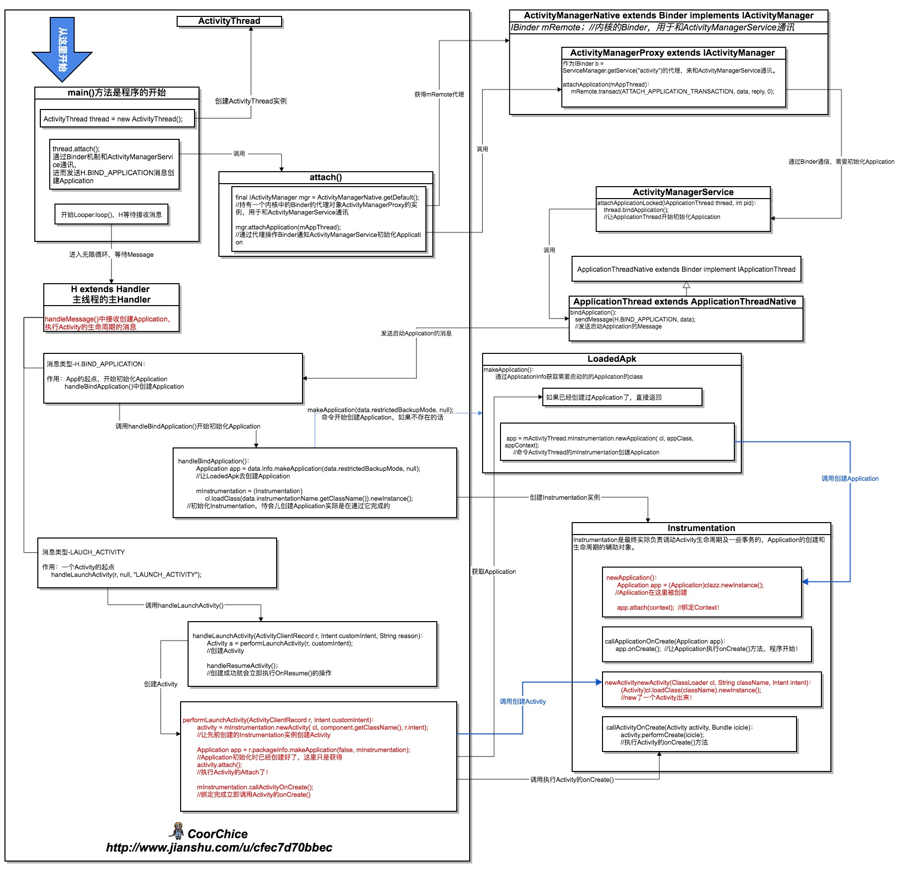

# Activity 知识之三：启动流程

	 本文内容


## 启动任务
　　通过为 Activity 提供一个以 “android.intent.action.MAIN” 为指定操作、以 “android.intent.category.LAUNCHER” 为执行类别的 Intent 过滤器，可以将 Activity 设置为任务的入口点。

　　此类 Intent 过滤器会使 Activity 的图标和标签显示在应用启动器中，让用户能够启动 Activity 并在启动之后随时返回到创建的任务中。

　　用户必须能够在离开任务后，再使用此 Activity 启动器返回该任务。因此，只有在 Activity 具有 ACTION_MAIN 和  CATEGORY_LAUNCHER 过滤器时，才应该使用将 Activity 标记为“始终启动任务“的两种启动模式，即 ”singleTask“ 和 ”singleInstance“。

　　如果并不想用户能够返回到 Activity ，对于这些情况，可以将 < activity > 元素的 finishOnTaskLaunch 设置为 ”true“ 。

## Activity 的启动流程图


## 开始：ActivtyThread.java 中的 main() 方法
　　Android 中，一个应用程序的开始可以说就是从 ActivityThread.java 中的 main() 方法开始的。

　　从 Activity 的启动流程图可以看到，main() 方法中主要做的事情有：

1. 初始化主线程的 Looper、主 Handler 。并使主线程进入等待接收 Message 消息的无限循环状态。下面是 main() 方法中比较关键的代码：
```
public static void main(String[] args) {
		...
		//初始化 Looper
        Looper.prepareMainLooper();

		...

		//实例化一个 ActivityThread 对象
        ActivityThread thread = new ActivityThread();
		//这个方法最后就是为了发送出创建 Application 的消息
        thread.attach(false);

		...

        //主线程进入无限循环状态，等待接收消息
        Looper.loop();
		...
    }
```

2. 调用 attach() 方法，主要就是为了发送出初始化 Application 的消息。

## 创建 Application 的消息是如何发送的呢？
　　在 ActivityThread 类中的 main() 方法中调用了 attach() 方法，这个方法最终的目的是发送一条创建 Application 的消息-H.BIND_APPLICATION 到主线程的主 Handler 中。

　　acctch() 方法的关键代码：
```
    private void attach(boolean system) {
        ...
        if (!system) {
            ..
		    /获得 IActivityManager 的实例
            final IActivityManager mgr = ActivityManagerNative.getDefault();
			//调用 IActivityManager 的 attachApplication() 方法，传递 mAppThread 对象
            try {
                mgr.attachApplication(mAppThread);
            } catch (RemoteException ex) {
                throw ex.rethrowFromSystemServer();
            }
            ...
        } else {
            ...
        }
		...
    }

```

#### IActivityManager mgr 是什么？
　　从 attach() 方法中可以看到 IActivityManager 是一个接口，当调用 ActivityManagerNative.getDefault() 获得的实际是一个代理类的实例-ActivityManagerProxy，ActivityManagerProxy 实现了 IActivityManager 接口。而 ActivityManagerProxy 是 ActivityManagerNative 的一个内部类。

1. ActivityManagerProxy 的构造函数：
```
    public ActivityManagerProxy(IBinder remote)
    {
        mRemote = remote;
    }
```
　　ActivityManagerProxy 的构造函数非常的简单，首先它需要一个 IBinder 参数，然后赋值给 mRemote 变量。这个 mRemote 是 ActivityManagerProxy 的成员变量，对它的操作是由 ActivityManagerProxy 来代理间接进行的。这样设计的好处是保护了 mRemote，并且能够在操作 mRemote 前执行一些别的事务，并且是以 ActivityManager 来进行这些操作的。

2. ActivityManagerProxy 的构造函数是在哪里调用的？
```
    static public IActivityManager asInterface(IBinder obj) {
        if (obj == null) {
            return null;
        }
        IActivityManager in =
            (IActivityManager)obj.queryLocalInterface(descriptor);
		//先检查有没有
        if (in != null) {
            return in;
        }
		//调用 ActivityManagerProxy 的构造函数
        return new ActivityManagerProxy(obj);
    }
```
　　asInterface() 方法是 ActivityManagerNative 中的一个静态方法，它会调用到 ActivityManagerProxy 的构造方法。然而，这个静态方法也需要一个 IBinder 作为参数。

3. asInsterface() 方法是在哪里调用的？
```
    private static final Singleton<IActivityManager> gDefault = new Singleton<IActivityManager>() {
        protected IActivityManager create() {
			//IBinder 实例是在这里获取的
            IBinder b = ServiceManager.getService("activity");
            if (false) {
                Log.v("ActivityManager", "default service binder = " + b);
            }
			//调用了 asInterface() 方法
            IActivityManager am = asInterface(b);
            if (false) {
                Log.v("ActivityManager", "default service = " + am);
            }
            return am;
        }
    };
```
　　gDefault 是 ActivityManagerNative 的静态常量，是一个单例。在启动找到了 IBinder 实例。

　　这里是通过 ServiceManager 获取到 IBinder 实例的。如果了解 AIDL 通讯流程的话，就会理解这只是通过另一种方式获取 IBinder 实例罢了。获取 IBinder 的目的就是为了通过这个 IBinder 和 ActivityManager 进行通讯，进而 ActivityManager 会调度发送 H.BIND_APPLICATION 即初始化 Application 的 Message 消息。

4. attachApplication(mAppThread) 方法
```
    public void attachApplication(IApplicationThread app) throws RemoteException
    {
        Parcel data = Parcel.obtain();
        Parcel reply = Parcel.obtain();
        data.writeInterfaceToken(IActivityManager.descriptor);
        data.writeStrongBinder(app.asBinder());

        mRemote.transact(ATTACH_APPLICATION_TRANSACTION, data, reply, 0);

        reply.readException();
        data.recycle();
        reply.recycle();
    }
```
　　attachApplication 方法调用了 IBinder 实例的 transact() 方法，并且把参数 app 放到了 data 中，最终传递给了 ActivityManager 。

　　IActivityManager 是一个接口，ActivityManagerProxy 实现了 IActivityManager 接口，ActivityManagerProxy 主要代理了内核中与 ActivityManager 通讯的 Binder 实例。

#### ApplicationThread mAppThread 又是什么？

1. 在 ActivityThread 的成员变量中对发现 mAppThread
```
final ApplicationThread mAppThread = new ApplicationThread();
```
　　ApplicationThread 是作为 ActivityThread 中的一个常量出现的。这表明系统不喜欢这个变量中途被修改，可见这个变量具有特定而十分重要的作用。

2. 查看 ApplicationThread 类
```
    private class ApplicationThread extends ApplicationThreadNative {
		...
    }
```
　　ApplicationThread 是 ActivityThread 中的一个内部类，并且 ApplicationThread 是继承 ApplicationThreadNative 类的。

3. 查看 ApplicationThreadNative 类
```
public abstract class ApplicationThreadNative extends Binder
        implements IApplicationThread {
    ...
	//无参构造函数
    public ApplicationThreadNative() {
		//这是 Binder 的方法
        attachInterface(this, descriptor);
    }
}
```
　　可以看到 ApplicationThreadNative 继承于 Binder ，所以 ApplicationThreadNative 是一个 Binder，同事也实现了 IAPPlicationThread 接口，所以 ApplicationThreadNative 也是一个 IApplicationThread 。


## 参考文章：
1. [Android之Activity系列总结(二)--任务和返回栈](https://www.cnblogs.com/jycboy/p/6367330.html)
2. [3分钟看懂Activity启动流程](https://www.jianshu.com/p/9ecea420eb52)

