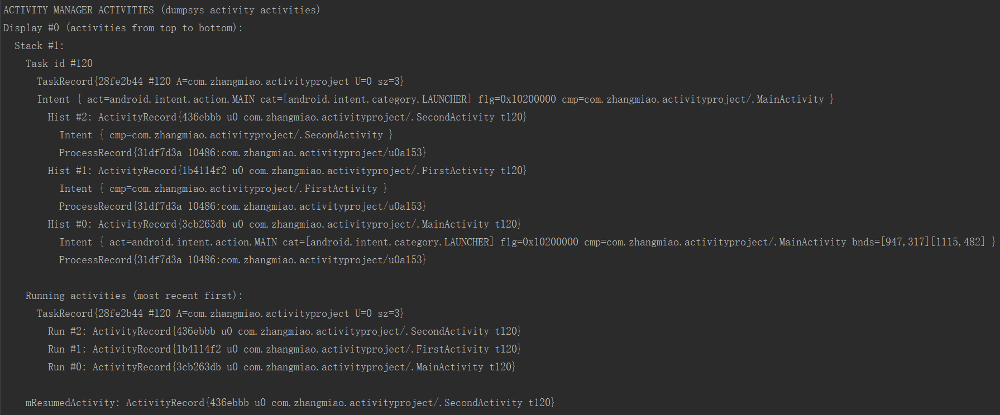
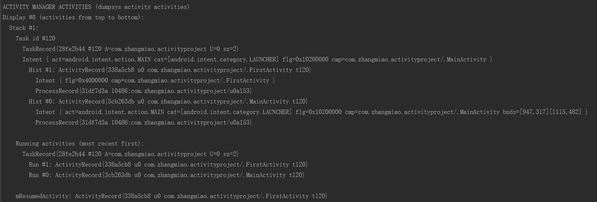
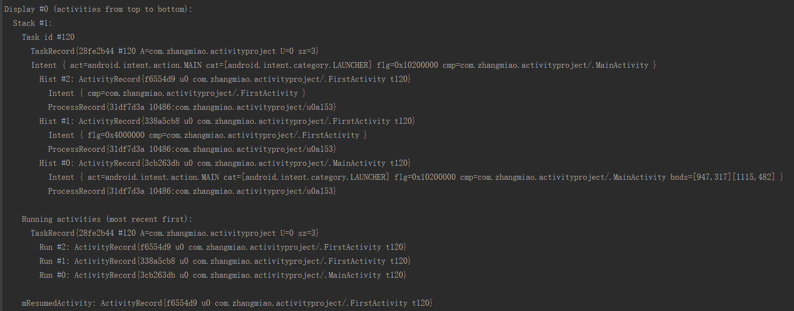

# Intent 的 flags 的实践验证

## 关于如何验证
　　创建一个 MainActivity 、 FirstActivity 与 SecondActivity 类，MainActivity 是项目的主界面，任何一个 Activity 都可以跳转包括自己的任意一个 Activiity ，通过在代码中跳转 FirstActivity 时设置 flag 。

　　通过执行 `adb shell dumpsys activity` 命令观察任务栈中 Activity 的入栈和出栈情况。

　　相关验证代码在：[activityproject](https://github.com/ZhangMiao147/ArticleProject/tree/master/activityproject)

## 设置方法
　　在使用 Intent 启动 Activity 时，通过使用 Intent.addFlags(int flags) 方法来设置，如下：
```
  Intent intent = new Intent(MainActivity.this, FirstActivity.class);
  intent.setFlags(Intent.FLAG_ACTIVITY_CLEAR_TASK);
  startActivity(intent);
```

## 常用 flag 的实践验证

#### FLAG_ACTIVITY_CLEAR_TOP
　　如果设置此标签，activity 已经在栈中，则不会启动 activity 的新实例，而是将栈中 activity 之上的 activities 进行出栈关闭，Intent 将被传递给旧的 activity 作为新的 Intent 。

* 设置 SecondActivity 跳转 FirstActivity 的 flag 为 FLAG_ACTIVITY_CLEAR_TOP。
* 打开应用 MainActivity，点击跳转 FirstActivity ，在 FirstActivity 界面跳转 SecondActivity 。

　　当前栈中情况是（从栈底到栈顶）：MainActivity -> FirstActivity -> SecondActivity。

* 在 SecondActivity 点击跳转 FirstActivity 。

　　当前栈中情况是（从栈底到栈顶）：MainActivity -> FirstActivity。当将标记设置为 FLAG_ACTIVITY_CLEAR_TOP 时，会将栈内 FirstActivity 上面的 SecondActivity 移除栈，然后复用栈内的 FirstActivity 。

* 在 FirstActivity 界面点击跳转 FirstActivity 。

　　当前栈中情况是（从栈底到栈顶）：MainActivity -> FirstActivity -> FirstActivity 。注意是在 FirstActivity 界面点击跳转的 FirstActivity ，在 FirstActivity 中跳转 FirstActivity 时并没有设置 flag 的值，使用的是默认值，所以会创建新的 activity 实例。

* 再继续在 FirstActivity 界面点击跳转 SecondActivity 。

　　当前栈中情况是（从栈底到栈顶）：MainActivity -> FirstActivity -> FirstActivity -> SecondActivity 。

* 再次在SecondActivity 点击跳转 FirstActivity 。

　　当前栈中情况是（从栈底到栈顶）：MainActivity -> FirstActivity -> FirstActivity 。这是会发现 FLAG_ACTIVITY_CLEAR_TOP 并不是找到栈中从栈底向上最近的 activity ，而是从栈顶开始找，找到 activity 就会返回。

#### FLAG_ACTIVITY_NO_HISTORY
　　如果设置此 flag ，则新的 activity 将不会保留在历史栈中。一旦用户离开它，activity 将结束。也可以通过 `android.R.styleable#AndroidManifestActivity_noHistory noHistory` 属性设置。
　　如果设置此 flag ，当前的 activity 启动一个新的 activity ，新的 activity 设置返回值并结束，但旧的 activity 的 onActivityResult() 不会被触发。

* 设置 MainActivity 跳转 FirstActivity 的 flag 为 FLAG_ACTIVITY_NO_HISTORY。
* 点击打开 MainActivity 。

　　当前栈中情况是（从栈底到栈顶）：MainActivity 。

* 在 MainActivity 界面跳转 FirstActivity 。

　　当前栈中情况是（从栈底到栈顶）：MainActivity -> FirstActivity。这时会发现加了 FLAG_ACTIVITY_NO_HISTORY 的 Activity 仍然会入栈。


* 在 FirstActivity 界面跳转 SecondActivity 。


　　当前栈中情况是（从栈底到栈顶）：MainActivity -> FirstActivity -> SecondActivity。就算离开了 FirstActivity 进入到 SecondActivity ，FristActivity 依然在栈内。但是还会打印一个信息就是 FirstActivity 在等待被结束。

* 在 SecondActivity 界面点击返回键。

　　当前栈中情况是（从栈底到栈顶）：MainActivity。点击返回键之后，界面直接回到了 MainActivity 。并没有回到 FirstActivity 界面。

* 在 MainActivity 跳转到 FirstActivity ，按下 home 键，让应用进入后台，然后再从后台点击应用进入。

　　当前栈中情况是（从栈底到栈顶）：MainActivity。应用在恢复时也没有回到 FirstActivity ，而是恢复到了 MainActivity 界面。

#### FLAG_ACTIVITY_NO_ANIMATION
　　如果在 Context.startActivity 给 Intent 设置这个标签，将不会展示系统在 activity 从当前状态跳转到下一个 activity 的切换动画。

* 设置 MainActivity 跳转 FirstActivity 的 flag 为 FLAG_ACTIVITY_NO_ANIMATION。
* 查看从 MainActivity 跳转 FirstActivity 时的动画显示、FirstActivity 按 back 键返回 MainActivity 的动画显示以及 FirstActivty 跳转 FirstActivity 的动画显示。
　　从 MainActivity 跳转 FirstActivity 时的动画并没有显示，FirstActivity 按 back 键返回 MainActivity 的动画显示正常，FirstActivty 跳转 FirstActivity 的动画显示正常。说明 FLAG_ACTIVITY_NO_ANIMATION 标签只能阻碍 startActivity 的动画，之后的返回与其他地方的 startActivity 并不会受到影响。

#### FLAG_ACTIVITY_NEW_TASK
　　如果设置这个标志，activity 将成为历史栈中的新任务的开始。一个任务栈（从启动它的 activity 到下一个 activity）定义了一个用户操作的 activities 的原子组。栈可以被移动到前台和后台；包含 activity 的任务栈的所有 activities 总是保持相同的顺序。
　　此标签通常被用于想要显示 “launcher” 类型行为的 activities，用户完成一系列的操作，并完全独立于启动他们的 activity 。
　　当使用这个标志时，如果栈中已经包含了想要启动的 activity，那么，并不会启动一个新的 activity，而是将包含 activity 的任务栈移到屏幕的前面，并显示栈的最后一次的状态。可以查看 FLAG_ACTIVITY_MULTIPLE_TASK 标志禁止这种行为。
　　当调用者 activity 想要从启动的 activity 请求到 result 时，这个标志不能使用。
　　官方的解释其实不是很能明白 FLAG_ACTIVITY_NEW_TASK 的用途，所以查询所得：设置 FLAG_ACTIVITY_NEW_TASK 标签后，首先会查找是否存在和被启动的 Activity 具有相同的亲和性的任务栈（即 taskAffinity，注意同一个应用程序中的 activity 的亲和性相同），如果有，则直接把这个栈整体移动到前台，并保持栈中旧 activity 的顺序不变，然后被启动的 activity 会被压入栈，如果没有，则新建一个栈来存放被启动的 activity。

* 设置 MainActivity 的启动模式为 singleTask (方便进入 FirstActivity 的栈后回到 MainActvity 的栈)，在 MainActivity 界面跳转 FirstActivity 的 Intent 设置 flag 为 FLAG_ACTIVITY_NEW_TASK，设置 FirstActivity 的 taskAffinity 值为 “android.task.browser” 。

* 点击打开 MainActivity 。

　　当前栈中情况是（从栈底到栈顶）：MainActivity，现在只有一个栈。

* 在 MainActivity 界面点击跳转 FirstActivity 。

　　当前栈中情况是（从栈底到栈顶）：有两个栈，一个栈中是：MainActivity，另一个栈中是：FirstActivity 。因为启动 FirstActivity 时，没有找到 FirstActivity 亲和性的栈，所以创建栈，FirstActrivity 入栈。

* 在 FirstActivity 界面点击跳转 SecondActivity 。

　　当前栈中情况是（从栈底到栈顶）：依然有两个栈，一个栈中是：MainActivity，另一个栈中是：FirstActivity -> SecondActivity 。在 FirstActivity 界面点击跳转了 SecondActivity ，SecondActivity 就会进入 FirstActivity 所在的栈。

* 在 SecondActivity 界面点击跳转 MainActivity 。

　　当前栈中情况是（从栈底到栈顶）：依然有两个栈，一个栈中是：MainActivity，另一个栈中是：FirstActivity -> SecondActivity 。

* 在 MainActivity 界面点击跳转 FirstActivity 。

　　当前栈中情况是（从栈底到栈顶）：依然有两个栈，一个栈中是：MainActivity，另一个栈中是：FirstActivity -> SecondActivity 。而且注意，虽然我们点击跳转的是 FirstActivity ，但是当前显示的是 SecondActivity 界面。点击返回键一次显示的界面是：SecondActivity -> FirstActivity -> MainActivity 。

#### FLAG_ACTIVITY_NEW_TASK | FLAG_ACTIVITY_CLEAR_TASK
　　FLAG_ACTIVITY_NEW_TASK 标签与 FLAG_ACTIVITY_CLEAR_TASK 标签联合使用时，首先会查找是否存在和被启动的 Activity 具有相同的亲和性的任务栈（即 taskAffinity，注意同一个应用程序中的 activity 的亲和性相同），如果有，则先将栈清空，将被启动的 activity 会被压入栈，并且将这个栈整体移动到前台；如果没有，则新建一个栈来存放被启动的 activity。

* 设置 MainActivity 的启动模式为 singleTask (方便进入 FirstActivity 的栈后回到 MainActvity 的栈)，在 MainActivity 界面跳转 FirstActivity 的 Intent 设置 flag 为 FLAG_ACTIVITY_NEW_TASK | FLAG_ACTIVITY_CLEAR_TASK，设置 FirstActivity 的 taskAffinity 值为 “android.task.browser” 。

* 点击打开 MainActivity 。

　　当前栈中情况是（从栈底到栈顶）：MainActivity 。

* 在 MainActivity 界面点击跳转 FirstActivity 。

　　当前栈中情况是（从栈底到栈顶）：有两个栈，一个栈中：MainActivity；另一个栈中：FirstActivity 。因为启动 FirstActivity 时，没有找到 FirstActivity 亲和性的栈，所以创建栈，FirstActrivity 入栈。

* 在 FirstActivity 界面点击跳转 SecondActivity 。

　　当前栈中情况是（从栈底到栈顶）：仍然有两个栈，一个栈中：MainActivity；另一个栈中：FirstActivity -> SecondActivity。在 FirstActivity 界面点击跳转了 SecondActivity ，SecondActivity 就会进入 FirstActivity 所在的栈。

* 在 SecondActivity 界面点击跳转 MainActivity 。

　　当前栈中情况是（从栈底到栈顶）：仍然有两个栈，一个栈中：MainActivity；另一个栈中：FirstActivity -> SecondActivity。

* 在 MainActivity 界面点击跳转 FirstActivity 。

　　当前栈中情况是（从栈底到栈顶）：仍然有两个栈，一个栈中：MainActivity；另一个栈中：FirstActivity。注意看 FirstActivity 实例对象是 32364ec6 ,而上一步的 FirstActivity 的实例对象是 2b35cfae ，说明是将原来栈中的 activities 移除，将新的 activity 入栈的。栈 id 是没有变化的，所以栈是同一个。

#### FLAG_ACTIVITY_NEW_TASK & FLAG_ACTIVITY_CLEAR_TOP
　　如果被使用给栈的根 activity ，activity 会成为前台 activity，并且将其清除到根状态。这是特别有用的，比如，从通知管理器开启 activity 。


#### FLAG_ACTIVITY_NEW_TASK & FLAG_ACTIVITY_MULTIPLE_TASK 与 FLAG_ACTIVITY_MULTIPLE_TASK & FLAG_ACTIVITY_NEW_DOCUMENT
　　FLAG_ACTIVITY_MULTIPLE_TASK 用于创建新的 task ，并在 task 中启动 activity，此 flag 经常与 FLAG_ACTIVITY_NEW_DOCUMENT  或者 FLAG_ACTIVITY_NEW_TASK 一起使用。单独使用 FLAG_ACTIVITY_NEW_DOCUMENT 或 FLAG_ACTIVITY_NEW_TASK 时，会先从存在的栈中搜索匹配 Intent 的栈 ，如果没有栈被发现则创建新的栈。当与 FLAG_ACTIVITY_MULTIPLE_TASK 配合使用时，会跳过搜索匹配的栈而是直接开启一个新栈。
　　如果使用了 FLAG_ACTIVITY_NEW_TASK 就不要使用此标签，除非你启动的是应用的 launcher 。

#### FLAG_ACTIVITY_NEW_DOCUMENT
　　此标志被用于基于 Intent 的 activity 活动开一个新的任务记录。通过使用这个标志或者它的同含义属性 android.R.attr#documentLaunchMode ，同一个 activity 的不同实例将会在最近的任务列表中显示不同的记录。
　　相当于在 manifest 中 Activity 定义 android.R.attr#docucumentLaunchMode  = “intoExisting”。

#### FLAG_ACTIVITY_NEW_DOCUMENT & FLAG_ACTIVITY_MULTIPLE_TASK
　　相当于在 manifest 中 Activity 定义 android.R.attr#docucumentLaunchMode = “always”。

#### FLAG_ACTIVITY_REORDER_TO_FRONT
　　如果通过 Context.startActivity() 的 Intent 设置此标志，如果 activity 已经在栈中运行，将会把 activity 带到栈的顶部。


#### FLAG_ACTIVITY_REORDER_TO_FRONT & FLAG_ACTIVITY_CLEAR_TOP
　　如果 FLAG_ACTIVITY_REORDER_TO_FRONT 与 FLAG_ACTIVITY_CLEAR_TOP 同时设置，那么 FLAG_ACTIVITY_REORDER_TO_FRONT 无效。

#### FLAG_ACTIVITY_RETAIN_IN_RECENTS
　　默认情况下，进入最近任务栈的记录由 FLAG_ACTIVITY_NEW_DOCUMENT 创建，当用户关闭 activity （使用 back 键 或者他调用 finish()）时记录将会被移除，如果你想要允许记录保留在最近方便它能被重新启动，你可以使用此标志。
　　接收活动可以请求 android.R.attr#autoRemoveFromRecents 或者通过调用 Activity.finishAndRemoveTask() 来覆盖本请求。

#### FLAG_ACTIVITY_FORWARD_RESULT
　　如果设置这个标志并用于启动一个新的 activity 从源活动，则源活动的回复对象转移到新活动上。
　　新活动调用 android.app.Activity#setResult 方法，这个结果数据将会返回给源 activity 。

#### FLAG_ACTIVITY_PREVIOUS_IS_TOP
　　如果设置此标签，并且用于启动一个新的 activity 从源活动，当前 activity 不会被视为栈顶活动，无论是传递新的 intent 给栈顶还是启动一个新的 activity 。如果当前的 activity 将立即结束，则上一个 activity 将作为栈顶。

#### FLAG_ACTIVITY_BROUGHT_TO_FRONT
　　此标签通常不由应用代码设置，当 launchmode 为 singleTask 模式时由系统设置。

#### FLAG_ACTIVITY_RESET_TASK_IF_NEEDED
　　如果设置此标志，activity 要么在新的任务中被启动要么将存在的 activity 移到存在任务的顶部，而 activity 将作为任务的前门被启动。这将导致与应用相关联的活动在适当的状态下需要拥有这个任务（无论是移动活动进入或者是移除），或者在需要的时候重置任务到初始状态。

#### FLAG_ACTIVITY_LAUNCHED_FROM_HISTORY
　　此标志通常不由应用代码设置，当 activity 从历史记录中启动（长按 home 键）时，系统就会为你设置。

#### FLAG_ACTIVITY_NO_USER_ACTION
　　如果设置此标志，在 activity 被前台的新启动的 activity 造成 paused 之前，将会阻止当前最顶部的 activity 的 onUserLeaveHint 回调。
　　通常，当 activity 在用户的操作下被移除前面则会调用 onUserLeaveHint 回调。这个回调标志着 activity 的生命周期的一个点，以便隐藏任何 “ 直到用户看到他们 ” 的通知，比如闪烁的 LED 灯。
　　如果 accitivity 曾经通过任何非用户操作启动（例如来电或闹铃启动），就应该通过 startActivity 添加此标签，确保暂停时 activity 不认为用户确认了它的通知。

#### FLAG_ACTIVITY_NEW_TASK & FLAG_ACTIVITY_TASK_ON_HOME
　　如果通过 startActivity 的 Intent 设置此标志，这个标志将会导致最新启动的任务位于当前主页活动任务（假设这里有）的顶部。换句话说，当任务点击 back 键，将总是返回用户的主页，无论主页是否是用户看到的上一个界面。此标志只能与 FLAG_ACTIVITY_NEW_TASK 一起使用。

#### FLAG_ACTIVITY_LAUNCH_ADJACENT & FLAG_ACTIVITY_NEW_TASK
　　此标志仅用于分屏多窗口模式。新活动将被显示在启动它的活动的旁边。这个标志只能与 FLAG_ACTIVITY_NEW_TASK 联合使用。此外，如果想要创建一个已存在的活动的新实例，那么设置 FLAG_ACTIVITY_MULTIPLE_TASK 标签。

#### FLAG_ACTIVITY_EXCLUDE_FROM_RECENTS
　　如果设置这个 flag，则新的 activity 将不会被保留在最近启动 activities 的列表中。
　　经过测试单独使用并没有用，上网查询，和 FLAG_ACTIVITY_NEW_TASK 联合使用。

## 参考文章：
1. [Intent.addFlags() 启动Activity的20种flags全解析](https://blog.csdn.net/blueangle17/article/details/79712229)
2. [Intent.FLAG_ACTIVITY_NEW_TASK 理解](https://www.jianshu.com/p/890d8897caf4)