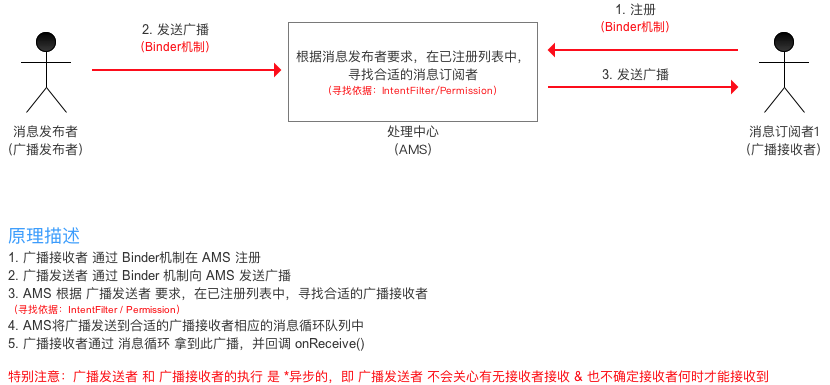

# BroadcastReceiver 知识

## 介绍
　　BroadcastReceiver ，广播接受者，用来接收来自系统和应用中的广播，是 Android 四大组件之一。

　　在 Android 系统中，广播体现在方方面面，例如当开机完成后系统会产生一条广播，接收到这条广播就能实现开机启动服务的功能；当网络状态改变时系统会产生一条广播，接收到这条广播就能及时地做出提示和保护数据等操作；当电池电量改变时，系统会产生一条广播，接收到这条广播就能在电量低时告知用户及时保存进程等等。Android 中的广播机制设计的非常出色，很多事情原本需要开发者亲自操作的，现在只需等待广播告知自己就可以了，大大减少了开发的工作量和开发周期。

　　应用场景：Android 不同组件间的通信（含：应用内/不同应用之间）、多线程通信、与 Android 系统在特性情况下的通信（如：电话呼入时、网络可用时）。

## BroadcastReceiver 的两种常用类型

#### Normalbroadcasts：默认广播
　　发送一个默认广播使用 Context.sendBroadcast() 方法，普通广播对于多个接受者来说是完全异步的，通常每个接受者都无需等待即可接收到广播，接受者相互之间不会有影响。对于这种广播，接收者无法终止广播，即无法阻止其他接收者的接收动作。

#### orderedbroadcasts：有序广播
　　发送一个有序广播使用 Context.sendorderedBroadcast() 方法，有序广播比较特殊，它每次只发送到优先级较高的接受者那里，然后由优先级高的接受者再传播到优先级低的接受者那里，优先级高的接受者有能力终止这个广播。

　　发送有序广播：sendorderedBroadcast()

　　在注册广播中的 <intent-filter> 中使用 android:priority 属性。这个属性的范围在 -1000 到 1000 ，数值越大，优先级越高。在广播接受器中使用 setResultExtras 方法将一个 Bundle 对象设置为结果集对象，传递到下一个接收者那里，这样优先级低的接受者可以用 getResultExtras 获取到最新的经过处理的信息集合。使用 sendorderedBroadcast 方法发送有序广播时，需要一个权限参数，如果为 null 则表示不要求接受者声明指定的权限，如果不为 null 则表示接受者若要接收此广播，需声明指定权限。这样做是从安全角度考虑的，例如系统的短信就是有序广播的形式，一个应用可能是具有拦截垃圾短信的功能，当短信到来时它可以先接收到短信广播，必要时终止广播传递，必要时终止广播传递，这样的软件就必须声明接收短信的权限。

## 静态和动态注册方式
　　构建 Intent ，使用 sendBroadcast 方法发出广播定义一个广播接收器，该广播接收器继承 BroadcastReceiver，并且覆盖 onReceive() 方法来响应事件。注册该广播接收器，可以在代码中注册（动态注册），也可以在 AndroidManifest.xml 配置文件中注册（静态注册）。

#### 两种注册方式区别
　　广播接收器注册一种有两种形式：静态注册和动态注册。

　　两者及其接收广播的区别：

　　（1）动态注册广播不是常驻型广播，也就是说广播跟随 Activity 的生命周期。注意在 Activity 结束前，移除广播接收器。静态注册是常驻型，也就是说当应用程序关闭后，如果有信息广播来，程序也会被系统调用自动运行。

　　（2）当广播为有序广播时：优先级高的先接收（不分静态和动态）。同优先级的广播接收器，动态优先于静态。当广播为默认广播时：无视优先级，动态广播接收器优先于静态广播接收器。

　　（3）同优先级的同类广播接收器，静态：先扫描的优先于后扫描的。动态：先注册优先于后注册的。

　　（4）静态注册是在 AndroidManifesy.xml 里通过< receive > 标签声明的。不受任何组件的声明周期影响，缺点是耗电和占内存，适合在需要时刻监听使用。动态注册在代码中调用 Context.registerReceiver() 方法注册，比较灵活，适合在需要特定时刻监听使用。

## 使用
　　自定义广播接收者 BroadcastReceiver 需要继承 BroadcastReceiver 继承，并复写抽象方法  onReceive() 方法。

　　广播接收器接收到相应广播后，会自动回调 onReceive() 方法。一般情况下，onReceive 方法会涉及与其他组件之间的交互，如发送 Notification、启动 Service 等。默认情况下，广播接收器运行在 UI 线程，因此，onReceive() 方法不能执行耗时操作，否则将导致 ANR 。

#### 静态注册
　　注册方式：在 AndroidManifest.xml 里通过 receiver 标签声明。

　　属性说明：
```
<receiver
	//broadcastReceiver 是否接收其他 App 发出的广播
	android:enabled=["true" | "false"]
	//默认值是由 receiver 中有无 intent-filter 决定的：如果有 intetn-filter，默认为 true，否则为 false
	android:exported=["true" | "false"]
	android:icon="drawable resource"
	android:label="string resource"
	//继承 BroadcastReceiver 子类的类名
	android:name=".MyBroadcastReceiver"
	//具有相应权限的广播发送者发送的广播才能被此 BroadcastReceiver 所接收。
	android:permission="string"
	//BroadcastReceiver 运行所处的进程，默认为 app 进程，可以指定独立进程
	android:process="string"
>
	//用于指定此广播接收器将接收的广播类型
	<intent-filter>
		<action android:name="android.net.conn.CONNECTIVITY_CHANGE">
	</intent-filter>
</receiver>
```
　　当 App 首次启动时，系统会自动实例化 BroadcastReceiver 类，并注册到系统中。

#### 动态注册
　　注册方式：在代码中调用 Context.registerReceiver() 方法。

　　使用：调用 registerReceiver() 注册广播，使用 unregisterReceiver() 销毁广播。

　　动态广播最好在 Activity 的 onResume() 注册、onPause() 注销。有注册就必然得有注销，否则会导致内存泄漏。不在 onCreate() 与 onDestory() 或 onStart() 与 onStop() 注册、注销是因为当系统因为内存不足要回收 Activity 占用的资源时，Activity 在执行完 onPause() 方法后就会被销毁，有些生命周期方法 onStop()、onDestory() 就不会执行。当再回到此 Activity 时，是从 onCreate() 方法开始执行的。

　　假设将广播的注销放在 onStop()、onDestory() 方法里的话，有可能在 Activity 被销毁后还为执行 onStop()、onDestory() 方法，即广播仍还未注销，从而导致内存泄漏。但是，onPause() 一定会被执行，从而保证了广播在 App 死亡前一定会被注销，从而防止内存泄漏。

## 广播发送者向 AMS 发送广播

#### 广播的发送
　　广播是用“意图（Intent）”标识，定义广播的本质是定义广播所具备的“意图（Intent）”，广播发送就是广播发送者将此广播的“意图（Intent）”通过 sendBroadcast() 方法发送出去。

#### 广播的类型
　　广播的类型主要分为 5 类：
* 普通广播（Normal Broadcast）
* 系统广播（System Broadcast）
* 有序广播（Ordered Broadcast）
* 粘性广播（Sticky Broadcast）
* App 应用内广播（Local Broadcast）

###### 普通广播（Normal Broadcast）
　　开发者自身定义 Intent 的广播（最常用）。使用 sendBroadcast() 发送广播。

###### 系统广播（System Broadcast）
　　Android 中内置了多个系统广播：只要涉及到手机的基本操作（如开机、网络状态变化、拍照等等），都会发出相应的广播。

　　每个广播都有特定的 Intent-Filter(包括具体的 action)，Android 系统广播 action 如下：

| 系统操作 | action |
|--------|--------|
| 监听网络变化 | android.net.conn.CONNECTIVITY_CHANGE |
| 关闭或打开飞行模式 | Intent.ACTION_AIRPLANE_MODE_CHANGED |
| 充电时或电量发生变化 | Intent.ACTION_BATTERY_CHANGED |
| 电池电量低 | Intent.ACTION_BATTERY_LOW |
| 电池电量充足（即从电量低变化到饱满时会发出广播） | Intent.ACTION_BATTERY_OKAY |
| 系统启动完成后（仅广播一次） | Intent.ACTION_BOOT_COMPLETE |
| 按下照相时的拍照按钮（硬件按键）时 | Intent.ACTION_CAMERA_BUTTON |
| 屏幕锁屏 | Intent.ACTION_CLOSE_SYSTEM_DIALOGS |
| 设备当前设置被改变时（界面语言、设备方向等） | Intent.ACTION_CONFIGURATION_CHANGED |
| 插入耳机时 | Intent.ACTION_HEADSET_PLUG |
| 未正确移除 SD 卡但已取出来时（正确移除方法：设置-SD 卡和设备内存-卸载 SD 卡） | Intent.ACTION_MEDIA_BAD_REMOVAL |
| 插入外部存储装置（如 SD 卡） | Intent.ACTION_MEDIA_CHECKING |
| 成功安装 APK | Intent.ACTION_PACKAGE_ADDED |
| 成功删除 APK | Intent.ACTION_PACKAGE_REMOVED |
| 重启设备 | Intent.ACTION_REBOOT |
| 屏幕被关闭 | Intent.ACTION_SCREEN_OFF |
| 屏幕被打开 | Intent.ACTION_SCREEN_ON |
| 关闭系统时 | Intent.ACTION_SHUTDOWN |
| 重启设备 | Intent.ACTION_REBOOT |

　　当使用系统广播时，只需要在注册广播接收者时定义相关的 action 即可，并不需要手动发送广播，当系统有相关操作时会自动进行系统广播。

###### 有序广播
　　有序广播：发送出去的广播被广播接受者按照先后顺序接收。

　　广播接受者接收广播的顺序负责（同时面向静态和动态注册的广播接收者）：1.按照 Priority 属性值从大-小排序；2.Priority 属性相同者，动态注册的广播优先。

　　特定：1.接收广播按顺序接收；2.先接收的广播接收者可以对广播进行截断，即后接收的广播接收者不再接收到此广播；3.先接收的广播接收者可以对广播进行修改，那么后接收的广播接收者将接收到被修改后的广播。

　　具体使用：有序广播的使用过程与普通广播非常类似，差异在于广播的发送方式：sendOrderBroadcast()。

###### App 应用内广播（Local Broadcast）
　　Android 中的广播可以跨 App 直接通信（exported 对于有 intent-filter 情况下默认值为 true）。

　　冲突：可能出现的问题:1.其他 App 针对性发出与当前 App intent-filter 相匹配的广播，由此导致当前 App 不断接收广播并处理；2.其他 App 注册与当前 App 一致的 intent-filter 用于接收广播，获取广播具体信息。即会出现安全性和效率性的问题。

　　解决方案：使用 App 应用内广播（Local Broadcast）。1.App 应用内广播可以理解为一种局部广播，广播的发送者和接收者都同属于一个 App。2.相比于全局广播（普通广播），App 应用内广播优势体现在：安全性高和效率高。

　　具体使用1-将全局广播设置为局部广播：1.注册广播时将 exported 属性设置为 false，使得非本 App 内部发出的此广播不被接收；2.在广播发送和接收时，增设相应权限 permission，用于权限验证；3.发送广播时指定该广播接收器所在的包名，此广播将只会发送到此包中的 App 内与之相匹配的有效广播接收器中。

　　具体使用2-使用封装好的 LocalBroadcastManager 类，使用方式上与全局广播几乎相同，只是注册/取消注册广播接收器和发送广播是将参数的 context 变成了 LocalBroadcastManager 的单一实例。对于 LocalBroadcastManager 方式发送的应用内广播，只能通过 LocalBroadcastMananger 动态注册，不能静态注册。

###### 粘性广播（Sticky Broadcast）
　　在 Android 5.0 (API 21)中已经失效，不建议使用。

#### 注意
　　对于不同注册方式的广播接收器回调 onReceiver(Context context,Intent intent)中的 context 返回值是不一样的：
* 对于静态注册（全局+应用内广播），回调onReceiver(Context，intent)中的 context 返回值是：广播接收者受限的 Context；
* 对于全局广播的动态注册，回调 onReceiver(Context,intent)中的 context 返回值是：Activity context；
* 对于应用内广播的动态注册（LocalBroadcastMananger 方式），回调 onReceive(Context,intent)中的 context 返回值是：Application context；
* 对于应用内广播的动态注册（非 LocalBroadcastManager 方法），回调 onReceive(context,intent)中的 context 返回值：Activity context。

## 实现原理

#### 采用的模型
　　Android 中的广播使用了设计模式中的观察者模式：基于消息的发布 / 订阅事件模型。Android 将广播的发送者和接受者解耦，使得系统方便集成、更易扩展。

#### 模型讲解

　　模型中有 3 个角色：1.消息订阅者（广播接受者），2.消息发布者（广播发布者），3.消息中心（AMS，即 Activity Manager Service）。



## 参考文章
[Android 广播Broadcast的两种注册方式静态和动态](https://blog.csdn.net/csdn_aiyang/article/details/68947014)
[Android四大组件：BroadcastReceiver史上最全面解析](https://blog.csdn.net/carson_ho/article/details/52973504)
[安卓广播的底层实现原理](https://www.jianshu.com/p/02085150339c)