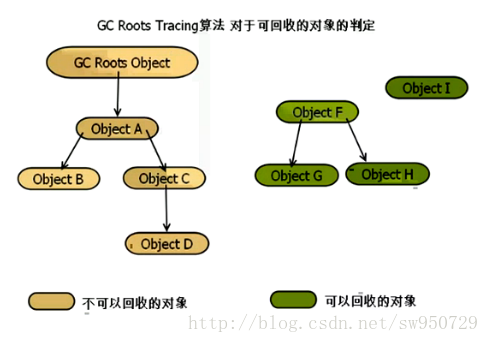

# 性能优化

　　性能优化有几个方面：一、内存优化；二、UI 优化（布局优化和绘制优化）；三、速度的优化（线程优化/网络优化）；四、电量优化；五、启动优化。

## 内存优化
　　什么是内存泄漏？内存不在 GC 的掌控范围之内了。那么 java 的 GC 内存回收机制是什么？某对象不再有任何引用的时候才会进行回收。

　　当向上寻找，一直寻找到 GC Root 的时候，此对象不会进行会回收；如果数据在整个页面或整个项目都没有引导，则这个对象会被 GC 掉。

#### GC 的引用点
1. Java 栈中引用的对象
2. 方法静态引用的对象
3. 方法常量引用的对象
4. Native 中 JNI 引用的对象
5. Thread - "活着的"线程

#### 内存溢出

###### 分析原因

　　内存泄漏一般导致应用卡顿，极端情况会导致项目 boom。Boom 的原因是因为超过内存的阈值。原因只要有两方面：
* 代码存在泄漏，内存无法及时释放导致 oom。
* 一些逻辑消耗了大量内存，无法及时释放或者超过导致 oom。

　　所谓消耗大量的内存的，绝大多数是因为图片加载。这是 oom 出现最频繁的地方。

#### 内存分析工具
　　性能优化工具：
* Heap SnapShot 工具
* Head Views 工具
* LeakCanary 工具
* MAT 工具
* TraceView 工具（Device Monitor）

#### 注意事项
* 尽量不要使用 Activity 的上下文，而是使用 application 的上下文，因为 application 的生命周期长，进程退出时才会被销毁。所以，单例模式是最容易造成内存泄漏的根本所在，因为单例模式的生命周期应该和 application 的生命周期一样长，而不是和 Activity 的相同。
* Animation 也会导致内存溢出，因为当使用 view 显示动画时，导致 view 被 Activity 持有，而 Activity 又持有 view。最后因为 Activity 无法释放，导致内存泄漏。解决方法是在 Activity 的 onDestory() 方法中调用 Animation.cancle() 进行停职，当然一些简单的动画可以通过自定义 view 来解决。

> 3.内存优化


## UI 优化
　　UI 优化主要包括布局优化以及 view 的绘制优化。

　　什么情况会导致卡顿？一般是如下几种情况：
1. 人为在 UI 线程中做轻微耗时操作，导致 UI 线程卡顿；
2. 布局 Layout 过于复杂，无法在 16 ms 内完成渲染；
3. 同一时间动画执行的次数过多，导致 CPU 或 GPU 负载过重；
4. View 过度绘制，导致某些像素在同一帧时间内被绘制多次，从而使 COU 或 GPU 负载过重；
5. View 频繁的触发 measure、layout，导致 measure、layout 累计耗时过多及整个 View 频繁的重新渲染；
6. 内存频繁触发 GC 过多（同一帧中频繁创建内存），导致暂时阻塞渲染操作；
7. 冗余资源及逻辑等导致加载和执行缓慢；
8. ANR；

#### 布局优化

###### GPU 绘制
　　对于 UI 性能的优化可以通过开发者选项中的 GPU 过度绘制工具来进行分析。在设置 -> 开发者选项 -> 调试 GPU 过度绘制中打开调试。

　　开启后在我们想要调试的应用界面中可以看到各种颜色的区域，具体含义如下：

| 颜色 | 含义 |
|--------|--------|
| 无色 | WebView 等的渲染区域 |
| 蓝色 | 1x 过度渲染 |
| 绿色 | 2x 过度渲染 |
| 淡红色 | 3x 过度渲染 |
| 红色 | 4x(+) 过度渲染 |

　　目标就是尽量减少红色 Overdraw，看到更多的蓝色区域。

　　Overdraw 有时候是因为 UI 布局存在大量重叠的部分，还有的时候是因为非必要的重叠背景。例如某个 Activity 有一个背景，然后里面的 Layout 又有自己的背景，同时子 View 又分别有自己的背景。仅仅是通过移除非必要的背景图片，这就能减少大量的红色 Overdraw 区域，增加蓝色区域的占比。这一措施能够显著提升程序性能。

　　如果布局中既能采用 RelativeLayout 和 LinearLayout，那么直接使用 LinearLayout，因为 RelativeLayout 布局比较复杂，绘制的时候需要花费更多的 CPU 时间。如果需要多了 LinearLayout 或者 FrameLayout 嵌套，那么可采用 RelativeLayout。因为多层嵌套导致布局的绘制有大部分是重复的，这会减少程序的性能。

###### GPU 呈现模式分析
　　可以打开设置 -> 开发者选项 -> GPU 呈现模式分析 -> 在屏幕上显示为条形图。

　　也可以在执行完 UI 滑动操作后在命令行输入如下命令查看命令行打印的 GPU 渲染数据（分析依据：Draw + Process + Execute = 完整的显示一帧时间 < 16ms）：
```
	adb shell dumpsys gfxinfo [应用包名]
```

　　随着界面的刷新，界面上会以实时柱状图来显示每帧的渲染时间，柱状图越高表示渲染时间越长，每个柱状图偏上都有一根表示 16ms 基准的绿色横线，每一条竖着的柱状线都包含三部分（蓝色代表测量绘制 Display List 的时间，红色代表 OpenGL 渲染 Display List 所需要的时间，黄色代表 CPU 等待 GPU 处理的时间），主要每一帧的总时间低于基准线就不会发生 UI 卡顿问题（个别超出基准线其实也不算什么问题的）。

> 1.布局优化

###### 优化 1.0
1. 如果父控件有颜色，也有自己需要的颜色，那么就不必在子控件加背景颜色。
2. 如果每个子控件的颜色不太一样，而且可以完全覆盖父控件，那么就不需要在子控件上加背景颜色。
3. 尽量避免不必要的嵌套。
4. 能用 LinearLayout 和 FrameLayout，就不要用 RelativeLayout，因为 RelativeLayout 控件想对比较复杂，测试也相对耗时。

　　针对嵌套布局，goognle 提出了 include、merge 和 ViewStub 。

　　include 可以提高布局的复用性，大大方便开发，include 没有减少布局的嵌套，但是 include 和 merge 联手搭配，还是不错的。

　　merge 的布局取决于父控件是哪个布局，使用 merge 相当于减少了自身的一层布局，直接采用父 include 的布局，当然直接在父布局里面使用意义不大，所以会和 include 配合使用，即增加了布局的复用性，也减少了一层布局嵌套。

　　ViewStub 可以按需加载，在需要的时候 ViewStub 中的布局才加载到内存。对于一些进度条，提示信息等等少次数使用的功能，使用 ViewStub 很合适。

###### 优化 1.1
5. 使用 include 和 merge 增加复用，减少层级。
6. ViewStub 按需加载，更加轻便。

　　ConstraintLayout 可以有效地解决布局嵌套过多的问题。ConstraintLayout 使用约束的方式来指定各个控件的位置和关系，有点类似于 RelativeLayout，但远比 RelativeLayout 要更强大。所以简单布局简单处理，复杂布局 ConstraintLayout 很好使。

###### 优化 1.2
7. 复杂界面可选择 ConstraintLayout，可有效减少层级。


#### 代码优化
　　Android Studio 有自带的代码检查工具。打开 Analyze -> Run Inspection by Name... -> unused resource 点击开始检测。

　　也可以将鼠标放在代码区点击右键 -> Analyze -> Inspect Code -> 界面选择你要检测的模块 ->点击确认开始检测。

　　上面的方法是最容易找到代码缺陷以及无用代码的地方。

#### 绘制优化
　　什么是绘制优化？绘制优化主要是指 View 的 Ondraw 方法需要避免执行大量的操作。分为 2 个方面：
* ondraw 方法不需要创建新的布局对象，这是因为 ondraw 方法是实时执行的，这样会产生大量的临时对象，导致占用了很多的内存，并且使系统不断的 GC，降低了执行效率。
* ondraw 方法不需要执行耗时操作，在 onDraw 方法里少使用循环，因为循环会占用 CPU 的时间。导致绘制不流畅、卡顿等等。Google 官方指出，view 的绘制帧率稳定在 60 dps ，这要求每帧的绘制时间不超过 16 ms(1000/60)。虽然很难保证，但我们需要尽可能的降低。

　　60 dps 是目前最合适的图像显示速度，也是绝大部分 Android 设备设置的调试频率，如果在 16 ms 内顺利完成界面刷新操作可以展示出流畅的画面，而由于任何原因导致接收到 VSYNC 型号的时候无法完成本次刷新操作，就会产生掉帧的现象，刷新帧率自然也就跟着下降（假定刷新帧率由正常的 60 fps 降到 30 fps，用户就会明显感知到卡顿）。

> 2.绘制优化

　　其实布局优化了对于性能提升影响不算很大，但是是最容易入手、最直接接触的优化，所以不管能提升多少，哪怕只有百分之一的提升，也要做，因为影响性能的地方太多了，每个部分都提升一点，应用就可以提升很多了。

　　平时感觉的卡顿问题最主要的原因之一是因为渲染性能，因为越来越复杂的界面交互，其中可能添加了动画、图片等等。希望创造出越炫的交互界面，同时也希望可以流畅显示，但是往往卡顿就会发生在这里。

　　这个是 Android 的渲染机制造成的，Android 系统每隔 16ms 发出 VSYNC 信号，触发对 UI 进行渲染，但是渲染未必成功，如果成功了那么代表一切顺利，但是失败了可能就要延误时间，或者直接跳过去，给人视觉上的表现就是要么卡了一会，要么跳帧。

　　View 的绘制频率保证 60 fps 是最佳的，这就要求每帧绘制时间不超过 16ms(16ms = 1000/60)，虽然程序很难保证 16 ms 这个时间，但是尽量降低 onDraw 方法中的复杂度总是切实有效的。

　　解决方法：
**第一点：**onDraw 方法中不要做耗时的任务，也不做过多的循环操作，特别是嵌套循环，虽然每次循环耗时很小，但是大量的循环势必霸占 CPU 的时间片，从而造成 View 的绘制过程不流畅。

**第二点：**除了循环之外，onDraw() 中不要创建新的布局对象，因为 onDraw() 方法一般都会频繁大量调用，就意味着会产生大量的临时对象，不仅占用内存，而且会导致系统更加频繁的 GC，大大降低程序的执行速度和效率。

###### 优化 2.0
8. onDraw 中不要创建新的布局对象
9. onDraw 方法中不要做耗时的任务


## 网络优化
　　可以通过 Memory 下面的 Net 进行网络的监听。

#### ANR 问题
　　什么是 ANR？application not responding，应用程序无响应。那么一般什么时候会出现 ANR？Android 官方规定：activity 如果在 5s 内无响应事件（屏幕触摸事件或者键盘输入事件），BroadcastReceiver 如果在 10s 内无法处理完成，Service 如果在 20s 内无法处理完成，这三种情况会导致 ANR。

#### 线程优化
　　出现 ANR 的三种情况，绝大多数就是因为线程阻塞导致的。那么如何处理呢？Android 系统提供了若干组工具类来解决此问题：
* Asynctask：为 UI 线程与工作线程之间进行快速处理的切换提供一种简单边界的机制。适用于当下立即需要启动，但是异步执行的生命周期短暂的场景。
* HandlerThread：为某些回调方法或者等待某些执行任务设置一个专属的线程，并提供线程任务的调度机制。
* ThreadPool：把任务分解成不同的单元，分发到各个不同的线程上，进行同时并发处理。
* IntentService：适合执行由 UI 触发的后台任务。并可以把这些任务执行的情况进行一定的机制反馈给 UI。

　　网络请求耗时会给用户带来卡顿的产品体验，虽然可以使用 Loading 提升用户体验，但属于治标不治本。

　　一般多线程的情况可以通过 Asynctask 处理。这个可以快捷方便的处理多线程而且不会导致线程阻塞，而且也可以控制线程的顺序。

#### KO 网络优化
　　网络优化最重要就是时间、速度和成功率了。

###### 图片处理
* 使用 WebP 格式；同样的图片，采用 WebP 格式可大幅节省流量，相对于 JPG 格式的图片，流量能节省将近 25% 到 35%；相对于 PNG 格式的图片，流量可以节省将近 80%。最重要的是使用 WebP 之后图片质量也没有改变。

* 使用缩略图；

###### 网络请求处理
　　可以对服务器返回数据进行缓存，设定有效时间，有效时间之内不走网络请求，减少流量消耗。可以使用 HttpResponseCache 对网络进行缓存。

　　在某些情况下，尽量少使用 GPS 定位，如果条件允许，尽可能使用网络定位。

　　下载、上传，尽可能使用断点。

　　刷新数据时，尽可能使用局部刷新，而不是全局刷新。第一、界面会闪屏一下，网差的界面直接白屏一段时间也不是不可能；第二，流量的使用，很浪费。

## 启动优化
　　众所周知，一个好的产品，除了功能强大，好的性能也必不可少。有调查显示，近 50% 的受访者因为 apk 太大而拒绝使用，近 40% 的受访者会因为 App 性能差而卸载，性能也是造成 App 用户沮丧的头号原因。

　　安卓应用的启动方式分为三种：冷启动、暖启动、热启动，不同的启动方式决定了应用 UI 对用户可见所需要花费的时间长短。顾名思义，冷启动消耗的时间最长。基于冷启动方式的优化工作也是最考验产品用户体验的地方。

#### 冷启动
　　为什么说冷启动是耗时最长的？冷启动是在启动应用前，系统没有获取到当前 app 的 activity、Service 等等。例如，第一次启动 app。又或者说杀死进程后第一次启动。那么对比其他两种当时，冷启动自然是耗时最长的。

　　应用发生冷启动时，系统一定会执行下面的三个任务：
* 开始加载并启动应用
* 应用启动后，显示一个空白的启动窗口（启动闪屏页）
* 创建应用信息

　　那么创建应用信息，系统就需要做一屁股的事：
* application 的初始化
* 启动 UI 线程
* 导入视图（inflate view）
* 计算视图大小（onmesure view）
* 得到视图排版（onlayout view）
* 绘制视图（ondraw view）

　　这其中有两个 creation 工作，分别是 Application 和 Activity creation，均在 View 绘制展示之前。所以，在应用自定义的 Application 类和第一个 Activity 类中，onCreate() 方法做的事情越多，冷启动消耗的时间越长。

#### 暖启动
　　当应用中的 Activities 被销毁，但在内存中常驻时，应用的启动方式就会变为暖启动。相比冷启动，暖启动过程减少了对象初始化、布局加载等工作，启动时间更短。但启动时，系统依然会展示闪屏页，直到第一个 Activity 的内容呈现为止。

#### 热启动
　　相比暖启动，热启动时应用做的工作更少，启动时间更短。热启动产生的常见很多，常见如：用户使用返回键退出应用，然后马上又重新启动应用。

#### 如何优化
　　对于冷启动时间长，可以改变项目的 theme，修改为 launch 的 theme。一般项目都会有闪屏页，从闪屏页跳转到首页，倒计时结束就自动进入首页，可以在闪屏页进行一些必要的加载，例如用户信息，定位等等，至于其他的，可以进入主页进行预加载。

　　还可以把闪屏页当作一个 fragment 嵌套在 MainActivity，那么可以在进入闪屏时直接预加载主页的 view。倒计时结束后，把闪屏页 remove 掉直接显示首页。

　　对启动优化总结就是减少耗时操作：
* 主线程中涉及到 Shareperference 能否在非 UI 线程执行。
* Application 的创建过程中尽量少的进行耗时操作。
* 减少布局的层次，并且生命周期回调的方法中尽量减少耗时的操作。

## 电量优化

#### 耗电概念
　　众所周知，音乐和视频其实是耗电量最大的。如果用户一旦发现应用非常耗电，大多数就会选择卸载来解决此类问题。

#### 如何优化
　　其实把其他 4 个优化解决了，就是最好的电量优化。对于电量优化的一些建议：
* 需要进行网络请求是，首先判断网络当前的状态。
* 在多网络请求的情况下，最好进行批量处理，尽量避免频繁的间隔网络请求。
* 在同时有 wifi 和移动数据的情况下，应该直接屏蔽移动数据的网络请求，只有当 wifi 断开时再调用，因为，wifi 请求的耗电量远比移动数据的耗电量低的低。
* 后台任务要尽可能少的唤醒 CPU。（比如，锁屏时，QQ 的消息提示行就是唤醒了 COU，但是他的提示只有在你打开锁屏或者进行充电时才会进行提示）。

## 参考文章
[Android性能优化全方面解析](https://juejin.im/post/5a0d30e151882546d71ee49e)
[Android 性能优化最佳实践](https://juejin.im/post/5b50b017f265da0f7b2f649c)
