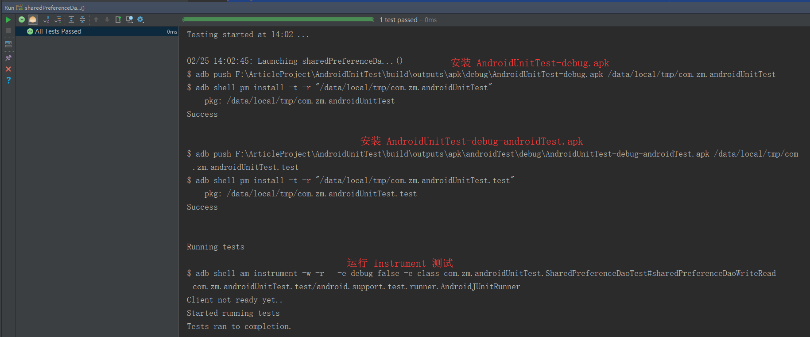

# Android单元测试之四：仪器化测试

# 1. 仪器化测试

　　在某些情况下，虽然可以通过模拟的手段来隔离 Android 依赖，但代价很大，这种情况下可以考虑仪器化的单元测试，有助于减少编写和维护模拟代码所需的工作量。

　　仪器化测试是在真机或模拟器上运行的测试，它们可以利用 Android framework APIs 和 supporting APIs 。如果测试用例需要访问仪器（instrumentation）信息（如应用程序的 Context ），或者需要 Android 框架组件的真正实现（如 Parcelable 或 SharedPreferences 对象），那么应该创建仪器化单元测试，由于要跑到真机或模拟器上，所以会慢一些。

# 2. 如何进行仪器化测试

　　测试使用 SharedPreferences 的工具类，使用 SharedPreferences 需要访问 Context 类以及 SharedPreferences 的具体实现，采用模拟隔离的话代价会比较大，所以采用仪器化测试比较合适。

## 2.1. 配置

```xml
dependencies {
	...
    androidTestCompile 'com.android.support:support-annotations:26.1.0'
    androidTestImplementation 'com.android.support.test:runner:1.0.2'
    androidTestCompile 'com.android.support.test:rules:1.0.2'
}
```

```xml
defaultConfig {
    ...
	testInstrumentationRunner "android.support.test.runner.AndroidJUnitRunner"
}
```

## 2.2. 测试

**被测试类**

```java
package com.zm.androidUnitTest;

import android.content.Context;
import android.content.SharedPreferences;

/**
 * Author: zhangmiao
 * Date: 2018/9/25
 */
public class SharedPreferenceDao {
    private SharedPreferences sp;

    public SharedPreferenceDao(SharedPreferences sp) {
        this.sp = sp;
    }

    public SharedPreferenceDao(Context context) {
        this(context.getSharedPreferences("config", Context.MODE_PRIVATE));
    }

    public void put(String key, String value) {
        SharedPreferences.Editor editor = sp.edit();
        editor.putString(key, value);
        editor.apply();
    }

    public String get(String key) {
        return sp.getString(key, null);
    }
}
```

**测试类**
```java
package com.zm.androidUnitTest;

import android.support.test.runner.AndroidJUnit4;

import org.junit.Assert;
import org.junit.Before;
import org.junit.Test;
import org.junit.runner.RunWith;

/**
 * Author: zhangmiao
 * Date: 2018/9/25
 */
@RunWith(AndroidJUnit4.class)
public class SharedPreferenceDaoTest {
    public static final String TEST_KEY = "name";
    public static final String TEST_STRING = "zhangmiao";

    SharedPreferenceDao spDao;

    @Before
    public void setUp() {
        spDao = new SharedPreferenceDao(App.getAppContext());
    }

    @Test
    public void sharedPreferenceDaoWriteRead() {
        spDao.put(TEST_KEY, TEST_STRING);
        Assert.assertEquals(TEST_STRING, spDao.get(TEST_KEY));
    }
}
```

　　运行方式和本地单元测试一样，这个过程会向连接的设备安装 apk。

**测试结果**



　　通过测试结果可以清晰看到状态 passed ，仔细看打印的 log ，可以发现，这个过程向模拟器安装了两个 apk 文件，分别是 AndroidUnitTest-debug.apk 和 AndroidUnitTest-debug-androidTest.apk ， instrumented 测试相关的逻辑在 AndroidUnitTest-debug-androidTest.apk 中。

# 3. 参考文章

1. [Android单元测试只看这一篇就够了](https://www.jianshu.com/p/aa51a3e007e2)

