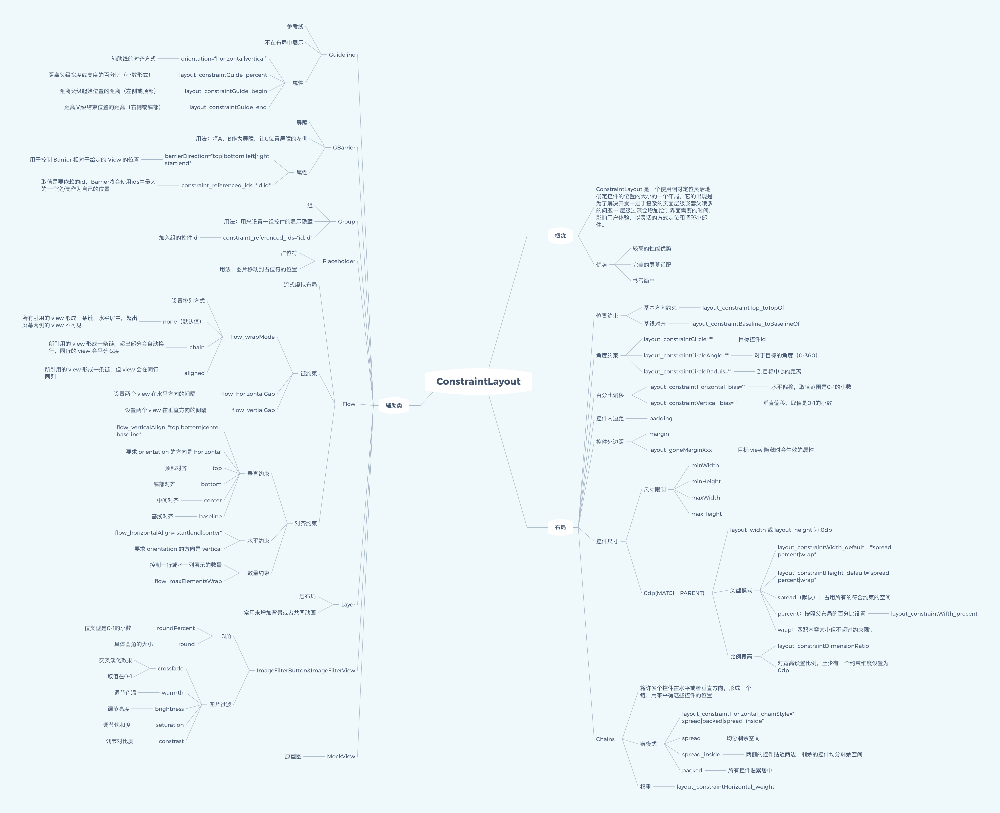

# ConstraintLayout MotionLayout



> MotionLayout
> 
> MotionLayout 是 ConstraintLayout 2.0 的布局容器，ConstraintLayout 的子类，用来在多个约束状态之间做过渡动画。
> 
> Motion 专用的 helper
> 
> * 

## MotionLayout

MotionLayout 是 ConstraintLayout 2.0 的布局容器，ConstraintLayout 的子类，用来在多个约束状态之间做可拖动、可插值的过渡动画。

它提供了一个丰富的动画系统来协调多个视图之间的动画效果。MotionLayout 基于 ConstraintLayout，并在其之上进行了扩展，允许在多组约束（或者 ConstraintSets）之间进行动画的处理。您可以对视图的移动、滚动、缩放、旋转、淡入淡出等一系列动画行为进行自定义，甚至可以定义各个动画本身的自定义属性。它还可以处理手势操作所产生的物理移动效果，以及控制动画的速度。

使用 MotionLayout 构建的动画是可追溯且可逆的，这意味着您可以随意切换到动画过程中任意一个点，甚至可以倒着执行动画效果。Android Studio 继承了 Motion Editor（动作编辑器），可以利用它来操作 MotionLayout 对动画进行生成、预览和编辑等操作。这样一来，在协调多个视图的动画时，就可以做到对各个细节进行精细操控。

MotionLayout 是把 ConstraintLayout 换成会动的根布局。

MotionLayout 继承了 ConstraintLayout 的全部约束能力。

**它解决什么问题**

以前做【布局从 A 变成 B 】常见做法：

| 方案                                         | 局限                         |
| ------------------------------------------ | -------------------------- |
| ObjectAnimator/ViewPropertyAnimator        | 一次改几个属性，复杂路径要手写            |
| TransitionManager.beginDelayedTransition() | 只能在两套约束之间自动插值，不好跟手势、不好加关键帧 |
| CoordinatorLayout                          | 主要跟滚动联动，通用状态动画弱            |
| 包一层再对 Layer 做变换                            | 只适合整租旋转/缩放，不能换约束关系         |

MotionLayout 把这些收成一套 XML：

* 起点、终点是两套 ConstraintSet（约束状态）

* 中间怎么走由 Transition + KeyFrame 描述

* 进度 0 -> 1，可以自动播，也可以跟手指拖（可 seek）

基本结构：布局 + MotionScene

布局只放控件，动画写在单独的 res/xml/ 里，用 app:layoutDescription 指过去。MotionScene 里的约束优先于布局文件里的约束。

res/layout/activity_deml.xml

```xml
<androidx.constraintlayout.motion.widget.MotionLayout
    android:id="@+id/motion_layout"
    android:layout_width="match_parent"
    android:layout_height="match_parent"
    app:layoutDescription="@xml/scene_button">

    <View
        android:id="@+id/button"
        android:layout_width="64dp"
        android:layout_height="64dp"
        android:background="#FF9800" />

</androidx.constraintlayout.motion.widget.MotionLayout>
```

res/xml/scene_button.xml

```xml
<MotionScene xmlns:android="http://schemas.android.com/apk/res/android"
    xmlns:motion="http://schemas.android.com/apk/res-auto">

    <Transition
        motion:constraintSetStart="@id/start"
        motion:constraintSetEnd="@id/end"
        motion:duration="1000">
        <OnSwipe
            motion:touchAnchorId="@id/button"
            motion:touchAnchorSide="right"
            motion:dragDirection="dragRight" />
    </Transition>

    <ConstraintSet android:id="@+id/start">
        <Constraint
            android:id="@id/button"
            android:layout_width="64dp"
            android:layout_height="64dp"
            android:layout_marginStart="8dp"
            motion:layout_constraintStart_toStartOf="parent"
            motion:layout_constraintTop_toTopOf="parent"
            motion:layout_constraintBottom_toBottomOf="parent" />
    </ConstraintSet>

    <ConstraintSet android:id="@+id/end">
        <Constraint
            android:id="@id/button"
            android:layout_width="64dp"
            android:layout_height="64dp"
            android:layout_marginEnd="8dp"
            motion:layout_constraintEnd_toEndOf="parent"
            motion:layout_constraintTop_toTopOf="parent"
            motion:layout_constraintBottom_toBottomOf="parent" />
    </ConstraintSet>
</MotionScene>
```

效果：按钮从左边滑到右边，手指拖也能停在任意进度。

概念：

| 概念               | 作用                                |
| ---------------- | --------------------------------- |
| MotionScene      | 动画说明书，放 res/xml                   |
| ConstraintSet    | 某一刻所有 View 的约束（位置、大小、显隐、alpha...） |
| Transition       | 从哪个 Set 到哪个 Set，时长多少              |
| OnClick/ OnSwipe | 点击或滑动驱动过渡                         |
| KeyFrameSet      | 在 0% ~ 100% 的某帧插入额外属性             |

常用关键帧：

| 关键帧          | 改什么                               |
| ------------ | --------------------------------- |
| KeyPosition  | 运动路径（不走直线，中途拐一下）                  |
| KeyAttribute | alpha、rotation、scale、elevation... |
| KeyCycle     | 周期性抖动/波浪                          |
| KeyTrigger   | 进度到某点触发回调或点击                      |

代码里也可以控进度：

```kotlin
motionLayout.transitionToEnd()
motionLayout.transitionToStart()
motionLayout.progress = 0.5f
motionLayout.setTransition(R.id.start, R.id.end)
```

* 主要一组控件一起转/缩：用 Layer，不必上 MotionLayout。

* 要折叠头图、侧栏展开、按钮飞到另一角、多状态 UI：用 MotionLayout。

**Motion 专用 Helper**

主要给 MotionLayout 用：

| Helper            | 作用                  |
| ----------------- | ------------------- |
| Carousel          | 在 MotionLayout 里做轮播 |
| MotionEffect      | 给过渡加额外运动效果          |
| MotionPlaceholder | Motion 场景里的占位       |

普通 Helper（Guideline、Barrier、Group、Layer、Flow...）放进 MotionLayout 里照样能用。

使用注意：

1. 根布局要从 ConstraintLayout 改成 MotionLayout，并指定 app:layoutDescription。

2. 要做动画的 View 必须在 ConstraintSet 里有对应 Constraint（id 对得上）。CinstraintSet 会整份替换该 View 的约束，不是和布局文件合并着玩。

3. 一个 MotionScene 可以有多条 Transition（上滑、下滑各一条），系统按手势选最合适的。

4. 复杂列表、大量动态 item 仍更适合 RecyclerView；MotionLayout 擅长页面级、少量控件的状态过渡。

5. Android Studio 布局编辑器可 [Convert to MotionLayout]，会自动生成配套 MotionScene。

**和动画的区别**

约束就是某个状态下，View 被怎么摆（比如layout_constraintXXX_toXXXOf）。

属性动画（ObjectAnimator、view.animate()）：约束不动，只改怎么画。MotionLayout 的过渡改的是那套约束。

Layer 是一组 View 的绘制变换，约束也是不变的。

## Motion 专用的 helper

Carousel：在 MotionLayout 里做轮播

MotionEffect：给过渡加额外运动效果

MotionPlaceholder：Motion 场景里的占位

# 参考文章

1. [ConstraintLayout 用法全解析](jianshu.com/p/502127a493fb)
2. [史上最全ConstraintLayout使用详解！（建议收藏）](https://mp.weixin.qq.com/s/HDbPU-fej0L_YtMk41zeYg)
