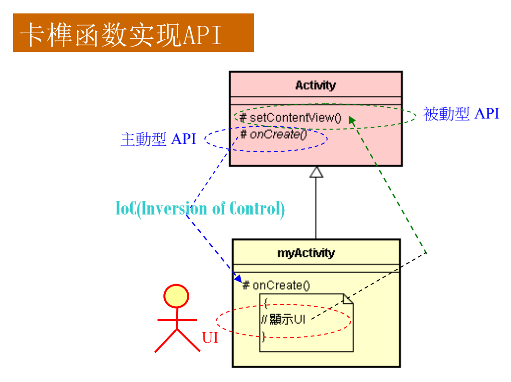

# 基本 OOP 知识

## "Oriented" 的涵意

"Object-Oriented" 相信任何软件都是由对象所构成的，而且 Nothing else。

## 对象（Object）

软件之对象（Software Object）是由数据（Data）和函数（Function）所组成。

## 类的用途：叙述软件对象

类（Class）是群体（或集合），二对象是类中的一份子。人们常用【是一个】（Is A）来表达对象与类间之关系。

类是一群具有共同重要特性之对象。类之定义就是说明这群对象具有什么的重要特性。特性包括对象之特征及行为。软件中之对象以数据来表达特征，以函数来表达行为。因之，类之定义就是说明软件中之对象，应含那些数据及那些函数。

## <基类/子类>结构用途（一）：表达继承

对众多对象加以分门别类，就可形成一个类继承体系。

## <基类/子类>结构用途（一）：表达组合

基类子类结构：继承、组合。

## <基类/子类>结构的接口（卡榫函数）

所谓卡榫（Hook），就是用来接合两个东西的接口。如果两个东西于不同时间出现，则一方会预留虚空，给予另一边于未来时刻能以实体来填补该空间，两者虚实相依，就密合起来了。设计优良的卡榫，可以让实体易于新陈代谢、抽换自如（Plug and Play，俗称 PnP）。

变于不变的分离（Separate code that changes from the code that doesn't）是设计卡榫（Hook）函数及应用框架之基本原则和手艺。

分离出变（Variant）与不变（Invariant）部分之后，就可以将不变部分写在父类别（Supperclass）里，而变的部分就写在子类别（Subclass）里。

### 卡榫函数的 Java 实现

在 Java 里，使用抽象（abstract） 函数或可覆写（overridable）函数来实现卡榫函数。

## IoC 机制与 Default 函数

### 卡榫函数实现 Ioc 机制

* 控制反转（Ioc：Inversion of Control）
* Ioc 机制源自于 OO 语言（如 C++ 等）的类别继承体系，例如 C++ 语言中，基类的函数可以主动调用子类的函数，这就是典型的 Ioc 机制。
* 基类与子类之间，主控权是在基类手上，通过 Hook 函数来调用子类。
* 通常基类是撰写在先，而子类则撰写在后，这种前辈拥有主导权，进而控制后辈之情形，就通称为控制反转。

### 默认（Default）行为

* 基类的重要功能：提供默认（预设）行为
* 基类可事先定义许多默认（Default）函数。这些默认函数可让子类来继承（或调用）之。

## API 的分类

API 这个名词，有 3 个密切关联的动词：

* 定义（Define）
* 实作（Implement）
* 呼叫（Invoke or Call）

根据这 3 个角度，可将 API 区分为【主动型】与【被动型】两种。

| API 类型   |                                                              |
| ---------- | ------------------------------------------------------------ |
| 被动型 API | 我（即强龙）定义 API 且我来实作 API 而让对方（即地头蛇）来呼叫我 |
| 主动型 API | 我定义 API 由地头蛇来遵循、实作 API 让我来呼叫对方 |

### API => 控制力

谁拥有接口的制定权，谁就掌握控制点，就能获得较大的主动权（或称为主导权），而位居强龙地位；而另一方则处于被动地位，称为弱势的一方，扮演地头蛇角色。

## 接口的表示

在 OOP 里，将接口定义为一种特殊的类别（Class）。

在 C++ 里，类别包括 3 种：

1. 一般（具象）类别

   -- 所有函数都是具象（内有指令）

2. 抽象（abstract）类别

   -- 有一个或多个函数是抽象的（内无指令）

3. 纯粹抽象 （pure abstract）类别

   -- 所有函数都是抽象的

在 Java 里，将上述的纯粹抽象类别称为接口（Interface）。

在 UML 里，以圆圈（:red_circle:）来表示接口。

