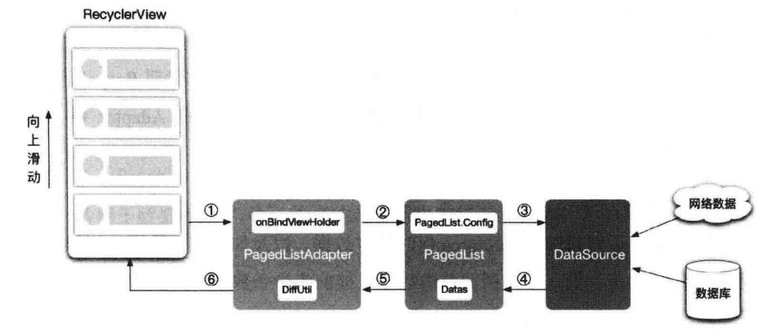

# 第 9 章 Paging

### 9.1. Paging 组件的意义

分页加载是在应用程序开发过程中十分常见的需求。经常需要以列表的形式加载大量的数据，这些数据通常来自网络或本地数据库。若所有数据一次性加载出来，必然需要消耗大量的时间和数据流量，然而用户实际需要的可能只是部分数据。因此，便有了分页加载。分页加载是对数据进行按需加载，在不影响用户体验的同时，还能节省数据流量，提升应用的性能。

Paging 就是 Google 为了方便 Android 开发者完成分页加载而设计的一个组件。它为几种常见的分页机制提供了统一的解决方案，让我们可以把更多的精力专注在业务代码上。

### 9.2. Paging 支持的架构类型

Paging 支持 3 种架构类型：


1. 网络

   对网络数据进行分页加载，是最常见的一种分页需求。不同的公司对分页机制所设计的 API 接口通常也不太一样，但总体而言可以归纳为 3 种。为此，Paging 组件提供了 3 种不同的方案，以应对不同的分页机制。它们分别是 PositionalDataSource、PageKeyedDataSource 和 ItemKeyedDataSource。

2. 数据库

   若掌握了对网络数据进行分页加载的几种方案，那么对数据库进行分页加载也将变得十分容易，无非就是数据源的替换。

3. 网络 + 数据库

   出于用户体验的考虑，通常会对网络数据进行缓存，以便用户下次打开应用程序时，应用程序可以先展示缓存数据。通常会利用数据库对网络数据进行缓存，这也意味着，需要同时处理好网络和数据库这两个数据源。多数据源会让业务逻辑变得更为复杂，所以，通常采用单一数据源作为解决方案。即从网络获取的数据，直接缓存进数据库，列表只从数据库这个唯一的数据源获取数据。

### 9.3. Paging 的工作原理

Paging 的工作原理大致分为 6 个步骤：



1. 在 RecyclerView 的滑动过程中，会触发 PageListAdapter 类中的 onBindViewHolder() 方法。数据与 RecyclerView Item 布局中的 UI 控件正是在该方法中进行绑定的。
2. 当 RecyclerView 滑动到底部时，在 onBindViewHolder() 方法中所调用的 getItem() 方法会通知 PagedList，当前需要载入更多数据。
3. 接着，PagedList 会根据 PageList.Config 中的配置通知 DataSource 执行具体的数据获取工作。
4. DataSource 从网络/本地数据库取得数据后，交给 PagedList，PagedList 将持有这些数据。
5. PagedList 将数据交给 PagedListAdapter 中的 DiffUtil 进行对比和处理。
6. 数据在经过处理后，交由 RecyclerView 进行展示。

### 9.4. Paging 的 3 个核心类

Paging 的工作原理主要涉及 3 个类，需要对它们有一些大致的了解。

* PagedListAdapter。

  RecyclerView 通常需要搭配 Adapter 使用。若你希望 RecyclerView 能结合 Paging 组件使用，那么首先需要让 RecyclerView 的 Adapter 继承自 PagedListAdapter。

* PagedList。

  PagedList 负责通知 DataSource 何时获取数据，以及如何获取数据。例如，何时加载第一页/下一页、第一页加载的数量、提前多少条数据开始执行预加载等。需要注意的是，从 DataSource 获取的数据将存储在 PagedList 中。

* DataSource。

  在 DataSource 中执行具体的数据载入工作。注意，数据的载入需要在工作线程中进行。数据可以来自网络，也可以来自本地数据库，如 Room。根据分页机制的不同，Paging 提供了 3 种 DataSource。

### 9.5. 3 种 DataSource

* PositionalDataSource。

  适用于可通过任意位置加载数据，且目前数据源数量固定的情况。例如，若请求时携带的参数为 start=2&count=5，则表示向服务端请求从第 2 条数据开始往后的 5 条数据。

* PageKeyedDataSource。

  适用于数据源以 "页" 的方式进行请求的情况。例如，若请求时携带的参数为 page=2&pageSize=5，则表示数据源以 5 条数据为一页，当前返回第二页的 5 条数据。

* ItemKeyedDataSource。

  适用于当目标数据的下一页需要依赖于上一页数据中最后一个对象中的某个字段作为 key 的情况。此类分页形式常见于评论功能的实现。例如，若上一个数据中最后一个对象的 key 为 9527，那么在请求下一页时，需要携带参数 since=9527&pageSize=5，则服务器会返回 key=9527 之后的 5 条数据。

### 9.6. PositionalDataSource 的使用方法

假设需求是从豆瓣网获取当前影院正在上映的电影列表。

1. API 接口

   ```
   api.douban.com/v2/movie/in_theaters?apikey=xxxx&start=0&count=8
   ```

   参数 start 表示可以从任意位置开始获取数据；参数 count 表示从 start 位置往后的 count 条数据。

2. 接口返回的数据

   在接口返回的数据中，略去了不需要的数据字段：

   ```json
   {
   	"count":8,
     "start":0,
     "total":70,
     "subjects":
   	{
       {
       	"id":9527,
       	"title":"少年的你",
       	"year":2019,
       	"images":
       	{
   				"small":"http://img.doubanio.com/xxx.jpg"    	
     		}
     	}
     }
   }
   ```

3. 项目架构

   ```
   app
   	- manifests
   	- java
   		- com.michael.paging.positionaldatasource
   		- api
   			- Api
   			- RetrofitClient
   		- model
   			- Movie
   			- Movies
   		- paging
   			- MovieAdapter
   			- MovieDataSource
   			- MovieDataSourceFactory
   			- MovieViewModel
   		- MainActivity
   ```

4. 代码分析

   a. 添加相关依赖

   使用 Retrofit 作为网络请求库，Picasso 作为图片加载库。由于在项目中还要用到 LiveData 和 ViewModel，因此还需要添加 LifeCycle 的依赖，最后是 Paging 和 RecyclerView 的依赖。

   ```groovy
   dependencies
   {
   	implementation 'com.squareup.retrofit2:retrofit:2.6.2'
   	implementation 'com.squareup.retrofit2:converter-gson:2.4.0'
   	implementation 'com.squareup.picasso:picasso:2.71828'
   	implementation 'androidx.lifecycle:lifecycle-extensions:2.2.0'
   	implementation 'androidx.paging:paging-runtime:2.1.0'
   	implementation 'androidx.recyclerview:recyclerview:1.0.0'
   }
   ```

   b. 添加网络权限。

   ```xml
   <uses-permission android:name="android.permission.INTERNET" />
   ```

   c. 构建网络请求框架。

   ```java
   public interface Api{
   	/**
   	* 获取影院当前上映的电影
   	**/
     @GET("movie/in_theaters")
     Call<Movies> getMovies{
       @Query("start") int since,
       @Query("count") int perPage
     };
   }
   ```

   ```java
   public class RetrofirClient
   {
   	private static final String BASE_URL = "https://***.douban.com/v2/";
   	
   	private static final String API_KEY = "***********";
   	
   	private static RetrofitClient retrofitClient;
   	private Retrofit retrofit;
   	
   	private RetrofotClient(){
   		retrofit = new Retrofit.Builder().baseUrl(BASE_URL)
   						.addConverterFactory(GsonConverterFactory.create())
   						.client(getClient())
   						.build();
   	}
   	
   	public static synchronized RetrofitClient getInstance(){
   		if (retrofitClient == null){
   			retrofitClient = new RetrofitClient();
   		}
   		return retrofitClient;
   	}
   	
   	public Api getApi(){
   		return retrofit.create(Api.class);
   	}
   	
   	/**
   	* 为每个请求添加 API_KEY 参数
   	**/
   	private OkHttpClient getClient(){
   		OkHttpClient.Builder httpClient = new OkHttpClient.Builder();
   		httpClient.addInterceptor(new Interceptor(){
   			@Override
   			public Response intercept(Chain chain) throws IOException{
   				Request original = chain.request();
   				HttpUrl originalHttpUrl = original.url();
   				
   				HttpUrl url = originaHttpUrl.newBuilder()
   												.addQueryParameter("apikey", API_KEY)
   												.build();
   				Request.Builder requestBuilder = origin.newBuilder().url(url);
   				Request request = requestBuilder.build();
   				return chain.proceed(request);
   			}
   		});
   		return httpClient.build();
   	}
   }
   ```

   d. 创建 Model 类。当每次请求数据时，服务端返回的数据如下所示。

   ```java
   public class Movies{
   	/**
   	* 当前返回的数量
   	**/
   	public int count;
   	
   	/**
   	* 起始位置
   	**/
   	public int start;
   	
   	/**
   	* 一共多少数据
   	**/
   	public int total;
   
   	/**
   	* 返回的电影列表
   	**/
   	@SerializedName("subjects")
   	public List<Movie> movieList;
   }
   
   public class Movie{
     public String id;
     public String year;
     public String images;
     public class Images{
       public String small;
     }
   }
   ```

   e. 使用 Paging 组件分页请求网络数据。下图展示了 Paging 技术中各个类文件之间的关系。

   

   结合代码对该流程图进行分析。

   MovieDataSource 继承自 PositionalDataSource，通过 API Service 得到网络数据。

   ```java
   public class MovieDataSource extends PositionalDataSource<Movie>{
   	public static final int PER_PAGE = 8;
     
     @Override
     public void loadInitial(final LocalInitialParams params,
                            	final LoadInitialCallback<Movie> callback){
       int startPosition = 0;
       
       RetrofitClient.getInstance()
         .getApi()
         .getMovies(startPosition, PER_PAGE)
         .enqueue(new Callback<Movies>(){
           @Override
           public void onResponse(Call<Movies> call,
                                 	Response<Movies> response){
             if(response.body() != null){
               callback.onResult(response.body().movieList,
                                response.body().start,
                                response.body().total);
             }
           }
           
           @Override
           public void onFailure(Call<Movies> call, Throwable t){
             
           }
         });
     }
     
     @Override
     public void loadRange(final LoadRangeParams params,
                          final LoadRangeCallback<Movie> callback){
      	RetrofitClient.getInstance()
         .getApi()
         .getMovies(params.startPosition, PER_PAGE)
         .enqueue(new Callback<Movies>(){
           @Override
           public void onResponse(Call<Movies> call,
                                 Response<Movies> response){
             if(response.body() != null){
               callback.onResult(response.body().movieList);
             }
           }
           
           @Override
           public void onFailure(Call<Movies> call, Throwable t){
             
           }
         });
     }
   }
   ```

   * loadInitial()

     

   * totalCount() 与 setEnablePlaceholders()

### 9.7. PageKeyedDataSource 的使用方法

### 9.8. ItemKeyedDataSource 的使用方法

### 9.9. BoundaryCallback 的使用方法

#### 9.9.1. BoundaryCallback 的意义

#### 9.9.2. BoundaryCallback 的使用流程分析

#### 9.9.3. 项目演示

### 9.10. 总结

