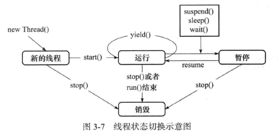

# 第 3 章 线程间通信
　　线程是操作系统中独立的个体，但这些个体如果不经过特殊的处理就不能成为一个整体。线程间的通信就是成为整体的必用方案之一，可以说，使线程间进行通信后，系统之间的交互性会更强大，在大大提高 cpu 利用率的同时还会使程序员对各线程任务在处理的过程中进行有效的把控与监督。

## 本章主要内容
	使用 wait / notify 实现线程间的通信。
	生产者 / 消费者模式的实现。
	方法 join 的使用。
	ThreadLocal 类的使用。

## 3.1 等待 / 通知机制
　　线程与线程之间不是独立的个体，它们彼此之间可以互相通信和协作。

#### 3.1.1 方法内的变量为线程安全
　　通过 while 语句轮询机制来检测某一个条件，这样湖浪费 CPU 资源。如果轮询的时间间隔很小，更浪费 CPU 资源；如果轮询的时间间隔很大，有可能会取不到想要得到的数据。所以就需要有一种机制来减少 CPU 的资源浪费，而且还可以实现在多个线程间通信，它就是“wait/notify”机制。

#### 3.1.2 什么是等待 / 通知机制
　　比如厨师和服务员之间传递菜品就是一个等待 / 通知机制。

　　多个线程共同访问同一个比纳凉，多个线程之间也实现了通信，但这种通信不是“等待 / 通知”，两个线程完全是主动式读取一个共享变量，在话费读取时间的基础上，读到的值是不是想要的，并不能完全确定。

#### 3.1.3 等待 / 通知机制的实现
　　方法 wait() 的作用是使当前执行代码的线程进行等待，wait() 方法是 Object 类的方法，该方法用来将当前线程置入“预执行队列”中，并且在 wait() 所在的代码行处停止执行，直到接到通知或被中断为止。在调用 wait() 之前，线程必须获得该对象的对象级别锁，即只能在同步方法或同步块中调用 wait() 方法。在执行 wait() 方法后，当前线程释放锁。在从 wait() 返回前，线程与其他线程竞争重新获得锁。如果调用 wait() 时没有持有适当的锁，则抛出 IllegalMonitorStateException，它是 RuntimeException 的一个子类，因此，不需要 try-catch 语句进行捕捉异常。

　　方法 notify() 也要在同步方法或同步块中调用，即在调用前，线程也必须获得该对象的对象级别锁。如果调用 notify() 时没有持有适当的锁，也会抛出 IllegalMonitorStateException。该方法用来通知那些可能等待该对象的对象锁的其他线程，如果有多个线程等待，则由线程规划器随机挑选出其中一个呈 wait 状态的线程，对其发出通知 notify，并使它等待获取该对象的对象锁。需要说明的是，在执行 notify() 方法后，当前线程不会马上释放该对象锁，呈 wait 状态的线程也并不能马上获取该对象锁，要等到执行 notify() 方法的线程将程序执行完，也就是退出 synchronized 代码块后，当前线程才会释放锁，而呈 wait 状态所在的线程才可以获取该对象锁。当第一个获得了该对象锁的 wait 线程运行完毕以后，它会释放掉该对象锁，此时如果该对象没有再次使用 notify 语句，则即便该对象已经空闲，其他 wait 状态等待的线程由于没有得到该对象的通知，还会继续阻塞在 wait 状态，直到这个对象发出一个 notify 或 notifyAll。

　　用一句话来总结一下 wait 和 notify ：wait 使线程停止运行，而 notify 使停止的线程继续运行。

　　关键字 synchroized 可以将任何一个 Object 对象作为同步对象来看待，而 Java 为每个 Object 都实现了 wait() 和 notify() 方法，它们必须用在被 synchronized 同步的 Object 的临界区内。通过调用 wait() 方法可以使处于临界区内的线程进入等待状态，同时释放被同步对象的锁。而 notify 操作可以唤醒一个因调用了 wait 操作而处于阻塞状态中的线程，使其进入就绪状态。被重新唤醒的线程会试图重新获得获得临界区的控制权，也就是锁，并继续执行临界区内 wait 之后的代码。如果发出 wait 操作时没有处于阻塞状态中的线程，那么该命令会被忽略。

　　wait() 方法可以使调用该方法的线程释放共享资源的锁，然后从运行状态推出，进入等待队列，直到被再次唤醒。

　　notify() 方法随机唤醒等待队列中等待同一共享资源的“一个”线程，并使该线程退出等待队列，进入可运行状态，也就是 notify() 方法仅通知“一个”线程。

　　notifyAll() 放啊可以使所有正在等待队列中等待同一共享资源的“全部”线程从等待状态退出，进入可运行状态。此时，优先级最高的那个线程最先执行，但也有可能是随机执行，因为这要取决与 JVM 虚拟机的实现。

　　线程状态切换示意图：

　　1）新创建一个新的线程对象后，再调用它的 start() 方法，系统会为此线程分配 cpu 资源，使其处于 Runnable(可运行)状态，这是一个准备运行的阶段，如果线程抢占到 CPU 资源，此线程就处于 Running(运行)状态。

　　2）Runnable 状态和 Running 状态可相互切换，因为有可能线程运行一段时间后，有其他高优先级的线程抢占了 CPU 资源，这是此线程就从 Running 状态变成 Runnable 状态。

　　进程进入 Runnable 状态大体分为如下 5 中情况：
	* 调用 sleep() 方法后经过的时间超过了指定的休眠时间。
	* 线程调用的阻塞 IO 已经返回，阻塞方法执行完毕。
	* 线程成功地获得了试图同步的监视器。
	* 线程正在等待某个通知，其他线程发出了通知。
	* 处于挂起状态的线程调用了 resume 恢复方法。

　　3）Blocked 是阻塞的意思，例如遇到了一个 IO 操作，此时 CPU 处于空闲状态，可能会转而把 CPU 时间片分配给其他线程，这时也可以称为“暂停”状态。Blocked 状态结束后，进入 Runnable 状态，等待系统重新分配资源。

　　出现阻塞的情况大体分为如下 5 种：
	* 线程调用 sleep 方法，主动放弃占用的处理器资源。
	* 线程调用了阻塞式 IO 方法，在该方法返回前，该线程被阻塞。
	* 线程试图获得一个同步监视器，但该同步监视器正被其他线程所持有。
	* 线程等待某个通知。
	* 程序调用了 suspend 方法将该线程挂起。此方法容易导致死锁，尽量避免使用该方法。

　　4）run() 方法运行结束后进入销毁阶段，整个线程执行完毕。

　　每个锁对象都有两个队列，一个是就绪队列，一个是阻塞队列。就绪队列存储了将要获得锁的线程，阻塞队列存储了被阻塞的线程。一个线程被唤醒后，才会进入就绪队列，等待 CPU 的调度；反之，一个线程被 wait 后，就会进入阻塞队列，等待下一次被唤醒。

#### 3.1.4 方法 wait() 锁释放与 notify() 锁不释放
　　当方法 wait() 被执行后，锁被自动释放，但执行完 notify() 方法，锁却不自动释放。

　　方法 sleep() 不释放锁。

　　方法 notify() 辈子性后，不释放锁。

　　必须执行完 notify() 方法所在的同步 synchronized 代码块后才释放锁。

#### 3.1.5 当 interrupt 方法遇到 wait 方法
　　当线程呈 wait() 状态时，调用线程对象的 interrupt() 方法会出现 InterruptedException 异常。

　　1）执行完同步代码块就会释放对象的锁。

　　2）在执行同步代码块的过程中，遇到异常而导致线程终止，锁也会被释放。

　　3）在执行同步代码块的过程中，执行了锁所属对象的 wait() 方法，这个线程会释放对象锁，而此线程对象会进入线程等待池中，等待被唤醒。

#### 3.1.6 只通知一个线程
　　调用 notify() 一次只随机通知一个线程被唤醒。

　　当多次调用 notify() 方法时，会随机将等待 wait 状态的线程进行唤醒。

　　多次调用 notify() 方法唤醒了全部 WAITING 中的线程。

#### 3.1.7 唤醒所有线程
　　通过多次调用 notify() 方法来实现唤醒 3 个线程，但并不能保证系统中仅有 3 个线程，也就是若 notify() 方法的调用次数小于线程对象的数量，会出现有部分线程对象无法被唤醒的情况，为了唤醒全部线程，可以使用 notifyAll() 方法。

#### 3.1.8 方法 wait(long) 的使用
　　带一个参数的 wait(long) 方法的功能是等待某一时间内是否有线程对锁进行唤醒，如果超过这个时间则自动唤醒。

#### 3.1.9 通知过早
　　如果通知过早，则会打乱程序正常的运行逻辑。

#### 3.1.10 等待 wait 的条件发生变化
　　在使用 wait/notify 模式时，还需要注意另外一种情况，也就是 wait 等待的条件发生了变化，也容易造成程序逻辑的混乱。

#### 3.1.11 生产者/消费者模式实现
　　等待 / 通知模式最经典的案例就是 “生产者/消费者” 模式。但此模式在使用上有几种“变形”，还有一些小的注意事项，但原理都是基于 wait/notify 的。

###### 1. 一生产与一消费：操作值
　　只有一个生产者和一个消费者进行数据的交互，数据的 get 和 set 是交替进行的。

###### 2. 多生产者与多消费者：操作数-假死
　　“假死”的现象其实就是线程进入 WAITING 等待状态。如果趣步线程都进入 WAITING 状态，则线程就不再执行任何业务功能了，这个项目呈停止状态。这在使用生产者与消费者模式时经常遇到。

　　在代码中已经通过 wait/notify 进行通信了，但不保证 notify 唤醒的是异类，也许是同类，比如 “生产者” 唤醒 “生产者”，或 “消费者” 唤醒 “消费者” 这样的枪框。如果按这样枪框运行的比率积少成多，就会导致所有的线程都不能继续运行下去，大家都在等待，都呈 WAITING 状态，程序最后也就呈 “假死” 状态，不能继续运行下去了。

　　假死出现的主要原因是有可能连续唤醒同类。怎么能解决这样的问题呢？不光唤醒同类，将异类也一同唤醒就解决了。

###### 3.多生产与多消费：操作值
　　将 notify() 改成 notifyAll() 方法即可，它的原理就是不光通知同类线程，也包括异类。这样就不至于出现假死的状态了，程序会一直运行下去。

###### 4.一生产与一消费：操作栈
　　使生产者向堆栈 List 对象中放入数据，使消费者从 List 堆栈中取出数据。List 最大容量是 1，环境只有一个生产者与一个消费者。

　　通过使用生产者 / 消费者模式，容器 size() 的值不会大于 1，值在 0 和 1 之间进行交替，也就是生产和消费这两个过程在交替进行。

###### 5.一生产与多消费--操作栈：解决 wait 条件改变与假死
　　使用一个生产者向堆栈 List 对象中放入数据，而多个消费者从 List 堆栈中取出数据。List 最大容量还是 1。

　　出现假死的解决办法当然还是使用 notifyAll() 方法了。

###### 6.多生产与一消费：操作栈
　　使用生产者向堆栈 List 对象中放入数据，使用消费者从 List 堆栈中取出数据。List 最大容量还是 1，环境是多个生产者与一个消费者。

　　不会有什么问题。

###### 7.多生产者与多消费者：操作栈
　　使用生产者向栈 List 对象中放入数据，使用消费者从 List 栈中取出数据。List 最大容量是 1，环境是多个生产者与多个消费者。

　　没有什么问题。

#### 3.1.12 通过管道进行线程间通信：字节流
　　在 Java 语言中提供了各种各样的输入 / 输出六 Stream，使我们能够很方便地对数据进行操作，其中管道流（pipeStream）是一种特殊的流，用于在不同线程间直接传送数据。一个线程发送数据到输出管道，另一个线程从输入管道中读数据。通过使用管道，实现不同线程间的通信，而无须借助于类似临时文件之类的东西。

　　在 Java 的 JDK 中提供了 4 个类来使线程间可以进行通信：
	1）PipedInputStream 和 PipedOutputStream
	2）PipedReader 和 PipedWriter

　　使用代码 inputStream.connect(outputStream) 或 outputStream(inputStream) 的作用使两个 Stream 之间产生通信链接，这样才可以将数据进行输出与输入。

#### 3.1.13 通过管道进行线程间通信：字符流
　　当然，在管道中还可以传递字符流。PipedReader 与 Pipedwriter。

#### 3.1.14 实战：等待 / 通知之交叉备份
　　创建 20 个线程，其中 10 个线程将数据备份到 A 数据库，另外 10 个线程将数据备份到 B 数据库中，并且备份 A 数据库和 B 数据库使交叉进行的。

## 3.2 方法 join 的使用
　　在很多情况下，主线程创建并启动子线程，如果子线程中要进行大量的耗时运算，主线程往往将早于子线程结束之前结束。这时，如果主线程想等待子线程执行完成之后再结束，比如子线程处理一个数据，主线程要取得这个数据中的值，就要用到 join() 放啊了。方法 join() 的作用使等待线程对象销毁。

#### 3.2.1 学习方法 join 前的铺垫
　　举例说明 join 方法存在的必要性。

#### 3.2.2 用 join() 方法来解决
　　方法 join 的作用是使所属的线程对象 x 正常执行 run() 方法中的任务，而使当前线程 z 进行无限期的阻塞，等待线程 x 销毁后再继续执行线程 z 后面的代码。

　　方法 join 具有使线程排队运行的作用，有些类似同步的运行效果。join 与 synchronized 的区别是：join 在内部使用 wait() 方法进行等待，而 synchronized 关键字使用的是 “对象监视器” 原理作为同步。

#### 3.2.3 方法 join 与异常
　　在 join 过程中，如果当前线程对象被中断，则当前线程出现异常。

　　方法 join() 与 interrupted() 方法如果彼此遇到，则会出现异常。 

#### 3.2.4 方法 join（long）的使用
　　方法 join(long) 中的参数是设定等待的时间。

　　那使用 join(2000) 和使用 sleep(2000) 有什么区别呢？在运行效果上并没有区别，其实区别主要还是来自于 2 个方法对同步的处理上。

#### 3.2.5 方法 join(long) 与 sleep(long) 的区别
　　方法 join(long) 的功能在内部是使用 wait(long) 方法来实现，所以 join(long) 方法具有释放锁的特点。

　　从源代码中可以了解到，当执行 wait(long) 方法后，当前线程的锁被释放，那么其他线程就可以调用此线程中的同步方法了。

　　而 Thread.sleep(long) 方法却不释放锁。

#### 3.2.6 方法 join() 后面的代码提前运行：出现意外
　　在线程中运行 sleep(long) 方法，在主线程中调用 join(long) 方法等待线程运行，但是有时会导致主线程先运行完毕的情况。

#### 3.2.7 方法 join() 后面的代码提前运行：解释意外
　　join(long) 与线程争抢锁，如果 join(long) 争抢到锁，则主线程会先运行完毕；如果是线程争抢到锁，则线程先运行，然后主线程在运行完毕。

## 3.3 类 ThreadLocal 的使用
　　变量的共享可以使用 public static 变量的形式，所有的线程都使用同一个 public static 变量。如果想实现每一个线程都有自己的共享变量该如何解决呢？JDK 中提供的类 ThreadLocal 正是为了解决这样的问题。

　　类 ThreadLocal 主要解决的就是每个线程绑定自己的值，可以将 ThreadLocal 类比喻成全局存放数据的盒子，盒子中可以存储每个线程的私有数据。

#### 3.3.1 方法 get() 与 null
　　类 ThreadLocal 解决的是变量在不同线程间的隔离性，也就是不同线程拥有自己的值，不同线程中的值是可以放入 ThreadLocal 类中进行保存的。get() 方法取值，set() 方法赋值。

#### 3.3.2 验证线程变量的隔离性
　　虽然多个线程都向 ThreadLocal 对象中 set() 数据值，但每个线程还是能取出自己的数据。

#### 3.3.3 解决 get() 返回 null 问题
　　覆盖 initialValue() 方法设置初始值。

#### 3.3.4 再次验证线程变量的隔离性
　　覆盖 initialValue() 方法设置初始值后，各个线程也各自拥有各自的初始值。

## 3.4 类 InheritableThreadLocal 的使用
　　使用类 InheritableThreadLocal 可以在子线程中取得父线程继承下来的值。

#### 3.4.1 值继承
　　使用 InheritableThreadLocal 类可以让子线程从父线程取得值。

#### 3.4.2 值继承再修改
　　覆盖 childValue() 方法可以在继承的同时对值进行下一步的处理。

　　但在使用 InheritableThreadLocal 类需要注意一点的是，如果子线程在取得值的同时，主线程将 InheritableThreadLocal 中的值进行更改，那么子线程取到的值还是旧值。

## 3.5 本章总结

