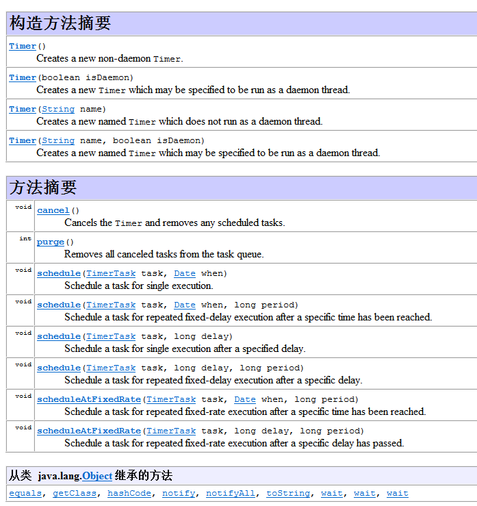
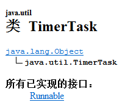

# 第 5 章 定时器 Timer
　　定时 / 计划功能在移动开发领域使用较多，比如 Android 技术。定时计划任务功能在 Java 中主要使用的就是 Timer 对象，他在内部使用多线程的方式进行处理，所以它和线程技术还是有非常大的关联的。

## 本章主要内容
	如何实现指定时间执行任务。
    如何实现按指定周期执行任务。

## 5.1 定时器 Timer 的使用
　　在 JDK 库中 Timer 类主要负责计划任务的功能，也就是在指定的时间开始执行某一个任务。

　　Timer 类的方法列表：

　　Timer 类的主要作用就是设置计划任务，但封装任务的类却是 TimerTask。

　　类 TimeTask 类相关的信息：

　　执行计划任务的代码要放入 TimerTask 的子类中，因为 TimerTask 是一个抽象类。

#### 5.1.1 方法 schedule(TimerTask,Date time)的测试
　　该方法的作用是在指定的日期执行一次某一任务。

###### 1.执行任务的时间晚于当前时间：在未来执行的效果
　　当执行任务的时间是晚于当前时间的，等到计划的时间，TimerTask 中的任务会被执行，但是任务执行完了，但进程还未销毁。

　　创建一个 Timer 就是启动一个新的线程，新启动的线程并不是守护线程，所以它一直在运行。

　　选择守护线程进行运行，程序运行后迅速结束当前的进程，并且 TimerTask 中的任务不再被运行，因为进程已经结束了。

###### 2.计划时间早于当前时间：提前运行的效果
　　如果执行任务的时间早于当前时间，则立即执行 task 任务。

###### 3.多个 TimerTask 任务及延时的测试
　　Timer 中允许由多个 TimerTask 任务。

　　TimerTask 是以队列的方式一个一个被顺序执行的，所以执行的时间有可能和预期的时间不一致，因为前面的任务有可能消耗的时间较长，则后面的任务运行的时间也会被延迟。

#### 5.1.2 方法 schedule(TimerTask task,Date firstTime,long period)的测试
　　该方法的作用是在指定的日期之后，按指定的间隔周期性地无限循环地执行某一任务。

###### 1.计划时间晚于当前时间：在未来执行的效果
　　等到了计划的时间，每隔间隔时间运行一次 TimerTask 任务，并且是无限期地重复执行。

###### 2.计划时间早于当前时间：提前运行的效果
　　如果计划时间早于当前时间，则立即执行 task 任务。每隔间隔时间运行一次 TimerTask 任务，并且是无限期地重复执行。

###### 3. 任务执行时间被延时
　　当任务需要运行的时间大于间隔时间时，任务是以任务运行的时间为间隔循环运行。

###### 4. TimerTask 类的 cancel() 方法
　　TimerTask 类中的 cancel() 方法的作用是将自身从任务队列中清除。

　　TimerTask 类的 cancel() 放啊是将子什么从任务队列中被移除，其他任务不受影响。

###### 5. Timer 类的 cancel() 方法
　　和 TimerTask 类中的 cancel() 方法清除自身不同，Timer 类中的 cancel() 方法的作用是将任务队列中的全部任务清空。

　　全部任务都被清除，并且进程被销毁。

###### 6. TImer 的 cancel() 方法注意事项
　　Timer 类中的 cancel() 方法有时并不一定会停止执行任务之花，而是正常执行。

　　这是因为 Timer 类中的 cancel() 方法有时并没有争抢到 queue 锁，所以 TimerTask 类中的任务继续正常执行。

#### 5.1.3 方法 schedule(TimerTask task,long delay) 的测试
　　该方法的作用是以执行 schedule(TimerTask task,long delay) 方法当前的时间为参考时间，在此时间基础上延迟指定的毫秒数后执行一次 TimerTask 任务。

#### 5.1.4 方法 schedule(TimerTask task,long delay,long period) 的测试
　　该方法的作用是以执行 schedule(TimerTask task,long delay,long period) 方法当前的时间为参考时间，在此时间基础上延迟执行的毫秒数，再以某一间隔时间无限次数地执行某一任务。

　　凡是使用方法中带有 period 参数的，都是无限循环执行 TimerTask 中的任务。

#### 5.1.5 方法 scheduleAtFixedRate(TimerTask task,Date firstTime,long period) 的测试
　　方法 schedule 和方法 scheduleAtFixedRate 都会按顺序执行，所以不要考虑非线程安全的情况。

　　方法 schedule 和 scheduleAtFixedRate 主要的区别只在于不延时的情况。

　　使用 schedule 方法：如果执行任务的时间没有被延时，那么下一次任务的执行时间参考的是上一次任务的“开始”时的时间来计算。

　　使用 scheduleAtFixedRate 方法：如果执行任务的时间没有被延时，那么下一次任务的执行时间参考的是上一次任务的“结束”时的时间来计算。

　　延时的情况则没有区别，也就是使用 schedule 或 scheduleAtFixedRate 方法都是如果执行任务的时间被延时，那么下一次任务的执行时间参考的是上一次任务“结束”时的时间来计算。

###### 1.测试 schedule 方法任务不延时
　　在不延时的情况下，如果执行任务的时间没有被延时（执行任务的时间小于 delay 的时间），则下一次执行任务的时间是上一次任务的开始时间加上 delay 时间。

###### 2.测试 schedule 方法任务延时
　　如果执行任务的时间被延时（执行任务的时间大于 delay 的时间），那么下一次任务的执行时间以上一次任务“结束”时的时间为参考来计算。

###### 3.测试 scheduleAtFixedRate 方法任务不延时
　　如果执行任务的时间没有被延时（执行任务的时间小于 delay 的时间），则下一次认知性任务的时间是上一次任务的开始时间加上 delay 时间。

###### 4.测试 scheduleAtFixedRate 方法任务延时
　　如果执行任务的时间被延时（执行任务的时间大于 delay 的时间），那么下一次任务的执行时间以上一次任务“结束”时的时间为参考来计算。

###### 5.验证 schedule 方法不具有追赶执行性
　　任务计划时间早于当前时间，而任务计划时间到当前时间之间的时间所对应的 Task 任务被取消了，不执行了。这就是 Task 任务不追赶的情况。

###### 6. 验证 scheduleAtFixedRate 方法具有追赶执行性
　　任务计划时间早于当前时间，而任务计划时间到当前时间之间的时间所对应的 Task 任务被“补充性”执行了，这就是 Task 任务追赶执行的特性。

## 5.2 本章总结
　　通过本章的学习，应该掌握如何在 Java 中使用定时任务的功能，并且可以对这些定时任务使用指定的 API 进行处理。

