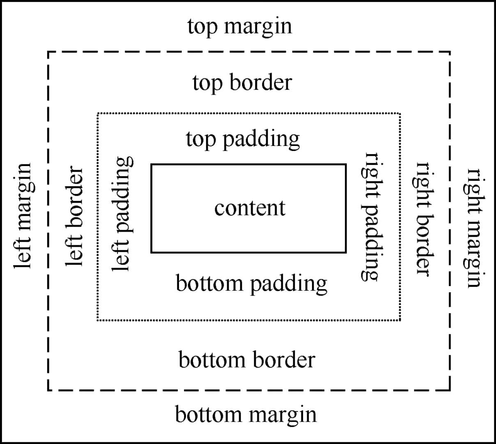

# 第 3 章 React Native 基础语法

## 3.1. JSX 语法

　　React Native 使用 JSX 语法来构建页面。JSX 并不是一门新的开发语言，而是 Facebook 技术团队提出的一种语法方案，即一种可以在 JavaScript 代码中使用 HTML 标签来编写 JavaScript 对象的语法糖，所以 JSX 本质上来说还是 JavaScript。

　　在 React 和 React Native 应用开发中，不一定非要使用 JSX，也可以使用 JavaScript 进行开发。不过，因为 JSX 在定义上类似 HTML 这种树形结构，所以使用 JSX 可以极大地提高阅读和开发效率，减少代码维护的成本。

　　在 React 开发中，React 的核心机制之一就是可以在内存中创建虚拟 DOM 元素，进而减少对实际 DOM 的操作从而提升性能，而使用 JSX 语法可以很方便地创建虚拟 DOM。

　　组件的 render() 方法主要用于页面的渲染操作，它返回的是一个视图（View）对象，之所以没有看到创建对象和设置属性的代码，是因为 JSX 提供的 JSXTransformer 可以帮助我们把代码中的 XML-Like 语法编辑转换成 JavaScript 代码。借助 JSX 语法，开发者不仅可以用它来创建视图对象、样式和布局，还可以用它构建视图的树形结构。并且，JSX 语法的可读性也非常好，非常适合前端页面开发。

## 3.2. 语法基础

　　作为 React 前端框架在原生移动平台的衍生生产物，React Native 目前支持 ES5 及以上版本，不过实际开发中使用最多的还是 ES6。

### 3.2.1. let 和 const 命令

　　ES6 中新增了 let 命令，主要用来声明变量，它的用法类似于 var，但是 let 声明的便利只在 let 命令所在的代码块内有效。

　　使用 let 声明变量时不允许在相同作用域内重复声明。

　　const 用于声明一个只读的常量，一旦声明，常量的值就不能改变。

　　const 声明的常量，一旦声明就必须立即初始化，不能留在后面再赋值。实际上，与 let 一样，const 声明的常量也不可重复声明。

### 3.2.2. 类

　　作为一门基于原型的面向对象语言，JavaScript 一直没有类的概念，而是使用对象来模拟类。现在，ES6 添加了对类的支持，引入了 class 关键字，新的 class 写法让对象的创建和继承更加直观，也让父类方法的调用、实例化、静态方法和构造函数等概念更加具象。

　　同时，新的 ES6 语法可以直接使用函数名字来定义方法，方法结尾也不需要使用逗号。

　　在 ES5 语法中，属性类型和默认属性通过 propTypes 和 getDefaultProps() 来实现。而在 ES6 语法中，属性类型和默认属性则统一使用 static 修饰。

### 3.2.3. 箭头函数

　　ES6 中新增了箭头操作符（=>），可以用它来简化函数的书写。

　　如果肩头函数带有参数，可以使用一个圆括号代表参数部分。

　　如果箭头函数带有多个参数，需要用到小括号。参数之间使用逗号隔开。

　　如果函数体设计多条语句，就需要使用大括号。

　　使用箭头函数时，需要注意以下几点。

* 函数体内的 this 对象，就是定义时所在的对象，而不是使用时所在的对象。
* 箭头函数不支持 new 命令，否则会抛出错误。
* 不可以使用 arguments 对象，该对象在函数体内不存在，如果要用，可以使用 rest 参数代替。
* 不可以使用 yield 命令，因此箭头函数不能用作 generator 函数。

### 3.2.4. 模块

　　历史上，JavaScript 一直没有模块体系，无法将一个大程序拆分成互相依赖的小文件，也无法将简单的小文件拼装起来构成一个模块。

　　在 ES6 之前，JavaScript 社区制定了一些模块化开发方案，比较著名的有 AMD 和 CommonJS 两种，前者适用于浏览器，后者适用于服务器。不过随着 ES6 的出现，JavaScript 终于迎来了模块开发体系，并逐渐成为浏览器和服务器通用的模块解决方案。

　　ES6 模块的设计思想是尽量静态化，使得编译时就能确定模块的依赖关系以及输入和输出的变量。ES6 模块有两个最重要的命令，即 export 和 import。其中，export 用于对外输出模块，import 用于导入模块。

　　在 ES6 语法中，一个模块就是一个独立的文件，文件内部的所有变量都无法被外部获取，只有通过 export 命令导出后才能被另外的模块使用。

　　多个模块之间也是可以互相继承的。

### 3.2.5. Promise 对象

　　Promise 是异步编程的一种解决方案，比传统的回调函数更合理、更强大。Promise 最早由 JavaScript 社区提出和实现，并最终在 ES6 版本写进编程语言标准。

　　简单来说，Promise 就是一个容器，里面保存着某个未来才会结束的事件结果。从语法上说，Promise 是一个对象，它可以通过异步方式获取操作的结果。使用 Promise 修饰的对象，对象的状态不受外界影响，一旦状态改变就不会再变，任何时候都可以得到这个结果。

　　在 ES6 语法规则中，Promise 对象是一个构造函数，用来生成 Promise 实例。

　　Promise 实例生成以后，就可以使用 then() 方法给 resolved 状态和 rejected 状态指定回调函数。

　　then() 方法可以接收两个回调函数作为参数：第一个回调函数表示 Promise 对象的状态为 resolved 时被调用；第二个回调函数表示 Promise 对象的状态变为 rejected 时被调用。这两个函数都接收 Promise 对象传出的值作为参数，且第二个函数是可选的。

### 3.2.6. async 函数

　　async 函数是一个异步操作函数，不过从本质上来说，它仍然是一个普通函数，只不过是将普通函数的 * 替换成 async，将 yield 替换成 await 而已。

　　async 函数会返回一个 Promise 对象，可以使用 then() 和 catch() 方法来处理回调的结果。

　　当函数执行的时候，一旦遇到 await 就会先返回，等到异步操作完成后，再执行函数体内后面的语句。

　　同时，async 函数返回的 Promise 对象，必须等到内部所有 await 命令后面的 Promise 对象执行完成之后，状态才会发生改变，除非遇到 return 语句或者抛出错误。也就是说，只有 async 函数内部的异步操作执行完，才会执行 then() 方法指定的回调函数。

　　正常情况下，await 命令后面是一个 Promise 对象，如果不是 Promise 对象，则直接返回对应的值。

　　await 命令后面还可能是一个 thenable 对象，即定义 then() 方法的对象，那么 await 会将其等同于 Promise 对象。

　　await 命令后面是一个 Sleep 对象的实例，此实例虽然不是 Promise 对象，但是因为它定义了 then() 方法，所以 await 会将其视为 Promise 对象进行处理。

　　在 async 函数中，任何一个 await 语句后面的  Promise 对象变为 reject 状态，那个整个 aysnc 函数都会中断执行。如果希望异步操作失败后不中断后面的一步操作，可以将异步的部分放在 try...catch 语句结构里面。

　　当然，处理上面的问题还有另一种方法，即在 await 后面的 Promise 对象再跟一个 catch() 方法，用于处理前面可能出现的错误。

　　如果存在多个 await 命令修改的异步操作，且不存在继承关系，最好让它们同时触发。

　　如果确实希望多个请求并发执行，可以使用 Promise.all() 方法。

## 3.3. Flexbox 布局

### 3.3.1. Flexbox 布局简介

　　在传统的 HTML 文档中，每个元素都被描绘成一个矩形盒子，这些矩形盒子通过一个模型来描述其占用的空间，此模型即被称为盒模型。盒模型包含 margin、border、padding 和 content 4 个边界对象，如下图所示。

　　如上图所示，盒模型主要由 margin、border、padding 和 content 4 个属性构成。其中，margin 用于描述边框外的距离，border 用来描述围绕在内边距和内容外的边框，padding 用于表示内容与边框之间的填充距离，content 用于表示需要填充的空间。

　　由于 CSS 盒模型需要依赖于 position 属性、float 属性以及 display 属性来进行布局，所以对于一些特殊但常用的布局实现起来就比较困难。为此，W3C 组织提出了一种新的布局方案，即 Flexbox 布局。

　　Flexbox 是英文 Flexible Box 的缩写，又称为弹性盒子布局，旨在提供一个更加有效的方式制定、调整和排布一个容器里的项目布局，即使他们的大小是未知或者动态的。Flexbox 布局的主要思想是，让容器有能力使其子项目改变其宽度、高度（甚至顺序），并以最佳方式填充可用空间。

　　React Native 实现了 Flexbox 布局的大部分功能，因此在实际应用开发中可以直接使用 Flexbox 布局来进行布局开发。React Native 中 Flexbox 布局和 Web 开发中的布局是基本一致的，只有少许差异。

　　在 Flexbox 布局中，按照作用对象的不同，可以将 Flexbox 布局属性分为决定子组件的属性和决定组件自身的属性两种。其中，决定子组件的属性有 flexWrap、alignItems、flexDirection 和 justifyContext，决定组件自身的自身的属性有 alignSelf 和 flex 等。

### 3.3.2. flexDirection 属性

　　flexDirection 属性表示布局中子组件的排列方向，取值包括 column、row、column-reverse 和 row-reverse，默认值为 column。即在不设置 flexDirection 属性的情况下，子组件在容器中是默认值 column 纵向排列的。

### 3.3.3. flexWrap 属性

　　flexWrap 属性主要用于控制子组件是单行还是多行显示，取值包括 wrap、nowrap 和 wrap-reverse，默认值为 wrap，即默认多行显示。

### 3.3.4. justifyContent 属性

　　justifyContent 属性用于表明容器中子组件横向排列的位置，取值包括 flex-start、flex-end、center、space-between 和 space-around。

　　和 justifyContent 属性类似，alignItems 属性也可以用于控制容器中子组件的排列方向，只不过 juetifyContent 决定的是子组件在容器中横向排列的位置，而 alignItems 决定子组件在容器中纵向排列的位置。alignItems 属性的取值包括 flex-start、flex-end、center、baseline 和 stretch。

### 3.3.5. alignSelf 属性

　　alignSelf 属性用于表明组件在容器内部的排列情况，与 alignItems 属性不同，alignSelf 属性是在子组件内部定义的，取值包括 auto、flex-start、flex-end、center 和 stretch。

### 3.3.6. flex 属性

　　flex 属性用于表明子控件占父控件的比例，即组件可以动态计算和配置自己所占用的空间大小，取值是数值，默认值为 0，即不占用任何父容器空间。

　　flex 属性是 FlexBox 布局的重要内容之一，也是实现自适应设备和屏幕尺寸的核心。合理使用 flex 属性，可以提高页面开发的效率和质量。

## 3.4. 本章小结

　　本章主要从 JXS 语法、ES6 基础语法、布局和样式来介绍 React Native 开发中的基础知识。