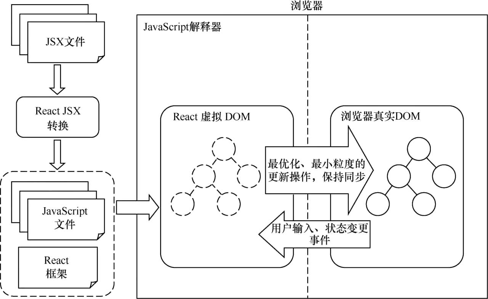

# 第 4 章 React 技术详解

## 4.1. React 简介

　　React 作为目前流行的前端三大框架之一，其主要作用是为 MVC 模式中的视图（View）层构建界面视图。除此之外，React 还可以以插件的形式作用于 Web 应用程序的非视图部分，实现与其他 JavaScript 框架的整合。

　　React 框架的设计思想非常独特，并且性能出众、代码逻辑简单，因此越来越多的前端开发人员开始使用它来开发前端项目。

　　同时，为了减少传统前端开发中直接操作 DOM 带来的昂贵开销，React 转而使用虚拟 DOM 来操作 DOM 的更新。

　　下图清晰地展示了 React 框架的基本结构，描述了 React 底层与浏览器的沟通机制。

　　文档对象模型，简称 DOM，是 W3C 组织推荐的处理可扩展标志语言的标准编程接口。在 HTML 网页开发中，页面对象被描述成一个树形结构，而用来表示文档结构对象的标准模型就称为 DOM。

　　在 React 框架中，为了解决页面元素的更新问题，React 底层设计了一个虚拟 DOM。此虚拟 DOM 与页面真实 DOM 进行映射，当数据变化时，React 就会重新否见整个 DOM 树，并通过底层的 diff 算法找到 DOM 的差异部分，然后浏览器只需要更新变化的部分即可。虚拟 DOM 是 React 框架中一个比较核心的内容，是 React 出色性能的根本。

　　除了性能方面的考虑外，React 引入虚拟 DOM 的意义还在于提供了一种新的开发方式，即借助虚拟 DOM 技术来实现服务器端应用、Web 应用和移动手机应用的跨平台开发。

　　在 React 框架中，还有一个比较重要的概念，即数据的单向流动，数据默认从父节点传递到子节点。具体来说，父节点数据通过 props 传递到子节点，如果父节点的 props 值发生了改变，那么其所有的子节点也会执行重新渲染操作。这样设计的好处是，使得组件足够扁平，更加便于维护。

##  4.2. React 组件详解

### 4.2.1. React 组件基本知识

　　在 React 的组件构成中，按照状态来分，可以分为有状态组件和无状态组件。
　　所谓无状态组件，指的是没有状态控制的组件，只做纯静态展示。无状态组件是最基本的组件存在形式，它由 props 属性和 render 渲染函数构成。由于不涉及状态的更新，所以这种组件的复用性也最强。

　　有状态组件是在无状态组件的基础上增加了组件内部状态管理。之所以被称为有状态组件，是因为有状态组件通常会带有生命周期（lifecycle），用以在不同的时刻触发组件状态的更新，有状态组件被大量使用在业务逻辑开发中。

　　目前，React 支持 3 种方式来定义一个组件，如下所示。

* ES5 的 React.createClass 方式
* ES6 的 React.Component 方式
* 无状态的函数组件方式

　　随着 React 版本的持续升级，ES5 的 React.createClass 方式暴露的问题也越来越多。例如，使用 React.createClass 创建的组件，事件函数会自动绑定相关的函数，这样会导致不必要的性能开销，而 React.Component 则是有选择性地进行函数绑定，因此绑定操作需要开发者手动触发，不过好处是性能更强。

　　随着 ES6 语法的普及，React.createClass 也逐渐被 React.Component 方式替代。并且，使用 React.Component 方式创建的组件更符合面向函数编程思想，可读性也更强。

　　通过 React.createClass 和 React.Component 方式创建的组件都是有状态的组件，而如果要创建无状态组件则需要通过无状态的函数来创建。无状态组件是 React 在 0.14 版本新推出的一种组件形式，只负责数据展示。它的特点是不需要管理组件状态 state，数据直接通过 props 传入即可，这也符合 React 单向数据流的思想。

　　对于无状态组件的函数式声明方式，不仅可以提高代码的可读性，还能大大减少代码量，提高代码的复用率，箭头函数则是函数式编程的最佳搭档。

　　无状态组件一般会搭配高阶组件（简称 OHC）一起使用，高阶组件主要用来托管 state。Redux 框架就是通过 store 来管理数据源和组件的所有状态，其中所有负责展示的组件都使用无状态函数式写法。无状态组件也被大规模应用在大型应用程序中。

　　虽然无状态组件具有诸多的优势，但也是不是万能的。比如，无状态组件在被 React 调用之前，组件还没有被实例化，所以它不支持 ref 特性。

### 4.2.2. props

　　React 组件化的开发思路一直为人所称道，而组件最核心的两个概念莫过于 props 与 state，组件的最终呈现效果也是 props 和 state 共同作用的结果。总体来说，props 是组件对外的借口，而  state 则是组件对内的借口。一般强框下，props 是不变的。

　　在典型的 React 数据流模型中，props 时父子组件交互的唯一方式。

　　在 ES5 语法中，如果想要为组件的属性设置默认值，需要在 getDefaultProps() 方法中设置。

　　props 作为父子组件沟通的桥梁，为组件之间的通信和传值提供了重要手段。

　　如果父组件需要向子组件传递数据，只需要在组件中引入子组件，然后使用组件提供的 props 属性，即可向子组件参数数据。

### 4.2.3. state

　　如果说 props 是组件对外的接口，那么 state 就是组件对内的接口。state 作为组件的私有属性，只能被本组件访问和修改；而 props 对于使用它的组件来说是只读的，如果想要修改 props，只能通过组件的父组件修改。

　　React 把组件看成一个特殊的状态机，通过与用户的交互实现不同状态，进而渲染界面，让用户界面和数据保持一致。在 React 中，如果需要使用 state，就需要在组件的 constructor 中初始化相关的 state。

　　需要需要更新组件的 state，可以使用组件提供的 setState() 方法。

　　需要注意的是，在调用 setState 函数执行更新操作时，组件的 state 并不会立即改变，因为 setState 操作是异步的。setState 操作只是把要修改的状态放入一个队列中。出于性能原因，React 可能会对多次 setState 状态修改进行合并修正，所以当使用 {this.state} 获取状态时，可能并不是需要的那个 state。同理，也不能依赖当前的 props 来计算组件的下一个状态，因为 props 一般也是从父组件的 state 来获取的，依然无法确定组件在状态更新时的值。

　　同时，在调用 setState 修改组件状态时，只需要传入需要改变的状态变量即可，不必传入组件完整的 state，因为组件状态的更新是一个浅合并的过程。

### 4.2.4. ref

　　在典型的 React 数据流模型中，

