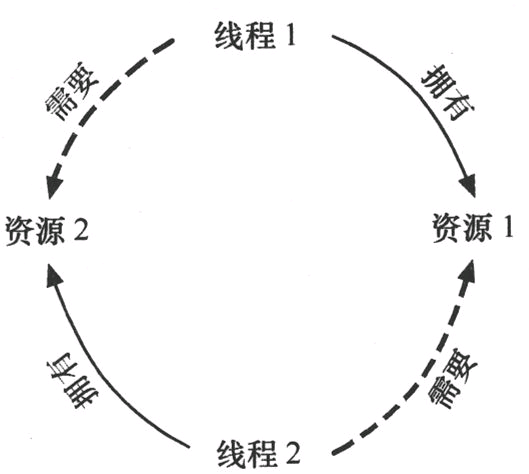

# 附录 A 并发编程 II

## A.3. 了解类库

### A.3.1. Executor 框架

​		Java 5 中引入的 Executor 框架支持利用线程池进行复杂的执行。那就是 java.util.concurrent 包中的一个类。

​		如果在创建线程时没有使用线程池或自行编写线程池，可以考虑使用 Executor。它能让代码更整洁，易于理解，且更加短小。

​		Executor 框架将把线程放到池中，自动调整其大小，并在必要时重建线程。它还支持 future，一种通用的并发编程构造。Executor 能与实现了 Runnable 的类协同工作，也能与实现了 Callable 接口的类协同工作。Callback 看来就像是 Runnable，但它能返回一个结果，那在多线程解决方案中是普遍的需求。

​		当代码需要执行多个相互独立的操作并等待这些操作结束时，future 刚好就手。

### A.3.2. 非锁定的解决方案

​		Java5 虚拟机利用了现代处理器支持可靠、非锁定更新的设计优点。

​		使用非锁定的手段，如下所示：

```java
public class ObjectWithValue {
  private AtomicInteger value = new AtomicInteger(0);
  
  public void incrementValue() {
    value.incrementAndGet();
  }
  
  public int getValue(){
    return value.get();
  }
}
```

​		即便使用了对象而非直接操作，使用了 incrementAndGet() 这样的信息发送方式而非 ++ 操作，这个类的性能还是几乎总能胜过上一版本。在某些情况下只会快一点点，但较慢的情形却几乎不存在。

​		怎么会这样？现代处理器拥有一种通常称为比较交换（Compare and Swap, CAS）的操作。这种操作类似于数据库中的乐观锁定，而其同步版本则类似于保守锁定。

​		关键字 synchronized 总是要求上锁，即便第二个线程并不更新同一值时也如此。尽管这种固有锁的性能一直在提升，但仍然代价昂贵。

​		非上锁的版本假定多个线程通常并不频繁修改同一个值，导致问题产生。它高效地侦测这种情形是否发生，并不断尝试，直至更新成功。这种侦测行为几乎总是比上锁来得划算，在争用激烈的情况下也是如此。

​		虚拟机如何实现这种机制？CAS 的操作是原子的。逻辑上，CAS 操作看起来像这样：

```java
int variableBeingSet;

void simulateNonBlockingSet(int newValue) {
  int currentValue;
  do {
    currentValue = variableBeingSet
  } while(currentValue != compareAndSwap(currentValue, newValue));
}

int synchronized conpareAndSwap(int currentValue, int newValue) {
  if(variableBeingSet == currentValue){
    variableBeingSet = newValue;
    return currentValue;
  }
  return variableBeingSet;
}
```

​		当某个方法试图更新一个共享变量，CAS 操作就会验证要赋值的变量是否保有上一次的已知值。如果是，就修改变量值。如果不是，则不会碰变量，因为另一个线程正在试图更新变量值。要更新数据的方法（通过 CAS 操作）查看是否修改并持续尝试。

### A.3.3. 非线程安全类

​		有些类天生不是线程安全的。下面是几个例子：

* 数据库连接

* java.util 中的容器

* Servlet

​		注意，有些群集类拥有一些线程安全的方法。不过，涉及调用多个方法的操作都不是线程安全的。

## A.4. 方法之间的依赖可能破坏并发代码

### A.4.3. 基于服务端的锁定

​		通常你应该选用基于服务端的锁定，因为：

* 它减少了重复代码 —— 采用基于客户代码的锁定，每个客户端都要正确锁定服务端。把锁定代码放到服务端，客户端就能自由使用对象，不必费心编写额外的锁定代码；

* 它提升了性能 —— 在单线程部署中，可以用非多线程安全服务端代码替代线程安全客户端，从而省去花销；

* 它减少了出错的可能性 —— 只会有一个程序员忘记上锁；

* 它执行了单一策略 —— 该策略只在服务端这一处地方实施，而不是在许多地方（每个客户端）实施；

* 它缩减了共享变量的作用范围 —— 客户端不必关心它们或它们是如何锁定的。一切都隐藏在服务端。如果出错，要侦查的范围就小多了。

​		如果你无法修改服务端代码又该如何？

* 使用 ADAPTER 模式修改 API，添加锁定；

* 更好的方法是使用线程安全的群集和扩展接口。

## A.6. 死锁

​		死锁的发生需要 4 个条件：

* 互斥；

* 上锁及等待；

* 无抢先机制；

* 循环等待。

### A.6.1. 互斥

​		当多个线程需要使用同一资源，且这些资源满足下列条件时，互斥就会发生。

* 无法在同一时间为多个线程所用；

* 数量上有限制。

​		这种资源的常见例子是数据库连接、打开后用于写入的文件、记录锁或是信号量。

### A.6.2. 上锁及等待

​		当某个线程获取一个资源，在获取到其他全部所需资源并完成其工作之前，不会释放这个资源。

### A.6.3. 无抢先机制

​		线程无法从其他线程处夺取资源。一个线程持有资源时，其他线程获得这个资源的唯一手段就是等待该线程释放资源。

### A.6.4. 循环等待

​		这也被称为 “ 死命拥抱 ”。想象两个线程，T1 和 T2，还有两个资源，R1 和 R2。T1 拥有 R1，T2 拥有 R2。T1 需要 R2，T2 需要 R1。如此就出现了如下图所示的情形。



​		这 4 种条件都是死锁所必需的。只要其中一个不满足，死锁就不会发生。

### A.6.5. 不互斥

​		避免死锁的一种策略是规避互斥条件。你可以：

* 使用允许同时使用的资源，如 AtomicInteger；

* 增加资源数量，使其等于或大于竞争线程的数量；
* 在获取资源之前，检查是否可用。

​		不幸的是，多数资源都有上限，且不能同时使用。而且第二个资源的标识也常常要依据对第一个资源的操作结果来判断。

### A.6.6. 不上锁及等待

​		如果拒绝等待，就能消除死锁。在获得资源之前检查资源，如果遇到某个繁忙资源，就释放所有资源，重新来过。

​		这种手段带来几个潜在问题：

* 线程饥饿 —— 某个线程一直无法获得它所需的资源（ 它可能需要某种很少能同时获得的资源组合 ）；

* 活锁 —— 几个线程可能会前后相连地要求获得某个资源，然后再释放一个资源，如此循环。这在单纯的 CPU 任务排列算法中尤其有可能出现（ 想想嵌入式设备或单纯的手写线程平衡算法 ）。

​		二者都能导致较差的吞吐量。第一个的结果是 CPU 利用率低，第二个的结果是较高但无用的 CPU 利用率。

​		尽管这种策略听起来没效率，但也好过没有。至少，如果其他方案不奏效，这种手段几乎总可以用上。

### A.6.7　满足抢先机制

​		避免死锁的另一策略是允许线程从其他线程上夺取资源。这通常利用一种简单的请求机制来实现。当线程发现资源繁忙，就要求其拥有者释放之。如果拥有者还在等待其他资源，就释放全部资源并重新来过。

​		这和上一种手段相似，但好处是允许线程等待资源。这减少了线程重新启动的次数。不过，管理所有请求可要花点心思。

### A.6.8. 不做循环等待

​		这是避免死锁的最常用手段。对于多数系统，它只要求一个为各方认同的约定。

​		在上面的例子中线程 1 同时需要资源 1 和资源 2、线程 2 同时需要资源 2 和资源 1，只要强制线程 1 和线程 2 以同样次序分配资源，循环等待就不会发生。

​		更普遍地，如果所有线程都认同一种资源获取次序，并按照这种次序获取资源，死锁就不会发生。就像其他策略一样，这也会有问题：

* 获取资源的次序可能与使用资源的次序不匹配；一开始获取的资源可能在最后才会用到。这可能导致资源不必要地被长时间锁定；
* 有时无法强求资源获取顺序。如果第二个资源的 ID 来自对第一个资源操作的结果，获取次序也无从谈起。

​		有许多避免死锁的方法。有些会导致饥饿，另外一些会导致对CPU能力的大量耗费和降低响应率。

​		将解决方案中与线程相关的部分分隔出来，再加以调整和试验，是获得判断最佳策略所需的洞见的正道。

## A.7. 测试多线程代码

* 蒙特卡洛测试。测试要灵活，便于调整。多次运行测试 —— 在一台测试服务器上 —— 随机改变调整值。如果测试失败，代码就有错。确保及早编写这些测试，好让持续集成服务器尽快开始运行测试。另外，确认小心记录了在何种条件下测试失败。

* 在每种目标部署平台上运行测试。重复运行。持续运行。测试在不失败的前提下运行得越久，就越能说明：

  \- 生产代码正确；

  或；

  \- 测试不足以暴露问题。

* 在另一台有不同负载的机器上运行测试。能模拟生产环境的负载，就模拟之。

* 即便你做了所有这些，还是不见得有很好的机会发现代码中的线程问题。最阴险的问题拥有很小的截面，在十亿次执行中只会发生一次。这类错误是复杂系统的噩梦。

## A.8. 测试线程代码的工具支持

​		IBM 提供了一个名为 ConTes 的工具。它能对类进行装置，令非线程安全代码更有可能失败。

​		下面是使用 ConTest 的简要步骤：

* 编写测试和生产代码，确保有专门模拟多用户在多种负载情况下操作的测试，如上文所述；

* 用 ConTest 装置测试和生产代码；

* 运行测试。

* 用 ConTest 装置代码后，原本千万次循环才能暴露一个错误的比率提升到 30 次循环就能找到错误。以下是装置代码后的几次测试运行结果值：13、23、0、54、16、14、6、69、107、49 和 2。显然装置后的类更加容易和可靠地被证明失败。

## A.9. 小结

​		在本章中，我们谈到并发更新，还有清理及避免同步的规程。我们谈到线程如何提升与 I/O 有关的系统的吞吐量，展示了获得这种提升的整洁技术。我们谈到死锁及干净地避免死锁的规程。最后，我们谈到通过装置代码暴露并发问题的策略。

