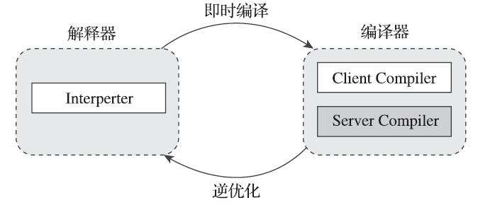
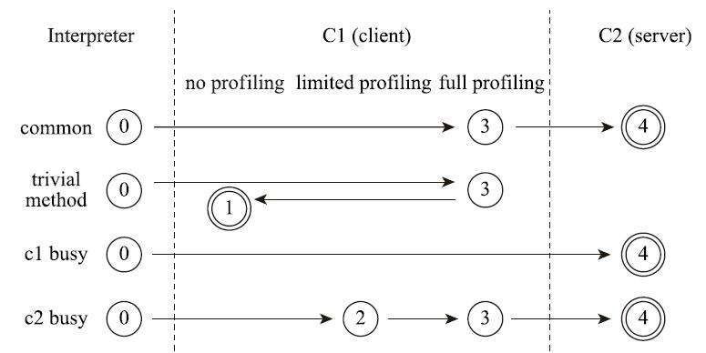
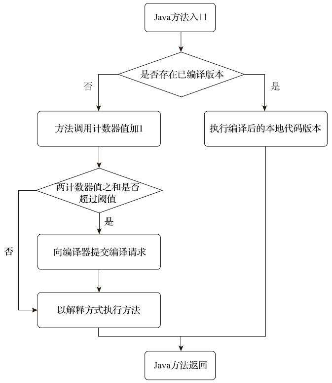
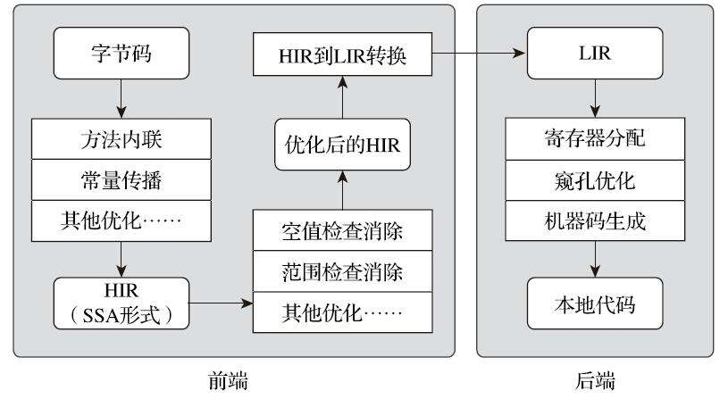

# 第 11 章 后端编译与优化

## 11.1 概述

　　如果把字节码看作是程序语言的一种中间表示形式（Intermediate Representation，IR）的话，那编译器无论在何时、在何种状态下把 Class 文件转换成与本地基础设施（硬件指令集、操作系统）相关的二进制机器码，它都可以视为整个编译过程的后端。

　　无论是提前编译器抑或即时编译器，都不是 Java 虚拟机必需的组成部分，《 Java 虚拟机规范 》中从来没有规定过虚拟机内部必须要包含这些编译器，更没有限定或指导这些编译器应该如何去实现。

　　但是，后端编译器编译性能的好坏、代码优化质量的高低却是衡量一款商用虚拟机优秀与否的关键指标之一，它们也是商业 Java 虚拟机中的核心，是最能体现技术水平与价值的功能。

## 11.2 即时编译器

　　目前主流的两款商用 Java 虚拟机（ HotSpot、OpenJ9 ）里，Java 程序最初都是通过解释器（Interpreter）进行解释执行的，当虚拟机发现某个方法或代码块的运行特别频繁，就会把这些代码认定为 “ **热点代码** ”（Hot Spot Code）。

　　为了提高热点代码的执行效率，在运行时，虚拟机将会把这些代码编译成本地机器码，并以各种手段尽可能地进行代码优化，运行时完成这个任务的后端编译器被称为**即时编译器**。

### 11.2.1 解释器与编译器

　　尽管并不是所有的 Java 虚拟机都采用解释器与编译器并存的运行架构，但目前主流的商用 Java 虚拟机，譬如HotSpot、OpenJ9 等，内部都同时包含解释器与编译器。

　　解释器与编译器两者各有优势：当程序需要迅速启动和执行的时候，解释器可以首先发挥作用，省去编译的时间，立即运行。当程序启动后，随着时间的推移，编译器逐渐发挥作用，把越来越多的代码编译成本地代码，这样可以减少解释器的中间损耗，获得更高的执行效率。

　　当程序运行环境中内存资源限制较大，可以使用解释执行节约内存（ 如部分嵌入式系统中和大部分的 JavaCard 应用中就只有解释器的存在），反之可以使用编译执行来提升效率。

　　同时，解释器还可以作为编译器激进优化时后备的 “ 逃生门 ”（如果情况允许，HotSpot 虚拟机中也会采用不进行激进优化的客户端编译器充当 “ 逃生门 ” 的角色），让编译器根据概率选择一些不能保证所有情况都正确，但大多数时候都能提升运行速度的优化手段，当激进优化的假设不成立，如加载了新类以后，类型继承结构出现变化、出现 “ 罕见陷阱 ”（Uncommon Trap）时可以通过逆优化（Deoptimization）退回到解释状态继续执行，因此在整个 Java 虚拟机执行架构里，解释器与编译器经常是相辅相成地配合工作，其交互关系如下图所示：

　　HotSpot 虚拟机中内置了两个（或三个）即时编译器，其中有两个编译器存在已久，分别被称为 “ 客户端编译器 ”（Client Compiler）和 “ 服务端编译器 ”（Server Compiler），或者简称为 C1 编译器和 C2 编译器（部分资料和 JDK 源码中 C2 也叫 Opto 编译器），第三个是在 JDK 10 时才出现的、长期目标是代替 C2 的 Graal 编译器。Graal编译器目前还处于实验状态。

　　在分层编译（ Tiered Compilation ）的工作模式出现以前，HotSpot 虚拟机通常是采用解释器与其中一个编译器直接搭配的方式工作，程序使用哪个编译器，只取决于虚拟机运行的模式，HotSpot 虚拟机会根据自身版本与宿主机器的硬件性能自动选择运行模式，用户也可以使用 “-client” 或 “-server” 参数去强制指定虚拟机运行在客户端模式还是服务端模式。

　　无论采用的编译器是客户端编译器还是服务端编译器，解释器与编译器搭配使用的方式在虚拟机中被称为 “ **混合模式** ”（Mixed Mode），用户也可以使用参数 “-Xint” 强制虚拟机运行于 “ 解释模式 ”（Interpreted Mode），这时候编译器完全不介入工作，全部代码都使用解释方式执行。另外，也可以使用参数 “-Xcomp” 强制虚拟机运行于 “ 编译模式 ”（Compiled Mode），这时候将优先采用编译方式执行程序，但是解释器仍然要在编译无法进行的情况下介入执行过程。可以通过虚拟机的 “-version” 命令的输出结果显示出这三种模式。

　　由于即时编译器编译本地代码需要占用程序运行时间，通常要编译出优化程度越高的代码，所花费的时间便会越长；而且想要编译出优化程度更高的代码，解释器可能还要替编译器收集性能监控信息，这对解释执行阶段的速度也有所影响。

　　为了在程序启动响应速度与运行效率之间达到最佳平衡，HotSpot 虚拟机在编译子系统中加入了分层编译的功能。

　　分层编译根据编译器编译、优化的规模与耗时，划分出不同的编译层次，其中包括：

0. 第 0 层。程序纯解释执行，并且解释器不开启性能监控功能（Profiling）。
1. 第 1 层。使用客户端编译器将字节码编译为本地代码来运行，进行简单可靠的稳定优化，不开启性能监控功能。
2. 第 2 层。仍然使用客户端编译器执行，仅开启方法及回边次数统计等有限的性能监控功能。
3. 第 3 层。仍然使用客户端编译器执行，开启全部性能监控，除了第 2 层的统计信息外，还会收集如分支跳转、虚方法调用版本等全部的统计信息。
4. 第 4 层。使用服务端编译器将字节码编译为本地代码，相比起客户端编译器，服务端编译器会启用更多编译耗时更长的优化，还会根据性能监控信息进行一些不可靠的激进优化。

　　以上层次并不是固定不变的，根据不同的运行参数和版本，虚拟机可以调整分层的数量。

　　各层次编译之间的交互、转换关系如小图所示：

　　实施分层编译后，解释器、客户端编译器和服务端编译器就会同时工作，热点代码都可能会被多次编译，用客户端编译器获取更高的编译速度，用服务端编译器来获取更好的编译质量，在解释执行的时候也无须额外承担收集性能监控信息的任务，而在服务端编译器采用高复杂度的优化算法时，客户端编译器可先采用简单优化来为它争取更多的编译时间。

### 11.2.2 编译对象与触发条件

　　在运行过程中会被即时编译器编译的目标是 “ 热点代码 ”，这里所指的热点代码主要有两类，包括：

* 被多次调用的方法。
* 被多次执行的循环体。

　　对于这两种情况，编译的目标对象都是整个方法体，而不会是单独的循环体。

　　第一种情况，由于是依靠方法调用触发的编译，那编译器理所当然地会以整个方法作为编译对象，这种编译也是虚拟机中标准的即时编译方式。

　　而对于后一种情况，尽管编译动作是由循环体所触发的，热点只是方法的一部分，但编译器依然必须以整个方法作为编译对象，只是执行入口（从方法第几条字节码指令开始执行）会稍有不同，编译时会传入执行入口点字节码序号（Byte CodeIndex，BCI）。这种编译方式因为编译发生在方法执行的过程中，因此被很形象地称为 “ 栈上替换 ”（On Stack Replacement，OSR），即方法的栈帧还在栈上，方法就被替换了。

　　要知道某段代码是不是热点代码，是不是需要触发即时编译，这个行为称为 “ **热点探测** ”（HotSpot Code Detection），其实进行热点探测并不一定要知道方法具体被调用了多少次，目前主流的热点探测判定方式有两种，分别是：

* 基于采样的热点探测（Sample Based Hot Spot Code Detection）。

  采用这种方法的虚拟机会周期性地检查各个线程的调用栈顶，如果发现某个（或某些）方法经常出现在栈顶，那这个方法就是 “ 热点方法 ”。

  基于采样的热点探测的**好处**是实现简单高效，还可以很容易地获取方法调用关系（将调用堆栈展开即可），**缺点**是很难精确地确认一个方法的热度，容易因为受到线程阻塞或别的外界因素的影响而扰乱热点探测。

* 基于计数器的热点探测（Counter Based Hot Spot Code Detection）。

  采用这种方法的虚拟机会为每个方法（ 甚至是代码块 ）建立计数器，统计方法的执行次数，如果执行次数超过一定的阈值就认为它是 “ 热点方法 ”。

  这种统计方法实现起来要麻烦一些，需要为每个方法建立并维护计数器，而且不能直接获取到方法的调用关系。但是它的统计结果相对来说更加精确严谨。

　　这两种探测手段在商用 Java 虚拟机中都有使用到，譬如 J9 用过第一种采样热点探测，而在 HotSpot 虚拟机中使用的是第二种基于计数器的热点探测方法。

　　为了实现热点计数，HotSpot 为每个方法准备了两类计数器：方法调用计数器（Invocation Counter）和回边计数器（BackEdge Counter，“ 回边 ” 的意思就是指在循环边界往回跳转）。当虚拟机运行参数确定的前提下，这两个计数器都有一个明确的阈值，计数器阈值一旦溢出，就会触发即时编译。

　　方法调用计数器就是用于统计方法被调用的次数，它的默认阈值在客户端模式下是 1500 次，在服务端模式下是 10000 次，这个阈值可以通过虚拟机参数 -XX：CompileThreshold 来人为设定。

　　当一个方法被调用时，虚拟机会先检查该方法是否存在被即时编译过的版本，如果存在，则优先使用编译后的本地代码来执行。如果不存在已被编译过的版本，则将该方法的调用计数器值加一，然后判断方法调用计数器与回边计数器值之和是否超过方法调用计数器的阈值。一旦已超过阈值的话，将会向即时编译器提交一个该方法的代码编译请求。

　　如果没有做过任何设置，执行引擎默认不会同步等待编译请求完成，而是继续进入解释器按照解释方式执行字节码，直到提交的请求被即时编译器编译完成。当编译工作完成后，这个方法的调用入口地址就会被系统自动改写成新值，下一次调用该方法时就会使用已编译的版本了，整个即时编译的交互过程如下图所示：

　　在默认设置下，方法调用计数器统计的并不是方法被调用的绝对次数，而是一个相对的执行频率，即一段时间之内方法被调用的次数。当超过一定的时间限度，如果方法的调用次数仍然不足以让它提交给即时编译器编译，那该方法的调用计数器就会被减少一半，这个过程被称为**方法调用计数器热度的衰减**（Counter Decay），而这段时间就称为此方法统计的**半衰周期**（CounterHalf Life Time），进行热度衰减的动作是在虚拟机进行垃圾收集时顺便进行的，可以使用虚拟机参数 -XX：-UseCounterDecay 来关闭热度衰减，让方法计数器统计方法调用的绝对次数，这样只要系统运行时间足够长，程序中绝大部分方法都会被编译成本地代码。另外还可以使用 -XX：CounterHalfLifeTime 参数设置半衰周期的时间，单位是秒。

　　回边计数器的作用是统计一个方法中循环体代码执行的次数，在字节码中遇到控制流向后跳转的指令就称为 “ **回边**（Back Edge）”，很显然建立回边计数器统计的目的是为了触发栈上的替换编译。

　　关于回边计数器的阈值，虽然 HotSpot 虚拟机也提供了一个类似于方法调用计数器阈值 -XX：CompileThreshold 的参数 -XX：BackEdgeThreshold 供用户设置，但是当前的 HotSpot 虚拟机实际上并未使用此参数，必须设置另外一个参数 -XX：OnStackReplacePercentage 来间接调整回边计数器的阈值，其计算公式有如下两种：

* 虚拟机运行在客户端模式下，回边计数器阈值计算公式为：方法调用计数器阈值（ -XX：CompileThreshold ）乘以 OSR 比率（ -XX：OnStackReplacePercentage ）除以 100。其中 -XX：OnStackReplacePercentage 默认值为 933，如果都取默认值，那客户端模式虚拟机的回边计数器的阈值为 13995。
* 虚拟机运行在服务端模式下，回边计数器阈值的计算公式为：方法调用计数器阈值（-XX：CompileThreshold）乘以（ OSR 比率（-XX：OnStackReplacePercentage）减去解释器监控比率（-XX：InterpreterProfilePercentage）的差值）除以 100。其中 -XX：OnStackReplacePercentage 默认值为 140，-XX：InterpreterProfilePercentage 默认值为 33，如果都取默认值，那服务端模式虚拟机回边计数器的阈值为 10700。

　　当解释器遇到一条回边指令时，会先查找将要执行的代码片段是否有已经编译好的版本，如果有的话，它将会优先执行已编译的代码，否则就把回边计数器的值加一，然后判断方法调用计数器与回边计数器值之和是否超过回边计数器的阈值。当超过阈值的时候，将会提交一个栈上替换编译请求，并且把回边计数器的值稍微降低一些，以便继续在解释器中执行循环，等待编译器输出编译结果，整个执行过程如即时编译的过程图一样。

　　与方法计数器不同，回边计数器没有计数热度衰减的过程，因此这个计数器统计的就是该方法循环执行的绝对次数。当计数器溢出的时候，它还会把方法计数器的值也调整到溢出状态，这样下次再进入该方法的时候就会执行标准编译过程。

　　在 MehtodOop.hpp（一个 methodOop 对象代表了一个 Java 方法）中，定义了 Java 方法在虚拟机中的内存布局。

### 11.2.3 编译过程

　　在默认条件下，无论是方法调用产生的标准编译请求，还是栈上替换编译请求，虚拟机在编译器还未完成编译之前，都仍然将按照解释方式继续执行代码，而编译动作则在后台的编译线程中进行。

　　用户可以通过参数 -XX：-BackgroundCompilation 来禁止后台编译，后台编译被禁止后，当达到触发即时编译的条件时，执行线程向虚拟机提交编译请求以后将会一直阻塞等待，直到编译过程完成再开始执行编译器输出的本地代码。

　　那在后台执行编译的过程中，编译器具体会做什么事情呢？服务端编译器和客户端编译器的编译过程是有所差别的。对于客户端编译器来说，它是一个相对简单快速的三段式编译器，主要的关注点在于局部性的优化，而放弃了许多耗时较长的全局优化手段。

1. 在第一个阶段，一个平台独立的前端将字节码构造成一种高级中间代码表示（High-LevelIntermediate Representation，HIR，即与目标机器指令集无关的中间表示）。

   HIR 使用静态单分配（Static Single Assignment，SSA）的形式来代表代码值，这可以使得一些在 HIR 的构造过程之中和之后进行的优化动作更容易实现。在此之前编译器已经会在字节码上完成一部分基础优化，如方法内联、常量传播等优化将会在字节码被构造成 HIR 之前完成。

2. 在第二个阶段，一个平台相关的后端从 HIR 中产生低级中间代码表示（Low-Level IntermediateRepresentation，LIR，即与目标机器指令集相关的中间表示），而在此之前会在 HIR 上完成另外一些优化，如空值检查消除、范围检查消除等，以便让HIR 达到更高效的代码表示形式。

3. 最后的阶段是在平台相关的后端使用线性扫描算法（Linear Scan Register Allocation）在 LIR 上分配寄存器，并在 LIR 上做窥孔（Peephole）优化，然后产生机器代码。

　　客户端编译器大致的执行过程如下图所示：

 

　　而服务端编译器则是专门面向服务端的典型应用场景，并为服务端的性能配置针对性调整过的编译器，也是一个能容忍很高优化复杂度的高级编译器，几乎能达到 GNU C++ 编译器使用 -O2 参数时的优化强度。

　　服务端编译器会执行大部分经典的优化动作，如：无用代码消除（Dead CodeElimination）、循环展开（Loop Unrolling）、循环表达式外提（Loop ExpressionHoisting）、消除公共子表达式（Common Subexpression Elimination）、常量传播（Constant Propagation）、基本块重排序（Basic Block Reordering）等。还会实施一些与 Java 语言特性密切相关的优化技术，如范围检查消除（Range Check Elimination）、空值检查消除（Null Check Elimination，不过并非所有的空值检查消除都是依赖编译器优化的，有一些是代码运行过程中自动优化了）等。另外，还可能根据解释器或客户端编译器提供的性能监控信息，进行一些不稳定的预测性激进优化，如守护内联（Guarded Inlining）、分支频率预测（Branch Frequency Prediction）等。

　　服务端编译采用的寄存器分配器是一个全局图着色分配器，它可以充分利用某些处理器架构（如 RISC）上的大寄存器集合。以即时编译的标准来看，服务端编译器无疑是比较缓慢的，但它的编译速度依然远远超过传统的静态优化编译器，而且它相对于客户端编译器编译输出的代码质量有很大提高，可以大幅减少本地代码的执行时间，从而抵消掉额外的编译时间开销，所以也有很多非服务端的应用选择使用服务端模式的 HotSpot 虚拟机来运行。

### 11.2.4 实战：查看及分析即时编译结果

　　HotSpot 虚拟机还是提供了一些参数用来输出即时编译和某些优化措施的运行状况，以满足调试和调优的需要。

　　要知道某个方法是否被编译过，可以使用参数 -XX：+PrintCompilation 要求虚拟机在即时编译时将被编译成本地代码的方法名称打印出来。

　　参数 -XX：+PrintInlining 要求虚拟机输出方法内联信息。

　　虚拟机提供了一组通用的反汇编接口，可以接入各种平台下的反汇编适配器，如使用 32 位 x86 平台应选用 hsdis-i386 适配器，64 位则需要选用 hsdis-amd64，其余平台的适配器还有如 hsdis-sparc、hsdis-sparcv9 和 hsdis-aarch64 等。

　　为虚拟机安装了反汇编适配器之后，就可以使用 -XX：+PrintAssembly 参数要求虚拟机打印编译方法的汇编代码了。

　　如果没有 HSDIS 插件支持，也可以使用 -XX：+PrintOptoAssembly（用于服务端模式的虚拟机）或 -XX：+PrintLIR（用于客户端模式的虚拟机）来输出比较接近最终结果的中间代码表示。

　　对于阅读来说，使用 -XX：+PrintOptoAssembly 参数输出的伪汇编结果包含了更多的信息（主要是注释），有利于人们阅读、理解虚拟机即时编译器的优化结果。

　　可以使用参数 -XX：+PrintCFGToFile（用于客户端编译器）或 -XX：PrintIdealGraphFile（用于服务端编译器）要求 Java 虚拟机将编译过程中各个阶段的数据（譬如对客户端编译器来说包括字节码、HIR 生成、LIR 生成、寄存器分配过程、本地代码生成等数据）输出到文件中。然后使用 Java HotSpot Client Compiler Visualizer（用于分析客户端编译器）或 Ideal GraphVisualizer（用于分析服务端编译器）打开这些数据文件进行分析。

　　服务端编译器的中间代码表示是一种名为理想图（Ideal Graph）的程序依赖图（ProgramDependence Graph，PDG），在运行 Java 程序的 FastDebug 或 SlowDebug 优化级别的虚拟机上的参数中加入 “-XX：PrintIdealGraphLevel=2-XX：PrintIdeal-GraphFile=ideal.xml”，即时编译后将会产生一个名为 ideal.xml 的文件，它包含了服务端编译器编译代码的全过程信息，可以使用 Ideal Graph Visualizer 对这些信息进行分析。

　　即时编译器编译一个 Java 方法时，首先要把字节码解析成某种中间表示形式，然后才可以继续做分析和优化，最终生成代码。

　　从 “After Parsing” 阶段开始，一直到最后的 “Final Code” 阶段都可以看到方法的理想图从繁到简的变迁过程，这也反映了Java虚拟机即时编译器尽力优化代码的过程。到了最后的 “Final Code” 阶段，不仅空循环的开销被消除了，许多语言安全保障措施和 GC 安全点的轮询操作也被一起消除了，因为编译器判断到即使不做这些保障措施，程序也能得到相同的结果，不会有可观察到的副作用产生，虚拟机的运行安全也不会受到威胁。

## 11.3 提前编译器

　　在 OpenJDK 流行起来之前，各种 Linux 发行版带的 Java 实现通常就是 GCJ。

　　直到在 Android 的世界里，剑走偏锋使用提前编译的ART（Android Runtime）横空出世。ART 一诞生马上就把使用即时编译的 Dalvik 虚拟机按在地上使劲蹂躏，仅经过 Android 4.4 一个版本的短暂交锋之后，ART 就迅速终结了Dalvik 的性命，把它从 Android 系统里扫地出门。

### 11.3.1 提前编译的优劣得失

　　现在提前编译产品和对其的研究有着两条明显的分支：

1. 一条分支是做与传统 C、C++ 编译器类似的，在程序运行之前把程序代码编译成机器码的静态翻译工作；
2. 另外一条分支是把原本即时编译器在运行时要做的编译工作提前做好并保存下来，下次运行到这些代码（譬如公共库代码在被同一台机器其他 Java 进程使用）时直接把它加载进来使用。

　　第一条，这是传统的提前编译应用形式，它在 Java 中存在的价值直指即时编译的最大弱点：即时编译要占用程序运行时间和运算资源。

　　即使现在先进的即时编译器已经足够快，以至于能够容忍相当高的优化复杂度了（譬如 Azul 公司基于 LLVM 的 Falcon JIT，就能够以相当于 Clang-O3 的优化级别进行即时编译；又譬如 OpenJ9 的即时编译器 Testarossa，它的静态版本同时也作为 C、C++ 语言的提前编译器使用，优化的复杂度自然也支持得非常高）；即使现在先进的即时编译器架构有了分层编译的支持，可以先用快速但低质量的即时编译器为高质量的即时编译器争取出更多编译时间，但是，无论如何，即时编译消耗的时间都是原本可用于程序运行的时间，消耗的运算资源都是原本可用于程序运行的资源，这个约束从未减弱，更不会消失。

　　举个更具体的例子来帮助读者理解这种约束：在编译过程中最耗时的优化措施之一是通过 “ 过程间分析 ”（Inter-Procedural Analysis，IPA，也经常被称为全程序分析，即WholeProgram Analysis）来获得诸如某个程序点上某个变量的值是否一定为常量、某段代码块是否永远不可能被使用、在某个点调用的某个虚方法是否只能有单一版本等的分析结论。这些信息对生成高质量的优化代码有着极为巨大的价值，但是要精确（譬如对流敏感、对路径敏感、对上下文敏感、对字段敏感）得到这些信息，必须在全程序范围内做大量极耗时的计算工作，目前所有常见的 Java 虚拟机对过程间分析的支持都相当有限，要么借助大规模的方法内联来打通方法间的隔阂，以过程内分析（ Intra-Procedural Analysis，只考虑过程内部语句，不考虑过程调用的分析）来模拟过程间分析的部分效果；要么借助可假设的激进优化，不求得到精确的结果，只求按照最可能的状况来优化，有问题再退回来解析执行。在 Android 5.0 和 6.0 版本，安装一个稍微大一点的 Android 应用都是按分钟来计时的，以至于从 Android 7.0 版本起重新启用了解释执行和即时编译（但这已与 Dalvik 无关，它彻底凉透了），等空闲时系统再在后台自动进行提前编译。

　　关于提前编译的第二条路径，本质是给即时编译器做缓存加速，去改善 Java 程序的启动时间，以及需要一段时间预热后才能到达最高性能的问题。这种提前编译被称为**动态提前编译**（Dynamic AOT）或者索性就大大方方地直接叫**即时编译缓存**（JIT Caching）。

　　提前编译的代码输出质量，一定会比即时编译更高吗？提前编译因为没有执行时间和资源限制的压力，能够毫无顾忌地使用重负载的优化手段，这当然是一个极大的优势，但即时编译难道就没有能与其竞争的强项了吗？当然是有的，尽管即时编译在时间和运算资源方面的劣势是无法忽视的，但其依然有自己的优势。

　　简要介绍三种即时编译器相对于提前编译器的天然优势：

1. 首先，是性能分析制导优化（Profile-Guided Optimization，PGO）。

   在解释器或者客户端编译器运行过程中，会不断收集性能监控信息，譬如某个程序点抽象类通常会是什么实际类型、条件判断通常会走哪条分支、方法调用通常会选择哪个版本、循环通常会进行多少次等，这些数据一般在静态分析时是无法得到的，或者不可能存在确定且唯一的解，最多只能依照一些启发性的条件去进行猜测。

   但在动态运行时却能看出它们具有非常明显的偏好性。如果一个条件分支的某一条路径执行特别频繁，而其他路径鲜有问津，那就可以把热的代码集中放到一起，集中优化和分配更好的资源（分支预测、寄存器、缓存等）给它。

2. 其次，是激进预测性优化（Aggressive Speculative Optimization），这也已经成为很多即时编译优化措施的基础。

   静态优化无论如何都必须保证优化后所有的程序外部可见影响（不仅仅是执行结果）与优化前是等效的，不然优化之后会导致程序报错或者结果不对，若出现这种情况，则速度再快也是没有价值的。

   然而，相对于提前编译来说，即时编译的策略就可以不必这样保守，如果性能监控信息能够支持它做出一些正确的可能性很大但无法保证绝对正确的预测判断，就已经可以大胆地按照高概率的假设进行优化，万一真的走到罕见分支上，大不了退回到低级编译器甚至解释器上去执行，并不会出现无法挽救的后果。

   只要出错概率足够低，这样的优化往往能够大幅度降低目标程序的复杂度，输出运行速度非常高的代码。

   譬如在 Java 语言中，默认方法都是虚方法调用，部分 C、C++ 程序员（甚至一些老旧教材）会说虚方法是不能内联的，但如果 Java 虚拟机真的遇到虚方法就去查虚表而不做内联的话，Java 技术可能就已经因性能问题而被淘汰很多年了。实际上虚拟机会通过类继承关系分析等一系列激进的猜测去做去虚拟化（Devitalization），以保证绝大部分有内联价值的虚方法都可以顺利内联。内联是最基础的一项优化措施。

3. 最后，是链接时优化（Link-Time Optimization，LTO），Java 语言天生就是动态链接的，一个个 Class 文件在运行期被加载到虚拟机内存当中，然后在即时编译器里产生优化后的本地代码。

   类似的场景出现在使用提前编译的语言和程序上，譬如C、C++ 的程序要调用某个动态链接库的某个方法，就会出现很明显的边界隔阂，还难以优化。这是因为主程序与动态链接库的代码在它们编译时是完全独立的，两者各自编译、优化自己的代码。而跨越链接库的方法内敛在 Java 上可以轻松实现。

### 11.3.2 实战：Jaotc的提前编译

　　JDK 9 引入了用于支持对 Class 文件和模块进行提前编译的工具 Jaotc，以减少程序的启动时间和到达全速性能的预热时间，但由于这项功能必须针对特定物理机器和目标虚拟机的运行参数来使用，加之限制太多，Java 开发人员对此了解、使用普遍比较少。

　　Jaotc 用了 -J 参数传递与目标虚拟机相关的运行时参数，这些运行时信息与编译的结果是直接相关的，编译后的静态链接库只能支持运行在相同参数的虚拟机之上。

　　由于 Jaotc 是基于 Graal 编译器开发的，所以现在 ZGC 和 Shenandoah 收集器还不支持 Graal 编译器，自然它们在 Jaotc 上也是无法使用的。事实上，目前 Jaotc 只支持 G1 和 Parallel（PS+PS Old）两种垃圾收集器。

　　用 -XX：AOTLibrary 来指定链接库位置。

　　可以使用 -XX：+PrintAOT 参数来确认哪些方法使用了提前编译的版本。

　　目前状态的 Jaotc 还有许多需要完善的地方，仍难以直接编译 SpringBoot、MyBatis 这些常见的第三方工具库，甚至在众多 Java 标准模块中，能比较顺利编译的也只有 java.base 模块而已。

　　同样有发展潜力的 Substrate VM 也不应被忽视。Jaotc 做的提前编译属于开头所说的 “ 第二条分支 ”，即做即时编译的缓存；而 Substrate VM 则是选择的 “ 第一条分支 ”，做的是传统的静态提前编译。

## 11.4 编译器优化技术

　　编译器的目标虽然是做由程序代码翻译为本地机器码的工作，但其实难点并不在于能不能成功翻译出机器码，输出代码优化质量的高低才是决定编译器优秀与否的关键。

 

 

11.4.1 优化技术概览

 

 

OpenJDK的官方Wiki上，HotSpot虚拟机设计团队列出了一个相对比较全面的、即时编译器中采用的优化技术列表[插图]，如表11-1所示，其中有不少经典编译器的优化手段，也有许多针对Java语言，或者说针对运行在Java虚拟机上的所有语言进行的优化。

 

 

即时编译器对这些代码优化变换是建立在代码的中间表示或者是机器码之上的，绝不是直接在Java源码上去做的，

 

 

11.4.2 方法内联

 

 

方法内联，说它是编译器最重要的优化手段，甚至都可以不加上“之一”。内联被业内戏称为优化之母，因为除了消除方法调用的成本之外，它更重要的意义是为其他优化手段建立良好的基础，

 

 

方法内联的优化行为理解起来是没有任何困难的，不过就是把目标方法的代码原封不动地“复制”到发起调用的方法之中，避免发生真实的方法调用而已。但实际上Java虚拟机中的内联过程却远没有想象中容易，甚至如果不是即时编译器做了一些特殊的努力，按照经典编译原理的优化理论，大多数的Java方法都无法进行内联。

 

 

无法内联的原因

 

 

只有使用invokespecial指令调用的私有方法、实例构造器、父类方法和使用invokestatic指令调用的静态方法才会在编译期进行解析。除了上述四种方法之外（最多再除去被final修饰的方法这种特殊情况，尽管它使用invokevirtual指令调用，但也是非虚方法，《Java语言规范》中明确说明了这点），其他的Java方法调用都必须在运行时进行方法接收者的多态选择，它们都有可能存在多于一个版本的方法接收者，简而言之，Java语言中默认的实例方法是虚方法。

 

 

对于一个虚方法，编译器静态地去做内联的时候很难确定应该使用哪个方法版本

 

 

由于Java提倡使用面向对象的方式进行编程，而Java对象的方法默认就是虚方法，可以说Java间接鼓励了程序员使用大量的虚方法来实现程序逻辑。

 

 

内联与虚方法之间会产生“矛盾”

 

 

为了解决虚方法的内联问题，Java虚拟机首先引入了一种名为类型继承关系分析（ClassHierarchy Analysis，CHA）的技术，这是整个应用程序范围内的类型分析技术，用于确定在目前已加载的类中，某个接口是否有多于一种的实现、某个类是否存在子类、某个子类是否覆盖了父类的某个虚方法等信息。这样，编译器在进行内联时就会分不同情况采取不同的处理：如果是非虚方法，那么直接进行内联就可以了，这种的内联是有百分百安全保障的；如果遇到虚方法，则会向CHA查询此方法在当前程序状态下是否真的有多个目标版本可供选择，如果查询到只有一个版本，那就可以假设“应用程序的全貌就是现在运行的这个样子”来进行内联，这种内联被称为守护内联（Guarded Inlining）

 

 

不过由于Java程序是动态连接的，说不准什么时候就会加载到新的类型从而改变CHA结论，因此这种内联属于激进预测性优化，必须预留好“逃生门”，即当假设条件不成立时的“退路”（Slow Path）

 

 

假如在程序的后续执行过程中，虚拟机一直没有加载到会令这个方法的接收者的继承关系发生变化的类，那这个内联优化的代码就可以一直使用下去。如果加载了导致继承关系发生变化的新类，那么就必须抛弃已经编译的代码，退回到解释状态进行执行，或者重新进行编译。

 

 

假如向CHA查询出来的结果是该方法确实有多个版本的目标方法可供选择，那即时编译器还将进行最后一次努力，使用内联缓存（Inline Cache）的方式来缩减方法调用的开销。这种状态下方法调用是真正发生了的，但是比起直接查虚方法表还是要快一些

 

 

内联缓存是一个建立在目标方法正常入口之前的缓存，它的工作原理大致为：在未发生方法调用之前，内联缓存状态为空，当第一次调用发生后，缓存记录下方法接收者的版本信息，并且每次进行方法调用时都比较接收者的版本。如果以后进来的每次调用的方法接收者版本都是一样的，那么这时它就是一种单态内联缓存（Monomorphic Inline Cache）

 

 

通过该缓存来调用，比用不内联的非虚方法调用，仅多了一次类型判断的开销而已。但如果真的出现方法接收者不一致的情况，就说明程序用到了虚方法的多态特性，这时候会退化成超多态内联缓存（Megamorphic Inline Cache），其开销相当于真正查找虚方法表来进行方法分派。

 

 

所以说，在多数情况下Java虚拟机进行的方法内联都是一种激进优化。事实上，激进优化的应用在高性能的Java虚拟机中比比皆是，极为常见。除了方法内联之外，对于出现概率很小（通过经验数据或解释器收集到的性能监控信息确定概率大小）的隐式异常、使用概率很小的分支等都可以被激进优化“移除”，如果真的出现了小概率事件，这时才会从“逃生门”回到解释状态重新执行。

 

 

11.4.3 逃逸分析

 

 

逃逸分析（Escape Analysis）是目前Java虚拟机中比较前沿的优化技术，它与类型继承关系分析一样，并不是直接优化代码的手段，而是为其他优化措施提供依据的分析技术。

 

 

逃逸分析的基本原理是：分析对象动态作用域，当一个对象在方法里面被定义后，它可能被外部方法所引用，例如作为调用参数传递到其他方法中，这种称为方法逃逸；甚至还有可能被外部线程访问到，譬如赋值给可以在其他线程中访问的实例变量，这种称为线程逃逸；从不逃逸、方法逃逸到线程逃逸，称为对象由低到高的不同逃逸程度。

 

 

如果能证明一个对象不会逃逸到方法或线程之外（换句话说是别的方法或线程无法通过任何途径访问到这个对象），或者逃逸程度比较低（只逃逸出方法而不会逃逸出线程），则可能为这个对象实例采取不同程度的优化，如：

 

 

栈上分配[插图]（Stack Allocations）：在Java虚拟机中，Java堆上分配创建对象的内存空间

 

 

Java堆中的对象对于各个线程都是共享和可见的，只要持有这个对象的引用，就可以访问到堆中存储的对象数据

 

 

虚拟机的垃圾收集子系统会回收堆中不再使用的对象，但回收动作无论是标记筛选出可回收对象，还是回收和整理内存，都需要耗费大量资源

 

 

如果确定一个对象不会逃逸出线程之外，那让这个对象在栈上分配内存将会是一个很不错的主意，对象所占用的内存空间就可以随栈帧出栈而销毁

 

 

在一般应用中，完全不会逃逸的局部对象和不会逃逸出线程的对象所占的比例是很大的，如果能使用栈上分配，那大量的对象就会随着方法的结束而自动销毁了，垃圾收集子系统的压力将会下降很多

 

 

栈上分配可以支持方法逃逸，但不能支持线程逃逸。

 

 

·标量替换（Scalar Replacement）：若一个数据已经无法再分解成更小的数据来表示了，Java虚拟机中的原始数据类型（int、long等数值类型及reference类型等）都不能再进一步分解了，那么这些数据就可以被称为标量

 

 

相对的，如果一个数据可以继续分解，那它就被称为聚合量（Aggregate），Java中的对象就是典型的聚合量

 

 

如果把一个Java对象拆散，根据程序访问的情况，将其用到的成员变量恢复为原始类型来访问，这个过程就称为标量替换

 

 

假如逃逸分析能够证明一个对象不会被方法外部访问，并且这个对象可以被拆散，那么程序真正执行的时候将可能不去创建这个对象，而改为直接创建它的若干个被这个方法使用的成员变量来代替

微信读书

深入理解Java虚拟机：JVM高级特性与最佳实践（第3版）

周志明

41个笔记

11.4 编译器优化技术

 

将对象拆分后，除了可以让对象的成员变量在栈上（栈上存储的数据，很大机会被虚拟机分配至物理机器的高速寄存器中存储）分配和读写之外，还可以为后续进一步的优化手段创建条件

 

 

标量替换可以视作栈上分配的一种特例，实现更简单（不用考虑整个对象完整结构的分配），但对逃逸程度的要求更高，它不允许对象逃逸出方法范围内。

 

 

·同步消除（Synchronization Elimination）：线程同步本身是一个相对耗时的过程，如果逃逸分析能够确定一个变量不会逃逸出线程，无法被其他线程访问，那么这个变量的读写肯定就不会有竞争，对这个变量实施的同步措施也就可以安全地消除掉。

 

 

不成熟的原因主要是逃逸分析的计算成本非常高，甚至不能保证逃逸分析带来的性能收益会高于它的消耗

 

 

如果要百分之百准确地判断一个对象是否会逃逸，需要进行一系列复杂的数据流敏感的过程间分析，才能确定程序各个分支执行时对此对象的影响。

 

 

过程间分析这种大压力的分析算法正是即时编译的弱项

 

 

在现在仍处于实验阶段的Valhalla项目里，设计了新的inline关键字用于定义Java的内联类型，目的是实现与C#中值类型相对标的功能。有了这个标识与约束，以后逃逸分析做起来就会简单很多。

 

 

如果有需要，或者确认对程序运行有益，用户也可以使用参数-XX：+DoEscapeAnalysis来手动开启逃逸分析，开启之后可以通过参数-XX：+PrintEscapeAnalysis来查看分析结果。有了逃逸分析支持之后，用户可以使用参数-XX：+EliminateAllocations来开启标量替换，使用+XX：+EliminateLocks来开启同步消除，使用参数-XX：+PrintEliminateAllocations查看标量的替换情况。

 

 

11.4.4 公共子表达式消除

 

 

公共子表达式消除是一项非常经典的、普遍应用于各种编译器的优化技术，它的含义是：如果一个表达式E之前已经被计算过了，并且从先前的计算到现在E中所有变量的值都没有发生变化，那么E的这次出现就称为公共子表达式

 

 

对于这种表达式，没有必要花时间再对它重新进行计算，只需要直接用前面计算过的表达式结果代替E

 

 

如果这种优化仅限于程序基本块内，便可称为局部公共子表达式消除（Local Common Subexpression Elimination），如果这种优化的范围涵盖了多个基本块，那就称为全局公共子表达式消除（Global Common SubexpressionElimination）。

 

 

11.4.5 数组边界检查消除

 

 

数组边界检查消除（Array Bounds Checking Elimination）是即时编译器中的一项语言相关的经典优化技术。

 

 

对于虚拟机的执行子系统来说，每次数组元素的读写都带有一次隐含的条件判定操作，对于拥有大量数组访问的程序代码，这必定是一种性能负担。

 

 

与语言相关的其他消除操作还有不少，如自动装箱消除（Autobox Elimination）、安全点消除（Safepoint Elimination）、消除反射（Dereflection）等

11.5 实战：深入理解Graal编译器

 

11.5.1 历史背景

 

 

Graal编译器在JDK 9时以Jaotc提前编译工具的形式首次加入到官方的JDK中，从JDK 10起，Graal编译器可以替换服务端编译器，成为HotSpot分层编译中最顶层的即时编译器。这种可替换的即时编译器架构的实现，得益于HotSpot编译器接口的出现。

 

 

JDK 9时发布的JEP 243：Java虚拟机编译器接口（Java-Level JVMCompiler Interface，JVMCI）使得Graal可以从HotSpot的代码中分离出来。JVMCI主要提供如下三种功能：·响应HotSpot的编译请求，并将该请求分发给Java实现的即时编译器。·允许编译器访问HotSpot中与即时编译相关的数据结构，包括类、字段、方法及其性能监控数据等，并提供了一组这些数据结构在Java语言层面的抽象表示。·提供HotSpot代码缓存（Code Cache）的Java端抽象表示，允许编译器部署编译完成的二进制机器码。

 

 

综合利用上述三项功能，我们就可以把一个在HotSpot虚拟机外部的、用Java语言实现的即时编译器（不局限于Graal）集成到HotSpot中，响应HotSpot发出的最顶层的编译请求，并将编译后的二进制代码部署到HotSpot的代码缓存中。此外，单独使用上述第三项功能，又可以绕开HotSpot的即时编译系统，让该编译器直接为应用的类库编译出二进制机器码，将该编译器当作一个提前编译器去使用（如Jaotc）。

 

 

11.5.2 构建编译调试环境

 

 

由于Graal编译器要同时支持Graal VM下的各种子项目，如Truffle、Substrate VM、Sulong等，还要支持作为HotSpot和Maxine虚拟机的即时编译器，所以只用Maven或Gradle的话，配置管理过程会相当复杂。为了降低代码管理、依赖项管理、编译和测试等环节的复杂度，Graal团队专门用Python 2写了一个名为mx的小工具来自动化做好这些事情。

 

 

当读者只关注Graal编译器在HotSpot上的应用而不想涉及Graal VM其他方面时，可直接采用JDK 9及之后的标准Open/OracleJDK

 

 

11.5.3 JVMCI编译器接口

 

 

即时编译器的输入是什么。答案当然是要编译的方法的字节码。既然叫字节码，顾名思义它就应该是“用一个字节数组表示的代码”。那接下来它输出什么？这也很简单，即时编译器应该输出与方法对应的二进制机器码，二进制机器码也应该是“用一个字节数组表示的代码”。

 

 

-XX：-TieredCompilation关闭分层编译

 

 

使用参数-XX：+EnableJVMCI、-XX：+UseJVMCICompiler来启用JVMCI接口和JVMCI编译器

 

 

如何让HotSpot找到Graal编译器的位置呢？

 

 

如果采用特殊版的JDK 8，那虚拟机将会自动去查找JAVA_HOME/jre/lib/jvmci目录。假如这个目录不存在，那就会从-Djvmci.class.path.append参数中搜索。它查找的目标，即Graal编译器的JAR包

 

 

11.5.4 代码中间表示

 

 

Graal编译器在设计之初就刻意采用了与HotSpot服务端编译器一致（略有差异但已经非常接近）的中间表示形式，也即是被称为Sea-of-Nodes的中间表示，或者与其等价的被称为理想图（Ideal Graph，在代码中称为Structured Graph）的程序依赖图（Program DependenceGraph，PDG）形式。

 

 

理想图是一种有向图，用节点来表示程序中的元素，譬如变量、操作符、方法、字段等，而用边来表示数据或者控制流。

 

 

11.5.5 代码优化与生成

 

 

理想图本身的数据结构。它是一组不为空的节点的集合，它的节点都是用ValueNode的不同类型的子类节点来表示的

 

 

每一个理想图的节点都有两个共同的主要操作，一个是规范化（Canonicalisation），另一个是生成机器码（Generation）。

 

 

规范化则是指如何缩减理想图的规模，也即在理想图的基础上优化代码所要采取的措施。这两个操作对应了编译器两项最根本的任务：代码优化与代码翻译。

 

 

至于代码生成，Graal并不是直接由理想图转换到机器码，而是和其他编译器一样，会先生成低级中间表示（LIR，与具体机器指令集相关的中间表示），然后再由HotSpot统一后端来产生机器码。

 

 

SPARC、x86-AMD64、ARMv8-AArch64

 

 

现在Graal编译器也就只能支持这几种目标平台

 

 

Graal编译器的出现对学习和研究虚拟机代码编译技术实在有着不可估量的价值。

11.6 本章小结

 

在本章中，我们学习了与提前编译和即时编译器两大后端编译器相关的知识，了解了提前编译器重新兴起的原因及其优劣势；还有与即时编译器相关的热点探测方法、编译触发条件及如何从虚拟机外部观察和分析即时编译的数据和结果；还选择了几种常见的编译器优化技术进行讲解，对Java编译器的深入了解，有助于在工作中分辨哪些代码是编译器可以帮我们处理的，哪些代码需要自己调节以便更适合编译器的优化。

微信读书

