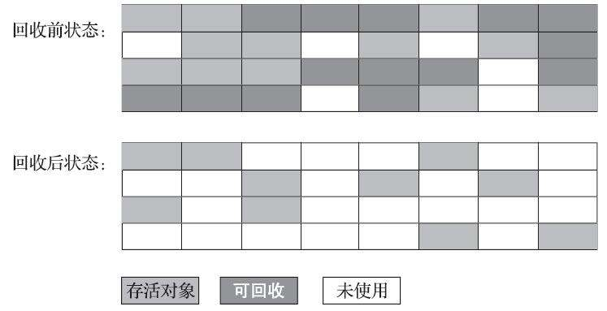
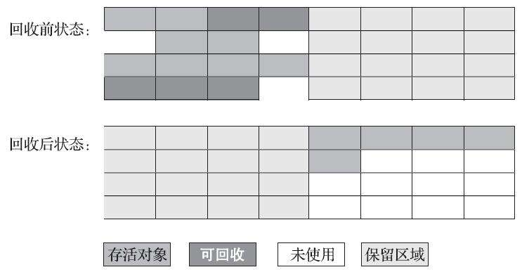
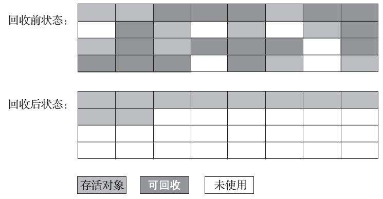
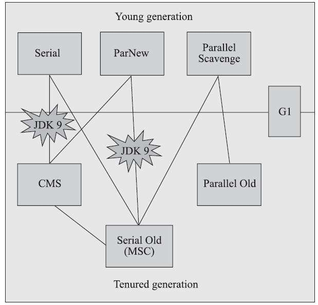
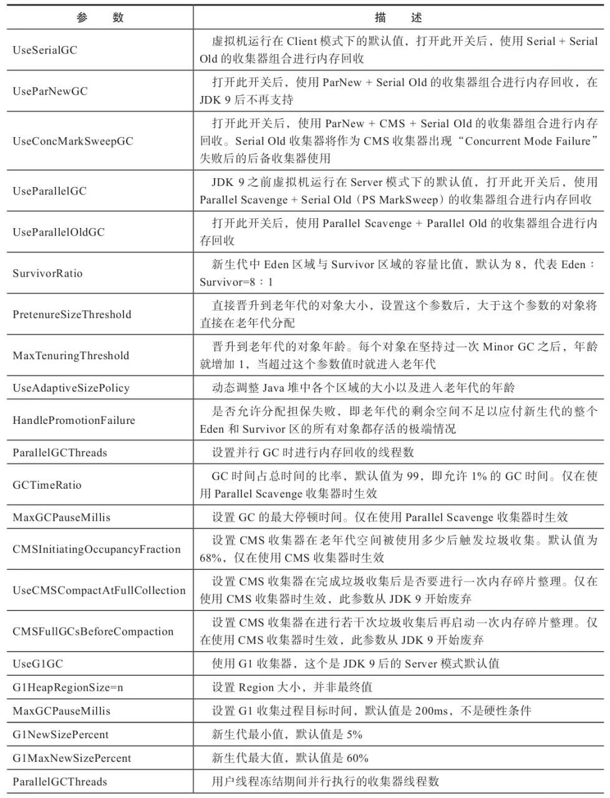
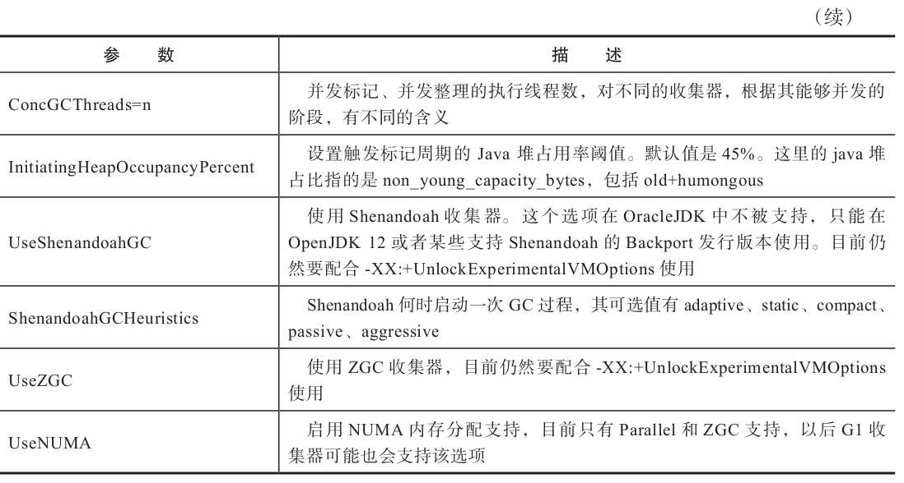

# 第 3 章 垃圾收集器与内存分配策略

## 3.1 概述

　　垃圾收集（Garbage Collection，下文简称GC）。

　　为什么要去了解垃圾收集和内存分配？当需要排查各种内存溢出、内存泄漏问题时，当垃圾收集成为系统达到更高并发量的瓶颈时，就必须对这些 “ 自动化 ” 的技术实施必要的监控和调节。 

　　程序计数器、虚拟机栈、本地方法栈 3 个区域随线程而生，随线程而灭，栈中的栈帧随着方法的进入和退出而有条不紊地执行着出栈和入栈操作。每一个栈帧中分配多少内存基本上是在类结构确定下来时就已知的（ 尽管在运行期会由即时编译器进行一些优化，但在基于概念模型的讨论里，大体上可以认为是编译期可知的 ），因此这几个区域的内存分配和回收都具备确定性，在这几个区域内就不需要过多考虑如何回收的问题，当方法结束或者线程结束时，内存自然就跟随着回收了。 

　　而 Java 堆和方法区这两个区域则有着很显著的不确定性：一个接口的多个实现类需要的内存可能会不一样，一个方法所执行的不同条件分支所需要的内存也可能不一样，只有处于运行期间，才能知道程序究竟会创建哪些对象，创建多少个对象，这部分内存的分配和回收是动态的。垃圾收集器所关注的正是这部分内存该如何管理，后续讨论中的 “ 内存 ” 分配与回收也仅仅特指这一部分内存。 

## 3.2 对象已死？

　　在堆里面存放着 Java 世界中几乎所有的对象实例，垃圾收集器在对堆进行回收前，第一件事情就是要确定这些对象之中哪些还 “ 存活 ” 着，哪些已经 “ 死去 ”（ “ 死去 ” 即不可能再被任何途径使用的对象）了。 

### 3.2.1 引用计数算法

　　很多教科书判断对象是否存活的算法是这样的：在对象中添加一个引用计数器，每当有一个地方引用它时，计数器值就加一；当引用失效时，计数器值就减一；任何时刻计数器为零的对象就是不可能再被使用的。

　　引用计数算法（ Reference Counting ）虽然占用了一些额外的内存空间来进行计数，但它的原理简单，判定效率也很高。

　　引用计数的一些比较著名的应用案例，例如微软COM（Component Object Model）技术、使用 ActionScript 3 的 FlashPlayer、Python 语言以及在游戏脚本领域得到许多应用的 Squirrel 中都使用了引用计数算法进行内存管理。

　　但是，在 Java 领域，至少主流的 Java 虚拟机里面都没有选用引用计数算法来管理内存，主要原因是，这个看似简单的算法有很多例外情况要考虑，必须要配合大量额外处理才能保证正确地工作，譬如单纯的引用计数就很难解决对象之间相互循环引用的问题。 

 ### 3.2.2 可达性分析算法

　　当前主流的商用程序语言（ Java、C#，上溯至前面古老的Lisp）的内存管理子系统，都是通过可达性分析（Reachability Analysis）算法来判定对象是否存活的。

　　可达性分析算法的基本思路就是通过一系列称为 “ GC Roots ” 的根对象作为起始节点集，从这些节点开始，根据引用关系向下搜索，搜索过程所走过的路径称为 “ 引用链 ”（Reference Chain），如果某个对象到 GC Roots 间没有任何引用链相连，或者用图论的话来说就是从 GC Roots 到这个对象不可达时，则证明此对象是不可能再被使用的。 

　　GC Roots 的对象包括以下几种： 

* 在虚拟机栈（ 栈帧中的本地变量表 ）中引用的对象，譬如各个线程被调用的方法堆栈中使用到的参数、局部变量、临时变量等。 
* 在方法区中类静态属性引用的对象，譬如 Java 类的引用类型静态变量。 
* 在方法区中常量引用的对象，譬如字符串常量池（ String Table ）里的引用。 
* 在本地方法栈中 JNI（ 即通常所说的 Native 方法 ）引用的对象。 
* Java 虚拟机内部的引用，如基本数据类型对应的 Class 对象，一些常驻的异常对象（ 比如 NullPointExcepiton、OutOfMemoryError ）等，还有系统类加载器。 
* 所有被同步锁（ synchronized 关键字 ）持有的对象。 
* 反映 Java 虚拟机内部情况的 JMXBean、JVMTI 中注册的回调、本地代码缓存等。

　　除了这些固定的 GC Roots 集合以外，根据用户所选用的垃圾收集器以及当前回收的内存区域不同，还可以有其他对象 “ 临时性 ” 地加入，共同构成完整 GC Roots 集合。

　　譬如分代收集和局部回收（Partial GC），如果只针对 Java 堆中某一块区域发起垃圾收集时（如最典型的只针对新生代的垃圾收集），必须考虑到内存区域是虚拟机自己的实现细节（在用户视角里任何内存区域都是不可见的），更不是孤立封闭的，所以某个区域里的对象完全有可能被位于堆中其他区域的对象所引用，这时候就需要将这些关联区域的对象也一并加入 GC Roots 集合中去，才能保证可达性分析的正确性。 

　　目前最新的几款垃圾回收器都具备了局部回收的特征，为了避免 GC Roots 包含过多对象而过度膨胀，它们在实现上也做出了各种优化处理。

### 3.2.3 再谈引用 

　　在 JDK 1.2 版之后，Java 对引用的概念进行了扩充，将引用分为强引用（ Strongly Re-ference ）、软引用（ Soft Reference ）、弱引用（ Weak Reference ）和虚引用（ Phantom Reference ）4 种，这 4 种引用强度依次逐渐减弱。 

* 强引用是最传统的 “ 引用 ” 的定义，是指在程序代码之中普遍存在的引用赋值，即类似 “ Object obj=new Object() ” 这种引用关系。无论任何情况下，只要强引用关系还存在，垃圾收集器就永远不会回收掉被引用的对象。

* 软引用是用来描述一些还有用，但非必须的对象。只被软引用关联着的对象，在系统将要发生内存溢出异常前，会把这些对象列进回收范围之中进行第二次回收，如果这次回收还没有足够的内存，才会抛出内存溢出异常。在 JDK 1.2 版之后提供了 SoftReference 类来实现软引用。 
* 弱引用也是用来描述那些非必须对象，但是它的强度比软引用更弱一些，被弱引用关联的对象只能生存到下一次垃圾收集发生为止。当垃圾收集器开始工作，无论当前内存是否足够，都会回收掉只被弱引用关联的对象。在 JDK 1.2 版之后提供了 WeakReference 类来实现弱引用。 
* 虚引用也称为 “ 幽灵引用 ” 或者 “ 幻影引用 ”，它是最弱的一种引用关系。一个对象是否有虚引用的存在，完全不会对其生存时间构成影响，也无法通过虚引用来取得一个对象实例。为一个对象设置虚引用关联的唯一目的只是为了能在这个对象被收集器回收时收到一个系统通知。在 JDK 1.2 版之后提供了 PhantomReference 类来实现虚引用。 

 ### 3.2.4 生存还是死亡？

　　即使在可达性分析算法中判定为不可达的对象，也不是 “ 非死不可 ” 的，这时候它们暂时还处于 “ 缓刑 ” 阶段，要真正宣告一个对象死亡，至少要经历两次标记过程：如果对象在进行可达性分析后发现没有与 GC Roots 相连接的引用链，那它将会被第一次标记，随后进行一次筛选，筛选的条件是此对象是否有必要执行 finalize() 方法。

　　假如对象没有覆盖 finalize() 方法，或者 finalize() 方法已经被虚拟机调用过，那么虚拟机将这两种情况都视为 “ 没有必要执行 ”。 

　　如果这个对象被判定为确有必要执行 finalize() 方法，那么该对象将会被放置在一个名为 F-Queue 的队列之中，并在稍后由一条由虚拟机自动建立的、低调度优先级的 Finalizer 线程去执行它们的 finalize() 方法。

　　这里所说的 “ 执行 ” 是指虚拟机会触发这个方法开始运行，但并不承诺一定会等待它运行结束。这样做的原因是，如果某个对象的 finalize() 方法执行缓慢，或者更极端地发生了死循环，将很可能导致 F-Queue 队列中的其他对象永久处于等待，甚至导致整个内存回收子系统的崩溃。finalize() 方法是对象逃脱死亡命运的最后一次机会，稍后收集器将对 F-Queue 中的对象进行第二次小规模的标记，如果对象要在 finalize() 中成功拯救自己——只要重新与引用链上的任何一个对象建立关联即可，譬如把自己（ this 关键字）赋值给某个类变量或者对象的成员变量，那在第二次标记时它将被移出 “ 即将回收 ” 的集合；如果对象这时候还没有逃脱，那基本上它就真的要被回收了。

　　任何一个对象的 finalize() 方法都只会被系统自动调用一次。

 ### 3.2.5 回收方法区

　　《 Java 虚拟机规范 》中提到过可以不要求虚拟机在方法区中实现垃圾收集，事实上也确实有未实现或未能完整实现方法区类型卸载的收集器存在（ 如 JDK 11 时期的 ZGC 收集器就不支持类卸载 ），方法区垃圾收集的 “ 性价比 ” 通常也是比较低的：在 Java 堆中，尤其是在新生代中，对常规应用进行一次垃圾收集通常可以回收 70% 至 99% 的内存空间，相比之下，方法区回收囿于苛刻的判定条件，其区域垃圾收集的回收成果往往远低于此。

　　方法区的垃圾收集主要回收两部分内容：废弃的常量和不再使用的类型。回收废弃常量与回收Java堆中的对象非常类似。

　　判定一个类型是否属于 “ 不再被使用的类 ” 的条件就比较苛刻了。需要同时满足下面三个条件： 

* 该类所有的实例都已经被回收，也就是 Java 堆中不存在该类及其任何派生子类的实例。 
* 加载该类的类加载器已经被回收，这个条件除非是经过精心设计的可替换类加载器的场景，如 OSGi、JSP 的重加载等，否则通常是很难达成的。 
* 该类对应的 java.lang.Class 对象没有在任何地方被引用，无法在任何地方通过反射访问该类的方法。 

　　Java 虚拟机被允许对满足上述三个条件的无用类进行回收，这里说的仅仅是 “ 被允许 ”，而并不是和对象一样，没有引用了就必然会回收。

　　关于是否要对类型进行回收，HotSpot 虚拟机提供了 -Xnoclassgc 参数进行控制，还可以使用 -verbose：class 以及 -XX：+TraceClass-Loading、-XX：+TraceClassUnLoading 查看类加载和卸载信息，其中 -verbose：class 和 -XX：+TraceClassLoading 可以在 Product 版的虚拟机中使用， -XX：+TraceClassUnLoading 参数需要 FastDebug 版的虚拟机支持。

　　在大量使用反射、动态代理、CGLib 等字节码框架，动态生成 JSP 以及 OSGi 这类频繁自定义类加载器的场景中，通常都需要 Java 虚拟机具备类型卸载的能力，以保证不会对方法区造成过大的内存压力。 


## 3.3 垃圾收集算法

　　从如何判定对象消亡的角度出发，垃圾收集算法可以划分为 “ 引用计数式垃圾收集 ”（Reference Counting GC）和 “ 追踪式垃圾收集 ”（Tracing GC）两大类，这两类也常被称作 “ 直接垃圾收集 ” 和 “ 间接垃圾收集 ”。

### 3.3.1 分代收集理论

　　当前商业虚拟机的垃圾收集器，大多数都遵循了 “ 分代收集 ”（Generational Collection） 的理论进行设计，分代收集名为理论，实质是一套符合大多数程序运行实际情况的经验法则，它建立在两个分代假说之上：

1.  弱分代假说（Weak Generational Hypothesis）：绝大多数对象都是朝生夕灭的。 
2. 强分代假说（Strong Generational Hypothesis）：熬过越多次垃圾收集过程的对象就越难以消亡。 

　　这两个分代假说共同奠定了多款常用的垃圾收集器的一致的设计原则：收集器应该将 Java 堆划分出不同的区域，然后将回收对象依据其年龄（ 年龄即对象熬过垃圾收集过程的次数 ）分配到不同的区域之中存储。显而易见，如果一个区域中大多数对象都是朝生夕灭，难以熬过垃圾收集过程的话，那么把它们集中放在一起，每次回收时只关注如何保留少量存活而不是去标记那些大量将要被回收的对象，就能以较低代价回收到大量的空间；如果剩下的都是难以消亡的对象，那把它们集中放在一块，虚拟机便可以使用较低的频率来回收这个区域，这就同时兼顾了垃圾收集的时间开销和内存的空间有效利用。 

　　在 Java 堆划分出不同的区域之后，垃圾收集器才可以每次只回收其中某一个或者某些部分的区域，也才能够针对不同的区域安排与里面存储对象存亡特征相匹配的垃圾收集算法（“ 标记 - 复制算法 ” “ 标记 - 清除算法 ” “ 标记 - 整理算法 ” 等针对性的垃圾收集算法）。

　　把分代收集理论具体放到现在的商用 Java 虚拟机里，设计者一般至少会把 Java 堆划分为新生代（Young Generation）和老年代（Old Generation）两个区域。顾名思义，在新生代中，每次垃圾收集时都发现有大批对象死去，而每次回收后存活的少量对象，将会逐步晋升到老年代中存放。

　　分代收集的困难：对象不是孤立的，对象之间会存在跨代引用。

　　为了解决这个问题，就需要对分代收集理论添加第三条经验法则：

3. 跨代引用假说（Intergenerational Reference Hypothesis）：跨代引用相对于同代引用来说仅占极少数。

　　跨代引用家说的隐含推论：存在互相引用关系的两个对象，是应该倾向于同时生存或者同时消亡的。

　　依据这条假说，就不应再为了少量的跨代引用去扫描整个老年代，也不必浪费空间专门记录每一个对象是否存在及存在哪些跨代引用，只需在新生代上建立一个全局的数据结构（ 该结构被称为 “ 记忆集 ”，Remembered Set ），这个结构把老年代划分成若干小块，标识出老年代的哪一块内存会存在跨代引用。此后当发生 Minor GC 时，只有包含了跨代引用的小块内存里的对象才会被加入到 GC Roots进行扫描。虽然这种方法需要在对象改变引用关系（ 如将自己或者某个属性赋值 ）时维护记录数据的正确性，会增加一些运行时的开销，但比起收集时扫描整个老年代来说仍然是划算的。

* 部分收集（ Partial GC ）：指目标不是完整收集整个 Java 堆的垃圾收集，其中又分为：
  * 新生代收集（Minor GC/Young GC）：指目标只是新生代的垃圾收集。
  * 老年代收集（Major GC/Old GC）：指目标只是老年代的垃圾收集。CMS收集器会有单独收集老年代的行为。

* 混合收集（Mixed GC）：指目标是收集整个新生代以及部分老年代的垃圾收集。m氨只有 G1 收集器会有混合收集。

* 整堆收集（Full GC）：收集整个 Java 堆和方法区的垃圾收集。

 ### 3.3.2 标记 - 清除算法 

　　最早出现、最基础的垃圾收集算法是 " 标记 - 清除 " 算法。

　　1960 年由 Lisp 之父 John McCarthy 提出。

　　算法分为 “ 标记 ” 和 “ 清除 ” 两个阶段：首先标记出所有需要回收的对象，在标记完成后，统一回收掉所有被标记的对象，也可以反过来，标记存活的对象，统一回收所有未被标记的对象。标记过程就是对象是否属于垃圾的判定过程，

　　后续的收集算法大多都是以标记 - 清除算法为基础，对其缺点进行改进而得到的。

　　主要缺点有两个：

1. 第一个是执行效率不稳定，如果 Java 堆中包含大量对象，而且其中大部分是需要被回收的，这时必须进行大量标记和清除的动作，导致标记和清除两个过程的执行效率都随对象数量增长而降低；
2. 第二个是内存空间的碎片化问题，标记、清除之后会产生大量不连续的内存碎片，空间碎片太多可能会导致当以后在程序运行过程中需要分配较大对象时无法找到足够的连续内存而不得不提前触发另一次垃圾收集动作

　　” 标记 - 清除 “ 算法示意图：



 ### 3.3.3 标记 - 复制算法 

 　　为了解决标记 - 清除算法面对大量可回收对象时执行效率低的问题，1969 年 Fenichel 提出了一种称为 “ 半区复制 ”（Semispace Copying）的垃圾收集算法。它将可用内存按容量划分为大小相等的两块，每次只使用其中的一块。当这一块的内存用完了，就将还存活着的对象复制到另外一块上面，然后再把已使用过的内存空间一次清理掉。如果内存中多数对象都是存活的，这种算法将会产生大量的内存间复制的开销，但对于多数对象都是可回收的情况，算法需要复制的就是占少数的存活对象，而且每次都是针对整个半区进行内存回收，分配内存时也就不用考虑有空间碎片的复杂情况，只要移动堆顶指针，按顺序分配即可。

 　　优点：实现简单，运行高效。

　　缺点：可用内存缩小为了原来的一半，空间浪费未免太多了一点。

　　” 标记 - 复制 “ 算法示意图：



　　现在的商用 Java 虚拟机大多都优先采用了这种收集算法去回收新生代。

　　" 朝生夕灭 " 特点诠释：新生代中的对象有 98% 熬不过第一轮收集。

　　在 1989 年，Andrew Appel 提出了一种更优化的半区复制分代策略，现在称为 “ Appel 式回收 ”。HotSpot 虚拟机的 Serial、ParNew 等新生代收集器均采用了这种策略来设计新生代的内存布局。

　　Appel 式回收的具体做法是把新生代分为一块较大的 Eden 空间和两块较小的 Survivor 空间，每次分配内存只使用 Eden 和其中一块 Survivor。发生垃圾搜集时，将 Eden 和 Survivor 中仍然存活的对象一次性复制到另外一块 Survivor 空间上，然后直接清理掉 Eden 和已用过的那块 Survivor 空间。HotSpot 虚拟机默认 Eden 和 Survivor 的大小比例是 8∶1，也即每次新生代中可用内存空间为整个新生代容量的 90%。

　　Appel 式回收还有一个充当罕见情况的 “ 逃生门 ” 的安全设计，当 Survivor 空间不足以容纳一次 Minor GC 之后存活的对象时，就需要依赖其他内存区域（ 实际上大多就是老年代 ）进行分配担保（ Handle Promotion ）。

　　如果另外一块 Survivor 空间没有足够空间存放上一次新生代收集下来的存活对象，这些对象便将通过分配担保机制直接进入老年代，这对虚拟机来说就是安全的。

### 3.3.4 标记 - 整理算法

　　标记 - 复制算法在对象存活率较高时就要进行较多的复制操作，效率将会降低。而且，如果不想浪费 50% 的空间，就需要有额外的空间进行分配担保，以应对被使用的内存中所有对象都 100% 存活的极端情况，所以在老年代一般不能直接选用这种算法。

　　针对老年代对象的存亡特征。1974 年 Edward Lueders 提出了有针对性地 ” 标记 - 整理 “（Mark-Compact）算法。其中标记过程仍然与 “ 标记-清除 ” 算法一样，但后续步骤不是直接对可回收对象进行清理，而是让所有存活的对象都向内存空间一端移动，然后直接清理掉边界以外的内存。

　　” 标记 - 整理 “ 算法地示意图如下所示：



　　标记 - 清除算法与标记 - 整理算法的本质差异在于前者是一种非移动式的回收算法，而后者是移动式的。是否移动回收后的存活对象是一项优缺点并存的风险决策：如果移动存活对象，尤其是在老年代这种每次回收都有大量对象存活区域，移动存活对象并更新所有引用这些对象的地方将会是一种极为负重的操作，而且这种对象移动操作必须全程暂停用户应用程序才能进行。

　　但如果跟标记 - 清除算法那样完全不考虑移动和整理存活对象的话，弥散于堆中的存活对象导致的空间碎片化问题就只能依赖更为复杂的内存分配器和内存访问器来解决。

　　内存的访问是用户程序最频繁的操作，甚至都没有之一，假如在这个环节上增加了额外的负担，势必会直接影响应用程序的吞吐量。

　　基于以上两点，是否移动对象都存在弊端，移动则内存回收时会更复杂，不移动则内存分配时会更复杂。

　　从垃圾收集的停顿时间来看，不移动对象停顿时间会更短，甚至可以不需要停顿，但是从整个程序的吞吐量来看，移动对象会更划算。

　　吞吐量的实质是赋值器（Mutator，可以理解为使用垃圾收集的用户程序，为便于理解，多数地方用 “ 用户程序 ” 或 “ 用户线程 ” 代替）与收集器的效率总和。

　　即使不移动对象会使得收集器的效率提升一些，但因内存分配和访问相比垃圾收集频率要高得多，这部分的耗时增加，总吞吐量仍然是下降的。

　　HotSpot 虚拟机里面关注吞吐量的 Parallel Scavenge 收集器是基于标记 - 整理算法的，而关注延迟的 CMS 收集器则是基于标记 - 清除算法的。

　　也可以不在内存分配和访问上增加太大额外负担，做法是让虚拟机平时多数时间都采用标记 - 清除算法，暂时容忍内存碎片的存在，直到内存空间的碎片化程度已经大到影响对象分配时，再采用标记 - 整理算法收集一次，以获得规整的内存空间。基于标记 - 清除算法的 CMS 收集器面临空间碎片过多时采用的就是这种处理办法。

## 3.4 HotSpot 的算法细节实现

### 3.4.1 根节点枚举

　　固定可作为 GC Roots 的节点主要在全局性的引用（例如常量或类静态属性）与执行上下文（例如栈帧中的本地变量表）中，尽管目标明确，但查找过程要做到高效并非一件容易的事情，现在 Java 应用越做越庞大，光是方法区的大小就常有数百上千兆，里面的类、常量等更是恒河沙数，若要逐个检查以这里为起源的引用肯定得消耗不少时间。

　　迄今为止，所有收集器在根节点枚举这一步骤时都是必须暂停用户线程的，因此毫无疑问根节点枚举与之前提及的整理内存碎片一样会面临相似的 “ Stop The World ” 的困扰。

　　可达性分析算法耗时最长的查找引用链的过程已经可以做到与用户线程一起并发，但根节点枚举始终还是必须在一个能保障一致性的快照中才得以进行。

　　” 一致性 ” 的意思是整个枚举期间执行子系统看起来就像被冻结在某个时间点上，不会出现分析过程中，根节点集合的对象引用关系还在不断变化的情况，若这点不能满足的话，分析结果准确性也就无法保证。这是导致垃圾收集过程必须停顿所有用户线程的其中一个重要原因，即使是号称停顿时间可控，或者（几乎）不会发生停顿的 CMS、G1、ZGC 等收集器，枚举根节点时也是必须要停顿的。 

　　目前主流 Java 虚拟机使用的都是准确式垃圾收集，所以当用户线程停顿下来之后，其实并不需要一个不漏地检查完所有执行上下文和全局的引用位置，虚拟机应当是有办法直接得到哪些地方存放着对象引用的。

　　在 HotSpot 的解决方案里，是使用一组称为 OopMap 的数据结构来达到这个目的。一旦类加载动作完成的时候，HotSpot 就会把对象内什么偏移量上是什么类型的数据计算出来，在即时编译过程中，也会在特定的位置记录下栈里和寄存器里哪些位置是引用。这样收集器在扫描时就可以直接得知这些信息了，并不需要真正一个不漏地从方法区等 GC Roots 开始查找。 

### 3.4.2 安全点

　　在 OopMap 的协助下，HotSpot 可以快速准确地完成 GC Roots 枚举，但一个很现实的问题随之而来：可能导致引用关系变化，或者说导致 OopMap 内容变化的指令非常多，如果为每一条指令都生成对应的 OopMap，那将会需要大量的额外存储空间，这样垃圾收集伴随而来的空间成本就会变得无法忍受的高昂。 

　　HotSpot 也的确没有为每条指令都生成 OopMap，只是在 “ 特定的位置 ” 记录了这些信息，这些位置被称为**安全点**（Safepoint）。有了安全点的设定，也就决定了用户程序执行时并非在代码指令流的任意位置都能够停顿下来开始垃圾收集，而是**强制要求必须执行到达安全点后才能够暂停**。

　　安全点的选定既不能太少以至于让收集器等待时间过长，也不能太过频繁以至于过分增大运行时的内存负荷。

　　安全点位置的选取基本上是以 “ 是否具有让程序长时间执行的特征 ” 为标准进行选定的，因为每条指令执行的时间都非常短暂，程序不太可能因为指令流长度太长这样的原因而长时间执行，“ 长时间执行 ” 的最明显特征就是指令序列的复用，例如方法调用、循环跳转、异常跳转等都属于指令序列复用，所以只有具有这些功能的指令才会产生安全点。 

　　另外一个需要考虑的问题是，如何在垃圾收集发生时让所有线程（这里其实不包括执行 JNI 调用的线程）都跑到最近的安全点，然后停顿下来。这里有两种方案可供选择：抢先式中断（Preemptive Suspension）和主动式中断（Voluntary Suspension）。

　　抢先式中断不需要线程的执行代码主动去配合，在垃圾收集发生时，系统首先把所有用户线程全部中断，如果发现有用户线程中断的地方不在安全点上，就恢复这条线程执行，让它一会再重新中断，直到跑到安全点上。现在几乎没有虚拟机实现采用抢先式中断来暂停线程响应 GC 事件。 

　　主动式中断的思想是当垃圾收集需要中断线程的时候，不直接对线程操作，仅仅简单地设置一个标志位，各个线程执行过程时会不停地主动去轮询这个标志，一旦发现中断标志为真时就自己在最近的安全点上主动中断挂起。轮询标志的地方和安全点是重合的，另外还要加上所有创建对象和其他需要在 Java 堆上分配内存的地方，这是为了检查是否即将要发生垃圾收集，避免没有足够内存分配新对象。 

　　由于轮询操作在代码中会频繁出现，这要求它必须足够高效。HotSpot 使用内存保护陷阱的方式，把轮询操作精简至只有一条汇编指令的程度。

### 3.4.3 安全区域 

　　使用安全点的设计似乎已经完美解决如何停顿用户线程，让虚拟机进入垃圾回收状态的问题了，但实际情况却不一定。安全点机制保证了程序执行时，在不太长的时间内就会遇到可进入垃圾收集过程的安全点。

　　而程序不执行就是没有分配处理器时间，而当用户线程处于 Sleep 状态或者 Blocked 状态，这时候线程无法响应虚拟机的中断请求，不能再走到安全的地方去中断挂起自己，虚拟机也显然不可能持续等待线程重新被激活分配处理器时间。对于这种情况，就必须引入安全区域（Safe Region）来解决。 

　　**安全区域是指能够确保在某一段代码片段之中，引用关系不会发生变化，因此，在这个区域中任意地方开始垃圾收集都是安全的**。

　　当用户线程执行到安全区域里面的代码时，首先会标识自己已经进入了安全区域，那样当这段时间里虚拟机要发起垃圾收集时就不必去管这些已声明自己在安全区域内的线程了。当线程要离开安全区域时，它要检查虚拟机是否已经完成了根节点枚举（或者垃圾收集过程中其他需要暂停用户线程的阶段），如果完成了，那线程就当作没事发生过，继续执行；否则它就必须一直等待，直到收到可以离开安全区域的信号为止。 

### 3.4.4 记忆集与卡表

　　为解决对象跨代引用所带来的问题，垃圾收集器在新生代中建立了名为记忆集（Remembered Set）的数据结构，用以避免把整个老年代加进  GC Roots 扫描范围。

　　所有涉及部分区域收集（Partial GC）行为的垃圾收集器，典型的如 G1、ZGC 和 Shenandoah 收集器，都会面临相同的问题。

　　**记忆集是一种用于记录从非收集区域指向收集区域的指针集合的抽象数据结构**。

　　如果不考虑效率和成本的话，最简单的实现可以用非收集区域中所有含跨代引用的对象数组来实现这个数据结构。

　　这种记录全部含跨代引用对象的实现方案，无论是空间占用还是维护成本都相当高昂。

　　而在垃圾收集的场景中，收集器只需要通过记忆集判断出某一块非收集区域是否存在有指向了收集区域的指针就可以了，并不需要了解这些跨代指针的全部细节。

　　列举一些可供选择的记录精度：

* 字长精度：每个记录精确到一个机器字长（就是处理器的寻址位数，如常见的 32 位或 64 位，这个精度决定了机器访问物理内存地址的指针长度），该字包含跨代指针。

* 对象精度：每个记录精确到一个对象，该对象里有字段含有跨代指针。

* 卡精度：每个记录精确到一块内存区域，该区域内有对象含有跨代指针。

　　" 卡精度 ” 所指的是用一种称为 “ 卡表 ”（Card Table）的方式去实现记忆集，这也是目前最常用的一种记忆集实现形式，一些资料中甚至直接把它和记忆集混为一谈。

　　记忆集其实是一种 “ 抽象 ” 的数据结构，抽象的意思是只定义了记忆集的行为意图，并没有定义其行为的具体实现。卡表就是记忆集的一种具体实现，它定义了记忆集的记录精度、与堆内存的映射关系等。

　　卡表最简单的形式可以只是一个字节数组，而数组中的每一个元素都对应着其标识的内存区域中一块特定大小的内存块，这个内存块被称作 “ 卡页 ”（Card Page）。一般来说，卡页大小都是以 2 的 N 次幂的字节数。

　　HotSpot 中使用的卡页是 2 的 9 次幂，即 512 字节。

　　一个卡页的内存中通常包含不止一个对象，只要卡页内有一个（或更多）对象的字段存在着跨代指针，那就将对应卡表的数组元素的值标识为1，称为这个元素变脏（Dirty），没有则标识为 0。在垃圾收集发生时，只要筛选出卡表中变脏的元素，就能轻易得出哪些卡页内存块中包含跨代指针，把它们加入 GC Roots 中一并扫描。

### 3.4.5 写屏障

　　卡表元素何时变脏：有其他分代区域中对象引用了本区域对象时，其对应的卡表元素就应该变脏，变脏时间点原则上应该发生在引用类型字段赋值的那一刻。

　　在 HotSpot 虚拟机里是通过写屏障（Write Barrier）技术维护卡表状态的。

　　写屏障可以看作在虚拟机层面对 “ 引用类型字段赋值 ” 这个动作的 AOP 切面，在引用对象赋值时会产生一个环形（Around）通知，供程序执行额外的动作，也就是说赋值的前后都在写屏障的覆盖范畴内。在赋值前的部分的写屏障叫作写前屏障（Pre-Write Barrier），在赋值后的则叫作写后屏障（Post-Write Barrier）。

　　HotSpot 虚拟机的许多收集器中都有使用到写屏障，但直至 G1 收集器出现之前，其他收集器都只用到了写后屏障。

　　应用写屏障后，虚拟机就会为所有赋值操作生成相应的指令，一旦收集器在写屏障中增加了更新卡表操作，无论更新的是不是老年代对新生代对象的引用，每次只要对引用进行更新，就会产生额外的开销，不过这个开销与 Minor GC 描整个老年代的代价相比还是低得多的。

　　除了写屏障的开销外，卡表在高并发场景下还面临着 “ 伪共享 ”（False Sharing）问题。为了避免伪共享问题，一种简单的解决方案是不采用无条件的写屏障，而是先检查卡表标记，只有当该卡表元素未被标记过时才将其标记为变脏。

　　在 JDK 7 之后，HotSpot 虚拟机增加了一个新的参数 -XX：+UseCondCardMark，用来决定是否开启卡表更新的条件判断。开启会增加一次额外判断的开销，但能够避免伪共享问题，两者各有性能损耗，是否打开要根据应用实际运行情况来进行测试权衡。

### 3.4.6 并发的可达性分析

　　当前主流编程语言的垃圾收集器基本上都是依靠可达性分析算法来判定对象是否存活的，可达性分析算法理论上要求全过程都基于一个能保障一致性的快照中才能够进行分析，这意味着必须全程冻结用户线程的运行。

　　在根节点枚举这个步骤中，由于 GC Roots 相比起整个 Java 堆中全部的对象毕竟还算是极少数，且在各种优化技巧（如 OopMap ）的加持下，它带来的停顿已经是非常短暂且相对固定（不随堆容量而增长）的了。

　　可从 GC Roots 再继续往下遍历对象图，这一步骤的停顿时间就必定会与 Java 堆容量直接成正比例关系了：堆越大，存储的对象越多，对象图结构越复杂，要标记更多对象而产生的停顿时间自然就更长，这听起来是理所当然的事情。

　　要知道包含 “ 标记 ” 阶段是所有追踪式垃圾收集算法的共同特征，如果这个阶段会随着堆变大而等比例增加停顿时间，其影响就会波及几乎所有的垃圾收集器，如果能够削减这部分停顿时间的话，那收益也将会是系统性的。

　　为什么必须在一个能保障一致性的快照上才能进行对象图的遍历？引入三色标记作为工具来辅助推导，把遍历对象图过程中遇到的对象，按照 “ 是否访问过 ” 这个条件标记成一下三种颜色：

* 白色：表示对象尚未被垃圾收集器访问过。

  显然在可达性分析刚刚开始的阶段，所有的对象都是白色的，若在分析结束的阶段，仍然是白色的对象，即代表不可达。

* 黑色：表示对象已经被垃圾收集器访问过，且这个对象的所有引用都已经扫描过。

  黑色的对象代表已经扫描过，它是安全存活的，如果有其他对象引用指向了黑色对象，无须重新扫描一遍。黑色对象不可能直接（不经过灰色对象）指向某个白色对象。

* 灰色：表示对象已经被垃圾收集器访问过，但这个对象上至少存在一个引用还没有被扫描过。

　　如果用户线程与收集器是并发工作，收集器在对象图上标记颜色，同时用户线程在修改引用关系——即修改对象图的结构，这样可能出现两种后果。一种是把原本消亡的对象错误标记为存活，这不是好事，但其实是可以容忍的，只不过产生了一点逃过本次收集的浮动垃圾而已，下次收集清理掉就好。另一种是把原本存活的对象错误标记为已消亡，这就是非常致命的后果了，程序肯定会因此发生错误。

　　致命错误具体按是如何产生的，如下图所示：


　　当且仅当以下两个条件同时满足时，会产生 “ 对象消失 ” 的问题，即原本应该是黑色的对象被误标为白色：

* 赋值器插入了一条或多条从黑色对象到白色对象的新引用；

* 赋值器删除了全部从灰色对象到该白色对象的直接或间接引用。

　　要解决并发扫描时的对象消失问题，只需破坏这两个条件的任意一个即可。由此分别产生了两种解决方案：增量更新（Incremental Update）和原始快照（Snapshot At The Beginning，SATB）。

　　增量更新要破坏的是第一个条件，当黑色对象插入新的指向白色对象的引用关系时，就将这个新插入的引用记录下来，等并发扫描结束之后，再将这些记录过的引用关系中的黑色对象为根，重新扫描一次。可以理解为，黑色对象一旦新插入了指向白色对象的引用之后，它就变回灰色对象了。

　　原始快照要破坏的是第二个条件，当灰色对象要删除指向白色对象的引用关系时，就将这个要删除的引用记录下来，在并发扫描结束之后，再将这些记录过的引用关系中的灰色对象为根，重新扫描一次。这也可以简化理解为，无论引用关系删除与否，都会按照刚刚开始扫描那一刻的对象图快照来进行搜索。

　　以上无论是对引用关系记录的插入还是删除，虚拟机的记录操作都是通过写屏障实现的。

　　在 HotSpot 虚拟机中，增量更新和原始快照这两种解决方案都有实际应用，譬如，CMS 是基于增量更新来做并发标记的，G1、Shenandoah 则是用原始快照来实现。

## 3.5 经典垃圾收集器

　　不同的厂商、不同版本的虚拟机所包含的垃圾收集器都可能会有很大差别，不同的虚拟机一般也都会提供各种参数供用户根据自己的应用特点和要求组合出各个内存分代所使用的收集器。

 　　HotSpot 虚拟机的垃圾收集器：



　　上图展示了七种作用于不同分代的收集器，如果两个收集器之间存在连线，就说明它们可以搭配使用，图中收集器所处的区域，则表示它是属于新生代收集器抑或是老年代收集器。

### 3.5.1 Serial 收集器

　　Serial 收集器是最基础、历史最悠久的收集器，曾经（在 JDK 1.3.1 之前）是 HotSpot 虚拟机新生代收集器的唯一选择。

　　这个收集器是一个单线程工作的收集器，这个 " 单线程 ” 的意义并不仅仅是说明它只会使用一个处理器或一条收集线程去完成垃圾收集工作，更重要的是强调在它进行垃圾收集时，必须暂停其他所有工作线程，直到它收集结束。暂停其他所有工作线程这项工作是由虚拟机在后台自动发起和自动完成的，在用户不可知、不可控的情况下把用户的正常工作的线程全部停掉，这对很多应用来说都是不能接受的。

　　Serial / Serial Old 收集器运行示意图：


　　Serial 收集器依然是 HotSpot 虚拟机运行在客户端模式下的默认新生代收集器，有着优于其他收集器的地方，那就是**简单而高效**（与其他收集器的单线程相比），对于内存资源受限的环境，它是所有收集器里额外内存消耗（Memory Footprint）最小的。

　　对于单核处理器或处理器核心数较少的环境来说，Serial 收集器由于没有线程交互的开销，专心做垃圾收集自然可以获得最高的单线程收集效率。在用户桌面的应用场景以及近年来流行的部分微服务应用中，分配给虚拟机管理的内存一般来说并不会特别大，收集几十兆甚至一两百兆的新生代（仅仅是指新生代使用的内存，桌面应用甚少超过这个容量），垃圾收集的停顿时间完全可以控制在十几、几十毫秒，最多一百多毫秒以内，只要不是频繁发生收集，这点停顿时间对许多用户来说是完全可以接受的。所以，Serial 收集器对于运行在客户端模式下的虚拟机来说是一个很好的选择。

### 3.5.2 ParNew 收集器 

　　ParNew 收集器实质上是 Serial 收集器的多线程并行版本，除了同时使用多条线程进行垃圾收集之外，其余的行为包括 Serial 收集器可用的所有控制参数（例如：-XX：SurvivorRatio、-XX：PretenureSizeThreshold、-XX：HandlePromotionFailure 等）、收集算法、Stop The World、对象分配规则、回收策略等都与 Serial 收集器完全一致，在实现上这两种收集器也共用了相当多的代码。

　　ParNew 收集器的工作过程如下图所示：


　　ParNew 收集器除了支持多线程并行收集之外，其他与 Serial 收集器相比并没有太多创新之处，但它却是不少运行在服务端模式下的 HotSpot 虚拟机，尤其是 JDK 7 之前的遗留系统中首选的新生代收集器，其中有一个与功能、性能无关但其实很重要的原因是：除了 Serial 收集器外，目前只有它能与 CMS 收集器配合工作。

　　在 JDK 5 发布时，HotSpot 推出了一款在强交互应用中几乎可称为具有划时代意义的垃圾收集器 —— CMS 收集器。这款收集器是 HotSpot 虚拟机中第一款真正意义上支持并发的垃圾收集器，它首次实现了让垃圾收集线程与用户线程（基本上）同时工作。

　　但是，CMS 作为老年代的收集器，却无法与 JDK 1.4.0 中已经存在的新生代收集器 Parallel Scavenge 配合工作，所以在 JDK 5 中使用 CMS 来收集老年代的时候，新生代只能选择 ParNew 或者 Serial 收集器中的一个。ParNew 收集器是激活 CMS 后（使用 -XX：+UseConcMarkSweepGC 选项）的默认新生代收集器，也可以使用 -XX：+/-UseParNewGC 选项来强制指定或者禁用它。

　　随着垃圾收集器技术的不断改进，更先进的 G1 收集器作为 CMS 继承者和替代者登场。G1 是一个面向全堆的收集器，不再需要其他新生代收集器的配合工作。所以自 JDK 9 开始，ParNew 加 CMS 收集器的组合就不再是官方推荐的服务端模式下的收集器解决方案了。希望它能完全被 G1 所取代，甚至还取消了 ParNew 加 Serial Old 以及 Serial 加 CMS 这两组收集器组合的支持（其实原本也很少人这样使用），并直接取消了 -XX：+UseParNewGC 参数，这意味着 ParNew 和 CMS 从此只能互相搭配使用，再也没有其他收集器能够和它们配合了。从此以后，ParNew 合并入 CMS，成为它专门处理新生代的组成部分。ParNew 可以说是 HotSpo t虚拟机中第一款退出历史舞台的垃圾收集器。

　　ParNew 收集器在单核心处理器的环境中绝对不会有比 Serial 收集器更好的效果，甚至由于存在线程交互的开销，该收集器在通过超线程（Hyper-Threading）技术实现的伪双核处理器环境中都不能百分之百保证超越 Serial 收集器。

　　当然，随着可以被使用的处理器核心数量的增加，ParNew 对于垃圾收集时系统资源的高效利用还是很有好处的。它默认开启的收集线程数与处理器核心数量相同，在处理器核心非常多（譬如 32 个，现在 CPU 都是多核加超线程设计，服务器达到或超过 32 个逻辑核心的情况非常普遍）的环境中，可以使用 -XX：ParallelGCThreads 参数来限制垃圾收集的线程数。

　　并行和并发都是并发编程中的专业名词，在谈论垃圾收集器的上下文语境中，它们可以理解为：

* 并行（Parallel）：并行描述的是多条垃圾收集器线程之间的关系，说明同一时间有多条这样的线程在协同工作，通常默认此时用户线程是处于等待状态。
* 并发（Concurrent）：并发描述的是垃圾收集器线程与用户线程之间的关系，说明同一时间垃圾收集器线程与用户线程都在运行。由于用户线程并未被冻结，所以程序仍然能响应服务请求，但由于垃圾收集器线程占用了一部分系统资源，此时应用程序的处理的吞吐量将受到一定影响。

### 3.5.3 Parallel Scavenge 收集器 

　　Parallel Scavenge 收集器也是一款新生代收集器，它同样是基于标记 - 复制算法实现的收集器，也是能够并行收集的多线程收集器。

　　Parallel Scavenge 收集器的特点是它的关注点与其他收集器不同，CMS 等收集器的关注点是尽可能地缩短垃圾收集时用户线程的停顿时间，而 Parallel Scavenge 收集器的目标则是达到一个可控制的吞吐量（Throughput）。

　　吞吐量就是处理器用于运行用户代码的时间与处理器总消耗时间的比值，即：


　　高吞吐量则可以最高效率地利用处理器资源，尽快完成程序的运算任务，主要适合在后台运算而不需要太多交互的分析任务。

　　Parallel Scavenge 收集器提供了两个参数用于精确控制吞吐量，分别是控制最大垃圾收集停顿时间的 -XX：MaxGCPauseMillis 参数以及直接设置吞吐量大小的 -XX：GCTimeRatio 参数。

　　-XX：MaxGCPauseMillis 参数允许的值是一个大于 0 的毫秒数，收集器将尽力保证内存回收花费的时间不超过用户设定值。

　　垃圾收集停顿时间缩短是以牺牲吞吐量和新生代空间为代价换取的。

　　-XX：GCTimeRatio 参数的值则应当是一个大于 0 小于 100 的整数，也就是垃圾收集时间占总时间的比率，相当于吞吐量的倒数。 

　　Parallel Scavenge 收集器也经常被称作 “ 吞吐量优先收集器 ” 。 

　　Parallel Scavenge 收集器还有一个参数 -XX：+UseAdaptiveSizePolicy ， 这是一个开关参数，当这个参数被激活之后，就不需要人工指定新生代的大小（-Xmn）、Eden 与 Survivor 区的比例（-XX：SurvivorRatio）、晋升老年代对象大小（-XX：PretenureSizeThreshold）等细节参数了，虚拟机会根据当前系统的运行情况收集性能监控信息，动态调整这些参数以提供最合适的停顿时间或者最大的吞吐量。这种调节方式称为**垃圾收集的自适应的调节策略**（GC Ergonomics）。只需要把基本的内存数据设置好（如 -Xmx 设置最大堆），然后使用 -XX：MaxGCPauseMillis 参数（更关注最大停顿时间）或 -XX：GCTimeRatio（更关注吞吐量）参数给虚拟机设立一个优化目标，那具体细节参数的调节工作就由虚拟机完成了。

　　自适应调节策略也是 Parallel Scavenge 收集器区别于 ParNew 收集器的一个重要特性。

### 3.5.4 Serila Old 收集器

　　Serial Old 是 Serial 收集器的老年代版本，它同样是一个单线程收集器，使用标记 - 整理算法。这个收集器供客户端模式下的 HotSpot 虚拟机使用。

　　在服务端模式下，它也可能有两种用途：

1. 一种是在 JDK 5 以及之前的版本中与 Parallel Scavenge 收集器搭配使用。
2. 另外一种就是作为 CMS 收集器发生失败时的后备预案，在并发收集发生 Concurrent Mode Failure 时使用。

### 3.5.5 Parallel Old 收集器 

　　Parallel Old 是 Parallel Scavenge 收集器的老年代版本，支持多线程并发收集，基于标记 - 整理算法实现。

　　这个收集器直到 JDK 6 时才开始提供的。

　　如果新生代选择了 Parallel Scavenge 收集器，老年代除了 Serial Old（PS MarkSweep）收集器以外别无选择，其他表现良好的老年代收集器，如 CMS 无法与它配合工作。由于老年代 Serial Old 收集器在服务端应用性能上的 “ 拖累 ”，使用 Parallel Scavenge 收集器也未必能在整体上获得吞吐量最大化的效果。同样，由于单线程的老年代收集中无法充分利用服务器多处理器的并行处理能力，在老年代内存空间很大而且硬件规格比较高级的运行环境中，这种组合的总吞吐量甚至不一定比 ParNew 加 CMS 的组合来得优秀。

　　直到 Parallel Old 收集器出现后，“ 吞吐量优先 ” 收集器终于有了比较名副其实的搭配组合，在注重吞吐量或者处理器资源较为稀缺的场合，都可以优先考虑 Parallel Scavenge 加 Parallel Old 收集器这个组合。

 

### 3.5.6 CMS 收集器

　　CMS（Concurrent Mark Sweep）收集器是一种以获取最短回收停顿时间为目标的收集器。

　　系统停顿时间尽可能短，以给用户带来良好的交互体验。CMS 收集器就非常符合这类应用的需求。

　　CMS 收集器是基于标记 - 清除算法实现，整个过程分为四个步骤，包括：

1. 初始标记（CMS initialmark）
2. 并发标记（CMS concurrent mark）
3. 重新标记（CMS remark）
4. 并发清除（CMS concurrent sweep）

　　初始标记、重新标记这两个步骤仍然需要 “ Stop The World ”。初始标记仅仅只是标记一下 GC Roots 能直接关联到的对象，速度很快。

　　并发标记阶段就是从 GC Roots 的直接关联对象开始遍历整个对象图的过程，这个过程耗时较长但是不需要停顿用户线程，可以与垃圾收集线程一起并发运行。

　　重新标记阶段则是为了修正并发标记期间，因用户程序继续运作而导致标记产生变动的那一部分对象的标记记录，这个阶段停顿时间通常会比初始标记阶段稍长一些，但也远比并发标记阶段的时间短。

　　并发清除阶段，清理删除掉标记阶段判断的已经死亡的对象，由于不需要移动存活对象，所以这个阶段也是可以与用户线程同时并发的。

　　耗时最长的并发标记和并发清除阶段中，垃圾收集器线程都可以与用户线程一起工作，所以从总体上来说，CMS收集器的内存回收过程是与用户线程一起并发执行的。

 　　Concurrent Mark Sweep 收集器运行示意图：

 

 　　CMS 收集器的优点：并发收集、低停顿。

 　　CMS 收集器的缺点：

1. CMS收集器对处理器资源非常敏感。

   在并发阶段，它虽然不会导致用户线程停顿，但却会因为占用了一部分线程（或者说处理器的计算能力）而导致应用程序变慢，降低总吞吐量。

   CMS 默认启动的回收线程数是（处理器核心数量+3）/4，也就是说，如果处理器核心数在四个或以上，并发回收时垃圾收集线程只占用不超过 25% 的处理器运算资源，并且会随着处理器核心数量的增加而下降。但是当处理器核心数量不足四个时，CMS 对用户程序的影响就可能变得很大。如果应用本来的处理器负载就很高，还要分出一半的运算能力去执行收集器线程，就可能导致用户程序的执行速度忽然大幅降低。

   为了缓解这种情况，虚拟机提供了一种称为 “ 增量式并发收集器”（Incremental Concurrent Mark Sweep/i-CMS）的 CMS 收集器变种，所做的事情和以前单核处理器年代 PC 机操作系统靠抢占式多任务来模拟多核并行多任务的思想一样，是在并发标记、清理的时候让收集器线程、用户线程交替运行，尽量减少垃圾收集线程的独占资源的时间，这样整个垃圾收集的过程会更长，但对用户程序的影响就会显得较少一些。

   从 JDK 7 开始，i-CMS 模式已经被声明为 “deprecated”，即已过时不再提倡用户使用，到 JDK 9 发布后 i-CMS 模式被完全废弃。

2. 由于 CMS 收集器无法处理 “ 浮动垃圾 ”（Floating Garbage），有可能出现 “ Con-current Mode Failure ” 失败进而导致另一次完全 “ Stop The World ” 的 Full GC 的产生。

   在 CMS 的并发标记和并发清理阶段，用户线程是还在继续运行的，程序在运行自然就还会伴随有新的垃圾对象不断产生，但这一部分垃圾对象是出现在标记过程结束以后，CMS 无法在当次收集中处理掉它们，只好留待下一次垃圾收集时再清理掉。这一部分垃圾就称为“浮动垃圾“。

   由于在垃圾收集阶段用户线程还需要持续运行，那就还需要预留足够内存空间提供给用户线程使用，因此 CMS 收集器不能像其他收集器那样等待到老年代几乎完全被填满了再进行收集，必须预留一部分空间供并发收集时的程序运作使用。

   在 JDK 5 的默认设置下，CMS 收集器当老年代使用了 68% 的空间后就会被激活，可以适当调高参数 -XX：CMSInitiatingOccupancyFraction 的值来提高 CMS 的触发百分比，降低内存回收频率，获取更好的性能。

   到了 JDK 6 时，CMS 收集器的启动阈值就已经默认提升至92%。

   但是，要是 CMS 运行期间预留的内存无法满足程序分配新对象的需要，就会出现一次 “ 并发失败 ”（Concurrent Mode Failure），这时候虚拟机将不得不启动后备预案：冻结用户线程的执行，临时启用 Serial Old 收集器来重新进行老年代的垃圾收集，但这样停顿时间就很长了。

   所以参数 -XX：CMSInitiatingOccupancyFraction 设置得太高将会很容易导致大量的并发失败产生，性能反而降低，用户应在生产环境中根据实际应用情况来权衡设置。

3. CMS 是一款基于“标记-清除”算法实现的收集器。这就意味着收集结束时会有大量空间碎片产生。空间碎片过多时，将会给大对象分配带来很大麻烦，往往会出现老年代还有很多剩余空间，但就是无法找到足够大的连续空间来分配当前对象，而不得不提前触发一次 Full GC 的情况。

   CMS 收集器提供了一个 -XX：+UseCMS-CompactAtFullCollection 开关参数（默认是开启的，此参数从 JDK 9 开始废弃），用于在 CMS 收集器不得不进行 Full GC 时开启内存碎片的合并整理过程，由于这个内存整理必须移动存活对象，（在 Shenandoah 和 ZGC 出现前）是无法并发的。

   参数 -XX：CMSFullGCsBefore-Compaction（此参数从JDK 9开始废弃），这个参数的作用是要求CMS收集器在执行过若干次（数量由参数值决定）不整理空间的 Full GC 之后，下一次进入 Full GC 前会先进行碎片整理（默认值为 0，表示每次进入 Full GC 时都进行碎片整理）。 

### 3.5.7 Garbage First 收集器

 

Garbage First（简称G1）收集器

 

 

开创了收集器面向局部收集的设计思路和基于Region的内存布局形式。

 

 

G1是一款主要面向服务端应用的垃圾收集器

 

 

JDK 9发布之日，G1宣告取代Parallel Scavenge加Parallel Old组合，成为服务端模式下的默认垃圾收集器

 

 

作为CMS收集器的替代者和继承人，设计者们希望做出一款能够建立起“停顿时间模型”（Pause Prediction Model）的收集器

 

 

停顿时间模型的意思是能够支持指定在一个长度为M毫秒的时间片段内，消耗在垃圾收集上的时间大概率不超过N毫秒这样的目标，这几乎已经是实时Java（RTSJ）的中软实时垃圾收集器特征了。

 

 

G1

 

 

可以面向堆内存任何部分来组成回收集（Collection Set，一般简称CSet）进行回收，衡量标准不再是它属于哪个分代，而是哪块内存中存放的垃圾数量最多，回收收益最大，这就是G1收集器的Mixed GC模式。

 

 

G1不再坚持固定大小以及固定数量的分代区域划分，而是把连续的

 

 

Java堆划分为多个大小相等的独立区域（Region），每一个Region都可以根据需要，扮演新生代的Eden空间、Survivor空间，或者老年代空间

 

 

收集器能够对扮演不同角色的Region采用不同的策略去处理，这样无论是新创建的对象还是已经存活了一段时间、熬过多次收集的旧对象都能获取很好的收集效果。

 

 

Region中还有一类特殊的Humongous区域，专门用来存储大对象。G1认为只要大小超过了一个Region容量一半的对象即可判定为大对象

 

 

每个Region的大小可以通过参数-XX：G1HeapRegionSize设定，取值范围为1MB～32MB，且应为2的N次幂

 

 

而对于那些超过了整个Region容量的超级大对象，将会被存放在N个连续的Hu

 

 

mongous Region之中，G1的大多数行为都把Humongous Region作为老年代的一部分来进行看待

 

 

虽然G1仍然保留新生代和老年代的概念，但新生代和老年代不再是固定的了，它们都是一系列区域（不需要连续）的动态集合

 

 

G1收集器去跟踪各个Region里面的垃圾堆积的“价值”大小，价值即回收所获得的空间大小以及回收所需时间的经验值，然后在后台维护一个优先级列表，每次根据用

 

 

户设定允许的收集停顿时间（使用参数-XX：MaxGCPauseMillis指定，默认值是200毫秒），优先处理回收价值收益最大的那些Region

 

 

这种使用Region划分内存空间，以及具有优先级的区域回收方式，保证了G1收集器在有限的时间内获取尽可能高的收集效率。

 

 

将Java堆分成多个独立Region后，Region里面存在的跨Region引用对象如何解决？

 

 

用记忆集避免全堆作为GC Roots扫描，但在G1收集器上记忆集的应用其实要复杂很多，它的每个Region都维护有自己的记忆集，这些记忆集会记录下别的Region指向自己的指针，并标记这些

 

 

指针分别在哪些卡页的范围之内

 

 

G1的记忆集在存储结构的本质上是一种哈希表，Key是别的Region的起始地址，Value是一个集合，里面存储的元素是卡表的索引号

 

 

由于Region数量比传统收集器的分代数量明显要多得多，因此G1收集器要比其他的传统垃圾收集器有着更高的内存占用负担

 

 

根据经验，G1至少要耗费大约相当于Java堆容量10%至20%的额外内存来维持收集器工作。

 

 

在并发标记阶段如何保证收集线程与用户线程互不干扰地运行

 

 

用户线程改变对象引用关系时，必须保证其不能打破原本的

 

 

对象图结构，导致标记结果出现错误，

 

 

解决办法

 

 

MS收集器采用增量更新算法实现，而G1收集器则是通过原始快照（SATB）算法来实

 

 

现的。

 

 

垃圾收集对用户线程的影响还体现在回收过程中新创建对象的内存分配上，程序要继续运行就肯定会持续有新对象被创建

 

 

1为每一个Region设计了两个名为TAMS（Top at Mark Start）的指针，把Region中的一部分空间划分出来用于并发回收过程中的新对象分配，并发回收时新分配的对象地址都必须要在这两个指针位置以上

 

 

G1收集器默认在这个地址以上的对象是被隐式标记过的，即默认它们是存活的，不纳入回收范围

 

 

与CMS中的“Concurrent Mode Failure”失败

 

 

会导致Full GC类似，如果内存回收的速度赶不上内存分配的速度，G1收集器也要被迫冻结用户线程执行，导致Full GC而产生长时间“Stop The World”。

 

 

怎样建立起可靠的停顿预测模型

 

 

通过-XX：MaxGCPauseMillis参数指定的停顿时间只意味着垃圾收集发生之前的期望值

 

 

但G1收集器要怎么做才能满足用户的期望呢

 

 

G1收集器的停顿预测模型是以衰减均值（Decaying Average）为理论基础来实现的，在垃圾收集过程中，G1收集器会记录每个Region的回收耗时、每个Region记忆集里的脏卡数量等各个可测量的步骤花费的成本，并分析得出平均值、标准偏差、置信度等统计信息。

微信读书

深入理解Java虚拟机：JVM高级特性与最佳实践（第3版）

周志明

36个笔记

3.5 经典垃圾收集器

 

衰减平均值”是指它

 

 

会比普通的平均值更容易受到新数据的影响，平均值代表整体平均状态，但衰减平均值更准确地代表“最近的”平均状态

 

 

Region的统计状态越新越能决定其回收的价值

 

 

通过这些信息预测现在开始回收的话，由哪些Region组成回收集才可以在不超过期望停顿时间的约束下获得最高的收益。

 

 

，G1收集器的运作过程大致可划分为以下四个步骤：

 

 

初始标记（Initial Marking）：仅仅只是标记一下GC Roots能直接关联到的对象，并且修改TAMS指针的值，让下一阶段用户线程并发运行时，能正确地在可用的Region中分配新对

 

 

象。这个阶段需要停顿线程，但耗时很短，而且是借用进行Minor GC的时候同步完成的，所以G1收集器在这个阶段实际并没有额外的停顿。

 

 

并发标记（Concurrent Marking）：从GC Root开始对堆中对象进行可达性分析，递归扫描整个堆里的对象图，找出要回收的对象，这阶段耗时较长，但可与用户程序并发执行。当对象图扫描完成以后，还要重新处理SATB记录下的在并发时有引用变动的对象。

 

 

最终标记（Final Marking）：对用户线程做另一个短暂的暂停，用于处理并发阶段结束后仍遗留下来的最后那少量的SATB记录。

 

 

筛选回收（Live Data Counting and Evacuation）：负责更新Region

 

 

的统计数据，对各个Region的回收价值和成本进行排序，根据用户所期望的停顿时间来制定回收计划，可以自由选择任意多个Region构成回收集，然后把决定回收的那一部分Region的存活对象复制到空的Region中，再清理掉整个旧Region的全部空间

 

 

这里的操作涉及存活对象的移动，是必须暂停用户线程，由多条收集器线程并行完成的。

 

 

G1收集器除了并发标记外，其余阶段也是要完全暂停用户线程的，换言之，它并非纯粹地追求低延迟，官方给它设定的目标是在延迟可控的情况下获得尽可能高的吞吐量，所以才能担当起“全功能收集器”的重任与期望

 

 

可以由用户指定期望的停顿时间是G1收集器很强大的一个功

 

 

能，设置不同的期望停顿时间，可使得G1在不同应用场景中取得关注吞吐量和关注延迟之间的最佳平衡

 

 

它默认的停顿目标为两百毫秒

 

 

停顿时间调得非常低

 

 

收集器收集的速度逐渐跟不上分配器分配的速度，导致垃圾慢慢堆积

 

 

最终占满堆引发Ful

 

 

GC反而降低性能

 

 

通常把期望停顿时间设置为一两百毫秒或者两三百毫秒会是比较合理的

 

 

可以指定最大停顿时间

 

 

分Region的内存布局、按收益动态确定回收集

 

 

G1从整体来看是基于“标记-整理”算法实现的收集器

 

 

但从局部（两个Region之间）上看又是基于“标记-复制”算法实现

 

 

着G1运作期间不会产生内存空间碎片，垃圾收集完成之后能提供规整的可用内存

 

 

有利于程序长时间运行，在程序为大对象分配内存时不容易因无法找到连续内存空间而提前触

 

 

发下一次收集。

 

 

G1的弱项

 

 

在用户程序运行过程中，G1无论是为了垃圾收集产生的内存占用（Footprint）还是程序运行时的额外执行负载（Overload）都要比CMS要高。

 

 

就内存占用来说，虽然G1和CMS都使用卡表来处理跨代指针，但G1的卡表实现更为复杂，而且堆中每个Region，无论扮演的是新生代还是老年代角色，都必须有一份卡表，这导致G1的记忆集（和其他内存消耗）可能会占整个堆容量的20%乃至更多的内存空间；相比起来CMS的卡表就相当简单，只有

 

 

唯一一份，而且只需要处理老年代到新生代的引用，反过来则不需要，由于新生代的对象具有朝生夕灭的不稳定性，引用变化频繁，能省下这个区域的维护开销是很划算的[插图]。

 

 

在执行负载的角度上，同样由于两个收集器各自的细节实现特点导致了用户程序运行时的负载会有不同，譬如它们都使用到写屏障，CMS用写后屏障来更新维护卡表；而G1除了使用写后屏障来进行同样的（由于G1的卡表结构复杂，其实是更烦琐的）卡表维护操作外，为了实现原始快照搜索（SATB）算法，还需要使用写前屏障来跟踪并发时的指针变化情况

 

 

相比起增量更新算法，原始快照搜索能够减少并发标记和重新标记阶段的消耗，避免CMS那样在最终标记阶段停顿时间过长的缺点，但是在用户程序运行过程中确实会产生由跟踪引用变化带来的额外负担。由于G1对写屏障的复杂操作要比CMS消耗更多的运算资源，所以CMS的写屏障实现是直接的同步操作，而G1就不得不将其实现为类似于消息队列的结构，把写前屏障和写后屏障中要做的事情都放到队列里，然后再异步处理。

 

 

目前在小内存应用上CMS的表现大概率仍然要会优于G1，而在大内存应用上G1则大多能发挥其优势

 

 

这个优劣势的Java堆容量平衡点通常在6GB至8GB之间

微信读书

## 3.6 低延迟垃圾收集器

深入理解Java虚拟机：JVM高级特性与最佳实践（第3版）

周志明

45个笔记

3.6 低延迟垃圾收集器

 

衡量垃圾收集器的三项最重要的指标是：内存占用（Footprint）、吞吐量（Throughput）和延迟（Latency）

 

 

一款优秀的收集器通常最多可以同时达成其中的两项。

 

 

在内存占用、吞吐量和延迟这三项指标里，延迟的重要性日益凸显，越发备受关注

 

 

原因是随着计算机硬件的发展、性能的提升，我们越来越能容忍收集器多占用一点点内存；硬件性能增长，对软件系统的处理能力是有直接助益的，硬件的规格和性能越高，也有助于降低收集器运行时对应用程序的影响，换句话说，吞吐量会更高

 

 

但对延迟则不是这样，硬件规格提升，准确地说是内存的扩大，对延迟反而会带来负面的效果

 

 

虚拟机要回收完整的1TB的堆内存，毫无疑问要比回收1GB的堆内存耗

 

 

费更多时间

 

 

CMS和G1之前的全部收集器，其工作的所有步骤都会产生“Stop The World”式的停顿

 

 

CMS和G1分别使用增量更新和原始快照（见3.4.6节）技术，实现了标记阶段的并发，不会因管理的堆内存变大，要标记的对象变多而导致停顿时间随之增长。但是对于标记阶段之后的处理，仍未得到妥善解决

 

 

CMS使用标记-清除算法，虽然避免了整理阶段收集器带来的停顿，但是清除

 

 

算法不论如何优化改进，在设计原理上避免不了空间碎片的产生，随着空间碎片不断淤积最终依然逃不过“Stop The World”的命运。G1虽然可以按更小的粒度进行回收，从而抑制整理阶段出现时间过长的停顿，但毕竟也还是要暂停的。

 

 

Shenandoah和ZGC，几乎整个工作过程全部都是并发

 

 

的，只有初始标记、最终标记这些阶段有短暂的停顿，这部分停顿的时间基本上是固定的，与堆的容量、堆中对象的数量没有正比例关系

 

 

，它们都可以在任意可管理的（譬如现在ZGC只能管理4TB以内的堆）堆容量下，实现垃圾收集的停顿都不超过十毫秒

 

 

这两款目前仍处于实验状态的收集器，被官方命名为“低延迟垃圾收集器”（Low-Latency Garbage Collector或者Low-Pause-Time Garbage Collector）。

 

 

Shenandoah是一款只有OpenJDK才会包含，而OracleJDK里反而不存在的收集器

 

 

目标是实现一种能在任何堆内存大小下都可以把垃圾收集的停顿时间限制在十毫秒以内的垃圾收集器

 

 

该目标意味着相比CMS和G1，Shenandoah不仅要进行并发的垃圾标记，还要并发地进行对象清理后的整理动作。

 

 

Shenandoah

 

 

像是G1的下一代

 

 

继承者，它们两者有着相似的堆内存布局，在初始标记、并发标记等许多阶段的处理思路上都高度一致，甚至还直接

 

 

共享了一部分实现代码，这使得部分对G1的打磨改进和Bug修改会同时反映在Shenandoah之上，而由于Shenandoah加入所带来的一些新特性，也有部分会出现在G1收集器中，譬如在并发失败后作为“逃生门”的Full GC[插图]，G1就是由于合并了Shenandoah的代码才获得多线程Full GC的支持

 

 

Shenandoah也是使用基于Region的堆内存布局，同样有着用于存放大对象的Humongous Region，默认的回收策略也同样是优先处理回收价值最大的Region……但在管理堆内存方面，它与G1至少有三个明显的不同之处，最重要的当然是支持并发的整理算法，G1的回收阶段是可以多线程并行的，但却不能与用户线程并发，

 

 

Shenandoah（目前）是默认不使用分代收集的，换言之，不会有专门的新生代Region或者老年代Region的存在，没有实现分代，并不是说分代对Shenandoah没有价值，这更多是出于性价比的权衡，基于工作量上的考虑而将其放到优先级较低的位置上

 

 

Shenandoah摒弃了在G1中耗费大量内存和计算资源去维护的记忆集，改用名为“连接矩阵”（Connection Matrix）的全局数据结构来记录跨Region的引用关系，降低了处理跨代指针时的记忆集维护消耗，也降低了伪共享问题（见3.4.4节）的发生概率

 

 

连接矩阵可以简单理解为一张二维表格，如果Region N有对象指向Region M，就在表

 

 

格的N行M列中打上一个标记

 

 

如果Region 5中的对象Baz引用了Region 3的Foo，Foo又引用了Region 1的Bar，那连接矩阵中的5行3列、3行1列就应该被打上标记。在回收时通过这张表格就可以得出哪些Region之间产生了跨代引用

 

 

Shenandoah收集器的工作过程大致可以划分为以下九个阶段

 

 

初始标记（Initial Marking）：与G1一样，首先标记与GC Roots直接关联的对象，这个阶段仍是“Stop The World”的，但停顿时间与堆大小无关，只与GC Roots的数量相关。

 

 

并发标记（Concurrent Marking）：与G1一样，遍历对象图，标记出全部可达的对象，这个阶段是与用户线程一起并发的，时间长短取决于堆中存活对象的数量以及对象图的结构复杂

 

 

程度

 

 

最终标记（Final Marking）：与G1一样，处理剩余的SATB扫描，并在这个阶段统计出回收价值最高的Region，将这些Region构成一组回收集（Collection Set）。最终标记阶段也会有一小段短暂的停顿。

 

 

并发清理（Concurrent Cleanup）：这个阶段用于清理那些整个区域内连一个存活对象都没有找到的Region（这类Region被称为Immediate Garbage Region）。

 

 

并发回收（Concurrent Evacuation）：并发回收阶段是Shenandoah与之前HotSpot中其他收集器的核心差异。在这个阶段，Shenandoah要把回收集里面的存活对象先复制一份到其他未被使用的Region之中。复制对象这

 

 

件事情如果将用户线程冻结起来再做那是相当简单的，但如果两者必须要同时并发进行的话，就变得复杂起来了。其困难点是在移动对象的同时，用户线程仍然可能不停对被移动的对象进行读写访问，移动对象是一次性的行为，但移动之后整个内存中所有指向该对象的引用都还是旧对象的地址，这是很难一瞬间全部改变过来的。

 

 

对于并发回收阶段遇到的这些困难，Shenandoah将会通过读屏障和被称为“Brooks Pointers”的转发指针来解决

 

 

并发回收阶段运行的时间长短取决于回收集的大小

 

 

初始引用更新（Initial Update Reference）：并发回收阶段复制对象结束后，还需要把堆中所有指向旧对象

 

 

的引用修正到复制后的新地址，这个操作称为引用更新

 

 

设立这个阶段只是为了建立一个线程集合点，确保所有并发回收阶段中进行的收集器线程都已完成分配给它们的对象移动任务而已。初始引用更新时间很短，会产生一个非常短暂的停顿。

 

 

并发引用更新（Concurrent Update Reference）：真正开始进行引用更新操作，这个阶段是与用户线程一起并发的，时间长短取决于内存中涉及的引用数量的多少

 

 

并发引用更新与并发标记不同，它不再需要沿着对象图来搜索，只需要按照内存物理地址的顺序，线性地搜索出引用类型，把旧值改为新值即可。

 

 

最终引用更新（Final Update

 

 

Reference）：解决了堆中的引用更新后，还要修正存在于GC Roots中的引用。这个阶段是Shenandoah的最后一次停顿，停顿时间只与GC Roots的数量相关。

微信读书

深入理解Java虚拟机：JVM高级特性与最佳实践（第3版）

周志明

50个笔记

3.6 低延迟垃圾收集器

 

并发清理（Concurrent Cleanup）：经过并发回收和引用更新之后，整个回收集中所有的Region已再无存活对象，这些Region都变成Immediate Garbage Regions了，最后再调用一次并发清理过程来回收这些Region的内存空间，供以后新对象分配使用。

 

 

三个最重要的并发阶段（并发标记、并发回收、并发引用更新

 

 

对象移动与用户程序并发

 

 

要做类似的并发操作，通常是在被移动对象原有的内存上设置保护陷阱（Memory Protection Trap），

 

 

一旦用户程序访问到归属于旧对象的内存空间就会产生自陷中段，进入预设好的异常处理器中，再由其中的代码逻辑把访问转发到复制后的新对象上。

 

 

虽然

 

 

确实能够实现对象移动与用户线程并发，但是如果没有操作系统层面的直接支持，这种方案将导致用户态频繁切换到核心态[插图]，代价是非常大的，不能频繁使用[插图]。

 

 

Brooks提出的新方案不需要用到内存保护陷阱，而是在原有对象布局结构的最前面统一增加一个新的引用字段，在正常不处于并发移动的情况下，

 

 

该引用指向对象自己

 

 

从结构上来看，Brooks提出的转发指针与某些早期Java虚拟机使用过的句柄定位（关于对象定位详见第2章）有一些相似之处，两者都是一种间接性的对象访问方式，差别是句柄通常会统一存储在专门的句柄池中，而转发指针是分散存放在每一个对象头前面

 

 

缺点

 

 

每次对象访问会带来一次额外的转向开销，尽管这个开销已经被优化到只有一行汇编指令的程度

 

 

对象定位会被频繁使用到

 

 

仍是一笔不可忽视的执行成本，

 

 

只是它比起内存保护陷阱的方案已经好了很多

 

 

转发指针加入后带来的收益自然是当对象拥有了一份新的副本时，只需要修改一处指针的值，即旧对象上转发指针的引用位置，使其指向新对象，便可将所有对该对象的访问转发到新的副本上。这样只要旧对象的内存仍然存在，未被清理掉，虚拟机内存中所有通过旧引用地址访问的代码便仍然可用，都会被自动转发到新对象上继续工作，

 

 

Brooks形式的转发指针在设计上决定了它是必然会出现多线程竞争问题的，如果收集器线程与用户线程发生的只是并发读取，那无论读到旧对象还是新对象上的字段，返回的结果都应该是一样的，这个场景还可以有一些“偷懒”的处理余地；但如果发生

 

 

的是并发写入，就一定必须保证写操作只能发生在新复制的对象上，而不是写入旧对象的内存中

 

 

收集器线程复制了新的对象副本；2）用户线程更新对象的某个字段；3）收集器线程更新转发指针的引用值为新副本地址。

 

 

如果不做任何保护措施，让事件2

 

 

在事件1、事件3之间发生的话，将导致的结果就是用户线程对对象的变更发生在旧对象上，所以这里必须针对转发指针的访问操作采取同步措施，让收集器线程或者用户线程对转发指针的访问只有其中之一能够成功，另外一个必须等待，避免两者交替进行

 

 

实际上Shenandoah收集器是通过比较并交换（Compare And Swap，CAS）操作[插图]来保证并发时对象的访问正确性的

 

 

转发指针另一点必须注意的是执行频率的问题，

 

 

尽管通过对象头上的Brooks Pointer来保证并发时原对象与复制对象的访问一致性

 

 

为了实现Brooks Pointer，Shenandoah在读、写屏障中都加入了额外的转发处理，尤其是使用读屏障的代价，这是比写屏障更大的。代码里对象读取的出现频率要比对象写入的频率高出很多，读屏障数量自然也要比写屏障多得多，所以读屏障的使用必须更加谨慎，不允许任何的重量

 

 

级操作

 

 

计划在JDK 13中将Shenandoah的内存屏障模型改进为基于引用访问屏障（Load Reference Barrier）[插图]的实现

 

 

“引用访问屏障”是指内存屏障只拦截对象中数据类型为引用类型的读写操作，而不去管原生数据类型等其他非引用字段的读写，这能够省去大量对原生类型、对象比较、对象加锁等场景中设置内存屏障所带来的消耗。

 

 

ZGC

 

 

作Z Garbage Collector

 

 

是一款在JDK 11中新加入的具有实验性质[插图]的低延迟垃圾收集器，是由Oracle公司研发的。

 

 

2018年Oracle创建了JEP 333将ZGC提交给OpenJDK，推动其进入OpenJDK 11的发布清单之中。

 

 

ZGC和Shenandoah的目标是高度相似的，都希望在尽可能对吞吐量影响不太大的前提下[插图]，实现在任意堆内存大小下都可以把垃圾收集的停顿时间限制在十毫秒以内的低延迟

 

 

早在2005年，运行在Azul VM上的PGC就已经实现了标记和整理阶段都全程与用户线程并发运行的垃圾收集

 

 

运行在Zing VM上的C4收集器是PGC继续演进的产物，主要增加了分代收集支持，大幅提升了收集器能够承受的对象分配速度

 

 

ZGC收集器是一款基于Region内存布局的，（暂时）不设分代的，使用了读屏障、染色指针和内存多重映射等技术来实现可并发的标记-整理算法的，以低延迟为首要目标的一款垃圾收集器

 

 

ZGC也采用基于Region的堆内存布局，但与它们不同的是，ZGC的Region（在一些官方资料中将它称为Page或者ZPage，本章为行文一致继续称为Region）具有

 

 

动态性——动态创建和销毁，以及动态的区域容量大小

 

 

在x64硬件平台下，ZGC的Region可以具有如图3-19所示的大、中、小三类容量：

 

 

小型Region（Small Region）：容量固定为2MB，用于放置小于256KB的小对象。

 

 

中型Region（Medium Region）：容量固定为32MB，用于放置大于等于256KB但小于4MB的对象。

 

 

大型Region（Large Region）：容量不固定，可以动态变化，但必须为2MB的整数倍，用于放置4MB或以上的大对象

 

 

每个大型Region中只会存放一个大对象，

 

 

但它的实际容量完全有可能小于中型Region，最小容量可低至4MB

 

 

大型Region在ZGC的

 

 

实现中是不会被重分配（重分配是ZGC的一种处理动作，用于复制对象的收集器阶段，稍后会介绍到）的，因为复制一个大对象的代价非常高昂

 

 

ZGC的核心问题——并发整理算法的实现

 

 

Shenandoah使用转发指针和读屏障来实现并发整理，ZGC虽然同样用到了读屏障，但用的却是一条与Shenandoah完全不同，更加复杂精巧的解题思路。

 

 

ZGC收集器有一个标志性的设计是

 

 

它采用的染色指针技术（Colored Pointer，其他类似的技术中可能将它称为Tag Pointer或者Version Pointer）

微信读书

深入理解Java虚拟机：JVM高级特性与最佳实践（第3版）

周志明

56个笔记

3.6 低延迟垃圾收集器

 

如果我们要在对象上存储一些额外的、只供收集器或者虚拟机本身使用的数据，通常会在对象头中增加额外的存储字段（详见2.3.2节的内容），如对象的哈希码、分代年龄、锁记录等就是这样存储的。这种记录方式在有对象访问的场景下是很自然流畅的，不会有什么额外负担。但如果对象存在被移动过的可能性，即不能保证对象访问能够成功呢？又或者有一些根本就不会去访问对象，但又希望得知该对象的某些信息的应用场景呢？能不能从指针或者与对象内存无关的地方得到这些信息，譬如是否能够看出来对象被移动过？

 

 

某个对象只有它的引用关系能决定它存活与否，对象上其他所有的属性都不能够影响它的存活判定结果

 

 

G1、Shenandoah使用了一种相当于堆内存的1/64大小的，称为BitMap的结构来记录标记信息

 

 

ZGC的染色指针是最直接的、最纯粹的，它直接把标记信息记在引用对象的指针上

 

 

染色指针是一种直接将少量额外的信息存储在指针上的技术

 

 

尽管Linux下64位指针的高18位不能用来寻址，但剩余的46位指针所能支持的64TB内存在今天仍然能够充分满足大型服务器的需要。鉴于此，ZGC的染色指针技术继续盯上了这剩下的46位指针宽度，将其高4位提取出来存储四个标志信息

 

 

通过这些标志位，虚拟机可以直接从指针中看到其引用对象的三色标记状态、是否进入了重分配集（即被移动过）、是否只能通过finalize()方法才能被访问到

 

 

染色指针有4TB的内存限制，不能支持32位平台，不能支持压缩指针（-XX：+UseCompressedOops）等诸多约束，但它带来的收益也是非常可观的

 

 

染色指针的三大优势：

 

 

染色指针可以使得一旦某个Region的存活对象被移走之后，这个Region立即就能够被释放和重用掉，而不必等待整个堆中所有指向该

 

 

Region的引用都被修正后才能清理

 

 

·染色指针可以大幅减少在垃圾收集过程中内存屏障的使用数量，设置内存屏障，尤其是写屏障的目的通常是为了记录对象引用的变动情况，如果将这些信息直接维护在指针中，显然就可以省去一些专门的记录操作

 

 

ZGC对吞吐量的影响也相对较低。

 

 

染色指针可以作为一种可扩展的存储结构用来记录更多与对象标记、重定位过程相关的数据，以便日后进一步提高性能

 

 

顺利应用染色指针有一个必须解决的前置问题：Java虚拟机作为一个普普通通的进程，这样随意重新定义内存中某些指针的其中几位，操作系统是否支持？处理器是否支持

 

 

题在Solaris/SPARC平台上比较容易解决，因为SPARC硬件层面本身就支持虚拟地址掩码，设置之后其机器指令直接

 

 

就可以忽略掉染色指针中的标志位。但在x86-64平台上并没有提供类似的黑科技，ZGC设计者就只能采取其他的补救措施了，这里面的解决方案要涉及虚拟内存映射技术

 

 

处理器会

 

 

使用分页管理机制把线性地址空间和物理地址空间分别划分为大小相同的块，这样的内存块被称为“页”（Page）

 

 

通过在线性虚拟空间的页与物理地址空间的页之间建立的映射表，分页管理机制会进行线性地址到物理地址空间的映射，完成线性地址到物理地址的转换[插图]

 

 

不同层次的虚拟内存到物理内存的转换关系可以在硬件层面、操作系统层面或者软件进程层面实现，如何完成地

 

 

址转换，是一对一、多对一还是一对多的映射，也可以根据实际需要来设计

 

 

Linux/x86-64平台上的ZGC使用了多重映射（Multi-Mapping）将多个不同的虚拟内存地址映射到同一个物理内存地址上，这是一种多对一映射，意味着ZGC在虚拟内存中看到的地址空间要比实际的堆内存容量来得更大

 

 

把染色指针中的标志位看作是地址的分段符，那只要将这些不同的地址段都映射到同一个物理内存空间，经过多重映射转换后，就可以使用染色指针正常进行寻址了

 

 

ZGC收集器是如何工作的

 

 

ZGC的运作过程大致可划分为以下四个大的阶段。全部四个阶段都是可以并发执行的，仅是两个阶段中间会存在短暂的停顿小阶段

 

 

这些小阶段，譬如初始化GC Root直接关联对象的Mark Start，与之前G1和Shenandoah的Initial Mark阶段并没有什么差异，

 

 

并发标记（Concurrent Mark）：与G1、Shenandoah一样，并发标记是遍历对象图做可达性分析的阶段，前后也要经过类似于G1、Shenandoah的初始标记、最终标记（尽管ZGC中的名字不叫这些）的短暂停顿，而且这些停顿阶段所做的事情在目标上也是相类似的

 

 

与G1、Shenandoah不同的是，ZGC的标记是在指针上而不是在对象上进行的，标记阶段会更新染色指针中的Marked 0、Marked 1标志位

 

 

并发预备重分配（Concurrent Prepare for Relocate）：这个阶段需要根据特定的查询条件统计得出本次收集过程要清理哪些Region，将这些Region组成重分配集（Relocation

 

 

Set）

 

 

重分配集与G1收集器的回收集（Collection Set）还是有区别的，ZGC划分Region的目的并非为了像G1那样做收益优先的增量回收。相反，ZGC每次回收都会扫描所有的Region，用范围更大的扫描成本换取省去G1中记忆集的维护成本

 

 

ZGC的重分配集只是决定了里面的存活对象会被重新复制到其他的Region中，里面的Region会被释放，而并不能说回收行为就只是针对这个集合里面的Region进行，因为标记过程是针对全堆的。此外，在JDK 12的ZGC中开始支持的类卸载以及弱引用的处理，也是在这个阶段中完成的。 

 

 

并发重分配（Concurrent Relocate）：重分配是ZGC执行过程中的核心阶段，这个过程要把重分配集中的存活对象复制到新的Region上，并为重分配集中的每个Region维护一个转发表（Forward Table），记录从旧对象到新对象的转向关系

 

 

得益于染色指针的支持，ZGC收集器能仅从引用上就明确得知一个对象是否处于重分配集之中，如果用户线程此时并发访问了位于重分配集中的对象，这次访问将会被预置的内存屏障所截获，然后立即根据Region上的转发表记录将访问转发到新复制的对象上，并同时修正更新该引用的值，使其直接指向新对象，ZGC将这种行为称为指针的“自愈”（Self-Healing）能力

 

 

好处是只有第一次访问旧对象会陷入转发，也就是只慢一次，对比Shenandoah的Brooks转发指针，那是每次对象访问都必须付出的固定开销，简单地说就是每次都慢，因此ZGC对用户程序的运行时负载要比Shenandoah

 

 

来得更低一些

 

 

另外一个直接的好处是由于染色指针的存在，一旦重分配集中某个Region的存活对象都复制完毕后，这个Region就可以立即释放用于新对象的分配（但是转发表还得留着不能释放掉），哪怕堆中还有很多指向这个对象的未更新指针也没有关系，这些旧指针一旦被使用，它们都是可以自愈的

 

 

并发重映射（Concurrent Remap）：重映射所做的就是修正整个堆中指向重分配集中旧对象的所有引用，这一点从目标角度看是与Shenandoah并发引用更新阶段一样的，但是ZGC的并发重映射并不是一个必须要“迫切”去完成的任务，因为前面说过，即使是旧引用，它也是可以自愈的，最多只是第一次使用时多一次转发和修正操作

 

 

重映射清理这些旧引用的主要目的是为了不变慢（还有清理结束后可以释放转发表这样的附带收益），所以说这并不是很“迫切”

 

 

ZGC很巧妙地把并发重映

 

 

射阶段要做的工作，合并到了下一次垃圾收集循环中的并发标记阶段里去完成，反正它们都是要遍历所有对象的，这样合并就节省了一次遍历对象图 的开销

 

 

一旦所有指针都被修正之后，原来记录新旧对象关系的转发表就可以释放掉了

 

 

相比G1、Shenandoah等先进的垃圾收集器，ZGC在实现细节上做了一些不同的权衡选择，譬如G1需要通过写屏障来维护记忆集，才能处理跨代指针，得以实现Region的增量回收

 

 

记忆集要占用大量的内存空间，写屏障也对正常程序运行造成额外负担，这些都是权衡选择的代价

 

 

ZGC就完全没有

 

 

使用记忆集，它甚至连分代都没有，连像CMS中那样只记录新生代和老年代间引用的卡表也不需要，因而完全没有用到写屏障，所以给用户线程带来的运行负担也要小得多

 

 

ZGC的这种选择 也限制了它能承受的对象分配速率不会太高

 

 

劣势

 

 

ZGC准备要对一个很大的堆做一次完整的并发收集，假设其全过程要持续十分钟以上（请读者切勿混淆并发时间与停顿时间，ZGC立的Flag是停顿时间不超过十毫秒），在这段时间里面，由于应用的对象分配速率很高，将创造大量的新对象，这些新对象很难进入当次收集的标记范围，通常就只能全部当作存活对象来看待——尽管其中绝大部分对象都是朝生夕灭的，这就产生了大量的浮动垃圾。如果这种高速分配持续维持的话，每一次完整的并发收集周期都会很长，回收到的内存空间持续小于期间并发产生的浮动垃圾所占的空

 

 

间，堆中剩余可腾挪的空间就越来越小了。目前唯一的办法就是尽可能地增加堆容量大小，获得更多喘息的时间。但是若要从根本上提升ZGC能够应对的对象分配速率，还是需要引入分代收集，让新生对象都在一个专门的区域中创建，然后专门针对这个区域进行更频繁、更快的收集。Azul的C4收集器实现了分代收集后，能够应对的对象分配速率就比不分代的PGC收集器提升了十倍之多

 

 

ZGC

 

 

优点

 

 

支持“NUMA-Aware”的内存分配

 

 

NUMA（Non-Uniform Memory Access，非统一内存访问架构）是一种为多处理器或者多核处理器的计算机所设计的内存架构

 

 

在NUMA架构下，ZGC收集器会优先尝试在请求线程当前所处的处理器的本地内存上分配对象，以保证高效内存访问。在ZGC之前的收集器就只有针对吞吐量设计的Parallel Scavenge支持NUMA内存分配 ，如今ZGC也成为另外一个选择

微信读书

## 3.7 选择合适的垃圾收集器

### 3.7.1 Epsilon 收集器

　　Epsilon收集器由RedHat公司在JEP 318中提出。Epsilon 被形容称一个无操作的收集器（A No-Op Garbage Collector）。

　　垃圾收集器除了垃圾收集这个本职工作之外，它还要负责:

1. 堆的管理与布局（ 是Java虚拟机能够正常运作的必要支持，是一个最小化功能的垃圾收集器也必须实现的内容 ）
2. 对象的分配
3. 与解释器的协作
4. 与编译器的协作
5. 与监控子系统协作等职责

　　从 JDK 10 开始，为了隔离垃圾收集器与 Java 虚拟机解释、编译、监控等子系统的关系，RedHat 提出了垃圾收集器的统一接口，即 JEP 304 提案，Epsilon 是这个接口的有效性验证和参考实现，同时也用于需要剥离垃圾收集器影响的性能测试和压力测试。

　　只要运行数分钟甚至数秒，只要 Java 虚拟机能正确分配内存，在堆耗尽之前就会退出，那显然运行负载极小、没有任何回收行为的 Epsilon 便是很恰当的选择。

 ### 3.7.2 收集器的权衡

　　收集器选择的因素影响：

 

三个因素

1. 应用程序的主要关注点是什么？
   * 如果是数据分析、科学计算类的任务，目标是能尽快算出结果，那吞吐量就是主要关注点；
   * 如果是 SLA 应用，那停顿时间直接影响服务质量，严重的甚至会导致事务超时，这样延迟就是主要关注点；
   * 而如果是客户端应用或者嵌入式应用，那垃圾收集的内存占用则是不可忽视的。

2. 运行应用的基础设施如何？
   * 譬如硬件规格，要涉及的系统架构是 x86-32/64、SPARC 还是 ARM / Aarch64 ；
   * 处理器的数量多少，分配内存的大小；
   * 选择的操作系统是 Linux、Solaris 还是 Windows 等。
3. 使用JDK的发行商是什么？
   * 版本号是多少？是 ZingJDK / Zulu、OracleJDK、Open-JDK、OpenJ9 抑或是其他公司的发行版？
   * 该JDK对应了《 Java虚拟机规范 》的哪个版本？

 　　假设某个直接面向用户提供服务的 **B / S 系统**准备选择垃圾收集器，一般来说**延迟时间**是这类应用的主要关注点，那么：

* 如果你**有充足的预算但没有太多调优经验**，那么一套带商业技术支持的专有硬件或者软件解决方案是不错的选择，Azul 公司以前主推的Vega 系统和现在主推的 Zing VM 是这方面的代表，这样你就可以使用传说中的 **C4** 收集器了。

* 如果你虽然**没有足够预算去使用商业解决方案，但能够掌控软硬件型号，使用较新的版本，同时又特别注重延迟**，那 **ZGC** 很值得尝试。

* 如果你对还处于实验状态的**收集器的稳定性有所顾虑**，或者**应用必须运行在Win-dows操作系统**下，那 ZGC 就无缘了，试试 **Shenandoah** 吧。

* 如果你接手的是**遗留系统，软硬件基础设施和JDK版本都比较落后**，那就根据内存规模衡量一下，对于大概 **4GB 到 6GB 以下的堆内存**，**CMS** 一般能处理得比较好，而对于**更大的堆内存**，可重点考察一下 **G1** 。

 ### 3.7.3 虚拟机及垃圾收集器日志

　　垃圾收集器日志是一系列人为设定的规则，所以每个收集器的日志格式都可能不一样。

　　在 JDK 9 以前，HotSpot 并没有提供统一的日志处理框架，虚拟机各个功能模块的日志开关分布在不同的参数上，日志级别、循环日志大小、输出格式、重定向等设置在不同功能上都要单独解决。直到 JDK 9，这种混乱不堪的局面才终于消失，HotSpot 所有功能的日志都收归到了 “ -Xlog ” 参数上，这个参数的能力也相应被极大拓展了：

 ```java
-Xlog[:[selector][:[output][:[decorators][:output-options]]]]
 ```

　　命令行中最关键的参数是选择器（ Selector ），它由标签（ Tag ）和日志级别（ Level ）共同组成。标签可理解为虚拟机中某个功能模块的名字，它告诉日志框架用户希望得到虚拟机哪些功能的日志输出。垃圾收集器的标签名称为 “ gc ”，由此可见，垃圾收集器日志只是 HotSpot 众多功能日志的其中一项，全部支持的功能模块标签名如下所示：

```java
add，age，alloc，annotation，aot，arguments，attach，barrier，biasedlocking，blocks，bot，breakpoint，bytecode，census，class，classhisto，cleanup，compaction，comparator，constraints，constantpool，coops，cpu，cset，data，defaultmethods，dump，ergo，event，exceptions，exit，fingerprint，freelist，gc，hashtables，heap，humongous，ihop，iklass，init，itables，jfr，jni，jvmti，liveness，load，loader，logging，mark，marking，metadata，metaspace，method，mmu，modules，monitorinflation，monitormismatch，nmethod，normalize，objecttagging，obsolete，oopmap，os，pagesize，parser，patch，path，phases，plab，preorder，promotion，protectiondomain，purge，redefine，ref，refine，region，remset，resolve，safepoint，scavenge，scrub，setting，stackmap，stacktrace，stackwalk，start，startuptime，state，stats，stringdedup，stringtable，subclass，survivor，sweep，system，task，thread，time，timer，tlab，unload，update，verification，verify，vmoperation，vtables，workgang
```

　　日志级别从低到高，共有 Trace，Debug，Info，Warning，Error，Off 六种级别，日志级别决定了输出信息的详细程度，默认级别为 Info，HotSpot 的日志规则与 Log4j、SLF4j 这类 Java 日志框架大体上是一致的。另外，还可以使用修饰器（Decorator）来要求每行日志输出都附加上额外的内容，支持附加在日志行上的信息包括：

* time：当前日期和时间。
* uptime：虚拟机启动到现在经过的时间，以秒为单位。
* timemillis：当前时间的毫秒数，相当于System.currentTimeMillis()的输出。
* uptimemillis：虚拟机启动到现在经过的毫秒数。
* timenanos：当前时间的纳秒数，相当于System.nanoTime()的输出。
* uptimenanos：虚拟机启动到现在经过的纳秒数。
* pid：进程ID。
* tid：线程ID。
* level：日志级别。
* tags：日志输出的标签集。

　　如果不指定，默认值是uptime、level、tags这三个，此时日志输出类似于以下形式：

```java
[3.080s][info][gc,cpu] GC(5) User=0.03s Sys=0.00s Real=0.01s
```

　　展示在 JDK 9 统一日志框架前、后是如何获得垃圾收集器过程的相关信息例子：

1. 查看GC基本信息，在JDK 9之前使用-XX：+PrintGC，JDK 9后使用-Xlog：gc：

```java
bash-3.2$ java -Xlog:gc GCTest
[0.222s][info][gc] Using G1
[2.825s][info][gc] GC(0) Pause Young (G1 Evacuation Pause) 26M->5M(256M) 355.623ms
[3.096s][info][gc] GC(1) Pause Young (G1 Evacuation Pause) 14M->7M(256M) 50.030ms
[3.385s][info][gc] GC(2) Pause Young (G1 Evacuation Pause) 17M->10M(256M) 40.576ms
```

2. 查看GC详细信息，在 JDK 9 之前使用 -XX：+PrintGCDetails ，在 JDK 9 之后使用 -X-log：gc *，用通配符 * 将 GC 标签下所有细分过程都打印出来，如果把日志级别调整到 Debug 或者 Trace （ 基于版面篇幅考虑，例子中并没有 ），还将获得更多细节信息：

```java
bash-3.2$ java -Xlog:gc* GCTest
[0.233s][info][gc,heap] Heap region size: 1M
[0.383s][info][gc ] Using G1
[0.383s][info][gc,heap,coops] Heap address: 0xfffffffe50400000, size: 4064 MB, Compressed Oops mode: Non-zero based:
0xfffffffe50000000, Oop shift amount: 3
[3.064s][info][gc,start ] GC(0) Pause Young (G1 Evacuation Pause)
gc,task ] GC(0) Using 23 workers of 23 for evacuation
[3.420s][info][gc,phases ] GC(0) Pre Evacuate Collection Set: 0.2ms
[3.421s][info][gc,phases ] GC(0) Evacuate Collection Set: 348.0ms
gc,phases ] GC(0) Post Evacuate Collection Set: 6.2ms
[3.421s][info][gc,phases ] GC(0) Other: 2.8ms
gc,heap ] GC(0) Eden regions: 24->0(9)
[3.421s][info][gc,heap ] GC(0) Survivor regions: 0->3(3)
[3.421s][info][gc,heap ] GC(0) Old regions: 0->2
[3.421s][info][gc,heap ] GC(0) Humongous regions: 2->1
[3.421s][info][gc,metaspace ] GC(0) Metaspace: 4719K->4719K(1056768K)
[3.421s][info][gc ] GC(0) Pause Young (G1 Evacuation Pause) 26M->5M(256M) 357.743ms
[3.422s][info][gc,cpu ] GC(0) User=0.70s Sys=5.13s Real=0.36s
[3.648s][info][gc,start ] GC(1) Pause Young (G1 Evacuation Pause)
[3.648s][info][gc,task ] GC(1) Using 23 workers of 23 for evacuation
[3.699s][info][gc,phases ] GC(1) Pre Evacuate Collection Set: 0.3ms
gc,phases ] GC(1) Evacuate Collection Set: 45.6ms
gc,phases ] GC(1) Post Evacuate Collection Set: 3.4ms
gc,phases ] GC(1) Other: 1.7ms
gc,heap ] GC(1) Eden regions: 9->0(10)
[3.699s][info][gc,heap ] GC(1) Survivor regions: 3->2(2)
[3.699s][info][gc,heap ] GC(1) Old regions: 2->5
[3.700s][info][gc,heap ] GC(1) Humongous regions: 1->1
[3.700s][info][gc,metaspace ] GC(1) Metaspace: 4726K->4726K(1056768K)
[3.700s][info][gc ] GC(1) Pause Young (G1 Evacuation Pause) 14M->7M(256M) 51.872ms
[3.700s][info][gc,cpu ] GC(1) User=0.56s Sys=0.46s Real=0.05s
```

3. 查看 GC 前后的堆、方法区可用容量变化，在JDK 9 之前使用 -XX：+PrintHeapAtGC ，JDK9 之后使用 -Xlog：gc+heap=debug：

 ```java
bash-3.2$ java -Xlog:gc+heap=debug GCTest
[0.113s][info][gc,heap] Heap region size: 1M
[0.113s][debug][gc,heap] Minimum heap 8388608 Initial heap 268435456 Maximum heap 4261412864
[2.529s][debug][gc,heap] GC(0) Heap before GC invocations=0 (full 0):
[2.529s][debug][gc,heap] GC(0) garbage-first heap total 262144K, used 26624K [0xfffffffe50400000, 0xfffffffe50500800,
0xffffffff4e400000)
[2.529s][debug][gc,heap] GC(0) region size 1024K, 24 young (24576K), 0 survivors (0K)
[2.530s][debug][gc,heap] GC(0) Metaspace used 4719K, capacity 4844K, committed 5120K, reserved 1056768K
[2.530s][debug][gc,heap] GC(0) class space used 413K, capacity 464K, committed 512K, reserved 1048576K
[2.892s][info ][gc,heap] GC(0) Eden regions: 24->0(9)
[2.892s][info ][gc,heap] GC(0) Survivor regions: 0->3(3)
[2.892s][info ][gc,heap] GC(0) Old regions: 0->2
[2.892s][info ][gc,heap] GC(0) Humongous regions: 2->1
[2.893s][debug][gc,heap] GC(0) Heap after GC invocations=1 (full 0):
[2.893s][debug][gc,heap] GC(0) garbage-first heap total 262144K, used 5850K [0xfffffffe50400000, 0xfffffffe50500800, 0xffffffff4e400000)
[2.893s][debug][gc,heap] GC(0) region size 1024K, 3 young (3072K), 3 survivors (3072K)
[2.893s][debug][gc,heap] GC(0) Metaspace used 4719K, capacity 4844K, committed 5120K, reserved 1056768K
[2.893s][debug][gc,heap] GC(0) class space used 413K, capacity 464K, committed 512K, reserved 1048576K
 ```

4. 查看 GC 过程中用户线程并发时间以及停顿的时间，在 JDK 9 之前使用 -XX：+Print-GCApplicationConcurrentTime 以及 -XX：+PrintGCApplicationStoppedTime ，JDK 9 之后使用 -Xlog：safepoint ：

 ```java
bash-3.2$ java -Xlog:safepoint GCTest
[1.376s][info][safepoint] Application time: 0.3091519 seconds
[1.377s][info][safepoint] Total time for which application threads were stopped: 0.0004600 seconds, Stopping threads took:
0.0002648 seconds
[2.386s][info][safepoint] Application time: 1.0091637 seconds
[2.387s][info][safepoint] Total time for which application threads were stopped: 0.0005217 seconds, Stopping threads took:
0.0002297 seconds
 ```

5. 查看收集器 Ergonomics 机制（ 自动设置堆空间各分代区域大小、收集目标等内容，从Parallel 收集器开始支持 ）自动调节的相关信息。在 JDK 9 之前使用 -XX：+PrintAdaptive-SizePolicy ，JDK 9 之后使用 -Xlog：gc+ergo*=trace：

 ```java
bash-3.2$ java -Xlog:gc+ergo*=trace GCTest [0.122s][debug][gc,ergo,refine] Initial Refinement Zones: green: 23, yellow:
69, red: 115, min yellow size: 46
[0.142s][debug][gc,ergo,heap ] Expand the heap. requested expansion amount:268435456B expansion amount:268435456B
[2.475s][trace][gc,ergo,cset ] GC(0) Start choosing CSet. pending cards: 0 predicted base time: 10.00ms remaining time:
190.00ms target pause time: 200.00ms
[2.476s][trace][gc,ergo,cset ] GC(0) Add young regions to CSet. eden: 24 regions, survivors: 0 regions, predicted young
region time: 367.19ms, target pause time: 200.00ms
[2.476s][debug][gc,ergo,cset ] GC(0) Finish choosing CSet. old: 0 regions, predicted old region time: 0.00ms, time
remaining: 0.00
[2.826s][debug][gc,ergo ] GC(0) Running G1 Clear Card Table Task using 1 workers for 1 units of work for 24 regions.
[2.827s][debug][gc,ergo ] GC(0) Running G1 Free Collection Set using 1 workers for collection set length 24
[2.828s][trace][gc,ergo,refine] GC(0) Updating Refinement Zones: update_rs time: 0.004ms, update_rs buffers: 0, update_rs
goal time: 19.999ms
 ```

6. 查看熬过收集后剩余对象的年龄分布信息，在 JDK 9 前使用 -XX：+PrintTenuring-Distribution ，JDK 9 之后使用 -Xlog：gc+age=trace： 

 ```java
bash-3.2$ java -Xlog:gc+age=trace GCTest
[2.406s][debug][gc,age] GC(0) Desired survivor size 1572864 bytes, new threshold 15 (max threshold 15)
[2.745s][trace][gc,age] GC(0) Age table with threshold 15 (max threshold 15)
[2.745s][trace][gc,age] GC(0) - age 1: 3100640 bytes, 3100640 total
[4.700s][debug][gc,age] GC(5) Desired survivor size 2097152 bytes, new threshold 15 (max threshold 15)
[4.810s][trace][gc,age] GC(5) Age table with threshold 15 (max threshold 15)
[4.810s][trace][gc,age] GC(5) - age 1: 2658280 bytes, 2658280 total
[4.810s][trace][gc,age] GC(5) - age 2: 1527360 bytes, 4185640 total
 ```

　　下表给出了全部在  JDK 9 中被废弃的日志相关参数及它们在 JDK 9 后使用 -Xlog 的代替配置形式。


下表中整理了这些参数，供实践时参考：





## 3.8 实战：内存分配与回收策略

 　　Java 技术体系的自动内存管理，最根本的目标是自动化地解决两个问题：自动给对象分配内存以及自动回收分配给对象的内存。

 　　对象的内存分配，从概念上讲，应该都是在堆上分配（ 而实际上也有可能经过即时编译后被拆散为标量类型并间接地在栈上分配 ）。

 　　在经典分代的设计下，新生对象通常会分配在新生代中，少数情况下（ 例如对象大小超过一定阈值）也可能会直接分配在老年代。

 　　对象分配的规则并不是固定的，《 Java 虚拟机规范 》并未规定新对象的创建和存储细节，这取决于虚拟机当前使用的是哪一种垃圾收集器，以及虚拟机中与内存相关的参数的设定。

 ### 3.8.1 对象优先在 Eden 分配

 　　大多数情况下，对象在新生代 Eden 区中分配。当 Eden 区没有足够空间进行分配时，虚拟机将发起一次 Minor GC。

 　　HotSpot 虚拟机提供了**-XX：+PrintGCDetails** 这个收集器日志参数，告诉**虚拟机在发生垃圾收集行为时打印内存回收日志，并且在进程退出的时候输出当前的内存各区域分配情况**。

 ### 3.8.2 大对象直接进入老年代

 　　大对象就是指需要大量连续内存空间的 Java 对象，最典型的大对象便是那种很长的字符串，或者元素数量很庞大的数组。

  　　在 Java 虚拟机中要避免大对象的原因是，在分配空间时，它容易导致内存明明还有不少空间时就提前触发垃圾收集，以获取足够的连续空间才能安置好它们，而当复制对象时，大对象就意味着高额的内存复制开销。

 　　HotSpot 虚拟机提供了**-XX：PretenureSizeThreshold** 参数，**指定大于该设置值的对象直接在老年代分配**，这样做的**目的**就是避免在 Eden 区及两个 Survivor 区之间来回复制，产生大量的内存复制操作。

 　　-XX：PretenureSizeThreshold 参数只对 Serial 和 ParNew 两款新生代收集器有效，HotSpot 的其他新生代收集器，如 Parallel  Scavenge 并不支持这个参数。如果必须使用此参数进行调优，可考虑 ParNew 加 CMS 的收集器组合。

 ### 3.8.3 长期存活的对象将进入老年代

 　　HotSpot 虚拟机中多数收集器都采用了分代收集来管理堆内存，那内存回收时就必须能决策哪些存活对象应当放在新生代，哪些存活对象放在老年代中。为做到这点，虚拟机给每个对象定义了一个对象年龄（Age）计数器，存储在对象头中。

 　　对象通常在 Eden 区里诞生，如果经过第一次 Minor GC 后仍然存活，并且能被 Survivor 容纳的话，该对象会被移动到 Survivor 空间中，并且将其对象年龄设为 1 岁。

 　　对象在 Survivor 区中每熬过一次 Minor GC，年龄就增加 1 岁，当它的年龄增加到一定程度（ 默认为 15 ），就会被晋升到老年代中。

 　　对象晋升老年代的年龄阈值，可以通过参数 -XX：MaxTenuringThreshold 设置。

### 3.8.4 动态对象年龄判定

 　　为了能更好地适应不同程序的内存状况，HotSpot 虚拟机对象晋升到老年代的两种情况：

1. 对象的年龄达到 -XX：MaxTenuringThreshold  ，对象晋升到老年代。
2. 如果 Survivor 空间中相同年龄所有对象大小的总和大于 Survivor 空间的一半，年龄大于或等于该年龄的对象就可以直接进入老年代。

### 3.8.5 空间分配担保

 　　在发生 Minor GC 之前，虚拟机必须先检查老年代最大可用的连续空间是否大于新生代所有对象总空间，如果这个条件成立，那这一次 Minor GC 可以确保是安全的。如果不成立，则虚拟机会先查看 -XX：HandlePromotionFailure 参数的设置值是否允许担保失败（ Handle Promotion Failure ）；如果允许，那会继续检查老年代最大可用的连续空间是否大于历次晋升到老年代对象的平均大小，如果大于，将尝试进行一次 Minor GC，尽管这次 Minor GC 是有风险的；如果小于，或者 -XX：HandlePromotionFailure 设置不允许冒险，那这时就要改为进行一次 Full GC。

 　　冒险指的是什么风险：新生代使用复制收集算法，但为了内存利用率，只使用其中一个 Survivor空间来作为轮换备份，因此当出现大量对象在 Minor GC 后仍然存活的情况 —— 最极端的情况就是内存回收后新生代中所有对象都存活，需要老年代进行分配担保，把 Survivor 无法容纳的对象直接送入老年代，这与生活中贷款担保类似。老年代要进行这样的担保，前提是老年代本身还有容纳这些对象的剩余空间，但一共有多少对象会在这次回收中活下来在实际完成内存回收之前是无法明确知道的，所以只能取之前每一次回收晋升到老年代对象容量的平均大小作为经验值，与老年代的剩余空间进行比较，决定是否进行Full GC来让老年代腾出更多空间。

 　　取历史平均值来比较其实仍然是一种赌概率的解决办法，也就是说假如某次Minor GC存活后的对象突增，远远高于历史平均值的话，依然会导致担保失败。如果出现了担保失败，那就只好老老实实地重新发起一次Full GC，这样停顿时间就很长了。虽然担保失败时绕的圈子是最大的，但通常情况下都还是会将 -XX：HandlePromotionFailure 开关打开，避免Full GC过于频繁。

 　　JDK 6 Update 24 之后的规则变为只要老年代的连续空间大于新生代对象总大小或者历次晋升的平均大小，就会进行 Minor GC，否则将进行 Full GC。

## 3.9 本章小结

 　　本章介绍了垃圾收集的算法、若干款 HotSpot 虚拟机中提供的垃圾收集器的特点以及运作原理。通过代码实例验证了Java虚拟机中自动内存分配及回收的主要规则。

 　　垃圾收集器在许多场景中都是影响系统停顿时间和吞吐能力的重要因素之一，虚拟机之所以提供多种不同的收集器以及大量的调节参数，就是因为只有根据实际应用需求、实现方式选择最优的收集方式才能获取最好的性能。没有固定收集器、参数组合，没有最优的调优方法，虚拟机也就没有什么必然的内存回收行为。


