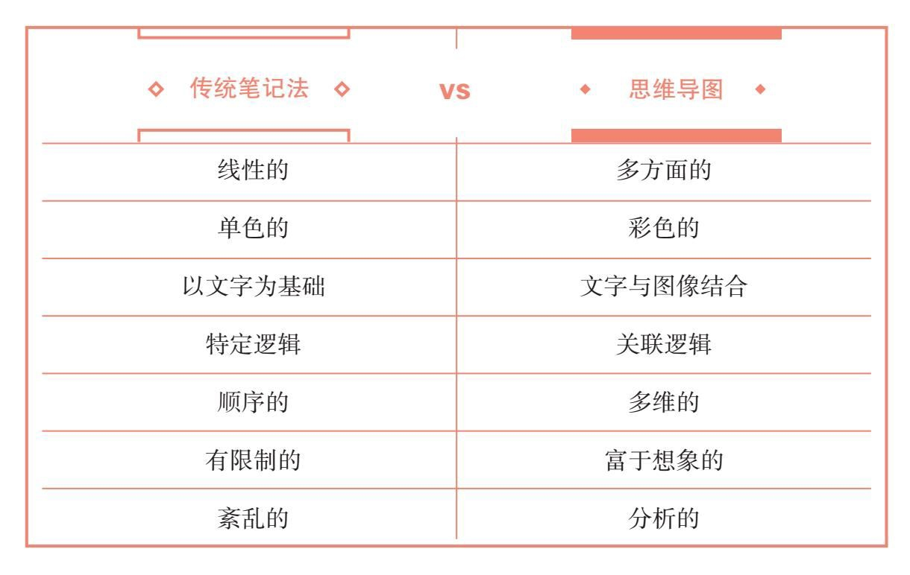

# 思维导图完整手册

# 简介

　　豆瓣评分：5.4

## 内容简介（来自豆瓣）

​		思维导图的概念由英国人东尼·博赞于 20 世纪 60 年代创造，曾用来帮助英国查尔斯王子提高记忆力。时至今日，牛津、剑桥、哈佛等名校早已将其纳入必修课，微软、IBM（国际商业机器公司）、迪士尼、花旗银行等大型企业不断地培训员工用思维导图工作。

​		《思维导图完整手册》是东尼·博赞 2018 年的集大成之作，他基于思维导图的设计初衷和发展乱象，为读者呈现了一个原汁原味的思维导图。作者分析了思维导图的 98 个应用场景和 3 个核心用法：

1. 如何用一个关键词头脑风暴
2. 如何整理、记忆信息
3. 如何关联、创造故事

​		书中还列举了来自各行各业的成功人士，以及他们如何用画图引导思考。作为博赞在中国的亲传弟子之一，刘艳亲自为本书解读，从沟通谈判、时间管理和古诗词背诵的角度，手把手教读者用轻松、高效的方式完成思考。

​		作为大脑和学习方面的世界专家，东尼·博赞已出版 100 多部作品，其 “ 思维导图 ” 系列作品被翻译成 35 种语言，遍布 200 多个国家，销量突破 1000 万册。

​		信息焦虑时代，人人都需要一个能分析信息和内化知识的思考工具。如果你正苦于思维混乱、表达缺乏逻辑、学习不得法，那么你应该来看看这本书。

## 目录

* 推荐序
* 前言
* 引言 改变人生的创新思维工具
  * 超实用新笔记法
  * 发散思维：天才的关系逻辑
  * 模仿大脑操作规律
  * “传统笔记法”vs“思维导图”
  * 风靡世界的思维导图
  * 如何使用这本书？

* 第一章 什么是思维导图？
  * 全脑思维升级训练
  * “ 三招七步 ” 构图法
  * 5 个法则轻松制图
  * 思维导图的思维简史
  * 视觉思维：高效决策的科学
  * 有效解决十大人生难题
  * 取之大脑，用之大脑

* 第二章 如何构建思维导图？
  * 不要陷入固化思维
  * 理解规律，遵循规律
  * 形成自我风格
  * 11 个步骤，从入门到精通
  * 高手必经的 3 个阶段
  * 图解思维导图六大应用
  * 掌控生活：轻松搞定日常琐事
  * 职场精英：商务问题的终结者
  * 超级学霸：建立自己的知识体系
  * 创意高手：打造丰富的幸福体验
  * 快乐人生：做自己的健康教练
  * 记忆大师：充分挖掘大脑潜能

* 第三章 如何识别真假思维导图？
  * 缪见和误解：关于思维的本质
  * 5 种盛行的伪思维导图
  * 聪明的大脑如何思考

* 第四章 给所有学习者的忠告
  * 坚持就是胜利
  * 学会提出好问题
  * 用简洁、有力的图像
  * 为观点留白
  * 善待杂乱
  * 种下迷你思维导图
  * 让重复来引导你
  * 摆脱犹豫不决
  * 坚持到底！
  * 用思维导图解决问题

* 第五章 跳出思考边框，创造无限可能
  * 一种直觉和逻辑工具
  * 多维思考：六大领域，98种应用
  * 规划高效率生活
  * 职场必备工作法
  * 非暴力沟通：寻找共同立场
  * 从认知自我到深度学习
  * 激发创作天赋
  * 对抗缺陷，掌控大脑
  * 过目不忘的记忆法

* 第六章 人工智能将统治思维导图？
  * 机器和算法无法取代
  * 未来掌握在你手中

* 参考资料与文献
* 致谢

# 摘录

* 思维导图是一个创新性的思维工具，一旦掌握它，你的人生将会被改变。它不仅能够帮助你处理信息、构思创意、增强记忆力，而且能够让你充分享受闲暇时光、改良工作方式。

* 可以用思维导图来解决任何问题，就这一点而言，它是擅长被用作分析的。通过运用关联逻辑，思维导图能够直指问题的核心，同时也让你有更全面的视角，它既是微观的，又是宏观的。

* 下表中对比了传统笔记法和思维导图的特点。

  

* 思维导图的魅力源于它的简单。表面上，它只是一幅绘制了信息的彩色图纸。然而，它却能有效地刺激大脑皮层的工作，通过调用善于逻辑分析的左脑和善于创造的右脑，激发全脑思维。

* 大脑通过左右分工的方式感知和处理现实：左脑支配言语和分析，右脑支配知觉和感知。

* 一幅合格的思维导图具备三个基本特征：

  * （1）**一幅中心图**，代表你要探究的中心主题。例如，要用思维导图计划一个项目，你可以在图的中心画一个文件夹的图像。画思维导图并不需要专业的绘画技巧。
  * （2）由中心图**延伸出的若干主干**。这些主干分别代表与中心主题相关的一级主题，要用不同的颜色呈现。进而由主干延伸出下一级分支 -- 如果喜欢，可以将它们叫做枝干，依次为二级、三级分支，代表相关联的二级、三级主题。
  * （3）每条分支上有**一幅关键图或一个关键词**。

* 因为思维导图需要左右脑同时工作，所以它是多功能的，能够被运用于所有的认知功能中，包括记忆、创建、学习和各种思维形式。

* 制作思维导图的 5 个法则

  * 发散性思维

    人类语言是大脑工作所使用的语言，它主要是通过想象和关联形成的，还需要未知的辅助（位置的重要性解释了为何在思维导图中，分支的位置能够促进你的记忆）。

    所有的口语和书面语都是美丽、有意义且充满活力的。然而，它们是二级语言或者子程序。由想象和关联形成的人类语言，才是我们人类的首要语言。

    人类语言可以具像化地表现出来。当它以最纯粹的形式表现出来时，就构成了一幅思维导图。

    让观点从核心概念发散出来 -- 思维导图提倡高度个性化的思维发散。思维导图的大三型结构更容易让人发现不同分支间的关系，也更容易让人产生新的关联以填补空白，以此激励我们更长久地进行创造性的思考。

  * 非线性的自然流动

    思维导图仿照的是脑细胞的无数神经元突触和连接，从而反映着我们自身被创造和连接的形式。

    思维导图正是借鉴了这些自然结构的灵感和效率，它的自然属性体现在自然弯曲的分支上，这种弯曲的形式比直线形式对大脑更有吸引力。

  * 颜色

    颜色与人的右脑相关联，而文字与支配理性的左脑相关联。因此，颜色和文字相结合就能使左右脑同时工作。

    颜色能够激发记忆力和创造力，让我们摆脱黑白两色单调的束缚。颜色赋予图像生命，让它们更吸引眼球；颜色能够激发我们去探讨，并影响我们与其他人进行沟通交流的方式。

    许多研究表明，熟练地使用颜色能够：引起注意、极大地加深理解、激发动力、鼓励热烈的交流、增进大脑对图像的处理和储存。

    颜色也可以作为一种代码。如果你在思维导图中用特定的颜色来画不同的区域和主题，就会在视觉上产生速记效果，使你更容易记住导图中的信息，并显著地提高你的记忆力。

    在思维导图中，通过运用颜色和图像使不同的分支从周围的背景中脱颖而出，同样可以产生冯·雷斯托夫效应，也叫作 “ 孤立效应 ”。

  * 图像

    与文字不同，图像更加直观：大脑处理视觉信息要比处理文字信息快 60000 倍。另外，图像能够激发想象，产生丰富的关联，并超越语言交流的限制。与颜色相同，图像能够激励左右脑协同作用，平衡发挥语言功能和视觉功能，还能充分发挥大脑皮层的其他功能，如形态、线条和纬度。

    为了使思维导图中的图像更有冲击力，就要把它们画得活波、多次、清晰。这样看起来会更有吸引力、更动人，也更令人难忘。

  * 文字

    真正的思维导图在每条分支上仅标注一个词语。因为单个词语比短语更有冲击力。每个词语都能够触发其特有的一系列关联，从而让人产生新的想法。相比之下，短语是固定的搭配，会局限在其复合含义当中，而不能开放式地自由关联，因此作用反而被削弱了。

    如果觉得必须使用短语的话，就把短语拆开，将每个词单独地写在不同的分支上，保证这些词能够自由地延伸出下一级的子分支 -- 但最好还是用单个词语。

    每条分支上的一个词语能够充分激发你的大脑对关键词的思考，并直指问题的核心。关键词就像一个钩子，能勾起你的记忆。

* 思维导图能够：

  * 让你思维清晰，能全方位考虑一个主题
  * 提供必要信息，让你提前计划
  * 让你全面审视形式
  * 作为一个巨大的信息库
  * 激发你的想象力，激励你寻找创造性的解决方案
  * 看起来充满乐趣

* 除了能让你对主题有清晰的、概括性的认识，并作为可视化工具帮助你记忆，思维导图还有许多其他的优点：

  * 思维：用思维导图激活你的思维，产生新鲜的想法和关联，让你的思维过程充满趣味和色彩。
  * 学习：思维导图是一种强大的学习辅助工具，是课堂讲座、考试复习中有益的笔记工具。思维导图能剔除无用的知识点，突出题目的重点。
  * 专心：使用思维导图意味着把注意力高度集中在手头的事务上，动脑思考必然能得到更好的结果。
  * 组织：用思维导图设计派对、婚礼、旅行、家庭聚会，甚至指导你未来的人生。
  * 计划：用思维导图来设计你的日程和进度，安排投入时间和精力的优先次序。
  * 沟通：省掉冗长的空话，精确地传达信息——思维导图能够突出你需要了解的关键点。
  * 讲话：无须长篇累牍的笔记，只需看一眼就能获得信息，让你的展示和发言清楚、放松，充满活力。
  * 领导：无论是设置议程、记录会议，还是主持会议，思维导图能够打造卓越的商业工具。让你掌握主动权，清楚自己的内在世界和外在世界。
  * 培训：摆脱冗长的培训手册，用思维导图又快又好地设计培训方案。
  * 谈判：在一张纸上清楚地列出所有可做的选择、可用的策略，以及可能的结果。思维导图能帮你谈出双赢的结果。

* 思维导图的结构模仿大脑的神经元突触和神经通路构成的网络。

* 思维导图既模仿着我们大脑结构的内在思维模式，又影响着我们向外界展示思维的表达方式。

* 思维导图能够扩展你的思维视角，提高思维的准确性、深刻性、创造性和自由性。

* 当你画完100幅思维导图时，你将掌握精湛的构图技巧。

* 11 个步骤，从入门到精通：收集资料 -> 选择中心图 -> 确定目标和基本排序观点 -> 延伸分支 -> 用图像表达自己的观点 -> 玩转单词 -> 形成联觉 -> 做一个代码创造者 -> 建立连接 -> 使用分界线和记忆群组 -> 保留空间让自己 ‘’ 呼吸 ‘’ 。

* 颜色是激发创造力的关键元素，这意味着当你最开始用黑色笔来画草图的时候，产生新想法的能力就会被大大限制。

* 你需要使用维度、自我表现力和至少三种颜色使思维导图具有视觉冲击力，便于记忆。还要考虑好如何用图像代表你的主题，使之尽可能有趣，并富有想象力。如果一个特定的词语是你思维导图的绝对核心，就把这个词语转化为图像，用维度和颜色增强它的视觉吸引力。一幅充满活力的中心图会自然而然地激发你的视觉和大脑活动，引起许多关联。

* 从中心图延伸出的主干，即主要分类，被称为 “ 基本排序观点 ”，这些构成了思维导图的核心框架。

* 一组明确的 “ 基本排序观点 ” 能让你的思维导图从一开始就发挥出最佳创造力：通过对 “ 基本排序观点 ” 的分类，并按照一定的意义排序，你能够更清楚、更全面地看到更深层的观点和理念，并为思维导图中的观点分出合适的层级。

* 当你开始画思维导图的时候，请认真思考以下目标。

  * 你需要什么信息和知识？
  * 你探讨的话题中最重要的七个分类是什么？
  * 如果这是一本书，那么这一章的名字应该叫什么？有哪些课程，哪些主题？
  * 你需要问哪些问题？（比如：“ 发生了什么事？” “ 在哪里发生的？” “有哪些人？” “ 是怎么做的？” “ 是谁做的？” “ 什么时候发生的？” 这些问题都有助于你画出有用的主干。）
  * 你的话题能分解出哪些分支？

* 你的 “ 基本排序观点 ” 也能解决以下顾虑：

  * 结构——事物的外形
  * 功能——事物的目的和功能
  * 属性——事物的特点
  * 处理——事物如何运作
  * 评估——事物的有益之处
  * 定义——事物意味着什么
  * 分类——事物之间的关联
  * 历史——事件发展的先后顺序
  * 性格——人的作用和特点

* 靠近中心图的主干要画得更粗，以凸显其重要性，并在这些主干上标注 “ 基本排序观点 ”。由主干延伸出的所有二级分支所包含的信息是为了支持主干上的观点。概括性高（ 涵盖广 ）的观点要更靠近中心图，而概括性低（ 涵盖窄或较具体 ）的观点要分布在二级、三级分支上，离中心图较远。

* 使所有分支呈现出自然的、波浪式的、流动的状态以增强视觉吸引力。另外，如果你画的分支都自然地弯曲、辐射，那么每一条分支就会有各自的形态，随后更能够激发你回想起分支上所承载的信息。

* 为了优化思维导图的视觉效果，激发创意，并使画图过程充满趣味，请尽可能地使用图像（就像词语一样，标注在各自的分支上）。

* 简明的示意图、素描、符号和涂鸦均可。事实上，不要因为画不出完美的图像而深感困惑——思维导图要的是快速地把观点记录在纸上，所以要把你画的图像当作一种速记形式，它们代表的是你深入思考后的精髓。

* 线性笔记法仅使用线性模式、符号和分析三种基本功能，而画图却要用到一系列大脑皮层功能，从想象力、逻辑和空间意识到使用颜色、形态、线面和视觉图形。

* 在思维导图中使用图形还有更大的益处：它能够增强你日常的视觉感知力。无论你艺术认知水平高低，每次画图的尝试都将使你更加关注真实生活中的灵感，你也将更加理解周围的世界。

* 图像要尽可能画得清晰。思维导图越清晰，看起来就越简练、优美、引人注目。清晰的图像能带来清楚的反馈。清晰能净化你的眼眸，让你像孩子或艺术家一样看待世界。你的感知力会不断地得到提升。

* 为了使思维导图清晰明了、有冲击力，能够自由发挥，记得在每条分支上只用一个关键词。一个关键词比一条短语更容易让人记住，也能更长久地留在记忆里。

* 写关键词要用大写字母，以提高辨识度，让大脑更容易把它们形象化。牢记你导图中观点的层级，在二级、三级分支上分别用大写、小写字母体现词语不同的重要性。

* “ 联觉 ” 指一种感知现象，是通过某一感觉或身体部位的刺激，引起另一感觉或身体部位反应的现象。

* 在某种程度上，联觉是关联性的物质和精神的体现。

* 在画思维导图的时候发挥联觉效应，运用五官的感觉选词作画，包括视觉、嗅觉、听觉、味觉和触觉。同时也要考虑到动态感，这可以通过分支的自然形态表现出来。

* 为了使颜色发挥更强大的作用，你就要为自己的基本排序观点匹配特定的颜色，形成颜色代码。

* 像代码一样，使用连接分支和关系箭头，可以在不同区域和分支间建立联系，使看似不同的观点之间的相关性体现出来。分支和箭头同样可以帮助你在脑海中将不同的想法建立连接。牢记思维导图使用图像的原则，连接分支可以是能够激发你想象力的曲线、圆圈、环、链子或其他图形。

* 关系箭头能自然地吸引你的眼球从导图的一部分看到另一部分，这样能够激励你的思维随着注意力转移，为思维指导方向，激发发散性思维和高度创造性思维。像连接分支一样，箭头的大小、形状和维度也是多变的。箭头也可以分出多个指向，连接若干不同的分支。

* 在构建复杂的思维导图时，因为涵盖较多主题，拥有许多不同层级的信息，分界线和记忆群组就会特别有用。

* 要用单词和图像的大小来显示思维导图中层级的重要性高低。

* 思维导图不同要素之间的空白与要素本身同等重要。条目之间有合适的间隔，会使你的思维导图看起来清晰、有组织，视觉上更美观，也就意味着你更有可能领会其中的信息。

* 大多数成功的思维导图实践者将会经历三个阶段：

  * 接受：遵守思维导图构建规律，直到你对它们了如指掌。
  * 应用：对构图规律融会贯通以后，要尽可能多地练习画图并运用规律。只要你需要做记录、做决定，或者学习新技能，都要用思维导图。
  * 转化：随着时间的推移，你将形成自己的思维导图风格。当你画完数百张思维导图时，你将会开始尝试转化思维导图，把它提升到一个新的高度。

* 坚持做思维导图日志，让思维导图成为你日常生活的一部分，可以用一本练习册或活页簿来记录日志。

* 思维导图六个应用：“家庭”、“工作”、“教育”、“创造力”、“健康”、“记忆”。

* 思维导图是很棒的个人时间管理和计划工具。

* 你会发现将本周的思维导图与思维导图计划表和时间表一起使用非常有效，因为这既能使你看到每一天的细节，又能概览较长一段时期的计划。这样做，你就能考虑在前，掌控自己的时间安排，防止事情的冲突和可能的意外，确保工作、休息和娱乐的平衡，度过健康而有收获的一周。

  

* 记住，千万不要删掉思维导图上的任何东西！

* 删除某项内容意味着否定你已经取得的结果，抹去生命中的一段记忆；相反，当一幅导图充满了肯定的对号或笑脸时，也是对你收获的一种认可。

* 如果你在一段关系中正遭受挫折，思维导图可以帮你发现新的视角，找到前进的办法，也能帮你理解他人的立场，找到折中的办法。

* 要让你的思维导图真实、公开、中立。处理好你的情绪，还要善于接受：每一个潜在的负面问题，都包含着正面元素。如果你觉得这个过程令你心烦意乱，就停下来休息一下，等你冷静下来再继续画。当你继续作图时，你很可能发现导图中已展示出了各种可能性，来帮助你走出现在的困境。

* 无论是用思维导图处理研究工作还是项目管理，要以一种游戏的精神来使用，而不是把它当作令人讨厌的事，以确保得到有创意的双赢结果！

* 一幅关于时间管理的思维导图可以围绕每个工作日来构建，突出截止时间和重要事件，或者它的基本排序观点可以按照你手头的项目进行划分，用子分支来反映每个项目中要在接下来的一周内优先完成的事务。

* 当你要使用思维导图研究一个课题时，中心图要简洁正面地表达主题。在第一条主干上画你想采用的方法或角度，在第二条主干上列出你做研究需要的信息种类，如证据、观点、事实和其他已有的研究分析。在第三条主干上画资料来源，在二级、三级分支上分别画主要资料来源和次要资料来源。第四条主干用来画评估材料的方法，第五条主干用来画如何最好地组织信息和结果。或许还有第六条主干，可以画如何最好地汇报研究成果，扩大影响。

* 如果你身处学术界或教育界，你可以使用年报式的思维导图做讲座、完成报告或撰写论文。

* 作为一款出色的计划和记忆工具，思维导图尤其适合被用在工作和教育领域，从而让我们的人生更有意义和乐趣。

* 实践和研究已经证明，思维导图能够帮助儿童和各年龄段的学生提高专注力和理解能力，让他们更加容易记忆信息，更有信心准备考试。

* 思维导图在辅助修改方面也是非常有效的，它能够把冗长的文本浓缩成容易理解的信息块。

* 中心图只要是多彩的、有活力的，而且包含一定的主题，画一幅简单的草图与画一幅精细的绘画作品的效果就是一样的。

* 抛开乏味的、线性的构思方式，用一幅思维导图来构思你的论文。思维导图会针对你前期阶段的预期方法提供有用的概述，在你陷入困境之前，帮助你鉴别和处理任何论点中潜在的缺陷。

* 画一幅反映你论文主要观点的中心图，并从中心图画出主干，分别代表前言、主要论点和结论。添加一条主干代表你的研究过程，再加一条主干代表其他相关信息。还可以为任何与你的论文相关的重要文本或数字添加主干。使用子分支来代表那些贯穿你论文的小标题，并用连接箭头连接不同分支间相关联的标题。记忆群组也是一种组合重要标题的有效方式。自始至终一定要用标志和图像来调动脑力和想象力。

* 有时人们会问我，思维导图是否能为所有年龄段的人带来好处。这个问题的答案是响亮的“是”！

* 思维导图技能的获得并不取决于年龄、性别、肤色或信仰——思维导图反映的是大脑的原始智力。

* 在思维导图中，颜色、想象力和创造力的运用证实了绘画技能的自然发展。此外，思维导图是通过图像和单词而不是转折词组构成的，意味着思维导图能穿透行话、空话、套话，直达问题的核心。

* 思维导图依靠的是发散性思维，而不是演绎和还原。作为一种开放性的思维工具，思维导图映射出大脑活动的过程，而不是专注于结论和结果。

* 你对什么主题感兴趣？用这个主题作为中心图的基础——心图要多彩、富有想象力、有启发性。要在主干上画什么，请按照下面的这些问题来决定：

  * 学习这个主题能给你带来什么好处？
  * 你需要什么形式的学习辅助？
  * 你在哪里学习？
  * 你的主题与社会有什么关系？
  * 你期望通过学习取得什么样的结果？资格？技能？丰富履历？
  * 有哪些考虑或阻碍？如何应对它们？

  画出子分支，更详细地审视这些问题和相关要点，并且自始至终要用图像和标志让导图焕发活力。当你完成的时候，好好看一看。根据你的发现，接下来你要采取什么步骤？

* 用一种更加平衡的、富有成效的方法能够认识到创造性人格的诸多益处：他们倾向于成为先驱者、突破界限者、发明者和明智的冒险者。他们通常具有原创力、有韧劲儿、有专注力、富有趣味、有紧迫感、有梦想。他们有童心，但不幼稚。

* 创造性思维并非天才的专属，它是一种用最原始的方式思考并打破常规的能力。你的创造力就像肌肉，越锻炼就越强大。当创造性思维实践得越多时：

  * 你就越容易想到新的创意
  * 你就越能够接受新的观点
  * 你的观点就越具有原创性

* 创造力与玩耍息息相关，玩耍是人生的另一项重要组成部分——是学习、发现、放松、幸福和产出的关键。无论是野生的还是饲养的鸟类和哺乳动物都会玩耍，还有一些鱼类、爬行类动物，甚至是昆虫也会玩耍。在幼年时期，玩耍改变前额皮质的神经元网络，并改善大脑的执行控制中心功能，这项功能主要负责管理情绪、制订计划和解决问题。玩耍使大脑细胞和神经树突之间形成连接，从而在幼儿的大脑中建立连接网络。

* 通过思维导图，你不仅可以确定自己究竟在业余时间想做什么，而且可以确定在什么时间做：有些活动是你可以在午饭时间，甚至是通勤的时候做的，而其他一些活动适合在工作日的晚上或是周末做。也许你希望休一个长假，比如去非洲或印度旅行。如果是这样，把它画进你的思维导图！只有认定了目标，才有可能去实现。

* 思维导图都有助于创造力的表现。

* 生理健康和精神活动正相关。

* 不健康的脑力活动会有害于生理健康，甚至使一些情况更糟糕。

* 想要拥有很棒的身体素质，不仅要加强锻炼、严格控制饮食，而且要注意全面的健康，包括摄入充足的营养、保证充分的睡眠、减缓压力和做快乐的事。

* 锻炼可能不仅是全面发展的目标之一，还是保证更多睡眠和减压的一种方式，反过来也能增加快乐。根据我的经验，心理健康和生理健康密不可分。

* 可以用思维导图做每周膳食计划，使用个人周计划思维导图聚焦于食物而不是活动。可以在子分支上列出每日正餐，在下一级分支上详细列明每顿正餐的食材及营养价值。如果每周开始前都画好健康饮食的思维导图，你将为自己提供更便捷的购物清单。

* 关联在思维导图构建过程中的重要性：与想象力共同作用，关联促生并浇灌出思维导图的分支，让它们自然地从中心图伸展出来。除此之外，关联也是开启思维的一把钥匙。

* 因为语义网络的个人化属性，思维导图必然是个人化的创作：为了从一幅思维导图中获得最大效果，并提高对当中信息的记忆效率，你必须自己创作思维导图，而不是依靠别人画的导图。

* 真正地画一幅思维导图更能够帮助你记忆其中的信息，使你能够重现和回想起画图的过程。通过使用颜色和图像，思维导图能够激活大脑思维，并将信息铭刻在记忆当中。

* 思维导图突出连接性，并通过寻找方案、记忆细节、产出结果来调动大脑积极参与这一过程，而不是被动地接收信息。

* 思维导图比其他种类的可视化工具更能够发挥创造性思维的作用。尽管画思维导图有关键步骤和基本要素，但导图中的每幅图像都是独一无二的：不存在正式的图示法，思维导图也没有严格意义上的 “ 对或错 ”，但比如饼状图就可能存在数学上的错误。

* 思维导图比其他种类的可视化工具更能够发挥创造性思维的作用。

* 尽管画思维导图有关键步骤和基本要素，但导图中的每幅图像都是独一无二的：不存在正式的图示法，思维导图也没有严格意义上的 “ 对或错 ”，但比如饼状图就可能存在数学上的错误。

* 思维导图一般不涉及步骤、体系或进程，但仍富有动感，并具有自身的逻辑。

* 思维导图在一定层面上是极具逻辑性的思维工具，因为思维导图中的事物只有通过关联性才能连接其他的元素，意味着两者之间存在天然的因果关系。要知道，逻辑是通过适当的关联而取得合理结论的思维方式。

* 除了表达信息，画思维导图会刺激大脑、激活记忆。它是每个构图者的思维和想法的表现。

* 要检验你看到的是不是真正的思维导图，请考虑以下几个方面：

  * 导图有没有清晰的中心观点？
  * 导图有没有清晰的中心图来表达中心观点？
  * 导图是否由中心向外辐射？
  * 每条分支上是否只有一个词？
  * 导图是否有图像？
  * 全图是否使用颜色？
  * 整幅图是否清晰明了？
  * 导图看起来是否自然地、有机地伸展？
  * 导图是否具有高度的视觉吸引力？

  如果以上这些问题有任何一个的答案是否定的，那你看到的就不是真正的思维导图。

* 通过发挥关联力和想象力，及其内在的逻辑性，思维导图的构建规律成了良好思维的体现。

* 通常引发问题的并不是思维导图本身，而是人们对它的恐惧。恐惧是最大的脑力杀手。

* 如果遇到棘手的思维导图，就在面前放一份思维导图构建规律的副本，在检查思维导体更细微的内容时参考。

  * 你是否在一张横向放置、没有横线且至少 A4 大小的纸张上画图？
  * 中心图是否位于纸张中央，且至少用三种颜色描绘？
  * 中心图是否有吸引力？
  * 如果中心图包含一个词，这个词是否有 3D 效果，或者进行了有趣的排版？
  * 主干是否涂了不同的颜色？
  * 每条分支上是否仅有一个词？
  * 主干是否延伸出适量的子分支？
  * 是否自始至终使用图像？

* 每当你画思维导图的时候，你要考虑你要应对的问题或话题。一个好的问题或话题将会：

  * 激活关联力和想象力
  * 是开放式的，允许审议和评价；而不是封闭式的 “ 是或否 ” 的答案
  * 激励批判性思维和分析性思维
  * 清晰明了
  * 挑战惯性思维
  * 刺激突破性思维
  * 在内容（何人？何事？何时？）和过程（如何做？为何？）之间取得平衡
  * 激发积极的反应

* 欠缺考虑的问题只会导致有缺陷的答案。为避免答案产生歧义，要保证中心问题简短、清楚、准确。

* 正如你要探讨的问题或话题一样，你的中心图也要简洁而有冲击力——仅用少许的几种颜色以表达品牌标志般的感染力。中心图的线条要画得简洁清晰，还要突出中心图。

* 如果你的思维导图开始显得拥挤，就说明你需要画 “ 迷你思维导图 ” 了，或者叫作 “ 子思维导图 ”，通常，“ 迷你思维导图 ” 自身有可能扩展成大思维导图。

* 清晰性是思维导图的一个重要元素。

* 思维导图中每条分支间的空白区域，在某些方面看来与分支本身同样重要。

* 在你开始画第二稿的思维导图之前，先检查你第一稿中的组织构架是否存在纰漏，是否存在关联较弱或者关联错误的情况。

  在你的第二稿思维导图中，要删除不必要的主干和子分支以保证清晰明了。如果有必要，可以重新组织主干结构，以保证基本排序观点依据逻辑和数序分布。对于那些你想保留的分支，要保证它们固定在适当的位置并愉悦地伸展——就像有坚固框架支撑的果树那样。

  一旦剔除了多余或重复的分支信息，新的分支就可能出现，以独创性观点和关联的形式产出新的成果。

* 迷你思维导图就像围绕星球的卫星一样，围绕着主导图，它们可以从更微小的细节入手，探讨主导图的某些方面，还不会使主导图变得杂乱。

* 如果你发现主导图中提出的问题比答案还多，那么迷你思维导图会是特别有用的工具。在使用迷你思维导图解决任何新问题的同时，还能保证不另起炉灶、不偏离主题。

* 一个词在其他分支上再次出现并不意味着多余或乏味，恰恰相反，它强化了其所指代的观点。

* 强烈建议你以这个重复出现的词为新的中心图，并就同一主题画出下一幅思维导图。

* 通常，创建思维导图的实际过程是通过对情况均衡分析而得出一个清晰的解决方案。如果你的思维导图无法引导你选择一种清晰的行动方式，那么就要运用你的直觉判断力。用掷硬币的方法。

* 如果你还不能做出决定，那就进一步使用思维导图和迷你思维导图来探讨你两难的处境：不要拖延。拖延是一种对精神的消耗，并且会起到反作用，而追求明确的行动方针是自由且充满活力的，并能指向直接的生活经验，即使这种经验也许并不总能达到预期。

* 积极主动地做些事情总比无意地沉溺在惰性的泥淖中好。

* 如果你制作了一幅思维导图，却发现对它有强烈的负面反应，不要忧虑！画思维导图时保持耐心是关键，我会劝你“努力，努力，再努力”！

* 也许创建思维导图的想法在这个阶段看起来前景渺茫：你担心没有“正确”地掌握它，认为自己没有足够多的好想法，不喜欢自己的画，对最终的结果感到失望。我的建议如下：画思维导图摆脱担忧！对于进行自我分析和处理诸如焦虑、羞怯、过度完美主义、情绪低落和失望等个人问题来说，思维导图是一个很好的帮手。如果你对自己的思维导图结果不满意，就画一幅关于自身经验的思维导图。

* iMindMap软件（一款生成思维导图的软件）

* 如果你在画思维导图时遇到障碍，那么你要记住这不是一个线性的过程。你不需要一直纠结在一个问题上，只需优雅地绕开它，走另外一条路！

* 用思维导图解决问题：首先，画一幅与问题直接相关的中心图，或者宽泛地以 “ 解决问题 ” 为中心观点来画。对于主干部分，你可以从定义问题及其原因开始，然后去探讨其积极和消极的影响。另一条主干用来探讨在处理这个问题时如何寻求帮助。记住，你自己对困难情况的反应是唯一一个你能完全控制的行为，而自助和其他人的帮助一样重要。然后，你的思维导图就可以进入规划阶段，最后进入解决问题的行动阶段。

* 一定要确保思维导图上的文字和图像是积极并有启发性的，使你的思维发散，而不是受局限。要避免使用太多的消极词汇，因为这些词可能会削弱思考效果，甚至没有效果。

* 因为思维导图模仿大脑自身的工作方式并刺激其行动，制作思维导图的行为将调动你的思维过程：思维导图的过程不会被焦虑禁锢，也不会让思维陷入飞行模式，它会为你注入能量并提供清晰的思路，帮助你应对和摆脱困境。在通过这种方式剖析你的感受时，你很可能已经发现并且能够处理一些情绪倾向了，而这些倾向原来一直在减损你对生活的享受。

* 思维导图具有高度的逻辑性，因为它的根基是关联逻辑。

* 思维导图是非常结构化且服从于构建规律的，遵循这些规律将永远确保其清晰、有效。规律鼓励大家在构建思维导图时采取有序的方法。此外，如果那些痴迷于逻辑思维方式的人愿意的话，他们可以通过关联，一次只画一条主干，然后再画下一条主干。

* 思维导图的结构使其非常适用于需要分类和设计流程的学科，如物理、化学和数学。

* 思维导图是有用的工具，能够将科学主题分解成部分，也能进行概述。

* 我们不仅可以用思维导图来计划下一周的活动，也可以用它来做很棒的日常计划表；同时，它们也可以被用来概括你一个月甚至一年的日程安排。一份思维导图计划表可以用来规划生活，也可以回顾生活；它可以帮你列出优先事项，确保你掌控好自己的时间，实现在工作和休闲活动之间的良好平衡。一份思维导图计划表能有力地确保你过上真正丰富多彩的生活，而不让你被一个不属于你自己制作的或不符合你最佳利益的日程表奴役。

* 我的个人思维导图一日规划表充满了图像、代码、颜色、关键词和关键符号。这一天最重要的话题会构成中心图。

* 除了做出月度计划，你还可以使用思维导图来创建一份年度规划。年度规划的思维导图以每个月为一条主干，而子分支将涉及这个月最紧迫的考虑。

* 当使用者正确地遵守构建规律时，思维导图可以在工作场合取得惊人的成果，它们有着广泛的应用，包括研究项目、制作演示、编写年度报告、管理时间、进行头脑风暴、谈判和战略性地思考。

* 简单地以 “ 是/否 ” 来回答的决策通常被称为二元决策（dyadic decisions，dyas来自拉丁语，意思是 “ 两个 ”）。要使用思维导图来帮助你做出一个二元决策，就要像构建任何其他思维导图一样。从创建一幅有力的中心图开始，凭借你的想象、关联和直觉画出主干，代表你最重要的考虑因素。

* 当你在画一幅思维导图来帮助你做决定时，你要意识到你分配给不同分支的颜色和图像会让你洞察潜意识的微妙运作，也许你会通过使用喜欢的颜色来揭示隐藏的偏好，或者通过不喜欢的颜色和图像来揭示隐藏的厌恶。

* 思维导图通常由个人创造，是高度个性化的思维工具，但与其他思维导图的结合也是非常富有成效的。在这个更高级的层面上，结合别人与你自己的观点，找到共同立场并解决争端，是一种非常有用和有益的方式。

* 有两种使用思维导图的方法可以用来解决冲突问题。第一种方法是两个或更多的人轮流构建一幅思维导图的主干，探讨其中的关联并讨论当前的方法。第二种方法是各方单独制作思维导图，然后进行分享、比较和讨论。

* 无论你采取何种方法，重要的是让每个人都有发言权，让每个人都能开诚布公地发言；不管你是否认同，都要让每个人的意见受到尊重。如果交流变得激烈，就花点儿时间冷静下来。再继续讨论时，要把注意力完全集中在思维导图中的信息上，而不是不自制地进行人身攻击或批评。

* 解决冲突的思维导图可以从定义当前的问题开始，也许包括每个参与者提供的关键词和他们总结的当前的情况。下一条主干可以探讨这种情况的影响，包括积极（如果有的话）和消极的方面，并着眼于比如对团队和个人感受的影响。然后，继续讨论你们认为还需要什么才能解决当前的问题，以及你们想要什么（需要和想要不一定是同一件事）。最后，根据讨论过程中的发现，探讨解决方案。

* 无论你是在设计讲稿、准备演示，还是在撰写论文，思维导图都是一种很好的整理和表达想法的方式。它们可用于语言学习、实施高级笔记法和成果摘要，以及论文写作和研究项目。如果你在教育方面有一个目标，思维导图也可以帮助你实现它。

* 通过色彩和图像的运用，思维导图使语言脱离页面，并释放大脑活力，使其就像脱离笼子的鸟儿一样，在创意和关联的领域里自由飞翔。这就是为什么思维导图是学习第二语言的好方法之一。

* 与其他教学方法相比，思维导图有一个优势，因为它是人类语言本身的产物：因此，思维导图本能地超越了类别分隔，以便在不同的类别之间建立连接和联系。

* 在语言学习中，信息群组也可以非常有效地用于其中，它可以将相关信息分到便于记忆的群组中，反映出大脑处理信息的方式。

* 在准备一篇演讲或写一篇文章时，思维导图的优点是双重的，作者不断地受到导图分支的刺激，产生新的、更大胆的想法；同时，关键词和中心图确保人们在讲述和书写的过程中，不会忽视任何一个要点。

* 你天生就是有创造力的：你一直在利用你的关联和想象能力来创造高度个性化和独特的思维导图，以此来表现你大脑的运作方式。

* 设计思维是近些年来兴起的一种实用的、有创造性的、以解决方案为基础的推理方法，通常包括以下方面的变化：

  * 同情 - 向人们学
  * 定义 - 查找模
  * 想象 - 设计原
  * 原型 - 使有
  * 测试 - 迭

* 它可以被应用于系统、程序、协议和客户体验。它并非专注于解决问题，而是一个注重行动的过程，侧重于找到理想的结果，并考虑移情和情绪。它还需要逻辑、想象力和直觉。

* 设计思维就是建立想法，使前进的道路变得清晰，直到一个顿悟时刻到来。由于设计思维涉及使事物变得可见和有形，绘画是它进行创意、分享、对话和交流的主要工具之一。

* 患有自闭症的人通常有很强的视觉技能，这意味着自闭症儿童通过视觉方法能学习得更好。思维导图是高度视觉化的工具，并且是一种鼓励一边做、一边学的方法。

* 它提供了对一个主题的概述，以及强调不同方面之间的关系，使信息看起来井然有序，从而帮助自闭症学生提高对这些信息的记忆。对于那些有阅读障碍的人来说，短期记忆、集中注意力和排序信息都是他们日常生活中具有挑战性的方面，所以思维导图为他们提供了一种有用的组织和掌握信息的方法。

* 对于那些患有抑郁症和精神错乱的人来说，思维导图可以检验其症状，提出应对技巧和策略，并依据生物学病因提供有用的医学信息。它不仅成了一种诊断工具，而且成了一项行动计划。如果是压力导致的健忘、僵化和恐惧恶性循环，思维导图就可以起到缓解压力、驱除压力的作用。当大脑压力被缓解时，身体压力也会减小，从而改进工作表现，改善身心健康。

* 如果你正在创建一幅思维导图来管理焦虑，你可以从一幅与自己感受相关的中心图开始，然后创建与以下内容相关的主干和子分支。

  * 会引发你焦虑的事情
  * 焦虑如何影响你的生活
  * 适得其反或加剧焦虑的事情
  * 帮助你管理焦虑的活动
  * 来自家人、朋友和专业人士的支持

* 作为储存信息，甚至是储存巨量信息的仓库，思维导图可以帮助我们在对抗痴呆症等毁灭性疾病的战斗中站稳脚跟。它可以被那些患有痴呆症的人以及照料痴呆症患者的人使用。

* 阅读时，大多数人都会觉得记笔记会减慢阅读速度。思维导图对于你来说正好相反：当你的思维导图被微调到文本中的关键词时，你的眼——脑系统就会像侦探一样搜索内容的关键要素——立即形成一个联系网络，给你顿悟般的理解体验。当你善思维导图时，你将完善自己的理解。

* 思维导图的构建规律是建立在健全的心理学原则的基础上的。

* iMindMap 软件遵循思维导图构建规律，生成真实的思维导图，为良好的思维、创造力和回忆创造必要条件。

* 计算机思维导图的好处包括：

  * 必要时可对其进行编辑
  * 它们可以通过数字方式备份
  * 它们清晰的图形意味着能很容易被读懂
  * 它们可以链接到其他多媒体
  * 它们为后处理分析提供了便利（例如，回顾各个阶段）
  * 使用提供的绘图工具和图标，能很容易生成

* 当然，数字思维导图的一个不可否认的好处是，它能既快捷又简单地以电子的方式与同事共享简洁而有用的文档，甚至在适当的情况下可由人们注释，从而鼓励团队内部的协作。

# 感想

　　是一本思维导图的工具书，主要讲了如何绘制思维导图和思维导图的用途。缺陷就是实例很少，比如说想要用思维导图去学习如何使用，阅读一本书用思维导图怎么用都没有，所以算是思维导图的概念书，实操性不强。

​		思维导图算是一种工具，工具还是要使用才有效，所以是要多使用思维导图才是最好的学习。

