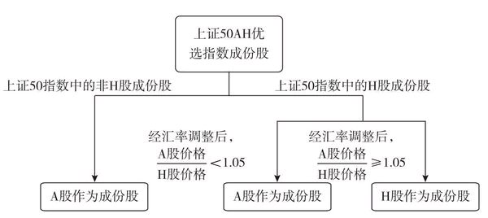
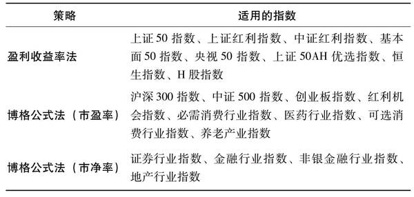
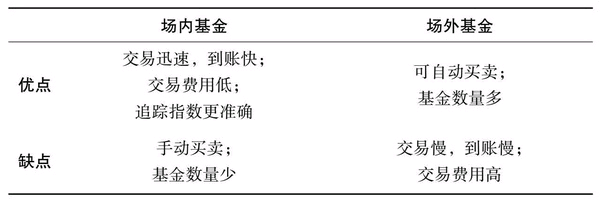
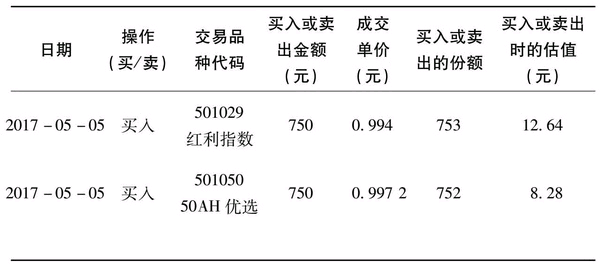

# 《指数基金投资指南》摘录

# 前言

​		可以关注我的公众号 “ 定投十年赚十倍 ”，我会在每个交易日发布指数基金的估值数据，也会不定期地发布关于指数基金的一些心得和感悟。

# 第 1 章 投资新手的建议

## 想成为富人，你得攒资产

* 如果你和大多数人一样，手头并不宽裕，那你首先要做的事就是攒钱，积累本金。
* 能够为我们 “ 生钱 ” 的就是资产。例如股票、基金、房地产、理财产品等，虽然它们生钱的速度各有不同，但只要持有它们，就会以各种方式源源不断地给我们带来现金。不能 “ 生钱 ” 的就不是资产，例如我们花钱去买烟抽，这就是消费，抽完烟这笔钱就不复存在了。
* 现金不是资产。至少从 “ 生钱 ” 的角度衡量，现金不是资产，持有现金，长期看是会贬值的。

### 1. 什么是财务自由

* 财务自由是我们可以不必为钱发愁，同时又有足够多的时间来做自己想做的事情。
* 真正的财务自由，是手里有大量能够 “ 钱生钱 ” 的资产，这样即使自己不再投入精力去工作，也可以源源不断地获得现金收入。

### 2. 如何实现财务自由

* 当我们的时间还不值钱的时候，可以用业余时间多看书、锻炼身体，戒掉一些花费较高却对身体无益的消费。

## 找到长期收益率最高的资产

* 有的资产可以产生现金流。

  能产生现金流的资产有很多，例如债券、股票、房地产（可以收租金）、银行理财、P2P 理财等。

* 有的资产则无法产生现金流。

* 例如黄金，如一块明朝的玉佩、字画、家具，放到今天它本身也不会产生现金流。再例如贵金属、古董、艺术品、矿山等。这就是不能产生现金流的资产。

* 为什么要分为能产生现金流的资产和不能产生现金流的资产呢？这是因为，本质上，这两种资产的价格驱动因素不同。

* 能够产生现金流的资产，它的价格主要取决于现金流的大小和稳定性。 

* 所有不能产生现金流的资产，价格都是由供求关系决定的。

* 能产生现金流的资产通常比不能产生现金流的资产长期收益率更高；能产生现金流的资产中，现金流越高，长期收益率更高。

## 看收益，更要看风险

* 长期投资股票，不考虑任何策略，只是长期持有，平均可以获得 9%～15% 的年复合收益率；配合正确的策略，才可以获得 20% 左右的年复合收益率。
* 不要贪婪，避免不合理的高收益，一切金融骗局都是纸老虎。

## 最适合上班族的基金——指数基金

* 简单理解，基金就是一个篮子，里面可以按照预先设定好的规则，装入各种各样资产。这样做的好处是，把一篮子资产分割成若干小份，一小份才几元，用较少的资金就可以投资了。这样一来，原来普通人买不起的资产，现在可以通过购买基金的方式投资了。例如： 
  * 装入各种短期债券、短期理财、现金，就是货币基金。
  * 装入各种企业债、国债，就是债券基金。
  * 装入各个公司的股票，就是股票基金。
  * 装入股票和债券，就是混合基金。
* 前面已经说过，股票是长期增值速度最快的资产，对应地，我们买入股票基金，也可以获得最快的增值速度。

## 投资者笔记

* 能够为我们 “ 生钱 ” 的就是资产，现金不是资产。
* 有的人看起来 “ 富有 ”，但一旦停止工作，高收入也就戛然而止。
* 通过定期投资指数基金，业余投资者往往能够战胜大部分专业投资者。

# 第 2 章 投资工具这么多，为什么要选指数基金

## 什么是指数

* 沪深 300 指数是由上海和深圳证券市场中选取 300 只 A 股作为样本编制而成的成份股指数。

* 沪深 300 指数样本覆盖了沪深市场六成左右的市值，具有良好的市场代表性。

* 什么是指数点数呢？

  每一个指数都有一个点数。这个点数就是指数背后公司的平均股价。这个点数下跌，就代表指数背后的公司股价整体下跌了；如果点数上涨，就代表指数背后的公司股价整体上涨了。

  指数的点数是一个很重要的数据，它能帮助我们分析股市整体的走势和收益情况。从长期看，股市是不断上涨的，所以指数的点数也是不断上涨的。

* 指数因为是长期上涨的，所以历史越长，指数的点数就会越高。这就是指数点数的作用和意义了。

## 谁开发的股票指数

* 开发指数的机构主要有两类：证券交易所和指数公司。

* 国内有三大指数系列。上海证券交易所（简称上交所）开发的上证系列指数，深圳证券交易所（简称深交所）开发的深证系列指数，以及中证指数有限公司开发的中证系列指数。

* 美国主要有三大指数：纳斯达克指数、标普 500 指数、道琼斯指数。纳斯达克指数是交易所指数，而标普 500 指数和道琼斯指数则是指数公司开发的。
* 中国香港主要是恒生公司开发的指数，例如恒生指数和 H 股指数。

## 指数基金是怎么来的

* 指数是一种选股规则，按照某个规则挑选出一篮子股票。如果有基金公司开发一个基金产品，也完全按照指数的选股规则去买入完全一样的一篮子股票，这就是指数基金了。
* 因为指数基金持有股票的种类、数量、比例都跟指数非常接近，所以指数基金的表现也跟指数非常接近。或者说，指数基金把指数这个抽象的概念，变成了可以实际交易的产品。

* 因为指数的规则是公开的，所以各家基金公司拿到指数的规则之后，都可以自己开发出对应的指数基金产品。
* 简单来说，指数基金是一种特殊的股票基金。一般的股票基金依赖于基金经理的个人决策能力，而指数基金不一样：它是以某指数作为模仿对象，按照该指数构成的标准，购买该指数包含的证券市场中全部或部分的证券，目的在于获得与该指数相同的收益水平。
* 一般的股票基金，依赖于基金经理的投资水平，基金的业绩好不好跟很大程度上取决于基金经理的能力；而指数基金的业绩跟基金经理的关系不大，主要取决于对应指数的表现。

## “ 躺着赚钱 ” 的指数基金

* 它主要有三个好处，还能帮助我们规避一些投资中的风险。

  1. 指数基金 “ 长生不老 ” 

     指数基金的第一个优势，是它可以 “ 长生不老 ”。

     长生不老，是针对单个股票和普通的股票基金来说的。

     指数基金可以通过吸收新公司替换老公司的方法，实现长生不老。理论上，指数的寿命与国家的寿命等同。

     普通的股票基金无法做到这一点，因为普通股票基金的表现取决于基金经理，由基金经理来决定股票的买入和卖出。但很少有基金经理能投资 30~40 年以上，所以普通股票基金一般无法长期存在下去。

  2. 指数基金能长期上涨

     指数基金的第二个好处，是它能长期上涨，而且上涨速度相对其他资产大类更高。这也是股票资产的一个特点。
     
     指数基金为何能长期上涨呢，背后的解释有很多。一个比较通用的解释是，指数背后的公司，每年赚的钱，会不断再投入生产，这样来年可以带来更多的盈利。这样不断地利滚利，就会推动指数不断上涨。
  
  3. 指数基金成本低
  
     指数基金还有一个优势，就在于它成本比较低。
  
     这里说的成本，主要是针对基金自身的运作成本。每只基金在运作的时候，每年都会收取基金管理费和托管费。
  
     **管理费**
  
     管理费是基金公司收入的主要来源。主动型基金一般会收取基金规模的 1.5% 作为管理费。
  
     指数基金的一个好处就是管理费率较低。国内指数基金的平均管理费率在 0.69% 左右。部分规模较大、运行时间较长的基金，管理费率会降到 0.5% 以下。
  
     **托管费**
  
     托管费是交给基金的托管方的。基金的庞大资产，并不是直接存放在基金公司，一般会在第三方托管方，例如某家大型银行。托管费就是支付给托管银行的费用。
  
     国内指数基金的托管费率平均在 0.14% 左右，低的可以做到 0.1%。托管费比管理费低很多，所以一般更重视管理费率是否较低。

* “长生不老、长期上涨、低成本”，这就是指数基金最主要的三个优势。除此之外，指数基金还可以帮助我们规避投资中最常见的风险。 

* 投资中有很多风险。
  * 第一类风险是个股黑天鹅风险。黑天鹅风险指的是突发的无法预料的风险。 
  * 第二类风险是本金永久损失的风险。 
  * 第三类风险是制度风险。投资市场的制度还是有很多不完善的地方。像传统股票基金，还是会存在利益输送、内幕交易等各种不完善的问题。

## 最适合普通投资者的股票基金——指数基金

* 从世界范围看，指数基金也逐渐成为普通投资者家庭资产配置的主力，特别是在欧美等发达国家和地区。

## 投资者笔记

* 指数是一个选股规则，它的目的是按照某个规则挑选出一篮子股票，并反映这一篮子股票的平均价格走势。
* 指数基金追踪指数，完全按照指数的选股规则去买入完全一样的一篮子股票。
* 指数基金有三个独特的好处：长生不老、长期上涨、成本低。
* 指数基金是最适合普通投资者的投资品种，如美国的 401(k) 养老计划中有很大一部分比例投资于指数基金，一个普普通通的工薪族靠着普普通通的收入也能通过投资指数基金实现财务自由。

# 第 3 章 常见指数基金品种

## 指数基金的分类

* 指数基金最常见的一种分类，就是分为宽基指数和行业指数。

* 这两者是如何区分的呢？
* 有的指数基金在挑选股票的时候，并不限制非得是投资哪些行业；但有的指数基金在挑选股票的时候，会要求只投资哪些行业的股票。

## 常见宽基指数基金

### 1. 上证 50 指数

#### 指数简介
* 上证 50 指数是从上交所挑选沪市规模最大、流动性好、最具代表性的 50 只股票组成样本股，以综合反映沪市最具影响力的一批优质大盘企业的整体状况。

* 上证 50 指数简称为上证 50，代码是 000016。指数代码是一个指数的 “身份证号”。

* 指数会有发布日期和基准日期。

* 指数的发布日期是这个指数正式推向市场可供投资者查询的日期。不过指数公司会往前推一段时间，作为指数的基准日期。

#### 指数的特点

* 特点之一：以大盘股为主。

* 编制上证 50 指数的目的是反映上交所的大盘股走势，所以上证 50 挑选的都是以大盘股为主的股票。

* 特点之二：只有上交所的股票，没有深交所的股票。

* 指数基金从交易渠道上可以分为场内指数基金和场外指数基金。这个场指的是证券交易所。

* 我们如果想获得指数基金，可以跟基金公司申购。我们把钱给基金公司，基金公司给我们对应的基金份额，这就是基金的申购。如果我们不想要这个基金，我们可以把基金份额还给基金公司，基金公司按照基金净值给我们对应的现金，这就是基金的赎回。

* 不过，对于场内基金而言，除了可以走申购赎回的方式来跟基金公司交易，也可以把基金份额放在证券交易所中进行交易。

* 简单地说，场内基金在证券交易所上市，可以有 “ 申购赎回 ” 和 “ 买入卖出 ” 两套交易体系，其中买入卖出方式需要在证券交易所中进行，是通过股票交易软件来操作的。如果基金没有在证券交易所上市，那就是场外基金，它只有 “ 申购赎回 ” 一种交易方式。

### 2. 沪深 300 指数

#### 指数简介

* 上证 50 指数毕竟只有 50 个名额，而国内的大企业数量远比这个多。并且上证 50 只有上交所的股票，无法反映深交所的股票。如果我们想投资国内全部的大企业，该怎么办呢？可以选择沪深 300 指数。

* 沪深 300 指数 ( 简称沪深 300 ) 是由中证指数公司开发的，从上交所和深交所挑选规模最大、流动性最好的 300 只股票。它的成份股数目比上证 50 多，也都是以大公司为主。沪深 300 指数所包括的公司，从市值规模上来说，占到国内股市全部规模的 60% 以上，比较有代表性，所以沪深 300 也被认为是国内股市最具代表性的指数。

* 沪深 300 指数的代码有两个：000300 和 399300。这是因为沪深 300 指数同时包括上海和深圳两个交易所的股票，所以沪深 300 在上交所的代码是 000300，在深交所的代码是 399300。这两个代码其实都是代表沪深 300 指数的。

#### 指数特点

* 沪深 300 以大盘股为主，兼顾上海和深圳上市公司。

* 挑选指数基金，一般有两种思路。第一种思路是寻找费用最低、误差最小的品种，这是 “ 指数基金之父 ” 约翰·博格所提倡的。因为基金费用越低、误差越小，指数基金的表现就越贴近于指数。这也是挑选指数基金最常用的方式。

* 第二种挑选指数基金的思路，是寻找有特色的增强型指数基金。

* 什么是增强型指数基金？

  我们知道，指数基金的目的是复制指数。不过有的时候，股市会出现一些比较明显的能获得超额收益的机会。于是，有的指数基金就会在追踪指数的基础上，去做一些操作来赚取超额收益，例如打新、量化模型等，希望相对于指数获得一些增强收益。这就是增强型指数基金。

* 什么是联接基金？

  联接基金是基金公司开发的特殊品种。场内基金投资需要开股票账户，具体操作在步骤上也比较麻烦，也没有自动定投的功能。所以基金公司就开发了一个联接基金，方便从场外来投资。

  联接基金是一种场外基金，通过申购赎回来交易。但它并不直接投资股票，而是通过投资对应的场内指数基金来实现复制指数的目的，也是指数基金的一种。

* ETF 联接基金是投资到对应的 ETF 基金上的，一般不会再单独收取基金管理费，因为 ETF 已经收取了基金管理费，若再对 ETF 联接基金收取费用则会导致双重收费。所以联接基金不再单独收费，整体费率跟对应的 ETF 基金一样。

### 3. 中证 500 指数

#### 指数简介

* 沪深 300 代表了中国上市企业中规模最大、流动性最好的  300 家企业，但剩下的企业还有几千家，其中规模中等的企业表现如何统计呢？为了统计这些中等规模上市公司的表现，中证指数公司开发了中证 500 指数。

* 将全部沪深 300 指数的 300 家公司排除，然后将最近一年日均总市值排名前 300 名的企业也排除，这样可以最大限度地避免选入大公司。在剩下的公司中，选择日均总市值排名前 500 名的企业，这就是中证 500 指数啦。

* 中证 500 指数简称为中证 500，代码是 000905 和 399905。

#### 指数特点

* 中证 500 本身是以中型上市公司为主，从定位上，它与沪深 300 和上证 50 重合度很低。上证 50 指数包含的 50 家大型公司，其实基本上也都在沪深 300 里，这两个指数很多时候的表现都比较重合。但中证 500 是与沪深 300 无重合的股票，所以它的定位和表现就与另外两者不同。

* 中证 500 也有两种挑选基金产品的思路。一种思路是挑选费用较低、规模较大、历史悠久、误差较小的指数基金产品。另外一种思路就是挑选有一定超额收益的中证 500 增强型指数基金。

### 4. 创业板指数

#### 指数简介
##### 什么是创业板呢？

* 我们都知道国内有上交所和深交所，我们平时说的股票，其实说的就是在这两个证券交易所上市交易的股票，它们大多在主板上市交易。

* 在主板上市交易，门槛是很高的，公司需要达到一定规模，而且也要有足够的盈利才可以。但是有一些小公司，目前盈利还不好，达不到主板上市的条件。国家就给这类公司提供了一个门槛更低的市场：创业板市场。

* 创业板市场是放在深交所下面的。

##### 主板和创业板

* 主板市场也被称为一板，对发行人的营业期限、股本大小、盈利水平、最低市值等方面的要求标准较高，上市企业多为大型成熟企业，具有较大的资本规模以及稳定的盈利能力。

* 想要在国内的主板上市，上市公司必须达到最近 3 个会计年度净利润为正并且累积超过人民币 3 000 万元，最近 3 个会计年度经营活动产生的现金流量净额累计超过人民币 5000 万元，或者最近 3 个会计年度营业收入累计超过人民币 3 亿元。

* 从世界范围来看，二板的上市公司，其长期的经营风险还是要高于主板的上市公司的。在投资的时候，需要注意这一点。

* 创业板指数，就是为了衡量创业板的整体股价表现情况而设立的。

##### 创业板相关指数

* 创业板相关的指数有两个，一个是创业板综指，另一个是创业板指数。这两个指数的名字非常相似，所以很多投资者都将其混淆了。

* 创业板综指是为了衡量创业板所有上市公司的股价平均表现而设立的，代码是 399102。它包括创业板全部的 500 多家企业。

* 而创业板指数是为了衡量创业板最主要的 100 家企业的平均表现而设立的，代码是 399006。创业板指数限制了成份股的数量，只从创业板上市公司中，挑选出规模最大、流动性最好的 100 只股票。

* 最近几年，还出现了创业板 50 指数，是从创业板指数的 100 家企业中，再挑选出流动性最好的 50 家，相当于创业板的 “ 上证 50 ”。创业板 50 指数的代码是 399673。

* 这三个指数中，被开发成指数基金产品的，主要是创业板指数和创业板 50 指数。因为创业板的上市公司，本身大多规模就较小，特别是规模排在后面的创业板公司，因为规模小、成交量低，指数基金投资这类企业很可能买不到需要的股份数量，在流动性上可能会存在问题。所以目前国内的创业板指数基金，大多是以创业板指数和创业板 50 指数为基准设立的，剩下的并不纳入。

#### 指数特点

* 创业板指数整体公司规模较小，属于以中小型公司为主的指数。并且这些公司大多盈利没有进入稳定期，所以创业板的整体盈利数字比较低；公司开展新业务也更容易导致盈利大起大落。小公司＋盈利没有进入稳定期，创业板指数相比之前介绍的指数，更容易暴涨暴跌，投资时要有心理准备。

### 5. 红利指数

#### 指数简介

* 上证 50、沪深 300、中证 500、创业板，它们虽然各自有特点，挑选股票的范围也不同，但是有一个共同点，就是它们都是按照市值来加权的，即股票规模越大，权重越高。这也是指数基金的主流加权方式。但实际上，除了市值加权，市场上还有另一类指数基金，它们是按照一定的策略来加权的，也被称为策略加权指数。

##### 什么是市值加权、策略加权？

* 市值加权比较好理解，就是股票规模越大，权重越高。

* 而策略加权，则是按照别的方式来决定个

* 红利指数基金就是最近十几年兴起的一类比较特殊的策略加权基金。我们都知道股票是会发放股息的，也就是现金分红：业绩比较好的公司，会每年从净利润中拿出一部分，以现金分红的形式回馈股东。

* 所以我们可以通过持有几十只现金分红最高的股票，来获取更高的收益。这就是红利指数的来源。

* 股票的分红是公司盈利的一部分。公司一年里赚到的盈利，并不是在某一天突然产生的，而是在一年的时间里逐渐积累起来的。分红作为公司盈利的一部分，也是在这一年里慢慢积累起来的。分红的那一天股价下跌，只是将这部分盈利分到股东手里的一个具体体现。实际上每年都会产生新的盈利、新的分红，源源不断。

* 时间越长，分红在我们投资股票的收益中所占的比例就越大。

#### 上证红利指数

* 这个指数挑选了上交所过去两年平均现金股息率最高的 50 只股票，指数代码为 000015。A 股的第一个红利指数基金就是围绕上证红利指数开发的。

* 上证红利指数与前面提到过的上证 50 指数比较相似，也是投资了 50 只股票。因为上交所高股息率的股票，大多是大盘股，所以上证红利指数也是以大盘股为主。

#### 中证红利指数

* 中证红利指数由中证指数公司编制，同时从上交所和深交所挑选过去两年平均现金股息率最高的股票，成份股数量扩大到 100 只。

* 因为中证红利指数同时覆盖了两个股票交易所的上市公司，所以可以挑选的高分红股票会更多一些。从历史表现上来说，中证红利的历史收益就比上证红利指数更好一些。从两个市场挑，可选面总比一个市场要广一些。

* 中证红利指数的代码是 000922/399922。

#### 深证红利指数

* 深证红利指数与上证红利指数对应，专门投资深交所的高现金股息率的股票，不过成份股只有 40 只。

* 代码为 399324。

#### 红利机会指数

* 这是标普公司围绕 A 股开发的红利指数。红利机会指数在传统红利指数的基础上增加了一些筛选条件。

* 传统的红利指数，一般只是挑选高股息率的股票，没有其他的要求。但是红利机会指数有 3 个要求：过去 3 年盈利增长必须为正；过去 12 个月的净利润必须为正；每只股票权重不超过 3%，单个行业不超过 33%。

* 这样做的好处有两方面。一方面长期分红的根本来源是盈利，挑选盈利增长、净利润为正的股票，可以去掉很多盈利走下坡路的高分红股。这样筛选出来的股票，长期分红能力会更强。另外盈利增速高也会带来更好的收益。
* 另一方面则限制了指数行业的占比，这样可以避免某些特殊时间段某些行业占比过高的情况，长期更加稳健。像 2007 年的时候，当时钢铁行业整体高分红，就占据了红利指数很大比例。限制行业占比，可以避免某些行业仓位过重，降低风险。

* 红利机会指数是由国际知名的指数开发商标普公司开发的，代码也跟国内的指数代码不同，是由英文字符组成的，代码为 CSPSADRP。

* 我们知道，指数基金有场内和场外之分，其中场内基金主要是两种，ETF 基金和 LOF 基金 (上市型开放式基金)。这两种基金都是可以在股票交易所里自由买卖的。所不同的是，ETF 基金只能通过股票交易软件来交易，而 LOF 基金除了可以通过股票交易软件来交易之外，还可以像场外基金一样，在场外通过申购赎回的方式来交易。

#### 指数的特点

* 红利指数有很多种，但它们整体有一些共同的特点。

* 特点之一：高股息率，在熊市更有优势。

* 特点之二：能持续发放现金股息的公司，盈利能力和财务健康状况好的概率越高。

* 特点之三：提供分红现金流。

### 6. 基本面指数

* 策略加权的指数有很多。除了挑选高股息率股票的红利指数，还有一类影响力也非常大的策略加权指数：基本面指数。

#### 指数简介

##### 什么是基本面指数呢？

* 我们经常能听到基本面这个词。基本面覆盖了一个公司的运营的各个方面，比如说营业收入、现金流、净资产、分红等。通过基本面来选股，也就是说，谁的基本面更好，谁占的权重更高。

* 那我们怎么知道一个企业基本面的好坏呢？目前一般从 4 个维度去衡量：营业收入，现金流，净资产和分红。而基本面指数也正是从这 4 个维度去挑选股票的。

* 基本面指数中，在国内最出名的就是中证基本面 50 指数。这个指数是按照 4 个基本面指标，挑选出综合排名前 50 的公司。具体来说，是从上市公司过去 5 年的年报数据中，计算 4 个基本面指标。
  * 营业收入：公司过去 5 年营业收入的平均值。
  * 现金流：公司过去 5 年现金流的平均值。
  * 净资产：公司在定期调整时的净资产。
  * 分红：公司过去 5 年分红总额的平均值。

#### 指数特点

* 这种按照占总规模百分比来排名得分的方式，很明显公司规模越大，越占优势。所以基本面 50 指数挑选出来的，往往也是大盘股。从定位上来说，基本面 50 指数跟上证 50 指数很相似。不过因为它综合考虑了收入、盈利、净资产等基本面因素，所以挑选股票时会考虑得更全面一些。

### 7. 央视财经 50 指数

#### 指数简介

* 前面介绍过按股息率加权的红利指数，按基本面加权的基本面指数，再来介绍一个比较有特色的指数：央视财经 50 指数 ( 简称央视 50 )。它是一种专家加权的指数。

* 这个指数跟央视有很大的关系：它是深证指数和央视的财经频道联合推出的。

* 央视财经 50 指数是由中央电视台财经频道联合五大高校，包括北京大学、复旦大学、中国人民大学、南开大学，以及中央财经大学，以 “ 成长、创新、回报、公司治理、社会责任 ” 5 个维度为考察基础，结合专家评审委员会与 50 家市场投研机构的投票，并由中国注册会计师协会、大公国际资信评估有限公司从财务与资信评级两个角度进行评定，在 A 股市场上遴选出 50 家优质上市公司组成其样本股，再经深圳证券信息有限公司对五个维度进行权重优化，编制成央视财经 50 指数，共 50 只样本股，每个维度各 10 只。

* 央视 50 的指数代码是 399550。

#### 指数特点

* 央视 50 指数来头不小，央视牵头、众多专家评审选股。在挑选股票的时候，专家会综合考虑这些股票的特点，不仅挑选规模较大、比较重要的行业龙头，也会挑选一些有特色、成长性好、前景不错的小盘股。从行业分布上看也比较均匀。与上证 50 等大盘股指数所不同的是，这是一只大小盘兼具的指数。

### 8. 恒生指数

* 国内除了上海和深圳两个证券交易所之外，还有一个非常特殊、但又非常重要的证券交易所——香港证券交易所，简称港交所。

* 而投资于中国香港、美国等市场的基金品种，我们把它们称为 QDII 基金。

* QDII 的意思是合格境内机构投资者。我们可以把这种基金理解成一种 “ 代购 ”。

* 这种基金可以拿人民币，合法地投资中国香港及其他境外市场，像港股、美股、德股等。

* 需要注意一点，内地金融整体来说还不成熟，政策也经常变化。

* 在港股指数基金中，最著名的就是恒生指数了。

#### 指数简介

* 它历史悠久、收益稳定，是一个老牌的优秀指数。恒生指数投资的是所有在中国香港上市的公司中规模最大的 50 家企业，这一点与上证 50 指数很相似。

* 恒生指数代码是英文字符，HSI。

#### 指数特点

* 说是恒生指数的特点，其实也是香港股票市场整体的特点。

* 特点之一：历史悠久，成熟开放。

* 特点之二：跟内地紧密相关，但投资者以境外投资者为主。
* 特点之三：“ 老千股 ” 导致个股投资风险巨大，普通投资者投资港股的最好方式——港股指数基金。

```
什么是港股通？

* 港股通是互联互通的一部分，也是中国金融业的一次大创新。

* 港股通于 2014 年成立，开通港股通后，个人投资者可以很方便地投资中国香港股票市场的股票。港股通初期以恒生指数和恒生中国企业指数的成份股为主，因为这些指数的成份股相对可靠，遇到风险的概率较小，后期也逐渐扩展到香港中小盘股。
```

* 因此，个人投资香港股票市场，最好是通过指数基金的形式。港股的指数基金对个股有所挑选，并且同时投资几十只不同的股票，受个股风险的影响较小。

#### 对应指数基金

* 恒生指数在中国香港也有对应的指数基金，例如盈富基金，就是在香港本地可以投资的一只恒生指数基金。

* 不过盈富基金目前还不能通过港股通来投资，个人投资盈富基金比较麻烦，并且盈富基金的投资门槛比内地的基金要高很多。所以我们投资恒生指数，仍然是以 QDII 型恒生指数基金为主。

### 9. H 股指数

#### 指数简介

* 如果一家公司在内地注册，但是在香港地区上市，这样的公司就是 H 股了。内地公司到香港上市的有很多，从 1993 年青岛啤酒到香港上市至今，已经有 160 多家企业到香港上市。为了衡量这些公司股票的表现，恒生指数公司编制了恒生中国企业指数，也就是通常说的国企指数，简称为 H 股指数。

* 投资者对 H 股指数经常有两个误会。

  * 误会一：国企指数就是投资国企的。

    此国企非彼国企。虽然 H 股指数中确实有不少国企 H 股，但它本身并不限制非得投资国企。这里所说的国企指数，仅仅是中国企业指数的简称。

* 误会二：H 股指数就是恒生指数。

  H 股指数的全称是恒生中国企业指数，虽然看起来跟恒生指数很类似，但两者是不同的：恒生指数挑选的是香港股市规模最大的 50 家公司，而 H 股指数挑选的是规模最大的 40 家 H 股。

  不过两者确实有很多重合的成份股。这是由于有的 H 股本身规模也很大，也会被入选到恒生指数中。

#### 指数特点

* 特点之一：内地公司在境外的 “ 代言人 ”。

  境外投资者难以直接投资 A 股，但是中国香港金融市场是开放的，对境外投资者来说，H 股是可以随意投资的。所以在很长的一段时间里，H 股一直是中国内地公司在世界上的代言人。

* 特点之二：与内地经济紧密相关，但仍然是以境外投资者为主。

* 特点之三：H 股与 A 股指数的亲密关系。

  H 股指数是挑选在中国香港上市的规模最大的 40 家 H 股。而这些 H 股背后的公司，很多也在 A 股上市。所以 H 股与 A 股很多指数的关系都非常密切。

### 10. 上证 50AH 优选指数

#### 指数简介

* 介绍 H 股的时候提到过，H 股指数和 A 股指数的关系很紧密。原因很简单，因为很多公司，同时在 A 股和港股上市，在港股上市的这部分就是 H 股。

* 如果 A 股和 H 股差价过大，那么相对便宜的那个未来的收益会更好。这就是 AH 股轮动策略：买入 AH 股中相对便宜的那个，卖出相对贵的那个。

* 上证 50AH 优选指数 ( 简称 50AH 优选指数 )，就是利用这一原理来获得超额收益。

#### 指数特点

* 特点之一：成份股与上证 50 相同。

  50AH 优选指数的成份股，跟上证 50 指数一样，也是挑选上交所规模最大的 50 家公司，但是它有自己特殊的地方。

  上证 50 指数、H 股指数、50AH 优选指数的异同点：

  * 上证 50 指数：27 只纯 A 股+23 只同时具备 A、H 股的公司中的 A 股。
  * 50AH 优选指数：27 只纯 A 股+23 只同时具备 A、H 股的公司中相对更便宜的那一类。
  * H 股指数：17 只纯 H 股+23 只同时具备 A、H 股的公司中的 H 股。

* 特点之二：成份股入选 50AH 优选指数时，如果成份股同时具备 A 股和 H 股，选相对便宜的那个。

  选取的规则如下图所示。

  

  用文字描述为，经过汇率调整后，如果 A 股价格 / H 股价格>1.05，说明 A 股贵，则选相对便宜的 H 股；反之，如果 A 股价格 / H 股价格<1.05，则说明 A 便宜，选 A 股。

  50AH 优选指数认为，正常情况下，A 股应该比 H 股贵 5%。

* 特点之三：每个月第二个周五，进行一轮动的规则如下：

  * (1) A 股价格/ H 股价格 >1.05，说明 A 股贵，如果持有 A 股，则换成 H 股。
  * (2) A 股价格/ H 股价格 <1，说明 A 股便宜，如果持有 H 股，则换成 A 股。
  * (3) 如果 A 股价格/ H 股价格介于 1～1.05，则不轮动。

  注意一下，轮动时用的标准跟成份股入选指数时用的标准不一样。

  入选时，是 A 股价格/ H 股价格，大于 1.05 选 H 股，小于 1.05 选 A 股。

  轮动时，是 A 股价格/ H 股价格，大于 1.05 选 H 股，小于 1 选 A 股。

  这样做主要是为了防止当 A 股价格/ H 股价格的数值正好在 1.05 左右波动时，造成频繁轮动调仓。

  每隔一段时间，A 股和 H 股之间的相对折溢价也会呈周期性变化。

### 11. 纳斯达克 100 指数

* 美国股市有两个最主要的指数：纳斯达克 100 指数、标普 500 指数。

#### 指数简介和指数特点

* 纳斯达克 100 指数投资的是纳斯达克规模最大的 100 家大型企业。

* 纳斯达克 100 指数的代码是 NDX，简称纳斯达在 100。

* 以技术类公司为主，这就是纳斯达克 100 指数最大的一个特点，它包括了全世界规模最大的一批信息技术类公司。

* 我们国内的投资者投资境外市场上市的指数基金比较困难，所以也主要是通过 QDII 指数基金来投资纳斯达克 100 的。

* 投资 QDII 指数基金的风险：外汇额度不够导致暂停申购。

* 投资港股的 QDII 指数基金因为港股通不限额度，所以不会有额度不足的情况，但投资美股的 QDII 指数基金，会因为基金公司美元额度不足，经常暂停基金的申购 ( 赎回还是可以的 )。

### 12. 标普 500 指数

#### 指数简介和指数特点

* 标普 500 指数是美国影响力最大的一个股票指数，是美国传统经济的代表，定位上类似于国内的沪深 300 指数。

* 标普 500 指数也是以大盘股为主，有 500 只成份股。不过不同于沪深 300 指数，标普 500 指数不单纯按照上市公司的规模来选股票。标普 500 并不限制入选公司的市值规模，换句话说，标普 500 不仅有大公司 ( 大约占 90% )，还有很多中型公司 ( 大约占 10% )。

* 标普 500 指数倾向于选择行业的领导者、长期盈利更好的公司。

* 标普 500 各个行业的分布、大小型公司的选择都比较均匀，自身质量非常不错。

* 标普 500 的指数代码是 SPX。

### 13. 其他指数和指数基金

#### 上证综指

* 上证综指是国内历史最悠久的一个指数，指数代码为 000001。

* 综指指的是综合指数，上证综指包括了上交所全部的上市公司，目的是反映上交所所有股票的走势。

#### 中证 100 指数

* 前面介绍过上证 50，它的一个特点是只有上交所的股票，没有深交所的股票。中证指数公司也注意到了这点，于是开发了中证 100 指数，代码为 000903。

* 中证 100 指数是从沪深 300 指数中，再挑选出规模最大的 100 只股票组成的。比起上证 50 指数，它覆盖了深交所的大公司，所以更加全面一些。

#### 中证 800 指数、中证 1000 指数、中证全指

* 中证指数公司开发了很多重要的指数，前面介绍过的沪深 300、中证 500 都是它开发的。沪深 300 指数主要投资沪深两市规模最大的 300 只股票，是大盘股的代表指数。中证 500 指数投资排除了沪深 300 包含的 300 只股票之后的规模最大的 500 只股票，是中盘股的代表指数。

* 有的投资者想同时投资大中盘股，于是中证公司就开发了中证 800 指数。中证 800 指数 = 沪深 300 指数 + 中证 500 指数，基本上把 A 股的大中型公司都囊括在内，其指数代码为 000906。

* 如果还想投资小盘股，该怎么办呢？中证公司又开发了中证 1000 指数，追踪除去中证 800 指数之外最大的 1 000 只小盘股，指数代码为 000852。

* 我们可以来列举一下中证指数公司开发的一系列指数。
  * 中证 100：大盘股为主，沪深两市规模最大的 100 只。
  * 沪深 300：大盘股为主，沪深两市规模最大的 300 只。
  * 中证 500：中盘股为主，排除沪 300 后，沪深两市规模最大的 500 只。
  * 中证 800：大中盘股，沪深 300 + 中证 500。
  * 中证 1000：小盘股为主，除去中证 800 外，最大的 1 000 只小盘股。

* 另外中证指数公司还开发了中证全指。中证全指目的是覆盖 A 股全部市场上的股票，除了亏损比较严重的公司和上市不足 3 个月的新公司。不过中证全指没有对应的基金产品，它主要是为了方便统计 A 股的整体走势时使用的，其指数代码为 399985。

#### 等权重指数

* 什么是等权重指数呢？

* 像上证 50 指数、沪深 300 指数等是市值加权的指数，也就是按照市值规模来挑选股票，谁市值越大谁占的权重就越高。而红利指数是根据股息率加权的指数，股息率越高所占的权重就越大。

* 而等权重指数则是分配给每个成份股完全相同的权重。

* 这种指数的好处是避免了部分股票在指数中的占比过高。有的指数中，部分成份股占比比较高，几个成份股就占据了指数 40%～50% 的权重，这样相当于指数的成份股被某几只股票 “ 绑架了 ”，而等权重指数是最分散的一种指数，每个成份股都是均匀买入的。

* 不过，等权重指数也有缺点，就是流动性比较差，它的流动性取决于流动性最差的那个成份股。

* 流动性是投资股票的时候一个很重要的参考因素。简单理解流动性的话，就是看买卖某只股票是否比较顺畅，想买的时候能否买得到，想卖的时候能否卖得出去。有的股票成交量很低，每天只有几万元的成交额，那么这只股票的流动性就比较差。如果一个等权重指数基金有 10 亿规模，投资 100 只成份股，那么每一只成份股就要买 1 000 万，而这 1 000 万是很难在一个流动性差的股票上买进卖出的，从而会影响等权重指数基金的追踪效果。

* 所以等权重指数基金的规模天生受限，主要是一些小型指数基金采用。

#### 价值指数

* 价值指数是一种比较有特色的策略加权指数。

* 前面提到过，基本面指数会按照基本面来加权，其实价值指数跟它很相似，只不过用的是 4 个估值指标来进行筛选：市盈率、市净率、市现率和股息率。估值指标是投资股票类资产时非常重要的辅助工具。

* 这里的价值，实际上说的是 “ 市盈率、市净率、市现率较低，股息率较高 ” 的股票。这类股票一般被称为价值型股票，而价值指数就是这类股票的代表。价值型股票作为一个整体，它的表现会比市值加权的指数要好一些，这是它的一个特点。不过这类指数国内还不多，规模也都不大，了解一下就好。

## 行业指数基金

### 1. 什么是行业指数基金

* 前面提到过的上证 50 指数、沪深 300 指数、红利指数等，都有一个特点：它们在挑选股票的时候，包括了各行各业，并不限制行业，这样的指数叫作宽基指数。实际上市场上还有一类比较小众的指数基金，这些指数基金专门投资某个行业的股票，也就是行业指数基金。

* 行业指数的投资风险更高一些，不仅要考虑投资价值，还要考虑不同行业自身的特点和当前所处的发展阶段。

* 行业有自己的投资特点，不能一概而论，需要针对行业的特点具体分析。所以就投资难度来说，行业指数比宽基指数要高出不少。

* 那为何还要投资行业指数基金呢？因为行业指数基金能极大地丰富我们的投资品种。有的时候宽基指数基金没有太好的投资机会，但某些行业指数基金反而会出现投资机会，这就能对我们的投资起到很好的补充作用。

### 2. 有哪些行业

* 从指数基金上划分行业最常用的方法，是把行业分为 10 个一级行业。

* 其中最主要的 10 个一级行业分别是：
  * 材料：金属、采矿、化学制品等。
  * 可选消费：汽车、零售、媒体、房地产等。
  * 必需消费：食品、烟草、家居等。
  * 能源：能源设备与服务、石油天然气等。
  * 金融：银行、保险、券商等。
  * 医药：医疗保健、制药、生物科技等。
  * 工业：航空航天、运输、建筑产品等。
  * 信息：硬件、软件、信息技术等。
  * 电信：固定线路、无线通信、电信业务等。
  * 公共事业：电力、天然气、水等。

* 除了按照 10 个标准行业来划分，还有另一种划分行业的方式，就是按照某个特定的主题来划分行业。像养老行业、环保行业、军工行业、健康行业、互联网行业等。这些主题行业，是围绕某个主题来找出对应的公司，可能包括相关主题的上下游公司。这是另一种行业的分类方式。

* 标准的 10 个一级行业分类，或者按照某个主题划分的主题行业，这就是行业指数基金的主要两种组成方式。

### 3. 哪些行业值得投资

* 值得投资的行业，主要有两个，一个是天生赚钱更容易的行业，另一个是具有明显强周期性行业。

#### 3.1. 天生更容易赚钱的行业

* 中证 800 一级行业指数，就是把这 800 家企业，按照各自所属的行业，划分成 10 个一级行业指数。

* 天生更容易赚钱的行业有哪些呢？主要集中在消费和医药行业。例如医药行业、必需消费行业、可选消费行业。另外一些主题行业也具备类似的特征，例如养老行业，以医药和消费行业为主。因为医药和消费行业比较优秀，使得养老行业也变优秀了。

#### 3.2. 强周期性行业

* 除了天生更容易赚钱的行业，还有一种行业也挺值得投资，就是明显有强周期性的行业。

* 如果我们在这些强周期性行业的周期底部，即在它们比较便宜的时候买入；在周期顶部，即比较贵的时候卖出，就能获得非常不错的收益。

* 总结一下，值得投资的行业，主要是两类，一类是天生更容易赚钱的优秀行业，像医药、必需消费、可选消费，以及相关的主题行业。另一类是在周期底部也能盈利的强周期性行业，像金融行业中的银行、证券、保险、地产行业、能源行业、部分材料行业等。

### 4. 相关行业指数基金

#### 4.1. 优秀行业之必需消费行业

* 必需消费行业也被称为日常消费行业、主要消费行业。这三个虽然称呼不同，实际上说的是一回事。必需消费，主要是维持我们正常生活所需要的各种消费品，例如饮料、酒、农副食品等。

* 目前必需消费行业的指数主要是以下 4 只。
  * 上证消费指数：从上交所挑选必需消费行业公司。
  * 上证消费 80 指数：从上交所挑选 80 家规模最大的必需消费行业公司。
  * 中证消费指数：从中证 800，即沪深 300 和中证 500 中挑选必需消费行业公司。
  * 全指消费指数：从所有上市公司中挑选必需消费行业公司，覆盖范围最广。

#### 4.2. 优秀行业之医药行业

* 医药指数是经济危机中非常具有价值的避险板块。即使宏观经济不好，医药行业整体表现也好于宏观经济。

* 目前医药行业的指数主要有以下几种：
  * 中证医药指数：又称中证 800 医药指数，是从中证 800 指数中挑选医药行业。
  * 中证医药 100 指数：挑选了 100 家大型医药股，每只股票买入相同的金额。
  * 上证医药指数：只投资上交所的医药行业公司。
  * 全指医药指数：从整个 A 股中挑选医药行业，它覆盖的医药公司是最全的。
  * 细分医药指数：挑选了医药行业细分领域的主要公司。
  * 300 医药指数：挑选了沪深 300 指数里的医药行业公司。
  * 500 医药指数：挑选了中证 500 指数里的医药行业公司。

#### 4.3. 优秀行业之可选消费行业

* 必需消费指的是我们在日常生活中需要经常消费的食品、饮料、烟草等常用日用消费品，一般单价比较低，消费频率高，也是刚需。可选消费则是和必需消费对应的。

* 什么是可选呢？从名字上也可以大致区分出来，可选消费指的是有钱的时候才会消费，这种消费可以提升我们的生活质量，但不是刚需。没有钱的时候，我们会推迟可选消费方面的支出，像高档手机、汽车、大家电等，都是属于可选消费的范畴。

* 可选消费有如下几个特点：

  * 需求比必需消费弱，有一定周期性。

  * 受益于人口红利，特别是人均消费金额的提升。

  * 可选消费的升级换代特性。

    可选消费有升级换代的特性。像 80 年代的三大件、90 年代的彩电等，每个时代都有其具有代表性的可选消费产品和企业。这些企业在自己所引领的时代里能呼风唤雨，股价和业绩表现都非常惊人，但如果跟不上消费升级换代，企业就会衰落。

    这个特点会导致一个问题，就是如果某个可选消费的个股，在升级换代中被替换掉了，那么对投资者来说就会有很大的投资风险。所以对普通投资者来说，投资可选消费行业的指数是个不错的选择，指数囊括了一系列的相关股票，可以避免投资单个个股的风险。

#### 4.4. 优秀行业之养老产业

* 它并不是我们想象中的像养老院那样的养老，实际上，它是一个多行业混合的产业。养老产业覆盖了多个行业，包括医疗保健、信息技术、日常消费、可选消费，甚至包括保险公司这种金融行业。

* 目前影响力最大的养老产业的指数是中证养老产业指数，包括 80 只成份股。它的成份股覆盖面比较广泛，成份股的权重也都差不多，换句话说，它是一只等权重指数。

* 在挑选成份股的规则上，中证养老产业指数也与一般的行业指数不同。挑选规则如下。
  1. 消费电子、休闲用品、酒店旅游、教育、文化传媒、药品零售、乳品、家庭用品、医药卫生、人寿保险、互联网软件等行业属于养老行业，每个子行业挑出一个市值最大的，列入成份股，这就有了十几只。
  2. 挑完后，在剩余的养老产业股票中，挑选市值最大的作为指数样本股，直到样本股数量满 80 只。

* 简单说，就是先保证各个子行业的龙头入选，再按市值来挑选。养老产业指数主要是由医药行业、必需消费行业和可选消费行业混合的，因此，它同样具备医药和消费的优秀属性，属于非常不错的好行业指数。

#### 4.5. 周期性行业之银行业

* 除了比较容易赚钱的优秀行业，还有一类行业也是可以考虑的，那就是强周期性行业。

* 周期性行业指的是行业的某些方面会呈周期性波动。

* 这些周期性，有的是因为用户的需求变化，有的是因为原材料的价格变化，有的是因为宏观因素的变化。所以不同的周期性行业，其背后的周期驱动因素也是不同的。周期顶部和底部的表现也相差很大，不能统一而论。例如同样是周期性行业，证券行业在牛市的时候业绩会大涨，但牛市对石油行业就没什么影响。所以不同的周期性行业，它们的周期性并不同步。

* 最具有代表性的周期性行业就是金融行业。

* 金融行业包括的子行业非常多，像大家熟悉的银行、保险、证券，都是金融行业的子行业。另外像金融消费、金融租赁、资产处理、基金公司、投资银行，甚至典当行都可以算是金融的子行业。

* 目前国内上市的金融公司，主要是以银行、保险、证券为主，所以我们重点研究这三个行业，俗称 “ 金三胖 ”。“ 金三胖 ” 虽然都是金融行业，但是彼此却有非常大的不同，并不能套用同样的策略。金融行业体量实在太大，哪怕是单拿出银行、证券也有很多产品。

* 银行是最重要的一个金融子行业，也被称为百业之母。

* 银行具备不错的商业模式，可以简单地看作是 “ 两个收入，两个费用 ”：利息收入，非利息收入，利息费用，风险准备金。

* 所以，简单地看，可得：
  银行的收益=利息收入+非利息收入-利息费用-风险准备金
  =利差收益+非利息收入-风险准备金。

* 银行的盈利没有必需消费和医药那么稳定。从这几年国内银行股的盈利也可以看出来，各家银行不再齐头并进，而是出现了明显的分化。

* 银行可以看成百业之母，地位特殊。

* 优秀银行特点：

  1. 注重利差收益的银行。

     对于大多数银行来说，利差收益都是最大的一块。专注于传统 “ 利差收益 ” 的银行，会努力将存款成本降至最低(利息费用降低)，同时严格把控贷款客户的质量，努力将业务布满在不同的地区，分散贷款的风险，降低风险准备金费用。这是银行业最正统、最保险的发展模式。

  2. 依赖区域经济发展的地区性银行。

     由于业务比较集中在一个地区，因此地区性银行的资产质量、业务量与当地经济的发展情况、当地居民的金融习惯高度相关。如果当地经济发展良好，或者说居民偏爱储蓄、诚信良好，那么银行的资产质量会非常高，相应地，风险准备金会比较小。

     区域性的银行大多与当地政府、企业关系更加密切，能获取很多稳定的业务。

  3. 注重非利息收入的银行。

     越是依赖利差收益，就越是需要银行尽可能地做到低成本揽储，低风险放贷。这种模式不可避免地会受到经济周期的影响。在经济下行周期，原来质量较好的客户还款能力也有可能下降，从而让银行大幅增加风险准备金，利润大降。所以有的银行就试图在 “ 非利息收入 ” 上下功夫，提升非利息收入的比例，可以降低银行的周期性波动。

* 优秀的银行，大都是围绕 “ 摆脱传统利差收益的周期性 ” 而努力的。例如优秀的风控能力，能让银行计提更少的风险准备金，不至于在经济下行周期影响利润太多。提升利差收益之外的非利息收入占比，可以让利润更稳定。通过资产证券化等让自己变 “ 轻 ”，可以摆脱资产质量的包袱。

##### 4.5.1. 对应指数基金

* 投资银行业，有两种选择。一种选择是投资前文介绍过的上证 50 指数、基本面 50 指数、H 股指数、50AH 优选指数等相关的指数基金。国内的银行股规模都比较大，所以在这 4 个以投资大盘股为主的指数中，包括了很多银行股。投资这 4 个指数，也就意味着在很大比例上投资了银行股(从另一个角度来说，如果投资了这 4 个指数基金，也就不用再专门投资银行业的指数基金了，避免重复)。

* 如果想专门投资银行业，则可以投资银行业的指数基金。目前国内的银行业指数基金，基本上都是追踪中证银行指数

* 分级基金是最近几年兴起的一类比较特殊的基金品种。

* 分级基金由三部分组成。母基金是一只普通的指数基金，投资分级母基金，与投资其他指数基金的方式是一样的，投资者可以持有分级母基金来追踪对应的指数。

* 在母基金的基础上，分级基金还会拆分成分级基金 A 份额和 B 份额。其中，A 份额相当于一个债券型品种，目的是获得一个较为固定的收益；B 份额相当于一个杠杆型品种，目的是在指数基础上加杠杆，获得更高的收益，当然了，由于加了杠杆，其风险也非常大。

* 由于分级基金 A 份额和 B 份额的投资特征、投资难度都与普通的指数基金有很大的不同，所以从 2017 年 5 月 1 日开始，国家限制了分级基金 A 份额和 B 份额的投资门槛，需要有 30 万元以上的资金才能投资。

* 而母基金是一只普通的指数基金，没有 30 万元的投资门槛，跟其他的指数基金一样可以正常交易。

#### 4.6. 强周期性行业之证券业

##### 4.6.1. 行业简介和特点

* 证券行业也就是券商业，也被称为 “ 周期之王 ”。它是最典型的一个强周期性行业。
* 证券行业的商业模式比较容易理解，作为证券市场的 “ 揩油者 ”，证券公司最主要的收入来源是交易费用。牛市的时候，无论是新开户还是资金量都会与平时相比有大幅的提升。所以证券行业的业绩与牛熊市的相关性非常大。证券行业的周期性取决于市场行情。

* 证券行业适合长期投资吗？证券行业并不适合买入后长期持有。证券行业可以说是不适合长期持有的行业的一个典型：证券行业是充分竞争的行业，大多数券商提供的服务同质化严重，导致券商行业的基本面和股价的走势高度趋同。激烈的竞争不断地压缩券商的主要收入——佣金。大多数券商没有核心竞争力或者说护城河，不能把自己从竞争中脱离出来，客户可以更加自由地选择券商。再加上互联网金融的冲击，未来超低佣金会成为主流。这些加剧了证券行业的竞争程度。

* 好处是如果风险控制得比较好，证券行业的资产质量风险并不大，这一点较银行业和保险业来说要好一些。也正因为证券行业的同质化比较严重，所以我们选择证券行业的指数基金来投资券商，既可以享受到它的强周期性特征，又可以摒弃大多数个股风险。

##### 4.6.2. 对应指数基金

* 证券行业的指数基金，追踪的基本都是中证全指证券行业指数，代码为 399975。

* 金融行业里面，银行、保险、证券是最主要的 3 个子行业。不过，保险行业虽然非常重要，其公司规模也非常大，但目前上市的保险公司数量并不多，主要是中国平安、中国太保、中国人寿和新华保险这 4 家。单靠这 4 家公司构成指数基金比较勉强。
* 所以市面上没有纯粹的保险行业的指数基金。

* 如果我们想投资整体金融行业，则可以通过金融行业的指数基金。

* 金融行业指数基金分为两类：一类是同时包括银行、证券、保险 3 个子行业的指数基金。另外一类，有一些投资者不想投资银行，但是看好证券和保险这两个金融子行业，则可以通过非银金融行业的指数基金来投资。

* 包括银行、证券、保险 3 个子行业的金融行业指数，主要是 3 个，分别是上证 180 金融行业指数、沪深 300 金融行业指数和全指金融行业指数。

* 上证 180 金融行业指数是挑选上交所的上证 180 指数中的金融企业，它的缺点是没有深交所的金融企业。沪深 300 金融行业指数是挑选沪深 300 指数中的金融企业。全指金融行业指数是挑选上海和深圳两个证券交易所中的金融企业。目前国内的金融企业，几乎都是大型公司，绝大多数金融企业都被沪深 300 覆盖了，所以沪深 300 金融行业指数和全指金融行业指数的表现非常接近。

* 金融行业指数还有另外一类，是除去银行业之外的金融行业指数，也就是非银金融行业指数。如果有的投资者并不看好银行，又想投资金融行业，就可以选择非银金融行业指数了。非银金融行业指数中大约有 40% 是保险公司， 60% 是证券公司。

* 目前非银金融行业指数是沪深 300 非银指数，也就是从沪深 300 指数中，排除掉银行股之后的金融企业。

#### 4.7. 强周期性行业之地产行业

* 这里说的地产行业，主要是指建造房地产的企业，跟我们平时买卖的房子不是一回事。

* 地产行业也是一个强周期性的行业。按照世界主要发达国家的经验，当人均居住面积达到一定程度之后，地产行业的周期性会大大增强。

* 目前国内的地产行业指数一共有三只，即中证 800 地产指数、国证地产指数和地产等权指数。

* 中证 800 地产指数，投资了沪深 300 和中证 500 中的地产企业。国证地产指数是国证系列指数，我们可以把它近似看成是全指地产，也就是投资了 A 股全部的地产企业。地产等权指数则是每家地产企业都买一点。

#### 4.8. 其他行业指数基金

##### 4.8.1. 军工行业

* 军工行业，从名字上也能看出，这个行业是跟国防军事有关的。军工行业是每个国家捍卫自己主权必不可少的一个行业。

* 不过这个行业受国家政策的影响比较大，所以投资起来难度也比一般的行业要高一些。

* 军工行业的指数是中证军工指数，指数代码为 399967。军工行业是一个比较热门的行业，所以追踪它的指数基金也比较多。

##### 4.8.2. 环保行业

* 简单来说，环保行业是一个政策驱动的行业，因为历史欠账太多，国家下决心要大力发展环保行业。

* 环保行业的指数，主要是中证环保指数，指数代码为 000827。环保跟军工一样，也是一个近几年比较热门的行业。

##### 4.8.3. 白酒行业

* 白酒行业是必需消费行业下的一个子行业。

* 而且白酒这种消费品比较特殊，一般的消费品会随着时间流逝而贬值，但是好的白酒，反而会随着时间流逝而增值。像一瓶几十年的茅台，价格反而比之前更高。

* 白酒的利润率也很高，很多白酒有非常明显的品牌优势，像贵州茅台、五粮液等，依靠品牌优势，可以在很长时间里获得大量的利润。所以过去十几年里，白酒行业出了很多大牛股，是非常不错的消费子行业。

* 目前白酒行业的指数，主要是中证白酒指数，指数代码为 399997。

## 投资者笔记

* 投资的行业上区分，指数基金可以分为宽基和行业指数基金。
* 常见宽基指数基金有：上证 50、沪深 300、中证 500、创业板、红利、基本面、央视 50、恒生、H股、上证 50AH 优选、纳斯达克 100、标普 500 等。
* 常见的行业指数基金有：必需消费行业的指数基金、医药行业的指数基金、可选消费行业的指数基金、养老产业的指数基金、银行业的指数基金、证券业的指数基金、保险行业的指数基金、金融行业的指数基金、地产行业的指数基金等。

# 第 4 章 如何挑选适合投资的指数基金

* 用价值投资的理念挑选出值得投资的指数基金，再用定投的方式去投资它，这是我们投资指数基金的核心。

## 价值投资的理念

* 格雷厄姆对价值投资总结出了三个非常重要的理论，分别是：价格与价值的关系、能力圈，以及安全边际。

### 1. 三个理论

#### 价格与价值的关系

* 股票有其内在价值，股票的价格围绕其内在价值上下波动。
* 这个就是价格与价值的关系。

* 虽然股价在短期里会暴涨暴跌，但长期表现还是会与股票的内在价值趋于一致的。这是第一个理论，股票的价格与其内在价值之间的关系。

#### 能力圈

* 格雷厄姆总结的第二个理论是能力圈。能力圈理论，要求我们对所投资的品种非常了解，能判断出它大致的内在价值是多少，而不是什么热门投资什么。

* 对投资来说，我们需要能自己判断出投资品种的价值，这才算是具备了能力圈。

#### 安全边际

* 在投资的时候，我们需要判断一下，当前股价与股票内在价值之间的关系。

* 我们要用比价值更低的价格去买股票。

* 当股票的价格大幅低于股票的内在价值时，这时候投资，才具备了安全边际。如果我们在价格大幅高于价值的时候买入，不仅不能赚钱，反而还会有亏钱的可能。很多时候亏钱，就是追热点导致的，冲动的投资者看到什么热门、什么涨得好就买什么，丝毫不关心买的东西到底值多少，是不是符合这个东西的内在价值。格雷厄姆曾说过：

  不清楚自己的能力圈，忽视安全边际，这是投资者亏损的主要原因。

* 我们来总结一下格雷厄姆对价值投资的贡献，主要有以下三点：
  * 价格与价值的关系。价格围绕价值上下波动，但长期看是趋于一致的。
  * 能力圈。只有具备了能力圈，我们才能判断出股票的价值。
  * 安全边际。只有当价格大幅低于价值的时候，我们才会买入。

* 怎么知道指数基金的价格是不是低于价值呢？我们可以通过一些估值指标和方法来帮助我们判断。

### 2. 常见的估值指标

* 什么是估值指标呢？

  估值就是从各种不同的角度去评估资产。例如从资产盈利的角度、从资产价值的角度等。我们投资的主要是股票型指数基金，所以需要了解股票的常见估值。

* 最常用的估值指标有哪些呢？主要是 4 个：市盈率、盈利收益率、市净率、股息率。

#### 市盈率

* 市盈率是最常用的一个估值指标。

* 市盈率的定义是：公司市值/公司盈利 ( 即 PE=P/E，其中 P 代表公司市值，E 代表公司盈利)。

* 市盈率的分母，也就是公司盈利，可以取不同的值，从而将市盈率细分为静态市盈率、滚动市盈率和动态市盈率。其中静态市盈率是取用公司上一个年度的净利润，滚动市盈率是取用最近 4 个季度财报的净利润，动态市盈率是取用预估的公司下一年度的净利润。

* 最具参考意义的是静态市盈率和滚动市盈率，因为它们是已经确实发生了的盈利，这也是我们通常所说的市盈率。而动态市盈率是预测未来的盈利，与未来实际情况会有一定偏差。那么市盈率背后的信息有哪些？

  1. 市盈率反映了我们愿意为获取1元的净利润付出多少代价。

  2. 估算市值。

     市值代表我们买下这个公司理论上需要的资金量。公司的市值可以在牛市的时候大幅上涨，在熊市的时候大幅下跌，原因就在于市盈率估值的大幅波动：牛市推高了投资者对单位盈利的估值。

  3. 市盈率的适用范围：流通性好、盈利稳定的品种。

* 市盈率包括两个变量：市值和盈利。所以应用市盈率的前提有两个，一是流通性好，能够以市价成交；二是盈利稳定不会有太大波动。

  ①流通性好。

  流通性越不好的股票，市盈率就越没有参考价值。

  有比较合理的流动性，是应用一切估值指标的前提。

  ②盈利稳定。

  有的行业盈利并不稳定，不适用市盈率，

  有的行业市盈率很低，但是实际上行业进入了下行周期，盈利在不断减少。从 PE=P/E 这个角度，盈利 E 不断减少，市盈率 PE 就会逐渐变大，不再低估。这就是 “ 市盈率陷阱 ”。

* 周期行业也不适用市盈率。例如证券行业。
* 亏损股无法使用市盈率这个指标。而正处于高速成长期的股票，公司的盈利大部分需要用于再投入扩大规模，所以盈利会被人为地调整，并不能稳定，因此也不适合用市盈率估值。

* 总的来说，流动性好、盈利稳定的品种，就可以使用市盈率为其估值。宽基指数基金大多都可以与这两点比较符合，所以使用市盈率为宽基指数基金来估值是可行的。

#### 盈利收益率

* 盈利收益率是市盈率的变种。市盈率是用公司市值除以盈利，而盈利收益率则是用公司盈利除以公司市值。也就是盈利收益率 = E/P。

* 换句话说，盈利收益率也约等于市盈率的倒数。

* 盈利收益率也是有适用条件的，市盈率所要求的流通性好、盈利稳定，盈利收益率也同样要求。

#### 市净率

* 市净率指的是每股股价与每股净资产的比率，也就是我们说的账面价值。市净率的定义是：PB=P/B(其中 P 代表公司市值，B 代表公司净资产)。

* 净资产通俗来说就是资产减去负债，它代表全体股东共同享有的权益。

* 影响市净率的因素有哪些？

  1. 企业运作资产的效率：ROE。

     说到市净率就不得不说净资产收益率(ROE)。ROE 等于净利润除以净资产。

     对企业来说，资产本身是企业运营的素材，企业需要运作资产，并由此产生收益，资产才有价值。同样的资产，有的企业可以运作它产生更高的收益，有更高的资产运作效率。衡量资产运作效率的重要指标就是净资产收益率 ROE。

     ROE越高的企业，资产运作效率越高，市净率也就越高。

  2. 资产的价值稳定性

     资产的种类多种多样，有的资产能够随着时间增值，有的则会随着时间迅速贬值。

     资产价值越稳定，市净率的有效性越高。

  3. 无形资产。

     如果一个企业主要靠无形资产来经营，像律师事务所、广告服务公司、互联网公司，那市净率就没有多少参考价值了。

  4. 负债大增或亏损。

     净资产是公司的资产减去负债。如果公司的负债不稳定，极有可能会干扰到净资产。公司如果出现亏损，可能也会侵蚀更多的资产，导致净资产减少。

     当企业的资产大多是比较容易衡量价值的有形资产，并且是长期保值的资产时，比较适合用市净率来估值。

     像证券、航空、航运、能源等都很适合用市净率估值。

#### 股息率

* 股息，是投资者在不减少所持有的股权资产的前提下，仍然可以直接分享企业业绩增长的最佳方式。

* 用过去一年，公司的现金分红除以公司的市值，得到的就是股息率了。股息率衡量的，就是现金分红的收益率。

* 每年的现金分红从哪里来呢？主要就是来自企业的盈利。企业每年赚到的盈利会拿出一部分，以现金分红的形式，分给股东。

* 股息率与分红率有什么不同？

  股息率、分红率这两个概念很像，但实际上是不同的。分红率也叫作派息率、分红比例。

  股息率是企业过去一年的现金派息额除以公司的总市值，而分红率是企业过去一年的现金派息额除以公司的总净利润。

  分红率一般是公司预先就设置好了，并且连续多年都不会有什么改变。

  而股息率则会随着股价波动：股价越低，股息率就越高。

* 股息率和盈利收益率之间有很大的关系。股息率=股息/市值，而盈利收益率=盈利/市值，分红率=股息/盈利，所以股息率=盈利收益率*分红率。分红率往往在很长时间里都不会变。所以对同一个指数来说，往往盈利收益率高的时候，也是股息率高的时候。这就是盈利收益率与股息率之间的关系。

* 股息有什么用？

  股息，可以将公司的净利润增长映射到投资者的现金收益上。股息是净利润的一部分，净利润上涨，也会带动股息长期上涨。

  股息是一个既能长期持有股权资产，又能同时享受现金流收益的好方法。通过长时间持有高股息的股票资产组合，你可以无须关注股价涨跌，就可以通过收获越来越高的现金分红来轻松实现财务自由。这是长期投资股票类资产最好的收益方式，我们再也无须为波动的股价而忐忑不安，只要每年收取稳定增长的现金分红就够了。

  时间越长，分红在我们投资股票的收益中占比就越大。

* 我们再来回顾一下4个重要的估值指标。
  * 第一个是市盈率，它是用公司市值除以公司盈利。
  * 第二个是盈利收益率，约为市盈率的倒数，是用盈利来除以市值，它衡量的是如果我们把一个公司全部买下来，每年盈利能够带给我们的收益。
  * 第三个是市净率，它是用公司市值除以净资产，是从买资产的角度来衡量公司的。
  * 第四个是股息率，它是用现金分红除以公司市值。股息率和盈利收益率关系很紧密，盈利收益率乘以分红率就等于股息率。

### 3. 指数的估值怎么查

* 市盈率、市净率、股息率等都是股票常用的指标，投资个股的时候，这些数据基本在股票交易软件上都有，查起来很方便。

* 指数基金包括一篮子股票，它可以把背后股票的盈利、净资产、股息等数据求出一个平均值，从而计算出指数基金的估值指标。

* 指数基金是可以计算出这些估值的，但是普通的股票基金就无法计算这些估值了。

* 指数基金是按照指数这个选股规则来挑选股票的，所以只要知道指数的规则，持有什么股票、持有多少，都可以大致计算出来，所以股票基金中，只有指数基金可以计算出估值指标。

* 指数基金的估值指标该如何获得呢？

  * 方法一：部分关注指数基金投资的微信公众号提供了相关数据的查询。

  * 方法二：指数官网。

    上证综指、上证 180、上证 50、上证 380、沪深 300、深证成指、深证 100R、中小板指、红利指数、中证红利，这几只常见的宽基指数的市盈率、市净率在中证指数官网上可以查看，数据每个交易日更新。

    指数的估值，在恒生指数官网上也可以查询到。

  * 方法三：金融终端。

    一些付费金融终端的数据相对来说更加齐全，例如WIND、Choice。但是这些金融终端大多售价不菲，若不是真的想致力于深入研究的话，就大可不必去买这些金融终端了。

## 盈利收益率法挑选指数基金

### 1. 什么是盈利收益率法

* 我们要在盈利收益率高的时候才开始定投，在盈利收益率低的时候停止定投，甚至卖出。这样才能保证自己能赚钱，而不是亏钱。

* 盈利收益率多高算高，多低算低呢？

  这里有两个数据可供参考。一个是 10%，一个是 6.4%。

  当盈利收益率大于 10% 时，开始定投。

  在中国，这两条规则目前可以合二为一，即：当指数基金的盈利收益率大于 10%，我们就可以开始定投；如果盈利收益率低于 10%，这个指数基金对我们就没有了吸引力，应该停止定投，对已经定投的份额则选择持有。

  当盈利收益率低于6.4%时，暂停定投。

* 总结一下，在当前的国内利率和基金的收益水平下，我们使用盈利收益率来定投指数基金的策略是：
  * 当盈利收益率大于 10% 时，分批投资。
  * 盈利收益率小于 10%，但大于 6.4% 时，坚定持有已经买入的基金份额。
  * 当盈利收益率小于6.4%时，分批卖出基金。

### 2. 盈利收益率法用于定投的威力

* 举例说明了一下。

### 3. 美联储对盈利收益率法的应用

* 美联储是美国联邦储蓄系统，是美国最重要的金融机构。美联储有一个对股票市场的估值模型：FED 模型，它是用美股的盈利收益率除以美国十年期国债利率。

* FED 模型对美股收益有一定的预测作用。

* 盈利收益率/十年期国债利率，这个数值越高，就代表股市相对债券市场的投资价值越高、未来股市的投资收益也会越高。这个数值越低，就代表股市相对债券市场的投资价值越低、未来股市的投资收益也会越低。

### 4. 盈利收益率法的局限和适合的品种

* 盈利收益率法也是有它的局限性的。盈利收益率的使用条件比较苛刻，只适合于流通性比较好、盈利比较稳定的品种。如果是盈利增长速度较快，或者盈利波动比较大的指数基金，则不适合使用盈利收益率法。

* 目前适合盈利收益率的品种，国内主要是上证红利、中证红利、上证 50、基本面 50、上证 50AH 优选、央视 50、恒生指数和恒生中国企业指数等。这几个品种的投资很简单，当盈利收益率大于 10% 时就可以投资，小于 6.4% 时就可以卖出。

* 在投资指数基金的时候，其实并不仅仅只有盈利收益率这一种方法，而且由于盈利收益率自身的局限性，只有有限的一些品种适合使用盈利收益率进行投资。

## 博格公式法挑选指数基金

* 博格公式分析了影响指数基金收益的几个因素，依靠博格公式，我们可以投资盈利高速增长的品种，或者是盈利呈周期性变化的品种。

### 1. 影响指数基金收益的三大因素

* 决定股市长期回报的最关键的三个因素。分别是：初始投资时刻的股息率、投资期内的市盈率变化、投资期内的盈利增长率。

* 指数的市盈率，其实就是指数背后公司的平均股价除以公司的平均盈利。用公式表达出来，也就是：PE=P/E，其中，P 代表平均股价，E 代表平均盈利。

* P=E×PE。即指数的平均股价，等于指数的市盈率乘以公司的平均盈利。

* 股价P的变化，根据上面的等式，则取决于两个因素，一个是投资期内指数的市盈率 PE 的变化，另一个则是投资期内公司平均盈利 E 的变化。

* 除了股价 P 的变化，股票投资还有一个收入来源，就是分红。指数的点数代表指数背后一篮子股票的平均股价，这里并没有考虑指数成份股的分红。但我们在实际投资过程中，指数基金是会收到成份股的分红的。因此在投资期内，我们的实际投资收益，还要加上第三个因素——成份股的分红收益，也就是股息率。

* 总结一下，有三个因素直接影响了我们投资指数基金的收益：第一个是初始投资时刻指数基金的股息率，它影响了我们的分红收益；第二个是投资期内指数基金的市盈率变化；第三个是投资期内指数基金的盈利增长率；最后这两项影响我们的资本利得收益。

### 2. 博格公式：指数基金的收益公式

* 指数基金未来的年复合收益率，等于指数基金的投资初期股息率，加上指数基金每年的市盈率变化率，再加上指数基金的每年的盈利变化率。

* 需要注意一下的是，这里使用的，是平均到每年的收益率和变化率。

### 3. 如何使用博格公式

* 博格公式中有三个变量，分别是股息率、市盈率、盈利。这三个变量也来自影响指数基金投资收益的三大因素。我们用博格公式来投资指数基金，实际上也就是研究这三个变量。

* 第一个变量是股息率。这个数据的获取非常容易，因为初始投资时的股息率，在我们买入指数基金时就确定了。一般来说，指数基金越是低估，也就是当其价格越低于其内在价值时，股息率一般越高。

* 第二个变量是市盈率。买入时的市盈率，跟买入时的股息率一样，在买入时就确定了。但未来市盈率会如何变化，这是我们无法预测的。不过，我们可以通过规律来寻找经验。市盈率的变化有一个规律，即从长期来看，市盈率会在一个范围内呈周期性变化。

* 那么，市盈率这种呈周期性变化的特征，我们该怎么利用呢？

* 首先，要统计一下指数历史市盈率的波动范围；其次，再来看当前的市盈率处于历史市盈率波动范围的哪个位置。如果当前市盈率处于历史较低位置，那么未来市盈率大概率是上涨的。也就是说，可以在市盈率较低的时候买入，这样通过市盈率的变化，未来市盈率大概率会上涨，就能获取正的收益。

* 第三个变量是盈利。对指数基金来说，只要国家经济长期发展，盈利就会长期上涨。只不过具体到某一段时间，盈利上涨的速度并不一样。如果经济景气，盈利增速会比较快；如果经济不景气，盈利增速则会放缓。同样地，我们也难以预测未来盈利的上涨增速。我们只需要知道，正常情况下，只要国家经济正常发展，长期看盈利都是会上涨的，也就是说，会带来正收益。

* 通过上面的分析，这三个因素中，可以确定的因素有两个，即当前投资开始时的股息率和当前市盈率处于历史波动范围的位置；无法确定的因素有一个，即未来什么时候市盈率会从低到高恢复正常，以及未来盈利的增速将会如何。

* 根据已知的确定因素，我们可以做到以下三点：
  * 在股息率高的时候买入。
  * 在市盈率处于历史较低位置时买入。(以上这两点往往是同时发生的。)
  * 买入之后，耐心等待 “ 均值回归 ”，即等待市盈率从低到高。

* 做到这三点，就能大概率地保证我们在指数基金上获得一个不错的收益。

### 4. 盈利收益率和博格公式的关

* 其实仔细想一想，盈利收益率法和博格公式的原理是相通的。

* 盈利收益率是市盈率的倒数。当盈利收益率大于 10% 的时候，也就是市盈率小于 10 的时候。对绝大多数指数来说，市盈率小于 10，都是处于历史市盈率波动范围的较低区域，意味着未来市盈率大概率是上涨的。

* 股息率等于分红率乘以盈利收益率。指数基金的分红率往往长期不变，所以当盈利收益率高的时候，往往也是股息率高的时候。

* 综合以上两点分析，格雷厄姆的盈利收益率法，其实就是寻找 “ 市盈率上涨带来收益 ” 和 “ 初始股息率带来收益 ” 这两个收益都能让我们满意的指数基金。

* 盈利收益率法，其实就是博格公式的快速判断版本。

### 5. 博格公式的变种

* 有的时候，博格公式的使用也会遇到障碍。

* 如果指数基金背后的公司，盈利下滑，或者盈利呈周期性变化，就会导致市盈率的分母——盈利 E，失去参考价值。

* 这种情况下，我们可以使用博格公式的变种，也就是使用市净率来对指数基金进行分析。市净率的公式为：PB=P/B，其中，P 代表指数背后公司的平均股价，E 代表平均净资产。换算一下，可以得出：P=B×PB，即指数的平均股价，等于指数的市净率乘以公司的平均净资产。所以投资期内，股价 P 的变化，取决于指数的市净率 PB 的变化和公司的平均净资产 B 的变化。

* 这就是博格公式的变种。指数基金未来的年复合收益率，等于指数基金每年市净率的变化率加上指数基金每年净资产的变化率。

* 使用博格公式的变种分析指数基金，与使用博格公式来分析还是有一些区别的。其中最主要的一个区别就是，博格公式的变种不再分析初始投资时的股息率。这是由于分红是公司盈利的一部分，如果指数基金背后的公司，盈利不稳定，那么指数基金是很难进行分红的。所以这种情况下也就不能考虑股息率的收益了。

* 使用博格公式的变种还有一个前提条件。公司的盈利虽然不稳定，但是要求公司在经营困难的时候也不会亏损，这样，公司的净资产价值才会有保障，我们才可以使用市净率来对其进行估值。换句话说，如果指数基金背后的公司，盈利处于不稳定状态，或者盈利呈现周期性变化的特征，但即使在公司盈利最差的情况下，公司也是赚钱的，那我们就可以使用博格公式的变种，也就是通过市净率这个估值指标来分析这类指数基金。

## 指数基金估值方法小结

* 我们来总结一下挑选指数基金的两种估值方法，即盈利收益率法和博格公式法的应用。
* 根据指数背后公司的盈利所处的状态，我们可以把指数分为 4 个类别，分别是：
  1. 盈利稳定的指数。
  2. 盈利呈高速增长态势的指数。
  3. 盈利处于不稳定状态或呈周期性变化，但行业没有长期亏损记录的指数。
  4. 长期亏损的指数。
* 盈利稳定的指数，可以直接使用博格公式的快速判断版本，也就是盈利收益率法对其进行分析。这种方法容易掌握，成功率比较高，又简单有效，是最适合新手投资者的方法。

* 盈利呈高速增长态势的指数，可以使用博格公式对其进行判断。如果指数当前的市盈率处于它历史市盈率波动范围的较低区域，就可以投资它。这种应用，比上一种方法增加了难度，需要我们具备分析指数的历史数据、判断指数的历史波动范围的能力。

* 盈利处于不稳定状态或者盈利呈周期性变化，但行业没有长期亏损记录的指数，则可以应用博格公式的变种来分析它。如果指数当前的市净率处于历史市净率波动范围的较低区域，可以对其进行投资。不过，这种应用的难度比前两种就更大了，因为增加了不稳定的因素——盈利，再加上我们还要有足够的能力来分析指数的相关历史数据。

* 最后，如果指数背后的公司是长期亏损的，那么直接放弃就好了。有了前面的三类可投资品种，就没有必要考虑这些长期亏损的品种了。

* 投资过股票的朋友，经常能听到几个词，例如价值股、成长股、周期股、困境股。其实指数也有这 4 种盈利的情况，分别对应于价值指数、成长指数、周期指数和困境指数。

* 对于盈利稳定的价值指数，可以采用盈利收益率法来投资，这是最简单的方法。投资的时候波动小，确定性高，持有过程中又能享受到高股息收益，是最适合普通投资者入门的方法，也是普通投资者主要采用的策略。

* 对于成长指数和周期指数，可以分别使用博格公式及博格公式的变种来投资，这两种方法的难度都加大了，需要我们分析指数的历史估值走势，需要分析当前估值所处的位置。不过，通过应用这两种投资方法，能给我们提供更多的投资机会。

* 指数投资风险大，收益可能还很不理想。

指数基金估值分析方法汇总



## 投资者笔记

* 格雷厄姆对价值投资有三个非常重要的理论，分别是价格与价值的关系、能力圈，以及安全边际。
* 常见的估值指标有：市盈率、盈利收益率、市净率、股息率。
* 查询指数估值的三种方式：通过笔者的公众号获取每日估值推送；通过指数官网查询；通过付费金融终端查询。
* 挑选指数基金有两个策略：盈利收益率法和博格公式法。
* 不同类型的指数基金需要使用不同的策略进行投资。比如盈利稳定的价值指数可以采用盈利收益率法来投资；成长指数可以使用博格公式法进行投资；周期指数可以使用博格公式的变种来投资；困境指数建议直接放弃。

# 第 5 章 如何买卖指数基金：懒人定投法

## 什么是定投

* 定投这个概念很简单，就是定期投资的意思。每个月我们挑一个固定的日期，比如工资发下来的次日，拿出部分金额去投资某一只基金。这类似于银行的零存整取。

* 我国现在最大的基金是什么？就是社保基金和养老保险基金。国家建立了一个大型社保和养老保险基金，每个月，我们会从工资中拿出一部分，单位也会拿出一部分，合在一起投入到这个基金中。这样到我们老年的时候就可以支取养老金了。

### 1. 定投的三大好处

* 第一，我们不需要很多钱也可以开始定投。定投指数基金的门槛是很低的，大多数指数基金都只要百元左右就可以开始定投。

* 第二，定投对投资时机要求也不高。每个月只需要在固定的时间里去投资就可以。

  而且定投一个很大的优势是可以避免主观情绪的干扰。

* 第三，定投可以分摊成本，化腐朽为神奇。

### 2. 适合定投的四类投资者

* 有四类人群，都是很适合用定投的方式来进行投资的。分别是上班族、大忙人、低风险投资者和为未来规划者。

## 如何制定定投策略

* 具体到定投的时候，有两个因素需要先确定下来，一个是定投的时间，一个是定投的金额。

* 从历史数据的统计来看，具体选择哪一天对最终的收益率影响并不大。

* 长期看，按月投和按周投的效果差距非常小，几乎是一样的。只是按周投的时候，我们短期的收益率曲线看起来会平滑一些。

* 定投的好处是完全摒弃了主观情绪对投资的影响。

* 定投的金额该如何确定呢？

  指数基金投资一轮大约平均需要 3 年以上的时间，当然了，这是一个平均值，也并不是说每次都要 3 年，有的时候刚开始投资就遇到牛市，时间自然短些，而有的时候则需要五六年，但是至少，我们要做好投资 3 年以上的心理准备。如果定投的钱在这 3 年里会用到，那就会在很大程度上影响我们的投资了。所以，定投的金额要选的合适，如果定高了，可能会影响到自己的开支和正常生活，导致后面在不合适的时候由于生活所需被迫卖出基金。

## 结合估值的懒人定投法： 在价格低于价值的时候定投

* 我们在定投的时候挑选 “ 价格低于价值 ” 的品种，例如盈利收益率高于 10% 的品种，或者估值处于历史底部的品种。这样就可以获得更高的收益了。

### 1. 指数基金并不是一直适合定投的

* 同样的指数基金，如果变得贵了，相比较之前，它的投资价值就会下降。所以指数基金并不是一直都处于适合定投的状态的。

### 2. 在价格低于价值的时候定投

* 那么，我们该如何知道指数基金是便宜还是贵呢？这就需要我们结合前面所介绍的内容，在指数基金低估、值得投资的时候再进行定投。

* 这也是我定投指数基金与普通的基金定投之间最大的一个区别：将价值投资的理念引入到指数基金定投中。

* 价格围绕价值上下波动。

* 什么叫上下波动呢？简单来说就是，有时候，价格会波动得高于价值；而有时候，价格会波动得低于价值。当价格波动得低于价值时，就是指数基金便宜的时候，而当价格波动得高于价值时，就是指数基金贵的时候。那么，我们只需要在指数基金便宜的时候买入，在指数基金贵的时候卖出，自然就能获得不错的收益了。

* 所以，在运用定投策略来投资指数基金的时候，需要参考这个准则：只在指数基金被低估的时候定投，在指数基金被高估的时候卖掉。如此就能获取比普通定投更高的收益了，这也就是经过改进之后的指数基金定投策略。

* 用盈利收益率法和博格公式法，结合指数基金进行定投，策略可以总结如下：

  盈利收益率法＋定投。

  * 在盈利收益率大于 10% 的时候坚持定投。
  * 盈利收益率小于 10%，大于 6.4% 的时候暂停定投，继续持有；可以定投其他盈利收益率大于 10% 的品种。
  * 盈利收益率小于 6.4% 的时候卖出。

* 博格公式法＋定投。
  * 在市盈率或市净率处于历史底部区域的时候坚持定投。
  * 市盈率市净率进入正常估值，暂停定投，继续持有；可以定投其他处于底部区域的品种。
  * 当市盈率市净率进入历史较高区域的时候卖出。

### 3. 能获取多少收益呢

* 未来收益率可能没有这么高，大概率在 15%~20%。

### 4. 改进定投法的好处与不足

* 使用改进后的定投方法，我们能够享受到如下两大好处：
  * 第一个好处是能够获得更好的收益。买入价格低于价值的品种，我们可以赚取到低估回归的额外收益，相比起普通的指数基金定投，收益要高出不少。
  * 第二个好处是投资风险更低。这是由于价格低于价值的品种，自身下跌空间就比较有限，投资的风险本就更低一些。再加上定投这种持续、多次的投资方式，又可以进一步地分摊风险，降低波动，定投低估值的品种，将指数基金的风险又大幅降低了。

* 当然，这种定投方法也有很明显的不足，因为限定了在低估买入，所以很多不低估的指数基金品种就无法投资。并且，一只指数基金也不会一直低估，所以无法始终只投资一个品种，操作上要麻烦一些。

## 定投的实操步骤

* 定投指数基金，按照操作渠道的不同，可以分为场内渠道和场外渠道。场内渠道主要是通过股票交易软件来进行，而场外渠道则分为银行、基金公司和互联网基金平台三类。

### 1. 场内渠道与场外渠道的优缺点

* 定投指的是 “ 定期买入 ” 这个操作，并不是说非得通过某个渠道的 “ 定投 ” 功能才算定投。如果我们每个月定期手动买入，这也是定投。

* 使用场内渠道交易，首先需要有一个股票账户，这个股票账户可以到证券公司去开。如今部分证券公司开户也不用专门跑到证券公司的营业厅，直接在手机上通过 APP，足不出户就可以进行开户了。

* 通过证券公司提供的股票交易软件来进行交易了。操作过股票买卖的朋友很容易上手，投资场内基金的方式和购买股票是一模一样的，填入基金代码和份额直接就能购买了。

* 基金的另一种交易渠道是场外渠道，可以通过银行、网络平台等来申购、赎回基金。

* 来具体看看它们各自的优缺点，并做个对比。

* 场内基金，它的优势有两个：第一，交易很迅速，一般当天卖出，资金立刻能就返还到账户中，第二天可以提现。场内基金的交易成交价就是当时交易的实时价格。第二，它的交易费用要低一些。一般场内基金的交易手续费在 0.03% 左右，部分券商能做到更低。而场内基金的缺点也很明显，一是需要我们手动去买卖，二是场内基金的数量比较少，可选面不大。

* 场外基金的优点则在于不需要去开户，通过银行、网络平台等渠道就可以直接购买，场外基金还可以设置自动定投，更加省心。场外基金的品种也更丰富，可以满足我们更多的需求，这一点也非常重要。至于缺点则是场外交易会慢一些，一般赎回后要数日到账，不同的基金具体时间是不一样的，通常情况下在我们投资的时候都会有说明，操作时注意看一下说明就好。需要注意的是，场外基金的交易不是即时交易，需要我们先提交交易申请，在交易日的下午三点收盘后才会成交，成交价是当个交易日收盘后的基金净值。

* 另外，场外基金的交易费用也比场内基金略高一些。这个费用上的差异到底有多大呢？一般我们去银行柜台交易基金，银行会收取 1%~1.5% 的手续费，通过网络平台来交易的话，手续费在 0.1%~0.15%，而场内交易会收取大约 0.03% 的手续费。

* 场外基金申购是 T＋2 日，这是什么意思呢？这个说明的是基金从开始申购，到允许赎回所经历的时间。申购 T+2 就表示，如果在 T 交易日的交易时间申购了一只场外基金，那么会按照 T 日的收盘净值来成交。但是我们在 T 日是查询不到交易结果的。在 T+1 日，也就是下一个交易日，则可以查询到成功申购的结果，确认申购的份额。再下一个交易日，即 T+2 日，我们就可以对这只基金进行赎回操作了。因此，T+2 日表示需要经过 T+2 日才能赎回。

* 场内基金和场外基金对比表

  

* 如果是已经买卖过股票的朋友，可以选择场内基金。其投资方法与买卖股票完全相同，很容易就能上手，并且场内基金的交易费率更低。

* 对于基金新人而言，如果是完全没经验、没有操作过投资交易的，建议可以从场外基金开始入手，一是购买渠道更多，操作步骤也更简单，通过银行、网络平台都可以交易，二是基金的品种也更丰富，更适合入门。等熟悉了投资步骤之后，最好是场内和场外两种方式都掌握，如此可以根据不同基金的特性灵活选择投资方式。

### 2. 场内渠道的定投步骤详解

* 场内基金的交易规则包括时间和地点。地点并不限制在证券交易所的交易大厅，我们更多的是通过证券公司的股票交易软件来操作。时间上，我们需要在交易日的交易时间里进行操作。交易日指的是非节假日的周一到周五。

* 在交易日里，还需要在交易时间内才能交易。国内的交易时间是 9∶30~11∶30，13∶00~15∶00。

* 通过场内渠道进行交易，需要先开户，开好股票账户后，大家可以联系自己券商的客户经理，咨询一下如何向账户内转入资金、如何买卖场内基金等问题。

* 场外基金的申购地点，可以通过银行柜台，也可以通过网络平台。一些大型的、知名度高的网络平台一般都不错。现在网络渠道申购场外基金已经非常方便了，可以很方便地在手机上或者电脑上申购基金。

# 如何计算定投的年复合收益率

* 先看看一次性投资的收益率。

## 1. 一次性投资的收益率

* 收益的计算为：期末总资产-期初总本金 = 10500（赎回后拿到的钱） - 10000（投资的钱） = 500 元

* 相对于期初总本金的收益率为：(500/10000)×100%=5%

## 2. 定投的总收益率

* 定投的收益率与一次性投入的收益率是不一样的，这是因为我们投入的时间是分散的。

* 使用 IRR 公式来计算定投的年复合收益率。

## 3. 定投的年复合收益率

* IRR 收益率适合计算定期投资的收益率，如果投资日期不确定，可以用 XIRR 公式来计算。

## 4. 定投的长期收益率

* 如果不考虑指数基金的估值，始终每个月买入相同的金额，那么长期定投下来的年复合收益率和指数本身的年均上涨速度比较接近。

* 如果配合估值，只有在低估值的时候才定投指数基金，那么定投的年复合收益率会有大幅提升。

* 如果再进一步，采用定期不定额的方法，例如估值越低买入越多，那么年复合收益率还可以继续改善，

## 5. 为何低估值定投可以大幅提升年复合收益率呢

* 我们在指数基金低估的时候定投，所投入的每一笔资金，买入的都是低估的指数基金。这些指数基金，未来可以给我们提供不错的分红收益，也能提供不错的盈利增长收益，当估值从低估恢复到正常甚至高估的时候，也会带来不错的收益。

* 而普通的无脑定投，在指数基金比较贵的时候也投资，反而有可能遭遇指数基金的估值从高位下跌，从而产生损失，收益自然会差一些。

* 对于宽基指数基金来说，如果国家经济能长期向上发展，指数基金的盈利就可以长期增长，那么，我们定投指数基金的长期年复合收益率，就基本不会低于买入时的盈利收益率。

# 提高定投收益的 5 个小技巧

## 1. 省下就是赚到：降低交易基金的费用

* 基金的管理费和托管费，这两个费用是所有基金都会收取的，包括指数基金。

* 所有股票基金中算是最低的一类。这两个费用是基金从后台直接扣除的，当我们看到基金净值的时候，实际上已经扣除了管理费和托管费了。

* 除了这两个必不可少的费用，投资基金时在交易过程中，也会产生一些费用。这些费用如果能节省下来，可以最直接地提高我们的收益。毕竟交易的基金是一样的，如果能用更低的费率去交易，自然更划算。

* 在交易基金的过程中，最常见的费用名称，主要有 6 个，分别是申购费赎回费、买卖佣金、销售服务费、印花税、分红税和所得税，这也是交易指数基金的过程中最常见的几个费用。

### 申购费赎回费

* 场外基金主要是通过申购赎回来交易的，在申购赎回的过程中，会收取申购赎回费 ( 与之对应的，场内基金主要是通过买卖来交易，收取的是买卖佣金 )。

* 不同品种的申购赎回费是不同的，一般在 1%～1.5%，也就是说，申购 10 000 元的场外基金，需要交纳 100～150 元的申购费用。

* 通过不同的渠道申购，费用也不尽相同。比如在银行申购，申购费一般不打折；在基金公司官网、部分网络平台申购，一般会有一定程度的折扣，有的时候甚至会打 1 折。

* 不同渠道申购到的场外基金都是一样的，所以选择有折扣的靠谱网络平台来申购，能省下不少的费用。

* 赎回费一般不打折扣，但是赎回费与持有时间长度有关。一般来说，持有不到 1 年赎回费为 0.5%，持有1～2年赎回费为 0.3%，持有 2 年以上则没有赎回费。我们定投指数基金基本都会在 2 年以上，所以很多时候赎回费就免除了。

* 分批定投的基金份额，在赎回的时候，会根据每份基金的具体申购日期来确定其持有了多长时间。

### 买卖佣金

* 场内基金，包括 ETF 基金和 LOF 基金，在买卖过程中会收取买卖佣金。买卖佣金的收取规则，一般等同于股票佣金。

* 股票账户开户，不同的证券公司，甚至同一个证券公司不同地区的网点，给出的佣金费率都不相同。目前各个证券公司，基本上都可以通过网络开户，开户费用在 0.03% 左右。也就是说，买卖 1 万元的基金，费用在 3 元左右。这个费用是双向的，也就是买 1 万元会收取 3 元，卖 1 万元也会收取 3 元。

* 佣金费率比较灵活，如果资金量比较大，可以申请让证券公司单独为你调整费率，也可以货比三家，挑选费率最低的证券公司。

### 销售服务费

* 我们经常能看到一些基金公司宣传某只指数基金申赎费用全免。这种免申赎费用的基金，通常会在基金后面加个字母 C，被称为 C 类基金。C 类基金目前主要是场外基金。

* 而 C 类基金比较特殊，它不收取申购费用，一般持有 1 个月以上也不收取赎回费用，但是它会固定收取一定比例的销售服务费，一般是每年收取 0.4%～0.6%。也就是说，不管申购赎回多少次，都只收取一定比例的销售服务费，这样就把交易成本固定下来了。

* 不过，我们投资指数基金一般是在低估值的时候分批买，高估值的时候分批卖，一般需要持有 1 年或多年。这种情况下，挑选申购费 1 折的平台申购场外基金，交易成本可以控制在 0.1% 左右，持有 2 年以上也没有了赎回费；而 C 类基金则需要固定交 0.4%～0.6%，如果不是有频繁申购赎回的需求，C 类基金并不是特别好的选择。

### 印花税

* 印花税是针对场内基金的品种来说的。
* 股票买卖交易都是需要交印花税的。印花税是股票交易中一个非常重要的税种，甚至可以起到调节股市牛熊的作用。

* 印花税在投资者买卖股票交割的时候券商就代为扣收了，买卖完股票后第二天查看一下交割单，就可以知道扣了多少印花税。目前股票交易的印花税是交易额的 0.1%，单边收取，即买股票不收，卖股票才收。
* 对场内基金来说，目前的政策是不需要交印花税，这也是我们投资指数基金的一个小福利。

### 分红税

* 股票有现金分红，基金也有基金分红。按照目前国家的政策，基金分红是不需要交税的。

* 但是基金收到自己所持有的股份分红的时候，是需要交税的。

* 分红税在前台交易也是看不到的。对每个指数基金来说，分红税都无法避免。不过从分红税的规定上，我们可以看出，如果是一个成立时间比较长的指数基金，那它持有股票的时间也比较长，在分红税上会有一些优势。

### 所得税

* 目前国内基金交易过程还不需要交所得税。不过像美国市场做投资，是有所得税的。

* 这里有几个要诀
  1. 尽量选择费率比较低的场外和场内渠道。
  2. 不要过于频繁交易，以免产生较高的费用。
  3. 成立 1 年以上的指数基金，在分红税上会更有优势一些。

## 2. 正确处理基金分红，能让长期收益上一个台阶

* 第二个增加定投收益的小窍门，是对基金分红的处理。资本利得和分红是投资指数基金的两个主要收益来源。

* 如果指数基金不分红，收到的现金股息，就直接归入到基金净值中，也不会丢失。所以说，指数成份股的分红，是指数基金分红的主要来源。

* 指数基金的分红有两个特点。第一个特点是，每年都会有新的分红长出来。

* 分红的第二个特点是会随着公司的利润上涨而长期上涨。

* 场内基金的分红，都是以现金的形式发放到股票账户里，之后是再投入还是拿出来花掉可以自己选择。场外基金的分红会提供两种形式，可以自由切换，一种是与场内基金一样，以现金的形式发放到账户里，另一种则是自动分红再投入。

* 如果当时指数基金处于低估值的状态，我们就可以选择把分红再投入。而如果指数基金处于不值得投资的状态，我们可以将分红投入到其他低估并值得投资的指数基金中。

### 分红的除权与填权

* 这就是分红除权，分红前的基金净值减去分红额度，等于分红后的基金净值。

* 除权会导致分红时指数基金的价格下跌，而填权则是反过来，弥补分红导致的价格下跌。能做到长期稳定分红的品种，价格会因为分红除权而下降，但只要能长期稳定分红，除权带来的价格下降会被补回来，也就是填权。

* 为什么会发生填权呢？这是因为如果没有填权，这个基金会因为分红而使得基金净值变成负数。

* 只要指数基金盈利稳定，能长期分红，就不用担心除权，只要除权发生了，后面就一定会填权。如果国家经济正常发展，盈利稳定的指数基金就能大概率长期分红。

* 对分红的处理，总结起来就是一句话：在指数基金的低估区域，分红适合再投入；而当指数基金不低估的时候，分红可以投入到其他低估的品种上。这样就能把指数基金的分红充分利用起来，获得更高的长期收益。

## 3. 定投的频率选择

* 从收益角度看

  定投时间越短，按周定投和按月定投的收益差距就会越大。这是因为定投的时候如果正好赶上大跌或者大涨，就会对定投的成本价产生很大的影响，定投时间越短，造成的影响就越大。但是定投时间越长，两者之间的差距就会越小，定投达到 5～7 年时，两者的差距不到 1%，几乎可以忽略。所以从收益的角度来看，定投的频率对最终的收益影响不大。

* 从心理角度看

  笔者不建议根据自己的感觉来确定买入基金的时间。主观的感觉很容易受到市场波动的影响，遇到大跌或者大涨的时候，不敢投或者提前买的比较多，这样反而效果不一定好。

  最好是定期来投资，而不是凭感觉来决定买入时机。

* 从收益率的角度来看，不同的定投频率对长期收益率的影响并不大。不过从心理角度来看，如果比较担心指数基金的涨跌，在上涨下跌的时候比较着急，则可以适当增加定投的频率。如此，需要等待的时间更短，更容易将定投坚持下来。一句话概括，急性子可以定投频率高一些。

* 选择合适的定投频率，能更好地长期坚持定投，更容易实现较好的长期收益。

* 定期不定额可以让定投收益更大化。

* 定投同样的一只基金，定投同样多的钱，但是只需要改变一下定投的方法，就可以获得更高的收益。这种看起来很诱人的方法存在吗？答案是肯定的，那就是定期不定额的定投方法。

* 什么是定期不定额呢？简单说，就是每次定投的金额不同。

* 其实定投本身就不应该是定额的。原因很简单，货币会贬值。像 20 世纪 90 年代的时候，很多人工资都只有几百元，每个月定投 200 元就很多了，但是到了现在，大家的工资每月都有几千元，再定额定投 200 元就太少了。因此从长期看，定投的金额一定是不断增加的。

* 另外，即使是在短期的时间里，指数基金处于不同估值，其投资价值也会有很大的差别。我们一直在说，要在指数基金低估的时候才去投资。可能指数基金短短一年时间里就会有 30% 上下的波动，可能会出现高估值，也可能会出现低估值，我们自然要在指数基金处于低估值的时候定投更多的资金，这样才能获得更好的收益。

* 这就是定期不定额定投的来源，我把这个提升收益的技巧叫作定投收益放大器。

* 无论是盈利收益率还是博格公式，都采用了一些估值指标，来帮助我们判断指数基金是否低估。指数基金越是低估，它的投资价值也就越大，所以我们可以在指数基金低估的时候买入更多份额。这样，就实现了定期不定额的投资。

## 4. 定期不定额：盈利收益率法

* 先来看采用盈利收益率法进行投资时的定期不定额计算公式。用盈利收益率来估值的指数基金，它的盈利收益率越高，投资价值就越高，越值得投资。所以我们可以在盈利收益率高的时候，多投入一些。

* 以盈利收益率首次达到 10% 以上 ( 首次达到低估标准 ) 时的投资金额为基准。之后每个月定投的金额，可以根据下列公式来计算：

  

* 用这种定期不定额的投资方式，可以帮助我们在相对低估的时候买入更多，相应地，在估值稍高的时候则会买入更少。

## 5. 定期不定额：博格公式法

* 除了用盈利收益率法进行定投之外，还可以使用博格公式或博格公式的变种进行定期不定额的投资，不过这两种方法有一点不同：盈利收益率越高的时候，指数基金投资价值越大；而博格公式使用的数据是市盈率，当市盈率越小的时候，指数基金的投资价值越大；博格公式的变种使用的数据是市净率，市净率越小的时候，指数基金的投资价值越大。

* 所以使用博格公式进行投资时，每月定投的金额可以用以下的公式这样来计算：

  

* 使用博格公式的变种来进行定期不定额投资时，每月定投金额的计算公式如下：

  

* 在这些公式里都有一个 n，它就是定投收益的放大器，对进一步提升我们定投的收益，起着很重要的作用。所谓放大，很好理解，即 n 越大，收益会相对越高。只要普通定期定额的定投是盈利的，那么 n 就能放大我们的收益。

* 不过同时，我们也能看到，采用这种方法，对每个月投入的资金量是有一定要求的。定投放大器 n，能够放大我们的投资收益，但是对资金的需求量会随着 n 的增大而越来越高，而且这种增高是呈几何倍数增长的。n 的数值越大，当指数基金越低估时，要求投入的资金量就越多，因此投资者要量力而行，设置适合自己的放大器，根据自己能够承受的资金额度来设定 n 的取值。从我的经验来看，设置 n=1，效果就已经不错了。有条件的、资金比较多的朋友，可以设置 n=2，也就足够了。

* 这就是定期不定额的投资方法，它可以帮助我们在普通定投的基础上获得更好的收益。

* 指数基金是一种风险比较高的资产，我们可以用 100 减去自己当前的年龄，用得到的数值加上百分号就是适合投入到指数基金中的资金比例。

## 投资者笔记

* 定投是普通投资者买卖指数基金最合适的方式。
* 定投需要确定两个因素：定投的时间和定投的金额。
* 指数基金并不是任何时间都适合定投的，低估时定投才能获取更高的收益。
* 可以通过降低投资费用、正确处理基金分红、选择合适的定投频率、定期不定额等技巧，进一步提高定投指数基金的收益。

# 第 6 章 构建属于自己的定投计划

## 构建属于自己的定投计划

* 一份完整的定投计划，需要根据自己的收入和开支，设定合理的每月定投额度；也需要筛选适合投资的品种，设定好买卖区间；最终我们需要把这些因素全部一一落在纸面上，让任何一个拿到这个计划的人，都可以执行出相同的效果。如此，这份定投计划才算完成了。

### 1. 梳理自己的现金流

* 在投资之前先要想好自己的钱将来会用来做什么。假如在未来一年就要动用这笔钱，那就不应该用来投资股票类资产。像指数基金等股票类资产，要做好投资 3 年以上的心理准备。资产以股票基金的形式存在的时间越长，其增值的速度就越快，所以最好的方式是构建一个长期的定投计划。

* 在开始定投之前，需要先梳理自己的现金流。

* 在投资之前，很有必要梳理一下自己的现金流来源，看看自己每月有多少资金进账，又会花掉多少钱，哪些地方可以省下钱用来投资，哪些消费又是不必要的，这样才能更好地为定投做规划。

* 大家可以使用记账的 APP，来记录一下自己每个月的收入和支出，这样才能计算出每月能够拿出多少钱用于投资。不必要的支出可以减少，例如抽烟喝酒的支出可以控制一下，而像买书、学习、锻炼身体等方面的支出可以不变。额度较高的不必要消费可以为你节省下不少钱。

* 记账小窍门
  * 窍门一：大账马上记，小账汇总记。
  * 窍门二：购物凭证要留好。
  * 窍门三：收入也要记。

* 记账要分析

* 很多时候我们不是不知道节省，而仅仅是不知道钱花在哪里了，记账的作用就是找出诸如此类可以改善的地方。有的开支可能没有必要，有的开支或许可以找到性价比更高的方案。

* 貌似 “ 以后用得上 ” 的东西，也是我们投资的敌人。因为我们为这些 “ 貌似用得上 ” 的东西，而支付了本可以用来买资产的现金。在买这些东西之前，我们手里拿着的是现金，这些钱可以用来买东西，也可以用来做投资，但一份资金只能用来做一件事，如果买了用不到的东西，就没法把这些钱用来投资实现增值了。

* 所以当我们买了一堆 “ 以后可能用得上 ” 的东西时，貌似赚到了，但实际上，现金变成了很长时间里我们用不到的东西了，现金没有被好好地利用起来。而我们原本是可以用这些钱来投资，让财富增值的。

* 已经买了的东西没法改变，但我们可以着眼于以后的生活，以后买买买的时候请记住以下 3 点：
  1. 避免 “ 面子消费 ”，把钱花在刀刃上。
  2. 买 “ 必须用的东西 ”，而不是 “ 可能用得上的东西 ”。
  3. 避免冲动消费。

* 上班族最稳定的收入就是工资，每个月在固定的时间收到固定的钱，这跟我们的定投理念是非常契合的。最好让自己养成强制 “ 储蓄 ” 的习惯，发下工资就尽快拿出一部分用于定投，不让自己的消费欲望有可乘之机。

* 一般来说，每月的收入除去必要的生活开支后，剩余资金的 50% 可以用来定投指数基金。

### 2. 挑选好基金

* 制定定投计划的第二步，就是挑选出当前具有投资价值的、被低估的指数基金。

### 3. 构建定投计划

* 第三步就是构建定投计划了。首先，我们可以选择自己比较熟悉的方式去投资这些指数基金，比如从银行买，用网络平台买，或是开股票账户来买等。把定投需要的账户开通好。

* 其次，确定自己每月定投的时间和频率。

* 最后，计划中要把定投所遵循的定投策略，包括什么时候定投、什么时候持有、什么时候卖出，都详细地列出来，只有这样，一份完整的计划才能落实在纸面上，帮助我们在以后的执行过程中严格遵守，避免受到主观情绪的干扰。

### 4. 定期检查优化

* 我们制订了一个可以执行的定投计划，但这并不是终点，一份好的计划永远不是一成不变的，需要我们在实践过程中不断地优化和改进。

* 为了做好计划的优化，在定投的时候需要我们做好定投记录，方便以后进行总结和回顾。定投记录一般包括定投指数基金的日期、指数基金的品种、操作(买或卖)、指数基金的价格、估值等信息。在定投日期一栏，还可以预先把每个月定投的时间写上，这样可以提醒、督促自己按计划来坚持执行，避免受到主观情绪的影响。

#### 定投计划表

* 我把以上四个步骤做成了一个定投计划表。大家可以填写下表，制订出自己的第一个定投计划。

* 填写好之后，将此计划表打印出来(尽量大一些)，贴在显眼的位置，时刻提醒自己按照定投计划执行，避免主观情绪的干扰。

* 定投计划表

  1. 梳理现金流

     1. 我的家庭月收入是（   ）元，家庭月开支是（   ）元。每个月剩余资金（   ）元(剩余资金=月收入-月开支)。
     2. 每个月的剩余资金（   ），我打算拿出   %的比例来定投(一般50%比较合适)，也就是说，每个月我能用来定投指数基金的资金是（   ）元。

  2. 选择适合定投的指数基金

     通过公众号或者指数网站，查找出当前处于低估、适合定投的指数基金有（    ）只，分别是：（      ） 。

     我的每月定投资金少于1 000元，可以选1只，我选择（       ）；

     我的每月定投资金在 1000~3000 元或以上，可以选2~3 只，我选择（     ），每只指数基金的定投金额分别为（      ）。

  3. 构建定投计划

     1. 寻找适合自己的定投

        我有过投资股票的经验，熟悉场内操作，可以从场内入手，券商（     ）是，使用的股票交易软件是（     ）。

        我是新人，刚开始接触定投，可以从场外开始入手，选择场外的定投平台是（   ）。

     2. 确定每月的定投日期。

        我选择每月（   ）日作为定投日进行定投，原因是(比如这是每月发工资后的第一天)，将本月定投资金投入到低估值指数基金上。

     3. 列出投资策略。

        我的投资策略是：

        在指数基金低估的时候，坚持每月定投。

        在指数基金恢复正常估值的时候，坚定持有基金份额。

        到牛市指数基金高估的时候，分批卖出获利。

  4. 做好定投记录

     在记录定投信息的时候，主要需要记录的是：定投的时间、定投的操作(买/卖)、定投买入或卖出的品种、定投买入或卖出的总金额、成交的基金份额数量、买入或卖出的估值。可制作 “ 定投记录表 ” 如下表所示。

     

     有了定投记录表，就可以很方便地记录定投的历史、投入的资金，也方便用 IRR 公式来计算定投的收益率了。

     这个定投记录表同样需要打印出来，可以贴在定投计划表的旁边。每次定投的时候可以看一下是否坚持了这套方法来投资。

* 这样，一个最简单有效的定投计划就制订出来了。按照这个定投计划定投低估值的指数基金，可以保证一个长期不错的收益率。

## 三个定投计划实例

* 这三个实例分别是为父母构建的养老定投计划，为自己构建的加薪定投计划，以及为孩子构建的教育定投计划。三个计划都以 1 000 元作为初始投资资金。

### 1. 为父母构建养老定投计划

* 养老定投计划有什么特点呢？

* 养老定投计划可以参考养老金：在退休前，不断往计划里投入资金，在很长时间里 “ 只进不出 ”( 只进不出指的是计划，用于投资的资金不会提前取出来花掉 )，等积累的资产足够多了，每年收益足以覆盖生活所需要的资金之后，再取用资金，才不会影响未来的收益继续增长。这就是养老定投计划的资金特征：前期只进不出，积累一定金额后，逐渐提升开支。

* 后期每年取用多少资金量，才可以不影响指数基金的积蓄积累呢？这里有一个参考标准。如果我们每年从计划中取用的资金不超过总市值的 4%，就不会影响长期取用。

* 这是因为指数基金自身会不断升值，在不超过一定限额的情况下，可以源源不断地为投资者提供可用资金了，这也是养老定投计划的精髓。

* 具体在选择养老定投计划的基金品种时，也有一定的倾向性。养老定投计划特别适合构建在高分红的指数基金品种上，例如红利指数基金，就特别适合养老定投计划。因为红利指数基金一般具备高分红的特性，后期依靠指数基金每年的现金分红，就可以稳定获取支出用的现金，并且指数基金的分红不受股价涨跌的影响。

* 所以我们可以为父母养老构建一个定投计划如下。
  1. 确定每月投入到养老定投计划中的资金量。
  2. 挑选高股息率的指数基金，例如红利指数基金。
  3. 确定定投日、定投渠道等。再根据个人的需求，决定定投的年限 ( 比如还有多少年退休，大约何时会需要取用资金等 )。在此之前进行定投，资金只进不出，达到一定年限后，基金每年的分红收益就可以用来支付生活的相应开支。如果基金没有分红，则可以每次取不超过 4% 的基金份额卖出获得现金，这样也不会影响长期取用。
  4. 遵循指数基金的投资策略，在指数基金处于低估、值得投资的时候，开始我们的定投计划。

### 2. 为自己构建加薪定投计划

* 首先要明确一点，对于年轻上班族来说，认真工作才是让自己资产变多的最佳途径，而不是靠投资致富。刚工作不久的年轻人，努力工作几年，薪水增加两三倍一点都不难。但是想在几年里靠投资让资产增长两三倍，没有人能保证做到。所以年轻人最主要的是努力拼搏，无论是上班工作还是努力创业，靠事业提升收入是最关键的。这是非常重要的一点。

* 其次，对于上班族的投资，要牢记以下三个原则：
  * 原则一：钱少也要存，节流为先。
  * 原则二：区分 “ 想要 ” 和 “ 必需 ”。
  * 原则三：越早开始投资越好。

* 以下案例是一个加薪定投计划，供读者参考：
  1. 每月将可支配收入的 60% 用于定投指数基金 ( 年轻人风险承受能力更强一些，可以多投入一些资金到指数基金中 )。平时注意开源节流，将省下的小钱存入到货币基金中，每个月定投的时候一起投入。
  2. 挑选盈利收益率较高的指数基金。
  3. 确定定投日、定投渠道等。
  4. 遵循指数基金投资策略，当盈利收益率大于 10% 时，每个月 1 号进行定投；盈利收益率小于 10%、大于 6.4% 时，停止定投，这部分计划定投的钱可以投入到货币基金或债券基金里；当盈利收益率小于 6.4% 时，将当时手中持有的基金份额分成 10 份，每个月卖出一份。

### 3. 为子女构建教育定投计划

* 准备教育金定投，首先，要保证资金在需要使用的时候，一定是以现金的形式存在的，是可以拿来用的；其次，才是提高收益。所以，子女教育定投计划在卖出条件的设置上要放宽，这样就能等到更多的卖出机会，卖出之后，可以将之转为保本理财产品来打理。这样虽然收益会低一些，但卖出机会往往在更短的时间里就能等到一次，不会影响资金的提取。

* 所以我们可以以此构建一个子女教育金定投计划：
  1. 确定教育定投计划的每月定投金额。
  2. 挑选高盈利收益率的指数基金。
  3. 确定定投日、定投渠道等。再根据孩子上学需要用钱的时间，确定定投的年限。
  4. 遵循盈利收益率法策略来定投。

## 读者的案例

* 基金投资案例。

## 投资者笔记

* 构建一个适合自己的详细定投计划分为四个步骤：梳理自己的现金流、挑选好基金、构建定投计划、定期检查优化。
* 制作定投计划表，并将计划表打印出来(尽量大一些)，张贴在家中显眼的位置。
* 通过参考三个定投实例完善自己的定投计划：为父母构建养老定投计划、为自己构建加薪定投计划、为子女构建教育定投计划。

# 第 7 章 做好家庭资产配置

* 除了股票基金，市面上还有两类比较好用的基金类型，就是货币基金和债券基金。

## 货币基金：随取随用的 “ 余额宝 ”  

### 1. 随取随用的余额宝

* 什么是货币基金呢？

* 货币基金是专门投资那些安全又具有很高流动性的货币市场工具的基金。

* 一般来说货币市场工具包括期限小于 1 年的短期国库券、政府公债、大额可转让定期存单、商业本票、银行承兑汇票等。

* 一般货币市场工具是针对大资金量的投资者开放的，我们普通投资者一般接触不到。但是这些工具大多具备 “ 高安全性 ” “ 高流动性 ” 等特点，非常适合短期资金的打理。所以就有基金公司开发了货币基金这个投资工具，把大家的小资金集中起来，凑成大资金，这样就可以参与到货币市场中了。这就是货币基金的由来。

* 根据《货币市场基金管理暂行规定》，我国货币基金投资的主要对象包括：
  * 现金。
  * 1 年以内 ( 含 1 年 ) 的银行定期存款、大额存单。
  * 剩余期限在 397 天以内 ( 含 397 天 ) 的债券。
  * 期限在 1 年以内 ( 含 1 年 ) 的债券回购。
  * 期限在 1 年以内 ( 含 1 年 ) 的中央银行票据。
  * 中国证监会、中国人民银行认可的其他具有良好流动性的货币市场工具。

* 余额宝是阿里巴巴和天弘基金公司合作推出的一个货币基金产品。

* 货币基金对我们普通投资者来说，适合短期的、小额资金的理财。

* 货币基金申购门槛低，安全性和流动性都不错，用来打理零钱还是很合适的。

### 2. 货币基金的收益怎么看

* 第一，000198 是余额宝背后货币基金的基金代码。

* 第二，所有货币基金的单位净值都是1。

* 第三，货币基金有两个最重要的收益率指标。一个是 7 日年化收益率。7 日年化收益率是计算了货币基金最近 7 天 ( 包含节假日 ) 的收益，再将其折算成年收益率。

* 另一个收益率指标是每万份基金单位收益

  每万份基金单位收益，衡量的就是，假如我们持有 10 000 份货币基金 ( 也就是对应 10 000 元的基金净值)，一天能获得多少钱。

### 3. 安全性、流动性和服务比收益更重要

* 货币基金虽然比较安全，但并不意味着完全没有风险。如果货币基金突然面临大额赎回，原本货币基金可以持有到期盈利的券种就只能在亏损的情况下大量抛售，这时候货币基金是有可能亏损的。

* 对货币基金来说，本来收益率就不高，它的优势在于流动性和安全性，所以我们挑选流动性和安全性好的、提供的服务又适合自己的货币基金就好，收益是次要考虑的。

### 4. 挑一款称心如意的货币基金

* 货币基金是一个打理短期资金的好工具，它的收益率并不高，但有不错的流动性和安全性，我们挑选货币基金，更多的是从 “ 方便 ” 这个角度来挑选的。

#### 日常生活

* 大多数朋友的工资都是发到工资卡上的。

* 工资放在银行卡上，默认是按活期利率来计算收益的，也就是大约 0.35%，这个收益率其实挺低的。

* 现在许多银行自己也都有类似货币基金的品种，可以跟日常用的银行卡进行绑定，这样当工资打到银行卡上，如果短期不用，余额可以自动划转一部分到货币基金里，实现余额的一个自动打理。

#### 网购或手机支付

* 货币基金另一个比较有用的地方就是日常消费了。我们在电脑上购物，可以很方便地使用支付宝等工具来支付。其实这些用来支付的资金也可以放在相应的货币基金里。

#### 投资资金的短期打理

* 上面提到过，大多数货币基金都是通过场外渠道获得的，但是还有一部分比较特殊的货币基金，与股票一样，是在证券交易所里交易的，也就是场内的货币基金。很多朋友都投资过股票或债券，有时候我们的证券账户里有一些资金，但这些资金暂时不打算买股票或债券，可是放在那里闲置也比较浪费，这时，场内的货币基金就可以很好地帮助我们打理这些闲钱了。

### 5. 三个小技巧，教你玩转货币基金

* 技巧一：把握申购时机，不浪费一分钱

  一般来说，货币基金都是 T 日买入，T+1 日开始获取收益。不过有两个比较特殊的时间点，需要我们留意。

  第一个时间点是 “ 工作日 ”。T+1 日指的是工作日，不包括节假日。

  所以要尽量避免在节假日的前一天申购货币基金。

  第二个时间点是 “ 下午 3 点 ”。所有的基金申购都需要注意一个时间点：工作日的下午 3 点。如果在下午 3 点前申购，这笔申购会按照当天下午 3 点的基金情况来申购。如果在 3 点之后申购，这笔申购会按照第二天下午 3 点时的基金情况来申购。简单来说，我们申购基金，会自动按照申购时间后最近的一个 “ 工作日下午 3 点 ” 来申购基金。
  申购基金的时间差几分钟，可能会浪费 2~3 天的基金收益。这种浪费其实完全可以避免，只需要记住 “ 避开节假日前一天 ” 和 “ 下午 3 点前操作 ” 即可。

* 技巧二：用好货币基金转换功能

  货币基金的申购赎回有一个特点：免手续费。

  所以货币基金也经常被用来灵活转换。货币基金与货币基金之间的转换问题不大。区别在于货币基金可以跟债券基金或者股票基金进行转换。

* 技巧三：信用卡免息期理财

  现在越来越多的人习惯用信用卡来消费了。其实我们可以灵活运用信用卡的免息期，配合货币基金来实现免息期理财。

* 这就是货币基金。货币基金的投资特点是：几乎不会亏损，买卖方便，长期收益较低，适合短期零钱打理。

## 债券基金怎么买

* 在现实生活中，除了零钱和长期多年不用的钱，有时候我们也会有资金在几个月或是一两年的时间内不用。
* 一个不错的选择是买银行理财产品。银行理财产品有很多期限可以选择，像 3 个月、6 个月、9 个月等，到期就可以收获本金和利息，其利息大多比货币基金要高，是不错的中期理财的选择。
* 但是银行理财很多时候有 5 万元的门槛限制，还是不方便。其实这种情况，债券基金就可以帮助到我们了。

### 1. 什么是债券基金

* 债券基金是以债券为主要投资对象的基金，它主要投资的是国债、金融债、企业债等固定收益类金融工具。

* 货币基金和债券基金有一些类似，只不过货币基金主要针对短期品种，债券基金会考虑稍长期的品种。另外货币基金一般没有申购赎回费用，而债券基金是有申购赎回费用的。

* 债券基金投资的品种，也就是债券，大多约定好了期限和收益率，所以债券又被称为 “ 固定收益品种 ”。

* 主要追求当期比较固定的收入，相对于股票基金来说增值潜力低一些，适合不愿承担更多风险的投资者。同时债券基金投资品种的期限比货币基金更长，收益会比货币基金高一些。如果把货币基金类比成现金的替代品，那债券基金更像是定期存款的替代品，只不过相比定期存款，债券基金不承诺收益，也没有明确的期限。

* 债券基金的风险比货币基金要高一些。导致债券基金风险波动的最主要原因是利率。

* 债券的价格和市场的利率是呈反方向变动的。如果利率下降，债券的价格会上升，这时债券基金的回报会更好；如果利率上升，债券的价格会下降，这时债券基金的回报会变差。

### 2. 债券基金的作用

* 作为没有低估指数基金可供投资时的替代品。

* 往往股票市场表现好的时候，债券市场会差一些；股票市场表现差的时候，债券市场表现会好一些。两者有一定的负相关性，很适合作为没有低估值指数基金可投资时的过渡品。

#### 中短期资金的打理

* 债券基金的另一个定位是中短期 ( 1~3 年 ) 资金的打理。

* 指数基金需要的投资周期很长，从开始投资到取得不错的收益，至少要做好 3 年以上的心理准备。

* 可有的时候我们的资金在 3 年里有可能会用到，那短期资金该如何打理呢？这时就可以通过债券基金来打理啦。

* 债券基金的波动比较小，即使发生熊市，也只有百分之几的跌幅。如果配合在下跌的时候定投摊平成本，债券基金几乎很难在 1~3 年的时间长度里亏损，所以比较适合中短期资金的打理。

#### 作为资产配置来降低资产组合的波动

* 债券自身的波动比较小，并且债券波动与指数基金是呈负相关的。负相关意味着大多数时候两者的走势是相反的，也就是说，指数基金上涨的时候，通常是债券基金下跌的时候；而指数基金下跌的时候，则通常债券基金会上涨。所以资产组合里加入债券类资产，能降低资产组合的波动。

* 不过，降低波动，有时候也往往意味着降低了收益。毕竟长期看债券类资产的收益并不如股票类资产。长期看，国内所有的货币基金平均收益率在 2%~3%，债券基金在 6%~7%，股票基金在 14% 左右。所以为了更好的长期收益，我们还是会比较多地配置股票类资产。除非没有低估的股票类资产可供投资再选择其他品种。

* 我们什么时候可以投资债券基金呢？当有短期资金需要打理的时候，或是对于打算长期投资的资金，若有低估指数基金则主要投资指数基金，而一旦没有低估值指数基金时，就可以考虑债券基金品种啦。

#### 债券市场的风险和周期如何

* 债券基金品种的波动都不大，远小于指数基金。指数基金，即使在低估的时候也有可能出现 20%~30% 的波动，但债券基金即使是在大熊市，也很少有超过 10% 的跌幅。

* 债券基金投资起来比指数基金要容易很多，并不需要多少复杂的投资技巧。当然了，债券基金的收益也会比指数基金低。

### 3. 债券基金怎么投资

* 投资债券基金比指数基金简单很多，只需要记住两句话即可：

  第一，利率低位选短期，利率高位选长期。

  第二，随时可以投资，出现浮亏可以加仓拉低成本。

  利率低位选短期，利率高位选长期

* 因为债券类品种波动并不大，所以如果出现浮亏也可以通过加仓来拉低成本 ( 注意是账面浮亏的时候加仓 )。用这种方式，在债券品种上很容易赚到钱。

### 4. 债券基金有哪些品种

#### 短期债券基金

* 截至 2017 年 5 月，短期债券基金市面上一共有 9 只，除了一些有门槛的买不到，我们普通投资者能申购的一共有 3 只：大成景安短融A(000128)、嘉实超短债(070009)和融通通源短融A(000394)。

* 短期债券基金基本都不收取申购赎回费，但会收销售服务费。销售服务费一般是每年 0.3%，按日算，即持有几天交几天，后台收取。这种收费方式很适合我们普通投资者，万一持有过程中发现什么别的投资机会，可以很方便地赎回，只需要按持有时间交销售服务费即可。

* 短期债券基金主要在场外投资，所投资的债券也主要是以短期债券为主，投资短期债券基金 6~12 个月，很少出现亏损，是不错的短期资金打理途径。

#### 中长期债券基金

* 中长期债券基金场内场外都有。场内的长期债券基金品种不多，主要是追踪国债指数和城投债指数的债券指数基金。

* 场外的长期债券基金，可选面就比较广了。各家基金公司基本都有历史业绩好、表现又比较稳定的长期债券基金。债券基金同质化也比较高，不像股票基金差别那么大，可以根据自己的需求选择。

* 投资长期债券基金，主要记住前面提到的，在利率较高位再开始投资，基本就能获得较好的收益。

## 做好家庭资产配置

* 长期看，家庭资产配置应以指数基金为主，债券基金为辅。

* 虽然我们介绍了货币基金和债券基金，但是这两类主要是作为补充和辅助，家庭资产的配置，长期看应该以指数基金为主。指数基金在家庭资产中所占的比例，不应该低于 “ 100-家庭成员平均年龄 ” %。例如家庭成员平均年龄是 40 岁，那最好配置 60% 左右的指数基金。剩余的 40%，可以配置债券基金和货币基金。

* 原因很简单，长期看指数基金的收益是有压倒性优势的。指数基金平均收益率在 10% 以上，利用本书所介绍的方法定投低估值指数基金，收益率还会更高。而债券基金的长期平均收益是 6%~7%，货币基金更低，只有 3%。所以家庭资产要以指数基金为主，这样可以获得更好的长期收益。

* 不过，指数基金毕竟需要较长期的时间去投资，所以一个家庭里，还是需要配置部分债券基金和货币基金的。

* 如果市场上没有低估的指数基金，可以投资债券基金品种；如果债券基金也不合适，可以选择银行理财或货币基金。

## 投资者笔记

* 家庭资产配置中需要根据资金的不同使用时间来投资不同的投资品种。货币基金适合打理随取随用的资金，债券基金适合打理中短期 (1～3 年 ) 的资金，而指数基金适合打理长期 ( 3 年以上 ) 的资金。
* 为了获得长期较高的收益，跑赢通货膨胀，家庭资产的配置长期看应该以指数基金为主，货币基金和债券基金主要作为补充和辅助。

# 第 8 章 长期投资的心理建设

* 如何通过指数基金定投实现长期资产增值。方法并不难，核心就是每次都在指数基金处于低估值的时候才定投，在正常估值的时候持有，在高估的时候卖出，如此循环往复。

## 下金蛋的鹅

* 每次想卖出手里的指数基金时，问问自己：手里的指数基金有没有过于昂贵？如果我卖了它，是不是因为有更好的选择？

## 投资指数基金，复利从哪里来

* 我们知道，复利的威力是非常强大的。指数基金在投资过程中也是有复利效应的，这个复利效应来自哪里呢？对指数基金投资来说，复利主要有三种形式。

### 1. 低买高卖

* 我们一般在指数基金低估的时候定投指数基金，等到正常或高估的时候卖出。这样就可以赚取低价买入，高价卖出的收益了。多来几次，就会有低买高卖的复利的效应。

### 2. 公司盈利的再投入

* 公司可以把每年赚取的钱，再投入新的业务，追求新的发展，这样下一年会赚取更多的钱。这也是指数基金长期盈利上涨的重要来源。

### 3. 分红再投入

* 拿着这个盈利去做其他投资，这也可以产生复利。这就是分红再投入产生的复利。

* 我们在持有指数基金的时候，就可以收到这些成份股的分红了，将这些分红再投入到指数基金里，可以买到更多其他公司的股份。

* 分红再投入产生的复利大小，与指数基金估值高低有很大的关系。指数基金越是低估，分红再投入带来的复利越高，这一点跟低估值的时候定投指数基金是相通的。

* 这三种投资指数基金过程中的复利，除了第一种复利需要通过买卖来实现，后两种都是可以在持有指数基金的过程中实现复利的。不过具体哪一种复利占的比重更高，对不同的指数基金来说是不同的。

* 盈利收益率与分红比例的乘积就是股息率。

* 目前国内经济处于周期底部，盈利能力还没有恢复，所以盈利再投入带来的复利效应还不明显。未来盈利能力逐渐提升，盈利再投入可以产生更高的复利。
* 分红再投入带来的复利，与分红再投入时指数基金的估值高低关系非常大。越是低估，分红再投入的效果越好，也就是相当于低估买入，这点跟我们低估定投指数基金原理相同。不过，并不是所有的指数基金都有分红再投入带来的复利，一般股息率高的指数基金才会有这种复利。

* 一般情况下，后两种复利不可兼得。盈利再投入带来的复利高的时候，往往是经济景气周期，此时市场估值会比较高，因而分红再投入带来的复利效果比较差。而分红再投入效果好的时候，往往是市场整体比较差的时候，此时市场估值偏低，盈利再投入带来的复利少。

* 对我们定投指数基金来说，因为手里没有太多的股份，需要长期定投，所以最好是盼望着低估的时间长一些，这样同样多的资金可以买到更多便宜的股份。再配合分红再投入，能够让我们积累更多的股份。

## 买入低估值的品种，为啥还会下跌呢

### 1. 短期的涨跌与估值关系不大，更多的是供求关系

* 很多朋友都有一个误会：低估值=买入后就会上涨，高估值=很快就会下跌。但其实估值跟涨跌短期关系并不大。因为短期的上涨与下跌，更多的是与供求关系有关，而跟自身的价值关系不大。

* 所以短期波动的最主要因素是市场的供求关系：投资者对股票的需求和市场上股票的供应。

### 2. 价格围绕价值上下波动

* 长期看股票背后的内在价值是会不断上涨的，而且价格会围绕价值上下波动。那我们就可以在价格低于价值的时候开始投资，等待价格赶超价值。这样可以赚到 “ 价值上涨的收益 ” 和 “ 价格追上价值的收益 ”。

## 最倒霉的定投者

* 在股市的估值低点开始定投，既可以做到短期不会有大幅下跌，长期来看也将会有一个更加惊人的投资业绩。

## 买指数就是买国运：从日本股市看指数投资

* 一是投资指数基金的时候，要在低估时投资，如果在高估的时候买入，收益不会好；二是即使在低估买入，国家经济发展的好坏，也会极大地影响最后的收益。

* “买指数就是买国运 ”，这句话还是非常有道理的。

## 看到上涨，定投下不去手怎么办

### 1. 低估是一个区域，不是一个点

* 对于神术基金来说，低估是一个区域，不是一个点。

### 2. 把计划落在纸面上

* 一个完整的定投计划要包括定投的时间，预计买入的金额，买入的条件，卖出的条件等。计划要能落在纸面上，任何一个人拿到计划都可以执行出差不多的效果，那这个计划就到位啦。

### 3. 定投就像还房贷

* 每个月定期去买。

## 定投的 “ 双核制 ”

* 定投指数基金其实一直都是一个 “ 双核 ” 制：靠工资、租金等收入提供稳定的现金流，靠指数基金来放大收益。

## 有恒产者有恒心

### 1. 巴菲特的卖出三条件

* 基本面恶化

  对指数基金来说，基本面跟一个国家的宏观经济密切相关。如果相信一个国家经济能长期崛起，那对应的指数基金的基本面也会随之向上。所以这个标准国内的指数基金一般用不上，主要是依据后两个卖出。

* 过于昂贵

* 有更好的品种

* 我们投资指数基金也是遵循这三个条件。

### 2. 用买资产的角度投资指数基金

* 指数基金短期里会有波动，但长期是不断上涨的，而且从各个国家的历史看，指数基金可以抗通货膨胀、能抵御货币超发导致的居民购买力下降。指数基金作为一个资产大类是非常不错的选择。

### 3. “ 迷你 ” 公司

* 在投资指数基金的时候，最好改变我们的观点，不要把股票看成赌博的筹码，不要过分关注短期的涨跌。
* 我们可以把每一份指数基金看成是一个 “ 迷你 ” 公司。

## 投资者笔记

* 低估值的指数基金就是一只非常理想的 “ 瘦鹅 ”。一方面低估值意味着买的比较便宜；另一方面指数基金作为一个 “ 长生不老 ” 的品种，它投资的是一篮子股票，不会倒闭，总能撑到恢复健康的那一天。
* 指数基金，它背后代表的是几十上百家公司，这么多的公司，它们的经营会在短期里就有较大幅度变化吗？并不会，这些公司长期会有变化，但短期变化并不大。
* 认真工作，用双手创造价值，把自己打造成 “ 获取稳定提升的现金流 ” 的资产，这是我们的防御武器；再将现金流定投到低估值的指数基金上，依靠低估值的指数基金来放大收益，这是我们的进攻武器。这个 “ 双核 ” 制定投体系，是最适合大多数人的投资思路。


