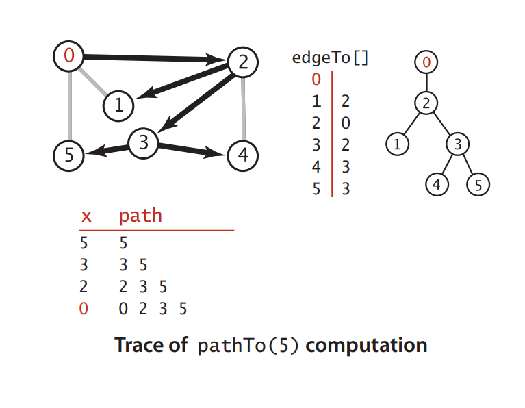
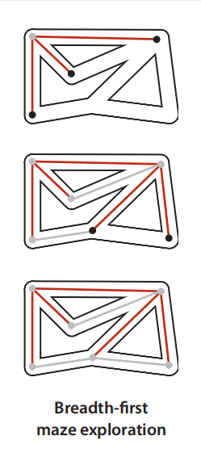
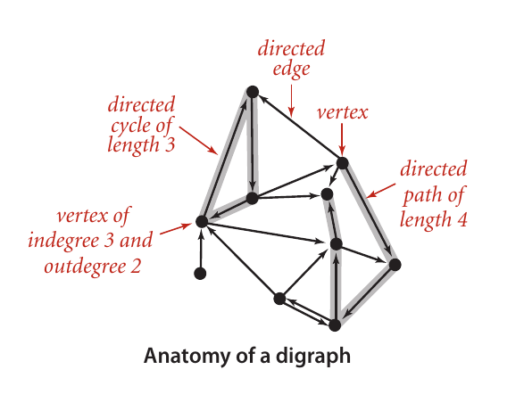
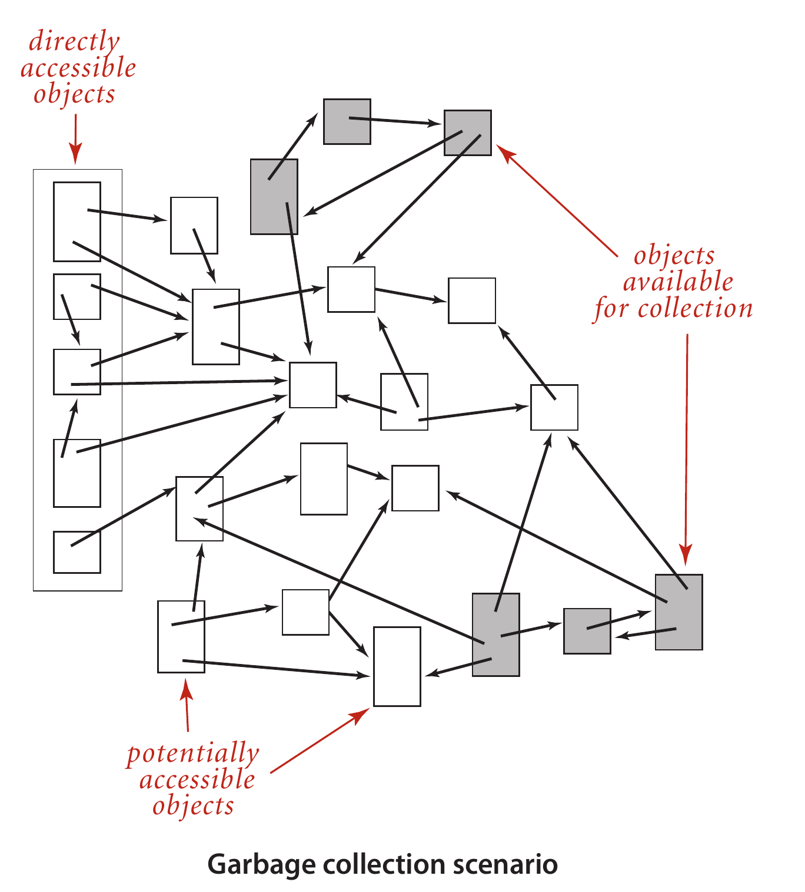

#  图

　　树的数据结构中，树的表示时分层的，例如父子关系，而其他关系只能间接的表示，例如同级关系。而图却不受这种限制。

　　图是由顶点（或节点）及顶点之间的关系组成的集合。通常，图中的顶点数量或者一个顶点与其他顶点之间的连线的个数不受限制。

## 定义

　　主要有以下两种定义。

1. 二元组定义

   图 G 是一个有序二元组（V,E），其中 V 称为顶集（Vertices Set），E 称为边集（Edges set），E 与 V 不相交。它们亦可携程 V(G) 和 E(G)。

   E 的元素都是二元组，用（x,y）表示，其中 x,y ∈ V。

2. 三元组定义

   图 G 是指一个三元组（V,E,I），其中 V 称为顶集，E 称为边集，E 与 V 不相交，I 称为关联函数，I 将 E 中的每一个元素映射到。如果 e 被映射到（u,v），那么称边 e 连接顶点 u、v，而 u、v 则称作 e 的端点，u、v 此时关于 e 相邻。同时，若两条边 i、j 有一个公共顶点 u，则称 i、j 关于 u 相邻。

1. 无向图：图是由一组顶点和一组能够将两个顶点相连的边组成的。

   

2. 有向图：由一组顶点和一组有方向的边组成，每条有方向的边都连接着有序的一对顶点。

   

　　图的分类其实很多，但是主要介绍的就是这两种分类。

## 图的术语

1. 相邻：如果两个顶点通过一条边相连，则称这两个顶点式相邻的，并称这条边依附于这两个顶点。
2. 度数：某个顶点的度数即为依附于它的边的总数。
3. 子图：一幅图的所有边的一个子集以及他们所依附的所有顶点组成的图。
4. 路径：由边顺序链接的一系列顶点。
5. 简单路径：一条没有重复顶点的路径。
6. 环：一条至少包含一条边且起点和终点相同的路径。
7. 简单环：除了第一个顶点和最后一个顶点之外，其余顶点不重复出现的环。
8. 连通图：任意两个顶点之间胡同。一副非连通的图由若干个连通的部分组成。
9. 图的密度：已连接的顶点对占所有可能被连接的顶点对的比例。
10. 平行边：连接同一对顶点的两条边称为平行边。
11. 二分图：图中的每一条边所连接的两个顶点都分别属于不同的部分，如下图所示：


## 无向图

### 图的存储方法

1. 邻接矩阵表示法

　　如果节点 a 与节点 b 之间相连接，则 A(a,b) = A(b,a) = 1，否则为 0。


2. 邻接表表示法

　　再邻接表表示法中，第一列代表的为节点，如 0、1、2......，而后面的则代表为节点与其他节点相连接的节点。

　　例如 0 节点后面为 1、4 节点，则代表 0 节点与 1 节点和 4 节点相连接。


3. 关联矩阵表示法

### 图表示方式的比较

　　两种各有优缺点。

1. 如果需要处理顶点 V 的邻接顶点，使用邻接表只需要 deg(v) 步操作（deg：图论中点连出的边数）。而在邻接矩阵中，需要进行 |V| 步操作。但是在需要插入或者删除一个邻接与 v 的接待你的时候，需要对邻接表进行调整，而对于邻接居住，只需要进行 0 和 1 的变换即可。
2. 邻接居住的空间复杂度是 O(V*V)，而邻接表的复杂度为 O(V+E)，V 为顶点数，E 为边数。

　　在最稠密的情况下（每一个节点都与其他节点相连接），邻接矩阵的空间复杂度会远远的小于邻接表（n! 和 n^2 不再一个数量级）。

3. 如果出现了平行边了，只能够使用邻接表去表示。

### 无向图的代码

　　一般会选择使用邻接表来进行数据储存。

　　抽象类的代码：

```

```

　　首先来实现较为简单的几个函数：

```

```


　　接下来需要实现的就是搜索函数了。

#### 深度优先搜索

　　深度优先搜索类似走迷宫，一条路走到黑，如果发现这条路走不通，就在前一个路口继续向前走。


　　可以通过 adj 函数得到节点的相邻节点，需要一个标志 mark，这个标志代表着这个节点是否已经被访问过了。

　　步骤如下：

* 将被访问的节点标记为已访问。
* 递归的访问它的所有没有被标记过的邻居节点。

```

```

　　从上面的代码可以知道，获得与 s 相同的节点，只需要对 dfs 进行递归即可。并将节点的 marked 标志设置为 true 即可。

　　现在就可以完善 search 函数了。

```

```

　　在上面的深度优先搜索的算法，其实还有一个应用，那就是寻找路口的问题，也就是说，通过深度优先蒜贩，可以知道 A 节点和 X 节点是否存在一条路径，如果有，则输出路径。

```

```

　　在上面的算法中，首先进行深度优先遍历将每个节点是否被遍历保存到 marked[] 数组中，然后，在 edgeTo[] 数组保存了进行深度遍历中被遍历节点的上一个节点，示意图如下图所示：



　　继续补上一些函数：

```

```

　　通过深度优先搜索，可以得到 s 节点的路径，深度优先搜索还有一个用法就是寻找出一幅图的所有连通分量。

```

```

　　在下图，有三个连通分量：


　　在深度优先搜索中，将深度优先搜索算法比喻成迷宫，它可以从一个节点走到另外一个节点（也就是寻找路径问题），但是如果需要去解决最短路径的问题，使用深度优先搜索就不能解决问题了，如果使用深度优先搜索，一条道走到 “ 黑 ”，有可能离开始节点最近的节点反而还可能最后遍历。但是广度优先遍历却可以解决这个问题。

#### 广度优先遍历

　　广度优先的算法在迷宫中类似这样：先遍历开始节点的相邻节点，然后按照与起点的距离的顺序来遍历所有的顶点。在前面的深度优先遍历中，使用了隐式的栈【LIFO】（递归）来进行保存节点，而在广度优先遍历中，将使用显式的队列（FIFO）来保存节点。



　　进行广度优先遍历的算法步骤如下：

　　先将起点加入队列，然后重复以下步骤：

* 取队列中的下一个顶点 v 并标记它
* 将与 v 相邻的所有未被标记过的节点加入队列

```

```

　　对于从 s 可达的任意顶点 v，广度优先搜索都能找到一条从 s 到 v 的最短路径。

　　下面是广度优先遍历的情况图：


　　　如何使用广度优先搜索或者深度优先搜索解决下面两个问题：

1. 图 G 是无环图吗？（假设不存在自环或者平行边）

   可以这样思考：在进行搜索的时候，如果 A 节点的邻居节点 B 已经被标记了，但是如果在 B 节点中，它的邻居节点 C 已经被标记了，但是如果邻居节点 C 并不是节点 A，那么这幅图就是一个有环图。

   道理很简单，通过一个已经被标记的节点，肯定可以通过该节点回到起点 s，那么 C 节点有一条路径回到起点，A 节点也有一条路径回到起点，而 B 节点将 A 和 C 节点连接起来了，形成了一个环。

2. 图 G 是二分图吗？

   和第一个问题很类似，在 C 节点中，如果 C 节点的颜色不和 A 节点一样（则和 B 节点一样），那么该节点一定不会是一个二分图。　　

## 有向图

　　在有向图中，边是单边的，也就是说，边是由一个节点指向另外一个节点，两个节点的邻接性事单向的。在一副有向图中，一个顶点的出度为该顶点指出的边的总数，入度为指向该顶点的边的总数。

　　在一幅有向图中间存在 4 种关系：

```
A->B,A<-B，A B(没有边相连接)，A->B A <- B
```

* 有向路径：由一系列顶点组成，对于其中的每一个顶点都存在一条有向边从它指向序列中的下一个顶点。
* 有向环：为一条至少包含一条边且起点和终点相同的有向路径。

　　有向图详解：



　　在有向图中，对代码需要进行一些改变，在 addEdgeo 函数中，不再是添加 2 条边，而是只是添加一条边，同时添加一个 reserve 函数，目的是将边的方向进行翻转。

```

```

### 路径问题

　　在无向图中，研究科节点的可达性，使用深度优先算法来探究两个节点是否可达，而在有向图中，单点可达性：是否存在一条从 s 到达给定顶点 v 的有向路径。

```

```

　　在 Java 虚拟机中，使用了可达性分析算法来判断一个对象是否已经死亡。在下图中灰色的方块代表的是可以被回收的对象。



　　同样，在无向图中，可以通过搜索来找出节点之间的路径，以及通过广度优先搜索来找出最短路径，同样，在有向图中同样能够做到这样。同样，在算法中，和前面的无向图之前的算法一样，没什么改变。

### 调度问题

　　一种应用广泛的魔性就是给定一组任务并安排它们的执行顺序，其中顺序会有限制条件取限制（例如任务的执行的开始时间，也可能是任务的时耗）。其中最重要的一种条件叫优先级限制。

　　在优先级限制中，明确的指明了哪些任务必须在哪些任务之前完成，在有向图中，优先级限制下的调度问题等价于下面的问题：

　　**拓扑排序**：给定一幅有向图，将所有的顶点排序，使得所有的有向边均从排在前面的元素指向排在后面的元素（或者说明无法做到这一点）。

　　在下面的图是一个有向图进行拓扑排序后的结果：


　　必须明确任务的先后关系，那么如果任务关系形成了环状，比如说 A 要在 B 之前完成，B 要在 C 之前完成，但是 C 要在 A 之前完成，那么这个问题肯定是无解的。所以，在进行拓扑排序之前得先判断有向图中间是否有环（也就是说优先级限制下得调度问题等价于计算有向无环图得所有 a 丁丁的拓扑排序）。

```

```

　　onStack 数组的作用：在无向图中如果查找一个图中是否存在一个环：通过查看节点的下一个节点是不是被标记的来判断的。之所以这样是因为无向图是双向导通的，必然可以根据被标记的点回去，但是有向图是不行的，因为有向图是单向导通的。并不能他哦那个过已经被标记的节点又回到起点。因此，onStack 的作用就在这个地方。当某节点 A 的邻居节点的 onStack 为 true 的时候，说明该邻居节点正处于递归的过程中，则该邻居节点能够通过递归得到节点 A。而当 onStack 为 false 的时候则说明该邻居节点不能通过递归回到节点 A。

　　实际上深度优先搜索也算得上是一种拓扑排序。在深度优先搜索中，能够保证每个顶点的访问顺序必定会符合拓扑排序的规律。

　　根据递归的情况，下面有 3 种排序的规律：

* 前序：在递归调用之前将顶点加入队列
* 后序：在递归调用之后将顶点加入队列
* 逆后序：在递归调用之前将顶点压入栈

　　有向图中基于深度优先搜索的顶点排序：

```

```

　　而在其中逆后续排序便是拓扑排序了。

### 强连通性

　　在有向图中，边是单向的。但是如果两个顶点是互相可达（类似无向图）的，就称它们是强连通的。如果一幅图中的任意两个顶点都是强连通的，就称这幅图是强连通的。

　　两个顶点式强连通的当且仅当它们都在一个普通的有向环中。在环中，两个节点都是互相可达的。

　　连通性有下面 3 个性质：

1. 自反性：任意顶点和自己是强连通的
2. 传递性：v 和 w 是强连通，w 和 x 是强连通，则 v 和 x 是强连通的
3. 对称性：v 和 w 是强连通，则 w 和 v 也是强连通的。

### 强连通分量


## 最小生成树（无向图）


## 参考文章

1. [数据结构之图（内含Java代码实现）](https://blog.csdn.net/qq_41701956/article/details/99588446)

2. [数据结构--图--知识点总结](https://blog.csdn.net/void_worker/article/details/80720466)

