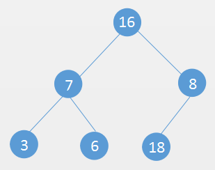
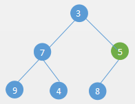
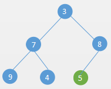
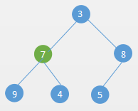

#  堆

　　优先队列通常是使用二叉堆来实现的，接下来先介绍一下二叉堆。

## 二叉堆的基本概念

　　二叉堆（binary heap）是一个由二叉树组织的堆数据结构。二叉堆是 J.W.J.Williams 于 1964 提出的用于堆排序的数据结构。

　　一个二叉堆需要满足以下两个特性：

1. 二叉堆是一个完全二叉树。完全二叉树通俗点来说就是在一棵二叉树上从左到右一层一层的排列数据。

   完全二叉树是一个平衡二叉树，但平衡二叉树不一定是完全二叉树。

2. 二叉树的节点大于等于或小于它的子节点。

　　二叉堆分类：

1. 如果二叉堆的节点大于等于它的子节点，那么这个二叉堆是一个大顶堆（max-heap）。
2. 而若二叉堆的节点小于等于它的子节点，那么这个二叉堆是一个小顶堆（min-heap）。

　　二叉堆是一个完全二叉树，所以可以很方便地通过数组来存储数据。

　　如果二叉堆的顶部元素的索引从 0 开始：

* 获取某个索引的父节点索引公式为：(index-1)/2
* 获取某个索引的左子节点索引公式为：index*2+1
* 获取某个索引的右子节点索引公式为：index*2+2

　　如果二叉堆的顶部元素的索引从 1 开始：

* 获取某个索引的父节点索引公式为：index/2
* 获取某个索引的左子节点索引公式为：index*2
* 获取某个索引的右子节点索引公式为：index*2+1

## 二叉堆的基本操作

### 插入（Insert）

　　执行插入操作需要对二叉堆执行 siftUp 操作（也称为 bubble-ip、percolate-up、up-heap、trickle-up、heapify-up、cascade-up），下面以大顶堆为例图解下 siftUp 的流程 ：

　　假如有一个如下的二叉堆：


　　向该二叉堆插入一个元素 18：



　　插入后发现当前的二叉树不符合二叉堆的特性，所以需要对 18 和 8 两个元素交换位置。


　　交换位置后还是不符合二叉堆的特性，需要对 18 和 16 交换位置：


　　当前的二叉树就符合二叉堆的性质了，这样就完成了整个 siftUp 操作。

　　据上所述，siftUp 操作就是现在二叉堆尾部添加元素，然后新插入的元素和父节点对比，如果不符合二叉堆特性久可父节点交换位置，然后让交换后的位置继续和它的父节点对比，直到符合二叉堆的特性。

### 移除堆顶元素（Extract）

　　移除堆顶元素需要对二叉堆进行 siftDown 操作（也称为 bubble-down、percolate-down、sift-down、trickle-down、heapity-down、cascade-down、extract-min/max）。

　　依然以上面的大顶堆为例：


　　使用二叉树的最后一个节点 8 替换二叉树的根节点 18（要删除的节点）：


　　新的根节点和它的子节点对比，看是否符合二叉堆的性质，发现根节点没有它的右子节点大，与其交换位置：


　　到此，当前二叉树就符合二叉堆的性质了，这就是整个 siftDown 过程。

　　据上所述，siftDown 操作是让新的根节点往下和它的左右节点对比，如果不符合二叉堆特性则交换位置，然后让交换后的位置继续和它的左右子节点对比，直到符合二叉堆的特性。

### 数组转成二叉堆（Heapify）

　　把一个数组转成二叉堆有两种方法：

1. 对每个元素 add 进二叉堆
2. 堆数据进行 heapify 操作

　　堆每个元素 add 进二叉堆很简单，只要遍历数据，然后调用二叉堆的 add 方法即可。

　　heapify 操作主要是把数组当成二叉堆，然后对二叉堆的非叶子节点（从二叉堆的最后一个非叶节点开始）进行 siftDown 操作。

　　假设有一个数组 [3,7,5,9,4,8]，需要对其转成二叉堆（大顶堆）：


　　从最后一个非叶子节点开始对其 siftDown 操作：



　　发现 5 比 8 小，交换位置：



　　然后对倒数第二个非叶子节点进行 siftDown 操作：



　　发现 7 比 9 小，交换位置：


　　最后对倒数第三个非叶子结点 siftDown 操作：


　　发现 3 比 9 小，交换位置：


　　交换位置后，发现 3 比 7 小，继续交换位置：


　　最终完成了 heapify 操作。

## 构建大顶堆和小顶堆

```

```

　　下面是一组对一个数组进行 heapify 操作和对数组的元素一个个 add 进二叉堆的性能对比：

```

```

　　实现大顶堆和小顶堆的主要逻辑是一样的，主要在大顶堆的基础上对 siftUp 和 siftDown 的时候判断条件改下即可。例如如果是要构成小顶堆。siftDown 的条件是当前结点比父节点小；siftDown 的条件是当前结点比它的子节点要大。

## 优先队列的基本概念

　　优先队列首先也是一个队列。普通的队列是先进先出，优先队列不一样，优先队列出队的时候让优先级高的先出队。然后，也可以把普通的队列当做一个优先队列来看，先入队的优先级高。

　　这样的话，可以通过二叉堆来很方便的实现一个优先队列。

## 实现一个优先队列

　　上面实现了二叉堆，基于二叉堆可以非常方便的实现优先队列。

```

```

　　上面是通过一个大顶堆来实现一个优先队列，当然也可以通过小顶堆来实现一个优先队列。优先级这个可以人为的来定。比如有一个关于学生的优先队列，学生的成绩高先出队。

　　如果是大顶堆的话，定义成绩高的优先级高。

　　如果用小顶堆的话，定义成绩高的反而优先级低，这样的话在 siftDown 和 siftUp 的时候能让成绩高的在顶堆。

## Java PriorityQueue 源码分析

　　Java 里的 PriorityQueue 也是基于二叉堆实现的，和上面的实现方式很像。如果已经掌握了上面的二叉堆，对于 Java PriorityQueue 的掌握是很简单的，没有特别简单阐明的技术点。

　　主要也是构造方法中队集合进行 heapify 操作：

```java
public PriorityQueue(Collection<? extends E> c) {
	//如果是已经排好序的 Set
	if (c instanceof SortedSet<?>) {
		SortedSet<? extends E> ss = (SortedSet<? extends E>) c;
		this.comparator = (Comparator<? super E>) ss.comparator();
		initElementsFromCollection(ss);
	}
	//如果参数本身就是 PriorityQueue
	else if (c instanceof PriorityQueue<?>) {
		PriorityQueue<? extends E> pq = (PriorityQueue<? extends E>) c;
		this.comparator = (Comparator<? super E>) pq.comparator();
		initFromPriorityQueue(pq);
	}
	//其他情况均通过 heapify 初始化数据
	else {
		this.comparator = null;
		initFromCollection(c);
	}
}

private void initFromCollection(Collection<? extends E> c) {
	initElementsFromCollection(c);
	heapify(); //heapify 操作
}
```

　　在插入的时候执行 siftUp 操作：

```java
public boolean offer(E e) {
	if (e == null)
		throw new NullPointerException();
	modCount++;
	int i = size;
	if (i >= queue.length)
		grow(i + 1);
	size = i + 1;
	if (i == 0)
		queue[0] = e;
	else
		siftUp(i, e); //siftUp 操作
	return true;
}
```

　　删除的时候执行 siftDown 操作：

```java
public E poll() {
	if (size == 0)
		return null;
	int s = --size;
	modCount++;
	E result = (E) queue[0];
	E x = (E) queue[s];
	queue[s] = null;
	if (s != 0)
		siftDown(0, x); //siftDown 操作
	return result;
}
```

　　需要注意的是 Java PriorityQueue 默认是一个小顶堆（按自然排序）。

　　上面实现的二叉堆要么是大顶堆，要么是小顶堆，Java PriorityQueue 支持传递比较器，所以它支持通过定制比较器（Comparator），把 Java PriorityQueue 构造成一个大顶堆，这样更加灵活的定制优先级。

## 参考文章

14. [数据结构与算法（六）二叉堆、优先队列和 Java PriorityQueue](https://chiclaim.blog.csdn.net/article/details/80550279)

