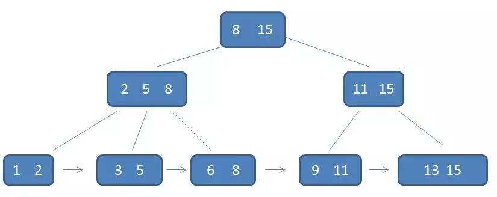
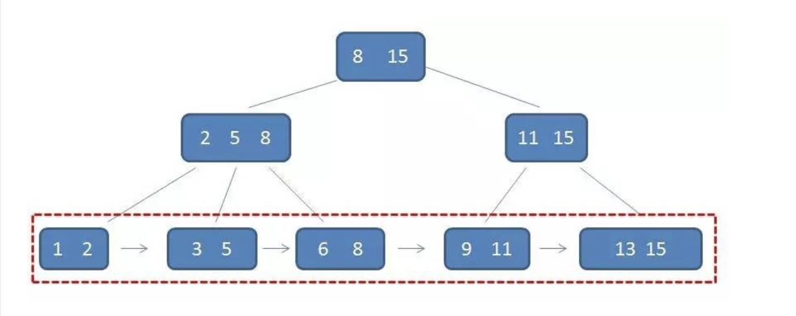
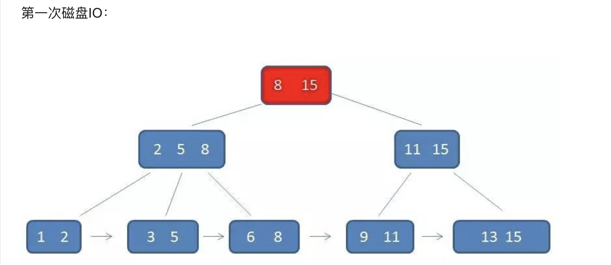
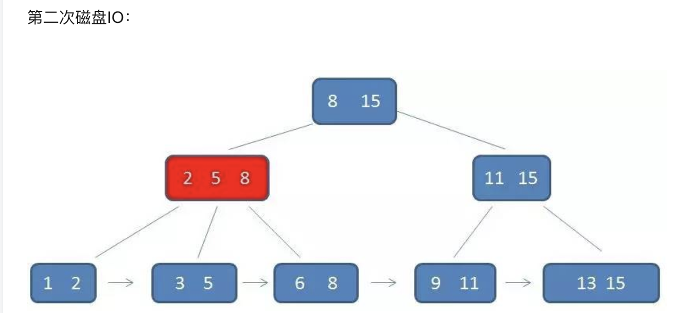
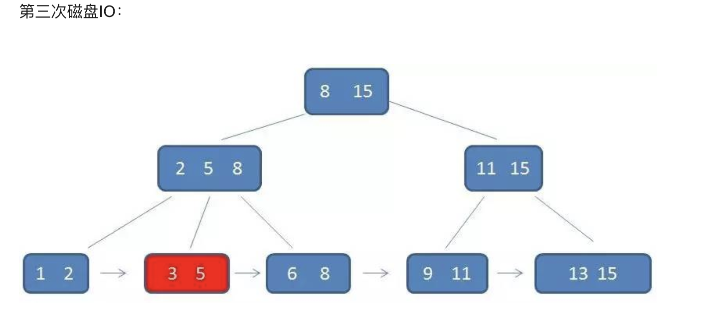
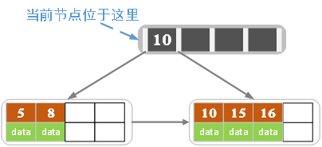
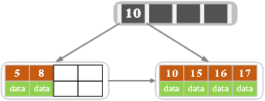

#  B+ 树

## 概念

　　B+ 是 B 树的一个升级版，相对于 B 树来说 B+ 树更充分的利用了节点的空间，让查询速度更加稳定，其速度完全接近于二分法查找。B+ 树查找的效率要比 B 树更高、高稳定。

## 规则

1. B+ 跟 B 树不同，B+ 树的非叶子节点不保存关键字记录的指针，只进行数据索引，这样使得 B+ 树每个非叶子节点所能保存的关键字大大增加。
2. B+ 树叶子节点保存了父节点的所有关键字记录的指针，所有数据地址必要要到叶子节点才能获取到。所以每次数据查询的次数都一样。
3. B+ 树叶子节点的关键字从小到大有序排列，左边结尾数据都会保存右边节点开始数据的指针。
4. 非叶子节点的子节点数=关键字数（来源百度百科）（这里有两种算法实现方式，另一种为非叶子节点的关键字数=子节数-1（来源维基百科），虽然他们数据排列结构不一样，但其原理还是一样的，Mysql 的 B+ 树是用第一种方式实现）。

　　百度百科算法结构示意图：

　　维基百科算法结构示意图：

## B+ 树特征

　　B+ 树是一种树数据结构，是一个 n 叉树，每个节点通常有多个孩子，一棵 B+ 树包含根节点、呢不节点和叶子节点。B+ 树通常用于数据库和操作系统的文件系统中。B+ 树的特点是能够保持数据稳定有序，其插入与修改拥有较稳定的对数时间复杂度。B+ 树元素自底向上插入。

　　一个 m 阶的 B 树具有如下几个特征：

1. 根节点至少有两个子女。
2. 每个中间节点都至少包含 ceil(m/2) 个孩子，最多有 m 个孩子。
3. 每一个叶子节点都包含 k-1 个元素，其中 m/2 <= k <= m。
4. 所有的叶子节点都位于同一层。
5. 每个节点中的元素从小到大排列，节点当中 k-1 个元素正好是 k 个孩子包含的元素的值域分划。

　　在本例中每一个父节点都出现在子节点中，是子节点最大或者最小的元素。而下面的例子中存在如果父节点促成农户的为子节点最小值，那么便步需要存储每一个子节点的内容。例如子节点 5、8 --> 10、15 --> 16、17、18 意味着父节点存 16 与 18 即可。而同样的例子如果父节点存最大值，那么便需要存 8、15、18。

　　在这里，根节点中最大的元素是 15，也就是整个树中最大的元素。以后无论插入多少元素要始终保持最大元素在根节点当中。

　　每个叶子节点都有一个指针，指向下一个数据，形成一个有序链表。

1. B+ 树的层级更少：相较于 B 树，B+ 树每个非叶节点存储的关键字更多，树的层级更少，所以查询数据更快。
2. B+ 树查询速度更稳定：B+ 树所有关键字数据地址都存在叶子节点上，所以每次查找的次数都相同所以查询速度要比 B 树更稳定。
3. B+ 树天然具备排序功能：B+ 树所有的叶子节点数据构成了一个有序链表，在查询大小区间的数据时候更方便，数据紧密型很高，缓存的命中率也会比 B 树高。
4. B+ 树全节点遍历更快：B+ 树遍历整棵树只需要遍历所有的叶子节点即可，而不需要像 B 树一样需要对每一层进行遍历，这有利于数据库做全表扫描。

　　B 树相对于 B+ 树的优点是，如果经常访问的数据离根节点很近，而 B 树的非叶子节点本身存有关键字其数据的地址，所以这种数据检索的时候会要比 B+ 树快。

## B+ 树与 B 树的区别

1. 有 k 个子节点的节点必然有 k 个关键码。
2. 非叶节点仅具有索引作用，跟记录有关的信息均存放在叶节点中。
3. 树的所有叶节点构成一个有序链表，可以按照关键码排序的次序遍历全部记录。

## B+ 树的查询操作

　　在单与查询的时候，B+ 树会自顶向下追层查找，最终找到匹配的叶子节点。

　　比如查找 3：

　　而 B+ 树中间节点没有 Data 数据，所以同样大小的磁盘页可以容纳更多的节点元素。所以数据量相同的情况下，B+ 树比 B 树更加 “ 矮胖 ”，因此使用的 IO 查询次数更少。

　　由于 B 树的查找并不稳定（最好的情况诗查询根节点，最坏查询叶子节点）。而 B 树每一次查找都是稳定的。

　　比如 B 树， B+ 树：

1. IO 次数更少
2. 查询性能很稳定
3. 范围查询更简便

## B+ 树的插入操作

1. 若为空树，那么创建一个节点并将记录插入其中，此时这个叶子节点也就是根节点，插入操作结束。

　　此处的图片中例子的阶数为 5。

　　空树中插入 5：

2. 针对叶子类型节点：根据 key 找到叶子节点，向这个叶子节点插入记录。插入后，若当前节点 key 的个数小于等于 m-1（5-1=4），则插入结束。否则将这个叶子节点分裂成左右两个叶子节点，左叶子节点包含前 m/2 个（2 个）记录，右节点包含剩下的记录，将第 m/2+1 个（3 个）记录的 key 进位到父节点中（父节点一定是索引类型节点），进位到父节点的 key 左孩子指针向左节点，右孩子指针向右节点。将当前节点的指针指向父节点，然后执行第 3 步。

　　依次插入 8、10、15。

　　插入 16。

　　插入 16 后超过了关键字的个数限制，所以要进行分裂。在叶子节点分裂时，分裂出来的左节点 2 个记录，右边 3 个记录，中间第三个数成为索引节点中的 key(10)，分裂后当前节点指向了父节点（根节点）。结果如下图所示。

3. 针对索引类型节点：若当前节点 key 的个数小于等于 m-1(4)，则插入结束。否则，将这个索引类型节点分裂成两个索引节点，左索引节点包含前（m-1）/2 个 key（2 个），右节点包含 m-(m-1)/2 个 key（3 个），将第 m/2 个 key 进位到父节点中，进位到父节点的 key 左孩子指向左节点，进位到父节点的 key 右孩子指向右节点。将当前节点的指针指向父节点，然后重复第 3 步。

　　插入 17：

　　插入 18，插入后如下图所示：

　　当前节点的关键字个数大于 5，进行分裂。分裂成两个节点，左节点 2 个记录，右节点 3 个记录，关键字 16 进位到父节点（索引类型）中，将当前接待你的指针指向父节点。

　　插入若干数据后：

　　在上图中插入 7，结果如下图所示：

　　当前节点的关键字个数查过 4，需要分裂。左节点 2 个记录，右节点 3 个记录。分裂后关键字 7 进入到父节点中，将当前节点的指针指向父节点，结果如下图所示：

　　当前节点的关键字个数超过 4，需要继续分裂。左节点 2 个关键字，右节点 2 个关键字，关键字 16 进入到父节点中，将当前接待你指向父节点，结果如下图所示：

　　当前节点的关键字个数满足条件，插入结束。

## B+ 树的删除操作

　　下面是一颗 5 阶 B 树的删除过程，5 阶 B 树的结点最少 2 个 key，最多 4 个 key。

　　如果叶子节点中没有对应的 key，则删除失败，否则执行下面的步骤。

1. 删除叶子结点中对应的 key。删除后若节点的 key 的个数大于等于 Math.ceil(m/2)-1（>=2），删除操作结束，否则执行第 2 步。

　　初始状态：

　　删除 22，删除后结果如下图：

　　删除后叶子节点中 key 的个数大于等于 2，删除结束。

2. 若节点的 key 的个数小于 Math.ceil(m/2)-1（<2），且兄弟节点 key 有富余（大于 Math.ceil(m/2)-1）（>2），向兄弟节点借一个记录，同时用借到的 key 替换父节点（指当前节点和兄弟接待你共同的父节点）中的 key，删除结束。否则执行第 3 步。

　　删除 15 ，删除后得结果如下图所示：

　　删除后当前节点只有一个 key，不满足条件，而兄弟节点有三个 key，可以从兄弟节点借一个关键字为 9 得记录，同时更新将父节点中得关键字由 10 也变为 9，删除结束。

3. 若节点的 key 的个数小于 Math.ceil(m/2) -1（< 2），且兄弟节点中没有富余的 key（小于 Math.ceil(m/2)-1），则当前节点和兄弟节点合并成一个新的叶子节点，并删除父节点中的 key，将当前节点指向父节点（必为索引节点），执行第 4 步（第 4 步以后的操作和 B 树就完全一样了，主要是为了更新索引节点）。

　　删除 7，删除后的结果如下图所示：

　　当前节点关键字个数小于 2，（左）兄弟节点中也没有富余的关键字（当前节点还有个兄弟，不过选择任意一个进行分析就可以，这样选择了左边的），所以当前节点和兄弟节点合并，并删除父节点中的 key，当前节点指向父节点。

4. 若索引节点的 key 的个数大于等于 Math.ceil(m/2)-1（>=2），则删除操作结束。否则执行第 5 步。
5. 若兄弟节点有富于，父节点 key 下移，兄弟节点 key 上移，删除结束。否则执行第 6 步。
6. 当前节点和兄弟节点及父节点下移 key 合并成一个新的节点。将当前节点指向父节点，重复第 4 步。

　　此时当前节点的关键字个数小于 2，兄弟接待你的关键字也没有富余，所以父节点中的关键字下移，和两个孩子节点合并，结果如下图所示：

　　注意，通过 B+ 树的删除操作后，索引节点中存在的 key，不一定在叶子节点中存在对应的记录。

## B* 树

### 规则

　　B* 树是 B+ 树的变种，相对于 B+ 树，他们的不同之处如下：

1. 首先是关键字个数限制问题，B+ 树初始化的关键字初始化个数是 ceil(m/2)，B* 树的初始化个数为 (cei(2/3*m))。
2. B+ 树节点满时就会分裂，而 B* 树节点满时会检查兄弟节点是否满（因为每个节点都有指向兄弟的指针），如果兄弟节点未满则向兄弟节点转移关键字，如果兄弟节点已满，则从当前接待你和兄弟节点各拿出 1/3 的数据创建一个新的节点出来。

### 特点

　　在 B+ 树的基础上因其初始化的容量变大，使得节点空间使用率更高，而又存在兄弟节点的指针，可以向兄弟节点转移关键字的特性使得 B* 树分解次数变得很少。

## 总结

1. 相同思路和策略

   从平衡二叉树、B 树、B+ 树、B* 树总体来看它们的贯彻的思想是相同的，都是采用二分法和数据平衡策略来提升查找数据的速度。

2. 不同的方式的磁盘空间利用

   不同点是他们一个一个在演变的过程中通过 IO 从磁盘读取数据的原理进行一步步的演变，每一次演变都会为了让节点的空间更合理的引用起来，从而使树的层级减少达到快速查找数据的目的。

## 参考文章

2. [B+树总结](https://www.jianshu.com/p/71700a464e97)

3. [平衡二叉树、B树、B+树、B*树 理解其中一种你就都明白了](https://zhuanlan.zhihu.com/p/27700617)