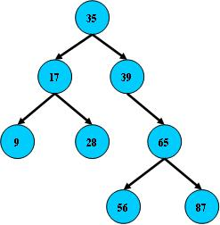
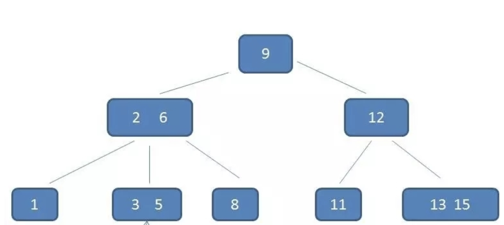
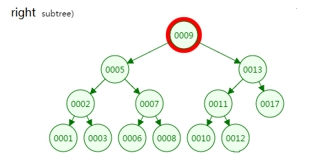
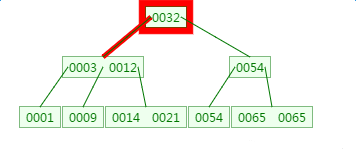
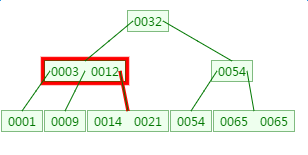
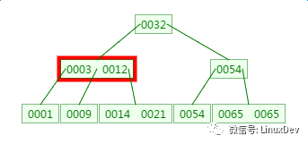
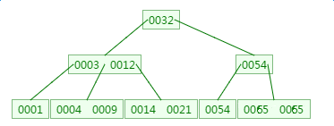

#  B树

## B 树基本概念

　　为什么要引入 B 树，二叉树不是很好吗？存在即合理，所以有存在的理由。B 树的时间复杂度与二叉树一样，均为 O(logN)。然而 B 树出现时因为磁盘 IO。IO 操作的效率很低，那么，当在大量数据存储中，查询时不能一下子把所有数据加载到内存中，只能逐一加载磁盘也，每个磁盘页对应树的节点。造成大量磁盘 IO 操作（最坏情况下为树的高度）。平衡二叉树由于树深度过大而造成磁盘 IO 读写过于频繁，进而导致效率低下。

　　为了减少磁盘 IO 的次数，就必须降低树的深度，将 “瘦高” 的树变得 “矮胖”。

　　B 树这种数据结构常常用于实现数据库索引，因为它的查找效率比较高。

### 磁盘 IO 与预读

　　磁盘读取依靠的是机械运动，分为寻道时间、旋转延迟、传输时间三个部分，这三个部分耗时相加就是依次磁盘 IO 的时间，大概 9ms 左右。这个成本是访问内存的十万倍左右；正是由于磁盘 IO 是非常昂贵的操作，所以计算机操作系统对此做了优化：预读；每一次 IO 时，不仅仅把当前磁盘地址的数据加载到内存，同时也把相邻数据页加载到内存缓冲区中。因为局部预读原理说明：当访问一个地址数据的时候，与其相邻的数据很快也会被访问到。每次磁盘 IO 读取的数据称之为一页（page）。一页的大小与操作系统有关，一般为 4K 或者 8K。这也就意味着读取一页数据的时候，实际上发生了一次磁盘 IO。

### B-Tree 与二叉查找树的对比

　　二叉查找树查询的时间复杂度是 O(logN)，查找速度最快和比较次数最少，既然性能已经如此优秀，但为什么实现索引是使用 B-Tree 而不是二叉查找树，关键因素是磁盘 IO 的次数。

　　数据库索引是存储在磁盘上，当表中的数据量比较大时，索引的大小也跟着增长，达到几个 G 甚至更多。当利用索引仅从查询的时候，不可能把索引全部加载到内存中，只能逐一加载每个磁盘页，这里的磁盘页就对应索引树的结点。

　　二叉树：

　　B 树：

#### 二叉树

　　二叉树以 2 为最大基准向下延伸，而 B 树则没有标准，所以它可以变得矮矮胖胖的。

　　B 树又叫平衡多路查找树。一棵 m 阶的 B 树（m 叉树）的特性如下：

* B 树中所有节点的孩子节点数中的最大值称为 B 树的阶，记为 M（重点）
* 树中的每个节点至少有 M 棵子树 - 即：如果定了 M，则这个 B 树中任何节点的子节点数量都不能超过 M。
* 若根节点不是终端节点，则至少有两棵子树。
* 除根节点和叶节点外，所有点至少有 m/2 棵子树（上溢）
* 所有的叶子节点都位于同一层。（比如上面的图片中没有了 11 13 15，那么 12 就没有存在的意义了，就需要调整整个树的布局）

　　二叉树查找时磁盘 IO 的次：定义一个树高为 4 的二叉树，查找值为 10：

　　第一次磁盘 IO：

　　第二次磁盘 IO：

　　第三次磁盘 IO：

　　第四次磁盘 IO：

　　从二叉树的查找过程来看，树的高度和磁盘 IO 的次数都是 4，所以最坏的情况下磁盘 IO 的次数由树的高度来决定。

　　从前面分析情况来看，减少磁盘 IO 的次数就必须要压缩树的高度，让瘦高的树尽量变成矮胖的树，所以 B-Tree 就在这样的背景下诞生了。

#### B-Tree

　　m 阶 B-Tree 满足以下条件：

1. 每个节点最多拥有 m 个子树
2. 根节点至少有 2 个子树
3. 分支节点至少拥有 m/2 棵子树（除根节点和叶子节点外都是分支节点）
4. 所有叶子节点都在同一层、每个节点最多可以有 m-1 个 key，并且以升序排列

　　如下有一个 3 阶的 B 树，观察查找元素 21 的过程：

　　第一次磁盘 IO：

　　这里有一次内存比对：分别跟 3 和 12 比对。

　　第二次磁盘 IO：

　　第三次磁盘 IO：

　　这里有一次内存比对，分别跟 14 与 21 比对。

　　从查找过程中发现，B 树的比对次数和磁盘 IO 的次数与二叉树相差不了多少，所以这样看来并没有什么优势。

　　但是仔细一看会发现，比对是在内存中完成的，不涉及到磁盘 IO，耗时可以忽略不计。另外 B 树中一个节点中可以存放很多的 Key（个数由树阶决定）。

　　相同数量的 key 在 B 树种生成的节点要远远少于二叉树中的节点，相差的节点数量就等同于磁盘 IO 的次数。这样到达一定数量后，性能的差异就显现出来了。

## B 树的新增

　　新增元素 4，它应该在 3 与 9 之间：

## B 树的删除

　　删除元素 9：

## 总结

　　插入或者删除元素都会导致节点发生裂变反应，有时候会非常麻烦，但正因为如此才让 B 树能够始终保持多路平衡，这也是 B 树自身的一个优势：自平衡；B 树主要应用于文件系统以及部分数据库索引，如 MongoDB，大部分关系型数据库索引则是使用 B+ 树实现。

## 参考文章

1. [B树详解](https://www.jianshu.com/p/a858bb15cbf0)
2. [B-Tree与二叉查找树的对比](http://m.elecfans.com/article/662237.html)
3. [平衡二叉树、B树、B+树、B*树 理解其中一种你就都明白了](https://zhuanlan.zhihu.com/p/27700617)