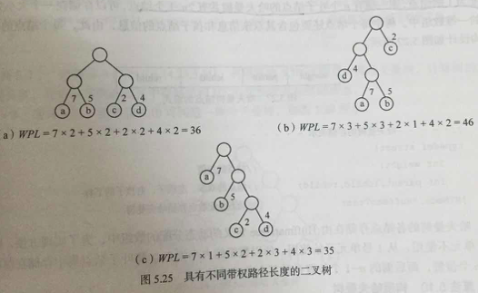
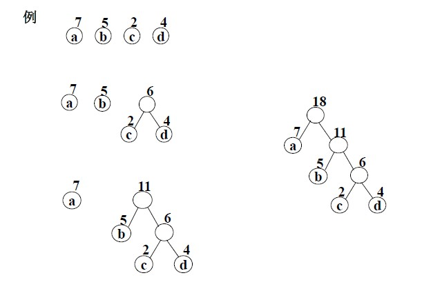
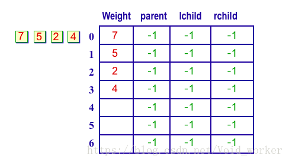
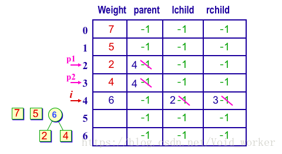
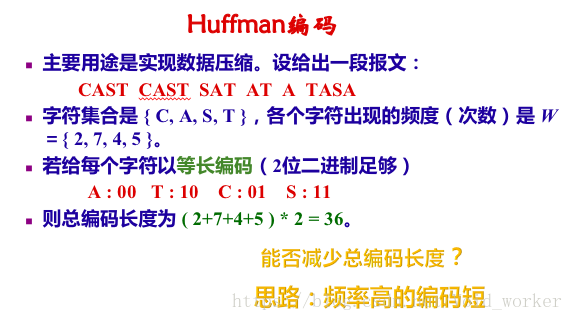

#  Huffman 树

## 1. 概述

　　哈夫曼树又称最优树，是一类带权路径长度最短的树。

　　路径：从树种一个节点到另一个节点之间的分支构成这两个节点之间的路径。

　　路径长度：从树根到每一节点的路径之和。

　　权：赋予某个实体的一个量，是对实体的某个或某些属性的数值描述。在数据结构中，实体有节点（元素）和边（关系）两大类，所以对应有节点权和边权。

　　节点的带权路径长度：从该节点到树根之间的路径长度与节点上权的乘积。

　　树的带权路径长度：树中所有叶子节点的带权路径长之和。

　　哈夫曼树：假设有 m 个权值 {w1,w2,w3,...,wm}，可以构造一棵含有 n 个叶子节点的二叉树，每个叶子节点的权为 wi，则其中带权路径长度 WPL 最小的二叉树称作最优二叉树或哈夫曼树。



* 两个结点之前的路径长度 PL 是连接两结点的路径上的分支树。
* 树的外部路径长度是各叶结点（外结点）到根结点的路径长度之和 EPL。
* 树的内部路径长度是各非叶结点（内结点）到根结点的路径长度之和 IPL。
* 树的路径长度 PL = EPL+IPL。


* 带权路径长度达到最小的扩充二叉树即为 Huffman 树。
* 在 Huffman 树种，权值大的结点离根最近。

## 2. 哈夫曼树的构造算法

　　构造 Huffman 树的方法：Huffman 算法。

　　构造 Huffman 树步骤：

1. 根据给定的 n 个权值 {w1,w2,...,wn}，构造 n 棵只有根节点的二叉树，令其权值为 wj。
2. 在森林种选取两颗根节点权值最小的树作左右子树，构造一棵新的二叉树，置新二叉树根节点权值为其左右子树根节点权值之和。
3. 在森林种删除这两棵树，同时将新得到的二叉树加入森林中。
4. 重复上述两步，直到只含一棵树为止，这棵树即哈夫曼树。



### 5.2. Huffman 树的合并过程


### 5.3.  Huffman 树的存储

　　可以采用静态链表方式存储 Huffman 树。





### 5.4. 最佳判定树

* 利用 Huffman 树，可以在构造判定树（决策树）时让平均判定（比较）次数达到最小。
* 判定树是一颗扩展二叉树，外结点是比较结果，内结点是比较过程，外结点所带权值是概率。

### 5.5. Huffman 编码



　　用途：实现数据压缩。


## 哈夫曼树的实现

　　由于哈夫曼树中没有度为 1 的节点，则一棵中有 n 个叶子节点的哈夫曼树共有 2n-1 个节点，可以存储在一个大小为 2n-1 的一维数组中。

　　哈夫曼的个节点存储由 HuffmanTree 定义的动态分配的数组中，为了实现方便数组的 0 号单元不适用，从 1 号单元开始使用，所以数组的大小为 2n。将叶子节点集中存储在前面部分的 1~n 个为止，而后 n-1 个为止存储其余非叶子节点。

　　初始化：首先动态申请 2n 个单元，然后循环 2n-1 次，从 1 号单元开始，一次将 1 至 2n-1 所有单元中的双亲、左孩子、右孩子的下标初始化为 0，最后再循环 n 次，输入前 n 个单元中叶子的权值。

　　创建树：循环 n-1 次，通过 n-1 次选择、删除与合并来创建哈夫曼树。选择是从当前森林中选择双亲为 0 且权值最小的两个根节点 s1 和 s2。删除是指节点 s1 和 s2 的双亲改为非 0。合并就是将 s1 和 s2 的权值和作为一个新节点的权值依次存入到数组中的第 n+1 之后的单元中，同时记录这个新节点左孩子的下标 s1，右孩子的下标 s2。

```java
/**
 * 哈夫曼树
 *
 * @param <T>
 */
public class HuffmanTree<T extends Comparable<T>> {

    /**
     * 使用数组存储哈夫曼树
     */
    private HTNode[] nodes;

    public static class HTNode<T> {
        T value; // 节点的值
        int weight = -1; // 节点的权重
        int parent = -1, leftChild = -1, rightChild = -1; // 节点的双亲、左孩子、右孩子的下标

        @Override
        public String toString() {
            return "HTNode{" +
                    "value=" + value +
                    ", weight=" + weight +
                    ", parent=" + parent +
                    ", leftChild=" + leftChild +
                    ", rightChild=" + rightChild +
                    '}';
        }
    }

    public void createHuffmanTree(T[] data, int[] weightArray) {
        nodes = new HTNode[2 * data.length - 1];
        int n;
        // 前 data.length 存储叶子节点
        for (n = 0; n < data.length; n++) {
            HTNode node = new HTNode();
            node.value = data[n];
            node.weight = weightArray[n];
            node.parent = -1;
            node.leftChild = -1;
            node.rightChild = -1;
            nodes[n] = node;
        }
        // 构建哈夫曼树
        for (; n < nodes.length; n++) {
            int[] minArray = selectMin(nodes);
            HTNode node = new HTNode();
            if (minArray[0] == -1 || minArray[1] == -1) {
                continue;
            }
            node.weight = nodes[minArray[0]].weight + nodes[minArray[1]].weight;
            nodes[minArray[0]].parent = n;
            nodes[minArray[1]].parent = n;
            node.leftChild = minArray[0];
            node.rightChild = minArray[1];
            nodes[n] = node;
        }
        System.out.println("createHuffmanTree:" + Arrays.toString(nodes));
    }

    /**
     * 从节点中选取两个最小权重的节点
     *
     * @param nodes
     * @return
     */
    public int[] selectMin(HTNode[] nodes) {
        int[] minArray = new int[]{-1, -1};
        if (nodes.length < 2) {
            return minArray;
        }
        for (int i = 0; i < nodes.length; i++) {
            if (nodes[i] != null) {
                if (nodes[i].parent == -1) {
                    // minArray[0] 存储最小值
                    // minArray[1] 存储第二最小值
                    if (minArray[0] == -1 || minArray[1] == -1) {
                        if (minArray[0] == -1) {
                            minArray[0] = i;
                        } else if (minArray[1] == -1) {
                            if (nodes[minArray[0]].weight >= nodes[i].weight) {
                                minArray[1] = minArray[0];
                                minArray[0] = i;
                            } else {
                                minArray[1] = i;
                            }
                        }
                    } else {
                        if (nodes[i].weight <= nodes[minArray[1]].weight) {
                            if (nodes[i].weight < nodes[minArray[0]].weight) {
                                minArray[1] = minArray[0];
                                minArray[0] = i;
                            } else {
                                minArray[1] = i;
                            }
                        }
                    }
                }
            }
        }
        return minArray;
    }

    /**
     * 获取 WPL（带权路径长度）
     *
     * @return
     */
    public int getWPL() {
        int wpl = 0;
        for (int i = 0; i < nodes.length; i++) {
            HTNode node = nodes[i];
            // 叶子节点
            if (node.leftChild == -1 && node.rightChild == -1) {
                int height = 0;
                int parent = node.parent;
                while (parent != -1) {
                    height++;
                    parent = nodes[parent].parent;

                }
                wpl += node.weight * height;
            }
        }
        return wpl;
    }

    /**
     * 输出哈夫曼树个节点的状态
     */
    public void print() {
        for (int i = 0; i < nodes.length; i++) {
            HTNode node = nodes[i];
            System.out.print("i:" + i + ",value:" + node.value + ",weight:" + node.weight + ",parent:" + node.parent + ",leftChild:" + node.leftChild + ",rightChild:" + node.rightChild + "\n");
        }
    }
    
}

```

## 参考文章

1. [数据结构--知识点总结--树](https://blog.csdn.net/void_worker/article/details/80919901)
2. [数据结构(哈夫曼树)](https://www.jianshu.com/p/b9352dd3f406)

