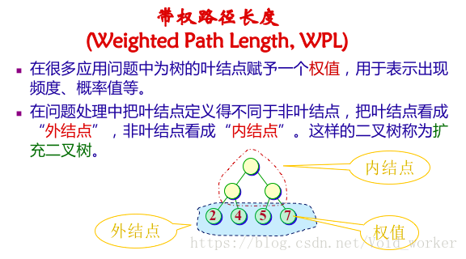
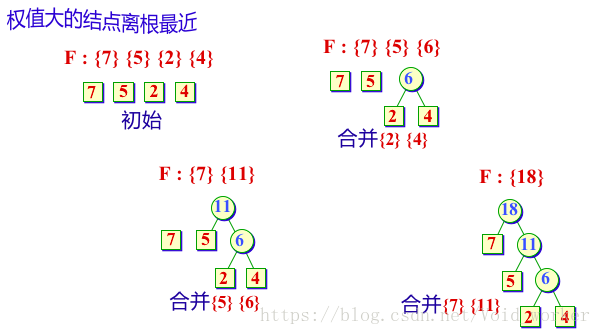

#  Huffman 树

## 5. Huffman 树

### 5.1. 概述

* 两个结点之前的路径长度 PL 是连接两结点的路径上的分支树。
* 树的外部路径长度是各叶结点（外结点）到根结点的路径长度之和 EPL。
* 树的内部路径长度是各非叶结点（内结点）到根结点的路径长度之和 IPL。
* 树的路径长度 PL = EPL+IPL。

* 带权路径长度达到最小的扩充二叉树即为 Huffman 树。
* 在 Huffman 树种，权值大的结点离根最近。

### 5.2. Huffman 树的合并过程

### 5.3.  Huffman 树的存储

　　可以采用静态链表方式存储 Huffman 树。

### 5.4. 最佳判定树

* 利用 Huffman 树，可以在构造判定树（决策树）时让平均判定（比较）次数达到最小。
* 判定树是一颗扩展二叉树，外结点是比较结果，内结点是比较过程，外结点所带权值是概率。

### 5.5. Huffman 编码

　　用途：实现数据压缩。

## 参考文章

1. [数据结构--知识点总结--树](https://blog.csdn.net/void_worker/article/details/80919901)
2. [从零开始学数据结构和算法(七) huffman 树与 AVL 树](https://juejin.im/post/5c9464515188252d7e34df85)

