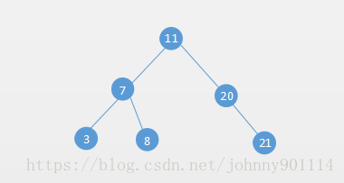
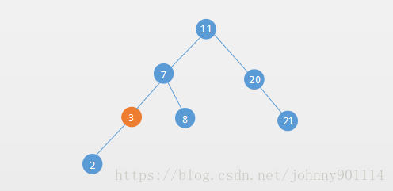
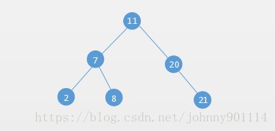
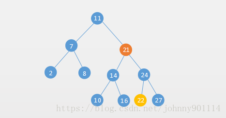
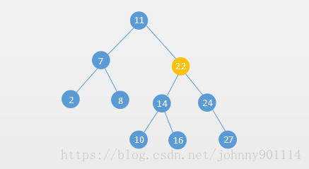
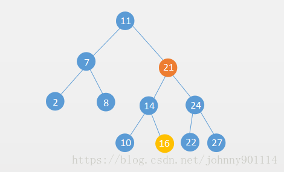

#  二分搜索树

　　二分搜索树（Binary Search Tree），也称为二叉查找树、二叉搜索树、有序二叉树（ordered binary tree）或排序二叉树（Sorted binary tree）。

　　二分搜索树（Binary Search Tree）满足以下几个条件：

1. 若它的左子树不为空，左子树上所有的节点的值都小于它的根结点
2. 若它的右子树不为空，右子树上所有的节点的值都大于它的根节点。
3. 它的左、右子树也都是二分搜索树。

　　如果插入的元素在二分搜索中以及存在根据具体的情况而定，如果不允许重复，直接抛弃即可，如果允许重复可以使用技术的方式，即每个节点保存自己的个数。

　　二分搜索树有着高效的插入、删除、查询操作。平均时间复杂度为 O(logn)；最差情况为 O(n)。

## 二分搜索树的基本操作

### 插入操作

　　根据二分搜索树的定义，二分搜索树的插入操作就比较简单了。

　　如果二分搜索树为空，那么新插入的节点就作为根节点。

　　如果二分搜索树不为空，新节点和根节点作比较，如果比根节点小，则和根节点的左子树比较；如果比根节点大则和右子树作比较，直到没有左子树或者右子树了，然后把新节点作为左子树或者右子树节点。

　　比如要往二叉树添加节点 10：首先和根节点 11 作比较，10 比 11 小，和 11 的左子树 7 对比，比 7 大，然后和 7 的右子树 8 对比，比 8 大，然后和 8 右子树对比，发现 8 的右子树为空，则新节点 10 作为 8 的右子树。

### 删除操作

　　删除操作就比插入操作要少位复杂一点，二分搜索树的删除操作一一般分为几种情况。

#### 如果要删除的节点只有左子树

　　如果要删除的接待你只有左子树，那么直接把它的左子树替换要删除的节点即可。

　　比如要删除节点 3，它只有左子树：

　　删除后：

#### 如果要删除的节点只有右子树

　　如果要删除的节点只有右子树，直接让其右子树代替要删除的节点即可。

　　比如要删除节点 20，它只有右子树：

　　删除后：

#### 如果要删除的节点同时拥有左子树和右子树

　　如果要删除的节点同时有左子树和右子树，首先找到要删除节点的后继（该节点右子树中的最小值），然后把后继删除并且替换要删除的节点。

　　比如要删除下面的二叉搜索树的节点 21：

　　然后把要删除的节点 21 的后继 22 删除并代替要删除的节点：

　　也可以用待删除结点的前驱（节点的左子树中的最大值）：

　　删除后：

### 查询操作

　　二分搜索树的查询操作和插入操作类似，也是不断地比较，前提是如果相等就不用比较了，如果不能就按照插入的方式进行比较。

　　在比较的过程就把很多无用的元素过滤掉了，所以二分搜索树的插入、删除、查询是很高效的。

## 实现二分搜索树

## 二分搜索树的不足

　　一般情况下，二分搜索树有着高效的插入、删除、查询等操作，时间复杂度为 O(longN)。

　　但是如果待插入的数据刚好是有序的，那么这个二分搜索树就退化成链表了，也就是为什么二分搜索树的最差时间复杂度为 O(N)。

　　例如下面两个退化成链表的二分搜索树：

　　解决这个问题，可以用平衡二叉树。

## 参考文章

2. [数据结构与算法（八）二分搜索树(Binary Search Tree)](https://chiclaim.blog.csdn.net/article/details/80598727)

