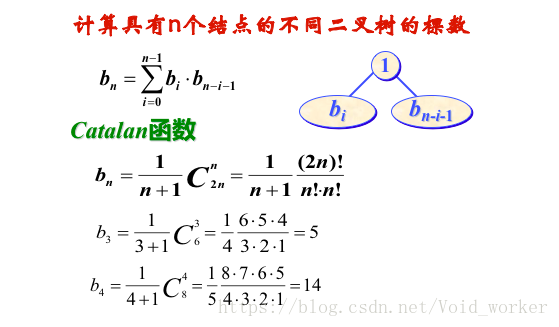
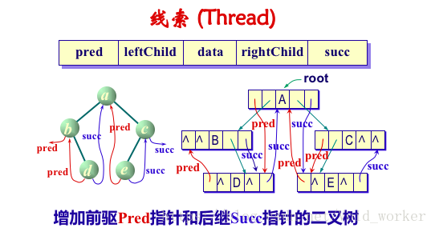
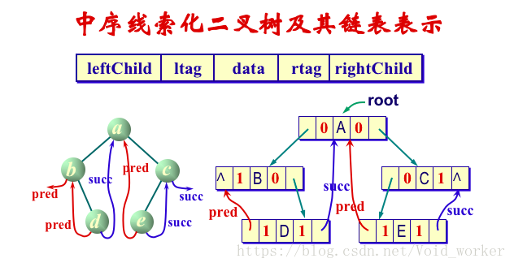

#  二叉树

## 基本概念

　　二叉树是一个每个结最多只能有两个分支的树，左边的分支称之为左子树，右边的分支称之为右子树。

　　也就是说二叉树结点的度最大也就是 2，而普通的树，结点的度是没有限制的。


## 二叉树的分类

### 完美/满二叉树（Perfect Binary Tree）

　　完美二叉树也被称之为满二叉树。挖煤二叉树满足两个也行：

1. 所有的结点都包含两个子结点。
2. 所有的叶子结点的 Height 或者 Level 都相等。


### 完全二叉树（Complete Binary Tree）

　　完全二叉树是出了最后一层都是满的（都有两个子节点），并且最后一层的结点是从左往右排列的。

　　完全二叉树，通俗点说就是结点按层从左往右排列。如果最后一层排满了就是完美二叉树，没有满则是完全二叉树。

　　所以完美二叉树一定是完全二叉树，完全二叉树不一定是完美二叉树。

　　一个完全二叉树可以高效的似乎用数组来表示。


### 完满二叉树（Full Binary Tree）

　　完满二叉树就是每个结点都有玩个子节点，也就是说比完美二叉树少了一个条件。


## 二叉树的性质

　　具有 n 个结点的完全二叉树的高度（或深度）为 取下整（long2n）+1，也可以写为 取上整 log2(n+1)。

##  二叉树的存储结构

* 顺序存储结构：最适用于存储完全二叉树。
* 链式存储结构：一个数据域，两个指针域的链式结点结构。

```c++
typedef struct BTNode{
    int data;
    struct BTNode *lchild;
    struct BTNode *rchild;
}BTNode;
```

##  二叉树的存储表示

* 二叉树的顺序表示
* 二叉树的链式表示（二叉链表）
* 三叉链表：增加一个指向双亲的指针 parent(如下图)


##  二叉树的遍历

* 前序遍历
* 中序遍历
* 后序遍历

##  构造二叉树

　　使用二叉树前序遍历建立二叉树


　　构造二叉树


　　二叉树计数：



##  线索化二叉树

　　线索化二叉树，又称穿线树，将某种遍历顺序下的前驱、后继关系记在树的存储结构中，可以高效地找出某节点地前驱、后继。






## 参考文章

1. [数据结构--知识点总结--树](https://blog.csdn.net/void_worker/article/details/80919901)
2. [数据结构与算法（七）树和二叉树](https://chiclaim.blog.csdn.net/article/details/80574803)
