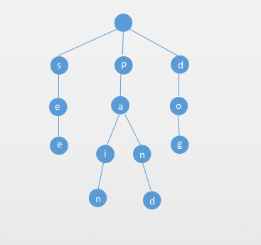
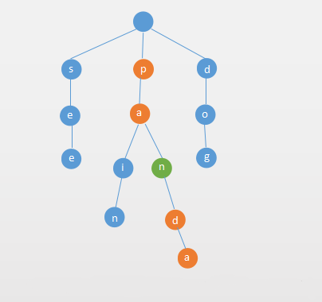
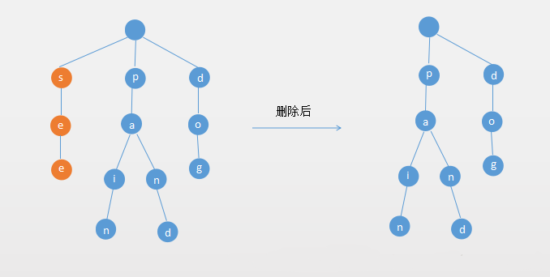
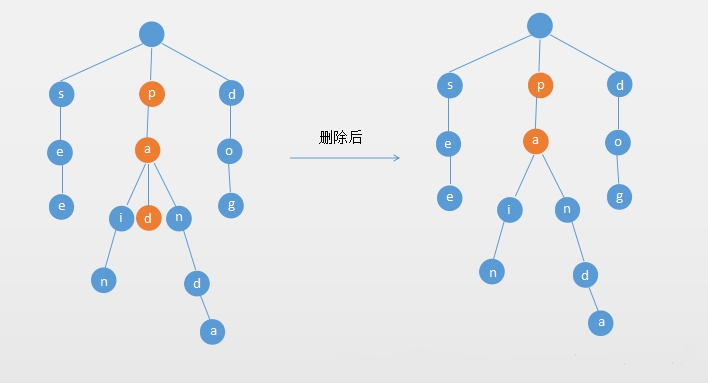

#  字典树

## Trie 字典树的基本概念

　　一个线性表的顺序查找的时间复杂度为 O(n)；二分搜索树的查找为 O(logn)，它们都和数据结构中的元素个数相关。

　　Tire 字典树（主要用于存储字符串）查找速度主要和它的元素（字符串）的长度相关。

　　Tire 字典树主要用于存储字符串，Tire 的每个 Node 保存一个字符。用链表来描述的话，就是一个字符串就是一个链表。每个 Node 都保存了它的所有子节点。

　　例如往字典树中插入 see、pain、paint 三个单词，Trie 字典树如下所示：



　　也就是说如果只考虑小写的 26 个字母，那么 Trie 字典树的每个节点都可能有 26 个子节点。

## Tire 字典树的基本操作

### 插入

　　使用链表来实现 Trie 字典树，字符串的每个字符作为一个 Node 节点，Node 主要有两部分组成：

1. 是否是单词（boolean isWord）
2. 节点所有的子节点，用 map 来保存（Map next）

　　例如插入一个 paint 单词，如果用户查询 pain，尽管 paint 包含了 pain，但是 Trie 中仍然不包含 pain 这个单词，所以如果往 Trie 中插入一个单词，需要把该单词的最后一个字符的节点的 isWord 设置为 true。所以为什么 Node 需要存储是否是单词这个属性。

　　节点的所有子节点，通过一个 Map 来存储，key 是当前子节点对应的字符，value 是子节点。

### 查找

　　Tire 查找操作就比较简单了，遍历带朝朝的字符串的字符，如果每个节点都存在，并且待查找字符串的最后一个字符对应的 Node 的 isWord 属性为 true，则表示该单词存在。

### 前缀查询

　　前缀查询和上面的查询操作基本类似，就不需要判断 isWord 类。

### 删除

　　Tire 的删除操作就稍微复杂一些，主要分为以下 3 中抢矿：

#### 如果单词是另一个单词的前缀

　　如果待删除的单词是另一个单词的前缀，只需要把该单词的最后一个节点的 isWord 的改成 false。

　　比如 Tire 中存在 panda 和 pan 这两个单词，删除 pan，只需要把字符 n 对应的节点 isWord 改为 false 即可。

　　如下图所示：



#### 如果单词的所有字母的都没有多个分支，删除整个单词

　　如果单词的所有字母的都没有多个分支（也就是说该单词所有的字符对应的 Node 都只有一个子节点），则删除整个单词。

　　例如，要删除如下图的 see 单词，如下图所示：



#### 如果单词的处理最后一个字母，其他的字母有多个分支



## 基于链表的 Tire 字典树

```java
/**
 * 基于链表的 Trie 字典树
 */
public class Trie {

    private Node root;
    private int size; // 存储的单词的个数

    public Trie() {
        root = new Node();
    }

    public int size() {
        return size;
    }

    public boolean isEmpty() {
        return size == 0;
    }

    /**
     * 插入操作
     *
     * @param word 单词
     */
    public void add(String word) {
        Node current = root;
        char[] cs = word.toCharArray();
        for (char c : cs) {
            Node next = current.next.get(c);
            if (next == null) {
                // 一个字符对应一个 Node 节点
                current.next.put(c, new Node());
            }
            current = current.next.get(c);
        }
        // current 就是 word 的最后一个字符的 Node
        // 如果当前的 node 已经是一个 word，则不需要添加
        if (!current.isWord) {
            size++;
            current.isWord = true;
        }
    }

    /**
     * 是否包含某个单词
     *
     * @param word 单词
     * @return 存在返回 true，反之 false
     */
    public boolean contains(String word) {
        Node current = root;
        for (int i = 0; i < word.length(); i++) {
            char c = word.charAt(i);
            Node node = current.next.get(c);
            if (node == null) {
                return false;
            }
            current = node;
        }
        // current 就是 word 的最后一个字符的 Node
        // 如果只存在 Panda 这个词，查询 pan，虽然有这 3 个单词，但是并不存在该单词
        return current.isWord;
    }

    /**
     * Trie 是否包含某个前缀
     *
     * @param prefix 前缀
     * @return 存在返回 true，反之返回 false
     */
    public boolean containsPrefix(String prefix) {
        Node current = root;
        for (int i = 0; i < prefix.length(); i++) {
            char c = prefix.charAt(i);
            Node node = current.next.get(c);
            if (node == null) {
                return false;
            }
            current = node;
        }
        return true;
    }

    /**
     * 删除操作
     * 1. 如果单词是一个单词的前缀，只需要把该 word 的最后一个节点的 isWord 改成 false
     * 2. 如果单词的所有字母都没有多个分支，删除整个单词
     * 3. 如果单词除了最后一个字母，其他的字母有多个分支
     * 4. 如果单词的前缀是一个单词，则删除单词的后半部分
     *
     * @param word
     * @return
     */
    public boolean remove(String word) {
        Node multiChildNode = null;
        int multiChildNodeIndex = -1;
        Node current = root;
        for (int i = 0; i < word.length(); i++) {
            Node child = current.next.get(word.charAt(i));
            // 如果 Trie 中没有这个单词
            if (child == null) {
                return false;
            }
//            System.out.println("word.charAt(i):" + word.charAt(i) + ",child.next:" + child.next);
            // 当前节点的子节点大于 1 个 或者单词的前缀是一个单词
            if (child.next.size() > 1 || (i != word.length() - 1 && child.isWord)) {
                multiChildNodeIndex = i;
                multiChildNode = child;
            }
            current = child;
        }
        // 如果单词后面还有子节点
        if (current.next.size() > 0) {
            if (current.isWord) {
                current.isWord = false;
                size--;
                return true;
            }
            // 不存在该单词，该单词只是前缀
            return false;
        }
        // 如果单词的又有字母的都没有多个分支，删除整个单词
        if (multiChildNodeIndex == -1) {
            root.next.remove(word.charAt(0));
            size--;
            return true;
        }
        System.out.println("multiChildNodeIndex:" + multiChildNodeIndex + ",multiChildNode:" + multiChildNode);
        // 如果单词的除了最后一个单词，其他的字母有分支
        if (multiChildNodeIndex != word.length() - 1) {
            multiChildNode.next.remove(word.charAt(multiChildNodeIndex + 1));
            size--;
            return true;
        }
        return false;
    }

    public void showTrie() {
        Deque<Node> nodeQueue = new ArrayDeque<>();
        nodeQueue.addLast(root);
        while (!nodeQueue.isEmpty()) {
            Node node = nodeQueue.removeFirst();
            System.out.println("node.isWord:" + node.isWord + ",node.next:" + node.next);
            Map<Character, Node> nextMap = node.next;
            if (nextMap != null) {
                Set<Character> keySet = nextMap.keySet();
                for (Character key : keySet) {
//                    System.out.print("key:" + key + ",");
                    nodeQueue.addLast(nextMap.get(key));
                }
                System.out.print("\n");
            }
        }
    }


    private static class Node {
        public boolean isWord = false;
        public Map<Character, Node> next;

        public Node() {
            next = new TreeMap<>();
        }

        public Node(boolean isWord) {
            this();
            this.isWord = isWord;
        }

    }
}

```


## 更多关于 Trie 的话题

　　上面实现的 Trie 中，是使用 TreeMap 来保存节点的所有的子节点，也可以使用 HashMap 来保存所有的子节点，效率更高：

```java
public Node(){
	next = new HashMap<>();
}
```

　　当然也可以使用一个定长的数组来存储所有的子节点，效率比 HashMap 更高，因为不需要使用 hash 函数：

```java
public Node(boolean isWord){
	this.isWord= isWord;
	next = next Node[26]; //只能存储 26 个小写字母
}
```

　　Trie 查询效率非常高，但是对空间的小号还是挺大的，这也是典型的空间换时间。

　　可以使用压缩字典树（Compressed Trie），但是维护相对来说复杂一些。

　　如果不止英文单词，还有其他特殊字符，那么维护子节点的集合可能会更多。

　　可以对 Trie 字典树做些限制，比如每个节点只能有 3 个子节点，左边的节点是小于父节点的，中间的节点是等于父节点的，右边的子节点是大于父节点的，这就是三分搜索 Trie 字典树（Ternary Search Trie）。

## LeetCode 相关字典树的问题

### LeetCode 第 208 号问题

#### 问题描述

　　实现一个 Trie（前缀树），包含 insert、search 和 startsWith 这三个操作。

#### 示例

```java
Trie trie = new Trie();
trie.insert("apple");
trie.search("apple"); // 返回 true
trie.search("app"); // 返回 false
trie.startsWith("app"); //返回 true
trie.insert("app");
trie.search("app"); // 返回 true
```

#### 问题说明

　　你可以假设所有的输入都是由小写字母 a-z 构成的。

　　保证所有属兔均为非空字符串。

#### 解决问题

　　这个问题在实现的 Trie 字段数中已经实现了这个功能了，add() 就是对应的 insert()，contains() 就是对应的 search()，startcontainsPrefix() 就是对应的 startWith()。

### LeetCode 第 211 号问题

#### 问题描述

　　设计一个支持以下两种操作的数据结构：

```java
void addWord(word)
boolean search(word)
search(word)
```

　　可以搜索文字或正则表达式字符串，字符串只包含字母 . 或 a-z。. 可以表示任何一个字母。

#### 示例

```java
addWord("bad")
addWord("dad")
addWord("mad")
search("pad") -> false
search("bad") -> true
search(".ad") -> true
search("b..") -> true
```

#### 问题说明

　　你可以假设所有单词都是由小写字母 z-a 组成的。

#### 解决问题

　　这个问题就是上一个问题的基础上加上 . 的处理，稍微复杂点。

　　如果下一个字符是 .，那么需要遍历该节点的所有子节点，对所有子节点的处理就是一个递归程序：

```java
    public boolean searchByWildCard(String express) {
        return search(root, express, 0);
    }

    private boolean search(Node node, String express, int index) {
        // 如果已经到了待查询字符串的尾端了
        if (index == express.length()) {
            return node.isWord;
        }
        char c = express.charAt(index);
        if (c != '.') {
            Node nextChar = node.next.get(c);
            if (nextChar == null) {
                return false;
            }
            return search(nextChar, express, index + 1);
        } else {
            // 如果是通配符
            Map<Character, Node> nextNodes = node.next;
            // 遍历所有的子节点
            for (Map.Entry<Character, Node> entry : nextNodes.entrySet()) {
                if (search(entry.getValue(), express, index + 1)) {
                    return true;
                }
            }
            return false;
        }
    }
```


### LeetCode 第 677 号问题

#### 问题描述

　　实现一个 MapSum 类里的两个方法，insert 和 sum。

　　对于方法 insert，你将得到一对（字符串，整数）的键值对。字符串表示键，整数表示值。如果键已经存在，那么原来的键值对将被替换成新的键值对。

　　对于方法 sum，你将得到一个表示前缀的字符串，你需要返回所有以该前缀开头的键的值的总和。

#### 示例

```java
输入：insert("apple",3),输出：Null
输入：sum("ap")，输出：3
输入：insert("app",2)，输出：Null
输入：sum("ap")，输出：5
```

#### 解决问题

　　总结一句话就是，求出所有符合该前缀的字符串的键值的总和。

　　节点需要保存一个键值，用于求和。节点 Node 不需要维护 isWord 这个属性了，因为不关注是不是一个单词。

```java
public class MapSum {

    public static void main(String[] args) {
        MapSum mapSum = new MapSum();
        mapSum.insert("apple", 3);
        System.out.println(mapSum.sum("ap"));
        mapSum.insert("app", 2);
        mapSum.show();
        System.out.println(mapSum.sum("ap"));
    }

    private Node root;

    public MapSum() {
        root = new Node();
    }

    public void insert(String word, int value) {
        char[] charArray = word.toCharArray();
        Node currentNode = root;
        for (int i = 0; i < charArray.length; i++) {
            char c = charArray[i];
            if (!currentNode.next.containsKey(c)) {
                currentNode.next.put(c, new Node());
            }
            currentNode = currentNode.next.get(c);
        }
        currentNode.value = value;
    }

    public void show() {
        show(root);
    }

    private void show(Node n) {
        if (n == null) {
            return;
        }
        System.out.println("value:" + n.value + "，next:" + n.next);
        for (char c : n.next.keySet()) {
            show(n.next.get(c));
        }
    }

    public int sum(String prefix) {
        Node cur = root;
        for (int i = 0; i < prefix.length(); i++) {
            char c = prefix.charAt(i);
            Node node = cur.next.get(c);
            if (node == null) {
                return 0;
            }
            cur = node;
        }
        // cur 指向 prefix 的最后一个字符的 Node
        // 对每个以 prefix 为前缀的 node 进行累加
        return countValue(cur);
    }

    private int countValue(Node node) {
        int result = node.value;
        for (char c : node.next.keySet()) {
            result += countValue(node.next.get(c));
        }
        return result;
    }


    public static class Node {
        public int value = 0;
        public Map<Character, Node> next;

        public Node() {
            next = new HashMap<>();
        }

        public Node(int value) {
            this();
            this.value = value;
        }
    }
}
```


## 参考文章

1. [数据结构与算法（十一）Trie字典树](https://chiclaim.blog.csdn.net/article/details/80711441)


