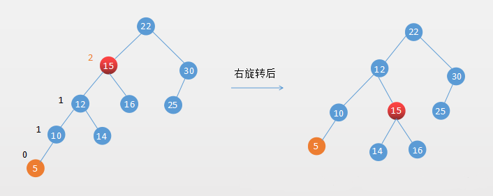
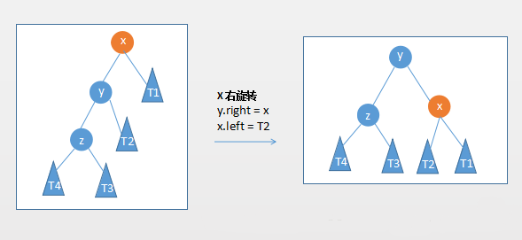
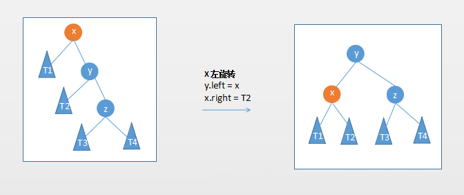
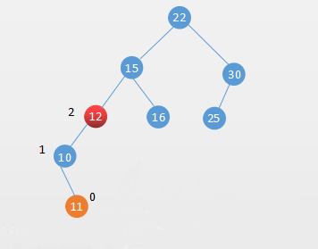
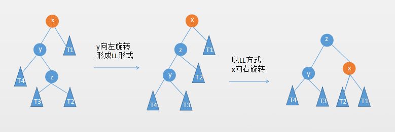

#  平衡二叉树

## 平衡二叉树的概念

　　为什么需要平衡二叉树？二分搜索树的性能跟树的高度（h）有关系。

　　h 为二分搜索树的高度，那么高度 h 和二分搜索树节点树 n 的关系是什么呢？

| 层数  | 该层的节点数 |
| ----- | ------------ |
| 0层   | 1            |
| 1层   | 2            |
| 2层   | 4            |
| 3层   | 8            |
| 4层   | 16           |
| h-1层 | 2^(h-1)      |

　　第 n 层的满二叉树的节点个数 n = 2^0 + 2^1+2^2+2^3+2^4+...+2^(h-1) = 2^h-1，h = log(n+1)。

　　所以基于满二叉树的情况，所以二分搜索树最好情况的时间复杂度 O(h) = O(logn)。但是根据二分搜索树的性质知道，在最坏的情况下二分搜索树会退化成链表，那么二分搜索树在最坏的情况下时间复杂度为 O(n)。

　　为了避免最坏的情况发生，这个时候就需要一个能够平衡的二分搜索树，就算在最坏的情况也能保证二分搜索树的性能保持在 O(logn)。

　　平衡二叉树也称为平衡二分搜索树（Balanced Binary Tree）是一种结构平衡的二分搜索树。

　　平衡二叉树由二分搜索树发展而来，在二分搜索树的基础上平衡二叉树需要满足两个条件：

1. 它的左右两个子树的高度差绝对值不超过1；
2. 左右两个子树都是一棵平衡二叉树。

　　常见的平衡二叉搜索树有：

1. AVL
2. 红黑树
3. Treap

## AVL 树

　　AVL 树是由 G.M.Adelson - V elsky 和 E.M.Landis 于 1962 年提出。AVL 树是最早的平衡二叉树。

　　AVL 树维护自身的平衡涉及到两个概念：

1. 节点的高度。
2. 节点的平衡因子。

　　节点的高度就是从根节点到该结点的边的总和。

　　节点的平衡因子 BF（Balance Factor） 是左子树的高度减去它的右子树的高度。

　　带有平衡因子 1、0 或 -1 的节点被认为是平衡的，因为它的左右子树高度差不超过 1。

　　如下面一棵 AVL 树：

　　上图的 AVL 树中，节点最大的平衡因子是 1，所以它是一棵平衡二叉树。

　　一棵平衡二叉树的平衡性被打破肯定是在插入或者删除的时候。

## 插入操作保持 AVL 树的平衡

### 插入的元素在不平衡节点左侧的左侧，简称 LL

　　如下面一棵 AVL 树，在插入节点 5 后，节点 15 的平衡因子变成了 2，树的平衡性被打破：

　　这种情况称之为插入的元素在不平衡节点左侧的左侧，简称 LL。

　　遇到该情况需要对不平衡的节点进行右旋转：

　　通用情况如下：

　　右旋转代码：

### 插入的元素在不平衡节点右侧的右侧，简称 RR

　　这种情况是 LL 的镜像，它需要对不平衡的节点向左旋转：

　　左旋转代码：

### 插入的元素在不平衡节点的左侧的右侧，简称 LR

　　插入的元素在不平衡节点的左侧的右侧，如下图所示：

　　这个时候就不能单纯的对节点 12 右旋转，11 和 12 都比 10 要大，这种情况需要两次旋转：

### 插入的元素在不平衡节点的右侧的左侧，简称 RL

　　插入的元素在不平衡节点的右侧的左侧，如下图所示：

　　插入操作维护 AVL 平衡性的相关代码：

## 删除操作保持 AVL 树的平衡

　　删除操作和插入操作需要保持平衡的情况基本是一样的，代码如下所示：

## 参考文章

1. [从零开始学数据结构和算法(七) huffman 树与 AVL 树](https://juejin.im/post/5c9464515188252d7e34df85)
2. [数据结构与算法（十三）平衡二叉树之AVL树](https://chiclaim.blog.csdn.net/article/details/80740418)

