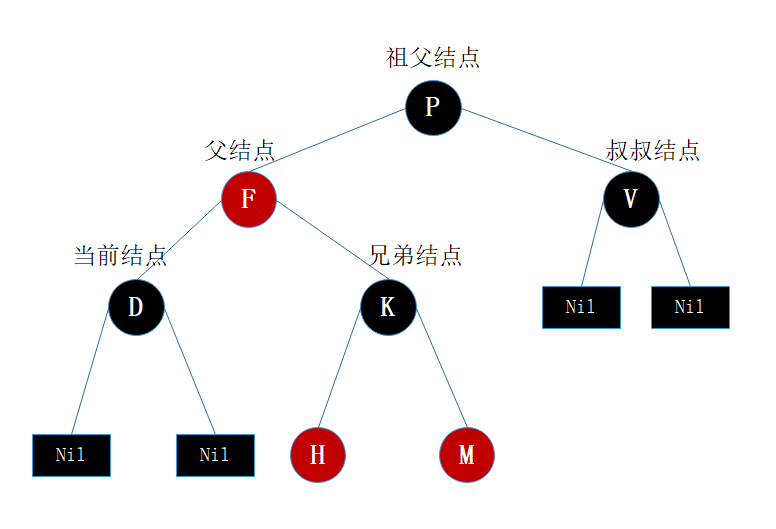
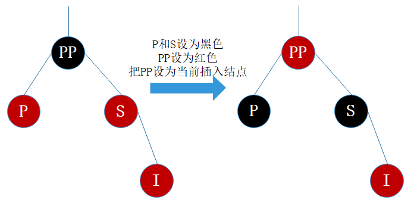
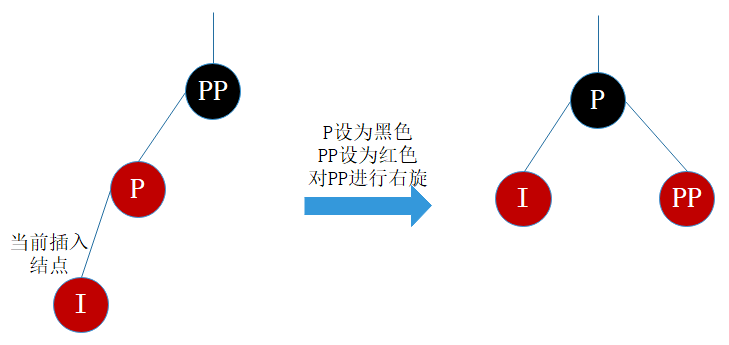
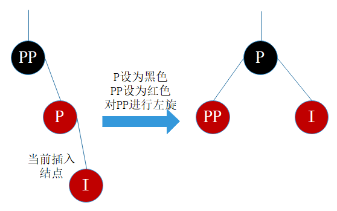
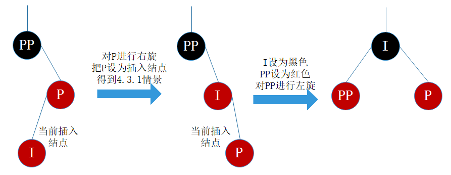
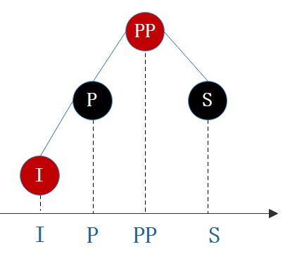
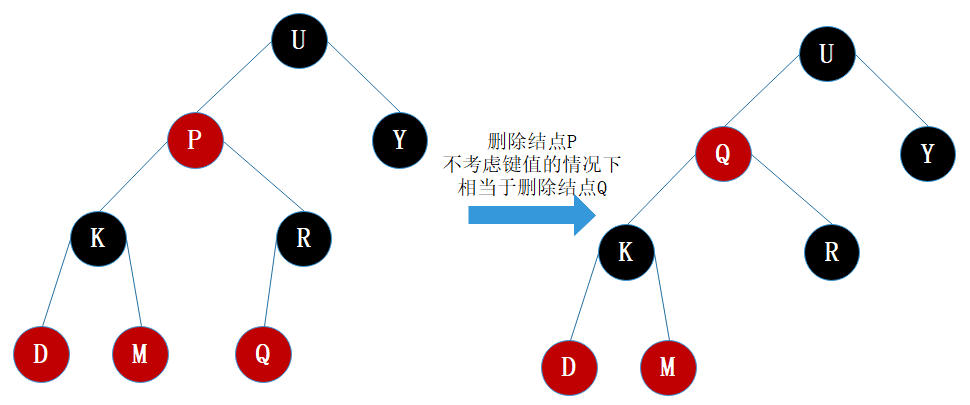
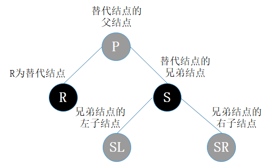
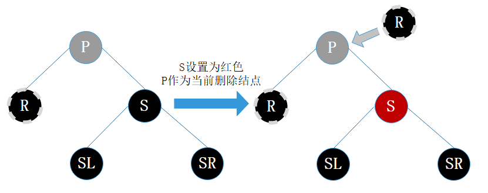
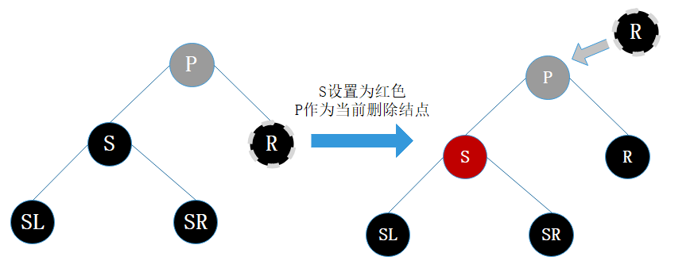

#  红黑树

## 1. 红黑树介绍

　　红黑树是一种自平衡二叉查找树，是计算机科学领域中的一种数据结构，典型的用途是实现关联数组，存储有序的数据。它是复杂的，但它的操作有着良好的最坏情况运行时间，并且在实践中是高效的。它可以在 O(logn) 时间内做查找、插入和删除，这里的 n 是树的结点个数。

 　　红黑树和平衡二叉树（AVL 树）都是二叉查找树的变体，但红黑树的统计性能要好于 AVL 树。因为，AVL 树是严格维持平衡的，红黑树是黑平衡的。维持平衡需要额外的操作，这就加大了数据结构的时间复杂度，所以红黑树可以看作是二叉搜索树和 AVL 树的一个折中。维持平衡的同时也不需要花太多时间维持数据结构的性质。

 　　红黑树在很多地方都有应用，例如：

* C++ 的 STL，map 和 set 都是红黑树实现的。
* 著名的 Linux 进程调度 Completely Fair Scheduler，用红黑树管理进程控制块。
* epoll 在内核中的实现，用红黑树管理时间块。
* nginx 用红黑树管理 timer 等。
* Java 的 TreeMap 实现。

 　　红黑树简介：R-B Tree，全称是 Red-Black Tree，又称为 “ 红黑树 ”，是一种特殊的二叉查找树。红黑树的每个结点上都有存储位表示结点的颜色，可以是红（Red）或黑（Black）。

 　　红黑树的特性：

1. 每个结点时黑色或红色。
2. 根结点是黑色。
3. 每个叶子结点（NIL）是黑色。（注意：这里叶子结点，是指空（NIL 或 NULL）的叶子结点）。
4. 如果一个结点是红色的，则它的子节点必须是黑色的。
5. 每个结点到叶子结点 NIL 所经过的黑色结点的个数一样的。（确保没有一条路径会比其他路径长出两倍，所以红黑树是相对接近平衡的二叉树）。

## 2. 红黑树基本操作

 　　红黑树的基本操作是添加、删除。在对红黑树进行添加或删除之后，都会用到旋转方法。这是因为添加或删除红黑树种的结点之后，红黑树的结构就发生了变化，可能不满足红黑树的 5 条性质，也就不再是一棵红黑树了，而是一棵普通的树。而通过旋转和变色，可以使这颗树重新成为红黑树。简单点说，旋转和变色的目的是让树保持红黑树的特性：自平衡二叉树。

 　　旋转包括两种：左旋和右旋。

 　　变色：节点的颜色由红变黑或由黑变红。

### 2.1. 左旋

 　　左旋：以某个结点作为支点（旋转结点），其右子结点变为旋转结点的父节点，右子结点的左子结点变为旋转结点的右子结点，其左子结点保持不变。

### 2.2. 右旋

 　　右旋：以某个结点作为支点（旋转结点），其左子节点变为旋转结点的父节点，左子节点的右子节点变为旋转节点的左子节点，其右子节点保持不变。

 　　先忽略颜色，可以看到旋转操作不会影响旋转节点的父节点，父节点以上的结构还是保持不变的。

 　　左旋只影响旋转节点和其右子树的结构，把右子树的节点往左子树挪了。

 　　右旋只影响旋转节点和其左子树的结构，把左子树的节点往右子树挪了。

 　　旋转是局部的。另外可以看出旋转能保持红黑树平衡的一些特性：当一边子树的节点少了，那么向另外一边子树 “ 借 ” 一些节点，当一边子树的节点多了，那么向另外一边子树 “ 租 ” 一些节点。

 　　

## 3.添加

 　　插入的情况可以总结为下面这些：

### 3.1. 情景 1：红黑树为空树

 　　最简单的一种情景，直接把插入节点作为根节点就行，但注意，根据红黑树性质 2：根节点是黑色。所以还需要把插入节点设为黑色。

 　　处理：

* 把插入节点作为根节点，并把节点设置为黑色。

### 3.2. 情景 2：插入节点的 key 已存在

 　　插入节点的 key 已存在，因为红黑树总保持平衡，在插入前红黑树已经是平衡的，那么把插入节点设置为将要替代的节点颜色，再把节点值更新就完成插入了。

 　　处理：

* 把 z 设置为当前节点的颜色。
* 更新当前节点的值为插入节点的值。

### 3.3. 情景 3：插入节点父节点为黑节点

 　　由于插入的节点是红色，并不影响红黑树的平衡，直接插入即可，无需做自平衡。

 　　处理：

* 直接插入。

### 3.4. 情景 4：插入节点的父节点为红节点

 　　 红黑树的性质 2：根节点是黑色。如果插入的父节点为红节点，那么该父节点不可能为根节点，所以插入节点总是存在祖父节点。这点很重要，因为后续的旋转操作需要祖父节点的参与。

#### 3.4.1. 情景 4.1 ：叔叔节点存在并且为红节点

 　　从红黑树性质 4 可以确定，祖父节点为黑节点，因为不可能同时存在两个相连的红节点。那么此时该插入子树的红黑层数的情况是：黑红红。显然最简单的处理方式是把其改成：红黑红。

 　　处理：

* 将 P 和 S 设置为黑色（当前插入节点 I）
* 将 PP 设置为红色
* 将 PP 设置为当前插入节点

 　　红黑树的生长是自底向上的。这点不同于普通的二叉查找树，普通的二叉查找树的生长是自顶向下的。

#### 3.4.2. 情景 4.2：叔叔节点不存在或为黑节点，并且插入节点的父亲节点是祖父节点的左子节点。

　　即不算情景 4.1. 自底向上处理时的情况，叔叔节点非红即为叶子节点（Nil）。因为如果叔叔节点为黑节点，而父节点为红节点，那么叔叔节点所在的子树的黑色节点就比父节点所在子树的多了，这部满足红黑树的性质 5。后续情景同样如此。

##### 3.4.2.1. 情景 4.2.1 ：插入节点是其父节点的左子节点

　　处理：

* 将 P 设为黑色
* 将 PP 设为红色
* 对 PP 机性右旋

　　可以把 PP 设为红色，I 和 P 设为黑色吗？答案是可以。但把 PP 设为红色，显然又会出现情景 4.1 的情况，需要自底向上处理，做多了无谓的操作，既然能自己消化就不要麻烦祖辈们了。

##### 3.4.2.2. 情景 4.2.2：插入节点是其父节点的左子节点

　　这种情景显然可以转换为情景 4.2.1。

　　处理：

* 对 P 进行左旋
* 把 P 设置为插入节点，得到情景 4.2.1
* 进行情景 4.2.1. 的处理。

#### 3.4.3. 情景 4.3：叔叔节点不存在或为黑色，并且插入节点的父亲节点是祖父节点的右子节点

　　该情景对应情景 4.2，只是方向反转。

##### 3.4.3.1. 情景 4.3.1：插入节点是其父节点的右子节点

　　处理：

* 将 P 设为黑色
* 将 PP 设为红色
* 对 PP 进行左旋

##### 3.4.3.2. 情景 4.3.2：插入节点是其父节点的左子节点

　　处理：

* 对 P 进行右旋
* 把 P 设置为插入节点，得到情况 4.3.1
* 进行情景 4.3.1 的处理

## 4. 删除

　　红黑树的删除操作包括两部分工作：

* 查找目标节点。
* 删除节点后自平衡。

　　查找目标节点显然可以复用查找操作，当不存在目标节点时，忽略本次操作；当存在目标节点时，删除后需要做自平衡处理。删除节点后需要找节点来替代删除节点的位置，不然子树跟父辈节点断开了，除非删除节点刚好没子节点，那么就不需要替代。

　　二叉树删除节点找替代节点有 3 种情景：

* 情景 1：若删除节点无子节点，直接删除。
* 情景 2：若删除节点只有一个子节点，用子节点替换删除节点。
* 情景 3：若删除节点有两个子节点，用后继节点（大于删除节点的最小节点）替换删除节点。

　　情景 3 中可以用前继节点（小于删除节点的最大节点）替换删除节点吗？可以的。但习惯上大多都是拿后继节点来替代，后文的讲解也是用后继节点来替代。

　　一种找前继和后继节点的只管的放啊：把二叉树所有节点投射在 X 轴上，所有节点都是从左到右排好序的，所有目标节点的前后节点就是对应的前继和后继节点。

　　删除节点被替代后，在不考虑节点的键值的情况下，对于树来说，可以认为删除是替换节点。在不看键值对的情况下，红黑树最终结果是删除了 Q 所在位置的节点。

　　基于此，上面所说的 3 种二叉树的删除情景可以相互转换并且最终都是转换为情景 1。

　　情景 2：删除节点用其唯一的子节点替换，子节点替换为删除节点后，可以认为删除的是子节点，若子节点又有两个子节点，那么相当于转换为情景 3，一直自顶向下转换，总是能转换为 情景 1。（根据红黑树的性质来说，只存在一个子节点的节点肯定在树末了）。

　　情景 3：删除节点用后继节点（后继节点肯定不存在左节点），如果后继节点有右子节点，那么相当于转换为情景 2，否则转为情景 1。

　　途中字母并不代表节点 Key 的大小。R 表示替代节点，P 表示替代节点的父节点，S 表示替代节点的兄弟节点，SL 表示兄弟节点的左子节点，SR 表示兄弟节点的右子节点。红色节点表示它可以是红色也可以是黑色。

　　R 是即将被替换到删除节点的位置的替代节点，在删除前，它还在原来所在位置参与树的子平衡，平衡后再替换到删除节点的位置，才算删除完成。

　　删除情况可以总结为下面这些。

### 情景 1：替换节点是红色节点

　　把替换节点替换带了删除节点的位置时，由于替换节点是红色，删除也了不会影响红黑树的平衡，只要把替换节点的颜色设为删除接待你的颜色即可重新平衡。

　　处理：

* 颜色变为删除节点的颜色

###  情景 2：替换节点是黑节点

　　当替换节点是黑色时，就需要进行自平衡处理了。必须还得考虑替换节点是其父节点的左子节点还是右子节点，来做不同的旋转操作，使树重新平衡。

#### 情景 2.1：替换节点是其父节点的左子节点

##### 情景 2.1.1：替换节点的兄弟节点是红节点

　　若兄弟节点，那么根据性质 4，兄弟节点的父节点和子节点肯定为黑色，不会有其他子情况，按下图进行处理，得到情景 2.1.2.3。

　　处理：

* 将 S  设为黑色
* 将 P 设为红色
* 将 P 进行左旋，得到情景 2.1.2.3
* 进行情景 2.1.2.3 的处理

##### 情景 2.1.2：替换节点的兄弟节点是黑节点

　　当兄弟节点为黑时，其父节点和子节点的具体颜色也无法确定（如果也不考虑自底向上的情况，子节点非红即为叶子节点 Nil，Nil 节点为黑节点），此时又得考虑多种子情况。

###### 情景 2.1.2.1：替换节点的兄弟节点的右子节点是红节点，左子节点任意颜色

　　即将删除的左子树的一个黑色节点，显然左子树的黑色节点少 1 了，然而右子树又有红色节点，那么直接向右子树 “ 借 ” 个红节点来补充黑节点就好了，此时肯定需要用旋转处理了。

　　处理：

* 将 S 的颜色设为 P 的颜色
* 将 P 设为黑色
* 将 SR 设为黑色
* 对 P 进行左旋

　　平衡后的图不满足红黑树的性质，R 是即将替换的，它还参与树的自平衡，平衡后再替换到删除节点的位置，所有 R 最终可以看作是删除的。

　　另外考虑到第一次替换和自底向上处理的情况，如果只考虑第一次替换的情况，根据红黑树性质，SL 肯定是红色或为 Nil，所以最终结果树是平衡的。如果是自底向上处理的情况，同样，每棵子树都保持平衡状态，最终整棵树肯定是平衡的。

###### 情景 2.1.2.2：替换节点的兄弟节点的右子节点是黑节点，左子节点是红节点

　　兄弟节点坐在的子树有红节点，总是可以向兄弟子树借个红节点过来，显然该情景可以转换为情景 2.1.2.1。

　　处理：

* 将 S 设为红色
* 将 SL 设为黑色
* 对 S 进行右旋，得到情景 2.1.2.1
* 进行情景 2.1.2.1 的处理

###### 情景 2.1.2.3：替换节点的兄弟节点的子节点都为黑节点

　　此次兄弟子树都没红节点 “ 借 ” 了，兄弟帮忙不了，就找父母。这种情况把兄弟节点设为红色，再把父节点当作替换节点，自底向上处理，去找父节点的兄弟节点去 “借”。但为什么需要把兄弟节点设为红色呢？显然是为了在 P 所在的子树种保证平衡（R 即将删除，少了一个黑色节点，子树也需要少一个），后续的平衡工作交给父辈们考虑了，当每棵子树都保持平衡时，最终整棵总是平衡的。

　　处理：

* 将 S 设为红色
* 把 P 作为新的替换节点
* 重新进行删除节点情景处理

####  情景 2.2：替换节点是其父节点的右子节点

　　右边的操作也是方向相反。

##### 情景 2.2.1：替换节点的兄弟节点是红节点

　　处理：

* 将 S 设为黑色
* 将 P 设为红色
* 对 P 进行右旋，得到情景 2.2.2.3
* 进行情景 2.2.2.3 的处理

##### 情景 2.2.2：替换节点的兄弟节点是黑节点

###### 情景 2.2.2.1：替换节点的兄弟节点的左子节点是红节点，右子节点任意颜色

　　处理：

* 将 S 的颜色设为 P 的颜色
* 将 P 设为黑色
* 将 SL 设为黑色
* 对 P 进行右旋

###### 情景 2.2.2.2：替换节点的兄弟节点的左子节点为黑节点，右子节点为红节点

　　处理：

* 将 S 设为红色
* 将 SR 设为黑色
* 对 S 进行左旋，得到情景 2.2.2.1
* 进行情景 2.2.2.1 的处理

###### 情景 2.2.2.3：替换节点的兄弟接待你的子节点都为黑节点

　　处理：

* 将 S 设为红色
* 把 P 作为新的替换节点
* 重新进行删除节点情景处理

　　综上，红黑树删除后自平衡的处理可以总结为：

* 自己能搞定的自消化（情景 1）
* 自己不能搞定的叫兄弟帮忙（除了情景 1、情景 2.1.2.3 和 情景 2.2.2.3）
* 兄弟都帮忙不了的，通过父母，找远方亲戚（情景 2.1.2.3 和情景 2.2.2.3）

## 5. 实现红黑树

## 6. 参考文章

1. [红黑树原理和算法介绍](https://www.cnblogs.com/nananana/p/10434549.html)
2. [红黑树java代码实现](https://www.cnblogs.com/liaoshy/p/12105888.html)

