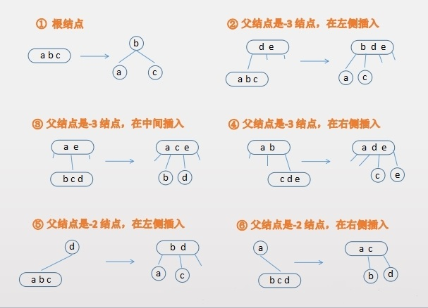
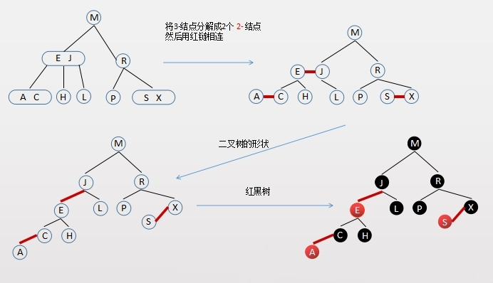
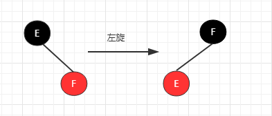
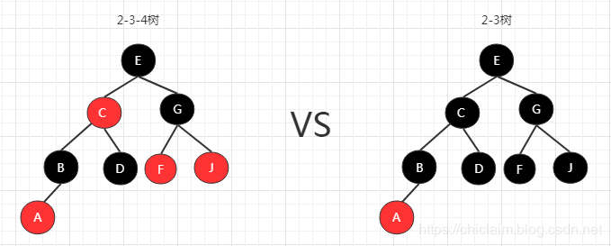
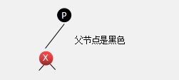
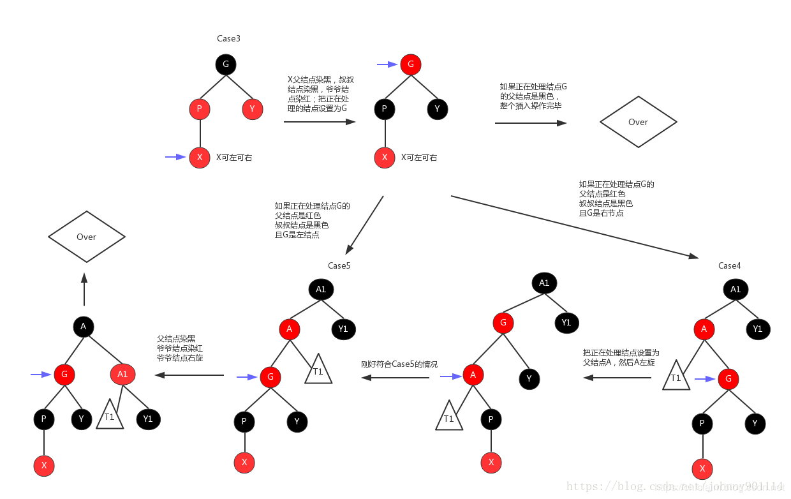
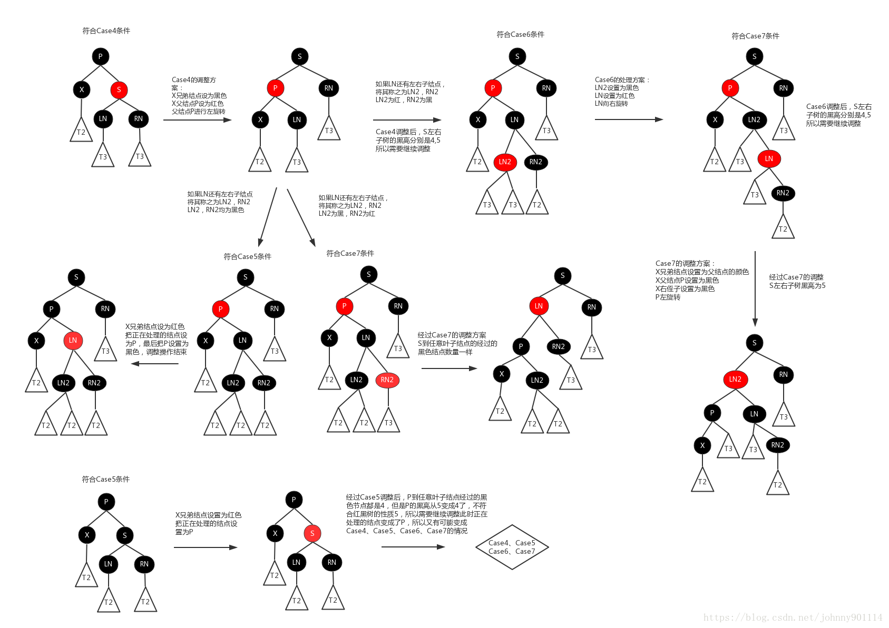

#  红黑树

## 1. 什么是 2-3 树

　　红黑树是完美平衡的 2-3 树的一种实现。所以，理解 2-3 树对掌握红黑树是至关重要的。

　　2-3 树的一个 Node 可能有多个子节点（可能大于 2 个），而且一个 Node 可以包含 2 个键（元素）。

　　可以把红黑树（红黑二叉查找树）当作 2-3 树的一种二叉结构的实现。

　　在二叉树中，一个 Node 保存一个值，在 2-3 树种把这样的节点称之为 2- 节点。

　　如果一个节点包含了两个值（可以当作两个节点的融合），在 2-3 树中把这样的节点称之为 3- 节点。完美平衡的 2-3 树所有空链接到根节点的举例都应该是相同的。

　　下面看下《算法 4》对 2-3- 节点的定义：

1. 2- 节点，含有一个键（及其对应的值）和两条链接。该节点的左链接小于该节点的键；该节点的右链接大于该节点的键。
2. 3- 节点，含有两个键（及其对应的值）和三条链接。左链接小于该节点的左键；中链接在左键和右键之间；右链接大于该节点右键。

　　如下面一棵完美平衡的 2-3 树：


　　2-3 树是一颗多叉搜索树，所以数据的插入类似二分搜索树。

## 2. 2-3 树的插入操作

　　红黑树是对完美平衡的 2-3 树的一种实现，所以主要介绍完美平衡的 2-3 树的插入过程。

　　完美平衡的 2-3 树插入分为以下几种情况（为了方便画图默认把空链接去掉）：

### 2.1. 向 2- 节点插入新键


### 2.2. 向一棵只含有一个 3- 结点的树中插入新键

　　因为 2-3 树中节点只能是 2- 节点或者 3- 节点。

　　往 3- 节点中再插入一个键就成了 4- 节点，需要对其进行分解，如下所示：


### 2.3. 向一个父节点为 2- 节点的 3- 节点插入新键

　　向 3- 点中再插入一个键就成了 4- 节点，需要对其进行分解，对中间的键向上融合。

　　由于父节点是一个 2- 节点，融合后变成了 3- 节点，然后把 4- 节点的左键变成该 3- 节点的中间子节点。


### 2.4. 向一个父节点为 3- 节点的 3- 节点中插入新键

　　在这种情况下，向 3- 结点插入新键形成暂时的 4- 结点，向上分解，父节点又形成一个 4- 结点，然后继续向上分解。


### 2.5. 一个 4- 节点分解为一棵 2-3 树 6 种情况



## 3. 红黑树（ReadBlackTree）

### 3.1. 完美平衡的 2-3 树和红黑树的对应关系

　　红黑树的背后的基本思想就是用标准的二分搜索树和一些额外的信息来表示 2-3 树的。

　　这额外的信息指的就是替换 3- 节点的方式。因为 2-3 树不是二叉树（最后有 3 叉），所以需要把 3- 节点替换成 2- 节点。

　　将 2-3 树的链接定义为两种类型：黑链接、红链接。

　　黑链接 是 2-3 树中普通的链接，可以把 2-3 树中的 2- 节点与它的子节点之间的链当作黑链接。

　　红链接 2-3 树中 3- 节点分解成两个 2- 节点，这两个 2- 节点之间的链接就是红链接。

　　那么如何将 2-3 树和红黑树等价起来，规定：红链接均为左连接。

　　根据上面对完美平衡的 2-3 树和红链接的介绍可以得出结论：没有一个节点同时和两个红链接相连。

　　根据上面对完美平衡的 2-3 树和黑链接的介绍可以得出结论：完美平衡的 2-3 树是保持完美黑色平衡的，任意空链接到根节点的路径上的黑链接数量相同。

　　据此，可以得出 3 条性质：

1. 红链接均为左链接。
2. 没有一个结点同时和两个红链接相连。
3. 完美平衡的 2-3 树是保持完美黑色平衡的，任意空链接到根结点的路径上的黑链接数量相同。

　　在红黑树中，没有一个对象来表示红链接和黑链接，通过在节点上加上一个属性（color）来标识红链接还是黑链接，color 值为 red 表示节点为红节点，color 值为 black 表示节点为黑节点。

　　黑节点 2-3 树中普通的 2- 节点的颜色。

　　红节点 2-3 树中 3- 节点分解出两个 2- 节点的最小 2- 节点。

　　下面是 2-3 树和红黑树的一一对应关系图：



### 3.2. 红黑树的 5 个基本性质的分析

　　介绍完了 2-3 树和红黑树的对应关系后，再来看下红黑树的 5 个基本性质：

1. 每个节点要么是红色的，要么是黑色。

   因为用节点上的属性来表示红链还是黑链，所以红黑树的节点要么是红色，要么是黑色是很自然的事情。

2. 根节点是黑色。

   红色节点的情况是 3- 节点分解出两个 2- 节点的最小节点是红色，根节点没有父节点所以只能是黑色。

3. 每个叶子节点（最后的空节点）是黑色。

   叶子节点也就是 2-3 树种的空链，如果空链是红色说明下面还是有子节点的，但是空链是没有子节点的；另一方面如果空链是红色，空链指向的父节点节点如果也是红色就会出现两个连续的红色链接，就与 “ 没有一个节点同时和两个红链接相连 ” 相违背。

4. 如果一个节点是红色，那么它的孩子节点都是黑色的。

   “没有一个节点同时和两个红链接相连”，所以一个节点是红色，那么它的孩子节点都是黑色。

5. 从任意的一个节点到叶子节点，经过的黑色节点是一样的。

   完美平衡的 2-3 树和黑链接得出的结论：“ 完美平衡的 2-3 树是保持完美黑色平衡的，任意空链接到根节点的路径上的黑链接数量相同 ”，所以从任意一个节点到叶子节点，经过的黑色节点数是一样的。

### 3.3. 红黑树实现 2-3 树过程中的节点旋转和颜色翻转

#### 3.3.1. 颜色翻转

　　为什么要颜色翻转（flipColor）？在插入的过程中可能出现如下情况：两个左右子节点都是红色。


　　根据上面的描述，红链只允许是左链（也就是左子节点是红色）。

　　所以需要进行颜色转换：把该节点的左右子节点设置为黑色，自己设置为红色。

（代码实现）

```java
private void flipColor(Node<K, V> node) {
	node.color = RED;
	node.left.color = BLACK;
	node.right.color = BLACK;
}
```

#### 3.3.2. 左旋转

　　左旋转情况大致有两种：

1. 节点是右子节点且是红色



2. 颜色翻转后，节点变成红色且它是父节点的右子节点


```
（代码实现）
```

#### 3.3.3. 右旋转

　　需要右旋的情况：连续出现两个左红色链接。


```
（代码实现）
```

### 3.4. 红黑树实现 2-3 树插入操作

　　2-3 树插入时只要满足不出现两个连续左红色链接、右红色链接、左右都是红色链接的情况就可以了。

　　所以仅仅需要处理三种情况即可：

1. 如果出现右侧红色链接，需要左旋。
2. 如果出现两个连续的左红色链接，需要右旋。
3. 如果节点的左右子链接都是红色，需要颜色翻转。

```
（代码实现）
```

### 3.5. 对比 JDK 中 TreeMap 的插入操作

　　这样下来红黑树依然保持着它的五个基本性质，下面来对比 JDK 中的 TreeMap 的插入操作。

　　先按照上面的红黑树插入逻辑，插入三个元素【14，5，20】，流程如下：


　　使用 Java TreeMap 来插入上面三个元素，流程如下：


　　通过对比发现两者的插入后的结构不一样，而且 Java TreeMap 是允许左右子节点都是红色节点。

　　这就和用完美平衡的 2-3 树作为红黑树实现的基础结构相违背了，不允许右节点是红色，也不允许两个连续的红色左节点，不允许左右节点同时是红色。

　　这也是《算法 4》 在讲到红黑树时遵循的。但是 JDK TreeMap（红黑树）是允许右节点是红色，也允许左右节点同时是红色，Java TreeMap 的红黑树实现从它的代码注解说明它的实现来自《算法导论》。

　　说明《算法 4》和《算法导论》中的所介绍的红黑树产生了一些 “ 出入 ”。

### 3.6. 2-3-4 树

　　2-3-4 树和 2-3 树非常相像。2-3 树允许存在 2- 节点和 3- 节点，类似的 2-3-4- 树允许存在 2- 节点、3- 节点和 4- 节点。


#### 3.6.1. 向 2- 节点、3- 节点插入元素

　　向 2- 节点插入元素，这个上面介绍的 2- 3 树是一样，

　　向 3- 节点插入元素，形成一个 4- 节点，因为 2-3-4- 树允许 4- 节点的存在，所以不需要向上分解。

#### 3.6.2. 向 4- 节点插入元素

　　向 4- 节点插入元素，需要分解 4- 节点，因为 2-3-4- 树最多只允许存在 4- 节点，如：


　　如果待插入的 4- 节点，它的父节点也是一个 4- 节点呢？如下图的 2-3-4 树插入节点 K：


　　主要有两个方案：

1. Bayer 于 1972 年提出的方案：使用相同的方法去分解父节点的 4- 节点，直到不需要分解为止，方向是自底向上。
2. Guibas 和 Sedgewick 于 1978 年提出的方案：自上而下的方式，也就是在二分搜索的过程，一旦遇到 4- 节点就分解它，这样在最终插入的时候永远不会有父节点是 4- 节点的情况。

　　下面的图就是自上而下方案的流程图：


#### 3.6.3. 2-3-4 树和红黑树的等价关系

　　2-3-4 树和红黑树的等价关系和 2-3 树和红黑树的等价关系是类似的。不同的是 2-3-4 的 4- 节点分解后的节点颜色变成如下形式：


　　所以可以得出下面一棵 2-3-4 树和红黑树的等价关系图：


　　上面在介绍红黑树实现 2-3 树的时候讲解了它的插入操作：

```
（代码实现）
```

　　可以很轻松的把它改成 2-3-4 的插入逻辑（只需要把颜色翻转的逻辑提到二分搜索的前面即可）：

```
（代码实现）
```

　　下面是 2-3-4 树和 2-3 树插入结果的对比图：



　　一开始用红黑树实现完美平衡的 2-3 树，左右节点是不会都是红色的，现在用红黑树实现 2-3-4 树，左右节点的可以同时是红色的，这样的红黑树效率更高。因为如果遇到左右节点是红色，2-3 树就进行颜色翻转，还需要对红色的父节点进行向上回溯，因为父节点染成红色了，可能父节点的父节点也是红色，可能需要进行节点旋转或者颜色翻转操作，所以说 2-3-4 树式的红黑树效率更高。

　　《算法 4》是用红黑树实现 2-3 树的，并不是 2-3-4 树。但是如果是用红黑树实现 2-3-4 树就和《算法导论》上介绍的红黑树一样吗？不一样。

　　下面继续做一个测试，分别往上面红黑树实现的 2-3-4 树和 JDK TreeMap 中插入 [E,D,R,O,S,X]。


　　虽然两棵树都是红黑树，但是却不一样。并且 TreeMap 允许右节点是红色，在 2-3-4 树中最多是左右子节点同时是红色的情况，不会出现左节点是黑色，右边的兄弟节点是红色的情况，为什么会有这样的差异呢？

　　从上面的 2-3-4 树的插入逻辑可以看出，如果右节点是红色会执行左旋转操作，所以不会出现单独红右节点的情况，也就是说只会出现单独的左节点是红色的情况，把这种形式的红黑树称之为左倾红黑树（Left Leaning Red Blank Tree），包括上面的红黑数实现的完美平衡的 2-3 树也是左倾红黑树。

　　为什么在《算法 4》中，作者规定所有的红色链接都是左链接，这只是人为的规定，当然也可以是右链接，规定红链接都是左链，可以使用更少的代码来实现黑色平衡，需要考虑的情况会更少，就如上面介绍的插入操作，只需要考虑 3 种情况即可。

　　但是一般意义上的红黑树是不需要维持红色左倾的这个性质的，所以为什么 TreeMap 是允许单独右红节点的。

　　如果还需要维持左倾情况，这样的话就更多的操作，可能还需要节点旋转和颜色的翻转，性能更差一些，虽然也符合红黑树的性质。

　　下面来分析下一般意义上的红黑树的插入和删除操作，也就是《算法导论》上介绍的红黑树。

### 3.7. 红黑树的插入操作

　　插入操作有两种情况是非常简单的，所以在这里单独说一下：

1. case 1. 如果插入的节点是根节点，直接把该节点设置为黑色，整个插入操作结束。

　　如下图所示：


2. case 2. 如果插入的节点的父节点是黑色，也无需调整，整个插入操作结束



　　下面开始介绍比较复杂的情况。

　　红黑树插入操作，只需要处理父节点是红色的情况，因为一开始红黑树肯定是黑色平衡的，就是因为往叶子节点插入元素后可能出现两个连续的红色的节点。

　　需要注意的是，把新插入的节点默认设置为红色，初始的时候，正在处理的节点就是插入的节点，在不断调整的过程中，正在处理的节点会不断的变化，且叔叔、爷爷、父节点都是相对于当前正在处理的节点来说的。

3. case 3. 叔叔节点为红色，正在处理的节点可以是左也可以是右节点

　　调整策略：由于父节点是红色，叔叔节点是红色，爷爷节点是黑色，执行颜色翻转操作。然后把当前正在处理的节点设置为爷爷节点，如果爷爷的父节点是黑色插入操作劫色，如果是红色继续处理。

4. case 4. 叔叔节点是黑色，正在处理的节点是右节点

　　调整策略：由于父节点是红色，叔叔节点为黑色，那么爷爷节点肯定是黑色，把正在处理的节点设置为父节点，然后左旋，形成 case 5 情况。

5. case 5. 叔叔节点为黑色，正在处理的节点是左孩子

　　调整策略：由于父节点是红色，叔叔节点为黑色，那么爷爷节点肯定是黑色，把父节点染黑，爷爷节点染红，然后爷爷节点右旋。

　　case3、case4、case5 如果单独来理解的话比较困难，将这三种情况通过一张流程图串联起来，将这三个 case 形成一个整体，蓝色箭头表示正在处理的节点，如下所示：



### 3.8. 红黑树删除操作

　　红黑树的删除操作比插入操作更加复杂一些。

　　为了描述方便，把正在处理的节点称之为 X，父节点为 P（Parent），兄弟节点称之为 S（Sibling），左侄子称之为 LN（Left Nephew），右侄子称之为 RN（Right Nephew）。

　　如果删除的节点是黑色，那么就导致本来保持黑平衡的红黑树失衡了，从下图就可以看出节点 P 到左子树的叶子节点经过的黑节点数量为 4（2+2），到右子树的叶子节点经过的黑色节点数量是 5（3+2），如下图所示：


　　红黑树的删除操作，如果删除的是黑色会导致红黑树就不能保持黑色平衡了，需要进行调整了；如果删除的是红色，那么就无需调整，直接删除即可，因为没有破坏黑色平衡。

　　删除节点后，无需调整的情况：

1. case 1 删除的节点是红色节点，直接删除即可。

2. case 2 删除的节点是黑色，如果当前处理的节点 x 是根节点。

   无论根节点是什么颜色，都将根节点设置为黑色。

3. case 3 删除的节点是黑色，如果当前处理的节点是红色节点，将该节点设置为黑色

   因为删除黑色结束后，就打破了黑色平衡，黑高少了 1，所以把一个红色节点设置为黑色，这样黑高又平衡了。

　　删除节点后，需要调整的情况：

　　正在处理的节点为 x，要删除的节点是左节点，分为 4 种情况:

4. case 4 兄弟节点为红色

   调整方案：兄弟设置为黑色，父节点设置为红色，父节点进行左旋转，转换为 case5、case6、case7。

5. case 5 兄弟节点为黑色，左侄子 LN 为黑色，右侄子 RN 为黑色

   在这种条件下，还有两种情况：父节点是红色或黑色，不管是哪种情况，调整方案都是一致的。

   调整方案：将兄弟节点设置为红色，将当前处理的节点设置为父节点  p。

6. case 6 兄弟节点为黑色，左侄子为红色，右侄子 RN 为黑色

   调整方案：将左侄子节点设置为黑色，兄弟节点设置为红色，兄弟节点右旋转，这样就转化成了 case 7。

7. 兄弟节点为黑色，左侄子不管红黑，右侄子为红色

   处理方式：兄弟节点变成父节点的颜色，然后父节点设置黑色，右侄子设置黑色，父节点进行左旋转。

　　和插入操作一样，下面通过一张流程图把删除需要调整的情况串联起来：



　　上面处理的所有情况都是基于正在处理的节点是左节点，如果要调整正在处理的节点是右节点的情况，就是上面的处理的镜像，插入操作也是同理。

## 4. Java TreeMap、TreeSet 源码分析

　　TreeMap 的底层就是用红黑树实现的，它在插入后调整操作主要在 fixAfterInsertion 方法里，如下所示：

```java
    private void fixAfterInsertion(TreeMapEntry<K,V> x) {
        x.color = RED;

        while (x != null && x != root && x.parent.color == RED) {
            if (parentOf(x) == leftOf(parentOf(parentOf(x)))) {
                TreeMapEntry<K,V> y = rightOf(parentOf(parentOf(x)));
                // case 3 情况
                if (colorOf(y) == RED) {
                    setColor(parentOf(x), BLACK);
                    setColor(y, BLACK);
                    setColor(parentOf(parentOf(x)), RED);
                    x = parentOf(parentOf(x));
                } else {
                    // case 4 情况
                    if (x == rightOf(parentOf(x))) {
                        x = parentOf(x);
                        rotateLeft(x);
                    }
                    // case 5 情况
                    setColor(parentOf(x), BLACK);
                    setColor(parentOf(parentOf(x)), RED);
                    rotateRight(parentOf(parentOf(x)));
                }
            } else {
                // 镜像情况
                TreeMapEntry<K,V> y = leftOf(parentOf(parentOf(x)));
                if (colorOf(y) == RED) {
                    setColor(parentOf(x), BLACK);
                    setColor(y, BLACK);
                    setColor(parentOf(parentOf(x)), RED);
                    x = parentOf(parentOf(x));
                } else {
                    if (x == leftOf(parentOf(x))) {
                        x = parentOf(x);
                        rotateRight(x);
                    }
                    setColor(parentOf(x), BLACK);
                    setColor(parentOf(parentOf(x)), RED);
                    rotateLeft(parentOf(parentOf(x)));
                }
            }
        }
        root.color = BLACK;
    }
```

　　删除后调整操作主要在 fixAfterDeletion 方法：

```java
    /** From CLR */
    private void fixAfterDeletion(TreeMapEntry<K,V> x) {
        while (x != root && colorOf(x) == BLACK) {
            if (x == leftOf(parentOf(x))) {
                TreeMapEntry<K,V> sib = rightOf(parentOf(x));
								// case 4 的情况
                if (colorOf(sib) == RED) {
                    setColor(sib, BLACK);
                    setColor(parentOf(x), RED);
                    rotateLeft(parentOf(x));
                    sib = rightOf(parentOf(x));
                }
								// case 5 的情况
                if (colorOf(leftOf(sib))  == BLACK &&
                    colorOf(rightOf(sib)) == BLACK) {
                    setColor(sib, RED);
                    x = parentOf(x);
                } else {
                    // case 6 的情况
                    if (colorOf(rightOf(sib)) == BLACK) {
                        setColor(leftOf(sib), BLACK);
                        setColor(sib, RED);
                        rotateRight(sib);
                        sib = rightOf(parentOf(x));
                    }
                    // case 7 的情况
                    setColor(sib, colorOf(parentOf(x)));
                    setColor(parentOf(x), BLACK);
                    setColor(rightOf(sib), BLACK);
                    rotateLeft(parentOf(x));
                    x = root;
                }
            } else { // symmetric
                // 镜像的情况
                TreeMapEntry<K,V> sib = leftOf(parentOf(x));

                if (colorOf(sib) == RED) {
                    setColor(sib, BLACK);
                    setColor(parentOf(x), RED);
                    rotateRight(parentOf(x));
                    sib = leftOf(parentOf(x));
                }

                if (colorOf(rightOf(sib)) == BLACK &&
                    colorOf(leftOf(sib)) == BLACK) {
                    setColor(sib, RED);
                    x = parentOf(x);
                } else {
                    if (colorOf(leftOf(sib)) == BLACK) {
                        setColor(rightOf(sib), BLACK);
                        setColor(sib, RED);
                        rotateLeft(sib);
                        sib = leftOf(parentOf(x));
                    }
                    setColor(sib, colorOf(parentOf(x)));
                    setColor(parentOf(x), BLACK);
                    setColor(leftOf(sib), BLACK);
                    rotateRight(parentOf(x));
                    x = root;
                }
            }
        }

        setColor(x, BLACK);
    }
```

　　TreeSet 底层就是用 TreeMap 来实现的，往 TreeSet 添加进的元素当作 TreeMap 的 key，TreeMap 的 value 是一个常量 Object。掌握了红黑树，对于这两个集合的原理就不难理解了。

## 5. 参考文章

1. [数据结构与算法（十四）深入理解红黑树和 JDK TreeMap 和 TreeSet 源码分析](https://chiclaim.blog.csdn.net/article/details/81046088)

