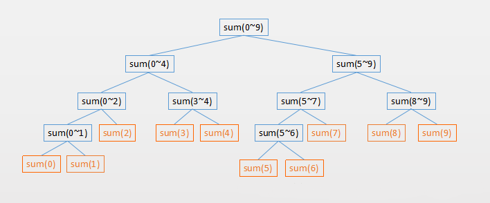
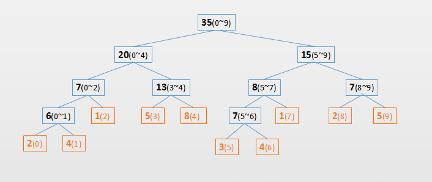
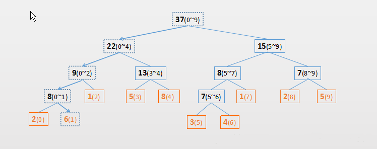

#  线段树

## 线段树的概念

　　线段树（Segment Tree）也是一棵树，只不过元素的值代表一个区间。

　　常用区间的统计操作，比如一个区间的最大值（max）、最小值（min）、和 (sum)等等。

　　如一个长度为 10 的数组，它对应的求和线段树，如下图所示（途中的数字表示索引）：



　　根节点就是 0-length-1 的和，根节点的左右子树平分根节点的区间，然后依次类推，直到只有一个元素不能划分为止，该元素也就是二叉树的叶子节点。

　　线段树是一个平衡二叉树，但不一定是完全二叉树。

　　从上图可以得出，求线段树的区间统计，时间复杂度和二叉树的高度有关系，和元素的个数没有关系，它的时间复杂度为 O(log n)，如果用普通的遍历的方式它的时间复杂度为 O(n)。

　　如果用数组来存储线段树的话，大致需要开辟多大的数组空间呢？

　　根据前面对满二叉树的分析，h 层的满二叉树总共有 2^h-1 个节点，第 h-1 层有 2^(h-1) 个节点，它们大概是两倍的关系。

　　也就是说对于满二叉树最后一层的节点数乘以 2，大致就是整棵树的结点数。

　　但是线段树并不一定是满二叉树，但是一定是平衡树，所以需要多冗余一层。也就是乘以 4 就足以盛放所有的结点数，但是会浪费一定的内存空间。

## 线段树的基本操作

### 构建线段树

　　根绝对线段树的描述，构建一个线段树就比较简单了，根节点就是整个区间，根节点的左右子树平分根节点的区间，直至区间内只剩下一个元素不能平分为止。如下面递归的伪代码：

```

```

　　对下面一个数组：


　　就会构建如下一个线段树（途中括号里数字表示索引区间）：




### 修改线段树

　　针对上面的数组，把索引为 1 的值改成 6 如下图所示：


　　那么线段树需要修改的节点有（虚线标明）：



### 线段树的查询

　　对于线段树的查询，主要有以下几种情况：

1. 要查询的区间在刚好就是当前节点的区间。
2. 要查找的区间在当前节点你的左子树区间
3. 要查找的区间在当前节点的右子树区间
4. 要查找的区间一部分在当前节点的左子树区间，一部分在右子树区间。

## 实现一个线段树

　　下面实现的线段树，有三个功能：

1. 把数组构建成一棵线段树。
2. 线段树的修改。
3. 线段树的查询。

```

```


## LeetCode 关于线段树的问题

### LeetCode 第 303 号问题

#### 问题描述

　　给定一个整数数组 nums，求出数组从索引 i 到 j （i<=j）范围内元素的总和，包含 i,j 两点。

#### 问题示例

　　给定 nums = [-2,0,3,-5,2,-1]，求和函数为 sumRange(int i,int j)

　　sumRange(0,2) -> 1

　　sumRange(2,5) -> -1

　　sumRange(0,5) -> -3

#### 问题说明

　　你可以假设数组不可变，会多次调用 sumRange 方法。

#### 解决问题

　　对于这个问题，在脑海中的方案就是遍历区间 [i,j]，然后累加。

```

```

　　把这个代码提交给 LeetCode，最后提示代码超时了。


　　原因在于 LeetCode 会构建一个很长的数组，然后调用很多次 sumRange，每次调用区间都不一样。这些操作没有在规定的时间内执行完毕，超时了。

　　这个时候就可以用线段树来解决这个问题，对实现的线段树做一些修改以适应 LeetCode 代码规范。

```

```

　　最后获得了 LeetCode 的通过。

### LeetCode 第 307 号问题

　　这个问题和上面的 303 号问题基本一样，唯一不同的是需要修改数组里的元素。

#### 问题描述

　　给定一个整数数组 nums，求出数组从索引 i 到 j（i <= j）范围内元素的总和，包含 i,j 两点。

　　update(i,val) 函数可以通过将下标为 i 的数值更新为 val，从而对数列进行修改。

#### 问题示例

```java
示例：
Given nums = [1,3,5];
sumRange(0,2) -> 9
update(1,2)
sumRange(0,2) -> 8
```

#### 问题说明

　　数组仅可以在 update 函数下进行修改。

　　你可以假设 update 函数预 sumRange 函数的调用次数是均匀分布的。

#### 解决问题

　　这个问题，在上一个问题代码的基础上，调用线段树的 update 方法即可。


## 参考文章

1. [数据结构与算法（十）线段树(Segment Tree)入门](https://chiclaim.blog.csdn.net/article/details/80643017)

