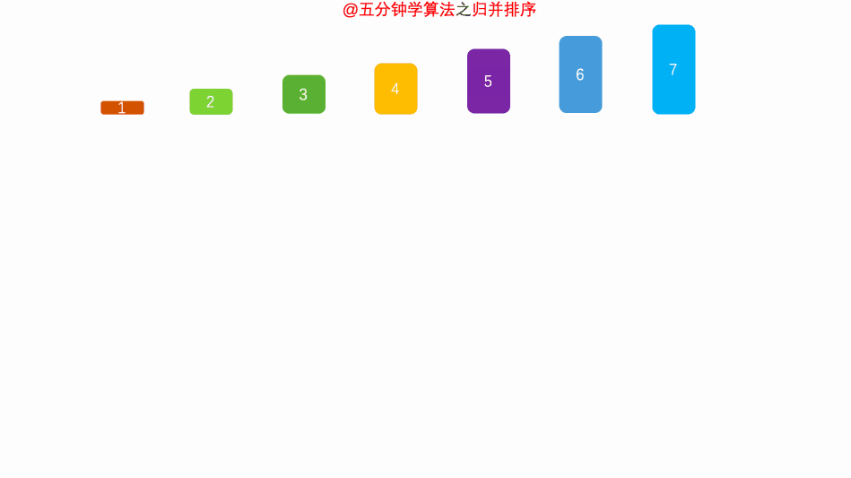

#  归并排序

　　归并排序是建立在归并操作上的一种有效的排序算法，1945 年由约翰·冯·诺伊曼首次提出。该算法是采用分治法（Divide and Conquer）的一个非常典型的应用，且各层分治递归可以同时进行。

　　归并排序是分治法的一个典型应用，它的主要思想是：将待排序序列分为两部分，对每部分递归地应用归并排序，在两部分都排好序后进行合并。

## 基本思想

　　归并排序算法是将两个（或两个以上）有序表合并成一个有序表，即把待排序序列分成若干个子序列，每个子序列是有序的。然后再把有序子序列合并为整体有序序列。


　　将已有序的子序列合并，得到完全有序的序列；即先使每个子序列有序，再使子序列间有序。若将两个有序表合并成一个有序表，称为二路归并。

　　例如，排序序列 （3，2，8，6，7，9，1，5）的过程是，先将序列分为两部分，（3，2，8，6）和 （7，9，1，5），然后对两部分分别引用归并排序，第一部分（3，2，8，6），第 2 部分（7，9，1，5），对两个部分分别进行归并排序，第 1 部分继续分为（3，2）和（8，6），（3，2）继续分为（3）和（2），（8，6）继续分为（8）和（6），之后进行合并得到（2，3），（6，8），再合并得到（2，3，6，8），第 2 部分进行归并排序得到（1，5，7，9），最后合并两部分得到（1，2，3，5，6，7，8，9）。

## 算法描述

　　归并排序可通过两种方式实现：

1. 自上而下的递归
2. 自下而上的迭代

### 递归法

　　假设序列共有 n 个元素：

1. 将序列每相邻两个数字进行归并操作，形成 floor(n/2) 个序列，排序后每个序列包含两个元素；
2. 将上述序列再次归并，形成 floor(n/4) 个序列，每个序列包含四个元素；
3. 重复步骤 2，直到所有元素排序完毕。


### 迭代法

1. 申请空间，使其大小为两个已经排序序列之和，该空间用来存放合并后的序列
2. 设定两个指针，最初位置分别为两个已经排序序列的起始位置
3. 比较两个指针所指向的元素，选择相对小的元素放入到合并空间，并移动指针到下一个位置。
4. 重复步骤 3 直到某一指针到达序列尾
5. 将另一序列剩下的所有元素直接复制到合并序列尾。

### 算法思路

　　归并操作（merge），也叫归并算法，指的是将两个顺序序列合并成一个顺序序列的方法。

　　如设有数列 {6，202，100，301，38，8，1}

　　初始状态：6，202，100，301，38，8，1

　　第一次归并后：{6，202}，{100，301}，{8，38}，{1}，比较次数：3；

　　第二次归并后：{6，100，202，301}，{1，8，38}，比较次数：4；

　　第三次归并后：{1，6，8，38，100，202，301}，比较次数：4；

　　总的比较次数为：3+4+4=11；

　　逆序数为 14。



## 代码实现

　　归并排序其实要做两件事：

* 分解：将序列每次拆半拆分
* 合并：将划分后的序列段两两排序合并

　　因此，归并排序实际上就是两个操作，拆分+合并。

　　下面是递归的方法：

```java
/**
 * 归并排序
 */
public class MergeSort {
    // 归并所需的辅助数组
    private static int[] aux;

    public static void sort(int[] a) {
        // 一次性分配空间
        aux = new int[a.length];
        sort(a, 0, a.length - 1);
    }

    public static void sort(int[] a, int low, int high) {
        if (low >= high) {
            return;
        }
        int mid = low + (high - low) / 2;
        //将左半边排序
        sort(a, low, mid);
        // 将右半边排序
        sort(a, mid + 1, high);
        merge(a, low, mid, high);
    }

    /**
     * 该方法先将所有元素复制到 aux[] 中，然后在归并回 a[] 中。
     * 方法在递归时（第二个 for 循环）进行了 4 个条件判断：
     * - 左半边用尽（取右半边的元素）
     * - 右半边用尽（取左半边的元素）
     * - 左半边的当前元素小于左半边的当前元素（取右半边的元素）
     * - 右半边的当前元素大于等于左半边的当前元素（取左半边的元素）
     *
     * @param a
     * @param low
     * @param mid
     * @param high
     */
    public static void merge(int[] a, int low, int mid, int high) {
        int i = low, j = mid + 1;
        // 存储要进行排序的部分数据
        for (int k = low; k <= high; k++) {
            aux[k] = a[k];
        }
        // 将 a[low...mid] 和 a[low+1...high] 归并
        for (int k = low; k <= high; k++) {
            if (i > mid) {
                // 左半边用尽
                a[k] = aux[j++];
            } else if (j > high) {
                // 右半边用尽
                a[k] = aux[i++];
            } else if (aux[j] < aux[i]) {
                // 左半边大于右半边
                a[k] = aux[j++];
            } else {
                // 右半边大于左半边
                a[k] = aux[i++];
            }
        }
    }
}

```

## 复杂度分析

　　以下是归并排序算法复杂度：

　　平均时间复杂度：O(n log2 n)

　　最好情况：O(n log2 n)

　　最坏情况：O(n log2 n)

　　空间复杂度：O(n)

　　从效率上看，归并排序可算是排序算法中的 “ 佼佼者 ”。假设数组长度为 n，那么拆分数组共需 log n，又每步都是一个普通的合并子数组的过程，时间复杂度为 O(n)，故其综合时间复杂度为 O(nlogn)。另一方面，归并排序多次递归过程中拆分的子数组需要保存在内存空间，其空间复杂度为 0(n)。

　　归并排序的时间复杂度为 O(nlogn)，它是一种稳定的排序，java.util.Arrays 类中的 sort 方法就是使用归并排序的变体来实现的。

## 总结与思考

　　归并排序最吸引人的性质是它能够保证将任意长度为 N 的数组排序所需时间与 NlogN 成正比，它的主要缺点则是它所需的额外空间和 N 成正比。


## 参考文章

1. [Java实现八大排序算法](https://www.cnblogs.com/morethink/p/8419151.html)
2. [从零开始学数据结构和算法 (五) 分治法 (二分查找、快速排序、归并排序)](https://juejin.im/post/5c945c245188252d863cc969)
3. [常见数据结构与算法整理总结（下）](https://www.jianshu.com/p/42f81846c0fb)

