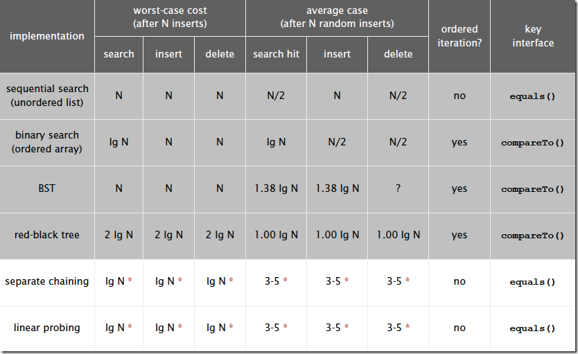

#  哈希查找

## 哈希查找的基本思想

　　算法思想：哈希的思路很简单，如果所有的键都是整数，那么就可以使用一个简单的无序数组来实现：将键作为索引，值即为其对应的值，这样就可以快速访问任意键的值。这是对于简单的键的情况，将其扩展到可以处理更加复杂的类型的键。

　　算法流程：

1. 用给定的哈希函数构造哈希表；
2. 根据选择的冲突处理方法解决地址冲突；
3. 在哈希表的基础上执行哈希查找。

　　哈希表是一个在时间和空间上做出权衡的经典例子。如果没有内存限制，那么可以直接将键作为数组的索引。那么所有的查找时间复杂度为 O(1)，如果没有时间限制，那么可以使用无序数组进行顺序查找，这样只需要很少的内存。哈希表使用了适度的时间和空间来在这两个计算之间找到了平衡。只需要调整哈希函数算法即可在时间和空间上做出取舍。

## 哈希查找的复杂度

　　单纯论查找复杂度：对于无冲突的 hash 表而言，查找复杂度为 O(1)（注意，在查找之前需要构建相应的 Hash 表）。

　　Hash 是一个典型以空间换时间的算法，比如原来一个长度为 100 的数组，对其查找，只需要遍历且匹配相应记录即可。从空间复杂度上来说，假如数组存储的是 byte 类型数据，那么该数组占 100 byte 空间。现在采用 Hash 算法，Hash 必须有一个规则，约束键与存储位置的关系，那么就需要一个固定长度的 hash 表，此时，仍然是 100byte 的数组，假设需要的 100byte 用来记录键与位置的关系，那么总的空间为 200bytes，而且用于记录规则的表大小会根据规则，大小可能是不定的。



## 哈希查找的代码

```java
/**
 * 哈希查找
 */
public class HashSearch {

    /**
     * 用哈希查找在 nums 数组种查找 key 的 index
     * 先将 nums 数组的元素，放入 hashmap 中，key 为值，value 为 index
     * 然后根据 key 查找有没有这个值
     * 但是这个方法，如果 nums 数组由重复的元素，只会返回最后的那个 index，因为前面的被覆盖了
     *
     * @param nums
     * @param key
     * @return 如果数组中没有这个 key，返回 -1
     */
    public static int hashSearch(int[] nums, int key) {
        int length = nums.length;
        HashMap<Integer, Integer> map = new HashMap<>();
        for (int i = 0; i < length; i++) {
            map.put(nums[i], i);
        }
        if (map.containsKey(key)) {
            int index = map.get(key);
            return index;
        }
        return -1;
    }

    public static void main(String[] args) {
        int a[] = new int[]{9, 1, 2,  7, 4, 8, 6, 3, 5};
        System.out.println("search 7:" + hashSearch(a,7));
        System.out.println("search 11:" + hashSearch(a,11));
    }
}

```

　　输出：

```java
search 7:3
search 11:-1
```

## 参考文章

1. [查找算法总结-java版](https://blog.csdn.net/xushiyu1996818/article/details/90604118)

