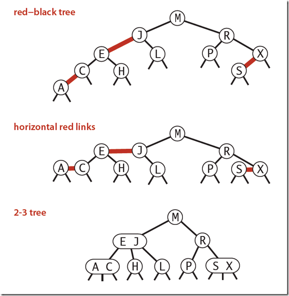
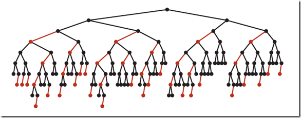

#  平衡查找树之红黑树

## 1. 红黑树的基本思想

　　2-3 查找树能保证在插入元素之后能保持树的平衡状态，最坏情况下即所有的子节点都是 2-nodes，树的高度为 lgn，从而保证了最坏情况下的时间复杂度。但是 2-3 树实现起来比较复杂，于是就有了一种简单实现 2-3 树的数据结构，即红黑树（Red-Black Tree）。

　　基本思想：红黑树的思想就是对 2-3 查找树进行编码，尤其是对 2-3 查找树中的 3-nodes 节点添加额外的信息。红黑树中将节点之间的链接分为两种不同类型，红色链接，他用来链接两个 2-nodes 节点来表示一个 3-nodes 节点。黑色链接用来链接普通的 2-3 节点。特别的，使用红色链接的两个 2-nodes 来表示一个 3-nodes 节点。特别的，使用红色链接的两个 2-nodes 来表示一个 3-nodes 节点，并且向左倾斜，即一个 2-node 是另一个 2-node 的左子节点。这种做法的好处是查找的时候不用做任何修改，和普通的二叉查找树相同。

## 2. 红黑树的定义

　　红黑树是一种具有红色和黑色链接的平衡查找树，同时满足：

* 红色节点向左倾斜
* 一个节点不可能有两个红色链接
* 整个树完全黑色平衡，即从根节点到叶子节点的路径上，黑色链接的个数都相同。

　　下图可以看到红黑树其实是 2-3 树的另外一种表现形式：如果将红色的连线水平绘制，那么他链接的两个 2-node 节点就是 2-3 树种的一个 3-node 节点了。

　　红黑树的性质：这个树完全黑色平衡，即从根节点到叶子节点的路径上，黑色链接的个数都相同（2-3 树的第 2 个性质，从根节点到叶子节点的距离都相等）。

　　复杂度分析：最坏的情况就是，红黑树中除了最左侧路径全部是由 3-node 节点组成，即红黑相间的路径长度是全黑路径长度的 2 倍。

　　下图是一个典型的红黑树，从中可以看到最长的路径（红黑相间的路将）是最短路径的 2 倍：

## 3. 红黑树的代码

## 4. 参考文章

1. [查找算法总结-java版](https://blog.csdn.net/xushiyu1996818/article/details/90604118)

