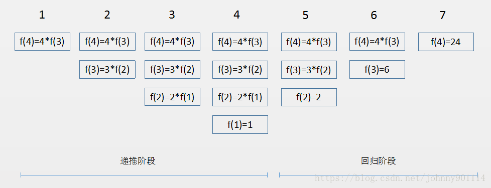

#  递归

## 1. 递归的基本概念

　　在计算机科学领域中，递归是通过函数调用本身来实现的。每次成功调用都使得问题的答案范围越来越小，越来越接近问题的答案。

　　下面来看一下一个简单经典的递归程序：给定一个正整数 n，求 n 的阶乘。

　　n 的阶乘是 1 到 n 之间所有整数的乘积。例如 5 的阶乘就是 5 * 4 * 3 * 2 * 1 的积。

　　也就是 n 的阶乘 = n * (n-1) * (n-2) * ... * 1，换个角度，n! = n * (n-1)!，(n-1)! = (n-1)(n-2)!。

　　1！= 1，那么这个问题就可以通过递归很好实现了：

```java
    public int factorial(int num) {
        if (num == 1) {
            return 1;
        }
        return num * factorial(num - 1);
    }
```

　　当 n=1 的时候说明已经到了最小解了，因为 n! 依赖 (n-1)! 的结果，后面以此类推，最后到了 1 的阶乘，前面的一来就依次有解了。

### 1.1. 基线条件

　　基线条件（base case）就是递归的终止条件，无限递归的函数也没有意义。无限递归不等于无限循环，无限递归是导致栈溢出，而循环不会。

　　上面递归程序中的 if (n==1) 就是基线条件。

### 1.2. 递归条件

　　递归条件（recursive case）就是方法调用本身的条件。

　　上面的递归程序中，递归条件就是 n 不等于 1。

### 1.3. 递归和栈

　　递归本质也是函数调用函数，当调用一个函数的时候，会在调用栈（call stack）里创建栈帧（frame）。Java 的函数调用栈与线程一同被创建，属于线程私有，主要用于存储栈帧。

　　栈帧随方法的调用而创建，方法结束而销毁。

　　栈帧由以下几个部分组成：

1. 本地变量（Local Variables）

   是一个数组。用于保存本地的相关变量。数组的长度在编译阶段就已经确定。一个本地变量可以保存 boolean、byte、char、short、int、float、reference(引用) 和 returnAddress（返回地址）。如果要保存一个 double 或 long 型的变量，需要两个连续地址的本地变量（也就是占用数组的两个大小）。

2. 操作数栈（Operand Stack）

   操作数栈是一个后进先出的栈。在操作数栈中可以一个位置保存 double 或 long 。

   操作数栈主要用于算术运算和方法参数传递。

   比如在方法中执行 a+b，首先会把 a 和 b 压入操作数栈中，然后把 a 和 b 弹出栈进行相加，然后把结果压入操作数栈中。

   又比如在方法中调用另一个方法，操作数栈用于保存被调用方法的参数和接受该方法的返回值。

3. 动态链接（Dynamic Linking）

   每个栈帧都包含一个指向运行时的常量池的引用，持有这个引用是为了当前方法支持动态连接（dynamic linking）。在 Class 文件中，方法的调用和变量的访问都是通过符号引用（symbolic reference）。动态连接把这些符号引用转译成具体的方法引用（method reference）。

4. 方法返回地址

   方法执行完毕有两种情况：

   正常执行完毕（Normal Method Invocation Completion）

   异常执行完毕（Abrupt Method Invocation Completion）

   如果没有遇到异常退出的情况，会将返回值传递给该方法的调用者，把返回值压入上层方法的操作数栈。如果执行中遇到异常，并且没有处理这个异常，当前方法退出，这个时候没有值返回。

## 2. 微观分析递归

　　对上面的阶乘递归程序，对其进行底层分析下。求 4 的阶乘。

　　为了方便描述，factorial 简写为 f，可以把每个块当做一个栈帧，简化了其内部细节：



　　从递归到回归阶段就整个递归过程。

## 3. 宏观分析递归

　　通过上面的对递归的微观温习，感觉很简单，因为这是比较简单的递归程序。

　　如果一个方法中有多种情况下调用方法本身，通过微观分析就会比较复杂。这时候可以通过宏观入手。如果一直纠结这个递归细节，会很难理解这个递归程序。

　　例如上面的阶乘递归程序，不就是 n * (n-1) 直到 n=1，很容易实现，甚至都不用关心调用栈的具体细节。

　　从宏观上去思考，更容易把思路放到具体的逻辑上，而不是具体的递归细节。

## 4. 递归的优点与不足

　　递归的优点，在多数情况下，递归的实现更加优雅，代码逻辑的可读性更强。但是，如果递归的次数达到一定的数量就会抛出栈溢出错误。

　　如果使用循环，程序的性能可能更高；如果使用递归，程序可能更容易理解。

### 4.1. 尾部递归

　　如果一个函数中所有递归形式的调用都出现在函数的末尾，递归调用在整个函数中是最后执行的语句，并且它的返回值不属于表达式的一部分，称之为尾递归。

　　例如上面阶乘递归程序就不是尾递归，因为函数最后一行的递归调用属于表达式的一部分：

```java
    public int factorial(int num) {
        if (num == 1) {
            return 1;
        }
        return num * factorial(num - 1); // 递归调用属于表达式的一部分
    }
```

　　下面把这个程序改造成尾递归的形式：

```java
    public int factorial2(int num, int result) {
        if (num == 1) {
            return result;
        }
        return factorial2(num - 1, num * result);
    }
```

　　需要注意的是，不是所有的语言都支持尾递归。

　　Java 没有对尾递归做优化。分别对阶乘实现一个普通的递归和一个尾部递归：

```java
    public int factorial(int num) {
        if (num == 1) {
            return 1;
        }
        return num * factorial(num - 1); // 递归调用属于表达式的一部分
    }

    public int factorial2(int num, int result) {
        if (num == 1) {
            return result;
        }
        return factorial2(num - 1, num * result);
    }
```

　　通过 javap 命名查看编译后的文件：

```java
public int factorial(int);
    Code:
       0: iload_1
       1: iconst_1
       2: if_icmpne     7
       5: iconst_1
       6: ireturn
       7: iload_1
       8: aload_0
       9: iload_1
      10: iconst_1
      11: isub
      12: invokevirtual #2                  // Method factorial:(I)I
      15: imul
      16: ireturn

  public int factorial2(int, int);
    Code:
       0: iload_1
       1: iconst_1
       2: if_icmpne     7
       5: iload_2
       6: ireturn
       7: aload_0
       8: iload_1
       9: iconst_1
      10: isub
      11: iload_1
      12: iload_2
      13: imul
      14: invokevirtual #3                  // Method factorial2:(II)I
      17: ireturn
```

　　Java 没有对尾递归做任何优化处理，Java 虽然没有对尾部递归做出优化，但是尾部递归是没有 “ 回归阶段 ”，因为最后一次方法的执行就可以得到最终结果，可以在 Eclipse 上分别对上面的两种递归调试下。

　　C 和 C++ 对尾部递归的优化是类似循环的方式，这样就不会每次递归的时候都去创建栈帧。如：

```c++
unsigned fac_tailrec(unsigned acc, unsigned n) {
	TOP:
		if (n < 2) return acc;
		acc = n * acc;
		n = n - 1;
        goto TOP;
}
```

### 4.2. 循环

　　有的时候解决问题使用普通的循环更加优雅，比如对 [1 ~ n] 的数求和，使用循环累加即可。

```java
    public int sum(int n) {
        int count = 0;
        for (int i = 1; i <= n; i++) {
            count += i;
        }
        return count;
    }
```

　　如果非要使用递归也行，只是可读性就没有循环直观了：

```java
    public int sum2(int n) {
        if (n == 1) {
            return 1;
        }
        return n + sum2(n - 1);
    }
```

## 5. 参考文章

1. [数据结构与算法（五）深入理解递归](https://chiclaim.blog.csdn.net/article/details/80536238)

