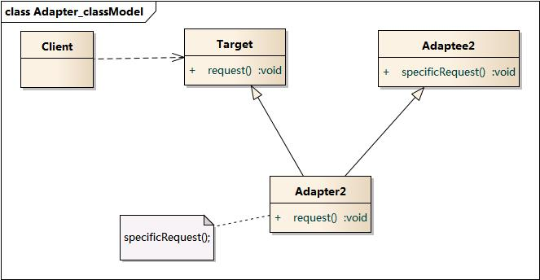

# 关于设计模式的常见问题

# 1. 描述熟悉的设计模式，并说明使用

## 1.1. 单例模式

* 单例模式确保某一个类只有一个实例，而且自行实例化并向整个系统提供这个实例，这个类称为单例类，它提供全局访问的方法。单例模式的要点有三个：一是某个类只能有一个实例；二是它必须自行创建这个实例；三是它必须自行向整个系统提供这个实例。单例模式是一种对象创建型模式。
* 单例模式只包括一个单例角色：在单例类的内部实现只生成一个实例，同时它提供了一个静态的工厂方法，让客户可以使用它的唯一实例；为了防止在外部对其实例化，将其构造函数设计为私有。
* 单例模式的目的是保证一个类仅有一个实例，并提供一个访问它的全局访问点。单例类拥有一个私有构造函数，确保用户无法通过 new 关键字直接实例化它。除此之外，该模式中包含了一个静态私有成员变量与静态公有的工厂方法。该工厂方法负责检验实例的存在性并实例化自己，然后存储在静态成员变量中，以确保只有一个实例被创建。
* 单例模式的主要优点在于提供了对唯一实例的受控访问并可以节约系统资源；其主要缺点在于因为缺少抽象层而难以扩展，且单例类职责过重。
* 单例模式适用情况包括：系统只需要一个实例对象；客户调用类的单例实例只允许使用一个公共访问点。

### 1.1.1. 五种单例模式的实现

#### 1.1.1.1. 懒汉式，线程不安全

　　这种方式是最基本的实现方式，这种实现最大的问题就是不支持多线程。因为没有加锁 synchronized，所以严格意义上它并不算单例模式。
这种方式 lazy loading 很明显，不要求线程安全，在多线程不能正常工作。

```java
 public class Singleton {  
     private static Singleton instance;  
     private Singleton (){}  
   
     public static Singleton getInstance() {  
     	if (instance == null) {  
         	instance = new Singleton();  
     	}  
     	return instance;  
     }  
} 
```

#### 1.1.1.2. 懒汉式，线程安全

　　这种方式具备很好的 lazy loading，能够在多线程中很好的工作，但是，效率很低，99% 情况下不需要同步。
　　优点：第一次调用才初始化，避免内存浪费。
　　缺点：必须加锁 synchronized 才能保证单例，但加锁会影响效率。
getInstance() 的性能对应用程序不是很关键（该方法使用不太频繁）。

```java
 public class Singleton {  
     private static Singleton instance;  
     private Singleton (){}  
     public static synchronized Singleton getInstance() {  
     	if (instance == null) {  
         	instance = new Singleton();  
     	}  
     	return instance;  
     }  
 }
```

#### 1.1.1.3. 饿汉式

　　这种方式比较常用，但容易产生垃圾对象。
　　优点：没有加锁，执行效率会提高。
　　缺点：类加载时就初始化，浪费内存。
　　它基于 classloder 机制避免了多线程的同步问题，不过，instance 在类装载时就实例化，虽然导致类装载的原因有很多种，在单例模式中大多数都是调用 getInstance 方法， 但是也不能确定有其他的方式（或者其他的静态方法）导致类装载，这时候初始化 instance 显然没有达到 lazy loading 的效果。

```java
 public class Singleton {  
     private static Singleton instance = new Singleton();  
     private Singleton (){}  
     public static Singleton getInstance() {  
     	return instance;  
     }  
 }
```

#### 1.1.1.4. 双检锁/双重检验锁（DCL，即 double-checked locking）

　　这种方式采用双锁机制，安全且在多线程情况下能保持高性能。
getInstance() 的性能对应用程序很关键。

```java
 public class Singleton {  
     private volatile static Singleton singleton;  
     private Singleton (){}  
     public static Singleton getSingleton() {  
     	if (singleton == null) {  
         	synchronized (Singleton.class) {  
         		if (singleton == null) {  
             		singleton = new Singleton();  
         		}  
         	}  
     	}  
     	return singleton;  
     }  
 }
```

#### 1.1.1.5. 登记式/静态内部类

　　这种方式能达到双检锁方式一样的功效，但实现更简单。对静态域使用延迟初始化，应使用这种方式而不是双检锁方式。这种方式只适用于静态域的情况，双检锁方式可在实例域需要延迟初始化时使用。
这种方式同样利用了 classloder 机制来保证初始化 instance 时只有一个线程，它跟第 3 种方式不同的是：第 3 种方式只要 Singleton 类被装载了，那么 instance 就会被实例化（没有达到 lazy loading 效果），而这种方式是 Singleton 类被装载了，instance 不一定被初始化。因为 SingletonHolder 类没有被主动使用，只有显示通过调用 getInstance 方法时，才会显示装载 SingletonHolder 类，从而实例化 instance。想象一下，如果实例化 instance 很消耗资源，所以想让它延迟加载，另外一方面，又不希望在 Singleton 类加载时就实例化，因为不能确保 Singleton 类还可能在其他的地方被主动使用从而被加载，那么这个时候实例化 instance 显然是不合适的。这个时候，这种方式相比第 3 种方式就显得很合理。

```java
 public class Singleton {  
     private static class SingletonHolder {  
     	private static final Singleton INSTANCE = new Singleton();  
     }  
     private Singleton (){}  
     public static final Singleton getInstance() {  
     	return SingletonHolder.INSTANCE;  
     }  
 }
```

#### 1.1.1.6. 枚举

　　这种实现方式还没有被广泛采用，但这是实现单例模式的最佳方法。它更简洁，自动支持序列化机制，绝对防止多次实例化。
这种方式是 Effective Java 作者 Josh Bloch 提倡的方式，它不仅能避免多线程同步问题，而且还自动支持序列化机制，防止反序列化重新创建新的对象，绝对防止多次实例化。不过，由于 JDK1.5 之后才加入 enum 特性，用这种方式写不免让人感觉生疏，在实际工作中，也很少用。
　　不能通过 reflection attack 来调用私有构造方法。

```java
 public enum Singleton {  
     INSTANCE;  
     public void whateverMethod() {  
     }  
 } 
```

　　一般情况下，不建议使用第 1 种和第 2 种懒汉方式，建议使用第 3 种饿汉方式。只有在要明确实现 lazy loading 效果时，才会使用第 5 种登记方式。如果涉及到反序列化创建对象时，可以尝试使用第 6 种枚举方式。如果有其他特殊的需求，可以考虑使用第 4 种双检锁方式。

## 1.2. 工厂模式

　　工厂模式分为简单工厂模式、工厂方法模式和抽象工厂模式。

### 1.2.1. 简单工厂模式


* 创建型模式对类的实例化过程进行了抽象，能够将对象的创建与对象的使用过程分离。
* 简单工厂模式又称为静态工厂方法模式，它属于类创建型模式。在简单工厂模式中，可以根据参数的不同返回不同类的实例。简单工厂模式专门定义一个类来负责创建其他类的实例，被创建的实例通常都具有共同的父类。
* 简单工厂模式包括三个角色：**工厂角色**负责实现创建所有实例的内部逻辑；**抽象产品角色**是所创建的所有对象的父类，负责描述所有实例所共有的公共接口；**具体产品角色**是创建目标，所有创建的对象都充当这个角色的某个具体类的实例。
* 简单工厂模式的要点在于：当你需要什么，只需要传入一个正确的参数，就可以获取你所需要的对象，而无须知道其创建细节。
* 简单工厂模式最大的**优点**在于实现对象的创建和对象的使用分离，将对象的创建交给专门的工厂类负责，但是其最大的**缺点**在于工厂类不够灵活，增加新的具体产品需要修改工厂类的判断逻辑代码，而且产品较多时，工厂方法代码将会非常复杂。
* 简单工厂模式适用情况包括：工厂负责创建的对象比较少；客户端只知道传入工厂类的参数，对于如何创建对象不关心。

### 1.2.2. 工厂方法模式


* 工厂方法模式又称为工厂模式，它属于类创建性模式。在工厂方法模式中，工厂父类负责定义创建产品对象的公共接口，而工厂子类则负责生成具体的产品对象，这样做的目的是将产品类的实例化操作延迟到工厂子类中完成，即通过工厂子类来确定究竟应该实例化哪一个具体产品类。
* 工厂方法模式包含四个角色：**抽象产品**是定义产品的接口，是工厂方法模式所创建对象的超类型，即产品对象的共同父类或接口；**具体产品**实现了抽象产品接口，某种类型的具体产品由专门的具体工厂创建，它们之间往往一一对应；**抽象工厂**中声明了工厂方法，用于返回一个产品，它是工厂方法模式的核心，任何在模式中创建的工厂类都必须实现该接口；**具体工厂**是抽象工厂类的子类，实现了抽象工厂中定义的工厂方法，并可由客户调用，返回一个具体产品类的实例。
* 工厂方法模式是简单工厂模式的进一步抽象和推广。由于使用了面向对象的多态性，工厂方法模式保持了简单工厂模式的优点，而且克服了它的缺点。在工厂方法模式中，核心的工厂类不再负责所有产品的创建，而是将具体创建工作交给子类去做。这种核心类仅仅负责给出具体工厂必须实现的接口，而不负责产品类被实例化这种细节，这使得工厂方法模式可以允许系统在不修改工厂角色的情况下引进新产品。
* 工厂方法模式的主要**优点**是增加新的产品类时无须修改现有系统，并封装了产品对象的创建细节，系统具有良好的灵活性和可扩展性；其**缺点**在于增加新产品的同时需要增加新的工厂，导致系统类的个数成双增加，在一定程度上增加了系统的复杂性。
* 工厂方法模式使用情况包括：一个类不知道它所需要的对象的类；一个类通过其子类来指定创建哪个对象；将创建对象的任务委托给多个工厂子类中的某一个，客户端在使用时可以无须关心是哪一个工厂子类创建产品子类，需要时再动态指定。

### 1.2.3. 抽象工厂模式

为了更清晰地理解工厂方法模式，需要先引入两个概念：

- **产品等级结构**：产品等级结构即产品的继承结构，如一个抽象类是电视机，其子类有海尔电视机、海信电视机、TCL 电视机，则抽象电视机与具体品牌的电视机之间构成了一个产品等级结构，抽象电视机是父类，而具体品牌的电视机是其子类。
- **产品族**：在抽象工厂模式中，产品族是指有同一个工厂生产的，位于不同产品等级结构中的一组产品，如海尔电器工厂生产的海尔电视机、海尔电冰箱，海尔电视机位于电视机产品等级结构中，海尔电冰箱位于电冰箱产品等级结构中。

抽象工厂：生产电视机，生产电冰箱两个接口。

具体工厂：海尔工厂，生产电视机接口返回的就是海尔电视机，生产电冰箱接口返回的就是海尔电冰箱。TCL 工厂，生产电视机接口返回的就是 TCL 电视机，生产电冰箱接口返回的就是 TCL 电冰箱。

抽象产品：电视机，电冰箱。

电视机抽象产品：观看接口。

电冰箱抽象产品：存储食物接口。

海尔电视机和 TCL 电视机 实现观看接口。

海尔电冰箱和 TCL 电冰箱实现存储食物接口。


* 抽象工厂模式提供一个创建一系列相关或相互依赖对象的接口，而无须指定它们具体的类。抽象工厂模式又称为 Kit 模式，属于对象创建型模式。
* 抽象工厂模式包含四个角色：**抽象工厂**用于声明生成抽象产品的方法；**具体工厂**实现了抽象工厂声明的生成抽象产品的方法，生成一组具体产品，这些产品构成了一个产品族，每一个产品都位于某个产品等级结构中；**抽象产品**为每种产品声明接口，在抽象产品中定义了产品的抽象业务方法；**具体产品**定义具体工厂生产的具体产品对象，实现抽象产品接口中定义的业务方法。
* 抽象工厂模式是所有形式的工厂模式中最为抽象和最具一般性的一种形态。抽象工厂模式与工厂方法模式最大的区别在于：工厂方法模式针对的是一个产品等级结构，而抽象工厂模式则需要面对多个产品等级结构。
* 抽象工厂模式的主要**优点**是隔离了具体类的生成，使得客户并不需要知道什么被创建，而且每次可以通过具体工厂类创建一个产品族中的多个对象，增加或者替换产品族比较方便，增加新的具体工厂和产品族很方便；主要**缺点**在于增加新的产品等级结构很复杂，需要修改抽象工厂和所有的具体工厂类，对 “ 开闭原则 ” 的支持呈现倾斜性。
* 抽象工厂模式适用情况包括：一个系统不应当依赖于产品类实例如何被创建、组合和表达的细节；系统中有多于一个的产品族，而每次只使用其中某一产品族；属于同一个产品族的产品将在一起使用；系统提供一个产品类的库，所有的产品以同样的接口出现，从而使客户端不依赖于具体实现。

## 1.3. 观察者模式

　观察者模式包含如下角色：

* Subject：目标
* ConcreteSubject：具体目标
* Observer：观察者
* ConcreteObserver：具体观察者


* 观察者模式定义对象间的一种一对多依赖关系，使得每当一个对象状态发生改变时，其相关依赖对象皆得到通知并被自动更新。观察者模式又叫做发布 - 订阅模式、模型 - 视图模式、源 - 监听器模式或从属者模式。观察者模式是一种对象行为型模式。
* 观察者模式包含四个角色：**目标**又称为主题，它是指被观察的对象；**具体目标**是目标类的子类，通常它包含经常发生改变的数据，当它的状态发生改变时，向它的各个观察者发出通知；**观察者**将对观察目标的改变做出反应；在**具体观察者**中维护一个指向具体目标对象的引用，它存储具体观察者的有关状态，这些状态需要和具体目标的状态保持一致。
* 观察者模式定义了一种一对多的依赖关系，让多个观察者对象同时监听某一个目标对象，当这个目标对象的状态发生改变时，会通知所有观察者对象，使它们能够自动更新。
* 观察者模式的主要**优点**在于可以实现表示层和数据逻辑层的分离，并在观察目标和观察者之间建立一个抽象的耦合，支持广播通信；其主要**缺点**在于如果一个观察目标对象有很多直接和间接的观察者的话，观察目标会触发它们之间进行循环调用，可能导致系统奔溃。
* 观察者模式使用情况包括：一个抽象模型有两个方面，其中一个方面依赖于另一个方面；一个对象的改变将导致其他一个或多个对象也发生改变，而不知道具体有多少对象将发生改变；一个对象必须通知其他对象，而并不知道这些对象是谁；需要在系统中创建一个触发链。
* 在 JDK 的 java.util 包中，提供了 Observable 类以及 Observer 接口，它们构成了 Java 语言对观察者模式的支持。

## 1.4. 代理模式

* 在代理模式中，要求给某一个对象提供一个代理，并由代理对象控制对原对象的引用。代理模式的英文叫做 Proxy 或 Surrogate，它是一种对象结构型模式。
* 代理模式包含三个角色：抽象主题角色声明了真实主题和代理主题的共同接口；代理主题角色内部包含对真实主题的引用，从而可以在任何时候操作真实主题对象；真实主题角色定义了代理角色所代表的真实对象，在真实主题角色中实现了真实的业务操作，客户端可以通过代理主题角色间接调用真实主题角色中定义的方法。
* 代理模式的优点在于能够协调调用者和被调用者，在一定程度上降低了系统的耦合度；其缺点在于由于在客户端和真实主题之间增加了代理对象，因此有些类型的代理模式可能会造成请求的处理速度变慢，并且实现代理模式需要额外的工作，有些代理模式的实现非常复杂。远程代理为一个位于不同的地址空间的对象提供一个本地的代表对象，它使得客户端可以访问在远程机器上的对象，远程机器可能具有更好的计算性能与处理速度，可以快速响应并处理客户端请求。
* 如果需要创建一个资源消耗较大的对象，先创建一个消耗较小的对象来表示。正式对象只在需要时才会被真正创建，这个小对象称为虚拟代理。虚拟代理通过使用一个小对象来表示一个大对象，可以减少系统资源的消耗，对系统进行优化并提高运行速度。
* 保护代理可以控制对一个对象的访问，可以给不同的用户提供不同级别的使用权限。

### 1.4.1. 静态代理和动态代理

　　Java 中的代理按照代理类生成时机不同又分为静态代理和动态代理。静态代理代理类在编译期就生成，而动态代理代理类则是在 Java 运行时动态生成。

#### 1.4.1.1. 静态代理

　　Java 中的静态代理要求代理类(ProxySubject)和委托类(RealSubject)都实现同一个接口(Subject)。静态代理中代理类在编译期就已经确定，而动态代理则是 JVM 运行时动态生成，静态代理的效率相对动态代理来说相对高一些，但是静态代理代码冗余大，一单需要修改接口，代理类和委托类都需要修改。
　　举个例子：

**接口(Subject)**：

```csharp
interface HelloService {
    void sayHello();
}
```

**委托类**：

```java
class HelloServiceImpl implements HelloService {
    @Override
    public void sayHello() {
        System.out.println("Hello World!");
    }
}
```

**代理类**：

```java
class HelloServiceProxy implements HelloService {
    private HelloService helloService;
    
    public HelloServiceProxy(HelloService helloService) {
        this.helloService = helloService;
    }
    
    @Override
    public void sayHello() {
        System.out.println("Before say hello...");
        helloService.sayHello();
        System.out.println("After say hello...");
    }
}
```

**测试类**：

```cpp
public class HelloServiceProxyTest {
    
    public static void main(String[] args) {
        HelloService helloService = new HelloServiceImpl();
        HelloServiceProxy proxy = new HelloServiceProxy(helloService);
        proxy.sayHello();
    }
}
```

**输出结果**：

```swift
Before say hello...
Hello World!
After say hello...
```

#### 1.4.1.2. 动态代理

　　Java 中的动态代理依靠反射来实现，代理类和委托类不需要实现同一个接口。委托类需要实现接口，否则无法创建动态代理。代理类在 JVM 运行时动态生成，而不是编译期就能确定。
　　Java动态代理主要涉及到两个类：`java.lang.reflect.Proxy`和`java.lang.reflect.InvocationHandler`。代理类需要实现 InvocationHandler 接口或者创建匿名内部类，而 Proxy 用于创建动态动态。
　　 用动态代理来实现HelloService：

**接口(Subject)**：

```csharp
interface HelloService {
    void sayHello();
}
```

**委托类**：

```java
class HelloServiceImpl implements HelloService {
    @Override
    public void sayHello() {
        System.out.println("Hello World!");
    }
}
```

**动态代理类**：

```csharp
class HelloServiceDynamicProxy {

    private HelloService helloService;
    public HelloServiceDynamicProxy(HelloService helloService) {
        this.helloService = helloService;
    }

    public Object getProxyInstance() {
        return Proxy.newProxyInstance(helloService.getClass().getClassLoader(), helloService.getClass().getInterfaces(), new InvocationHandler() {
            @Override
            public Object invoke(Object proxy, Method method, Object[] args) throws Throwable {
                System.out.println("Before say hello...");
                Object ret = method.invoke(helloService, args);
                System.out.println("After say hello...");
                return ret;
            }
        });
    }
}
```

**测试类**：

```cpp
public class HelloServieDynamicProxyTest {
    public static void main(String[] args){
        HelloService helloService = new HelloServiceImpl();
        HelloService dynamicProxy = (HelloService) new HelloServiceDynamicProxy(helloService).getProxyInstance();
        dynamicProxy.sayHello();
    }
}
```

**输出结果**：

```swift
Before say hello...
Hello World!
After say hello...
```

#### 1.4.1.3. 总结

1. 静态代理实现较简单，代理类在编译期生成，效率高。缺点是会生成大量的代理类。
2. JDK 动态代理不要求代理类和委托类实现同一个接口，但是委托类需要实现接口，代理类需要实现 InvocationHandler 接口。
3. 动态代理要求代理类 InvocationHandler 接口，通过反射代理方法，比较消耗系统性能，但可以减少代理类的数量，使用更灵活。

## 1.5. 适配者模式

　　适配器模式有对象适配器和类适配器两种实现：

　　对象适配器：


　　类适配器：


* 结构型模式描述如何将类或者对象结合在一起形成更大的结构。
* 适配器模式用于将一个接口转换成客户希望的另一个接口，适配器模式使接口不兼容的那些类可以一起工作，其别名为包装器。适配器模式既可以作为类结构性模式，也可以作为对象结构性模式。
* 适配器模式包含四个角色：**目标抽象类**定义客户要用的特定领域的接口；**适配器类**可以调用另一个接口，作为一个转换器，对适配者和抽象目标类进行适配，它是适配器模式的核心；**适配者类**是被适配的角色，它定义了一个已经存在的接口，这个接口需要适配；在**客户类**中针对目标抽象类进行编程，调用在目标抽象类中定义的业务方法。
* 在类适配器模式中，适配器类实现了目标抽象类接口并继承了适配者类，并在目标抽象类的实现方法中调用所继承的适配者类的方法；在对象适配器模式中，适配器类继承了目标抽象类并定义了一个适配者类的对象实例，在所继承的目标抽象类方法中调用适配者类的相应业务方法。
* 适配器模式的主要优点是将目标类和适配者类解耦，增加了类的透明性和复用性，同时系统的灵活性和扩展性都非常好，更换适配器或者增加新的适配器都非常方便，符合 “ 开闭原则 ”；类适配器模式的缺点是适配器类在很多编程语言中不能同时适配多个适配者类，对象适配器模式的缺点是很难置换适配者类的方法。
* 适配器模式适用情况包括：系统需要使用现有的类，而这些类的接口不符合系统的需要；想要建立一个可以重复使用的类，用于与一些彼此之间没有太大关联的一些类一起工作。

## 1.6. 装饰模式

- 装饰模式用于动态地给一个对象增加一些额外的职责，就增加对象功 能来说，装饰模式比生成子类实现更为灵活。它是一种对象结构型模 式。
- 装饰模式包含四个角色：抽象构件定义了对象的接口，可以给这些对 象动态增加职责（方法）；具体构件定义了具体的构件对象，实现了 在抽象构件中声明的方法，装饰器可以给它增加额外的职责（方法）； 抽象装饰类是抽象构件类的子类，用于给具体构件增加职责，但是具 体职责在其子类中实现；具体装饰类是抽象装饰类的子类，负责向构 件添加新的职责。
- 使用装饰模式来实现扩展比继承更加灵活，它以对客户透明的方式动 态地给一个对象附加更多的责任。装饰模式可以在不需要创造更多子 类的情况下，将对象的功能加以扩展。
- 装饰模式的主要优点在于可以提供比继承更多的灵活性，可以通过一种动态的 方式来扩展一个对象的功能，并通过使用不同的具体装饰类以及这些装饰类的 排列组合，可以创造出很多不同行为的组合，而且具体构件类与具体装饰类可 以独立变化，用户可以根据需要增加新的具体构件类和具体装饰类；其主要缺 点在于使用装饰模式进行系统设计时将产生很多小对象，而且装饰模式比继承 更加易于出错，排错也很困难，对于多次装饰的对象，调试时寻找错误可能需 要逐级排查，较为烦琐。
- 装饰模式适用情况包括：在不影响其他对象的情况下，以动态、透明的方式给 单个对象添加职责；需要动态地给一个对象增加功能，这些功能也可以动态地 被撤销；当不能采用继承的方式对系统进行扩充或者采用继承不利于系统扩展 和维护时。
- 装饰模式可分为透明装饰模式和半透明装饰模式：在透明装饰模式中，要求客 户端完全针对抽象编程，装饰模式的透明性要求客户端程序不应该声明具体构 件类型和具体装饰类型，而应该全部声明为抽象构件类型；半透明装饰模式允 许用户在客户端声明具体装饰者类型的对象，调用在具体装饰者中新增的方法。

# 2. 替换多重嵌套的if else写法

https://blog.csdn.net/u010375903/article/details/81192507

https://blog.csdn.net/weixin_33751566/article/details/91387462

使用工厂模式来实现对多重嵌套的 if else 的替换。

根据不同的条件，使用不同的方法。

```java
@Override
    public void onClick(View view) {
        int i = view.getId();
        if (i == R.id.tv_forget_gestrue_pwd) {
            showForgetGesturePasswordTips();
 
        } else if (i == R.id.tv_other_account_login) {
            showSwitchAccountsTips();
 
        }
    }
```

```java
public class StrategyFactory {
    public static final int KEY_GESTURE_PWD = R.id.tv_forget_gestrue_pwd;
    public static final int KEY_OTHER_ACCOUNT_LOGIN = R.id.tv_other_account_login;
 
    private static StrategyFactory factory = new StrategyFactory();
    private StrategyFactory(){
    }
    private static Map<Integer,Strategy> strategyMap = new HashMap<Integer,Strategy>();
    static{
        strategyMap.put(KEY_GESTURE_PWD, new GesturePwdStrategy());
        strategyMap.put(KEY_OTHER_ACCOUNT_LOGIN, new OtherAccountLoginStrategy());
    }
    public Strategy creator(int pType){
        return strategyMap.get(pType);
    }
    public static StrategyFactory getInstance(){
        return factory;
    }
}
```

