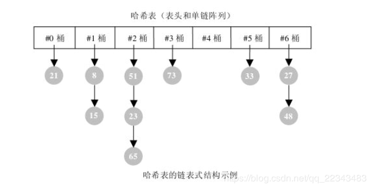
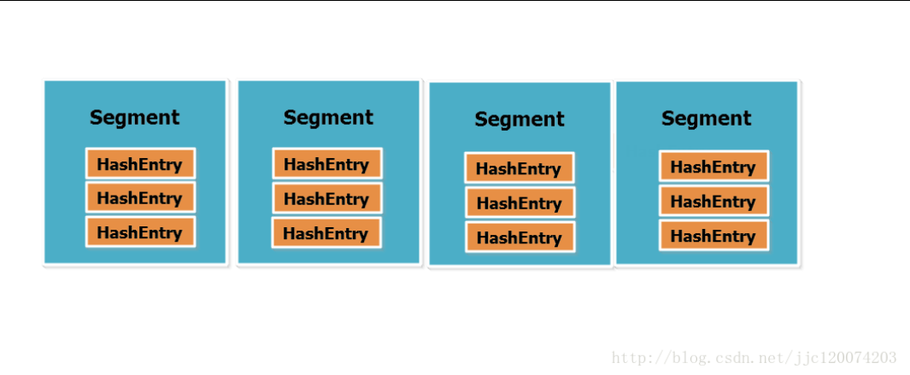
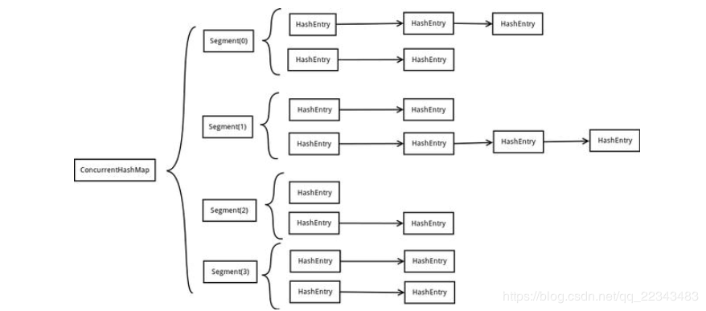

# ConcurrentHashMap

　　ConcurrentHashMap（简称 chm）是 java 1.5 新引入的 java.util.concurrent 包的成员，作为 hashtable 的替代。为什么呢，hashtable 采用了同步整个方法的结构。虽然实现了线程安全但是性能也就大大降低了，而 HashMap 在并发情况下会很容易出错。所以也促进了安全并且在多线程中使用的 ConcurrentHashMap。

　　ConcurrentHashMap 是线程安全并且高效的一种容器。

## hash 表   

### 介绍              

　　哈希表就是一个以键-值（key-value）存储数据的结构，只要输入待查找的值即 key，即可查找到其对应的值。

　　哈希的思路很简单，如果所有的键都是整数，那么就可以使用一个简单的无序数据来实现：将键作为索引，值即为其对应的值，这样就可以快速访问任意键的值。这是对于简单的键的情况，将其扩展到可以处理更加复杂的类型的键。

### 链式 hash 表

　　链式哈希表从根本上说是由一组链表构成。每个链表都可以看做是一个 “ 桶 ”，将所有的元素通过散列的方式放到具体的不同的桶中。插入元素时，首先将其键插入一个哈希函数（该过程称为哈希键），函数通过散列的方式告知元素属于哪个 “ 桶 ”，然后在相应的链表头插入元素。查找或删除元素时，用同样的方式先找到元素的 “ 桶 ”，然后遍历相应的链表，直到发现想要的元素。因为每个 “ 桶 ” 都是一个链表，所以链式哈希表并不限制包含元素的个数。然而，如果表变得太大，它的性能将会降低。



### 应用场景

　　缓存技术（比如 redis、memcached）的核心其实就是在内存中维护一张巨大的哈希表，还有 HashMap、ConcurrentHashMap 等应用。

## CurrentHashMap 的结构

　　ConcurrentHashMap 是由 Segment 和 HashEntry 组成的。Segment 是一种可重入的锁（Reentranlock），Segment 在其中扮演锁的角色，HashEntry 用于存储数据。一个 CurrentHashMap 包括一个 Segment 数组。一个 Segment 元素包括一个 HashEntry 数组，HashEntry 是一种链表式的结构，每一个 Segment 维护着 HashEntry 数组中的元素，当要对 HashEntry 中的数据进行修改的时候，必须先要活的与它对应的 Segment。




　　这样的话，当修改该容器的不同的段时，将不会存在并发的问题，如图可知，得到一个元素需要进行两次 hash 操作，第一次得到 Segment，第二次得到 HashEntry 中的链表头部，这样做会使得 Hash 的过程比普通的 HashMap 要长。

　　写操作的时候可以只对元素所在的 Segment 进行加锁即可，不会影响到其他的 Segment，这样，在最理想的情况下，ConcurrentHashMap 可以最高同时支持 Segment 数量大小的写操作（刚好这些写操作都非常平均的分布在所有的 Segment 上）。

## ConcurrentHashMap 的源码

### 如何实现 ConcurrentHashMap

　　首先来看构造方法：

```java
public ConcurrentHashMap(int initialCapacity,
                             float loadFactor, int concurrencyLevel) {
        if (!(loadFactor > 0) || initialCapacity < 0 || concurrencyLevel <= 0)
            throw new IllegalArgumentException();
        if (concurrencyLevel > MAX_SEGMENTS)
            concurrencyLevel = MAX_SEGMENTS;
        // Find power-of-two sizes best matching arguments
        int sshift = 0;
        int ssize = 1;
        while (ssize < concurrencyLevel) {
            ++sshift;//代表ssize转换的次数
            ssize <<= 1;
        }
        this.segmentShift = 32 - sshift;//目前不知道有什么用，是在后来的segment定位中使用
        this.segmentMask = ssize - 1;//segment定位使用
        if (initialCapacity > MAXIMUM_CAPACITY)
            initialCapacity = MAXIMUM_CAPACITY;
        int c = initialCapacity / ssize;
        if (c * ssize < initialCapacity)
            ++c;
        int cap = MIN_SEGMENT_TABLE_CAPACITY;
        while (cap < c)
            cap <<= 1;
        // create segments and segments[0]
        Segment<K,V> s0 =
            new Segment<K,V>(loadFactor, (int)(cap * loadFactor),
                             (HashEntry<K,V>[])new HashEntry[cap]);
        Segment<K,V>[] ss = (Segment<K,V>[])new Segment[ssize];
        UNSAFE.putOrderedObject(ss, SBASE, s0); // ordered write of segments[0]
        this.segments = ss;
    }
```

　　和 HashMap 对比来分析，HashMap 是 entry< K,V >[]，而 chm 就是 segments< K,V >。可以说每一个 segment 都是一个 HashMap，想逃进入 Segment 还需要获取对应的锁。默认 ConcurrentHashMap 的 Segment 数是 16。每个 segment 内的 hashEntry 数组大小也是 16 个。threadshord 是 16*0.8。

### chm 如何定位

　　看 chm 的 hash 方法：

```java
private int hash(Object k) {
        int h = hashSeed;

        if ((0 != h) && (k instanceof String)) {
            return sun.misc.Hashing.stringHash32((String) k);
        }

        h ^= k.hashCode();

        // Spread bits to regularize both segment and index locations,
        // using variant of single-word Wang/Jenkins hash.
        h += (h <<  15) ^ 0xffffcd7d;
        h ^= (h >>> 10);
        h += (h <<   3);
        h ^= (h >>>  6);
        h += (h <<   2) + (h << 14);
        return h ^ (h >>> 16);
    }
```

　　这里对 key 的 hash 值再哈希了一次。使用的方法是 wang/jenking 的哈希算法，这里再 hash 是为了减少 hash 冲突。如果不这样做的话，会出现大多数值都在一个 segment 上，这样就失去了分段锁的意义。

　　以上代码只是算出了 key 的新 hash 值，但是如何用这个 hash 值定位：如果要取得一个值，首先肯定需要先知道哪个 segment，然后再知道 hashentry 的 index，最后一次循环遍历该 index 下的元素。

* 确定 sement：(h >>> segmentShift ) & segmentMask。默认使用 h 的前 4 位，segmentMask 为 15。

* 确定 index：（tab.length -1）& h，hashentry 的长度减 1，用之前确定了segment 的新 h 计算。

* 循环：

  ```java
  for(HashEntry<K,V> e = (HashEntry<K,V>) UNSAFE.getObjectVolatile(tab,((long)(((tab.length - 1) & h)) << TSHIFT) + TBASE ); e != null; e = e.next)
  ```

* 比较

  ```java
  if((k = e.key) == key || (e.hash == h && key.equals(k))) return e.value;
  ```

### chm 取得元素

```java
public V get(Object key) {
        Segment<K,V> s; // manually integrate access methods to reduce overhead
        HashEntry<K,V>[] tab;
        int h = hash(key);
        long u = (((h >>> segmentShift) & segmentMask) << SSHIFT) + SBASE;
        if ((s = (Segment<K,V>)UNSAFE.getObjectVolatile(segments, u)) != null &&
            (tab = s.table) != null) {
            for (HashEntry<K,V> e = (HashEntry<K,V>) UNSAFE.getObjectVolatile
                     (tab, ((long)(((tab.length - 1) & h)) << TSHIFT) + TBASE);
                 e != null; e = e.next) {
                K k;
                if ((k = e.key) == key || (e.hash == h && key.equals(k)))
                    return e.value;
            }
        }
        return null;
    }
```

　　如果要取得一个值，首先肯定需要知道哪个 segment，然后再知道 hashEntry 的 index，最后循环遍历该 index 下的元素。

* 确定 segment：（h >>> segmentShift）& segmentMask。默认使用 h 的前 4 位，segmentMask 为 15。

* 确定 index：（tab.length - 1）& h，hashEntry 的长度减 1，用之前确定了 segment 的新 h 计算。

* 循环：

  ```java
  for (HashEntry<K,V> e = (HashEntry<K,V> UNSAFE.getObjectVolatile(tab,((long)(((tab.length-1) & h)) << TSHIFT) + TABLE); e != null; e = e.next)
  ```

* 比较

  ```java
  if ((k = e.key) == key || (e.hash == h && key.equals(k)))
  	return e.value;
  ```

### chm 存放元素

```java
public V put(K key, V value) {
            Segment<K,V> s;
            if (value == null)
                throw new NullPointerException();
            int hash = hash(key);
            int j = (hash >>> segmentShift) & segmentMask;
            if ((s = (Segment<K,V>)UNSAFE.getObject          // nonvolatile; recheck
                 (segments, (j << SSHIFT) + SBASE)) == null) //  in ensureSegment
                s = ensureSegment(j);
            return s.put(key, hash, value, false);
        }   
    在jdk中，native方法的实现是没办法看的，请下载openjdk来看。在put方法中实际是需要判断是否需要扩容的
    扩容的时机选在阀值（threadshold）装满时，而不像hashmap是在装入后，再判断是否装满并扩容
    这里就是concurrenthashmap的高明之处，有可能会出现扩容后就没有新数据的情况
```

　　在 JDK 中，native 方法的实现是没办法看的，需要下载 OpenJDK 来看。在 put 方法中实际是需要判断是否需要扩容的，扩容的时机选在阈值（threadshold）装满时，而不像 hashmap 是在装入后，再判断是否装满并扩容。这就是 ConcurrentHashMap 的好处，有可能会出现扩容后就没有新数据的情况。

### ConcurrentHashMap 容量判断

```java
public int size() {
        final Segment<K,V>[] segments = this.segments;
        int size;
        boolean overflow; // true if size overflows 32 bits
        long sum;         // sum of modCounts
        long last = 0L;   // previous sum
        int retries = -1; // first iteration isn't retry
        try {
            for (;;) {
                if (retries++ == RETRIES_BEFORE_LOCK) {
                    for (int j = 0; j < segments.length; ++j)
                        ensureSegment(j).lock(); // force creation
                }
                sum = 0L;
                size = 0;
                overflow = false;
                for (int j = 0; j < segments.length; ++j) {
                    Segment<K,V> seg = segmentAt(segments, j);
                    if (seg != null) {
                        sum += seg.modCount;
                        int c = seg.count;
                        if (c < 0 || (size += c) < 0)
                            overflow = true;
                    }
                }
                if (sum == last)
                    break;
                last = sum;
            }
        } finally {
            if (retries > RETRIES_BEFORE_LOCK) {
                for (int j = 0; j < segments.length; ++j)
                    segmentAt(segments, j).unlock();
            }
        }
        return overflow ? Integer.MAX_VALUE : size;
    }
```

　　在统计 ConcurrentHashMap 的数量时，有多线程情况，但是并不是一开始就锁住修改结构的方法，比如 put、remove 等。先执行一次统计，然后再执行一次统计，如果两次统计结果都一样，则没问题。反之就锁修改结构的方法。这样做效率会高很多，在统计的时候查询依旧可以进行。

### chm 是否为空判断

```java
public boolean isEmpty() {
       
        long sum = 0L;
        final Segment<K,V>[] segments = this.segments;
        for (int j = 0; j < segments.length; ++j) {
            Segment<K,V> seg = segmentAt(segments, j);
            if (seg != null) {
                if (seg.count != 0)
                    return false;
                sum += seg.modCount;
            }
        }
        if (sum != 0L) { // recheck unless no modifications
            for (int j = 0; j < segments.length; ++j) {
                Segment<K,V> seg = segmentAt(segments, j);
                if (seg != null) {
                    if (seg.count != 0)
                        return false;
                    sum -= seg.modCount;
                }
            }
            if (sum != 0L)
                return false;
        }
        return true;
    }
```

　　即是在空的情况下也不能仅仅只靠 segment 的计数器来判断，还是因为多线程，count 的值随时在变，所以追加判断 modcount 前后是否一致，如果一直，说明期间没有修改。

### chm 删除元素

```java
final V remove(Object key, int hash, Object value) {
            if (!tryLock())
                scanAndLock(key, hash);
            V oldValue = null;
            try {
                HashEntry<K,V>[] tab = table;
                int index = (tab.length - 1) & hash;
                HashEntry<K,V> e = entryAt(tab, index);
                HashEntry<K,V> pred = null;
                while (e != null) {
                    K k;
                    HashEntry<K,V> next = e.next;
                    if ((k = e.key) == key ||
                        (e.hash == hash && key.equals(k))) {
                        V v = e.value;
                        if (value == null || value == v || value.equals(v)) {
                            if (pred == null)
                                setEntryAt(tab, index, next);
                            else
                                pred.setNext(next);
                            ++modCount;
                            --count;
                            oldValue = v;
                        }
                        break;
                    }
                    pred = e;
                    e = next;
                }
            } finally {
                unlock();
            }
            return oldValue;
        }   
        
```


## ConcurrentHashMap 与 HashMap 等区别

### HashMap

　　HashMap 是线程不安全的，在多线程环境下，使用 HashMap 进行 put 操作会引起死循环，导致 CPU 利用率接近 100%，所以在并发情况下不能使用 HashMap。至于为什么会引起死循环，大概是因为 HashMap 的 Entry 链表会形成链式的结构，一旦形成了 Entry 的链式结构，链表中的 next 指针就会一直不为空，这样就会导致死循环。

### HashTable

　　HashTable 和 HashMap 的实现原理及户一样，差别无非是：

1. HashTable 不允许 key 和 value 为 null。
2. HashTable 是线程安全的。
3. 但是 HashTable 线程安全的策略实现代价却太大了，简单粗暴，get/put 所有相关操作都是 synchronized 的，这相当于给整个哈希表加了一把大锁。

　　多线程访问时候，只要有一个线程访问或操作该对象，那其他线程只能阻塞，相当于将所有的操作串行化，在竞争激烈的并发场景中性能就会非常差。

　　HashTable 使用 synchronized 来保证线程安全，即当有一个线程拥有锁的时候，其他的线程都会进入则色或者轮询状态，这样会使得效率越来越低。

### ConcurrentHashMap

　　主要就是为了应对 HashMap 在并发环境下不安全而诞生的，ConcurrentHashMap 的设计与实现非常精巧，大量的利用了 volatile、final、CAS 等 lock-free 技术来减少锁竞争对于性能的影响。

　　HashTable 访问效率低下的原因，就是因为所有的线程在竞争同一把锁。如果容器中有多把锁，不同的锁锁定不同的位置，这样线程见就不会存在锁的竞争，这样就可以有效的提高并发访问效率，这就是 ConcurrentHashMap 所使用的锁分段技术。将数据一段一段的存储，然后为每一段都配一把锁，当一个线程只是占用其中的一个数据段时，其他段的数据也能被其他线程访问。

　　Map 一般都是数据 + 链表结构（JDK 1.8 该为数组+链表+红黑树）。


　　ConcurrentHashMap 避免了对全局加锁改成了局部加锁操作，这样就极大地提高了并发环境下的操作速度，由于 ConcurrentHashMap 在 JDK 1.7 和 1.8 中的实现非常不同，接下来看一下 JDK 在 1.7 和 1.8 中的区别。

### JDK 1.7 版本的 CurrentHashMap 的实现原理

　　在 JDK 1.7 中 ConcurrentHashMap 采用了数组 + Segment + 分段锁的方式实现。其中 Segment 继承于 ReetrantLock。

　　核心数据如 value 以及链表都是 volatile 修饰的，保证了获取时的可见性。

#### Segment（分段锁）- 减少锁的粒度

　　ConcurrentHashMap 中的分段锁称为 Segment ，它即类似于 HashMap 的结构，即内部拥有一个 Entry 数组，数组中的每个元素又是一个链表，同时又是一个 ReentrantLock（Segment 继承了 ReentrantLock）。

#### 内部结构

　　ConcurrentHashMap 使用分段锁技术，将数据分成一段一段的存储，然后给每一段数据配一把锁，当一个线程占用锁访问其中一个段数据的时候，其他段的数据也能被其他线程访问，能够实现真正的并发访问。

　　ConcurrentHashMap 的内部结构图：



　　从上面的结构可以了解到，ConcurrentHashMap 定位一个元素的过程需要进行两次 Hash 操作。

　　第一次 Hash 定位到 Segment，第二次 Hash 定位到元素所在的链表的头部。

#### 该结构的优劣势

　　坏处是这一种结构的带来的副作用是 Hash 的过程要不普通的 HashMap 要长。

　　好处是写操作的时候可以只对元素所在的 Segment 进行加锁即可，不会影响到其他的 Segment，这样，在最理想的情况下，ConcurrentHashMap 可以最高同时支持 Segment 数量大小的写操作（刚好这些写操作都非常平均地分布在所有的 Segment 上）。

　　每当一个线程占用锁访问一个 segment 时，不回影响到其他的 Segment。

　　所以，通过这一种结构，ConcurrentHashMap 的并发能力可以大大的提高。

### JDK 1.8 版本的 ConcurrentHashMap 的实现原理

　　JDK 8 中 ConcurrentHashMap 参考了 JDK 8 HashMap 的实现，采用了数组 + 链表 + 红黑树的实现方式来设计，内部大量采用 CAS 操作。

　　CAS 是 compare and swap 的缩写，即比较交换。CAS 是一种基于锁的操作，而且是乐观锁。在 Java 中锁分为乐观锁和悲观锁。悲观锁是将资源锁住，等一个之前获得锁的线程释放锁之后，下一个线程才可以访问。而客观锁采用了一种宽泛的态度，通过某种方式不加锁来处理资源，比如通过给记录加 version 来获得数据，性能较悲观锁有很大的提高。

　　CAS 操作包含三个操作数 -- 内存位置（V）、预期原值（A）和新值（B）。如果内存地址里面的值和 A 的值是一样的，那么就将内存里面的值更新成 B。CAS 是通过无限循环来获取数据的，如果在第一轮循环中，a 线程获取地址里面的值被 b 线程修改了，那么 a 线程需要自旋，到下一次循环才有可能机会执行。

　　JDK 8 中彻底放弃了 Segment 转而采用的是 Node，其设计思想也不再是 JDK 1.7 中的分段锁思想。

　　Node：保存 key、value 及 key 的 hash 值的数据结构。其中 value 和 next 都用 volatile 修饰，保证并发的可见性。

```java
class Node<K,V> implements Map.Entry<K,V> {
    final int hash;
    final K key;
    volatile V val;
    volatile Node<K,V> next;
    Node(int hash, K key, V val, Node<K,V> next) {
            this.hash = hash;
            this.key = key;
            this.val = val;
            this.next = next;
     }
}
```

　　JDK 1.8 中的 Node 节点，其中的 cal 和 next 都通过可见性修饰。

　　Java 8 ConcurrentHashMap 结构基本上和 Java 8 的 HashMap 一样，不过保证线程安全性。

　　在 JDK 8 中 ConcurrentHashMap 的结构，由于引入了红黑树，使得 ConcurrentHashMap 的实现非常复杂，红黑树是一种性能非常好的二叉查找树，其查找性能为 O(logN)，但是其实现过程也非常复杂，而且可读性也非常差。

　　JDK 8 中 ConcurrentHashMap 在链表的长度大于某个阈值的时候会把链表转换成红黑树进一步提供其查找性能。

　　put 方法：

1. 根据 key.hashCode() 计算出 hash 值。
2. 通过 key 定位出 node，如果为空表示当前位置可以写入数据，利用循环 CAS 写入，如果不为空，则利用 synchronized 锁写入数据，如果数量大于 TREEIFY_HRESHOLD 则要转换为红黑树。

　　get 方法：

1. 利用 key.hashCode() 计算出对应的 hash 值，通过计算下标函数寻址，如果就在桶上那么直接返回值。如果是红黑树那就按照树的方式获取值，如果是链表则按照链表方式取值。

## 总结

　　可以看出 JDK 1.8 版本的 ConcurrentHashMap 的数据结构已经接近 HashMap，相对而言，ConcurrentHashMap 只是增加了同步的操作来控制并发，从 JDK 1.7 版本的 ReentrantLock + Segment + HashEntry，到 JDK 1.8 版本中 synchronized + CAS + HashEntry + 红黑树。

1. 数据结构：取消了 Segment 分段锁的数据结构，取而代之的是数组 + 链表 + 红黑树的结构。
2. 保证线程安全机制：JDK 1.7 采用 segment 的分段锁机制实现线程安全，其中 segment 继承自 ReentrantLock。JDK 1.8 采用 CAS + Synchronized 保证线程安全。
3. 锁的粒度：原来是对需要进行数据操作的 Segment 加锁，现调整为每个数组元素加锁（Node）。
4. 链表转化为红黑树：定位节点的 hash 算法简化会带来弊端，hash 冲突加剧，因此在链表节点数量大于 8 时，会将链表转换为红黑树进行存储。
5. 查询时间复杂度：从原来的遍历链表 O(n)，变成遍历红黑树 O(logN)。


## 参考文章 

1. [CurrentHashMap的实现原理](https://blog.csdn.net/qq_22343483/article/details/98510619)
2. [CurrentHashMap源码剖析](https://segmentfault.com/a/1190000015083593)
4. [深入理解currentHashMap(一)](https://www.jianshu.com/p/f9d62bf74b67)
