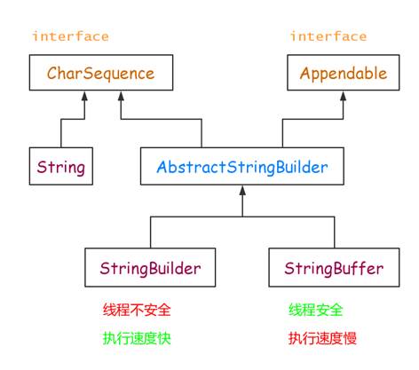

# String、StringBuilder 与 StringBuffer 的区别

## 简介
　　String、StringBuilder 与 StringBuffer 都是 Java 用来处理字符串的类，并且都是 final 类，不允许被继承。

　　三者的继承关系图：


## 区别
　　区别主要在于两个方面，即运行速度和线程安全两个方面。

#### 运行速度
　　运行速度，也可以说是执行速度。这三者的运行速度从快到慢是：StringBuilder > StringBuffer > String。

　　String 运行速度最慢的原因与 String 的特性有关。String 是字符串常量，即 String 对象一旦创建之后该对象不可更改。对 String 进行操作就是一个不断创建新的对象并将旧的对象回收的过程，这导致效率低，并且会创建大量的内存，所以执行速度很慢。

　　而 StringBuilder 和 StringBuffer 的对象是变量，对变量进行操作就是直接对该对象进行更改，而不进行创建和回收操作，不会创建新的未使用对象，所以速度比 String 快很多。

　　而 StringBuilder 比 StringBuffer 快的原因是，StringBuffer 是需要同步的，所以执行速度慢。

#### 线程安全

　　在线程安全上，StringBuilder 是线程不安全的，而 StringBuffer 是线程安全的。

　　如果一个 StringBuffer 对象在字符串缓冲区被多个线程使用时，StringBuffer 中很多方法带有 synchronized 关键字，所以可以保证线程是安全的，但 StringBuilder 的方法则没有该关键字，所以不能保证线程安全，有可能会出现一些错误的操作。所以如果要进行的操作是多线程的，那么就要使用 StringBuffer，但是在单线程的情况下，还是建议使用速度比较快的 StringBuilder。

```java
以 StringBuffer 与 StringBuilder 的 append 源码查看差别
StringBuffer：
    //StringBuffer 的方法都加了 synchronized 关键字
    public synchronized StringBuffer append(Object obj) {
        super.append(String.valueOf(obj));
        return this;
    }

StringBuilder：
    //StringBuilder 的方法并没有 synchronized 关键字
    public StringBuilder append(Object obj) {
        return append(String.valueOf(obj));
    }
```

#### 其他区别
**实现接口：**　　

　　StringBuffer 与 StringBuilder 实现了 Serializable 和 CharSequare 两个接口，String 除了这两个接口，还实现了 Comparable< String > 接口，所以 String 的实例可以通过 compareTo 方法进行比较，而 StringBuffer 与 StringBuilder 不行。

**初始化：**

　　String 可以空赋值，而 StringBuffer 和 StringBuilder 是不可以的。

## 总结
**String：**适用于少量的字符串操作的情况。
**StringBuilder：**适用单线程下在字符缓冲区进行大量操作的情况。
**StringBuffer：**使用多线程下在字符缓冲区进行大量操作的情况。


