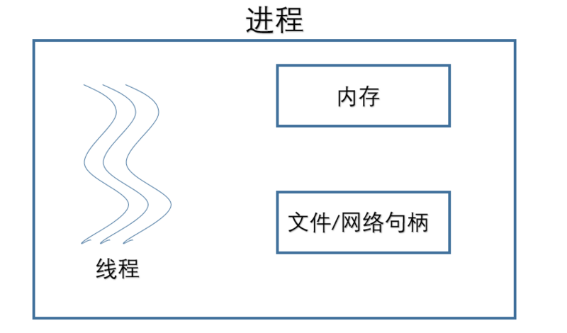
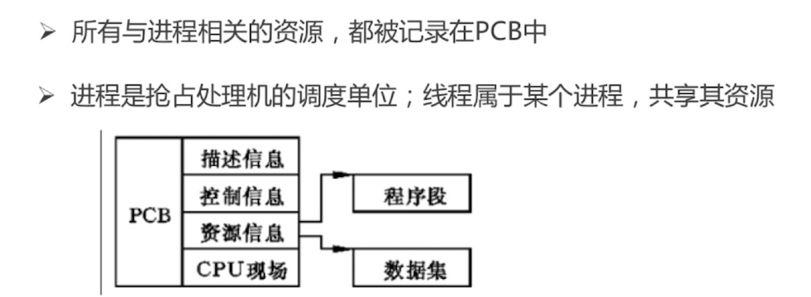
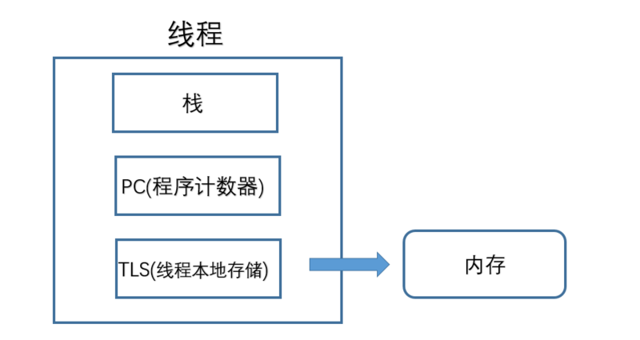
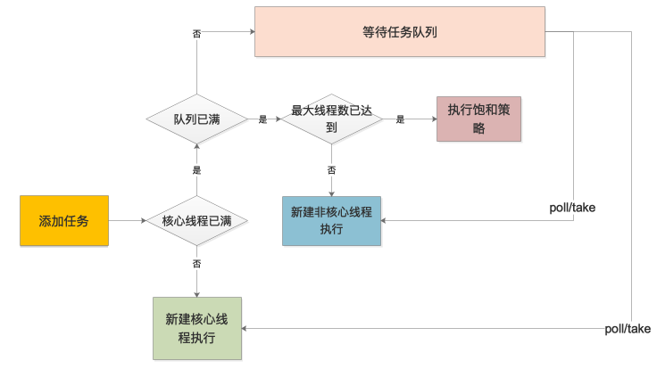
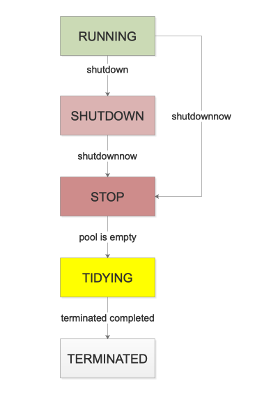
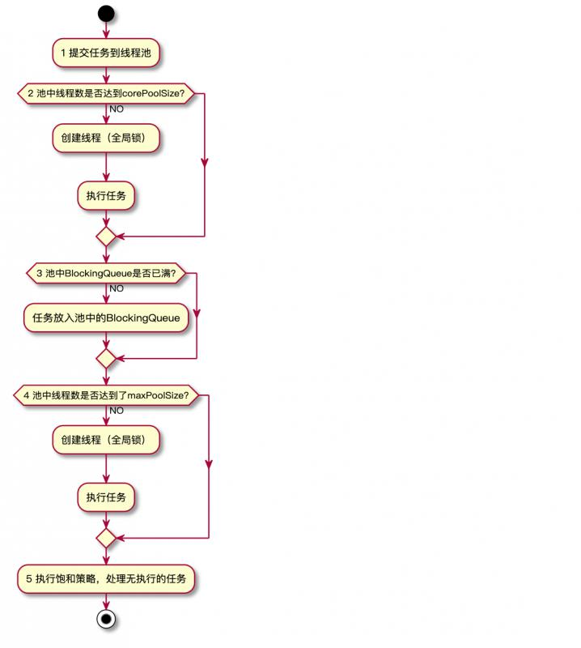
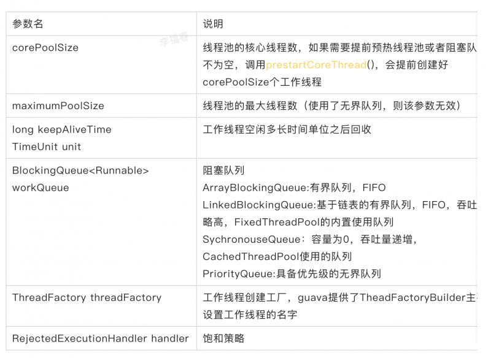
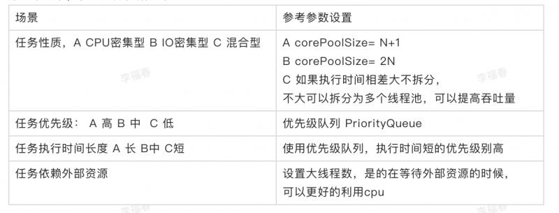

# Java 基础的常见问题1

## 1. 面向对象的特性

　　Java 面向对象的四大特性为：封装、继承、抽象、多态。

### 1.1. 封装

　　将类的某些信息隐藏在类内部，不允许外部程序直接访问，而是通过该类提供的方法来实现对隐藏信息的操作和访问。

　　也有包级别的封装，将具有共同特性的类放在一起。

**好处**：

1. 增加复用。
2. 单一职责，减少变动带来的风险。
3. 只能通过规定的方法访问数据。
4. 隐藏类的实例细节，增加安全性、方便修改和实现。

```java
public class Person {
  private String name;
  private int age;

  public Person(String name, int age) {
    this.name = name;
    this age = age;
  }

  public String getName() {
    return this.name;
  }

  public void setName(String name) {
    this.name = name;
  }

  public int getAge() {
    return this.age;
  }

  public void setAge(int age) {
    this.age = age;
  }
}
```

### 1.2. 继承

　　子类就是父类。

　　好处：子类拥有父类的所有属性和方法（除 private 修饰的属性不能拥有）从而实现了代码的复用。

**继承的方式**：

1. 普通类继承普通类、继承抽象类、实现接口
2. 抽象类继承普通类、继承抽象类、实现接口
3. 接口继承接口

**继承的缺点**：

1. 子类依赖于父类，父类发生改变时子类必须改变。
2. 子类会继承一些父类无用的方法，当继承链很长时，子类的方法很臃肿。

```java
public class Student extends Person {
  privete long studentId;
  
  public Student(String name, int age, long studentId) {
    super(name, age);
    this.studentId = studentId;
  }
  
  public long getStudentId() {
    return this.studentId;
  }
  
  public void setStudentId(long studentId) {
    this.studentId = studentId;
  }
}
```

### 1.3. 抽象

　　将具体的物体的特性抽象出来，是对真实世界的一种描述，用于模拟实际事物的特征和行为。

　　抽象最好的体现就是类。

```java
public class Person {
  public String name;
  public int age;

  public Person(String name, int age) {
    this.name = name;
    this age = age;
  }

  public void eat() {}
}
```

### 1.4. 多态

　　不同子类的相同属性的值不同、相同方法的实现不同（通过方法的重写）。

　　好处：避免子类的发展被多态限制。

```java
public interface Cry {
  public void cry();
}

public abstract class Animal implements Cry {
  public void cry();
}

public class Cat extends Animal {
  public void cry() {
    System.out.println("喵喵喵");
  }
}

public class Dog extends Animal {
  public void cry() {
    System.out.println("汪汪汪");
  }
}
```

## 2. switch-case

### 2.1. switch 语句支持的数据类型

　　对于表达式 switch 支持的数据类型：

1. 在 Java 5 之前，switch 只能是 byte、short、char、int 类型，byte、short、char 类型可以在不损失精度的情况下向上转型为 int 类型。

2. 从 Java 5 开始，java 中引入了枚举类型（enum 类型）和 byte、short、char、int 的包装类。

   四个包装类的支持是因为 java 编译器在底层进行了拆箱操作；

   枚举类型的支持是因为枚举类有一个 ordinal 方法，该方法实际上是返回一个 int 类型的数值。

3. 从 Java 7 开始，switch 还可以是 String 类型。

   String 类中因为有一个 hashCode 方法，结果也是返回 int 类型。

　　所以得出的结论是，switch 在底层实现目前只支持整数数据。

## 3. String、StringBuffer、StringBuilder 

　　String、StringBuilder 与 StringBuffer 都是 Java 用来处理字符串的类，并且都是 final 类，不允许被继承。

### 3.1. 三者的区别

1. 运行速度：StringBuilder > StringBuffer > String。

   String 运行速度慢是因为 String 是字符串常量，即 String 对象一旦创建之后该对象不可更改。对 String 进行操作就是一个不断创建新的对象并将旧的对象回收的过程，这导致效率低，并且会创建大量的内存，所以执行速度很慢。

   而 StringBuilder 和 StringBuffer 的对象是变量，对变量进行操作就是直接对该对象进行更改，不需要创建和回收操作，所以比 String 快很多。

   而 StringBuffer 是需要同步的，所以比 StringBuilder 要慢。

2. StringBuffer 是线程安全的，StringBuilder 是线程不安全的。


### 3.2. “+” 与 append 的区别

```java
// 相当于 String S1 = “abc”; 运行最快
// 除了结果 S1，没有创建任何新 String 对象
String S1 = “a” + “b” + “c”; 

// 运行最慢
String S1 = “a”; 
String S2 =  “b”; 
String S3 =  “c”; 
String S1=S1+S2+S3；

// 运行中间
StringBuilder Sb = new StringBuilder(“a”).append(“b”).append(“c”);
```

　　String 使用 “+” 来拼接字符串，“+” 的原理是：每遇到一个 “+” ，就创建一个 StringBuilder 对象，然后用 append() 方法，最后调用 StringBuilder 的 toString() 方法返回 String 字符串，在使用之后还需要释放资源，效率低下。而 StringBuilder 的 append 不需要创建新的对象，节省资源。

### 3.3. StringBuffer 是如何实现线程安全的

　　StringBuffer 除了构造方法其他方法都加了 synchronzied 关键字。

### 3.4. String 的 concat 方法与 append 的区别

　　String 的 concat() 方法的作用是将指定字符串拼接到此字符串的结尾。

```java
public String concat(String str) {
    int otherLen = str.length();
    if (otherLen == 0) {
        return this;
    }
    int len = value.length;
    /* copyOf 数组复制,copyOf() 的第二个自变量指定要建立的新数组长度，
    如果新数组的长度超过原数组的长度，则保留为默认值 null 或 0 */
    char buf[] = Arrays.copyOf(value, len + otherLen);
    // 将字符从此字符串复制到目标字符数组,len 为数组中的起始偏移量
    str.getChars(buf, len);
    return new String(buf, true);
}
```

　　String 的 concat 使用 copyOf() 和 getChars() 方法来拼接数组的，然后创建新的 String 对象。而 StringBuffer 只会创建一块内存空间，使用 append 添加或 delete 删除其内容时，也是在这一块内存空间中并不会生成多余的空间。

　　所以 StringBuffer 速度是比较快的，而 String 每次生成对象都会对系统性能产生影响，特别当内存中无引用对象多了以后，JVM 的 GC 就会开始工作，对速度的影响一定是相当大的。

### 3.5. 比较string="aaa"和string=new string("aaa")

　　方式一：String a = “aaa” ;

　　方式二：String b = new String(“aaa”);

　　两种方式都能创建字符串对象，但方式一要比方式二更优。 因为字符串是保存在**常量池**中的，而通过**new创建的对象**会存放在**堆**内存中。

　　如果常量池中已经有字符串常量”aaa”：

　　通过方式一创建对象，**程序运行时会在常量池中查找 ”aaa” 字符串，将找到的 “aaa” 字符串的地址赋给a**。

　　通过方式二创建对象，无论常量池中有没有 ”aaa” 字符串，程序都会在堆内存中**开辟一片新空间存放新对象**。

------

　　如果常量池中没有字符串常量”aaa”：

　　通过方式一创建对象，**程序运行时会将”aaa”字符串放进常量池，再将其地址赋给a。**

　　通过方式二创建对象，程序会在**堆内存中开辟一片新空间存放新对象**，**同时会将”aaa”字符串放入常量池，相当于创建了两个对象**。

## 4. 异常

### 4.1. try-catch-finally

#### 4.1.1. 在 try 中 return 还会不会调用 finally

　　肯定会执行。finally{} 块的代码只有在 try{} 块中包含遇到 System.exit(0); 之类的导致 Java 虚拟机直接退出的语句才会不执行。

　　当程序执行 try{} 遇到 return 时，程序会先执行 return 语句，但并不会立即返回 -- 也就是把 return 语句要做的一切事情都准备好，也就是在将要返回，但未返回的时候，程序把执行流程转去执行 finally 块，当 finally 块执行完成后就直接返回刚才 return 语句已经准备好的结果。

```java
public class Test{
       public static void main(String[] args){
              System.out.println(new Test().test());;
       }

       static int test(){
              int x = 1;
              try{
                     return x;
              }finally{
                     System.out.println("finally块执行:" + ++x);
              }
       }
}
```

　　输出结果为：

```java
finally块执行:2
1
```

　　因为 Java 会把 return 语句先执行完，把所有需要处理的东西都先处理完成，需要返回的值也都准备好之后，但是还未返回之前，程序流程会转去执行 finally 块，但此时 finally 块中的对 x 变量的修改意见不会影响 return 要返回的值了。

```java
public class Test{
       public static void main(String[] args){
              System.out.println(new Test().test());;
       }
       static int test(){
              int x = 1;
              try{
                     return x++;
              }finally{
                     System.out.println("finally块执行:" + ++x);
                     return x;
              }
       }
}
```

　　输出结果：

```java
finally 块执行：3
3
```

　　程序在执行 return x++;时，程序会把 return 语句执行完成，只是等待返回，此时 x 的值已经是 2 了，但程序此时准备返回值依然是 1。接下来程序流程转去执行 finally 块，此时程序会再次对 x 自加，于是 x 变成了 3，而且由于 finally 块中也有 return x；语句，因此程序将会直接由这条语句返回了。

#### 4.1.2. throw 和 throws

　　throw 关键字：语句抛出异常；throws 关键字：声明异常（方法抛出异常）。

1. throw 是语句抛出一个异常。

   语法：throw  异常对象；throw e；

2. throws 是方法可能抛出异常的声明。用在声明方法时，表示该方法可能要抛出异常，调用者必须做出处理（捕获或继续抛出）。

   语法：[ ( 修饰符 ]（ 返回值类型 )(方法名)([参数列表])[throws(异常类)]{......}

   public void doA(int a) throws Exception1,Exception3{......}

3. throws 可以单独使用，但 throw 不能。throw 要么和 try-catch-finally 语句配套使用，要么与 throws 配套使用。但 throws 可以单独使用，然后再由处理异常的方法捕获。

4. throw 语句用在方法体内，表示抛出异常，由方法体内的语句处理。

   throws 语句用在方法声明后面，表示再抛出异常，由调用这个方法的上一级方法中的语句来处理，必须做出处理（捕获或继续声明）。

5. throws 主要是声明这个方法会抛出这种类型的异常，使其他地方调用它时知道要捕获这个异常，使得提醒必须做出处理。否则编译时不会通过的。

   throw 是具体向外抛异常的动作，所以它是抛出一个异常实例。

6. throws 表示出现异常的一种可能性，并不一定会发生这些异常；throw 则是抛出了异常，执行 throw 则一定抛出了某种异常对象。

7. 两者都是消极处理异常的方式，只是抛出或者可能抛出异常，但是不会由函数去处理异常，真正的处理异常由函数的上层调用处理。

### 4.2. error 和 exception

#### 4.2.1. Error 和 Exception 的父类子类


#### 4.2.2. Error 和 Exception 的区别

　　Error：Error 类对象由 Java 虚拟机生成并抛出，大多数错误与代码编写者所执行的操作无关。例如，Java 虚拟机运行错误（Virtual MachineError），当 JVM 不再有继续执行操作所需的内存资源时，将出现 OutOfMemoryError。这些异常发生时，Java 虚拟机（JVM）一般会选择线程终止；还有发生在虚拟机视图执行应用时，如类定义错误（NoClassDefFoundError）、链接错误（LinkageError）。这些错误是不可查的，因为它们在应用程序的控制和处理能力之外，而且绝大多数时程序运行时不允许出现的状况。对于设计合理的应用程序来说，即使确实发生了错误，本质上也不应该试图去处理它所引起的异常状态。在 Java 中，错误通常是使用 Error 的子类描述。

　　Exception：在 Exception 分支中有一个重要的子类 RuntimeException（运行时异常），该类型的异常自动为你所编写的程序定义 ArrayIndexOutOfBoundsException（数组下标越界）、NullPointerException（空指针异常）、ArithmeticException（算术异常）、MissingResourceException（丢失资源）、ClassNotFoundException（找不到类）等异常，这些异常是不检查异常，程序中可以选择捕获异常，也可以不处理。这些异常一般是由程序逻辑错误引起的，程序应该从逻辑角度尽可能避免这类异常的发生；而 RuntimeException 之外的异常统称为非运行时异常，类型上属于 Exception 类及其子类，从程序语法角度讲是必须进行处理的异常，如果不处理，程序就不能编译通过。如 IOException、SQLException 等以及用户自定义的 Exception 异常，一般情况下不自定义检查异常。

#### 4.2.2. 常见的 Exception

**运行时异常（RuntimeException）**：

1. NullPointException：空指针异常。
2. ClassCastException：类型强制转换异常。
3. IllegalArgumentException：传递非法参数异常。
4. IndexOutOfBoundsException：下标越界异常。
5. NumberFormatException：数字格式异常。
6. ConcurrentModificationException：当方法检测到对象的并发修改，但不允许这种修改时，抛出此异常。
7. ClassNotFoundException：找不到指定 class 的异常。

**非运行时异常**：

2. IOException：IO 操作异常。

#### 4.2.3. 常见的 Error

1. NoClassDefFoundError：找不到 class 定义异常。
2. StackOverflowError：深递归导致栈被耗尽而抛出的异常。
3. OutOfMemoryError：内存溢出异常。

#### 4.2.4. CheckedException、RuntimeException 的区别

　　异常表示程序运行过程中可能出现的非正常状态，运行时异常表示虚拟机的通常操作中可能遇到的异常，是一种常见运行错误，只要程序设计的没有问题通常就不会发生。受检异常跟程序运行的上下文环境有关，即使程序设计无误，仍然可能因使用的问题而引发。Java 编译器要求方法必须声明抛出可能发生的受检异常，但是并不要求必须声明抛出未被捕获的运行时异常。

#### 4.2.5. 异常处理的注意事项

　　异常和继承一样，是面向对象编程设计中经常被滥用的东西，在 Effective Java 中对异常的使用给出了以下指导原则：

* 不要将异常处理用于正常的控制流（设计良好的 API 不应该强迫它的调用者为了正常的控制流而使用异常）
* 对可以恢复的情况使用受检异常，对编程错误使用运行时异常。
* 避免不必要的使用受检异常（可以通过一些状态检测手段来避免异常的发生）
* 优先使用标准的异常
* 每个方法排除的异常都要有文档
* 保持异常的原子性
* 不要在 catch 中忽略捕获到的异常

1. 尽量不要捕获类似 Exception 这样通用的异常，而应该捕获特定的异常。

   软件工程是一门协作的异常，在日常开发中我们有义务使自己的代码能更直观、清晰的表达出我们想要表达的信息，但是如果你什么异常都用了 Exception，那别的开发同事就不能一眼得知这段代码实际想要捕获的异常，并且这样的代码也会捕获到可能你希望它抛出而不希望捕获的异常。

2. 不要 “吞” 了异常

   如果我们捕获了异常，不把异常抛出，或者没有写到日志里，那会出现什么情况？线上除了 bug 莫名其妙的没有任何的信息，你都不知道哪里出错以及出错的原因。这可能会让一个简单的 bug 变得难以诊断。而且有些同学比较喜欢用 catch 之后用 e.printStackTrace()，在我们产品中通常不推荐用这种方法，一般情况下这样是没有问题的，但是这个方法输出的是个标准错误流。

   比如是在分布式系统中，发生异常但是找不到 stacktrace。所以最好是输入到日志里。我们产品可以自定义一定的格式，将详细的信息输入到日志系统中，适合清晰高效的排查错误。

3. 不要延迟处理异常

   比如有个方法，参数是个 name，函数内部调用了别的好几个方法，其实 name 传的是 null 值，但是没有在进入这个方法或者这个方法一开始就处理这个情况，而是在调用了别的好几个方法然后爆出这个空指针。这样的话明明出错堆栈信息只需要抛出一点点信息就能定位到这个错误所在的地方，经过了好多方法之后可能就是一坨堆栈信息。

4. 只在需要 try-catch 的地方 try-catch，try-catch 的范围能小则小

   只在必要的代码段使用 try-catch，不要不分青红皂白 try 住一坨代码，因为 try-catch 中的代码会影响 JVM 对代码的优化，例如重排序。

5. 不要通过异常来控制程序流程

   一些可以用 if/else 的条件语句来判断例如 null 值等，就不要用异常，异常肯定是比一些条件语句低效的。而且每实例化一个 Exception 都会对栈进行快照，相对而言这是一个比较重的操作，如果数量过多开销就不能被忽略。

6. 不要在 finally 代码块中处理返回值或者直接 return

   在 finally 中 return 或者处理返回值会让发生很诡异的事情，比如覆盖了 try 中的 return 或者屏蔽的异常。

## 5. Java 的基本数据类型

　　Java 的两大数据类型：

1. 内置数据类型
2. 引用数据类型

　　基本数据类型和引用类型的区别主要在于基本数据类型是分配在栈上的，而引用类型是分配在堆上的。

### 5.1. 基本数据类型

　　基本数据类型，也称内置类型，是可以在栈直接分配内存的，Java 保留基本数据类型最大原因是性能。

　　Java 语言提供了八种基本类型，基本类型可以分为三类，字符类型 char、布尔类型 boolean 以及数值类型 byte、short、int、long、float、double。数值类型又可以分为整数类型 byte、short、int、long 和浮点类型 float、double。JAVA 中的数值类型不存在无符号的，Java 决定了每种简单类型的大小，它们的取值范围是固定的，这些大小并不随着机器结构的变化而变化。这种大小的不可更改正是 Java 程序具有很强移植能力的原因之一。　　

　　实际上，JAVA 中还存在另外一种基本类型 void，它也有对应的包装类 java.lang.void，不过无法直接对它们进行操作。

#### 5.1.1. byte

1. Java 中最小的数据类型，byte 数据类型是 8 位、 占 1 个字节，有符号的，以二进制补码表示的整数。
2. 最大存储数据量是 255，存放的数据范围是：[-128(-2^7)，127(2^7-1)] 之间。
3. 默认值是 0；
4. byte 类型用在大型数组中节约空间，主要代替整数，因为 byte 变量占用得空间只有 int 类型的四分之一。
5. 例子：byte a = 100，byte b = -50。

#### 5.1.2. short

1. 短整型，short 数据类型是 16 位、占 2 字节、有符号的以二进制补码表示的整数。

2. 最大数据存储量是 65536，数据范围是：[-32768(-2^15）， 32767(2^15-1) ]。

3. short 数据类型也可以像 byte 那样节省空间。一个 short 变量是 int 型变量所占空间的二分之一。

4. 默认值是 0。

5. 例子：short s = 1000，short r = -20000。

　　注意，byte 类型虽然在语义（逻辑）上占用 1 字节，但实际上，JVM 中是将其当做 int 看的，也就是事实上是占用了 32 位，4 字节的，所以其运算效率和 int 没区别，short 也一样。之所以要有 byte/short 类型，一是因为某些地方要明确使用这些范围类型，二是，在 byte[] 数组中，JVM 存储的则是真的 1 字节，short[] 数组则是 2 字节。但也有的 JVM 其 byte[] 数组也是 4 字节 1 位的。 

#### 5.1.3. int

1. 整型，int 数据类型是 32 位、占 4 字节、有符号的以二进制补码表示的整数。
2. 最大数据存储容量是 2 的 32 次方减 1，数据范围为：[-2,147,483,648（-2^31）， 2,147,485,647（2^31 - 1）]。
3. 一般的整数变量默认为 int 类型。
4. 默认值为 0。
5. 例子：int a = 100000，int b = -200000。

#### 5.1.4. long

1. 长整型，long 数组类型是 64 位、占 8 字节、有符号的以二进制补码表示的整数。
2. 最大数据存储容量是 2 的 63 次方减 1，数据范围为：[-9,223,372,036,854,775,808（-2^63） ，9,223,372,036,854,775,807（2^63 -1）]。
3. 这种类型主要使用在需要比较大整数的系统上。
4. 默认值是 0L。
5. 例子：long a = 100000L，b = -200000L。

　　long a = 111111111111111（错误，整数型变量默认是 int 型）。

　　long a = 111111111111111L（正确，强制转换）。

#### 5.1.5. float

1. 浮点型，float 数据类型是单精度、32 位、占 4 字节，符合 IEEE 754 标准的浮点数，浮点数是有舍入误差的。
3. float 在储存大型复数数组的时候可节省内存空间。
4. 直接赋值时必须在数据后加上 f 或者 F，默认值是 0.0f。
5. 浮点数不能用来表示精确的值，如货币。
6. 例子：float f1 = 234.5f。

　　float f = 6.25（错误，浮点数默认类型是 double 类型）。

　　float f = 6.26F（正确，强制）。

　　double d = 4.55（正确）。

#### 5.1.6. double

1. 双精度浮点型，double 数据类型是双精度、64 位、符合 IEEE 754 标准的浮点数。
3. 浮点数的默认类型是 double 类型。
4. double 类型同样不能表示精确的值，如货币。
5. 赋值时可以加上 d 或者 D，也可以不加，默认值是 0.0d；
6. 例子：double d1 = 123.4。
7. 如果是小数类型，并且小数比较小，比如四位小数，建议使用 BigDecimal。

#### 5.1.7. boolean

1. 布尔类型，boolean 数据类型表示一位的信息。
2. 只有两个取值：true 和 false。
3. 这种类型只作为一种标志来记录 true/false 情况。
4. 默认值是 false。
5. 例子：boolean one = true。

#### 5.1.8. char

1. 字符型，用于存储单个字符。
2. char 类型是一个单一的 16 位 Unicode 字符，用 ' ' 表示一个字符。java 内部使用 Unicode 字符集，也有一些转义字符，2 字节。存储 Unicode 码，用单引号赋值。
3. 范围为：[‘\u0000’（即为0），'\uffff'（即为65,535）]，可以当整数用，它的每一个字符都对应一个整数。
4. char 数据类型可以存储任何字符。
5. 例子：char letter = 'A'。

　　下表列出了 Java 中定义的简单类型、占用二进制位数及对应的封装器类。

| 简单类型 | 二进制位数 | 封装器类  |
| -------- | ---------- | --------- |
| boolean  | 1          | Boolean   |
| byte     | 8          | Byte      |
| char     | 16         | Character |
| short    | 16         | Short     |
| int      | 32         | Integer   |
| long     | 64         | Long      |
| float    | 32         | Float     |
| double   | 64         | Double    |
| void     | --         | Void      |

　　对于数值类型的基本类型的取值范围，都已经以常量的形式定义在对应的包装类中了。例如，int 的最大值就是 Integer.MAX_VALUE。

　　注意：float、double 两种类型的最小值与 Float.MIN_VALUE 、Double.MIN_VALUE 的值并不相同，实际上 Float.MIN_VALUE 和 Double.MIN_VALUE 分别指的是 float 和 double 类型所能表示的最小正数。也就是说存在这样一种情况，0 到正负 Float.MIN_VALUE 之间的值 float 类型无法表示，0 到正负 Double.MIN_VALUE 之间的值 double 类型无法表示。这并没有什么好奇怪的，因为这些范围内的数值超出了它们的精度范围。

　　Float 和 Double 的最小值和最大值都是以科学记数法的形式输出的，结尾的 “E+数字” 表示 E 之前的数字要乘以 10 的多少倍。比如 3.14E3 就是 3.14x1000 = 3140，3.14E-3 = 3.14/1000 = 0.00314。

　　Java 基本类型存储在栈中，因此它们的存取速度要快于存储在堆中的对应包装类的实例对象。从 Java 5.0 (1.5) 开始，JAVA 虚拟机（Java Virtual Machine）可以完成基本类型和它们对应包装类之间的自动转换。因此在赋值、参数传递以及数学运算的时候像使用基本类型一样使用它们的包装类。另外，所有基本类型（包括 void）的包装类都使用了 final 修饰，因此无法继承它们扩展新的类，也无法重写它们的任何方法。

　　基本类型的优势：数据存储相对简单，运算效率比较高。

　　包装类的优势：比如集合的元素必须是对象类型，满足了 java 一切皆是对象的思想。

### 5.2. 引用数据类型

　　Java 有 5 种引用类型（对象类型）：类、接口、数组、枚举、标注。

　　引用类型：底层结构和基本类型差别较大。

　　JVM 的内存空间：

1. Heap 堆空间：分配对象 new Student;
2. Stack 栈空间：临时变量 Student stu；
3. Code 代码区：类的定义，静态资源 Student.class。

　　例子：

```java
Student stu = new Student(); // new 在内存的堆空间创建对象
stu.study(); //把对象的地址赋给 stu 引用对象
```

　　例子实现步骤：

1. JVM 加载 Student.class 到 Code 区。
2. new Student() 在堆空间分配空间并创建一个 Student 实例。
3. 将此实例的地址赋值给引用 stu，栈空间。

　　“ 引用 “ 是存储在有序的内存栈上的，而对象本身的值存储在内存堆上的。

　　

1. 引用类型变量由类的构造函数创建，可以使用它们访问所引用的对象。这些变量在声明时被指定为一个特定的类型，比如 Student 等。变量一旦声明，类型就不能被改变了。
2. 对象、数组都是引用数据类型。
3. 所有引用类型的默认值都是 null。
4. 一个引用变量可以用来引用与任何与之兼容的类型。

### 5.3. 数据类型之间的转换

　　只有 boolean 不参与数据类型的转化。

1. 自动类型的转换

   * a. 数据范围小的能够自动数据类型大的转换

     int 到 float、long 到 float、long 到 double 是不会自动转换的，不然会丢失精度。

     ```java
     byte b;int i = b;long l = b;float f = b; double d = b; //直接通过
     char c='c'; int i = c; // 如果时低级类型为 char 型，向高级类型（整型）转换时，会转换为对应 ASCII 码值。i = 99
     short i = 99; char c = (char)i //输出 c。
     ```

   * b. 表达式的数据类型自动提升，关于类型的自动提升，注意下面的规则：
     * 所有的 byte、short、char 型的值将被提升为 int 型；
     * 如果有一个操作数是 long 型，计算结果是 long 型；
     * 如果有一个操作数是 float 型，计算结果是 float 型；
     * 如果有一个操作数是 double 型，计算结果是 double 型；

   * c. 引用类型能够自动转换为父类的。

   * d. 基本类型和它们包装类型是能够互相转换的。

2. 强制类型转换：用圆括号括起来目标类型，置于变量前。

## 6. 进程与线程

### 6.1. 线程的状态有哪些？

　　线程的五大状态分别为：创建状态（New）、就绪状态（Runnable）、运行状态（Running）、阻塞状态（Blocked）、死亡状态（Dead）。


1. 新建状态：即单纯地创建一个线程，创建线程有三种方式。
2. 就绪状态：在创建了线程之后，调用 Thread 类的 start() 方法来启动一个线程，即表示线程进入就绪状态！
3. 运行状态：当线程获得 CPU 时间，线程才从就绪状态进入到运行状态！
4. 阻塞状态：线程进入运行状态后，可能由于多种原因让线程进入阻塞状态，如：调用 sleep() 方法让线程睡眠，调用 wait() 方法让线程等待，调用 join() 方法、suspend() 方法（已被弃用）以及阻塞式 IO 方法。
5. 死亡状态：run() 方法的正常退出就让线程进入到死亡状态，还有当一个异常未被捕获而终止了 run() 方法的执行也将进入到死亡状态。

### 6.2. 如何实现线程

#### 6.2.1. 继承 Thread 类创建线程

　　使用继承 Thread 类创建线程时，首先需要创建一个类继承 Thread 类并覆写 Thread 类的 run() 方法，在 run() 方法中，要写线程要执行的任务。

　　具体具体说明，代码如下所示：

```java
class MyThread extends Thread{
	@Override
	public void run() {
		System.out.println("自己创建的线程");
	}
}
```

　　创建了继承于 Thread 类的子类 MyThread 类以及覆写了 Thread 类的 run() 方法后，就相当于有了线程的主体类，接下来需要产生线程类的实例化对象然后调用 run() 方法，但实际上只是调用了 run() 方法并不是启动一个线程，真正启动一个线程，需要调用的是 Thread 类的 start() 方法，而 start() 方法会自动调用 run() 方法，从而启动一个线程。

　　代码如下所示：

```java
class MyThread extends Thread{
	@Override
	public void run() {
		System.out.println("自己创建的线程");
	}
}
public class Genericity {
	public static void main(String[] args) {
		//实例化一个对象
		MyThread myThread=new MyThread();
		//调用Thread类的start()方法
		myThread.start();
		//在main方法中打印一条语句
		System.out.println("main方法");
	}
}
```

　　运行结果：

```java
main方法
自己创建的线程
```

　　首先说明一点：main 方法其实也是一个线程，是该进程的主线程。

　　在使用多线程技术时，代码的运行结果与代码调用的顺序无关，因为线程是一个子任务，CPU 以不确定的方式或者说以随机的时间来调用线程中的 run() 方法，所以会出现先执行创建的线程，但是先打印语句 “main 方法”。

　　注意：一个对象多次调用 start() 方法时，会出现 Excepction in thread "main" java.lang.IllegalThreadStateException 异常。

#### 6.2.2. 实现 Runnable 接口创建线程

　　Thred 类的核心功能就是进行线程的启动，但一个类为了实现多线程直接继承 Thread 类时出现的问题就是：单继承的局限性！，所以 Java 中还提供了另一种实现多线程的方法：实现 Runnable 接口来创建多线程。

　　Runnable 接口只有一个抽象方法就是 run() 方法，如何使用 Runnable 接口去创建线程：

1. 第一步：定义一个类来实现 Runnable 接口的抽象方法 run() 方法。Thread 类有一个 Thread 类的构造方法 public Thread(Runnable target) 方法，参数用于接收 Runnable 接口的实例化对象，所以在 Runnable 接口与 Thread 类间就建立起了关系，从而可以调用 Thread 的 start() 方法启动一个线程。
2. 第二步：利用 Thread 类的 public Thread(Runnable target) 构造方法与 Runnable 接口建立关系实例化 Thread 类的对象。
3. 第三步：调用 Thread 类的 start() 方法启动线程。

　　具体代码如下：

```java
//定义一个类MyThread实现Runnable接口，从而覆写run()方法
class MyThread implements Runnable{
	@Override
	public void run() {
		System.out.println("利用Runnable接口创建线程");
	}
}
public class Genericity {
	public static void main(String[] args) {
		//实例化Runnable接口的对象，其实也可以实例化MyThread类的对象，因为可以向上转型
		Runnable runnable=new MyThread();//也可以改为 MyThread runnable=new MyThread();
		//实例化Thread类的对象
		Thread thread=new Thread(runnable);
		//调用Thread类的start()方法
		thread.start();
		//main线程中打印的一条语句
		System.out.println("main方法");
	}
}
```

　　运行结果：

```java
main方法
利用Runnable接口创建线程
```

#### 6.2.3. 实现 Callable 接口的源码

　　Runnable 接口的 run() 方法没有返回值，而 Callable 接口中的 call() 方法有返回值，若某些线程执行完成后需要一些返回值的时候，就需要用 Callable 接口创建线程。

　　使用 Callable 接口创建线程时，需要以下步骤：

1. 自定义一个类 MyThread，实现 Callable 接口并覆写 Callable 接口的 call() 方法。
2. 利用 MyThread 类实例化 Callable 接口的对象。
3. 利用 FutureTask 类的构造方法 public FutureTask(Callable< V >  callable)，将 Callable 接口的对象传给 FutureTask 类。
4. 将 FutureTask 类的对象隐式地向上转型，从而作为 Thread 类的 public Thread(Runnable runnable) 构造方法的传输。
5. 这样就建立了 Callable 接口与 Thread 类之间的关系，再调用 Thread 类的 start() 方法。

　　代码实现如下所示：

```java
import java.util.concurrent.Callable;
import java.util.concurrent.ExecutionException;
import java.util.concurrent.FutureTask;
 
//1.定义一个类MyThread实现Callable接口，从而覆写call()方法
class MyThread implements Callable<String>{
	@Override
	public String call() throws Exception {
		return "Callable接口创建线程";
	}
}
public class Genericity {
	public static void main(String[] args) throws InterruptedException, ExecutionException {
		//2.利用MyThread类实例化Callable接口的对象
		Callable callable=new MyThread();
		//3.利用FutureTask类的构造方法public  FutureTask(Claaable<V> callable)
		//将Callable接口的对象传给FutureTask类
		FutureTask task=new FutureTask(callable);
		//4.将FutureTask类的对象隐式地向上转型
		//从而作为Thread类的public Thread(Runnable runnable)构造方法的参数
		Thread thread=new Thread(task);
		//5.调用Thread类的start()方法
		thread.start();
		//FutureTask的get()方法用于获取FutureTask的call()方法的返回值，为了取得线程的执行结果
		System.out.println(task.get());
	}
}
```

　　运行结果：

```java
Callable接口创建线程
```

### 6.3. start 与 run 的区别

**start()**

　　使该线程开始执行，Java 虚拟机调用该线程的 run() 方法。

　　结果是两个线程并发的运行；当前线程（从调用返回给 start 方法）和另一个线程（执行其 run 方法）。

　　多次启动一个线程是非法的。特别是当线程已经结束执行后，不能再重新启动。

　　用 start 方法来启动线程，真正实现了多线程运行，这是无需等待 run 方法体代码执行完毕，而是直接继续执行下面的代码。

　　通过调用 Thread 类的 start() 方法来启动一个线程，这时此线程处于就绪（可运行）状态，并没有运行，一旦得到 cpu 时间片，就开始执行 run() 方法，这里方法 run() 称为线程体，它包含了要执行的这个线程的内容，Run 方法运行结束，Run 方法运行结束，此线程随即终止。

**run()**

　　如果该线程是使用独立的 Runnable 运行对象构造的，则调用该 Runnable 对象的 run 方法；否则，该方法不执行任何操作并返回。

　　Thread 的子类应该重写该方法。

　　run() 方法只是类的一个普通方法而已，如果直接调用 run 方法，程序中依然只有主线程这一个线程，其程序执行路径还是只有一条，还是要顺序执行，还是要等待 run 方法体执行完毕后才可继续执行下面的代码，这样就没有达到写线程的目的。

**总结**

　　调用 start() 方法方可启动线程，而 run() 方法只是 thread 的一个普通方法调用，还是在主线程里执行。

### 6.4. 线程与进程的区别

#### 6.4.1. 进程（线程+内存+文件/网络句柄）

　　**进程（Process）**是计算机中的程序关于某数据集合上的一次运行活动，是系统进行资源分配和调度的基本单位，是操作系统结构的基础。

　　在当代面向线程设计的计算机结构中，进程是线程的容器。

　　程序是指令、数据及其组织形式的描述，进程是程序的实体。

　　进程在系统中指的是正在运行的一个应用程序，程序一旦运行就是进程。



##### 6.4.1.1. 内存

　　这里的内存是逻辑内存，指的是内存的寻址空间。每个进程的内存都是相互独立的。

　　进程独占内存空间，保持各自运行状态，相互间不干扰且可以互相切换，为并发处理任务提供了可能。

##### 5.4.1.2. 文件/网络句柄

　　它们是所有线程所共有的，例如打开同一个文件、去抢同一个网络的端口这样的操作是被允许的。

#### 6.4.2. 线程（栈+PC+TLS）

　　**线程（Thread）**：是操作系统能够进行运算调度的最小单位，也就是程序执行的最小单元。它被包含在进程之中，是进程中的实际运作单位。也可以说是系统分配处理器时间资源的基本单元，或者说进程之内独立执行的一个单元执行流，一条线程指的是进程中一个单一顺序的控制流，一个进程中可以并发多个线程，每条线程并发执行不同的任务。

　　线程才是操作系统所真正去运行的，而进程则是像容器一样把需要的一些东西放在了一起，而把不需要的东西做了一层隔离，进行隔离开来。

　　线程共享进程的内存资源，相互间切换更快速，支持更细粒度的任务控制，使进程内的子任务得以并发执行。

　　线程是操作系统中可调度的最小单元，它的资源首先不可能无限制产生，会存在资源消耗，线程的创建和销毁都会有相应的开销。操作系统会通过时间片轮转的方式调度每个线程，因此线程不是绝对的并行，而是因为轮转速度太快，看起来像并行。若频繁创建和销毁线程，会造成大量资源开销，可以通过使用线程池来解决，线程池中会缓存一定数量的线程，当需要使用线程时直接复用而不需要重新创建，这样就避免因频繁创建和销毁线程所带来的资源开销。

　　进程是资源分配的最小单位，线程是程序执行（CPU 调度）的最小单位。所有与进程相关的资源，都被记录在 PCB 中，进程是抢占处理机的调度单元，线程属于某个进程，共享其资源。





##### 6.4.2.1. 栈

　　从主线程的入口 main 函数，会不断的进行函数调用，每次调用的时候，会把所有的参数和返回地址压入到栈中。

##### 6.4.2.2. PC

　　Program Counter 程序计数器，操作系统真正运行的是一个个的线程，而进程只是它的一容器。PC 就是指向当前的指令，而这个指令是放在内存中的。

　　每一个线程都有一串自己的指针，去指向自己当前所在内存的指针。

　　计算机绝大部分是存储程序性的，说的就是数据和程序是存储在同一片内存里的。这个内存中既有数据变量又有程序，所以 PC 指针就是指向内存的。

##### 6.4.1.3. TLS

　　全称：thread local storage

　　线程的独立内存就是 TLS，用来存储线程所独有的数据。

#### 6.4.3. 总结


1. 进程是系统进行资源分配和调度的最小单位，线程是程序执行（CPU 调度）的最小单位。

2. 进程有自己的独立地址空间，互相不影响，可以看做是独立应用，每启动一个进程，系统就会为它分配地址空间，建立数据表来维护代码段、堆栈段和数据段，这种操作非常昂贵。

   线程是共享进程中的数据的，只是进程的不同执行路径，不能看做独立应用，使用相同的地址空间。

3. CPU 切换一个线程的花费远比进程要小的多，同时创建一个线程的开销也比进程要小很多，所以进程的切换比线程的切换开销大。

4. 线程之间的通信更方便，同一进程下的线程共享全局变量、静态变量等数据，而进程之间的通信要以通信的方式（IPC）进行。

5. 进程要分配一大部分的内存，而线程只需要分配一部分栈就可以了。

6. 一个线程可以创建和销毁另一个线程，同一个进程中的多个线程之间可以并发执行。

7. 多进程程序要比多线程程序更健壮，多线程程序只要有一个线程死掉，整个进程也死掉了，而一个进程死掉并不会对另外一个进程造成影响，因为进程有自己独立的地址空间。

**Java 进程和线程的关系**

1. Java 对操作系统提供的功能进程封装，包括进程和线程。
2. 运行一个程序至少会有一个进程，一个进程包含至少一个线程。
3. 每个进程对应一个 JVM 实例，多个线程共享 JVM 里的堆。
4. Java 采用单线程编程模型，程序会自动创建主线程。
5. 主线程可以创建子线程，原则上要后于子线程完成执行。

### 6.5. 进程间通信

　　进程间通信的主要方法有：

1. 管道（Pipe）：管道可用于具有亲缘关系进程间的通信，允许一个进程和另一个与它有共同祖先的进程之间进行通信。

2. 命名管道（named pipe）：命名管道克服了管道没有名字的限制，因此，除具有管道所具有的功能外，它还允许无亲缘关系进程间的通信。命名管道在文件系统中有对应的文件名。命名管道通过命令 mkfifo 或者系统调用 mkfifo 来创建。

3. 信号（Signal）：信号是比较复杂的通信方式，用于通知接受进程有某种事件发生，除了用于进程间通信外，进程还可以发送信号给进程本身；linux 除了支持 Unix 早期信号语义函数 signal 外，还支持语义符合 Posix.1 标准的信号函数 sigaction（实际上，该函数是基于 BSD 的，BSD 为了实现可靠信号机制，又能够统一对外接口，用 sigaction 函数重新实现了 signal 函数）。Linux 中可以使用 kill -12 进程号，向当前进程发送信号，但前提是发送信号的进程要注册该信号。

   ```java
   OperateSignal operateSignalHandler = new OperateSignal();
   Signal sig = new Signal("USR2");
   Signal.handle(sig, operateSignalHandler);
   ```

4. 消息（Message）队列：消息队列是消息的链接表，包括 Posix 消息队列 system V 消息队列。有足够权限的进程可以向队列中添加消息，被赋予读权限的进程则可以读走队列中的消息。消息队列克服了信号承载信息量少，管道只能承载无格式字节流以及缓冲区大小受限等缺陷。

5. 共享内存：使用多个进程可以访问同一块内存空间，是最快的可用 IPC 形式。是针对其他通信机制运行效率较低而设计的。往往与其他通信机制，如信号量结合使用，来达到进程间的同步及互斥。

6. 内存映射（mapped memory）：内存映射允许任何多个进程间通信，每一个使用该机制的进程通过把一个共享的文件映射到自己的进程地址空间来实现它。

7. 信号量（semaphore）：主要作为进程间以及同一进程不同线程之间的同步手段。

8. 套接口（Socket）：更为一般的进程间通信机制，可用于不同机器之间的进程间通信。起初是由 Unix 系统的 BSD 分支开发出来的，但现在一般可以移植到其他 Unix 系统上：Linux 和 System V 的变种都支持套接字。


### 6.6. 线程间通信

　　在 java 中数显多线程间通信则主要采用 “共享变量” 和 “管道流”这三种方法。

#### 6.6.1. 使用同一个共享变量控制

1. Synchronized、wait、notify

   wait 和 notify 是 Object 类的两个方法。每个对象都有一把锁（monitor），在进入同步方法或代码块之前，当前线程需要先获取对象锁，然后才能执行同步块的代码，完成后释放对象锁。锁可以理解为唯一的凭证，有了它就能入场，而且独占所有的资源，离场就得交出来。

   wait 方法的作用是使当前线程释放对象锁，并进入等待状态，不再往下执行。当其他线程调用对象的 notify/notifyAll 时，会唤醒等待的线程，等到其他线程释放锁后，被唤醒的线程将继续往下执行。notify 随机唤醒一个等待的线程，notifyAll 唤醒所有等待的线程。

   注意：wait 和 notify 都需要拿到对象锁的情况下调用。

   每个锁对象都有两个队列：就绪队列和阻塞队列。就绪队列存储了已经就绪（将要竞争锁）的线程，阻塞队列存储了被阻塞的线程。当阻塞线程被唤醒后，才会进入就绪队列，然后等待 CPU 的调度；反之，当一个线程被阻塞后，就会进入阻塞队列，等待被唤醒。

2. Lock、Condition

   Condition 可以看作 Object 的 wait/notify 的替换方案，同样用来实现线程间的协作。与使用 wait/notify 相比，Condition 的 await/signal 更加灵活、安全和高效。Condition 是一个接口，基本的方法就是 await() 和 singal()。Condition 的 await()/signal() 使用都必须在 lock.lock() 和 lock.unlock() 之间才可以，Condition 和 Object 的 wait/notify 有着天然的对应关系：

   * Condition 中的 await() 对应 Object 的 wait()；
   * Condition 中的 signal() 对应 Object 的 notify();
   * Condition 中的 signalAll() 对应 Object 的 notifyAll()。

   相比 Object 的 wait/notify，Condition 有许多优点：

   * Condition 可以支持多个等待队列，因为一个 Lock 实例可以绑定多个 Condition。
   * Condition 支持等待状态下不响应中断。
   * Condition 支持当前线程进入等待状态，直到将来的某个时间。

   最后，建议使用 Lock/Condition 代替 Object 的 wait/notify，因为前者是 java.util.concurrent 包下的接口，对于同步更简洁高效，多线程操作优先选用 JUC 包的类。

3. 利用 volatile

   volatile 修饰的变量值直接存在主内存里面，子线程对该变量的读写直接从内存中读取或者直接写入内存，而不是像其他变量一样在 local thread 里面产生一份 copy。volatile 能保证所修饰的变量对于多个线程可见性，即只要被修改，其他线程读到的一定是最新的值。

4. 利用 AtomicInteger

   和 volatile 类似。采用 CAS 操作保证数据的同步。

#### 6.6.2. 使用管道流

　　管道流主要用来实现两个线程之间的二进制数据的传播，主要使用 PipedInputStream、PipedOutputStream 来实现。

#### 6.6.3. 利用 BlockingQueue

　　**BlockingQueue** 即阻塞队列，从阻塞这个词可以看出，在某些情况下对阻塞队列的访问可能会造成阻塞。被阻塞的情况主要有如下两种：

```
1. 当队列满了的时候进行入队列操作
2. 当队列空了的时候进行出队列操作
```

　　因此，当一个线程试图对一个已经满了的队列进行入队列操作时，它将会被阻塞，除非有另一个线程做了出队列操作；同样，当一个线程试图对一个空队列进行出队列操作时，它将会被阻塞，除非有另一个线程进行了入队列操作。

　　在 Java 中，BlockingQueue 的接口位于 `java.util.concurrent`  包中(在 Java5 版本开始提供)，由上面介绍的阻塞队列的特性可知，阻塞队列是线程安全的。

　　BolckingQueue 定义的常用方法如下：

1. add( Object )：把 Object 加到 BlockingQueue 里，如果 BlockingQueue 可以容纳，则返回 true，否则抛出异常。
2. offer(Object)：表示如果可能的话，将 Object 加到 BlockingQueue 里，即如果 BlockingQueue 可以容纳，则返回 true，否则返回 false。
3. put(Object)：把 Object 加到 BlockingQueue 里，如果 BlockingQueue 没有空间，则调用此方法的线程被阻断直到 BlockingQueue 里有空间再继续。
4. poll(Object)：取走 BlockingQueue 里排在首位的对象，若不能立即取出，则可以等 time 参数规定的时间，取不到时返回 null。
5. peek()：立即获取 BlockingQueue 里排在首位的对象，但不从队列里删除，如果队列为空，则返回 null。
6. take()：获取并删除 BlockingQueue 里排在首位的对象，若 BlockingQueue 为空，阻断进入等待状态直到 BlockingQueue 有新的对象被加入为止。

　　BlockingQueue 有四个具体的实现类：

1. ArrayBlockingQueue：数组阻塞队列，规定大小，其构造函数必须带一个 int 参数来指明其大小，其所含的对象是以 FIFO（先入先出）顺序排序的。
2. LinkedBlockingQueue：链阻塞队列，大小不定，若其构造函数带一个规定大小的参数，生成的 BlockingQueue 有大小限制，若不带大小参数，所生成的 BlockingQueue 的大小由 Integer.MAX_VALUE 来决定。其所含的对象是以 FIFO 顺序排序的。
3. PriorityBlockingQueue：类似于 LinkedBlockingQueue，但其所含对象的排序不是 FIFO，而是依据对象的自然排序顺序或者是构造函数所带的 Comparator 决定的顺序。
4. SynchronousQueue：特殊的 BlockingQueue，它的内部同时只能够容纳单个元素，对其的操作必须是放和取交替完成的。
5. DelayQueue：延迟队列，注入其中的元素必须实现 java.util.concurrent.Delayed 接口。

### 6.7. 线程的常用方法

#### 6.7.1. 设置或获取多线程的线程名称的方法

　　由于在一个进程中可能有多个线程，而多线程的状态运行又是不确定的，即不知道在多线程中当前执行的线程是哪个线程，所以在多线程操作中需要有一个明确的标识符标识出当前线程对象的信息，这个信息往往通过线程的名称来描述。在 Thread 类中提供了一些设置或获取线程名称的方法：

1. 创建线程时设置线程名称：

   ```java
   public Thread(Runnable target,String name)
   ```

2. 设置线程名称的普通方法：

   ```java
   public final synchronized void setName(String name)
   ```

3. 取得线程名称的普通方法：

   ```java
   public final String getName()
   ```

　1. 如果没有手动设置线程名称时，会自动分配一个线程的名称，如线程对象 thread 自动分配线程名称 Thread - 0。
 　2. 多线程的运行状态是不确定的，不知道下一个要执行的是哪个线程，这是因为 CPU 以不确定方式或以随机的时间调用线程中的 run() 方法。
 　3. 需要注意的是，由于设置线程名称是为了区分当前正在执行的线程是哪一个线程，所以在设置线程名称时应避免重复。

#### 6.7.2. sleep：线程休眠

　　线程休眠指的是让线程暂缓执行，等到预计时间之后再恢复执行。

1. 线程休眠会交出 CPU，让 CPU 去执行其他的任务。
2. 调用 sleep() 方法让线程进入休眠状态后，sleep() 方法并不会释放锁，即当前线程持有某个对象锁时，即使调用 sleep() 方法其他线程也无法访问这个对象。
3. 调用 sleep() 方法让线程从运行状态转换为阻塞状态，sleep() 方法调用结束后，线程从阻塞状态转换为可执行状态。

```java
public static native void sleep(long millis) throws InterruptedException;
```

　　sleep() 方法的休眠时间是以毫秒为单位。

　　sleep() 方法让原本处于运行状态的线程进入了休眠，从而线程的状态从运行状态转换为阻塞状态。

#### 6.7.3. yield() ：线程让步

　　线程让步：暂停当前正在执行的线程对象，并执行其他线程。

1. 调用 yield() 方法让当前线程交出 CPU 权限，让 CPU 去执行其他线程。
2. yield() 方法和 sleep() 方法类似，不会释放锁，但 yield() 方法不能控制具体交出 CPU 的时间。
3. yield() 方法只能让拥有相同优先级的线程获取 CPU 执行的机会。
4. 使用 yield() 方法不会让线程进入阻塞状态，而且让线程从运行状态转换为就绪状态，只需要等待重新获取 CPU 执行的机会。

```java
public static native void yield();
```

#### 6.7.4. join()：等待线程终止

　　等待线程终止指的是如果在主线程中调用该方法时就会让主线程休眠，让调用 join() 方法的线程先执行完毕后再开始执行主线程。

```java
public final void join() throws InterruptedException {
        join(0);
    }
```

　　join() 除了不带参数的，还有带参数的。

#### 6.7.5. 线程停止

　　多线程中停止线程有三种方式：

1. 设置标记位，让线程正常停止。

   ```java
   class MyThread implements Runnable{
   	//设置标记位
   	private boolean flag=true;
   	public void setFlag(boolean flag) {
   		this.flag = flag;
   	}
   	@Override
   	public void run() {
   		int i=0;
   		while(flag)
   		{
   			System.out.println("第"+(i++)+"次执行-----"+"线程名称:"+Thread.currentThread().getName());
   		}
   	}
   }
   ```

2. 使用 stop() 方法强制使线程退出，但是使用该方法不安全，已经被废弃了。

   ```java
   thread1.stop();
   ```

   为什么说 stop() 方法不安全：因为 stop() 方法会解除由线程获得的所有锁，当在一个线程对象上调用 stop() 方法时，这个线程对象所运行的线程会立即停止。假如一个线程正在执行同步方法：

   ```java
   public synchronized void fun(){
   	x=3;
   	y=4;
   }
   ```

   由于方法是同步的，多线程访问时总能保证 x,y 被同时赋值，而如果一个线程正在执行到 x=3; 时，被调用的 stop() 方法使得线程即使在同步方法中也要停止，这就造成了数据的不完整性。故，stop() 方法不安全，已经被废弃了，不建议使用。

3. 使用 Thread 类的 interrupt() 方法中断线程

   ```java
   class MyThread implements Runnable{
   	@Override
   	public void run() {
   		int i=0;
   		while(true)
   		{
   			// 使用 sleep() 方法，使得线程由运行状态转换为阻塞状态
   			try {
   				Thread.sleep(1000);
   				// 调用 isInterrupted() 方法，用于判断当前线程是否被中断
   				boolean bool=Thread.currentThread().isInterrupted();
   				if(bool) {
   					System.out.println("非阻塞状态下执行该操作，当前线程被中断!");
   					break;
   				}
   				System.out.println("第"+(i++)+"次执行"+" 线程名称："+Thread.currentThread().getName());
   			} catch (InterruptedException e) {
   				System.out.println("退出了！");
   				// 这里退出了阻塞状态，且中断标志 bool 被系统自动清除设置为 false，所以此处的 bool 为 false
   				boolean bool=Thread.currentThread().isInterrupted();
   				System.out.println(bool);
   				// 退出 run() 方法，中断进程
   				return;
   			}
   		}
   	}
   }
   thread1.interrupt();
   ```
   
   * interrupt() 方法只是改变中断状态而已，它不会中断一个正在运行的线程。具体来说就是，调用 interrupt() 方法只会给线程设置一个 true 的中断标志，而设置之后，则根据线程当前状态进行不同的后续操作。
   * 如果线程的当前状态处于非阻塞状态，那么仅仅将线程的中断状态设置为 true 而已。
* 如果线程的当前状态处于阻塞状态，那么将在中断标志设置为 true 后，还会出现 wait()、sleep()、join() 方法之一引起的阻塞，那么会将线程的中断标志位重新设置为 false，并抛出一个 InterruptedException 异常。
   * 如果在中断时，线程正处于非阻塞状态，则将中断标志修改为 true，而在此基础上，一旦进入阻塞状态，则按照阻塞状态的情况来进行处理。例如，一个线程在运行状态时，其中断标志设置为 true 之后，一旦线程调用了 wait()、sleep()、join() 方法中的一种，立马抛出 InterruptedException 异常，且中断标志被程序自动清除，重新设置为 false。
   
   总结：调用 Thread 类的 interrupted() 方法，其本质只是设置该线程的中断标志，将中断标志设置为 true，并根据线程状态决定是否抛出异常。因此，通过 interrupted() 方法真正实现线程的中断原理是：开发人员根据中断标志的具体值来决定如何退出线程。

#### 6.7.6. wait()：线程等待

　　首先，wait() 方法是 Object 类的方法，下面是无参的 wait() 方法：

```java
public final void wait() throws InterruptedException {
        wait(0);
}
```

1. wait() 方法的作用是让当前正在执行的线程进入线程阻塞状态的等待状态，该方法是用来将当前线程置为 “ 预执行队列 ” 中，并且调用 wait() 方法后，该线程在 wait() 方法所在的代码处停止执行，直到接到一些通知或被中断为止。
2. wait() 方法只能在同步代码块或者同步方法中调用，故如果调用 wait() 方法时没有持有适当的锁，就会抛出异常。
3. wait() 方法执行后，当前线程释放锁并且与其他线程相互竞争重新得到锁。

```java
public class Test1 {
	public static void main(String[] args) {
		Object object=new Object();
		synchronized (object) {
			System.out.println("调用wait()前");
			// 调用 Object 类的 wait()方法
			try {
				object.wait();
			} catch (InterruptedException e) {
				e.printStackTrace();
			}
			System.out.println("调用wait()后");
		}
	} 
}
```

　　调用了 Object 类的 wait() 方法，会使得程序在执行 wait() 方法之后一直等待下去，可以调用 notify() 方法唤醒调用 wait() 方法的处于等待状态的线程，让等待线程继续执行下去。

#### 6.7.7. notify()：线程唤醒

　　首先，notify() 方法也是 Object 类的方法：

```java
public final native void notify();
```

1. notify() 方法要在同步代码块或同步方法中调用。
2. notify() 方法用来通知那些等待该对象的对象锁的线程，对其调用 wait() 方法的对象发出通知让这些线程不再等待，继续执行。
3. 如果有多个线程都在等待，则由线程规划器随机挑选出一个呈 wait 状态的线程将其线程唤醒，继续执行该线程。
4. 调用 notify() 方法后，当前线程并不会马上释放该对象锁，要等到执行 notify() 方法的线程执行完才会释放对象锁。

```java
class MyThread implements Runnable{
	private boolean flag;
	private Object object;
	// 定义一个构造方法
	public MyThread(boolean flag,Object object) {
		this.flag=flag;
		this.object=object;
	}
	// 定义一个普通方法,其中调用了 wait() 方法
	public void waitThread() {
		synchronized (this.object) {
			try {
				System.out.println("调用wait()前------"+Thread.currentThread().getName());
				// 调用 wait() 方法
				this.object.wait();
				System.out.println("调用wait()后------"+Thread.currentThread().getName());
			} catch (InterruptedException e) {
				e.printStackTrace();
			}
		}
	}
	// 定义一个普通方法,其中调用了 notify() 方法
	public void notifyThread() {
		synchronized (this.object) {
			try {
				System.out.println("调用notify前------"+Thread.currentThread().getName());
				// 调用 notify() 方法
				this.object.notify();
				System.out.println("调用notify()后------"+Thread.currentThread().getName());
			} catch (Exception e) {
				e.printStackTrace();
			}
		}
	}
	@Override
	public void run() {
		if(this.flag) {
			this.waitThread();
		}else {
			this.notifyThread();
		}
	}	
}
```

　　要注意的是，当有多个线程处于等待时，调用 notify() 方法唤醒线程时，就会依然有线程处于等待状态。notify() 只是随机将某一个等待线程唤醒，并没有唤醒所有等待的线程，如果有多个线程处于等待状态时，可以使用 notifyAll() 方法将所有等待线程都唤醒。

#### 6.7.8. notifyAll() ：唤醒所有线程

```java
public final native void notifyAll();
```

　　notifyAll() 方法将同一对象锁的所有等待线程全部唤醒。

```java
class MyThread implements Runnable{
	private boolean flag;
	private Object object;
	// 定义一个构造方法
	public MyThread(boolean flag,Object object) {
		this.flag=flag;
		this.object=object;
	}
	// 定义一个普通方法,其中调用了 wait() 方法
	public void waitThread() {
		synchronized (this.object) {
			try {
				System.out.println("调用wait()前------"+Thread.currentThread().getName());
				// 调用 wait() 方法
				this.object.wait();
				System.out.println("调用wait()后------"+Thread.currentThread().getName());
			} catch (InterruptedException e) {
				e.printStackTrace();
			}
		}
	}
	// 定义一个普通方法,其中调用了 notifyAll() 方法
	public void notifyThread() {
		synchronized (this.object) {
			try {
				System.out.println("调用notify前------"+Thread.currentThread().getName());
				// 调用 notifyAll() 方法
				this.object.notifyAll();
				System.out.println("调用notify()后------"+Thread.currentThread().getName());
			} catch (Exception e) {
				e.printStackTrace();
			}
		}
	}
	@Override
	public void run() {
		if(this.flag) {
			this.waitThread();
		}else {
			this.notifyThread();
		}
	}	
}
```

　　所有等待线程都被调用 notifyAll() 方法的具有同一个对象锁的线程唤醒，故每一个等待线程都会在调用 wait() 后继续执行直到该线程结束。

### 6.8. 线程池是什么？

　　Java 中创建线程池很简单，只需要调用 Executors 中相应的便捷方法即可。

　　线程池的好处就是可以方便的管理线程，也可以减少内存的消耗，使用线程池，主要解决如下问题：

1. 创建/销毁线程伴随着系统开销，过于频繁的创建/销毁线程，会很大程度上影响处理效率。
2. 线程并发数量过多，抢占系统资源，从而导致系统阻塞。
3. 能够容易的管理线程，比如：线程延迟执行、执行策略等。

### 6.9. 线程池分为几类？

#### 6.9.1. CacheThreadPool：可缓存线程池

1. 线程数无限制（没有核心线程，全部都是非核心线程）
2. 有空闲线程则复用空闲线程，若无空闲线程则新建线程。
3. 终止并从缓存中移除那些已有 60 秒钟未被使用的线程。
4. 一定程序上减少频繁创建/销毁线程，减少系统开销。

　　适用场景：适用于耗时少，任务量大的情况。

　　创建方法：

```java
ExecutorService cachedThreadPool = Executors.newCachedThreadPool();
```


```java
    public static ExecutorService newCachedThreadPool() {
        return new ThreadPoolExecutor(0, Integer.MAX_VALUE,
                                      60L, TimeUnit.SECONDS,
                                      new SynchronousQueue<Runnable>());
    }
```

　　newCachedThreadPool，核心线程数 0，最大线程数 Integer.MAX_VALUE，线程 keepAlive 时间60s，用的队列是 SynchronousQueue，这种队列本身不会存任务，只做转发，所以newCachedThreadPool 适合执行大量的，轻量级任务。

#### 6.9.2. FixedThreadPool：定长线程池

1. 有核心线程，核心线程数就是线程的最大数量（没有非核心线程）。
2. 可控制线程最大并发数（同时执行的线程数）。
3. 超出的线程会在队列中等待。
4. 任意时间点，最多只能有固定数目的活动线程存在，此时如果有新的线程要建立，只能放在另外的队列中等待，直到当前的线程中某个线程终止直接被移出。

　　适用于很稳定很固定的正规并发线程，多用于服务器。

　　创建方法：

```java
// nThreads => 最大线程数即 maximumPoolSize
ExecutorService fixedThreadPool = Executors.newFixedThreadPool(int nThreads);
 
// threadFactory => 创建线程的方法！
ExecutorService fixedThreadPool = Executors.newFixedThreadPool(int nThreads, ThreadFactory threadFactory);
```


```java
    public static ExecutorService newFixedThreadPool(int nThreads) {
        return new ThreadPoolExecutor(nThreads, nThreads,
                                      0L, TimeUnit.MILLISECONDS,
                                      new LinkedBlockingQueue<Runnable>());
    }
```

　　newFixedThreadPool，可以看到需要传入一个线程数量的参数 nThreads，这样线程池的核心线程数和最大线程数都会设成 nThreads, 而它的等待队列是一个 LinkedBlockingQueue，它的容量限制是 Integer.MAX_VALUE，可以认为是没有边界的。核心线程 keepAlive 时间 0，allowCoreThreadTimeOut 默认false。所以这个方法创建的线程池适合能估算出需要多少核心线程数量的场景。

#### 6.9.3. ScheduledThreadPool：定时线程池

1. 支持定时及周期性任务执行。
2. 有核心线程，也有非核心线程。
3. 非核心线程数量为无限大。

　　适用场景：适用于执行周期性任务。

　　创建方法：

```java
// nThreads => 最大线程数即 maximumPoolSize
ExecutorService scheduledThreadPool = Executors.newScheduledThreadPool(int corePoolSize);
```


```java
    public static ScheduledExecutorService newScheduledThreadPool(int corePoolSize) {
        return new ScheduledThreadPoolExecutor(corePoolSize);
    }
```

newScheduledThreadPool, 执行周期性任务，类似定时器。

#### 6.9.4. SingleThreadPool：单线程化的线程池

1. 有且仅有一个工作线程执行任务。
2. 所有任务按照指定顺序执行，即遵循队列的入队出队规则。

　　适用场景：适用于有顺序的任务应用场景。

　　创建方法：

```java
ExecutorService singleThreadPool = Executors.newSingleThreadPool();
```


```java
    public static ExecutorService newSingleThreadExecutor() {
        return new FinalizableDelegatedExecutorService
            (new ThreadPoolExecutor(1, 1,
                                    0L, TimeUnit.MILLISECONDS,
                                    new LinkedBlockingQueue<Runnable>()));
    }
```

　　newSingleThreadExecutor，有且只有一个线程在工作，适合任务顺序执行，缺点但是不能充分利用 CPU 多核性能。

　　这四种常见的线程池其底部都是使用 ThreadPoolExecutor 来实现的。


### 6.10. 线程池的使用和原理

#### 6.10.1. 线程池的带来的好处

1. 降低系统的消耗：线程池复用了内部的线程对比处理任务的时候创建线程处理完毕销毁线程降低了线程资源消耗。
2. 提高系统的响应速度：任务不必等待新线程创建，直接复用线程池的线程执行。

3. 提高系统的稳定性：线程是重要的系统资源，无限制创建系统会奔溃，线程池复用了线程，系统会更稳定。

4. 提供了线程的可管理功能：暴露了方法，可以对线程进行调配，优化和监控。

#### 6.10.2. 线程池中的几个概念

　　线程池的几个概念：

* **核心线程（corePool）**：有新任务提交时，首先检查核心线程数，如果核心线程都在工作，而且数量也已经达到最大核心线程数，则不会继续新建核心线程，而会将任务放入等待队列。

* **等待队列 (workQueue)**：等待队列用于存储**当核心线程都在忙时，继续新增的任务，核心线程在执行完当前任务后，也会去等待队列拉取任务继续执行**，这个队列一般是一个线程安全的阻塞队列，它的容量也可以由开发者根据业务来定制。

* **非核心线程**：**当等待队列满了，如果当前线程数没有超过最大线程数，则会新建线程执行任务**。核心线程和非核心线程本质上它们没有什么区别，创建出来的线程也根本没有标识去区分它们是核心还是非核心的，线程池只会去判断已有的线程数（包括核心和非核心）去跟核心线程数和最大线程数比较，来决定下一步的策略。

* **线程活动保持时间 (keepAliveTime)**：线程空闲下来之后，保持存活的持续时间，超过这个时间还没有任务执行，该工作线程结束。

* **饱和策略 (RejectedExecutionHandler)**：当等待队列已满，线程数也达到最大线程数时，线程池会根据饱和策略来执行后续操作，默认的策略是抛弃要加入的任务。




　　JDK 中线程池的核心实现类是 ThreadPoolExecutor，这个类的第一个成员变量 ctl，这个变量有双重身份，它的高三位表示线程池的状态，低29位表示线程池中现有的线程数，这也是Doug Lea一个天才的设计，用最少的变量来减少锁竞争，提高并发效率。AtomicInteger 这个类可以通过 CAS 达到无锁并发，效率比较高。

```java
    // CAS，无锁并发，高三位表示线程池的状态，低 29 位表示线程池中现有的线程数
    private final AtomicInteger ctl = new AtomicInteger(ctlOf(RUNNING, 0));
    // 表示线程池线程数的 bit 数
    private static final int COUNT_BITS = Integer.SIZE - 3;
    // 最大的线程数量，数量是完全够用了
    private static final int CAPACITY   = (1 << COUNT_BITS) - 1;

    // runState is stored in the high-order bits
    //1110 0000 0000 0000 0000 0000 0000 0000
    private static final int RUNNING    = -1 << COUNT_BITS;
    //0000 0000 0000 0000 0000 0000 0000 0000
    private static final int SHUTDOWN   =  0 << COUNT_BITS;
    //0010 0000 0000 0000 0000 0000 0000 0000
    private static final int STOP       =  1 << COUNT_BITS;
    //0100 0000 0000 0000 0000 0000 0000 0000
    private static final int TIDYING    =  2 << COUNT_BITS;
    //0110 0000 0000 0000 0000 0000 0000 0000
    private static final int TERMINATED =  3 << COUNT_BITS;

    // Packing and unpacking ctl
    // 获取线程池的状态
    private static int runStateOf(int c)     { return c & ~CAPACITY; }
    // 获取线程的数量
    private static int workerCountOf(int c)  { return c & CAPACITY; }
    // 组装状态和数量，成为 ctl
    private static int ctlOf(int rs, int wc) { return rs | wc; }

    /*
     * Bit field accessors that don't require unpacking ctl.
     * These depend on the bit layout and on workerCount being never negative.
     * 判断状态c是否比s小
     */
    
    private static boolean runStateLessThan(int c, int s) {
        return c < s;
    }
    
    // 判断状态 c 是否不小于状态 s
    private static boolean runStateAtLeast(int c, int s) {
        return c >= s;
    }
    // 判断线程是否在运行
    private static boolean isRunning(int c) {
        return c < SHUTDOWN;
    }
```

　　关于线程池的状态，有 5 种，

1. RUNNING，运行状态，值也是最小的，刚创建的线程池就是此状态。
2. SHUTDOWN，停工状态，不再接收新任务，已经接收的会继续执行。
3. STOP，停止状态，不再接收新任务，已经接收正在执行的，也会中断。
4. 清空状态，所有任务都停止了，工作的线程也全部结束了。
5. TERMINATED，终止状态，线程池已销毁。

　　它们的流转关系如下：



#### 6.10.3. 线程池的线程是如何做到复用的
　　线程池中的线程在循环中尝试取任务执行，这一步会被阻塞，如果设置了allowCoreThreadTimeOut 为 true，则线程池中的所有线程都会在 keepAliveTime 时间超时后还未取到任务而退出。或者线程池已经 STOP，那么所有线程都会被中断，然后退出。

#### 6.10.4. 线程池是如何做到高效并发的。

　　看整个线程池的工作流程，有以下几个需要特别关注的并发点：

1. 线程池状态和工作线程数量的变更。这个由一个 AtomicInteger 变量 ctl 来解决原子性问题。
2. 向工作 Worker 容器 workers 中添加新的 Worker 的时候，这个线程池本身已经加锁了。
3. 工作线程 Worker 从等待队列中取任务的时候。这个由工作队列本身来保证线程安全，比如 LinkedBlockingQueue 等。

#### 6.10.5. 线程池的实现原理

##### 6.10.5.1. 线程池处理任务流程

　　当向线程池中提交一个任务，线程池内部是如何处理任务的？

　　先来个流程图，标识一下核心处理步骤：



1. 线程池内部会获取 activeCount，判断活跃线程的数量是否大于等于 corePoolSize(核心线程数量)，如果没有，会使用全局锁锁定线程池，创建工作线程，处理任务，然后释放全局锁。

2. 判断线程池内部的阻塞队列是否已经满了，如果没有，直接把任务放入阻塞队列。

3. 判断线程池的活跃线程数量是否大于等于 maxPoolSize，如果没有，会使用全局锁锁定线程池，创建工作线程，处理任务，然后释放全局锁。

4. 如果以上条件都满足，采用饱和处理策略处理任务。

##### 6.10.5.2. 线程池中的线程执行任务

　　线程池中的线程执行任务分为以下两种情况：

1.  创建一个线程，会在这个线程中执行当前任务；

2. 工作线程完成当前任务之后，会死循环从BlockingQueue中获取任务来执行；

#### 6.10.5. 线程池的使用

##### 6.10.5.1. 创建线程池

　　创建线程池使用线程池的构造函数来创建。

```java
/**
     * Creates a new {@code ThreadPoolExecutor} with the given initial
     * parameters.
     *
     * @param corePoolSize the number of threads to keep in the pool, even
     *        if they are idle, unless {@code allowCoreThreadTimeOut} is set
     * @param maximumPoolSize the maximum number of threads to allow in the
     *        pool
     * @param keepAliveTime when the number of threads is greater than
     *        the core, this is the maximum time that excess idle threads
     *        will wait for new tasks before terminating.
     * @param unit the time unit for the {@code keepAliveTime} argument
     * @param workQueue the queue to use for holding tasks before they are
     *        executed.  This queue will hold only the {@code Runnable}
     *        tasks submitted by the {@code execute} method.
     * @param threadFactory the factory to use when the executor
     *        creates a new thread
     * @param handler the handler to use when execution is blocked
     *        because the thread bounds and queue capacities are reached
     * @throws IllegalArgumentException if one of the following holds:<br>
     *         {@code corePoolSize < 0}<br>
     *         {@code keepAliveTime < 0}<br>
     *         {@code maximumPoolSize <= 0}<br>
     *         {@code maximumPoolSize < corePoolSize}
     * @throws NullPointerException if {@code workQueue}
     *         or {@code threadFactory} or {@code handler} is null
     */
    public ThreadPoolExecutor(int corePoolSize,
                              int maximumPoolSize,
                              long keepAliveTime,
                              TimeUnit unit,
                              BlockingQueue<Runnable> workQueue,
                              ThreadFactory threadFactory,
                              RejectedExecutionHandler handler) 
```

　　参数简单翻译过来，然后做一下备注：



　　RejectedExecutionHandler 分为 4 种：

* Abort：直接抛出异常。

* Discard：静默丢弃最后的任务。

* DiscardOldest：静默丢弃最先入队的任务，并处理当前任务。

* CallerRuns：调用者线程来执行任务。

　　也可以自定义饱和策略，实现 RejectedExecutionHandler 即可。

##### 6.10.5.2. 线程池中提交任务

　　线程池中提交任务的方法有 2：

1. void execute(Runable) ，没有返回值，无法判断任务的执行状态。

2. Future submit(Callable)，有返回值，可以根据返回的 Future 对象来判断任务的执行状态，也可以调用 get 方法来同步阻塞当前线程获取结果，或者采用 get 方法的超时版本，防止阻塞超时的发生。

##### 6.10.5.3. 关闭线程池

　　关闭线程池方法有 2：

1. shutdown();

2. shutdownNow();

　　两种关闭的方法区别如下表：


　　关闭原理都是调用线程的 interrupt() 方法来中断所有的工作线程，所以无法中断的线程的任务可能永远没法终止。

　　只要调用了以上两个方法，isShutdown=true; 只有所有的工作线程都关闭，isTerminaed=true;

##### 6.10.5.4. 如何合理的配置线程池参数？

　　分如下场景，参考选择依据如下：



　　队列的使用推荐使用有界队列，提高系统的稳定性和预警能力。

##### 6.10.5.5. 监控线程池

　　场景：当线程池出现问题，可以根据监控数据快速定位和解决问题。

　　线程池提供的主要监控参数：


　　也可以自定义监控,通过自定义线程池，实现 beforeExecute、afterExecute、terminated 方法，可以在任务执行前，任务执行后，线程池关闭前记录监控数据。

### 6.11. ThreadLocal 原理

　　ThreadLocal 并不是一个 Thread，而是 Thread 的局部变量，它的作用是可以在每个线程中存储数据，数据存储以后，只有在指定线程中可以获取到存储的数据，对于其他线程来说无法获取到数据。

　　比如说熟悉的 Handler ，它需要获取当前线程的 Looper，Looper 的作用域就是线程并且不同线程具有不同的 Looper，Handler 通过 ThreadLocal 实现 Looper 在线程中的存取。

　　ThreadLocal 的 set 和 get() 操作都会先 `Thread t = Thread.currentThread(); ThreadLocalMap map = getMap(t);` 获取本线程的 ThreadLocalMap 对象，而 ThreadLocalMap 中有一个成员  Entry[] table 存储 ThreadLocal 的数据。

```java
        static class Entry extends WeakReference<ThreadLocal<?>> {
            /** The value associated with this ThreadLocal. */
            Object value;

            Entry(ThreadLocal<?> k, Object v) {
                super(k);
                value = v;
            }
        }
       
        private Entry[] table;
```

　　ThreadLocal 的 set 和 get 的数据就是改变 Entry[] table 的数据。

　　因为 ThreadLocal 的 set 和 get 操作的对象都是当前线程的 Entry 数组，因此在不同线程中访问同一个 ThreadLocal 的 set 和 get 操作仅限于各自线程的内部。

## 7. 对象的引用类型有哪些？

　　从 JDK 1.2 开始，Java 中的引用类型分为四种，分别是：1. 强引用（StrongReference）、2. 软引用（SoftReference）、3. 弱引用（WeakReference）、4. 虚引用（PhantomReference）

### 7.1. 强引用 StrongReference

　　这种引用是平时开发中最常用的，例如 String strong = new String ("Strong Reference")，当一个实例对象具有强引用时，垃圾回收器不会回收该对象，当内存不足时，宁愿抛出 OutOfMemoryError 异常也不会回收强引用，因为 JVM 认为强引用的对象是用户正在使用的对象，它无法分辨出到底该回收哪个，强行回收有可能导致系统严重错误。

### 7.2. 软引用 SoftReference

　　如果一个对象只有软引用，那么只有当内存不足时，JVM 才会去回收该对象，其他情况不会回收。

　　软引用可以结合 ReferenceQueue 来使用，当由于系统内存不足，导致软引用的对象被回收了，JVM 把这个软引用加入到与之相关的联的 ReferenceQueue 中。

```java
ReferenceQueue referenceQueue = new ReferenceQueue();
SoftReference<Bppk> softReference = new SoftReference<>(new Book(),referenceQueue);
Book book = softReference.get();
Reference reference = referenceQueue.poll();
```

　　当系统内存不足时，触发 gc，这个 Book 就会被回收，reference 将不为 null。

### 7.3. 弱引用 WeakReference

　　只有弱引用的对象，当 JVM 触发 gc 时，就会回收该对象，与软引用不同的是，不管是否内存不足，弱引用都会被回收。弱引用可以结合 ReferenceQueue 来使用，当由于系统触发 gc，导致软引用的对象被回收了，JVM 会把这个弱引用加入到与之相关联的 ReferenceQueue 中，不过由于垃圾收集线程的优先级很低，所以弱引用不一定会被很快回收。

```java
ReferenceQueue referenceQueue = new ReferenceQueue();
WeakReference<Book> weakReference = new WeakReference(new Book(),referenceQueue);
Book book = softReference.get();
Reference reference = referenceQueue.poll();
```

### 7.4. 虚引用 PhantomReference

　　如果一个对象只有虚引用在引用它，垃圾回收器是可以在任意时候对其进行回收的，虚引用主要用来跟踪对象对垃圾回收器回收的活动，当被回收时，JVM 会把这个弱引用加入到与之相关联的 ReferenceQueue 中。与软引用和弱引用不同的是，虚引用必须有一个与之关联的 ReferenceQueue，通过 phantomReference.get() 得到的值为 null，如果没有 ReferenceQueue 与之关联就没有什么存在的价值了。

```java
PhantomReference<Book> phantomReference = new PhantomReference<>(new Book(), referenceQueue);
Book book = phantomReference.get(); // 此值为 null
Reference reference = referenceQueue.poll();
```


