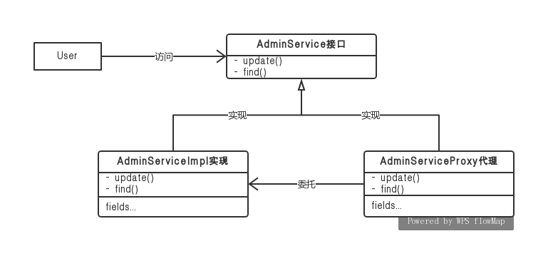
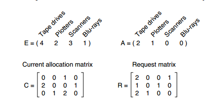
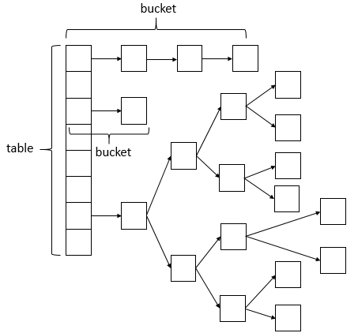

# Java 基础的常见问题2

## 1. 泛型

　　Java 泛型是 JDK 1.5 中引入的一个新特性，泛型的本质是参数化类型，也就是所操作的数据类型被指定为一个参数。

　　特性：只在编译阶段有效。在编译过程中，正确检验泛型结果后，会将泛型的相关信息擦除，并且在对象进入和离开方法的边界处添加类型检查和类型转换的方法。也就是说，泛型信息不会进入到运行时阶段。

### 1.1. 在 jdk 1.5 中，引入了泛型，泛型的存在是用来解决什么问题的。

　　泛型的本质是为了参数化类型，在不创建新的类型情况下，通过泛型指定的不同类型来控制形参具体限制的类型。

## 2. 反射

　　Java 反射机制是在运行状态中，对于任意一个类，都能够知道这个类的所有属性和方法，对于任意一个对象，都能够调用它的任意方法和属性，这种动态获取信息以及动态调用对象方法的功能称为 Java 语言的反射机制。

　　与 Java 反射相关的类如下：

| 类名           | 用途                                               |
| -------------- | -------------------------------------------------- |
| Class 类       | 代表类的实体，在运行的 Java 应用程序中表示类和接口 |
| Field 类       | 代表类的成员变量（成员变量也称为类的属性）         |
| Method  类     | 代表类的方法                                       |
| Constructor 类 | 代表类的构造方法                                   |

### 2.1. Class 类

#### 2.1.1 获得类相关的方法

| 方法                         | 用途                                                   |
| ---------------------------- | ------------------------------------------------------ |
| asSubClass(Class< U > clazz) | 把传递的类的对象转换成代表其子类的对象                 |
| cast(Object obj)             | 把对象转换成代表类或是接口的对象                       |
| getClassLoader()             | 获得类的加载器                                         |
| getClasses()                 | 返回一个数组，数组中包含该类中所有公共类和接口类的对象 |
| getDeclaredClasses()         | 返回一个数组，数组中包含该类中所有类和接口类的对象     |
| forName(String className)    | 根据类名返回类的对象                                   |
| getName()                    | 获得类的完整路径名字                                   |
| newInstance()                | 创建类的实例                                           |
| getPackage()                 | 获取类的包                                             |
| getSimpleName()              | 获得类的名字                                           |
| getSuperclass()              | 获得当前类继承的父类的名字                             |
| getInterfaces()              | 获得当前类实现的类或是接口                             |

#### 2.1.2. 获得类中属性相关的方法

| 方法                          | 用途                   |
| ----------------------------- | ---------------------- |
| getField(String name)         | 获得某个共有的属性对象 |
| getFields()                   | 获得所有共有属性对象   |
| getDeclaredField(String name) | 获得某个属性对象       |
| getDeclaredFields()           | 获得所有属性对象       |

#### 2.1.3. 获得类中注解相关的方法

| 方法                                              | 用途                                   |
| ------------------------------------------------- | -------------------------------------- |
| getAnnotation(Class< A > annotationClass)         | 返回该类中与参数类型匹配的公有注解对象 |
| getAnnotations()                                  | 返回该类所有的公有注解对象             |
| getDeclaredAnnotation(Class< A > annotationClass) | 返回该类中与参数类型匹配的所有主机对象 |
| getDeclaredAnnotations()                          | 返回该类所有的注解对象                 |

#### 2.1.4. 获得类中构造器相关的方法

| 方法                                                 | 用途                                   |
| ---------------------------------------------------- | -------------------------------------- |
| getConstructor(Class... < ? > parameterTypes)        | 获得该类中与参数类型匹配的公有构造方法 |
| getConstructors()                                    | 获得该类的所有公共构造方法             |
| getDeclaredConstructor(Class...< ? > parameterTypes) | 获得该类中与参数类型匹配的构造方法     |
| getDeclaredConstructors()                            | 获得该类所有的构造方法                 |

#### 2.1.5. 获得类中方法相关的方法

| 方法                                                         | 用途                   |
| ------------------------------------------------------------ | ---------------------- |
| getMethod(String name,Class... < ? > parameterTypes)         | 获得该类某个公有的方法 |
| getMethods()                                                 | 获得该类所有公有的方法 |
| getDeclaredMethod(String name,Class... < ? > parameterTypes) | 获得该类某个方法       |
| getDeclaredMethods()                                         | 获得该类所有方法       |

#### 2.1.6. 类中其他重要的方法

| 方法                                                         | 用途                             |
| ------------------------------------------------------------ | -------------------------------- |
| isAnnotation()                                               | 如果是注解类则返回 true          |
| isAnnotationPresent(Class< ? extends Annotation > annotationClass) | 如果是指定注解类型则返回 true    |
| isAnonymousClass()                                           | 如果是匿名类则返回 true          |
| isArray()                                                    | 如果是一个数组类则返回 true      |
| isEnum()                                                     | 如果是枚举类则返回 true          |
| isInstance(Object obj)                                       | 如果 obj 是该类的实例则返回 true |
| isInterface()                                                | 如果是接口类则返回 true          |
| isLocalClass()                                               | 如果是局部类则返回 true          |
| isMemberClass()                                              | 如果是内部类则返回 true          |

### 2.2. Field 类

　　Field 代表类的成员变量（成员变量也称为类的属性）。

| 方法                         | 用途                       |
| ---------------------------- | -------------------------- |
| equals(Object object)        | 属性与 obj 相等则返回 true |
| get(Object obj)              | 获得 obj 中对应的属性值    |
| set(Object obj,Object value) | 设置 obj 中对应属性值      |

### 2.3. Method 类

　　Method 代表类的方法。

| 方法                               | 用途                                                      |
| ---------------------------------- | --------------------------------------------------------- |
| invoke(Object obj, Object... args) | 传递 objecy 对象及参数，调用 object 对象对应的方法 method |

### 2.4. Constructor 类

　　Constructor 代表类的构造方法。

| 方法                            | 用途                       |
| ------------------------------- | -------------------------- |
| newInstance(Object... initargs) | 根据传递的参数创建类的对象 |

### 2.5. 反射的原理，反射创建类实例的三种方式是什么？

```java
        // Book 的实例对象如何表示
        Book book1 = new Book();
        //任何类都是 Class 的实例对象，这个实例对象有三种表示方式
        // 第一种表示方式 - 》 实际在告诉任何一个类都有一个隐含的静态成员变量 class
        Class class1 = Book.class;

/*********************************************/
        // 第二种表示方式，已经知道该类的对象通过 getClass 方法
        Class class2 = book1.getClass();

/*********************************************/
				// 方法三：Class.forName
				Class class3 = null;
        try {
            class3 = Class.forName("Book");
        } catch (ClassNotFoundException e) {
            e.printStackTrace();
        }

```

　　不管哪种方式获取 Book 的 Class 实例，这些都是代表了 Book 类的类类型，一个类只可能是 Class 类的一个实例对象，所以不管哪种方式获取的类实例都是同一个。意思就是说 class1、class2、class3 是同一个，是相等的。

### 2.6. 反射中，Class.forName 和 ClassLoader 区别。

1. Class.forName 加载类时将类进行了初始化。
2. ClassLoader 的 loadClass 方法并没有对类进行初始化，只是把类加载到了虚拟机中。

## 3. 代理

　　代理（Proxy）是一种设计模式。提供了间接对目标对象进行访问的方式，即通过代理对象访问目标对象。这样做的好处是：可以在目标对象实现的基础上，增强额外的功能操作，即扩展目标对象的功能。

　　这就符合了设计模式的开闭原则，即在对既有代码不改动的情况下进行功能的扩展。



### 3.1. 三种代理模式

　　三种代理模式：静态代理、动态代理、Cglib 代理。

#### 3.1.1. 静态代理

　　静态代理在使用时，需要定义接口或者父类，被代理对象与代理对象一起实现相同的接口或者是继承相同的父类。

　　调用的时候通过代理对象的方法调用目标对象。

　　优点：可以做到不修改目标对象的功能前提下，对目标功能扩展。

　　缺点：因为代理对象需要与目标对象实现一样的接口，所以会有很多代理类，类太多。同时，一旦接口增加方法，目标对象与代理对象都要维护。

#### 3.1.2. 动态代理

　　动态代理就是在程序运行时 JVM 才为被代理对象生成代理对象。

　　动态代理的特点：

1. 代理对象，不需要实现接口。
2. 代理对象的生成，是利用 JDK 的 API，动态的在内存中构建代理对象，需要执行创建对象/目标对象实现的结构的类型。
3. 动态代理也叫做：JDK 代理、接口代理。

　　JDK 中生成代理对象的代理类就是 Proxy，所在包是 java.lang.reflect。JDK 实现代理只需要使用 Proxy 的 newProxyInstance 方法，该方法需要接收三个参数，完整的写法是：

```java
static Object newProxyInstance(
  ClassLoader loader,  // 目标对象的类加载器
  Class<?>[] interfaces, // 目标对象实现的接口类型
  InvocationHandler h ) // 事件处理，执行目标对象的方法时，会触发事件处理器的方法，会把当前执行目标对象的方法作为参数传入
```

　　代理对象不需要实现接口，但是目标对象一定要实现接口，否则不能用动态代理。

#### 3.1.3. Cglib 代理

　　静态代理和动态代理模式有个共同点就是都要求目标对象是实现一个接口的目标对象，如果目标对象只是一个单独的对象，并没有实现任何的接口，这个时候就可以使用继承以目标对象子类的方式来实现实现代理，这种方法就叫做：Cglib 代理。

　　Cglib 是一个强大的高性能的代码生成包，它可以在运行期扩展 java 类与实现 java 接口。它广泛的被许多 AOP 的框架使用，例如 Spring AOP 和 synaop，为他们提供方法的 interception（拦截）。

　　Cglib 包的底层是通过使用一个字节码处理框架 ASM 来转换字节码并生成新的类。

　　Cglib 子类代理实现方法：

1. 需要引入 cglib 的 jar 文件。
2. 引入功能包后，就可以在内存中动态创建子类。
3. 代理的类不能为 final ，否则报错。
4. 目标对象的方法如果为 final static ，那么就不会被拦截，即不会执行目标对象额外的业务方法。

　　在 Spring 的 AOP 编程中：如果加入容器的目标对象有实现接口，用 JDK 代理，如果目标对象没有实现接口，用 Cglib 代理。

### 3.2. Java 动态代理实现与原理详细分析

https://www.cnblogs.com/gonjan-blog/p/6685611.html

### 3.3. 描述动态代理的几种实现方式，分别说出相应的优缺点

　　动态代理有 JDK 动态代理和 cglib 动态代理。

　　JDK 动态代理的前提是目标类必须实现一个接口，代理对象跟目标类实现一个接口，从而避过虚拟机的校验。

　　cglib 动态代理是继承并重写目标类，所以目标类和方法不能被声明成 final。

[描述动态代理的几种实现方式 分别说出相应的优缺点](http://xzc.fun/w/index.php?title=描述动态代理的几种实现方式_分别说出相应的优缺点)

https://blog.csdn.net/riemann_/article/details/86849078

### 3.4. 动态代理与 cglib 实现的区别

　　java 动态代理是利用反射机制生成一个实现代理接口的匿名类，在调用具体方法前调用 InvokeHandler 来处理。

　　而 cglib 动态代理是利用 asm 开源包，对代理对象类的 class 文件加载进来，通过修改其字节码生成子类来处理。

1. 如果目标对象实现了接口，默认情况下会采用 JDK 的动态代理实现 AOP 。
2. 如果目标对象实现了接口，可以强制使用 CGLIB 实现 AOP。
3. 如果目标对象没有实现了接口，必须采用 CGLIB 库，spring 会自动在 JDK 动态代理和 CGLIB 之间转换。

　　JDK 动态代理和 CGLIB 字节码生成的区别：

1. JDK 动态代理只能对实现了接口的类生成代理，而不能针对类。
2. CGLIB 是针对类实现代理，主要是对指定的类生成一个子类，覆盖其中的方法，因为是继承，所以该类或方法最好不要声明成 final。

### 3.5. 为什么 cglib 方式可以对接口实现代理

https://www.cnblogs.com/chinajava/p/5880887.html

## 4. 注解

　　注解是没有方法的，只有成员变量，变量名就是注解括号中对应的参数名，变量类型是注解括号中对应的参数类型。

　　注解的本质就是一个继承了 Annotation 接口的接口。接口的属性都是 static final 的，而定义接口的方法就相当于注解的属性。

　　解析一个类或者方法的注解往往有两种形式，一种是编译器直接的扫描，一种是运行期反射。编译器的扫描指的是编译器在对 jaba 代码编译字节码的过程中会检测到某个类或者方法被一些注解修饰，这时它就会对这些注解进行某些处理。

　　注解属性类型可以有以下列出的类型：

1. 基本数据类型。
2. String
3. 枚举类型
4. 注解类型
5. Class 类型
6. 以上类型的一维数组类型

### 4.1. 元注解

　　元注解作用在注解的定义上，一般用于指定某个注解生命周期以及作用目标等信息。

#### 4.1.1. @Retension

　　@Retension：表示注解存在阶段是保留在源码（编译器，@Retention(RetentionPolicy.SOURCE)）、字节码（类加载，@Retention(RetentionPolicy.CLASS)）或者是运行期（JVM 中运行，Rentention(RetentionPolicy.RUNTIME)），即这个注解的存活时间。

　　如果是自定义注解，自定义注解如果只存在源码中或者字节码文件中就无法发挥作用，而在运行期间能获取到注解才能实现目的，所以自定义注解中肯定是使用 @Retention(Retention.RUNNTIME)。

#### 4.1.2. @Target

　　@Target 元注解标识注解作用的范围，可以是类、方法、方法参数变量等。

　　@Target 的取值：

1. @Target(ElementType.TYPE) 作用一个类型，比如接口、类、枚举、注解。
2. @Target(ElementType.FIELD) 作用属性字段、枚举的常量。
3. @Target(ElementType.METHOD) 作用方法
4. @Target(ElementType.PARAMETER) 作用方法参数
5. @Target(ElementType.CONSTRUCTOR) 作用构造函数
6. @Target(ElementType.LOCAL_VARIABLE) 作用局部变量
7. @Target(ElementType.ANNOTATION_TYPE) 作用于注解（@Retention 注解中就使用该属性）
8. @Target(ElementType.PACKAGE) 作用于包
9. @Target(ElementType.TYPE_PARAMETER) 作用于类型泛型，即泛型方法、泛型类、泛型接口（jdk 1.8 加入）
10. @Target(ElementType.TYPE_USE) 类型使用，可以用于标注任意类型除了 class（jdk 1.8 加入）

#### 4.1.3. @Documented

　　@Documented 的作用是能够将注解中的元素包含到 Javadoc 中去。

#### 4.1.4. @Inherited

　　一个被 @Ingerited 注解了的注解修饰了一个父类，如果它的子类没有被其他注解修饰，则它的子类也继承了父类的注解。 

#### 4.1.5. @Repeatable

　　@Repeatable 是 Java 1.8 才加进来的，所以算是一个新的特性。被这个元注解修饰的注解可以同时作用一个对象多次，但是每次作用注解又可以代表不同的含义。

### 4.2. 获注解解属性

　　有几个基本方法：

1. isAnnotationPresent()： 是否存在对应的公有 Annotation 对象。
2. getAnnotation()：获取公有 Annotation 对象。
3. getAnnotations()：获得所有公有 Annotation 对象数组。
4. getDeclaredAnnotation()：返回本元素指定的所有注解。
5. getDeclaredAnnotations()：返回本元素的所有注解，不包含父类继承而来的。

### 4.3. 反射注解的工作原理

　　AnnotationInvovationHandler 是 JAVA 中专门用来处理注解的 Handler。

　　整个反射注解的工作原理：

1. 首先，通过键值对的形式可以为注解属性赋值，香这样 @Hello（value = "hello"）。
2. 接着，用注解修饰某个元素，编译器将扫描每个类或者方法上的注解，会做一个基本的检查，比如这个注解是否允许作用在当前位置，最后将注解信息写入元素的属性表。
3. 然后，当进行反射的时候，虚拟机将所有生命周期在 RUNTIME 的注解取出来放到一个 map 中，并创建一个 AnnotationInvocationHandler 实例，把这个 map 传递给它。
4. 最后，虚拟机将采用 JDK 动态代理机制生成一个目标注解的代理类，并初始化号处理器。

　　这样，一个注解的实例就创建出来了，它的本质上就是一个代理类。

### 4.4. JDK 提供的注解

1. @Override：用来描述当前方法是一个重写的方法，在编译阶段对方法进行检查。
2. @Deprecated：它是用来描述当前方法是一个过时的方法。
3. @SuppressWarning：对程序中的警告去除。
4. @SafeVarargs：参数安全类型注解。目的是提醒开发者不要用参数做一些不安全的操作，它存在会组织编译器产生 unchecked 这样的警告。
5. @FunctionalInterface：函数式接口注解。

### 4.5. 注解的作用

　　注解是一系列元数据，它提供数据用来解释程序代码，但是注解并非是所解释的代码本身的一部分。注解对于代码的运行效果没有直接影响。

1. 提供信息给编译器：编译器可以利用注解来检查出错误或者警告信息，打印出日志。
2. 编译阶段时的处理：软件工具可以用来利用注解信息来自动生成代码、文档或其他相应的自动处理。
3. 运行时处理：某些注解可以在程序运行的时候接受代码的提取，自动做相应的操作。
4. 注解能够提供原数据。

　　处理提取和处理 Annotation 的嗲吗统称为 ART（Annotation Processing Tool）。

## 5. 锁

### 5.1. 死锁？

　　死锁是指多个进程同时阻塞，并循环等待彼此占用的资源而无限期的僵持等待下去的局面，这样程序不可能正常终止。

　　造成死锁的原因是：

1. 系统提供的资源太少了，远不能满足并发进程对资源的需求。
2. 进程推进顺序不合适，互相占有批次需要的资源，同时请求对方占用的资源，这往往是因为程序设计不合理。

### 5.2. 造成死锁的四个条件

1. 互斥条件

   即当资源被一个线程使用时，别的线程不能被使用。即某个资源在一段时间内只能由一个进程占用，不能同时被两个或两个以上的进程占用。

2. 不可抢占条件

   进程所获得的资源在未使用完毕之前，资源请求者不能强制从资源占用者手中夺取资源，资源只能由资源占用者主动释放。

3. 请求和保持条件

   占用且等待，即当资源请求者在请求其他资源的同时保持对原有资源的占用。

4. 循环等待条件

   即存在一个等待队列，P1 占用 P2 的资源，P2 占用 P3 的资源，P3 占用 P1 的资源。这样就形成了一个等待环路。也就是若干个进程形成环形链，每个都占用对方申请的下一个资源。

　　当上述四个条件都成立的时候，便形成死锁。当然，死锁的情况下如果打破上述任何一个条件，并可让死锁消失。

### 5.3. 解决死锁的方法

　　为使系统不发生死锁，必须设法破坏产生死锁的四个必要条件之一，或者允许死锁产生，但当死锁发生时能检测出死锁，并有能力实现恢复。

　　一般有死锁的预防、死锁避免、死锁检查与死锁解除三种方法。

1. 死锁预防：破坏导致死锁必要条件中的任意一个就可以预防死锁。

   例如，要求用户申请资源时一次性申请所需要的全部资源，这就破坏了保持和等待的条件，将资源分层，得到上一层资源后，才能够申请下一层资源，它破坏了环路等待条件。

   预防通常会降低系统的效率。

2. 死锁避免：避免是指进程在每次申请资源时判断这些操作是否安全。

   例如，使用银行家算法。一个小城镇的银行家，他向一群客户分别承诺了一定的贷款额度，算法要做的是判断对请求的满足是否会进入不安全状态，如果是，就拒绝请求，否则予以分配。

   死锁避免算法的执行会增加系统的开销。

3. 死锁检测：死锁预防和死锁避免都是事前措施，而死锁的检测则是判断系统是否处于死锁状态，如果是，则执行死锁解除策略。

4. 死锁解除：这是与死锁检测结合使用的，它使用的方式就是剥夺，即将某进程所拥有的资源强行回收，分配给其他的进程。

#### 5.3.1. 死锁预防

* 打破互斥条件：允许进程同时访问资源（有些资源就是不可以同时访问的，无实用价值）。
* 打破不可抢占调价 ：比如给进程设置优先级，高优先级的可以抢占资源（实现困难，降低系统性能）。
* 打破请求和保持条件：实行资源预分配策略，即进程在运行前一次性的向系统申请它所需要的全部资源（不可预测资源的实用、利用率低、降低并发性）。
* 破坏循环等待条件：采用这种策略，即把资源事先分类编号，按号分配，使进程在申请、占用资源时不会形成环路。所有进程对资源的请求必须严格按资源序号递增的顺序提出（限制和编号实现困难，增加系统开销，有些资源暂时不用也需要先申请，增加了进程对资源的占用时间）。

#### 5.3.2. 死锁避免

　　允许进程动态的申请资源，但系统在进行资源分配前，应先计算此次资源分配的安全性。若此次分配不会导致系统进入不安全状态，则将资源分配给进程，否则，让进程等待。

　　所谓安全状态，是指系统能按某种进程推进顺序，为每个进程分配其所需要的资源，直至满足每个进程对资源的最大需求，是每个进程都可以顺序的完成。此时 P1P2P3... 为安全序列，如果系统无法找到一个安全序列，则称系统处于不安全状态。

　　并非所有的不安全状态都是死锁状态，但当系统进入不安全状态后，便可能进入死锁状态，反之，只要系统处于安全状态，系统便可以避免进入死锁状态。

　　银行家算法是著名的死锁算法。

#### 5.3.3. 死锁检查

　　不试图阻止死锁，而是当检查到死锁发生时，采取措施进行恢复。

##### 5.3.3.1. 每种类型一个资源的死锁检测


　　上图为资源分配图，其中方框表示资源，圆圈表示进程。资源指向进程表示该资源已经分配给该进程，进程只想资源表示进程请求获取该资源。

　　图 a 可以抽取出环，如图 b，它满足了环路等待条件，因此会发生死锁。

　　每种类型一个资源的死锁检测算法是通过检测有向图是否存在环来实现的，从一个节点出发进行深度优先搜索，对访问过的节点进行标记，如果访问了已经标记过的节点，就表示有向图存在环，也就是检测到死锁的发生。

##### 5.3.3.2. 每种类型多个资源的死锁检测



　　上图中，有三个进程四个资源，每个数据代表的含义如下：

* E 向量：资源总量
* A 向量：资源剩余量
* C 矩阵：每个进程所拥有的资源数量，每一行都代表一个进程拥有资源的数量。
* R 矩阵：每个进程请求的资源数量

　　进程 P1 和 P2 所请求的资源都得不到满足，只有进程 P3 可以，让 P3 执行，之后释放 P3 拥有的资源，此时 A = （2 2 2 0）。P2 可以执行，执行后释放 P2 拥有的资源，A=(4 2 2 1)，P1 也可以执行。所有进程都可以顺利执行，没有死锁。

　　算法总结如下：每个进程最开始时都不被标记，执行过程有可能被标记。当算法结束时，任何没有被标记的进程都是死锁进程。

1. 寻找一个没有标记的进程 Pi，它所请求的资源小于等于 A。
2. 如果找到了这样一个进程，那么将 C 矩阵的第 i 行向量加到 A 中，标记该进程，并转回 1.
3. 如果没有这样一个进程，算法终止。

##### 5.3.3.4. 死锁解除

1. 资源剥夺法。

   挂起某些死锁进程，并抢占它的资源，将这些资源分配给其他的死锁进程。但应防止被挂起的进程长时间得不到资源时，而处于资源匮乏的状态。

2. 资源撤销法。

   强制撤销一个或一部分进程并剥夺这些进程的资源，撤销的原则可以按进程的优先级和撤销进程代价的高低进行。

3. 进程回退法。

   让一个或多个进程回退到足以回避死锁的地步，进程回退时资源被释放而不是被剥夺。要求系统保持进程的历史信息，设置还原点。

## 6. ArrayList 和 LinkedList 的区别

1. ArrayList 是基于动态数组的数据结构，LinkedList 是基于链表的数据结构。

2. 对于随机访问 get 和 set，ArrayList 要优于 LinkedList，因为 LinkedList 要移动指针；对于新增和删除操作 add 和 remove，LinkedList 比较占优势，因为 ArrayList 要移动数据。

   对于随机访问，ArrayList 是线性表（数组），get() 直接读取第几个下标，时间复杂度 O(1)，LinkedList 是链表的操作，get() 虎丘第几个元素，依次遍历，时间复杂度为 O(n)。

   而对于增加和删除，ArrayList add(E) 添加元素，直接在后面添加，时间复杂度为 O(1)，add(intde,E) 添加元素，在第几个元素后面插入，后面的元素需要向后移动，复杂度 O(n)，remove() 删除元素，后面的元素需要逐个移动，时间复杂度为 0(n)。

   对于增加和删除，LinkedList add(E) 添加到末尾，时间复杂度为 0(1)，add(index,E) 添加第几个元素后，需要先查找到第几个元素，直接指针指向操作，复杂度为 O(n)，remove() 删除元素，直接指针指向操作，复杂度为 O(1)。

3. ArrayList 的空间浪费主要体现在在 List 列表的结尾预留一定的容量空间，而 LinkedList 的空间浪费体现在它的每一个元素都需要消耗相当的空间（指向前后的指针）。

## 7. List 、 Set 和 Map 的区别

### 7.1. 区别

1. List 和 Set 是存储单列数据的集合，两个接口都是继承自 Collection。

   Map 是存储键值对这样的双列数据的集合。

2. List 中存储的数据是有顺序的，并且值允许重复。

   Set 中存储的数据是无顺序的，并且不允许重复，子类 TreeSet 可以按照默认顺序或者自定义排序。

   Map 中存储的数据是无顺序的，它的键是不允许重复的，但是值是允许重复的。

3. List 集合中对象按照索引位置排序，可以有重复对象，允许按照对象在集合中的索引位置检索对象，例如通过 list.get(i) 方法来获取集合中的元素。

4. Map 中的每一个元素包含一个键和一个值，成对出现，键对象不可以重复，值对象可以重复。

5. Set 集合中的对象不按照特定的方式排序，并且没有重复对象，但它的实现类能对集合中的对象按照特定的方式排序，例如 TreeSet 类，可以按照默认顺序，也可以通过实现 Java.util.Comparator< Type > 接口来自定义排序方式。

6. Map 接口的实现类中 TreeMap 和 Hashtable 不支持存 null，而 HashMap 和 LinkedHashMap 是支持存 null 的。相对应的 Set 接口的实现类中 TreeSet 是不支持存 null 的，HashSet 和 LinkedHashSet 是支持存 null 的。

### 7.2. List 接口的三个实现类

　　次序是 list 的最重要特点，它确保维持元素特定的顺序。

1. LinkedList

   基于链表实现，链表内存是散列的，增删快，查找慢。

   对顺序访问进行优化，向 List 中间插入与删除的开销并不大，具有 addFirst()、addLast()、getFirst()、getLast()、removeFirst() 和 removeLast()。这些方法使得 LinkedList 可当作堆栈 / 队列 / 双向队列。

2. ArrayList

   基于数组实现，非线程安全，效率高，增删慢，查找快。

3. Vector

   基于数组实现，线程安全，效率低，增删慢，查找慢。

### 7.3. Map 接口的四个实现类

1. HashMap

   基于 hash 表的 Map 接口实现，非线程安全，高效，支持 null 值和 null 键。

2. HashTable

   线程安全、低效，不支持 null 值和 null 键。

3. LinkedHashMap

   是 HashMap 的一个子类，保存了记录的插入顺序。

4. SortedMap 接口

   SortedMap 接口需要数据的 key 支持 Comparable，或者可以被支持的 Comparator 接受。

   TreeMap 是 SortedMap 接口的机遇红黑树的实现，此类保证了映射按照升序排序排列关键字，根据使用的构造方法不同，可能会按照键的类的自然顺序进行排序（参见 Comparable），或者按照创建时所提供的比较器进行排序。此实现为 containsKey、get、put 和 remove 操作提供了保证的 log(n) 时间开销。

### 7.4. Set 接口有两个实现类

　　存入 Set 的每个元素必须唯一，不保证维护元素的次序。加入 Set 的 Object 必须定义 equeals() 方法。

1. HashSet

   为快速查找而设计的 Set，底层是由 HashMap 实现，不允许集合中有重复的值，存入 HashSet 对象需要重写 equals() 和 hashCode() 方法。

2. LinkedHashSet

   继承于 HashSet，同时又基于 LinkedHashMap 来实现，底层使用的是 LinkedHashMap。

   具有 HashSet 的查询速度，但内部使用链表维护元素的次序。

3. TreeSet

   TreeSet 保护次序的 Set，使用它可以从 Set 中提取有序序列。

#### 7.4.1. Set 源码

　　Set 的有三个实现类：TreeSet、HashSet、LinkedHashSet。

1. HashSet  的底层是用 HashMap 来构建的。
2. LinkedHashSet 的底层是用 LinkedHashMap 构建的。
3. TreeSet 的底是用 TreeMap 来构建的。

　　所以，Set 的实体类主要就是以 Map 为基础，将 Set 构建的对象放入 map 的 key 中，相对应的使用环境也和对应的 map 相同。

### 7.5. 用过哪些 Map 类，都有什么区别？


### 7.6. 有没有有循序的 Map 实现类，如果有，他们是怎么保证有序的？


## 8 . HashMap

　　HashMap 是一个哈希表，它存储的内容是键值对（key-value）映射。

### 8.1. HashMap 的源码

　　HashMap 继承 AbstractMap，并且实现 Map、Cloneable、Serializable 接口。

　　以 Java 1.7 源码为例，分析 HashMap 的实现。


　　HashMap 由数组 + 链表组成，数组是 HashMap 的主体，链表则是主要为了解决哈希冲突的。

　　HashMap 的主干是一个 Entry 数组，初始值是空数组，数组的长度必须是 2 的倍数。Entry 是 HashMap 的基本组成单元，每一个 Entry 包含一个 key-value 键值对。Entry 是一个链表的格式，除了包含 key 和 value 键值对，还包含 Entry< K,V > next 指向下一个数据的指针。

　　HashMap 有成员变量 threshold （阈值）和 loadFactor（负载因子），负载因子代表了 table 的填充度是多少，默认是 0.75。当 table == {} 时，该值为初始容量（初始容量 capacity 默认为 16）；当 table 被填充了，也就是为 table 分配内存空间后，threshold 一般为 capacity * loadFactory。HashMap 在进行扩容时需要参考 threshold。

　　HashMap 构造方法：除了参数为 map 的构造方法，HashMap 在构造方法中是不会初始化映射数组的。HashMap 中用一个数组（Entry[] table）来保存映射数组，用链表（Entry）来存储映射的数值。

　　put() ：在 put() 方法中，如果数组还是空的，则会调用 inflateTable() 方法初始化数组，所以在除去 map 参数饿构造方法外，其他的构造方法会在 put() 方法中初始化数据。

　　确定 key 最终存储位置的流程：


　　put() 插入数据的时候，当发生哈希冲突并且 size 大于阈值的时候，需要进行数组扩容，扩容时，需要新建一个长度为之前数组 2 倍的新数组，然后将当前的 Entry 数组中的元素全部传输过去，扩容后的新数组长度为之前的 2 倍，所以扩容相对来说是个耗资源的操作。

　　get() 方法通过 key 值返回对应 value，如果 key 为 null，则直接去 table[0] 处检索，如果不为 null，则调用 getEntry(key) 获取。

### 8.2. HashMap 的数组长度为什么一定要保持为 2 的次幂？

1. 扩容后减少数组的移动

   将 HashMap 的数组长度保持为 2 的次幂，在扩容后，与之前的 length-1 相比，只有最高位的一位差异，这样在通过 h&(lenght-1) 的时候，只要 h 对应的最高位的一位差异位为 1，就能保证得到的新的数组索引和老数组索引一致（减少了之前已经散列好的数组位置重新调换）。

   

2. 使索引更加均匀

   数组长度保持 2 的次幂，length-1 的低位都为 1，会使得获得的数组索引 index 更加均匀。高位不会对结果产生影响，但是对于 h 的低位部分，任何一位的变化都会对结果产生影响。

   

### 8.3. 为什么 HashMap 的 key 要实现 hashCode() 方法

　　在 HashMap 中，判断一个 key 值相同：

```java
if (e.hash == hash &&
                ((k = e.key) == key || (key != null && key.equals(k))))
```

　　e.hash 和 hash 是对 key 的 hashCode() 的值进行一系列的位置操作后的值，可以看到判断一个 key 值的相同要它的 hashCode() 相同。

　　如果传入的 key 对象重写了 equals() 方法却没有重写 hahsCode() 方法，当用 get() 方法来获取 key 对应的 value 值时可能 equals() 判断是相等的，但 hashCode() 结果不同，这时返回的就是 null。

### 8.4. HashMap 不同版本代码的区别

1. JDK 1.8 在 JDK 1.7 在基础上增加了红黑树来进行优化。即当链表超过 TREEIFY_THRESHOLD（默认为 8）时，将链表转换为红黑树，利用红黑树快速增删改查的特点提高 HashMap 的性能，其中会用到红黑树的插入、删除、查找等算法。当小于 UTREEIFY_THRESHOLD（默认为 6）时，又会转回链表以达到性能平衡。

2. hash() 方法不同

   JDK 1.8 的 hash() 方法可以将 hashCode 的高位和低位的值进行混合做异或运算，而且混合后，低位的信息中加入了高位的信息，这样高位的信息被保留了下来。掺杂的元素多了，那么生成的 hash 值的随机性会增大。

   JDK 1.7 的 hash() 方法是将 key 的 hashCode 值进行了一系列的位移运算获取的 hash 值。

3. 插入的方式不同

   JDK 1.7 采用的是头插法，而 JDK 1.8 及之后使用的都是尾插法。这时因为 JDK 1.7 是用单链表进行的纵向延伸，采用头插法能够提供插入的效率，但是也会容易出现逆序且环形链表死循环问题。在 JDK 1.8 之后是因为加入了红黑树使用尾插法，能够避免出现逆序且链表死循环的问题。

4. 扩容后数据存储位置的计算方式不同

   在 JDK 1.7 的时候是直接用 hash 值和需要扩容的二进制树进行 & 运算（hash 值 & length-1）。

   而在 JDK 1.8 的时候直接使用了 JDK 1.7 计算的规律，就是扩容前的原始位置 + 扩容的大小值 = JDK 1.8 的计算方式，而不再是 JDK 1.7 的那种异或的方式。凡是这种方式就相当于只需要判断 hash 值的新增参加运算的位是 0 还是 1 就直接迅速计算出扩容后的存储方式。

   JDK 扩容时长度扩展为原来的 2 倍，使用的是 2 次幂的扩展，所以，元素的位置要么是在原位置，要么是在原位置再移动 2 次幂的位置。

5. 将 capacity 设置为 2 的次幂的方式不同

   JDK 1.7 采用的是 roundUpToPowerOf2(int number) 方法：

   ```java
       private static int roundUpToPowerOf2(int number) {
           int rounded = number >= MAXIMUM_CAPACITY
                   ? MAXIMUM_CAPACITY
                   : (rounded = Integer.highestOneBit(number)) != 0
                       ? (Integer.bitCount(number) > 1) ? rounded << 1 : rounded
                       : 1;
   
           return rounded;
       }
   ```

   Integer.highestOneBit(number) 返回的是数值的最高位数值，例如 0010 1101 返回的则是 0010 0000，而 Integer.bitCount(number) 返回的是二进制中为 1 的数量，如果最高位数值不为 0，并且二进制中 1 的数量也是大于 1 的，那么会返回 rounded << 1 的好意位数值。 

   JDK 1.8 的是调用 tableSizeFor(int cap) 方法来返回一个比给定整数大且最接近的 2 的幂次方整数的。

   ```java
       static final int tableSizeFor(int cap) {        // 为了防止 cap 已经是 2 的幂次        
         int n = cap - 1;        
         n |= n >>> 1;        
         n |= n >>> 2;        
         n |= n >>> 4;        
         n |= n >>> 8;        
         n |= n >>> 16;        
         return (n < 0) ? 1 : (n >= MAXIMUM_CAPACITY) ? MAXIMUM_CAPACITY : n + 1;    }
   ```

### 8.5. 为什么有了 HashMap 还有有 HashTable。

　　HashMap 是非线程安全的，在多线程的情况下，不同线程访问 HashMap 可能会导致死循环、修改数值失败、获取数据不及时等问题，所以引出了 HashTable。

　　HashTable 也是基于哈希表实现的，同样每个元素是一个 key-value 对，其内部也是通过单链表解决冲突问题，容量不足（超过了阈值）时，同样会自动增长。

　　HashTable 是线程安全的，能用于多线程环境中。

　　HashTable 是线程安全的，它的方法是同步的，可以直接用在多线程环境中，而 HashMap 则不是线程安全的，在多线程环境中，需要手动实现同步机制。

　　如果是在 JDK 1.5 以上，推荐使用 ConcurrentHashMap，ConcurrentHashMap 也是线程安全的。

　　可以用以下语句让 HashMap 进行同步：

```java
Map m = Collections.synchronizeMap(hashMap);
```

### 8.6. HashMap 和 HashTable 的区别

1. 继承的父类不同

   HashTable 继承自 Dictionary 类，而 HashMap 继承自 AbstractMap 类，但二者都实现了 Map 接口。

2. 线程安全性不同

   HashTable 中的方法是 synchornized 的，而 HashMap 中的方法在缺省情况下是非 synchronized 的。在多线程并发的环境下，可以直接使用 HashTable，不需要自己为它的方法实现同步，而使用 HashMap 时就必须要自己增加同步处理。

3. 是否提供 contains 类方法

   HashMap 把 HashTable 的 contains() 方法去掉了，改成 containsValue() 和 containsKey()，因为 contains() 方法容易让人引起误解。

   HashTable 则保留了 contains()、containsValue() 和 containsKey() 三个方法，其中 contains() 和 containsValue() 功能相同。

4. key 和 value 是否允许 null 值

   HashTable 中，key 和 value 都不允许出现 null 值。但是如果在 HashTable 中有类似 put(null,null) 的操作，编译同样可以通过，因为 key 和 value 都是 Object 类型，但运行时会抛出 NullPointerException 异常，这是 JDK 的规范规定的。

   HashMap 中，null 可以作为键，这样的键只有一个，可以有一个或多个键对应的值为 null。当 get() 方法返回 null 值时，可能是 HashMap 中没有该键，也可能是该键所对应的值为 null。因此，在 HashMap 中不能由 get() 方法来判断 HashMap 中是否存在某个键，而应该用 containsKey() 方法来判断。

5. 两个遍历方式的内部实现上不同

   HashMap 的迭代器（Interator）是 fail-fast 迭代器，而 HashTable 的 Enumeration 迭代器不是 fail-fast 的。所以当有其他线程改变了 HashMap 的结构（增加或者移除元素），就会抛出 ConcurrentModificationException 异常，但迭代器本身的 remove() 方法移除元素则不会抛出 ConcurrentModificationException 异常，但这并不是一个一定发生的行为，要看 JVM。这条同样也是 Enumeration 和 Iterator 的区别。

6. hash 值不同

   哈希值的使用不同，HashTable 直接使用对象的 hashCode，而 HashMap 重新计算 hash 值。

7. 内部实现使用数组初始化和扩容方式不同

   HashTable 在不指定容量的情况下的默认容量为 11，而 HashMap 为 16，HashTable 不要求底层数组的容量一定要为 2 的整数次幂，而 HashMap 则要求一定为 2 的整数次幂。

   HashTable 扩容时，将容量变为原来的 2 倍加 1，而 HashMap 扩容时，将容量变为原来的 2 倍。

8. 其他

   由于 HashTable 是线程安全的也是 synchronized，所以在单线程环境下它比 HashMap 要慢。如果不需要同步，只需要单一线程，那么使用 HashMap 的性能要好过 HashTable。

### 8.7. HashMap 线程不安全的体现

　　HashMap 底层是一个 Entry 数组，当发生 hash 冲突的时候，HashMap 是采用链表的方式来解决的，在对应的数组位置访问链表的头节点。对链表而言，新加入的节点会从头节点加入。

**put() 方法线程不安全**

　　在多线程中调用 put() 方法时会调用 addEntry(int hash,  K key, V value, int bucketIndex) 方法，bucketIndex 是位置索引。在这个方法中会先获取链表的头部，然后新建一个节点存储传递进来的键值对，并且会将旧的链表头部作为参数去创建新的节点，而旧的链表头部就是新节点的 next 参数值，最后设置 Entry 数组的 bucketIndex 下标处存储新节点。

　　如果线程 A 和线程 B 同时对容易个数组调用 addEntry()，两个线程会同时得到现在的头节点，然后 A 写入新的头节点之后，B 也写入新的头节点，那 B 的写入操作就会覆盖 A 的写入操作造成 A 的写入操作丢失。

```java
  	// 新增 Entry。将 “key-value” 插入指定位置，bucketIndex 是位置索引。      
    void addEntry(int hash, K key, V value, int bucketIndex) {      
        // 保存 “bucketIndex” 位置的值到 “e” 中      
        Entry<K,V> e = table[bucketIndex];      
        // 设置 “bucketIndex” 位置的元素为 “新 Entry”，      
        // 设置 “e”为“ 新 Entry 的下一个节点”      
        table[bucketIndex] = new Entry<K,V>(hash, key, value, e);      
        // 若 HashMap 的实际大小 不小于 “阈值”，则调整 HashMap 的大小      
        if (size++ >= threshold)      
            resize(2 * table.length);      
    } 
```

**remove() 方法线程不安全**

　　当多个线程同时操作同一个数组位置的时候，也都会先取得现在状态下该位置存储的头节点，然后各自去进行计算操作之后再将结果写回到该数组位置去，其实写回的时候可能其他的线程已经将这个位置给修改过了，就会覆盖其他线程的修改。 

**resize() 方法线程不安全**

　　addEntry() 中当加入新的键值对后键值对总数量超过阈值的时候会调用一个 resize() 操作进行扩容。

　　resize() 方法会生成一个新的容量的数组，然后对原数组的所有键值对重新进行计算和写入新的数组，之后指向新生成的数组。

　　当多个线程同时检测到总数量超过阈值的时候就会调用 resize() 操作，各自生成新的数组并 rehash 后赋给该 map 底层的数组 table，结果最终只有一个线程生成的新数组被赋给 table 变量，其他线程的均会丢失，而且当某些线程已经完成赋值而其他线程刚开始的时候，就会用已经被赋值的 table 作为原始数组，这样也会有问题。

```java
    // 重新调整 HashMap 的大小，newCapacity 是调整后的容量      
    void resize(int newCapacity) {      
        Entry[] oldTable = table;      
        int oldCapacity = oldTable.length;     
        // 如果就容量已经达到了最大值，则不能再扩容，直接返回    
        if (oldCapacity == MAXIMUM_CAPACITY) {      
            threshold = Integer.MAX_VALUE;      
            return;      
        }      
     
        // 新建一个 HashMap，将 “ 旧 HashMap ” 的全部元素添加到 “ 新 HashMap ” 中，      
        // 然后，将 “ 新 HashMap” 赋值给 “ 旧 HashMap”。      
        Entry[] newTable = new Entry[newCapacity];      
        transfer(newTable);      
        table = newTable;      
        threshold = (int)(newCapacity * loadFactor);      
    }  
```

### 8.8. ConcurrentHashMap

　　ConcurrentHashMap 是 JDK 1.5 新引入的 java.util.concurrent 包的成员，作为 HashTable 的替代。HashTable 采用了同步整个方法的结构，虽然实现了线程安全但是性能也就大大降低了，而 HashMap 在并发情况下会很容易出错。所以就有了安全并且在多线程使用的 ConcurrentHashMap。

　　ConcurrentHashMap 是线程安全并且高效的一种容器。

### 8.8.1. JDK 1.7 版本的 ConcurrentHashMap 的实现原理

　　在 JDK 1.7 中 ConcurrentHashMap 采用了数组 + Segment + 分段锁的方式实现。其中 Segment 继承于 ReetrantLock，所以它是一种可重入锁。

　　Segment 在其中扮演锁的角色，HashEntry 用于存储数据。

　　核心数据如 value 以及数据链表都是 volatile 修饰的，保证了获取时的可见性。

　　ConcurrentHashMap 采用了非常精妙的 “ 分段锁 ” 策略，ConcurrentHashMap 的主干是个 Segment 数组。

　　一个 ConcurrentHashMap 包括一个 Segment 数组，Segment 就是一个子哈希表，一个 Segment 元素包括一个 HashEntry 数组，HashEntry 是一种链表式的结构，每一个 Segment 维护着 HashEntry 数组中的元素。

　　并发环境下，对于不同 Segment 的数据进行操作时不同考虑锁竞争的。所以，对于同一个 Segment 的操作才需考虑线程同步，不同的 Segment 则无需考虑。

　　写操作的时候可以只对元素所在的 Segment 进行加锁即可，不会影响到其他的 Segment，这样，在最理想的情况下，ConcurrentHashMap 可以最高同时支持 Segment 数量大小的写操作（刚好这些写操作都非常平均的分布在所有的 Segment 上）。

　　使用 ConcurrentHashMap 的时候有时候会遇到跨段的问题，跨段的时候（size()、containValue()），可能需要锁定部分段或者全段，当操作结束之后，又会按照顺序进行释放每一段的锁。注意是按照顺序解锁的。

　　得到一个元素需要进行两次 hash 操作，第一次得到 Segment，第二次得到 HashEntry 中的链表头部，这样做会使得 hash 的过程比普通的 HashMap 要长。 

#### 8.8.1. ConcurrentHashMap 如何体现线程安全？

 　　采用了分段锁。在插入和删除的时候先定位 Segment 所在的位置，然后对 Segment 加锁，确保线程安全，在获取和查询的时候，数据 value 是 volatile 修饰的，也确保了数据的同步。

### 8.9.  JAVA 8 版本的 ConcurrentHashMap 的实现原理



 　　JDK 1.8 的实现依然使用分段锁机制，不过分段的不再是 Segment，而是 Node，所以锁采用的也不再是 ReentrantLock（Segment 继承 ReententLock），而是利用 CAS + Synchronized 来保证并发更新的安全。数据结构采用：数组+链表+红黑树。

 　　put 方法中，通过 key 定位出 node，如果为空表示当前位置可以写入数据，利用循环 CAS 写入，如果不为空，则利用 synchronized 锁写入数据。写入完成后如果数量大于 TREEIFY_HRESHOLD（8） 则要转换为红黑树。

 　　因为 Node 的 val（值） 和 next （下一个节点）成员是被 volatile 修饰的，所以 get 方法并不需要进行加锁操作，因为获取的就是最新的值。

 　　ConcurrentHashMap 的 key 和 value 不允许为 null，是因为在 put 方法中，如果 key 或者 value 为 null，就会直接抛出 NullPointerException 异常。

### 8.9.  JAVA 8 的 ConcurrentHashMap 为什么放弃了分段锁，有什么问题吗？如果你来设计，你如何设计？

### 8.9.1. JAVA 8 的 ConcurrentHashMap 为什么放弃了分段锁

 　　原因：

1. 减少内存开销。如果使用 ReentrantLock 则需要结点继承 AQS 来获得同步支持，增加内存开销，而 1.8 中只有链表的头结点需要进行同步。

   1.8 插入操作：首先通过 hash 找到对应链表过后，查看是否是第一个 object，如果是，直接用 CAS 原则插入，无需加锁，然后如果不是链表第一个 Object，则直接用链表第一个 Object 加锁，这里加的锁是 synchronized，虽然效率不如 ReentrantLock，但节约了空间，这里会一直用第一个 Object 为锁，直到重新计算 map 大小，比如扩容或者操作了第一个 Object 为止。

2. 内部优化。synchronized 则是 JVM 直接支持的，JVM 能够在运行时作出相应的优化操作：锁粗化、锁消除、锁自旋等等。

### 8.9.2. JAVA 8 的 ConcurrentHashMap 放弃了分段锁，有什么问题

 　　synchronized 可能会造成死锁，ReentrantLock 可以获取锁的时间进行设置，避免死锁。

### 8.9.3. 如果你来设计，你如何设计？

 　　给 synchronized 加上阻塞等待和唤醒，避免死锁。

## 9. final 

### 9.1. final 的用途

 　　final 关键字可以用来修饰引用、方法和类。

#### 9.1.1. 用来修饰一个引用

1. 如果引用为基本数据类型，则该引用为常量，该值无法修改。
2. 如果引用为引用数据类型，比如对象、数组，则该对象、数组本身可以修改，但指向该对象或数组的地址的引用不能修改。
3. 如果引用是类的成员变量，则必须当场赋值，否则编译会报错。

#### 9.1.2. 用来修饰一个方法

 　　当使用 final 修饰方法时，这个方法将成为最终方法，无法被子类重写。但是，该方法仍然可以被继承。

#### 9.1.3. 用来修饰类

 　　当用 final 修饰类时，该类成为最终类，无法被继承。

### 9.2. final关键字，为什么匿名内部类使用局部引用要用final

 　　如果要实例化内部类，那么必须实例化外部类，这就是原因所在，内部类持有外部类的一个引用，这也是内部类能无条件访问外部类所有成员方法和成员变量的根本原因。

 　　如果匿名内部类使用了局部变量，那么编译器会将使用的值拷贝一份，作为构造函数的一个参数传递进来（构造函数是编译器自动添加）。（构造函数是编译器自动添加）。因为局部变量在方法或者代码块执行完毕，就会被销毁，所以编译器在编译的时候，就拷贝了一份局部变量存储的字面值或者地址值，这样局部变量被销毁时，奴名内部类依然拥有之前传递进来的值。假如传递到匿名内部类的局部变量，不加 final 修饰，那么意味着局部变量可以改变，这就意味着匿名内部类里面值得变更和外部得变更不能同步，虽然内部类持有的是局部变量值的拷贝，但是语义应该保持一致，语义保持一致的前提是值要能同步，因为 Java 编译器的设计无法提供两边同步变更的机制，所以直接锁死，不允许内外变更。

## 10. 在多线程的情况下，在JAVA 中如何保证一个方法只被一个对象调用？

1. synchronized
2. volitle
3. Lock/unlock
4. 信号量
5. reentrantlock/synchronized 区别？如何实现上锁


