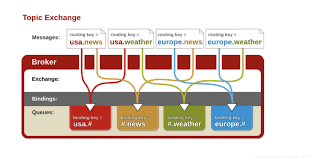

# RabbitMQ 知识

## 概述

　　官方地址：https://www.rabbitmq.com/

　　官方教程：https://www.rabbitmq.com/tutorials/tutorial-one-java.html

　　MQ 全称为 Message Queue，消息队列（MQ）是一种应用程序对应用程序的通信方法，也就是信息中间件。

　　RabbitMQ 则是 MQ 的一种开源实现，遵循 AMQP（高级消息队列协议）协议，特点是消息转发是非同步并且可靠的。

　　MQ 的模型：

　　RabbitMQ 比 MQ 模型有更加详细的模型概念：

　　RabbitMQ 主要用来处理应用程序之间消息的存储与转发，可让消费者和生产者解耦，消息是基于二进制的。

## 概念

### 信道

　　引入信道的原因：RabbitMQ 之间使用 TCP 连接，每次发布消息都要连接 TCP，这样会导致连接资源严重浪费，从而造成服务器性能瓶颈，所以引入信道，将需要发布消息的线程都包装成一条信道在 TCP 中传输，这样 RabbitMQ 为所有的线程只用一条 TCP 连接即可。

　　一条 TCP 连接可以支持多个信道，模型如下：

### 队列

　　消息队列用来保存消息直到发送给消费者。

　　它是消息的容器，也是消息的终点。

　　一个消息可投入一个或多个队列。

　　消息一直在队列里面，等待消费者连接到这个队列将其取走。

### 绑定

　　绑定用于消息队列和交换器之间的关联。

　　一个绑定就是基于路由键将交换器和消息队列连接起来的路由规则，所以可以将交换器理解成一个由绑定构成的路由表，如下：

### 交换器

　　向 RabbitMQ 发送消息，实际上是把消息发到交换器上，再由交换器根据相关路由规则发到特定队列上，在队列上监听的消费者就可以进行消费了。所以生产者发送消息时会经有交换器（Exchange）来决定要给哪个队列（Queue）。

　　目前 RabbitMQ 共有四种烈性：direct、fanot、topic、headers。

#### direct 交换器

　　生产者传送的消息中的路由键（ routing key ）必须和 Queue Binding 中的 Binding key 一致，交换器（exchange）就将消息发到对应的队列（queue）中。它是完全匹配、单播的模式。

#### fanout 交换器

　　每个发送到 fanout 交换器中的消息，它不会去匹配路由键，直接把消息投递到所有绑定到 fanout 交换器中的队列上，它就像一个广播站一样，它会向所有收听广播的用户发送消息。简单来说就是轮流把消息放进每个队列中。

　　对应到系统上，它允许你针对一个消息作不同操作，比如用户上传了一张新的图片，系统要同时对这个事件进行不同的操作，比如删除旧的图片缓存、增加积分奖励等等，这样旧大大降低了系统之间的耦合度。

#### topic 交换器

　　topic 交换器有点类似于 direct 交换器，但是 topic 交换器使用部分匹配比 direct 交换器多了更多弹性。

　　它通过模式匹配分配消息的路由键属性，将路由键和某个模式进行匹配，此时队列需要绑定到一个模式上。它将路由键和绑定键的字符串切分成单词，这些单词之间用点隔开。

　　它同样也会识别两个通配符：符号 “ # ” 和符号 “ * ”：

* “ # ” 匹配 0 个或多个单词。
* “ * ” 匹配不多不少一个单词。

#### header 交换器

　　header 类型路由规则和上面的三个都不一样，header 交换器不是通过路由键（routing key）进行路由的，而是通过消息的 headers。

　　而且 headers 交换器和 direct 交换器完全一致，但性能差很多，目前几乎用不到了。

#### 交换器小结

　　RabbitMQ 的交换器（exchange）的作用是路由消息，可以根据应用场景的不同选择合适的交换机。

　　如果需要精准路由到队列，或者对消息进行单一维度分类（只对日志的严重程度这一维度进行分配）可以使用 direct 类型交换器；如果需要广播消息，可以使用 fanout 类型交换器；如果对消息进行多维度分类，可以使用 topic 交换器；如果消息归类的逻辑包含了较多的 AND/OR 逻辑判断，可以使用 header 交换器（开发中很少用到 header 交换器）。　　

## 参考文章

[快速掌握 RabbitMQ (二)--四种 Exchange 介绍及代码演示](https://www.cnblogs.com/wyy1234/p/10837615.html)