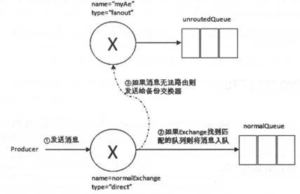

# 提高 RabbitMQ 传输消息数据的可靠性途径

## 问题描述

　　RabbitMQ 有四种丢失消息的情况：

1.  RabbitMQ 生产者不知道发布的消息是否已经正确到达服务器，如果中间发生网络异常等情况，消息丢失。
2. RabbitMQ 没有设置持久化，RabbitMQ 服务器重启后消息丢失。
3. RabbitMQ 消费者是自动确认，消息发出后就会从队列中移除，如果消费者出前异常挂掉的情况，消息丢失。
4. RabbitMQ 的消息没有匹配队列，消息丢失。

　　上面的四种情况，就是常见的消息丢失的情况，接下来针对这四种情况来描述气应对方法。

## 问题一：生产者确认消息机制

　　问题一是生产者不确定发布的消息已经到达了服务器，可以通过生产者的**确认消息机制**来解决。

　　确认消息机制主要分为两种：

1. 事务机制
2. 发送方确认机制

### 事务机制

　　与事物机制相关的有三个方法，分别是：

1. channel.txSelect 设置当前信道为事务模式。
2. channel.txCommit 提交事务。
3. channel.txRollback 事务回滚。

　　如果事务提交成功，则消息一定是到达了 RabbitMQ 中，如果事务提交之前由于发送异常或者其他原因，捕获异常后可以进行 channel.txRollback 回滚。


### 确认机制

　　生产者将信道设置为 confirm 确认模式，确认之后所有在信道上的消息将会被指派一个唯一的从 1 开始的 ID，一旦消息被正确匹配到所有队列后，RabbitMQ 就会发送一个确认 Basic.Ack 给生产者（包含消息的唯一 ID），生产者便知晓消息是否正确到达目的地了。 

　　消息如果是持久化的，那么确认消息会在消息写入磁盘之后发出。RabbitMQ 中的 deliveryTag 包含了确认消息序号，还可以设置 multiple 参数，表示到这个序号之前的所有消息都已经得到处理。

　　确认机制相对事务机制来说，相比较代码来说比较复杂，但会经常使用。

　　确认机制主要有单条确认、批量确认、异步批量确认三种方式。

#### 单条确认

　　此种方式比较简单，一般都是一条条的发送。


#### 批量确认

　　批量确认 confirm 需要解决出现返回的 Basic.Nack 或者超时情况的话，生产者需要将这一批次消息全部重发，可以通过增加一个缓存，将发送成功并且 Ack 之后的消息去除，剩下 Nack 或者超时的消息，这样就能合适地将需要重发的消息筛选出来。


#### 异步批量确认

　　异步确认方式通过在生产者 addConfirmListener 增加 ConfirmListener 回调接口，包括 handleAck 与 handleNack 处理方法。

　　和批量确认一样，也需要增加一个缓存，将发送成功并 Ack 的消息去除，便于处理 Nack 和超时的消息。存储缓存最好采用 SortedSet 数据结构。

### 确认消息机制比较

　　1. 确认机制相对于事务机制，最大的好处就是可以异步处理提高吞吐量，不需要额外等待消耗资源，但是两者不能同时共存。
    　　2. 确认机制的三种方式中，批量确认的最大问题在于返回的 Nack 消息需要重新发送，异步确认消息在诗句生产环境中是最推荐的。

## 问题二：持久化

　　问题二主要是在 RabbitMQ 没有设置持久化时，RabbitMQ 服务器出现异常，重启后，消息丢失。可以通过**增加交换器、队列和消息的持久化**来避免。

### 交换器的持久化

　　如果交换器不设置持久化，那么在 RabbitMQ 服务器重启之后，相关的交换器元数据会丢失，消息不会丢失，只是不能将消息发送到这个交换器上，因此，建议将其设置为持久化。

　　交换器的持久化时通过声明交换器 durable 参数为 true 实现的。

```java
channel.exchangeDeclare(EXCHANGE_NAME, "direct", true, false, null);
```

### 队列的持久化

　　在 RabbitMQ 服务器重启之后，相关的元数据会丢失，数据也会跟着丢失，消息也就丢失了。

　　队列的持久化时通过声明队列 durable 参数为 true 实现的。

```java
channel.queueDeclare(QUEUE_NAME, true, false, false, null);
```


### 消息的持久化

　　队列的持久化不能保证内存存储的消息不会丢失，要确保消息不会丢失，需要将消息也设置为持久化。也就是说只有实现了队列与消息的持久化，才能保证消息不会丢失。

　　通过设置 BasicProperties 中的 deliveryMode 属性为 2 可实现消息的持久化。

```java
// 其中的2就是投递模式
public static Class final BasicProperties_PERSISTENT_TEXT_PLAIN = 
new BasicProperties("text/plain", null, null, 2, null, null, null, null, null, null, null, null, null);
```

## 问题三：消费者确认消息

　　RabbitMQ 默认情况下时自动确认，那么不管消费者发生什么情况，消息发出后会自动从队列中移除，但是如果消费者出现异常，比如挂掉了，那么消息就丢失了。可以通过设置消息**手动确认**来解决该问题。

### 手动确认

　　设置 autoAck 参数为 false 时，是手动确认。

　　在手动确认模式下，RabbitMQ 会等待消费者显式的回复确认信号后从内存中移出消息。此时消息会分为两类：1.等待投递给消费者的消息，2.已经投递给消费者但还没有收到收费这确认信号的消息。

　　设置 autoAck 参数为 true 时，是自动确认。

　　在自动确认模式下，RabbitMQ 会自动隐式地回复确认信号，然后将消息从内存中移去，RabbitMQ 不需要知道消费者是否真正的消费了这些消息，RabbitMQ 会自动把发送出去的消息置为确认，然后直接从内存中删除。

### 重新投递

　　在手动确认模式下，如果消费者由于某些原因断开了，RabbitMQ 会重新安排消息进入队列等待下一个消费者，也就是 RabbitMQ 不会设置消息的过期时间，它只判断是否需要重新安排消息重新投递，而判断的唯一标准是消费此消息的消费者连接是否已经断开。

### 消费者拒绝消息

　　消费者拒绝消息的方式有两种：

1. 使用 channel.basicReject() 方法，但只能拒绝一条。

   ```java
   void basicReject(long deliveryTag, boolean requeue) throws IOException;
   ```

   deliveryTag：消息的唯一标识。

   requeue：表示拒绝的消息是否重新入队。

2. 使用 channel.basicNack()，不同于前者，此方法可以批量拒绝。

   ```java
   void basicNack(long deliveryTag, boolean multiple , boolean requeue) throws IOException;
   ```

   multiple：设置为 true，则表示拒绝 deliverTag 编号之前所有未被当前消费者确认的消息。

　　两个方法中的 requeue 参数决定了消息被拒绝后，是否投递给下一个消费者。如果为 true ，可以重新投递给下一个消费者，如果为 false，消息就会把队列中的消息立马移除。

## 问题四：没有匹配队列

　　交换器在发送消息给队列时，如果没有相对应的消息，这条消息就会被丢弃。可以通过**设置 mandotory 参数与 AE 备份交换器**来解决。

### mandotory 参数

　　mandotory 当为 true 时，交换器无法根据自身的类型和路由器找到一个符合条件的队列，此时 RabbitMQ 会调用 Basic.Return 命令将消息返回给生产者，消息将不会丢失。当为 false 时，消息将会被直接丢弃。

　　RabbitMQ 通过 addReturnListener 添加 ReturnLisenter 监听器舰艇获取没有被正确路由到合适队列的消息。

### AE 备份交换器

　　Alternate Exchange，简称 AE，不设置 mandatory 参数，那么消息将会被丢失，设置 mandatory 参数的话，需要添加 ReturnListener 监听器，增加复杂代码，如果既不想增加代码又不想消息丢失，则使用 AE，将没有被路由的消息存储于 RabbitMQ 中。

　　当 mandatory 参数用 AE 一起使用时，mandatory 将失效。

#### TTL 过期时间设置

　　可以对队列和消息分别设置 TTL ，其中消息设置 TTL 进场用于死信队列、延迟队列等高级应用中。

##### 设置消息 TTL

　　设置 TTL 过期时间一般有两种方式：

1. 通过队列属性，对队列中所有消息设置相同的 TTL。
2. 对消息本身单独设置，每条消息 TTL 不同。

　　如果一起使用的时候，TTL 小的为准，当一旦超过设置的 TTL 时间时，就会变成 “ 死信 ”。

　　方式一是针对每条消息设置 TTL 是通过 expiration 的属性参数实现的，不可能像方式二一样扫描整个队列再判断是否过期，只有当该消息即将被消费时再判定是否过期即可删除，也就是消息即使已经过期，但不一定立马被删除。

```java
AMQP.BasicProperties.Builder builder = new AMQP.BasicProperties.Builder(); 
// 持久化消息
builder deliveryMode(2);
// 设置 TTL=60000ms
builder expiration( 60000 ); 
AMQP.BasicProperties properties = builder. build(); 
channel.basicPublish(exchangeName, routingKey, mandatory, properties, "ttlTestMessage".getBytes());
```

　　方式二通过队列属性设置消息 TTL 是增加 x-message-ttl 参数实现的，只需要扫描整个队列头部即可立即删除，也就是消息一旦过期就会被删除。

```java
Map<String, Object> argss = new HashMap<String , Object>(); 
argss.put("x-message-ttl", 6000); 
channel.queueDeclare(queueName, durable, exclusive, autoDelete, argss) ;
```

##### 设置队列 TTL

　　通过在队列中添加参数 x-message-ttl 参数实现，设置队列被自动删除前处于未被使用状态的时间，注意是队列的使用状态，并不是消息是否被消费的状态。

```java
Map<String, Object> args = new HashMap<String, Object>{); 
args.put("x-expires", 1800000);
channel.queueDeclare("myqueue", false, false, false, args);
```

##### AE 备份交换器的使用

　　如果 Exchange 能找到匹配的队列，则将消息如父爱，如果没有找到，则将消息发给备份交换器。

　　声明被封交换器的时候，通过添加 alternate-exchange 参数或者通过策略实现，前者优先级高。

```java
Map<String, Object> args = new HashMap<String, Object>(); 
args.put("a1ternate-exchange", "myAe"); 
channe1.exchangeDec1are("norma1Exchange", "direct", true, fa1se, args); 
channe1.exchangeDec1are("myAe", "fanout", true, fa1se, nu11) ; 
channe1.queueDec1are( "norma1Queue", true, fa1se, fa1se, nu11); 
channe1.queueB nd("norma1Queue", "norma1Exchange", "norma1Key"); 
channe1.queueDec1are("unroutedQueue", true, fa1se, fa1se, nu11);
```



## 其他

　　在设置了持久化后消息存入 RabbitMQ 之后，还需要一段时间才能存入磁盘之中（虽然很短），RabbitMQ 并不会为每一条消息都进行同步存盘，可能只会保存到操作系统缓存之中而不是物理磁盘中，如果 RabbitMQ 这个时间段内出现宕机、异常、重启等情况，消息也会丢失，解决放啊时引入 RabbitMQ 的镜像队列（类似于集群，Master 挂了切换到 Slave）。


## 参考文章

[四种途径提高 RabbitMQ 传输消息数据的可靠性（一）](https://zhuanlan.zhihu.com/p/57618906)

[四种途径提高 RabbitMQ 传输数据的可靠性（二）](https://zhuanlan.zhihu.com/p/57619101)

[RabbitMQ 如何保证队列里的消息 99.99% 被消费？](https://zhuanlan.zhihu.com/p/69446515)

[RabbitMQ 如何保证消息 99.99% 被发送成功？](https://zhuanlan.zhihu.com/p/68155549)

[RabbitMQ 如何通过持久化保证消息 99.999%不丢失？](https://zhuanlan.zhihu.com/p/69268204)