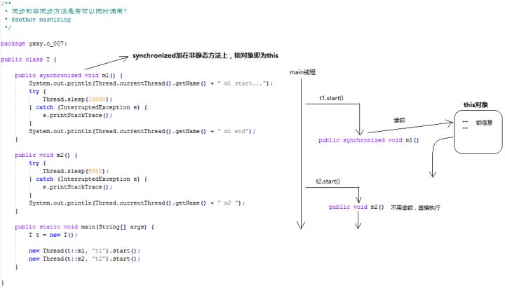
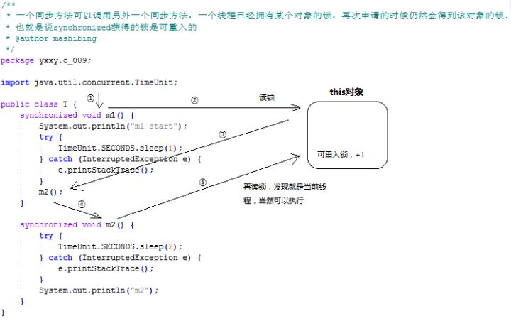
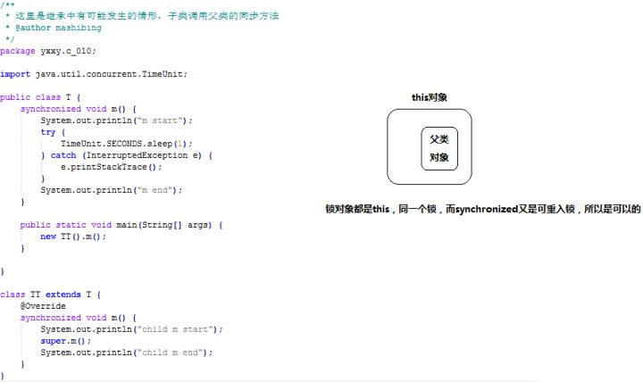
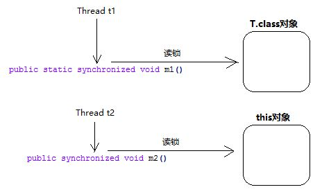

# synchronized 知识

## 三种使用方式的总结

1. 修饰实例方法，作用于当前对象实例加锁，进入同步代码前要获取当前对象实例的锁。

2. 修饰静态方法，作用于当前类对象加锁，进入同步代码前要获得当前类对象的锁。

   也就是给当前类加锁，会作用于类的所有对象实例，因为静态成员不属于任何一个实例对象，是类成员（static 表明这是该类的一个静态资源，不管 new 了多少个对象，只有一份，所以对该类的所有对象都加了锁）。

   所以如果一个线程 A 调用一个实例对象的非静态 synchronized 方法，而线程 B 需要调用这个实例对象所属类的静态 synchronized 方法，是允许的，不会发生互斥现象，因为访问静态 synchronized 方法占用的锁是当前类的锁，而访问非静态 synchronized 方法占用的锁是当前实例对象锁。

3. 修饰代码块，指定加锁对象，对给定对象加锁，进入同步代码库前要获得给定对象的锁。

   和 synchronized 方法一样，synchronized (this) 代码块也是锁定当前对象的。synchronized 关键字加到 static 静态方法和 synchronized(class) 代码块上都是是给 Class 类上锁。

   尽量不要使用 synchronized(String a)，因为 JVM 中，字符串常量具有缓冲功能。 
   
4. synchronized 的锁是不可以为空的。

## synchronized 的使用案例

### 1. 同一个类中的 synchronized 方法与普通方法之间互斥吗？



输出结果是：

```java
Thread-0 m1 start ...
Thread-1 m2 start ...
Thread-1 m2 end
Thread-0 m1 end
```

　　互斥的基本条件是公用一把锁，synchronized 是加在非静态方法上的，锁对象是 this 对象，t1 线程执行 m1 方法时要去读 this 对象锁，但是 t2 线程并不需要读锁，两者各管各的，没有交集（不共用一把锁）。

### 2. 同一个类中 synchronized 方法可以调用其他的 synchronized 方法吗？



　　synchronized 是可重入锁，可以理解为同一个线程在已经持有该锁的情况下，可以再次获取锁，并且会在某个状态量上做 +1 操作。

### 3. 子类同步方法 synchronized 方法可以调用父类的 synchronized 方法吗？



　　子类对象初始化前，会调用父类构造方法，在结构上相当于包裹了一个父类对象，用的都是 this 锁对象。

### 4. 静态同步方法和非静态同步方法互斥吗？

```java
public class T {
    public synchronized void m1() {
        System.out.println(Thread.currentThread().getName() + " m1 start ...");
        try {
            TimeUnit.SECONDS.sleep(2);
        } catch (InterruptedException e) {
            e.printStackTrace();
        }
        System.out.println(Thread.currentThread().getName() + " m1 end");
    }

    public static synchronized void m2() {
        System.out.println(Thread.currentThread().getName() + " m2 start ...");
        try {
            TimeUnit.SECONDS.sleep(1);
        } catch (InterruptedException e) {
            e.printStackTrace();
        }
        System.out.println(Thread.currentThread().getName() + " m2 end");
    }

    public static void main(String[] args) {
        final T main = new T();
        new Thread(new Runnable() {
            public void run() {
                main.m1();
            }
        }).start();
        new Thread(new Runnable() {
            public void run() {
                main.m2();
            }
        }).start();
    }
}
```



　　同步静态方法的锁是所在类的 Class 对象，而同步普通方法的锁是 this 对象，两个的锁不同，所以不会互斥。

## synchronized 关键字底层原理

　　synchronized 关键字底层原理属于 JVM 层面。

### synchronized 同步语句块的情况

```java
public class SyncrhonziedDemo {
	public void method(){
		synchronized (this) {
			System.out.println("synchronized 代码块");
		}
	}
}
```

　　synchronized 同步语句块的实现使用的是 monitorenter 和 monitorexit 指令，其中 monitorenter 指令指向同步代码块的开始位置，monitorexit 指令则指明同步代码块的结束位置。

　　当执行 monitorenter 指令时，线程试图获取锁也是获取 monitor（monitor 对象存在于每个 Java 对象的对象头中，synchronized 锁便是通过这种方式获取锁的，也是为什么 Java 中任意对象可以作为锁的原因）的持有权。

　　当计数器为 0 则可以成功获取，获取后将锁计数器设为 1 也就是加 1。

　　相应的在执行 monitorexit 指令后，将锁计数器设为 0 ，表明锁被释放。

　　如果获取对象锁失败，那当前线程就要阻塞等待，直到锁被另外一个线程释放为止。

### synchronized 修饰方法的情况

```java
public class SynchronizedDemo2 {
	public synchronized void method() {
		System.out.println("synchronized 方法");
	}
}
```

　　synchronized 修饰的方法并没有 monitorenter 指令和 monitorexit 指令，取而代之的是 ACC_SYNCHRONIZED 标识，该标识指明了该方法是一个同步方法，JVM 通过该 ACC_SYNCHRONIZED 访问标志来辨别一个方法是否声明为同步方法，从而执行相应的同步调用。

## JDK 1.6 之后的底层优化

　　在 Java 早期版本中，synchronized 属于重量级锁，效率低下，因为监视器锁（monitor）是依赖于底层的操作系统的 Mutex Lock 来实现的，Java 的线程是映射到操作系统的原生线程之上的。如果要挂起或者唤醒一个线程，都需要操作系统帮王成，而操作系统实现线程之间的切换时需要从用户态转换到内核态，这个状态之间的转换需要相对比较长的时间，时间成本相对较高，这也是为什么早期的 synchronized 效率低的原因。

　　在 Java 6 之后 Java 官方对从 JVM 层面对 synchronized  较大优化，所以现在的 synchronized 锁效率也优化的很不错了。JDK 1.6 对锁的实现引入了大量的优化，如自旋锁、适应性自旋锁、锁消除、锁粗化、偏向锁、轻量级锁等技术来减少锁操作的开销。

　　锁主要存在四种状态，依次是：无锁状态、偏向锁状态、轻量级锁状态、重量级锁状态，它们会随着竞争的激烈而逐渐升级。注意锁可以升级补课降级，这种策略是为了提高获得锁和释放锁的效率。

　　Java 锁使用的锁其实是在对象头中的锁标识，下面是锁在对象头中的结构：


### 1. 偏向锁

　　引入偏向锁的目的和引入轻量级锁的目的很像，它们都是为了没有多线程竞争的前提下，减少传统的重量级锁使用操作系统互斥量产生的性能消耗。但是不同的是：轻量级锁在无竞争的情况下使用 CAS 操作去代替使用互斥量，而偏向锁在无竞争的情况下会把整个同步都消除掉。

　　偏向锁的会偏向于第一个获得它的线程，如果在接下来的执行中，该锁没有被其他线程获取，那么持有偏向锁的线程就不需要进行同步！

　　但是对于锁竞争比较激烈的场合，偏向锁就失效了，因为这样场合极有可能每次申请锁的线程都是不相同的，因此这种场合下不应该使用偏向锁，否则会得不偿失，需要注意的是，偏向锁失败后，并不会立即膨胀位重量级锁，而是先升级为轻量级锁。

### 2. 轻量级锁

　　倘若偏向锁失败，虚拟机并不会立即升级为重量级锁，它还会尝试使用一种称为轻量级锁的优化手段（1.6 之后加入的）。

　　轻量级锁不是为了代替重量级锁，它的本意是在没有多线程竞争的前提下，减少传统的重量级锁使用操作系统互斥量产生的性能消耗，因为使用轻量级锁时，不需要申请互斥量。另外，轻量级锁的加锁和解锁都用到了 CAS 操作。

　　轻量级锁能够提升程序同步性能的依据是  “ 对于绝大部分锁，在整个同步周期内都是不存在竞争的 “，这是一个经验数据。如果没有竞争，轻量级锁使用 CAS 操作避免了使用互斥操作的开销。但如果存在锁竞争，除了互斥量开销外，还会额外发生 CAS 操作，因此在有锁竞争的情况下，轻量级锁比传统的重量锁更慢！如果锁竞争激烈，那么轻量级将很快膨胀为重量级锁！

### 3. 自旋锁和自适应自旋

　　轻量级锁失败后，虚拟机为了避免线程真实地在操作系统层面挂起，还会进行一项称为自旋锁的优化手段。

　　互斥同步对性能最大的影响就是阻塞的实现，因为挂起线程 / 恢复线程的操作都需要转入内核态中完成（用户态转换到内核态会耗费时间）。

　　一般线程持有锁的时间都不是太长，所以仅仅为了这一点时间去挂起线程 / 恢复线程是得不偿失的。所以，虚拟机的的开发团队就这样去考虑：”我们能不能让后面来的请求获取锁的线程等待一会而不被挂起呢？看看持有锁的线程是否很快就会释放锁“。为了让一个线程等待，只需要让线程执行一个忙循环（自旋），这项技术就叫做自旋。

　　何谓自旋锁？它是为实现保护共享资源而提出一种锁机制。其实，自旋锁与互斥锁比较类似，它们都是为了解决对某项资源的互斥使用。无论是互斥锁，还是自旋锁，在任何时刻，最多只能有一个持有者，也就说，在任何时刻最多只能有一个持有单元获得锁。但是两者在调度机制上略有不同。对于互斥锁，如果资源已经被占用，资源申请者只能进入睡眠状态。但是自旋锁不会引起调用者睡眠，如果自旋锁已经被别的执行单元保持，调用者就一直循环在那里看是否该自旋锁的保持者已经释放了锁。

　　自旋锁在 JDK 1.6 之前其实就已经引入了，不过是默认关闭的，需要通过 --XX:+UseSpinning 参数来开启。JDK 1.6 及 1.6 之后，就改为默认开启的了。需要注意的是：自旋等待不能完全替代阻塞，因为它还是要占用处理器时间。如果锁被占用的时间短，那么效果当然就很好了，反之，相反。自旋锁等待的时间必须要有限度。如果自旋超过了限定次数仍然没有获得锁，就应该挂起线程。自旋次数的默认值是 10 次，用户可以修改 -XX:PreBlockSpin 来更改。

　　另外，在 JDK 1.6 中引入了自适应的自旋锁。自适应的自旋锁带来的改进就是：自旋的时间不在固定了，而是和前一次同一个锁上的自旋时间以及锁的拥有者的状态来决定，虚拟机变得越来越 ” 聪明 “ 了。

### 4. 锁消除

　　锁消除指的就是虚拟机即使编译器在运行时，如果检测到那些共享数据不可能存在竞争，那么就执行锁消除。

　　锁消除可以节省毫无意义得请求锁得时间。

### 5. 锁粗化

　　原则上，在编写代码得时候，总是推荐将同步块得作用范围限制得尽量下，直到共享数据的实际作用域才进行同步，这样是为了使得需要同步得操作数量尽可能变小，如果存在锁竞争，拿等待线程也能尽快拿到锁。

　　大部分情况下，上面的原则都是没有问题的，但是如果一系列的连续操作都对同一个对象反复加锁和解锁，那么会代码很多不必要的性能消耗。

## synchronized 和 ReenTrantLock 的对比

### 1. 两者都是可重入锁

　　两者都是可重入锁。” 可重入锁 “ 概念是：自己可以再次获取自己的内部锁。比如一个线程获得了某个对象的锁，此时这个对象锁还没有释放，当其再次想要获取这个对象的锁的时候还是可以获取的，如果不可锁重入的话，就会造成死锁。同一个线程每次获取锁，锁的计数器都自增 1 ，所以要等到锁的计数器下降为 0 时才能释放锁。

### 2. synchronized 依赖于 JVM 而 ReentrantLock依赖于 API

　　synchronized 时依赖于 JVM 实现的，虚拟机团队在 JDK 1.6 为 synchronized 关键字进行了很多优化，但是这些优化都是在虚拟机里面实现的，并没有直接暴露出来。

　　ReentrantLock时 JDK 层面实现的（也就是 API 层面，需要 lock() 和 unlock() 方法配合 try/finally 语句块来完成），所以可以通过查看源代码查看它的具体实现。

### 3. ReentrantLock比 synchronized 增加了一些高级功能

　　相比 synchronized ，ReentrantLock增加了一些高级功能。主要来说有三点：1. 等待可中断；2.可实现公平锁；3.可实现选择性通知（锁可以绑定多个条件）。

* ReentrantLock 提供了一种能够中断等待锁的线程的机制。

  通过 lock.lockInterruptibly() 来实现这个机制。也就是说正在等待的线程可以选择放弃等待，改为处理其他事情。

* ReentrantLock 可以指定是公平锁还是非公平锁。而 synchronized 只能是非公平锁。所谓的公平锁就是先等待的线程先获得锁。

  ReentrantLock 默认情况下是非公平的，可以通过 ReentrantLock 类的 ReentrantLock (boolean fair) 构造方法来制定是否是公平的。

* synchronized 关键字与 wait() 和 notify/notifyAll() 方法结合可以实现等待 / 通知机制，ReentrantLock 类当然也可以实现，但是需要借助于 Condition 接口与 newCondition() 方法。

  Condition 是 JDK 1.5 后才有的，它具有很好的灵活性，比如可以实现多路通知功能也就是在一个 Lock 对象中可以创建多个 Condition 实例（即对象监视器），线程对象可以注册在指定的 Condition 中，从而可以有选择性的进行线程通知，在调度线程上更加灵活。

  在使用 notify/notifyAll() 方法进行通知时，被通知的线程是由 JVM 选择的，用 ReentrantLock 类结合 Condition 实例可以实现 ” 选择性通知 “，这个功能非常重要，而且是 Condition 接口默认提供的。

  而 synchronized 关键字就相当于整个 Lock 对象中只有一个 Condition 实例，所有的线程这样会造成很大的效率问题，而 Condition 实例的 singalAll() 方法只会唤醒注册在该 Condition 实例上的所有等待线程。

　　如果想使用上述功能，那么选择 ReentrantLock 是一个不错的选择。

### 4. 性能已不是选择标准

　　在 JDK 1.6 之前，synchronized 的性能是比 ReentrantLock 差很多。具体表示为 synchronized 关键字吞吐量随线程数的增加，下降得非常严重。而 ReentrantLock 基本保持一个比较稳定得水平。但是在 JDK 1.6 之后 JVM 团队对 synchronized 关键字做了很多优化，所以 JDK 1.6 之后，synchronized 和 ReentrantLock 的性能基本是持平了。

　　JDK 1.6 之后，性能已经不是选择 synchronized 和 ReentrantLock 的影响因素了。而且虚拟机在未来的性能改进中会更偏向于原生的 synchronized，所以还是提倡在 synchronized 能满足需求的情况下，优先考虑使用 synchronized 关键来进行同步，优化后的 synchronized 和 ReentrantLock 一样，在很多地方都是用到了 CAS 操作。


## 参考文章
[Synchronized 锁定的到底是什么](https://www.zhihu.com/question/57794716?sort=created)

[synchronized详解](https://www.jianshu.com/p/16cec9b50ad2)

[老生常谈为什么需要synchronized，以及synchronized 的注意事项](https://blog.csdn.net/wangyadong317/article/details/84065828)