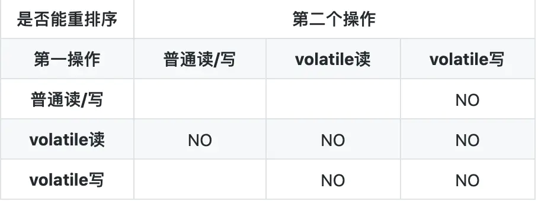
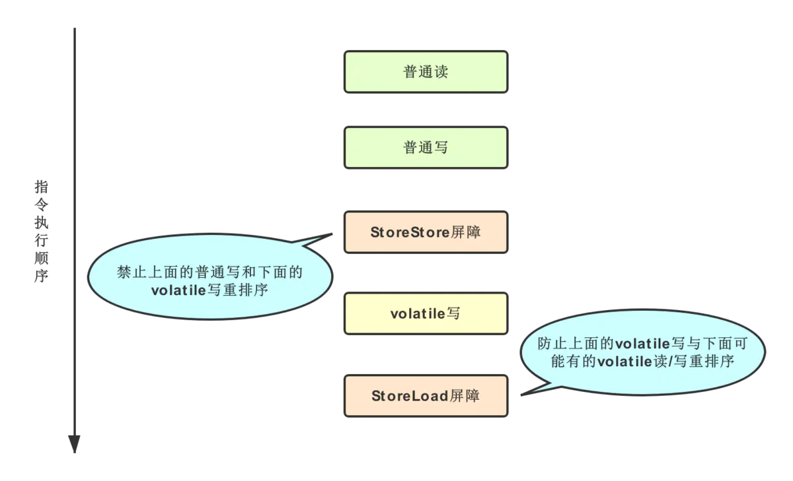
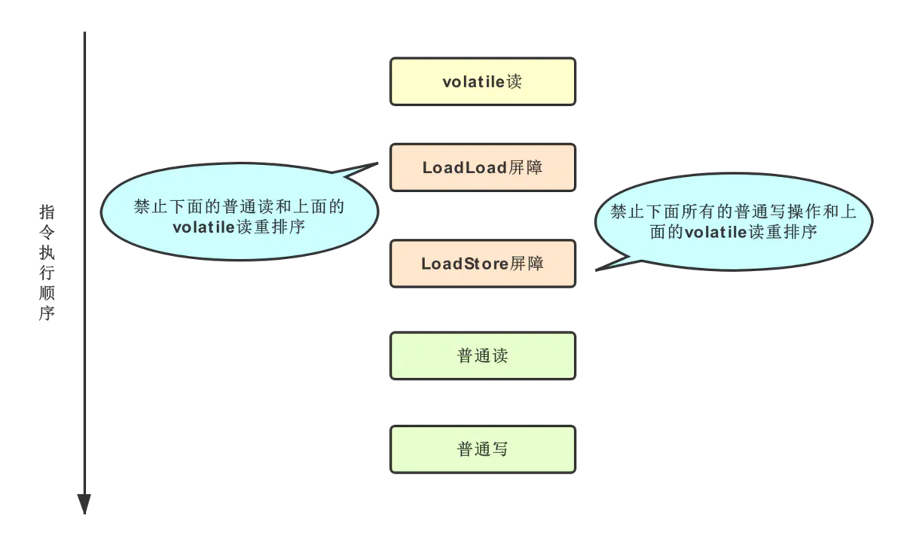

# volatile 知识

## 1. volatile 定义

　　Java 语言规范第三版中对 volatile 的定义如下：java 编程语言允许线程访问共享变量，为了确保共享变量能被准确和一致的更新，线程应该确保通过排他锁单独获得这个变量。Java 语言提供了 volatile，在某些情况下比锁更加方便。如果一个字段被声明成 volatile，java 线程内存模型确保所有线程看到这个变量的值是一致的。

　　volatile 是一个类型修饰符，volatile 的作用是作为指令关键字，确保本条指令不会因编译器的优化而忽略。

　　一旦一个共享变量（类的成员变量、类的静态成员变量）被 volatile 修饰之后，那么就具备了两层语义：

1. 保证了不同线程对这个变量进行操作时的可见性，即一个线程修改了某个变量的值，那新值对其他线程来说是立即可见的。
2. 禁止进行指令重排序。

## 2. volatile 的内存语义

　　happends-before （先行发生原则）对 volatile 的定义：volatile 变量的写，先发生于后续对这个变量的读。

　　所以 volatile 的内存含义：

1. 当写一个 volatile 变量时，JMM（Java 内存模型） 会把该线程对应的本地内存中的共享变量值刷新到主内存。
2. 当读一个 volatile 变量时，JMM（Java 内存模型）会把该线程对应的本地内存置为无效，接下来将从主内存中读取共享变量，并更新本地内存的值。

## 3. volatile 的特性

* **可见性**：对一个 volatile 的变量的读，总是能看到任意线程对这个变量最后的写入。在写一个 volatile 变量时，JMM 会把该线程本地内存中的变量强制刷新到住内存中去，即一个线程修改了某个变量的值，这新值对其他线程来说是立即可见的。

* **单个读或者写具有原子性**：对于单个 volatile 变量的读或者写具有原子性，复合操作不具有（如 i++）。

* **互斥性**：同一时刻只允许一个线程对变量进行操作（互斥锁的特点）， volatile 写操作会导致其他线程中的缓存无效。

* **有序性**：禁止指令重排序。

  重排序是指编译器和处理器为了优化程序性能而对指令序列进行排序的一种手段。

  重排序需要遵守一定规则：

  * 重排序操作不会对存在数据依赖关系的操作进行重排序。
  * 重排序是为了优化性能，但是不管怎么重排序，单线程下程序的执行结果不能被改变。

## 4. volatile 的原理和实现机制

　　为了提高处理速度，处理器不直接和内存进行通信，而是先将系统内存的数据读到内部缓存后再进行操作，但操作完不知道何时会写到系统内存。

　　如果对声明了 volatile 的变量进行写操作，JVM 就会向处理器发送一条 lock 前缀的指令，将这个变量所在缓存行的数据写回到系统内存。

　　为了保证各个处理器的缓存是一致的，实现了缓存一致性协议（MESI），每个处理器通过嗅探在总线上传播的数据来检查自己缓存的值是不是过期了，当处理器发现自己缓存行对应的内存地址被修改，就会将当前处理器的缓存行设置为无效状态，当处理器对这个数据进行修改操作的时候，如果发现本地缓存失效，会重新从系统内存中把数据读到处理器缓存里，既可以获取当前最新值。

　　volatile 变量通过这样的机制就使得每个线程都能获得该变量的最新值。

### 4.1. lock 指令

　　《深入理解 Java 虚拟机》的一段话：“ 观察加入 volatile 关键字和没有加入 volatile 关键字时所生成的汇编代码发现，加入 volatile 关键字时，会多出一个 lock 前缀指令 ”。

　　lock 前缀指令实际上相当于一个内存屏障。内存屏障，又称内存栅栏，是一个 CPU 指令。

　　lock 前缀的指令在多核处理器下会引发两件事情：

1. 将当前处理器缓存行的数据写回到系统内存。
2. 写回内存的操作会使在其他 CPU 里缓存了该内存地址的数据无效。

　　在 Pentium 和早期的 IA-32 处理器中，lock 前缀会使处理器执行当前指令时产生一个 LOCK# 信号，会对总线进行锁定，其他 CPU 对内存的读写请求都会被阻塞，直到锁释放。因为锁总线的开销比较大，锁总线期间其他 CPU 没法访问内存。后来的处理器，加锁操作是由高速缓存锁代替总线锁来处理。

　　这种场景多缓存的数据一致通过缓存一致性协议（MESI）来保证。

### 4.2. 缓存一致性

　　缓存是分段（line）的，一个段对应一块存储空间，称之为缓存行，它是 CPU 缓存中可分配的最小存储单元，大小 32 字节、64 字节、128 字节不等，这与 CPU 架构有关，通常来说是 64 字节。

　　LOCK# 因为锁总线效率太低，因此使用了多组缓存。

　　为了使其行为看起来如同一组缓存那样，因而设计了缓存一致性协议。

　　缓存一致性协议有很多，但是日常处理的大多数计算机设备都属于 “ 嗅探 ” 协议。

　　所有内存的传输都发生在一条共享的总线上，而所有的处理器都能看到这条总线。

　　缓存本身是独立的，但是内存是共享资源，所有的内存访问都要经过仲裁（同一个指令周期中，只有一个 CPU 缓存可以读写内存）。

　　CPU 缓存不仅仅在做内存传输的时候才与总线打交道，而是不停的嗅探总线上发生的数据交换，跟踪其他缓存在做什么。

　　当一个缓存代表它所属的处理器去读写内存时，其他处理器都会得到通知，它们以此来使自己的缓存保持同步。

　　只要某个处理器写内存，其他处理器马上知道这块内存在它们的缓存段中已经失效。

### 4.3. volatile 禁止重排序

#### 4.3.1. volatile 禁止重排序的语义实现

　　在程序运行时，为了提高执行性能，JMM 在不改变正确语义的前提下，会允许编译器和处理器对指令进行重排序，JMM 为了保证在不同的编译器和 CPU 上有相同的结果，会在生成指令序列时在适当的位置插入特定类型的内存屏障指令来禁止特定类型的编译器重排序和处理器重排序，告诉编译器和 CPU：不管什么指令都不能和这条 Memory Barrier 指令重排序。

　　内存屏障会提供 3 个功能：

1. 它确保指令重排序时不会把其后面的指令排到内存屏障之前的位置，也不会把前面的指令排到内存屏障的后面；即在执行到内存屏障这句指令时，在它前面的操作已经全部完成。
2. 它会强制将对缓存的修改操作立即写入主存。
3. 如果是写操作，它会导致其他 CPU 中对应的缓存行无效。

　　而为了实现 volatile 的内存语义，编译器在生成字节码时，就会在指令序列中插入内存屏障来禁止特定类型的处理器重排序。

#### 4.3.2. volatile 禁止重排序的意思

　　volatile 关键字禁止指令重排序有两层意思：

1. 当程序执行到 volatile 变量的读操作或者写操作时，在其前面的操作更改肯定全部已经进行，且结果已经对后面的操作可见，在其后面的操作肯定还没有进行。
2. 在进行指令优化时，不能将在对 volatile 变量访问的语句放在其后面执行，也不能把 volatile 变量后面的语句放到其前面执行。

#### 4.3.3. volatile 重排序规则



　　从表中归纳：

* 当第一个操作是 volatile 读时，不管第二个操作是什么，都不能重排序。确保 volatile 读之后的操作不会被重排序到 volatile 读之前。
* 当第二个操作是 volatile 写时，不管第一个操作是什么，都不能重排序。确保 volatile 写之前的操作不会背重排序到 volatile 写之后。
* 当第一个操作是 volatile 写，第二个操作是 volatile 读时，不能重排序。

　　对于编译器来说，发现一个最优布置来最小化插入屏障的总数几乎是不可能的，为此，JMM 采取了保守的策略。volatile 指令序列中插入内存屏障：

* 在每个 volatile 写操作的前面插入一个 StoreStore 屏障。
* 在每个 volatile 写操作的后面插入一个 StoreLoad 屏障。
* 在每个 volatile 读操作的后面插入一个 LoadLoad 屏障。
* 在每个 volatile 读操作的后面插入一个 LoadStore 屏障。

　　volatile 写是在前面和后面分别插入内存屏障，而 volatile 读操作是在后面插入两个内存屏障。

* StoreStore 屏障：禁止上面的普通写和下面的 volatile 写重排序。
* StoreLoad 屏障：防止上面的 volatile 写于下面可能有的 volatile 读/写重排序。
* LoadLoad 屏障：禁止下面所有的普通读操作和上面的 volatile 读重排序。
* LoadStore 屏障：禁止下面所有的普通写操作和上面的 voaltile 读重排序。

#### 4.3.4. volatile 写内存屏障



　　StoreStore 屏障：可以保证在 volatile 写之前，其前面的所有普通写操作已经对任意处理器可见了。

　　StoreLoad 屏障：将 volatile 写操作刷新到内存。

　　由此达到，volatile 写立马刷新到主内存的效果。

#### 4.3.5. volatile 读内存屏障



　　LoadLoad 屏障：保障后续是读操作时，volatile 读装载到内存数据。

　　LoadStore 屏障：保障后续是写操作时，volatile 读装载到内存数据。

　　由此达到，volatile 读从主内存中读取共享变量，并更新本地内存的值。

## 5. volatile 与 synchronized

　　synchronized 关键字是防止多个线程同时执行一段代码，但是这样会影响程序执行效率，而 volatile 关键字在某些情况下性能要优于 synchronzied，但是要注意 volatile 关键字是无法替代 synchronized 关键字的，因为 volatile 关键字无法保证操作的原子性。

　　相比于 synchronized （synchronized 通常称为重量级锁），volatile 更轻量级（也被称为轻量级的 synchronzied），因为它不会引起线程的阻塞从而导致上下文的切换和调度，但是 volatile 比 synchronized 的同步性较差。

## 6. volatile 的使用条件

　　通常来说，使用 volatile 必须具备以下 2 个条件：

1. 对变量的写操作不依赖于当前值或能够保证只有单线程改变变量的值。

   如 i++ 操作（包括读取变量的初始值、进行加 1 操作、写入工作内存三个操作），变量的写操作依赖当前值，所以不能保证线程安全。可以通过使用 synchronized、Lock、AtomicInteger 来解决 i++ 同步的问题。

   可见性只能保证每次读取的是最新的值，但是 volatile 没办法保证对变量的操作的原子性。

2. 该变量没有包含在具体其他变量的不变式中

   如 i < value ，即使 i 变量声明为 volatile，但是 value 可能在运行判断的时候发生变化，所以也不能保证线程安全。

　　实际上，这些条件表明，可以被写入 volatile 变量的这些有效值独立于任何程序的状态，包括变量的当前状态，也就是保证操作是原子性操作，才能保证使用 volatile 关键字的程序在并发时能够正确执行。

## 7. 正确使用 volaitle

　　下面是几种使用 volatile 的场景。

### 7.1. 状态标志

　　作为一个布尔状态标志，用于指示发生了一个重要的一次性时间，例如完成初始化或任务结束。

　　状态标志并不依赖于程序内任何其他状态，且通常只有一种状态转换。

```java
volatile Boolean shutdowmRequested;
...
public void shutdowm(){ 
	shutdownRequested = true; 
}

public void doWork() {
	while(!shundownResquested){
		...
	}
}
```

### 7.2. 一次性安全发布（one-time safe publication）

　　缺乏同步会导致无法实现可见性，这使得确定何时写入对象而不是原始值变得更加困难。在缺乏同步的情况下，可能会遇到某个对象引入的更新值（由另一个线程写入）和该对象状态的旧值同时存在（这就是造成著名的双重检查锁定（double-checked-locking）问题的根源，其中对象引用在没有同步的情况下进行读操作，产生的问题是可能会看到一个更新的引用，但还是仍然会通过该引用看到不完全构造的对象）。

```java
public class BackgroundFloobleLoader {
    public volatile Flooble theFlooble;
 
    public void initInBackground() {
        // do lots of stuff
        theFlooble = new Flooble();  // this is the only write to theFlooble
    }
}
 
public class SomeOtherClass {
    public void doWork() {
        while (true) { 
            // do some stuff...
            // use the Flooble, but only if it is ready
            if (floobleLoader.theFlooble != null) 
                doSomething(floobleLoader.theFlooble);
        }
    }
}
```

### 7.3. 独立观察（independent observation）

　　安全使用 volatile 的另一种简单模式是定期发布观察结果供程序内部使用。

　　将 volatile 变量用于多个独立观察结果的布局，是 “ 状态标志 ” 的扩展，该值随时会发生变化，同时会被反复使用，前者一般就是用一次，只是简单的赋值操作，不会做复合操作。

```java
class CustomLinkedList{
	public volatile Node lastNode;
	...
	public void add(){
		......
		lastNode = node; //将新节点作为最后一个节点。
	}
}
```

### 7.4. volatile bean 模式

　　在 volatile bean 模式中，JavaBean 的所有数据成员都是 volatile 类型的，并且 getter 和 setter 方法必须非常普通 -- 除了获取或设置相应的属性外，不能包含任何逻辑。此外，对于对象引用的数据成员，引用的对象必须是有效不可变的。

　　这将禁止具有数组值的属性，因为当数据引用被声明为 volatile 时，只有引用而不是数据本身具有 volatile 语义。

　　对于任何 volatile 变量，不变式或约束都不能包含 JavaBean 属性。

```java
public class Person {
    private volatile String firstName;
    private volatile String lastName;
    private volatile int age;
 
    public String getFirstName() { return firstName; }
    public String getLastName() { return lastName; }
    public int getAge() { return age; }
 
    public void setFirstName(String firstName) { 
        this.firstName = firstName;
    }
 
    public void setLastName(String lastName) { 
        this.lastName = lastName;
    }
 
    public void setAge(int age) { 
        this.age = age;
    }
}
```

### 7.5. 开销较低的 读 - 写 锁策略

　　volatile 的功能还不足以实现计数器，因为 ++x 实际上是三种操作（读、添加、存储）的简单组合，如果多个线程凑巧试图同时对 volatile 计数器执行增量操作，那么它的更新值有可能会丢失。

　　当读远多于写，结合使用内部锁和 volatile 变量来减少同步的开销。

　　利用 volatile 保证读取操作的可见性；利用 synchronized 保证复合操作的原子性。

　　如果更新不频繁的话，该方法可实现更好的性能，因为读路径的开销仅仅涉及 volatile 读操作，这通常要优于一个无竞争的锁获取的开销。

```java
public class Counter {
	private volatile int value;
	//利用 volatile 保证读取操作的可见性，读取时无需加锁
	public int getValue() {
		return value;
	}
	//使用 synchronized 加锁
	public synchronized int increment(){
		return value++;
	}
}
```

### 7.6. 双重检查（double - checked）

　　线程安全的单例模式实现方式就是双重检查。

```java
//基于 volatile 的解决方案
public class SafeDoubleCheckSingleton {
	//通过 volatile 声明，实现线程安全的延迟初始化
	private volatile static SafeDoubleCheckSingleton singleton;
	private SafeDoubleCheckSingleton(){}
	public static SafeDoubleCheckSingleton getInstance(){
		if (singleton == null){
			synchronized(SafeDoubleCheckSingleton.class){
				if (singleton == null){
					//原理利用 volatile 在于 禁止 “初始化对象” 和 “设置 singleton 指向内存空间” 的重排序
					singleton = new SafeDoubleCheckSingleton();
				}
			}
		}
        return singleton;
	}
	
}
```

　　由于对象的创建，可以拆封成以下指令：


　　在多线程环境中，如果没有对对象声明为 volatile，将可能出现以下情况，其他线程可能得到的是 null，而不是完成初始化的对象。


　　也推荐单例模式的懒加载优雅写法 Initialization on Demand Holder(IODH)：

```java
public class Singleton {  
    static class SingletonHolder {  
        static Singleton instance = new Singleton();  
    }  
      
    public static Singleton getInstance(){  
        return SingletonHolder.instance;  
    }  
}
```

## 8 参考文章

[java并发（4）深入理解 volatile](https://www.jianshu.com/p/9e467de97216)

[java并发编程：volatile 关键字解析](https://www.cnblogs.com/dolphin0520/p/3920373.html)

[【Java 并发笔记】volatile相关整理](https://www.jianshu.com/p/ccfe24b63d87)