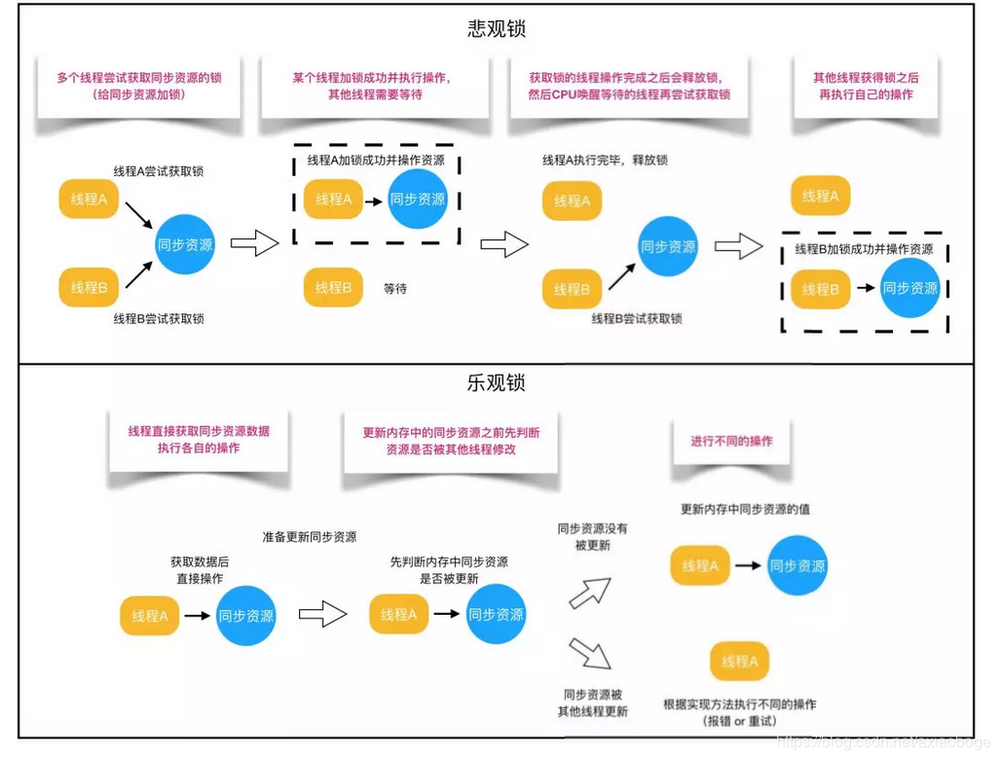
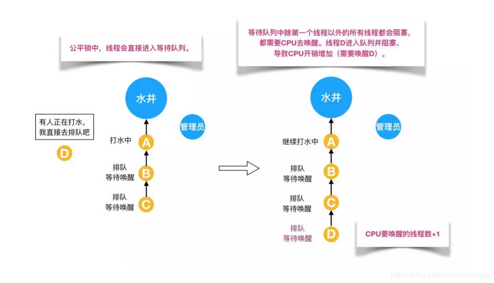
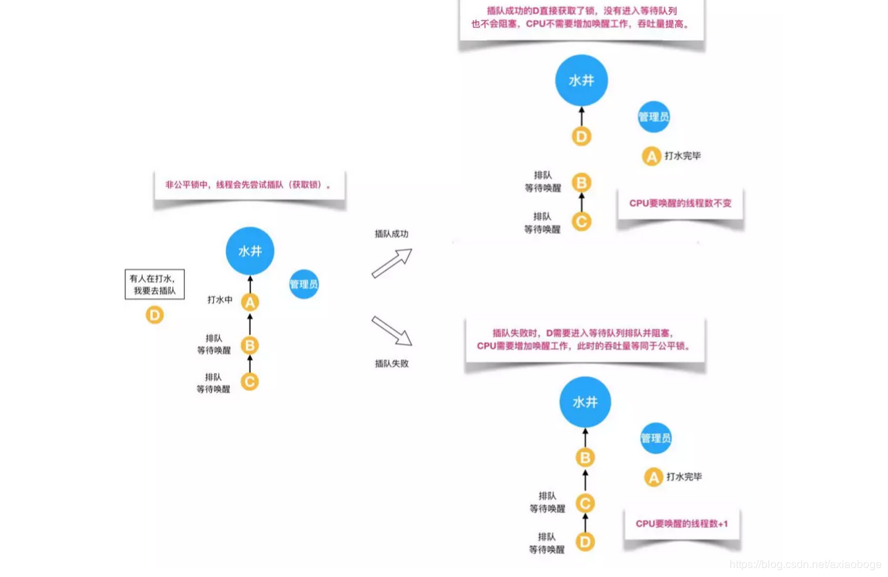
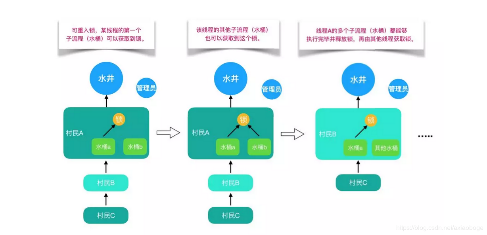

# 锁

　　Java 提供了种类丰富的锁，每种锁因其特性的不同 ，在适当的场景下能够展现出非常高的效率。

## 1. 预备知识

### 1.1. AQS

　　AbstractQueuedSynchronzied 抽象对象式的同步器，AQS 定义了一套多线程访问共享资源的同步器框架，许多同步类实现都依赖于它，如常用的 ReentrantLock/Semaphore/CountDownLatch 等。

　　AQS 维护了一个 volatile int state（代表共享资源）和一个 FIFO 线程等待队列（多线程争用资源被阻塞时会进入此队列）。

　　state 的访问方式有三种：

```java
getState()
setState()
compareAndSetState()
```

　　AQS 定义两种资源共享方式：Exclusive（独占，只有一个线程能执行，如 ReentrantLock）和 Share（共享，多个线程可同时执行，如 Semaphore/CountDownLatch）。

　　不同的自定义同步器争用共享资源的方式也不同。自定义同步器在实现时只需要实现共享资源 state 的获取与释放方式即可，至于具体线程等待队列的维护（如获取资源失败入队/唤醒出队等），AQS 已经在顶层实现好了。自定义同步器实现时主要实现以下几种方法：

```java
isHeldExclusively()：该线程是否正在独占资源。只有用到 condition 才需要去实现它。
tryAquire(int)：独占方式。尝试获取资源，成功则返回 true，失败则返回 false.
tryRelease(int)：独占方式。尝试释放资源，成功则返回 true，失败则返回 false。
tryAcquireShared(int)：共享方式。尝试获取资源。负数表示失败；0 表示成功，但没有剩余可用资源；正数表示成功，且有剩余资源。
tryReleaseShared(int)：共享方式。尝试释放资源，如果释放后允许唤醒后续等待节点返回 true，否则返回 false。
```

　　以 ReentrantLock 为例，state 初始化为 0，表示未锁定状态。A 线程 lock() 时，会调用 tryAcquire() 独占该锁并将 state+1。此后，其他线程再 tryAcquire() 时就会失败，直到 A 线程 unlock() 到 state = 0 （即释放锁）为止，其他线程才有机会获取该锁。当然，释放锁之前，A 线程自己是可以重复获取此锁的（state 会累加），这就是可重入的概念。但要注意，获取多少次就要释放多少次，这样才能保证 state 是能回到零态的。

　　再以 CountDownLatch 为例，任务分为 N 个子线程去执行，state 初始化为 N（注意 N 要与线程个数一致）。这 N 个子线程是并行执行的，每个子线程执行完后 countDown() 一次，state 会 CAS 减一。等到所有子线程都执行完后（即 state = 0），会 unpark() 主调用线程，然后主调用线程就会 await() 函数返回，继续后余动作。

　　一般来说，自定义同步器要么是独占方法，要么是共享方式，它们只需实现 tryAcquire-tryRelease、tryAcquireShared-tryReleaseShared 中的一种即可。但 AQS 也支持自定义同步器同时实现独占和共享两种方式，如 ReentrantReadWriteLock。

### 1.2. CAS

　　CAS 全称 Compare And Swap（比较与交换），是一种无锁算法，在不使用锁（没有线程被阻塞）的情况下实现多线程之间的变量同步。

　　CAS 是乐观锁技术，当多个线程尝试使用 CAS 同时更新同一个变量时，只有其中一个线程能更新变量的值，而其他线程都失败，失败的线程并不会被挂起，而是被告知这次竞争中失败，并可以再次尝试。java.util.concurrent 包中的原子类就是通过 CAS 来实现了乐观锁。

　　CAS 操作中包含三个操作数：

1. 需要读写的内存位置（V）
2. 进行比较的预期原值（A）
3. 拟写入的新值（B）

　　当且仅当内存位置 V 的值与预期原值 A 相匹配，那么处理器会自动将该位置值更新为新值 B（“比较 + 更新” 整体是一个原子操作），否则处理器不做任何操作。一般情况下，“ 更新 ” 是一个不断重试的操作。无论哪种情况，它都会在 CAS 指令之前返回该位置的值（在 CAS 的一些特殊情况下将仅返回 CAS 是否成功，而不提取当前值）。CAS 有效地说明了 “ 我认为位置 V 应该包含值 A；如果包含该值，则将 B 放到这个位置；否则，不要更改该位置，只告诉这个位置现在的值即可”。这其实和乐观锁的冲突检查 + 数据更新的原理是一样的。

#### 1.2.1. JAVA 对 CAS 的支持

　　在 JDK 1.5 中新增 java.util.concurrent 包就是建立在 CAS 之上的。相对于 synchronized 这种阻塞算法，CAS 是非阻塞算法的一种常见实现。所以 java.util.concurrent 包中的 AtomicInteger 为例，看一下在不使用锁的情况下是如何保证线程安全的。

　　看一下 AtomicInterfer 的定义：

```java
public class AtomicInteger extends Number implements java.io.Serializable {
    private static final long serialVersionUID = 6214790243416807050L;

    /*
     * This class intended to be implemented using VarHandles, but there
     * are unresolved cyclic startup dependencies.
     */
    private static final jdk.internal.misc.Unsafe U = jdk.internal.misc.Unsafe.getUnsafe();
    private static final long VALUE = U.objectFieldOffset(AtomicInteger.class, "value");

    private volatile int value;
}
```

　　根据定义可以看出个属性的作用：

* U：获取并操作内存的数据。
* VALUE：存储 value 在 AtomicInteger 中的偏移量。
* value：存储 AtomicInteger 的 int 值，该属性需要借助 volatile 关键字保证其在线程间是可见的。

　　接下来，查看 AtomicInteger 的自增函数 incrementAndGet() 的源码，该方法的作用相当于 ++i 操作。

```java
    public final int incrementAndGet() {
        return U.getAndAddInt(this, VALUE, 1) + 1;
    }


```

　　发现自增函数底层实现调用的是 U.getAndAddInt()，也就是 Unsafe 的 getAndAddInt() 方法，接着查看 Unsafe 的源码。

```java
    @HotSpotIntrinsicCandidate
    public final int getAndAddInt(Object o, long offset, int delta) {
        int v;
        do {
            v = getIntVolatile(o, offset);
        } while (!weakCompareAndSetInt(o, offset, v, v + delta));
        return v;
    }
```

　　根据 Unsafe 的 getAndAddInt() 方法的源码可以看出，getAndAddInt() 循环获取给定对象 o 中的偏移量 offset 处的值 v，然后判断内存值是否等于 v。如果相等则将内存值设置为 v+delta，否则循环仅重试，直到设置成功才能退出循环，并且将旧值返回。这个 “ 比较+更新 ” 操作封装在 weakCompareAndSetInt() 中，在 JNI 里是借助一个 CPU 指令完成的，属于原子操作，可以保证多个线程都能够看到同一个变量的修改值。

　　后续 JDK 通过 CPU 的 cmpxchg 指令，去比较寄存器中的 A 和内存中的值 V。如果相等，就把要写入的新值 B 写入内存中。如果不相等，就将内存值 V 复制给寄存器中的值 A。然后通过 Java 代码中的 while 循环再次调用 cmpxchg 指令进行重试，直到设置成功为止。

　　CAS 虽然很高效，但是它也存在三大问题，这里也简单说一下：

1. ABA 问题。CAS 需要在操作值的时候检查内存值是否发生变化，没有发生变化才会更新内存值。但是如果内存值原来是 A，后来变成了 B，然后又变成了 A，那么 CAS 进行检查时会发现值没有发生变化，但是实际上是有变化的。ABA 问题的解决思路就是在变量前面添加版本号，每次变量更新的时候都把版本号加一，这样变化过程就从 “ A-B-C ” 变成了 “1A - 2B - 3A”。

   JDK 从 1.5 开始提供了 AtomicStampedReference 类来解决 ABA 问题，具体操作封装在 compareAndSet() 中。compareAndSet() 首先检查当前引用和当前标志与预期引用和与其标志是否相等，如果都相等，则以原子方式将引用值和标志的值设置为给定的更新值。

2. 循环时间长开销大。CAS 操作如果长时间不成功，会导致其一直自旋，给 CPU 带来非常大的开销。

3. 只能保证一个共享变量的原子操作。对一个共享变量执行操作时，CAS 能够保证原子操作，但是对多个共享变量操作时，CAS 是无法保证操作的原子性的。

   Java 从 1.5 开始 JDK 提供了 AtomicReference 类来保证引用对象之间的原子性，可以把多个变量放在一个对象里来进行 CAS 操作。

## 2. 乐观锁 VS 悲观锁

　　乐观锁与悲观锁是一种广义上的概念，并不是特指某两种类型的锁，是人们定义出来的概念或思想，主要是体现了看待线程并发同步的不同角度。在 Java 和数据库中都有此概念对应的实际应用。



　　根据从上面的概念描述可以发现：

* 悲观锁适合写操作多的场景，先加锁可以保证写操作时数据正确。
* 乐观锁适合读操作多的场景，不加锁的特点能够使其读操作的性能大幅提升，提高吞吐量。

### 1.1. 乐观锁

　　乐观锁：顾名思义，就是很乐观，乐观锁总是认为不存在并发问题，每次去拿数据的时候都认为别人不会修改，所以不会上锁，但是在更新的时候会判断一下之前有没有去更新这个数据。如果这个数据没有被更新，当前线程将自己修改的数据成功写入。如果数据已经被其他线程更新，则根据不同的实现方式执行不同的操作（例如报错或者自动重试）。

　　乐观锁在 Java 中的使用，是无锁编程，常常采用的是 CAS 算法，在 Java 中 java.util.concurrent.atomic 包下面的原子变量类就是使用了乐观锁的一种实现方式 CAS(Compare and Swap 比较并交换)实现的，通过 CAS 自旋实现原子操作的更新。

　　在更新时会判断线程在这之前有没有对数据进行修改，一般会使用 “ 数据版本机制 ” 或 “ CAS操作 ” 来实现。

#### 1.1.1. 数据版本机制

　　实现数据版本一般有两种，第一种是使用版本号，第二种是使用时间戳。以版本号方式为例。

　　版本号方式：一般是在数据表中加上一个数据版本号 version 字段，表示数据被修改的次数，当数据被修改时，version 值会加一。当线程 A 要更新数据值时，在读取数据的同时也会读取 version 值，在提交更新时，若刚才读取到的 version 值为当前数据库中的 version 值相等时才更新，否则重试更新操作，直至更新成功。

#### 1.1.2. CAS 操作

　　CAS（Compare and Swap 比较并交换），当多个线程尝试使用 CAS 同时更新同一个变量时，只有其中一个线程能更新变量的值，而其他线程都失败，失败的线程并不会被挂起，而是被告之这次竞争中失败，并可以再次尝试。

　　CAS 操作中包含三个操作数 -- 需要读写的内存位置（V）、进行比较的于其原值（A）和拟写入的新值（B）。如果内存位置 V 的值与预期原值 A 相匹配，那么处理器会自动将该位置值更新为新值 B，否则处理器不做任何操作。

### 1.2. 悲观锁

　　悲观锁：对于同一个数据的并发操作，总是假设最坏的情况，每次去拿数据的时候都认为别人会修改，因此在获取数据的时候会先加锁，确保数据不会被别的线程修改，这样别人想拿这个数据就会阻塞直到它拿到锁。Java 中，synchronized 关键字和 Lock 的实现类都是悲观锁。

　　在对任意记录进行修改前，先尝试为该记录加上排他锁（exclusive locking）。

　　如果加锁失败，说明该记录正在被修改，那么当前查询可能要等待或者抛出异常。具体响应方式由开发者根据实际需要决定。

　　如果成功加锁，那么就可以对记录做修改，事务完成后就会解锁了。

　　期间如果有其他对该记录做修改或加排他锁的操作，都会等待解锁或直接抛出异常。

　　悲观锁在 Java 中的使用，就是利用各种锁。

### 1.3. 悲观锁与乐观锁的调用

```java
    // --------悲观锁的调用方式--------
    // synchronized
    public synchronized void testMethod() {
        // 操作同步资源
    }

    //ReentrantLock
    private ReentrantLock lock = new ReentrantLock();// 需要保证多个线程使用同一个锁

    public void modifyPublicResources() {
        lock.lock();
        // 操作同步资源。
        lock.unlock();
    }

    // --------乐观锁的调用方式--------
    private AtomicInteger atomicInteger = new AtomicInteger(); // 需要保证多个线程使用同一个 AtomicInteger

    public void increment() {
        atomicInteger.incrementAndGet(); // 执行自增1
    }
```

　　通过调用方式示例，可以发现悲观锁基本都是在显示的锁定之后再操作同步资源，而乐观锁则直接去操作同步资源。而乐观锁之所以可以做到不锁定同步资源也可以正确的实现线程同步，是因为 CAS 在当前内存值 V 等于比较的值 A 值，才会通过原子操作将 V 更新为新值 B，如果不相等，则自旋重试。　

## 3. 自旋锁 VS 适应性自旋锁

　　阻塞或唤醒一个 Java 线程需要操作系统切换 CPU 状态来完成，这种状态转换需要耗费处理器时间。如果同步代码块中的内存过于简单，状态转换消耗的时间有可能比用户代码执行的时间还要长。

　　在许多场景中，同步资源的锁定时间很短，为了这一小段时间去切换线程，线程挂起和恢复现场的花费可能会让系统得不偿失。如果物理机器有多个处理器，能够让两个或以上的线程同时并发执行，就可以让后面那个请求锁的线程不放弃 CPU 的执行时间，看看持有锁的线程是否很快就会释放锁。

　　而为了让当前线程 “ 稍等一下 ”，需让当前线程进行自旋，如果在自旋完成后前面锁定同步资源的线程已经释放了锁，那么当前线程就可以不必阻塞而是直接获取同步资源，从而避免切换线程的开销。这就是自旋锁。

　　在 Java 中，自旋锁是指尝试获取锁的线程不会立即阻塞，而是采用自旋的方式去尝试获取锁，这样的好处是减少线程上下文切换的消耗，缺点是循环会消耗 CPU。


　　自旋锁本身是优缺点的，它不能代替阻塞。自旋等待虽然避免了线程切换的开销，但它要占用处理器时间。如果锁被占用的时间很短，自旋等待的效果就会非常好。反之，如果锁被占用的时间很长，那么自旋的线程只会白浪费处理器资源。所以，自旋等待的时间必须要有一定的限度，如果自旋超过了限定次数（默认是 10 次，可以使用 -XX:PreBlockSpin 来更改）没有成功获得锁，就应当挂起线程。

　　自旋锁的实现原理同样也是 CAS，AtomicInteger 中调用 unsafe 进行自增操作的源码中的 do-while 循环就是一个自旋操作，如果修改数值失败则通过循环来执行自旋，直至修改成功。

```java
    @HotSpotIntrinsicCandidate
    public final int getAndAddInt(Object o, long offset, int delta) {
        int v;
        do {
            v = getIntVolatile(o, offset);
        } while (!weakCompareAndSetInt(o, offset, v, v + delta));
        return v;
    }
```

　　自旋锁在 JDK 1.4.2 中引入，使用 -XX:+UseSpinning 来开启。JDK 6 中变为默认开启，并且引入了自适应的自旋锁（适应性自旋锁）。

　　自适应意味着自旋的时间（次数）不再固定，而是由前一次在同一个锁上的自旋时间及锁的拥有者的状态来决定。如果在同一个锁对象上，自旋等待刚刚成功获得过锁，并且持有锁的线程正在运行中，那么虚拟机就会认为这次自旋也是很有可能再次成功，进而它将允许自旋等待持续相对更长的时间。如果对于某个锁，自旋很少成功获得过，那在以后尝试这个锁时将可能省略掉自旋过程，直接阻塞线程，避免浪费处理器资源。

　　在自旋锁中，另有三种常见的锁形式：TicketLock、CLHlock 和 MCSlock。 

## 4. 无锁 VS 偏向锁 VS 轻量级锁 VS 重量级锁

　　这四种锁是指锁的状态，专门针对 synchronized  的。

　　在 Java 5 通过引入锁升级的机制来实现高效 synchronized 。这三种锁的状态是通过对象监视器在对象头中的字段来表明的。 

　　首先为什么 synchronized 能实现线程同步？

　　在回答这个问题置线需要了解两个重要的概念：“Java 对象头”、“Monitor”。

### 4.1. 对象头

　　synchronized 是悲观锁，在操作同步资源之前需要给同步资源先加锁，这把锁就是存在 Java 对象头里的，而 Java 对象头优势什么呢？

　　以 Hotspot 虚拟机为例，Hotspot 的对象头主要包括两部分数据：Mark Word（标记字段）、Klass Pointer（类型指针）。

　　Mark Word：默认存储对象的 HashCode，分代年龄和锁标志位信息。这些信息都是与对象自身定义无关的数据，所以 Mark Word 被设计成一个非固定的数据结构以便在极小的空间内存存储尽量多的数据。它会根据对象的状态复用自己的存储控件，也就是说在运行期间 Mark Word 里存储的数据会随着锁标志位的变化而变化。

　　Klass Point：对象指向它的类元数据的指针，虚拟机通过这个指针来确定这个对象是哪个类的示例。

### 4.2. Monitor

　　Monitor 是线程私有的数据结构，每一个线程都有一个可用 monitor record 列表，同时还有一个全局的可用列表。每一个被锁住的对象都会和一个 monitor 关联，同时 monitor 中有一个 Owner 字段存放拥有该锁的线程的唯一标识，标识该锁被这个线程占用。

　　synchronized 通过 Monitor 来实现线程同步，Monitor 是依赖于底层的操作系统的 Mytex Lock（互斥锁）来实现的线程同步。

　　如同在自旋锁中提到的 “ 阻塞或唤醒一个 Java 线程需要操作系统切换 CPU 状态来完成，这种状态转换需要耗费处理器时间。如果同步代码块中的内容过于简单，状态转换消耗的时间有可能比用户代码执行的时间还要长 ”。这种方式就是 synchronized 最初实现同步的方式，这就是 JDK 6 之前 synchronized 效率低的原因。这种依赖于操作系统 Mutex Lock 所实现的锁称之为 “ 重量级锁 ”，JDK 6 中为了减少获得锁和释放锁带来的性能消耗，引入了 “ 偏向锁 ” 和 “ 轻量级锁 ”。

　　所以目前锁一共有 4 种状态，级别从低到高依次是：无锁、偏向锁、轻量级锁和重量级锁。锁状态只能升级不能降级。

　　通过上面的介绍，对 synchronized 的加锁机制以及相关只是有了一个了解，那么给出四种锁状态对应的 Mark Word 内容，然后再分别讲解四种锁状态的思路以及特点：

| 锁状态   | 存储内容                                                 | 存储内容 |
| -------- | -------------------------------------------------------- | -------- |
| 无锁     | 对象的 hashCode、对象分代年龄、是否是偏向锁（O）         | 01       |
| 偏向锁   | 偏向线程 ID、偏向时间戳、对象分代年龄、是否是偏向锁（1） | 01       |
| 轻量级锁 | 指向栈中锁记录的指针                                     | 00       |
| 重量级锁 | 指向互斥量（重量级锁）的指针                             | 10       |

### 4.3. 无锁

　　无锁没有对资源进行锁定，所有的线程都能访问并修改同一个资源，但同时只有一个线程能修改成功。

　　无锁的特点就是修改操作在循环内进行，线程会不断的尝试修改共享资源。如果没有冲突就修改成功并退出，否则就会继续循环尝试。如果有多个线程修改同一个值，必定会有一个线程能修改成功，而其他修改失败的线程会不断重试直到修改成功。上面介绍的 CAS 原理及应用即是无锁的实现。无锁无法全面代替有锁，但无锁在某些场合下的性能是非常高的。

### 4.4. 偏向锁

　　偏向锁是指一段同步代码一直被一个线程所访问，那么该线程会自动获取锁，降低获取锁的代价。

　　在大多数情况下，锁总是由同一个线程多次获得，不存在多线程竞争，所以出现了偏向锁。其目标就是在只有一个线程执行同步代码块时能够提高性能。

　　当一个线程访问同步代码块并获取锁时，会在 Mark Word 里存储锁偏向的线程 ID。在线程进入和退出同步块时不再通过 CAS 操作来加锁和解锁，而是检测 Mark Word 里是否存储着指向当前线程的偏向锁。引入偏向锁是为了在无多线程竞争的情况下尽量减少不必要的轻量级锁执行路径，因为轻量级锁的获取及释放依赖多次 CAS 原子指令，而偏向锁只需要在置换 ThreadID 的时候依赖多次 CAS 原子指令，而偏向锁只需要在置换 ThreadID 的时候依赖一次 CAS 原子指令即可。

　　偏向锁只有遇到其他线程尝试竞争偏向锁时，持有偏向锁的线程才会释放锁，线程不会主动释放偏向锁。偏向锁的撤销，需要等待全局安全点（在这个时间点上没有字节码正在执行），它会首先暂停拥有偏向锁的线程，判断锁对象是否处于被锁定状态。撤销偏向锁后恢复到无锁（标志位为 “01” ）或轻量级锁（标志位为 “00” ）的状态。

　　偏向锁在 JDK 6 及以后的 JVM 里是默认启用的。可以通过 JVM 参数关闭偏向锁：-XX:-UseBiasedLocking=false，关闭之后程序默认会进入轻量级锁状态。 

### 4.5. 轻量级锁

　　轻量级锁是指锁是偏向锁的时候，被另外的线程所访问，偏向锁就会升级为轻量级锁，其他线程会通过自旋的形式尝试获取锁，不会阻塞，从而提高性能。

　　在代码进入同步块的时候，如果同步对象锁状态为无锁状态（锁标志位为 “ 01 ” 状态，是否为偏向锁为 “0”），虚拟机首先将在当前线程的栈帧中建立一个名为锁记录（Lock Record）的空间，用于存储锁对象目前的 Mark Word 的拷贝，然后拷贝对象头中的 Mark Word 复制到锁记录中。

　　拷贝成功后，虚拟机将使用 CAS 操作尝试将对象的 Mark Word 更新为指向 Lock Record 的指针，并将 Lock Record 里的 owner 指针指向对象的 Mark Word。

　　如果这个更新动作成功了，那么这个线程就拥有了该对象的锁，并且对象 Mark Word 的锁标志位设置为 “00”，标识此对象处于轻量级锁定状态。

　　如果轻量级锁的更新操作失败了，虚拟机首先会检查对象的 Mark Word 是否指向当前线程的栈帧，如果是就说明当前线程已经拥有了这个对象的锁，那就可以直接进入同步块继续执行，否则说明多个线程竞争锁。

　　若当前只有一个等待线程，则该线程通过自旋进行等待。但是当自旋超过一定的次数，或者一个线程在持有锁，一个在自旋，又有第三个来访问时，轻量级锁升级为重量级锁。

### 4.6. 重量解锁

　　重量级锁是指当锁升级为重量级锁时，锁标志的状态值变为 "10"，此时 Mark Word 中存储的是指向重量级锁的指针，此时等待锁的线程都会进入阻塞状态。

　　重量级锁是指当锁为轻量级锁的时候，另一个线程虽然是自旋，但自旋不会一直持续下去，当自旋一定次数的时候，还没有获取到锁，就会进入阻塞，该锁膨胀为重量级锁。重量级锁会让它申请的线程进入阻塞，性能降低。

　　整体的锁状态升级流程图下：


　　综上，偏向锁通过对比 Mark Word 解决加锁问题，避免执行 CAS 操作。而轻量级锁通过用 CAS 操作和自旋来解决加锁问题，避免线程阻塞和唤醒而影响性能。重量级锁是将除了拥有锁的线程以外的线程都阻塞。

## 5. 公平锁 VS 非公平锁

　　公平锁是指多个线程按照申请所得顺序来获取锁，线程直接进入队列中排队，队列中的第一个线程才会获得锁。公平锁的优点是等待锁的线程不会饿死。缺点是整体吞吐效率相对非公平锁要低，等待队列中除了第一个线程以外的所有线程都会阻塞，CPU 唤醒阻塞线程的开销比非公平锁大。

　　非公平锁是多个线程加锁时直接尝试获取锁，获取不到才会到等待队列的队尾等待，所以并不是按照申请锁的顺序。但如果此时锁刚好可用，那么这个线程可以无需阻塞直接获取到锁，所以非公平锁有可能出现后申请锁的线程先获取锁的场景。有可能，会造成优先级反转或者饥饿现象。非公平锁的优点是可以减少唤醒线程的开销，整体的吞吐效率高，因为线程有几率不阻塞直接获得锁，CPU 不必唤醒所有线程。缺点是处于等待队列中的线程可能会饿死，或者等很久才会获得锁。有可能会造成优先级反转或者饥饿现象。

　　用一个例子来讲述一下公平锁和非公平锁。



　　假设有一口水井，有管理员看守，管理员有一把琐，只有拿到锁的人才能够打水，打完水要把锁还给管理员。每个过来打水的人都要管理的允许并拿到锁之后才能去打水，如果前面有人正在打水，那么这个想要打水的人就必须排队。管理员会查看下一个要去打水的人是不是队伍里排最前面的人，如果是的话，才会给你锁让你去打水；如果你不是排第一的人，就必须去队尾排队，这就是公平锁。

　　但是对于非公平锁，管理员对打水的人没有要求。及时等待队列里有排队等待的人，但如果在上一个人刚打完睡把锁还给管理员而且管理员还没有允许等待队伍里下一个人去打水时，正好来了一个插队的人，这个插队的人是可以直接从管理员那里拿到锁去打水，不需要排队，原本排队等待的人只能继续等待。如下图所示：



　　对于 Java ReentrantLock 而言，通过构造函数指定该锁是否是公平锁，默认是非公平锁。非公平锁的有点在于吞吐量比公平锁大。

　　对于 synchronzied 而言，也是一种非公平锁。由于其并不像 ReentrantLock 是通过 AQS 的来实现线程调度，所以并没有任何方法使其变成公平锁。

　　接下来通过 ReentrantLock 的源码来讲解公平锁和非公平锁。

```java
public class ReentrantLock implements Lock, java.io.Serializable {
    private static final long serialVersionUID = 7373984872572414699L;
    /** Synchronizer providing all implementation mechanics */
    private final Sync sync;

    /**
     * Base of synchronization control for this lock. Subclassed
     * into fair and nonfair versions below. Uses AQS state to
     * represent the number of holds on the lock.
     */
    abstract static class Sync extends AbstractQueuedSynchronizer {...}
    
     /**
     * Sync object for non-fair locks
     */
    static final class NonfairSync extends Sync {...}
    
    /**
     * Sync object for fair locks
     */
    static final class FairSync extends Sync {...}
    
    /**
     * Creates an instance of {@code ReentrantLock}.
     * This is equivalent to using {@code ReentrantLock(false)}.
     */
    public ReentrantLock() {
        sync = new NonfairSync();
    }

    /**
     * Creates an instance of {@code ReentrantLock} with the
     * given fairness policy.
     *
     * @param fair {@code true} if this lock should use a fair ordering policy
     */
    public ReentrantLock(boolean fair) {
        sync = fair ? new FairSync() : new NonfairSync();
    }
}
```

　　根据代码可知，ReentrantLock 里面有一个内部类 Sync，Sync 继承 AQS（AbstractQueuedSynchronizer），添加锁和释放锁的大部分操作实际上都是在 Sync 中实现的。它有公平锁 FairSync 和非公平锁 NonfairSyn 两个子类。ReentrantLock 默认使用非公平锁，也可以通过构造器来显示的指定使用公平锁。

　　公平锁与非公平锁的加锁方法的源码：

```java
    /**
     * Sync object for fair locks
     */
    static final class FairSync extends Sync {
        private static final long serialVersionUID = -3000897897090466540L;
        /**
         * Fair version of tryAcquire.  Don't grant access unless
         * recursive call or no waiters or is first.
         */
        @ReservedStackAccess
        protected final boolean tryAcquire(int acquires) {
            final Thread current = Thread.currentThread();
            int c = getState();
            if (c == 0) {
                // hasQueuedPredecessors() 查询是否有任何线程等待获取的时间超过当前线程。
                if (!hasQueuedPredecessors() &&
                    compareAndSetState(0, acquires)) {
                    setExclusiveOwnerThread(current);
                    return true;
                }
            }
            else if (current == getExclusiveOwnerThread()) {
                int nextc = c + acquires;
                if (nextc < 0)
                    throw new Error("Maximum lock count exceeded");
                setState(nextc);
                return true;
            }
            return false;
        }
    }

```


```java
    /**
     * Sync object for non-fair locks
     */
    static final class NonfairSync extends Sync {
        private static final long serialVersionUID = 7316153563782823691L;
        protected final boolean tryAcquire(int acquires) {
            return nonfairTryAcquire(acquires);
        }
    }
    
            /**
         * Performs non-fair tryLock.  tryAcquire is implemented in
         * subclasses, but both need nonfair try for trylock method.
         */
        @ReservedStackAccess
        final boolean nonfairTryAcquire(int acquires) {
            final Thread current = Thread.currentThread();
            int c = getState();
            if (c == 0) {
                if (compareAndSetState(0, acquires)) {
                    setExclusiveOwnerThread(current);
                    return true;
                }
            }
            else if (current == getExclusiveOwnerThread()) {
                int nextc = c + acquires;
                if (nextc < 0) // overflow
                    throw new Error("Maximum lock count exceeded");
                setState(nextc);
                return true;
            }
            return false;
        }
```

　　通过上面的源代码对比，可以明显的看出公平锁与非公平锁的 lock() 方法唯一的区别就在于公平锁在获取同步状态时多了一个限制条件：hasQueuedPredecessors() 。

```java
// AbstractQueuedSynchronzier.java
	public final boolean hasQueuedPredecessors() {
        Node h, s;
        if ((h = head) != null) {
            if ((s = h.next) == null || s.waitStatus > 0) {
                s = null; // traverse in case of concurrent cancellation
                for (Node p = tail; p != h && p != null; p = p.prev) {
                    if (p.waitStatus <= 0)
                        s = p;
                }
            }
            if (s != null && s.thread != Thread.currentThread())
                return true;
        }
        return false;
    }
```

　　再进入 hashQueuedPredecessors()，可以看到该方法主要做一件事情：主要是判断当前线程是否位于同步队列中的第一个。如果是则返回 true，否则返回 false。

　　综上，公平锁就是通过同步队列来实现多个线程按照申请锁的顺序来获取锁，从而实现公平的特性。非公平锁加锁时不考虑排队等待问题，直接尝试获取锁，所以存在后申请却先获得锁的情况。

## 5. 可重入锁 VS 非可重入锁

　　可重入锁又名递归锁，是指在同一个线程在外层方法获取锁的时候，在进入该线程的内层方法会自动获取锁（前提锁对象得是同一个对象或者 class），不会因为之前已经获取过还没释放而阻塞。Java 中 ReentrantLock 和 synchronized 都是可重入锁，可重入锁的一个优点是可一定程度避免死锁。

　　对于 Java ReentrantLock 而言，从名字就可以看出是一个重入锁，其名字是 Re entrant Lock 重新进入锁。

　　对于 synchronzied 而言，也是一个可重入锁。可重入锁的一个好处是可一定程度避免死锁。

　　下面用示例代码来进行分析：

```java
public class Widget {
    public synchronized void doSomething(){
        System.out.println("方法 1 执行...");
        doOthers();
    }

    public synchronized void doOthers(){
        System.out.println("方法 2 执行...");
    }
}
```

　　在上面的代码中，类中的两个方法都是被内置锁 synchronized 修饰的，doSomething() 方法中调用 doOthers() 方法。因为内置锁是可重入的，所以同一个线程在调用 doOthers() 时可以直接获得当前对象的锁，进入 doOthers() 进行操作。

　　如果锁是具有可重入性的话，那么该线程在调用 doOthers() 时并不需要再次获得当前对象的锁，可以直接进入 doOthers() 方法进行操作。

　　如果锁是不具有可重入性的话，那么当前线程在调用 doOthers() 之前需要将执行 doSomething() 时获取当前对象的锁释放掉，实际上该对象锁已被当前线程所持有，且无法释放。所以此时会出现死锁。

　　如果锁是不具有可重入性特点的话，那么线程在调用同步方法、含有锁的方法时就会产生死锁。

　　而为什么可重入锁就可以在在嵌套调用时可以自动获得锁呢？通过图示和源码来分别解析一下。

　　有多个人在排队打水，此时管理员允许锁和同一个人的多个水桶绑定。这个人用多个水桶打水时，第一个水桶和锁绑定并打完水之后，第二个水桶也可以直接和锁绑定并开始打水，所有的水桶都打完水之后打水人才会将锁还给管理员。这个人的所有打水流程都能够成功执行，后续等待的人也能够打到水。这就是可重入锁。



　　但如果是非重入锁的话，此时管理员只允许锁和同一个人的一个水桶绑定。第一个水桶和锁绑定打完水之后并不会释放锁，倒是第二个水桶不能和锁绑定也无法打水。当前线程出现死锁，整个等待队列中的所有线程都无法被唤醒。


　　之前说过 ReentrantLock 和 synchronized 都是重入锁，那么通过重入锁 ReentrantLock 以及非可重入锁 NonReentrantLock 的源码来对比分析一下为什么非可重入锁在重复覅用同步资源时会出现死锁。

　　首先 ReentrantLock 和 NonTrrntrantLock 都继承父类 AQS，其父亲 AQS 中维护了一个同步状态 status 来计数重入次数，status 初始值为 0。

　　当线程尝试获取锁时，可重入锁先尝试获取并更新 status 值，如果 status == 0 表示没有其他线程在执行同步代码，则把 status 置为 1，当前线程开始执行。如果 status != 0 ，则判断当前线程是否是获取到这个锁的线程，如果是的话执行 status+1，且当前线程可以再次获取锁。而非可重入锁时直接去获取并尝试更新当前 status 的值，如果 status != 0 的话会导致其获取锁失败，当前线程阻塞。

　　释放锁时，可重入锁同样先获取当前 status 的值，在当前线程是持有锁的线程的前提下。如果 status-1 == 0，则表示当前线程所有重复获取锁的操作都以及执行完毕，然后该线程才能真正释放锁，而非可重入锁则是在确定当前线程是持有锁的线程之后，直接将 status 置为 0，将锁释放。

```java
//ReentrantLock.java 可重入锁
/**
 * Performs non-fair tryLock.  tryAcquire is implemented in
 * subclasses, but both need nonfair try for trylock method.
 */
@ReservedStackAccess
final boolean nonfairTryAcquire(int acquires) {
    final Thread current = Thread.currentThread();
    int c = getState();
    if (c == 0) {
        if (compareAndSetState(0, acquires)) {
            setExclusiveOwnerThread(current);
            return true;
        }
    }
    else if (current == getExclusiveOwnerThread()) {
        // 获取锁时先判断，如果房前线程就是已经占有锁的线程，则 status 值 +1，并且返回 true。
        int nextc = c + acquires;
        if (nextc < 0) // overflow
            throw new Error("Maximum lock count exceeded");
        setState(nextc);
        return true;
    }
    return false;
}

        @ReservedStackAccess
        protected final boolean tryRelease(int releases) {
            // 释放锁时也是先判断但钱线程是否时已占有锁的线程，然后再判断 status。如果 status 等于 0，才真正的释放锁。
            int c = getState() - releases;
            if (Thread.currentThread() != getExclusiveOwnerThread())
                throw new IllegalMonitorStateException();
            boolean free = false;
            if (c == 0) {
                free = true;
                setExclusiveOwnerThread(null);
            }
            setState(c);
            return free;
        }
```

 

```java
// 非可重入锁
protected boolean tryAcquire(int acquires) {
    // 非可重入锁是直接尝试获取锁
	if (this.compareAndSetStatues(0,1)){
		this.owner = Thread.currentThread;
		return true;
	} else {
		return false;
	}
}

protected boolean tryRelease(int releases){
	if (Thread.currentThread() != this.owner){
		throw new IllegalMonitorStateException();
	} else {
		this.owner = null;
        // 释放锁时也是直接将 status 置为 0
		this.setState(0);
		return true;
	}
}
```


## 6. 独享锁 VS 共享锁

　　独享锁和共享锁同样是一种概念。

　　独享锁也叫排他锁，是指该锁一次只能被一个线程所持有。如果线程 T 对数据 A 加上排他锁后，则其他线程不能再对 A 加任何类型的锁。获得排他锁的线程既能读取数据又能修改数据。JDK 中的 synchronzied 和 JUC 中 Lock 的实现类就是互斥锁。

　　共享锁是指该锁可被多个线程所持有。如果线程 T 对数据 A 加上共享锁后，则其他线程只能对 A 再加共享锁，不能加排他锁。获得共享锁的线程只能读数据，不能修改数据。

　　独享锁与共享锁也是通过 AQS 来实现的，通过实现不同的方法，来实现独享或者共享。


　　对于 Java ReentrantLock 而言，其是独享锁。但是对于 Lock 的另一个实现类 ReadWriteLock，其读锁是共享锁，其写锁是独享锁。

　　读锁的共享锁可保证并发读是非常高效的，读写、写读、写写的过程是互斥的。

　　独享锁与共享锁也是通过 AQS 来实现的，通过实现不同的方法，来实现独享或者共享。

　　对于 synchronized 而言，当然是独享锁。


　　下面为 ReentrantReadWriteLock 的部分源码：

```java
public class ReentrantReadWriteLock
        implements ReadWriteLock, java.io.Serializable {
    private static final long serialVersionUID = -6992448646407690164L;
    /** Inner class providing readlock */
    private final ReentrantReadWriteLock.ReadLock readerLock;
    /** Inner class providing writelock */
    private final ReentrantReadWriteLock.WriteLock writerLock;
    /** Performs all synchronization mechanics */
    final Sync sync;

    /**
     * Creates a new {@code ReentrantReadWriteLock} with
     * default (nonfair) ordering properties.
     */
    public ReentrantReadWriteLock() {
        this(false);
    }

    /**
     * Creates a new {@code ReentrantReadWriteLock} with
     * the given fairness policy.
     *
     * @param fair {@code true} if this lock should use a fair ordering policy
     */
    public ReentrantReadWriteLock(boolean fair) {
        sync = fair ? new FairSync() : new NonfairSync();
        readerLock = new ReadLock(this);
        writerLock = new WriteLock(this);
    }

    public ReentrantReadWriteLock.WriteLock writeLock() { return writerLock; }
    public ReentrantReadWriteLock.ReadLock  readLock()  { return readerLock; }

    public static class ReadLock implements Lock, java.io.Serializable {
        private static final long serialVersionUID = -5992448646407690164L;
        private final Sync sync;

        /**
         * Constructor for use by subclasses.
         *
         * @param lock the outer lock object
         * @throws NullPointerException if the lock is null
         */
        protected ReadLock(ReentrantReadWriteLock lock) {
            sync = lock.sync;
        }
    }
    
    public static class WriteLock implements Lock, java.io.Serializable {
        private static final long serialVersionUID = -4992448646407690164L;
        private final Sync sync;

        /**
         * Constructor for use by subclasses.
         *
         * @param lock the outer lock object
         * @throws NullPointerException if the lock is null
         */
        protected WriteLock(ReentrantReadWriteLock lock) {
            sync = lock.sync;
        }
    }
    
}
```

　　可以看到 ReentrantReadWriteLock 有两把锁：ReadLock 和 WriteLock，由词知意，一个读锁一个写锁，合称 “ 读写锁 ”。再进一步观察可以发现 ReadLock 和 WriteLock 是靠内部类 Sync 实现的锁。Sync 是 AQS 的一个子类，这种结构在 CountDownLatch、ReentrantLock、Semaphore 里面也都存在。

 　　在 ReentrantReadWriteLock 里面，读锁和写锁的锁主体都是 Sync，但读锁和写锁的加锁方式不一样。读锁是共享锁，写锁是独享锁。读锁的共享锁可保证并发读非常高效，而读写、写读、写写的过程互斥，因为读锁和写锁是粉里的。所以 ReentrantReadWriteLock 的并发性相比一般的互斥锁有了很大提升。

　　那读锁和写锁的具体加锁方式有什么区别呢？早了解源码之前需要回顾一下其他知识。

　　在最开始提及 AQS 的时候也提到了 state 字段（int 类型，32 位），该字段用来描述有多少线程获持有锁。

　　在独享锁中这个值通常是 0 或者 1（如果是重入锁的话 state 值就是重入的次数），在共享锁中 state 就是持有锁的数量。但是在 ReentrantReadWriteLock 中有读、写两把锁，所以需要在一个整型变量 state 上分别描述读锁和写锁的数量（或者也可以叫状态）。于是将 state 变量 “按位切割” 切分成了两个部分，高 16 位标识读锁状态（读锁个数），低 16 位标识写锁状态（写锁个数）。如下图所示：


　　了解了概念之后才来看代码，先看写锁的加锁源码：

```java
// Sync class
@ReservedStackAccess
protected final boolean tryAcquire(int acquires) {
    /*
     * Walkthrough:
     * 1. If read count nonzero or write count nonzero
     *    and owner is a different thread, fail.
     * 2. If count would saturate, fail. (This can only
     *    happen if count is already nonzero.)
     * 3. Otherwise, this thread is eligible for lock if
     *    it is either a reentrant acquire or
     *    queue policy allows it. If so, update state
     *    and set owner.
     */
    Thread current = Thread.currentThread();
    // 取得当前锁的个数
    int c = getState();
    // 取写锁的个数 w
    int w = exclusiveCount(c);
    // 如果已经有线程持有了锁（c!=0）
    if (c != 0) {
        // (Note: if c != 0 and w == 0 then shared count != 0)
        // 如果写线程数（w）为 0（换言之存在读锁）或者持有锁的线程不是当前线程就返回失败
        if (w == 0 || current != getExclusiveOwnerThread())
            return false;
        // 如果写入锁的数量大于最大数（65535，2 的 16 次方 -1）就抛出一个 Error
        if (w + exclusiveCount(acquires) > MAX_COUNT)
            throw new Error("Maximum lock count exceeded");
        // Reentrant acquire
        setState(c + acquires);
        return true;
    }
    // 如果当且写线程数为 0，并且当前线程需要阻塞那么就返回失败；或者如果通过 CAS 增加写线程数失败也返回失败。
    if (writerShouldBlock() ||
        !compareAndSetState(c, c + acquires))
        return false;
    // 如果 c =0,w=0 或者 c>0,w>0（重入），则设置当前线程或锁的拥有者
    setExclusiveOwnerThread(current);
    return true;
}
```

* 这段代码首先取到当前锁的个数 c，然后再通过 c 来获取写锁的个数 w。因为写锁是低 16 位，所以取低 16 位的最大值与当前的 c 做与运算（int w = exclusiveCount(c);），高 16 位和 0 与运算后是 0，剩下的就是低位运算的值，同时也是持有写锁的线程数目。
* 在取到写锁线程的数目后，首先判断是否已经有线程持有了锁。如果已经有线程持有了锁（c != 0），则查看当前写锁线程的数目，如果写线程数为 0（即此时存在读锁）或者持有锁的线程不是当前线程就返回失败（涉及到公平锁和非公平锁的实现）。
* 如果写入锁的数量大于最大数（65535，2 的 16 次方 -1）就抛出一个 Error。
* 如果当且写线程数为 0 （那么读线程也应该为 0，因为上面已经处理 c!=0 的情况），并且当前线程需要阻塞那么就返回失败；如果通过 CAS 增加写线程失败也返回失败。
* 如果 c=0，w=0 或者 c>0，w>0（重入），则设置当前线程或锁的拥有者，返回成功！

　　tryAcquire() 除了重入条件（当前线程为获取了写锁的线程）之外，增加了一个读锁是否存在的判断。如果存在读锁，则写锁不能被获取，原因在于：必须确保写锁的操作对读锁可见，如果允许读锁再已被获取的情况下对写锁的获取，那么正在运行的去哦他读锁线程就无法感知到当前写线程的操作。

　　因此，只有等待其他读线程都释放了读锁，写锁才能被当前线程获取，而写锁一旦被获取，则其他读写线程的后续访问均被阻塞。写锁的释放与 ReentrantLock 的释放过程基本类似，每次释放菌减少写状态，当写状态为 0 时标识写锁已被释放，然后等待的读写线程才能够继续访问读写锁，同时前次写线程的修改对后续的读写线程可见。

　　接着时读锁的代码：

```java
        @ReservedStackAccess
        protected final int tryAcquireShared(int unused) {
            /*
             * Walkthrough:
             * 1. If write lock held by another thread, fail.
             * 2. Otherwise, this thread is eligible for
             *    lock wrt state, so ask if it should block
             *    because of queue policy. If not, try
             *    to grant by CASing state and updating count.
             *    Note that step does not check for reentrant
             *    acquires, which is postponed to full version
             *    to avoid having to check hold count in
             *    the more typical non-reentrant case.
             * 3. If step 2 fails either because thread
             *    apparently not eligible or CAS fails or count
             *    saturated, chain to version with full retry loop.
             */
            Thread current = Thread.currentThread();
            int c = getState();
            if (exclusiveCount(c) != 0 &&
                getExclusiveOwnerThread() != current)
                return -1;
            int r = sharedCount(c);
            if (!readerShouldBlock() &&
                r < MAX_COUNT &&
                compareAndSetState(c, c + SHARED_UNIT)) {
                if (r == 0) {
                    firstReader = current;
                    firstReaderHoldCount = 1;
                } else if (firstReader == current) {
                    firstReaderHoldCount++;
                } else {
                    HoldCounter rh = cachedHoldCounter;
                    if (rh == null ||
                        rh.tid != LockSupport.getThreadId(current))
                        cachedHoldCounter = rh = readHolds.get();
                    else if (rh.count == 0)
                        readHolds.set(rh);
                    rh.count++;
                }
                return 1;
            }
            return fullTryAcquireShared(current);
        }
```

　　可以看到在 tryAcquireShred(int unused) 方法中，如果其他线程已经获取了写锁，则当前线程获取读锁失败，进入等待状态。如果当前线程获取了写锁或者写锁违背获取，则当前线程（线程安全，依靠 CAS 保证）增加读状态，成功获取读锁。读锁的每次释放（线程安全的，可能有多个读线程同时释放读锁）均减少读状态，减少的值是 “1<<16”。所以读写锁才能实现读读的过程共享，而读写、写读、写写的过程互斥。

　　此时，再回头看一下互斥锁 ReentrantLock 中公平锁和非同屏所的加锁源码：

```java
// 公平锁
protected final boolean tryAcquire(int acquires) {
            final Thread current = Thread.currentThread();
            int c = getState();
            if (c == 0) {
                // hasQueuedPredecessors() 查询是否有任何线程等待获取的时间超过当前线程。
                if (!hasQueuedPredecessors() &&
                    compareAndSetState(0, acquires)) {
                    setExclusiveOwnerThread(current);
                    return true;
                }
            }
            else if (current == getExclusiveOwnerThread()) {
                int nextc = c + acquires;
                if (nextc < 0)
                    throw new Error("Maximum lock count exceeded");
                setState(nextc);
                return true;
            }
            return false;
        }
```


```java
        // 非公平锁
        @ReservedStackAccess
        final boolean nonfairTryAcquire(int acquires) {
            final Thread current = Thread.currentThread();
            int c = getState();
            if (c == 0) {
                if (compareAndSetState(0, acquires)) {
                    setExclusiveOwnerThread(current);
                    return true;
                }
            }
            else if (current == getExclusiveOwnerThread()) {
                int nextc = c + acquires;
                if (nextc < 0) // overflow
                    throw new Error("Maximum lock count exceeded");
                setState(nextc);
                return true;
            }
            return false;
        }
```

　　发现公平锁和非公平锁如果在当前线程不是拥有锁的线程时，就不能添加锁，所以它们添加的都是独享锁。

　　发现在 ReentrantLock 虽然有公平锁和非公平锁两种，但是它们添加的都是独享锁。根据源码所示，当某一个线程调用 lock 方法获取锁是，如果同步资源没有被其他线程锁住，那么当前线程在使用 CAS 更新 state 成功后就会成功抢占该资源。而如果公共资源被占用且不能被当前线程占用，那么就会加锁失败。所以可以确定 ReentrantLock 无论读操作还是写操作，添加的锁都是独享锁。

## 7. 互斥锁 / 读写锁

　　上面讲的独享锁/共享锁是一种广义的说法，互斥锁/读写锁就是具体的实现。

　　互斥锁在 Java 中的具体实现就是 ReentrantLock。

　　读写锁在 Java 中的具体实现就是 ReenntrantReadWriteLock。

## 8. 分段锁

　　分段锁其实是一种锁的设计，并不是具体的一种锁，对于 ConcurrentHashMap 而言，其并发的实现就是通过分段锁的形式来实现高效的并发操作。

　　以 ConcurrentHashMap 来说一下分段锁的含义以及设计思想，ConcurrentHashMap 中的分段锁称为 Segment，它即类似于 HashMap（JDK 7 和 JDK 8 中 HashMap 的实现）的结构，即内部拥有一个 Entry 数组，数组中的每个元素又是一个链表；同时又是一个 ReentrantLock（Segment 继承了 ReentrantLock）。

　　当需要 put 元素的时候，并不是对整个 hashmap 进行加锁，而是先通过 hashCode 来知道他要放在哪一个分段中，然后对这个分段进行加锁，所以当多线程 put 的时候，只要不是放在一个分段中，就实现了真正的并行的插入。

　　但是，在统计 size 的时候，可就是获取 hashmap 全局信息的时候，就需要获取所有的分段锁才能统计。

　　分段锁的设计目的是细化锁的粒度，当操作不需要更新整个数组的时候，就仅仅针对数组中的一项进行加锁操作。

## 9. 常见的锁

　　synchronzied 可重入、分公平、独占锁。

　　ReentrantLock 既可以构造公平锁又可以构造非公平锁，默认为非公平锁。可重入锁。

　　ReentrantReadWriteLock 读写锁的性能都会比排他锁要好，因为大多数场景读是多于写的。在读多于写的情况下，读写锁能够提供比排他锁更好的并发性和吞吐量。Java 并法宝提供读写锁的实现是 ReentrantReadWriteLock。

| 特性       | 说明                                                         |
| ---------- | ------------------------------------------------------------ |
| 公平性选择 | 支持非公平（默认）和公平的锁获取方式，吞吐量还是非公平优于公平。 |
| 重进入     | 该锁支持重进入，以读写线程为例：读线程在获取了读锁之后，能够再次获取读锁。而写线程在获取了写锁之后能够再次获取写锁，同时也可以获取读锁。 |
| 锁降级     | 遵循获取写锁、获取读锁在释放写锁的次序，写锁能够降级成为读锁 |

### synchronzied 和 Lock

* synchronized，它就是一个：非公平、悲观、独享、互斥、可重入的重量级锁。
* ReentrantLock，它是一个默认非公平但可实现公平的、悲观、独享、互斥、可重入的重量级锁。
* ReentrantReadWriteLock，它是一个默认非公平但可实现公平的、悲观、写独享、读共享、读写、可重入的重量级锁。

### ReentrantLock 与 sunchronized 的区别

#### 1. 中断等待

　　ReentrantLock 拥有 synchronized 相同的并发性和内存语义，此外还多了锁投票，定时锁等待和中断锁等候。

　　线程 A 和 B 都要获取对象 O 的锁定，假设 A 获取了对象 O 锁，B 将等待 A 释放对 O 的锁定。

* 如果使用 synchronized，如果 A 不释放，B 将一直等下去，不能被中断。
* 如果使用 ReentrantLock，如果 A 不释放，可以使 B 在等待了足够长的时间以后，中断等待，而干别的事情。

##### ReentrantLock 获取锁定有三种方式

1. lock()，如果获取了锁立即返回，如果别的线程持有锁，当前线程则一直处于休眠状态，直到获取锁。
2. tryLock()，如果获取了锁立即返回 true，如果别的线程正持有锁，立即返回 false。
3. tryLock(long timeout, TimeUnit unit)，如果获取了锁定立即返回 true，如果别的线程正持有锁，会等待参数给定的时间，在等待的过程中，如果获取了锁定，就返回 true，如果等待超时，返回 false。
4. lockInterruptibly：如果获取了锁定理解返回，如果没有获取锁定，当前线程处于休眠状态，直到获取锁定，或者当前线程被别的线程中断。

#### 2. 可实现公平锁

　　对于 Java ReentrantLock 而言，通过构造函数指定该锁是否是公平锁，默认是非公平锁。非公平锁的优点在于吞吐量比公平锁大。

#### 3. 锁绑定多个条件

　　锁绑定多个条件是指一个 ReentrantLock 对象可以同时绑定多个 Condition 对象，而在 synchronized 中，锁对象的 wait() 和 notify() 或 notifyAll() 方法可以实现一个隐含的条件，如果要和多于一个的条件关联的时候，就不得不额外地添加一个锁，而 ReentrantLock 则无须这样做，只需要多次调用 newCondition() 方法即可。

### synchronized 的优势

　　synchronized 是在 JVM 层面上实现的，不但可以通过一些监控工具监控 synchronized 的锁定，而且在代码执行时出现异常，JVM 会自动释放锁定，但是使用 Lock 则不行，lock 是通过代码实现的，要保证锁定一定会被释放，就必须将 unLock() 放到 finally{} 中。

### 应用场景

　　在资源进整不是很激烈的情况下，synchronized 的性能要优于 ReentrantLock，但是在资源竞争很激烈的情况下，synchronized 的性能会下降几十倍，但是 ReentrantLock 的性能能维持常态。

## 10. 锁粗化 / 锁消除

　　锁消除是指虚拟机即时编译器在运行时，对一些代码上要求同步，但是被检测到不可能存在共享数据竞争的锁进行消除。锁消除的主要判定依据来源于逃逸分析的数据支持，如果判断在一段代码中，堆上的所有数据都不会逃逸出去从而被其他线程访问到，那就可以把它们当做栈上数据对待，认为它们是线程私有的，同步加锁自然就无须进行。

　　如果一系列的连续操作都对同一个对象反复加锁和解锁，甚至加锁操作是出现在循环体中的，那即使没有线程竞争，频繁地进行互斥同步操作也会导致不必要地性能损耗。如果虚拟机探测到有这样一串零碎地操作都对同一个对象加锁，将会把加锁同步地范围扩展（粗化）到整个操作序列地外部。

　　锁粗化和消除其实设计原理都差不多，都是为了减少没必要的加锁。


## 参考文章
1. [java中的各种锁详细介绍](https://www.cnblogs.com/jyroy/p/11365935.html)
2. [Java中的锁分类与使用](https://www.cnblogs.com/hustzzl/p/9343797.html)
3. [java中的几种锁（很详细）-小白收藏](https://blog.csdn.net/Hdu_lc14015312/article/details/100053032)