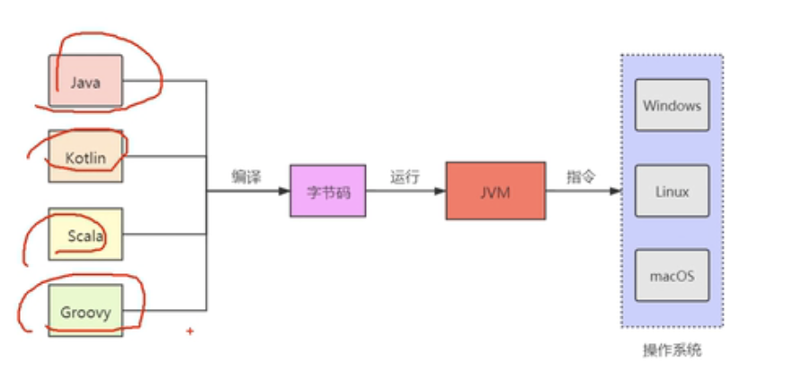
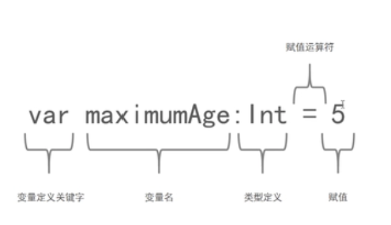

学习视频地址：https://www.bilibili.com/video/BV1wf4y1s7TG?p=7&spm_id_from=pageDriver

## Kotlin 的诞生

* 2017 年，Google 宣布 Kotlin 正式获得官方支持，可用于 Android 应用开发。
* kotlin 语法简洁，具备现代高级语言特性，并且能与 Java 遗留代码无缝互操作。

## Kotlin 与 JVM



* Java 与 Kotlin 的差异就在编译的不同。

## 为什么要学 Kotlin

* Java 开发者喜欢的很多现代语言高级特性，它都没有，或者迟迟加入。
* Kotlin 从这些经验教训中受益良多，而 Java 中的某些早起设计却愈显陈旧，脱胎于旧语言，Kotiln 解决了他们的很多痛点，进化成了一门优秀的语言。相比 Java，Kotlin 进步巨大，带来了更可靠的开发体验。

## Kotlin 的跨平台特性

* Kotlin 不仅支持编写代码在虚拟机上运行，而且还是一门跨平台的通用型语言，可以用 kotlin 开发各种类型的原生应用，如 Android、macOS、Windows、Javascript 应用。
* kotlin 能脱离虚拟机层，直接编译成可以在 Windows、Linux 和 macOS 平台上运行的原生二进制代码。

## 声明变量和内置数据类型

### 变量常量与类型

#### 声明变量



```kotlin
fun main(){
    var str:String = "Hello World"
    println(str)
}
```

#### Kotlin 内置数据类型

| 类型    | 描述             | 驶离                                    |
| ------- | ---------------- | --------------------------------------- |
| String  | 字符串           | “Hello World”                           |
| Char    | 单字符           | 'A'                                     |
| Boolean | true/false       | true false                              |
| Int     | 整数             | 5                                       |
| Double  | 小数             | 3.14                                    |
| List    | 元素集合         | 1,8,10<br />"Jack","rose","Jack"        |
| Set     | 无重复元素的集合 | "Jack","Jason","Jacky"                  |
| Map     | 键值对集合       | “small” to 5,"medium" to 8,"large" to 9 |

## 只读变量

* 要声明可修改变量，使用 var 关键字。
* 要声明只读变量，使用 val 关键字。

```kotlin
fun main(){
    val str:String = "Hello World"
    println(str)
}
```

## 类型推断

* 类型推断：对于已声明并赋值的变量，它允许你省略类型定义。

```kotlin
fun main(){
    val str = "Hello World"
    println(str)
}
```

## 编译时常量

* 只读变量并非绝对只读。
* 编译时常量只能在函数之外定义，因为编译时常量必须在编译时编译，而韩式都是在运行时才调用，函数内的变量也是在运行时赋值，编译时常量要在这些变量赋值前就已存在。
* 编译时常量只能时常见的基本数据类型：String、Int、Double、Float、Long、Short、Byte、Char、Boolean。

```kotlin
const val MAX = 200
const val MIN = 4

fun main(){
    val str = "Hello World"
    println(str)
}
```

## 查看 kotlin 字节码

双击 shift 键，输入show kotlin bytecode，进入就能看字节码。

```
// ================HellokotlinKt.class =================
// class version 50.0 (50)
// access flags 0x31
public final class HellokotlinKt {


  // access flags 0x19
  public final static I MAX = 200

  // access flags 0x19
  public final static I MIN = 4

  // access flags 0x19
  public final static main()V
   L0
    LINENUMBER 5 L0
    LDC "Hello World"
    ASTORE 0
   L1
    LINENUMBER 6 L1
   L2
    GETSTATIC java/lang/System.out : Ljava/io/PrintStream;
    ALOAD 0
    INVOKEVIRTUAL java/io/PrintStream.println (Ljava/lang/Object;)V
   L3
   L4
    LINENUMBER 7 L4
    RETURN
   L5
    LOCALVARIABLE str Ljava/lang/String; L1 L5 0
    MAXSTACK = 2
    MAXLOCALS = 1

  // access flags 0x1009
  public static synthetic main([Ljava/lang/String;)V
    INVOKESTATIC HellokotlinKt.main ()V
    RETURN
    MAXSTACK = 0
    MAXLOCALS = 1

  @Lkotlin/Metadata;(mv={1, 1, 13}, bv={1, 0, 3}, k=2, d1={"\u0000\u0010\n\u0000\n\u0002\u0010\u0008\n\u0002\u0008\u0002\n\u0002\u0010\u0002\n\u0000\u001a\u0006\u0010\u0003\u001a\u00020\u0004\"\u000e\u0010\u0000\u001a\u00020\u0001X\u0086T\u00a2\u0006\u0002\n\u0000\"\u000e\u0010\u0002\u001a\u00020\u0001X\u0086T\u00a2\u0006\u0002\n\u0000\u00a8\u0006\u0005"}, d2={"MAX", "", "MIN", "main", "", "kotlin01"})
  // compiled from: hellokotlin.kt
  // debug info: SMAP
hellokotlin.kt
Kotlin
*S Kotlin
*F
+ 1 hellokotlin.kt
HellokotlinKt
*L
1#1,7:1
*E

}


// ================META-INF/kotlin01.kotlin_module =================



HellokotlinKt
```

## Kotlin 的引用类型

* Java 有两种数据类型：引用类型与基本数据类型。
* Kotiln 只提供引用类型这一种数据类型，出于更高性能的需要，Kotiln 编译器会在 Java 字节码中改用基本数据类型。

查看 show kotlin bytecode： 

```
  public final static I MAX = 200
```

将 MAX 自动转成了 Int 类型。I 表示的就是 Int。

## rang 表达式

### 条件语句

#### 表达式

* if/else if 表达式
* range 表达式
  * in A..B，in 关键字用来检查某个值是否在指定范围之内。
* when 表达式
  * 允许你编写条件式，在某个条件满足时，执行对应的代码
  * 只要代码包含 else if 分支，都建议改用 when 表达式

```kotlin
fun main(){
    val age = 3
    if(age in 0..3){
        println("婴幼儿")
    } else if (age in 3..12){
        println("少儿")
    } else {
        println("未知")
    }
}
```

age=3 out:婴幼儿

age=0 out:婴幼儿

age=4 out:少儿

另一种写法：

```kotlin
fun main(){
    val age = 4
    if (age !in 1..3){
        println("非婴幼儿")
    } else {
        println("婴幼儿")
    }
}
```

## when 表达式

```kotlin
    val school = "小学"
    var level:Any = when(school){
        "学前班" -> "幼儿"
        "小学" -> "少儿"
        "中学" -> "青少年"
        else -> {
            println("未知")
        }
    }
    println(level)
```

## String 模板

* 模板支持在字符串的引号内放入变量值
* 还支持字符串力计算表达式的值并插入结果，添加在 ${} 中的任何表达式，都会作为字符串的一部分求值。

```kotlin
fun main(){
    val origin = "Jack"
    val dest = "Rose"
    println("$origin love $dest")

    val flag = false
    println("Answer is:${if(flag) "我可以" else "对不起"}")
}
```

out： 

```
Jack love Rose
Answer is:对不起
```

## 函数头


```kotlin
fun main(){
        println(doSomething(5,false))
}

private fun doSomething(age:Int,flag:Boolean):String{
    return "result"
}
```

## 函数参数默认值参

* 默认值参
  * 如果不打算传入值参，可以预先给参数指定默认值
* 具名函数参数
  * 如果使用命令值参，就可以不用管值参的顺序

```kotlin
fun main(){
    fix("Jack")
}

fun fix(name:String,age:Int=2){
    println(name+age)
}
```

out：Jack+2

## 具名函数参数

```kotlin
fun main(){
    fix(age=10,name="Rose")
}

fun fix(name:String,age:Int=2){
    println(name+age)
}
```

out：Rose10

## Unit 函数

* 不是所有函数都有返回值，Kotlin 中没有返回值的函数叫 Unit 函数，也就是说他们的返回类型是 Unit。在 Kotlin 之前，函数不返回任何东西用 void 描述，意思是 “没有返回类型，不会带来什么，忽略它”，也就是说如果函数不返回任何东西，就忽略类型。但是，void 这种解决方案无法解释现代语言的一个重要特征，泛型。

```kotlin
fun main(){
    println(fix(age=10,name="Rose"))
}

fun fix(name:String,age:Int=2){
    println(name+age)
}
```

Out:

```
Rose10
kotlin.Unit
```

## Nothing 类型

* TODO 函数的人物就是抛出异常，就是永远别指望它运行成功，返回 Nothing 类型。

```kotlin
public inline fun TODO(reason: String): Nothing = throw NotImplementedError("An operation is not implemented: $reason")
```

TODO 函数返回值类型就是 Nothing。

```kotlin
fun main(){
    TODO("nothing")
    println("after nothing.")
}
```

Out:

```
Exception in thread "main" kotlin.NotImplementedError: An operation is not implemented: nothing
	at FunctionKt.main(Function.kt:5)
	at FunctionKt.main(Function.kt)
```

直接抛出了异常，没有打印 “after nothing.”。

## 反引号中的函数名

* kotlin 可以使用空格和特殊字符对函数命名，不过函数名要用一对反引号括起来。
* 为了支持 Kotlin 和 Java 互操作，而 Kotlin 和 Java 各自却有着不同的保留关键字，不能作为函数名，使用反引号括住函数名就能避免任何冲突。

```kotlin
fun main(){
    `**~special function with weird name~**`()
    MyJava.`is`()
}

fun `**~special function with weird name~**`(){
    println("special function")
}
```

```java
public class MyJava {
    public static final void is(){
        System.out.println("invoke is");
    }
}
```

Out:

```
special function
invoke is
```

is 在 kotlin 里是关键字，所以在 kotlin 中调用 Java 的 is 方法，需要使用反引号。


## 什么是匿名函数

* 定义时不取名字的函数，我们称之为匿名函数，匿名函数通常整体传递给其他函数，或者从其他函数返回。
* 匿名函数对 Kotlin 来说很重要，有了它，我们能够根据需要制定特殊规则，轻松定制标准库内的内置函数。

```kotlin
fun main() {
    val total: Int = "Mississippi".count()

    val totals:Int = "Mississippi".count({ letter ->
        letter == 's'
    })

    println(total)
    println(totals)
}
```

Out:

```
11
4
```

totals 统计的是字符串中 s 的个数。

## 函数类型与隐式返回

* 匿名函数也有类型，匿名函数可以当作变量赋值给函数类型变量，就像其他变量一样，匿名函数就可以在代码里传递了。变量有类型，变量可以等于函数，函数也会有类型。函数的类型，由传入的参数和返回值类型决定。

* 和具名函数不一样，除了极少数情况外，匿名函数不需要 return 关键字来返回数据，匿名函数会隐式或自动返回函数体最后一行语句的结果。

```kotlin
    val blessingFunction:()-> String
    blessingFunction = {
        val holiday = "New Year."
        "Happy $holiday"
    }
```

## 函数参数

* 和具名函数一样，具名函数可以不带参数，也可以带一个或多个任何类型的参数，需要带参数时，参数的类型放在匿名函数的类型定义中，参数名则放在函数定义中。

```kotlin
    val blessingFunction:(String)-> String = {name->
        val holiday = "New Year."
        "$name, Happy $holiday"
    }

    println(blessingFunction("Jack"))
```

out:

```
Jack, Happy New Year.
```

## it 关键字

* 定义只有一个参数的匿名函数时，可以使用 it 关键字来表示参数名。当你需要传入两个值参，it 关键字就不能用了。

```kotlin
    val blessingFunction:(String)-> String = {
        val holiday = "New Year."
        "$it, Happy $holiday"
    }

    println(blessingFunction("Jack"))
```


## 匿名函数的类型推断

* 定义一个变量时，如果已吧匿名函数作为变量赋值给它，就不需要显示指明变量类型了。

```kotlin
    val blessingFunction:()-> String = {
        val holiday = "New Year."
        "Happy $holiday"
    }

    println(blessingFunction())
```

可以简化为：

```kotlin
    val blessingFunction = {
        val holiday = "New Year."
        "Happy $holiday"
    }

    println(blessingFunction())
```

* 类型推断也支持带参数的匿名函数，但为了帮助编译器更准确地推断变量类型，匿名函数的参数名和参数类型必须有。

```kotlin
    val blessingFunction:(String,Int) -> String= {name,year ->
        val holiday = "New Year."
        "$name,Happy $holiday $year"
    }

    println(blessingFunction("Jack",2027))
```

可以简化为：

```kotlin
    val blessingFunction= {name:String,year:Int ->
        val holiday = "New Year."
        "$name,Happy $holiday $year"
    }

    println(blessingFunction("Jack",2027))
```


## 什么是 lambda

* 我们将匿名函数称为 lambda，将它的定义称为 lambda 表达式，它返回的数据称为 lambda 结果。为什么叫 lambda？lambda 也可以用希腊字符标示，是 lambda 演算的简称，lambda 演算是一套数理演算逻辑，由数学家 Alonzo Church（阿隆佐.丘齐）于 20 世纪 30 年代发明，在定义匿名函数时，使用了 lambda 演算记法。


## 定义参数是函数的函数

* 函数的参数是另外一个函数

```kotlin
fun main() {
    val getDiscountWords = {goodsName:String,hour:Int ->
        val currentYear = 2027
        "${currentYear}年，双11${goodsName}促销倒计时：${hour}小时"
    }
    showOnBoard("卫生纸",getDiscountWords);
}

fun showOnBoard(goodsName:String,getDiscountWords:(String,Int)->String){
    val hour:Int = (1..24).shuffled().last()
    println(getDiscountWords(goodsName,hour))
}
```

Out:

```
2027年，双11卫生纸促销倒计时：18小时
```

## 简略写法

* 如果一个函数的 lambda 参数排在最后，或者是唯一的参数，那么括住 lambda 值参的一对圆括号就可以省略。

```kotlin
    val totals:Int = "Mississippi".count({ letter ->
        letter == 's'
    })
```

可以简化为：

```kotlin
    val totals:Int = "Mississippi".count{
        it == 's'
    }
```

```kotlin
fun main() {
    val getDiscountWords = {goodsName:String,hour:Int ->
        val currentYear = 2027
        "${currentYear}年，双11${goodsName}促销倒计时：${hour}小时"
    }
    showOnBoard("卫生纸",getDiscountWords);
}

fun showOnBoard(goodsName:String,getDiscountWords:(String,Int)->String){
    val hour:Int = (1..24).shuffled().last()
    println(getDiscountWords(goodsName,hour))
}
```

可以简写为：

```kotlin
fun main() {
    showOnBoard("卫生纸"){goodsName:String,hour:Int ->
        val currentYear = 2027
        "${currentYear}年，双11${goodsName}促销倒计时：${hour}小时"
    }
}

private fun showOnBoard(goodsName:String,getDiscountWords:(String,Int)->String){
    val hour:Int = (1..24).shuffled().last()
    println(getDiscountWords(goodsName,hour))
}
```


## 函数内联

* lambda 可以让你更灵活地编写应用，但是，灵活也是要付出代价的。
* 在 JVM 上，你定义的 lambda 会以对象实例的形式存在，JVM 会为所有同 lambda 打交道的变量分配内存，这就产生了内存开销。更糟的是，lambda 的内存开销会带来严重的性能问题。幸运的是，kotlin 有一种优化机制叫内联，有了内联，JVM 就不需要使用 lambda 对象实例了，因而避免了变量内存分配。哪里需要使用 lambda，编译器就会将函数体复制粘贴到哪里。
* 使用 lambda 的递归函数无法内联，因为会导致复制粘贴无限循环，编译会发出警告。


## 函数引用

* 要把函数作为参数传给其他喊出使用，除了传 lambda 表达式，kotlin 还提供了其他方法，传递函数引用，函数引用可以把一个具名函数转换成一个值参，使用 lambda 表达式的地方，都可以使用函数引用。

```kotlin
fun main() {
    showOnBoard("牙膏",::getDiscountWords)
}

private fun getDiscountWords(goodsName: String,hour:Int):String{
    val currentYear = 2027
    return "${currentYear}年，双11${goodsName}促销倒计时：${hour}小时"

}


private fun showOnBoard(goodsName:String,getDiscountWords:(String,Int)->String){
    val hour:Int = (1..24).shuffled().last()
    println(getDiscountWords(goodsName,hour))
}
```


## 函数类型作为返回类型

* 函数类型也是有效的返回类型，也就是说可以定义一个能返回函数的函数。

```kotlin
fun main() {
    val getDiscountWords = configDiscountWords()
    println(getDiscountWords("沐浴露"))

}

fun configDiscountWords():(String)->String{
    return {goodsName:String ->
        val currentYear = 2027
        val hour:Int = (1..24).shuffled().last()
        "${currentYear}年，双11${goodsName}促销倒计时：${hour}小时"
    }
}
```

```kotlin
fun main() {
    val getDiscountWords = configDiscountWords()
    println(getDiscountWords("沐浴露"))

}

fun configDiscountWords():(String)->String{
    val currentYear = 2027
    val hour:Int = (1..24).shuffled().last()
    return {goodsName:String ->
        "${currentYear}年，双11${goodsName}促销倒计时：${hour}小时"
    }
}
```


## 闭包

* 在 kotlin 中，匿名函数能修改并引用定义在自己的作用域之外的变量，匿名函数引用着定义自身的函数里的变量，kotlin 中的 lambda 就是闭包。
* 能接收函数或者返回函数的函数又叫做高级函数，高级函数广泛应用于函数式编程当中。

## lambda 与匿名内部类

* 为什么要在代码中使用函数类型？函数类型能让开发者少写模式化代码，写出更灵活的代码。Java 8 支持面向对象编程和 lambda 表达式，但不支持将函数作为参数传给另一个函数或变量，不过 Java 的替代方案是匿名内部类。

```java
import java.util.Random;

public class JavaAnonyousClass {

    public static void main(String[] args) {
        showOnBoard("牙膏", new DiscountWords() {
            @Override
            public String getDiscountWords(String goodsName, int hour) {
                int currentYear = 2027;
                return String.format("%d年，双11%s促销倒计时：%d小时",currentYear,goodsName,hour);
            }
        });
    }

    public interface DiscountWords{
        String getDiscountWords(String goodsName,int hour);
    }

    public static void showOnBoard(String goodsName,DiscountWords discountWords){
        int hour = new Random().nextInt(24);
        System.out.printf(discountWords.getDiscountWords(goodsName,hour));
    }
}
```

同样的实现，java 的代码更多，kotlin 更简洁。


