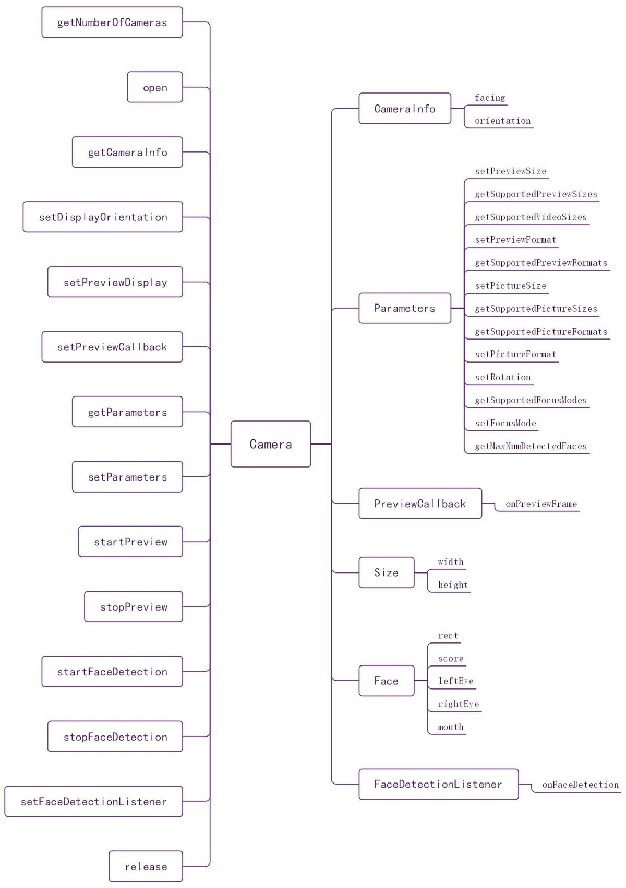
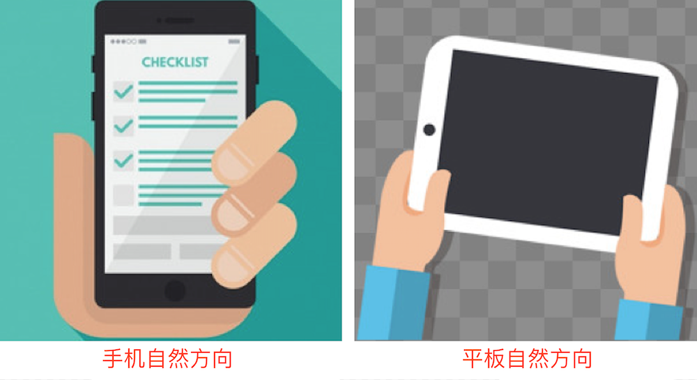
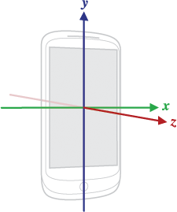
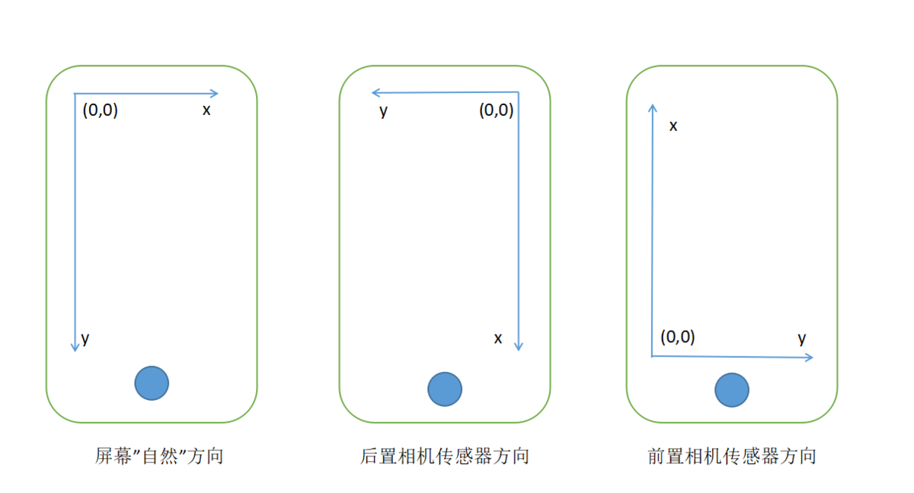
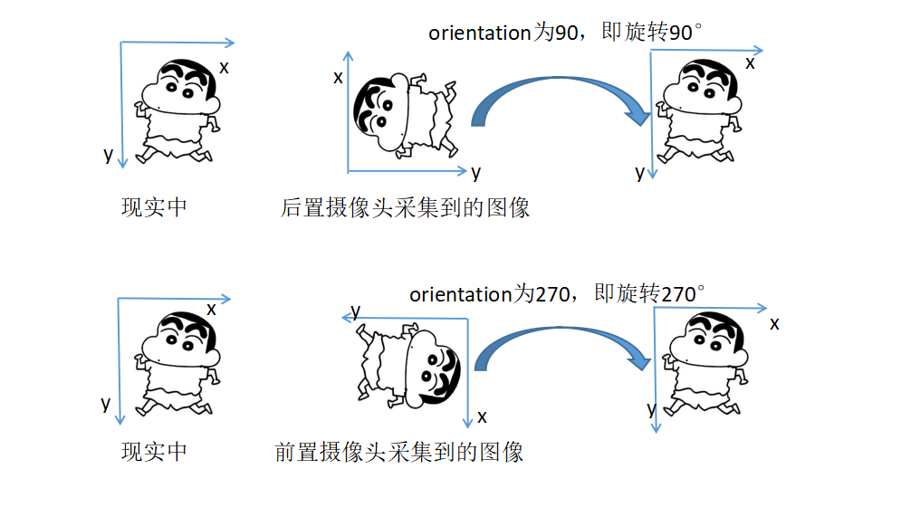

# Camera
　　进行 Camera 开发主要用到了两个类：Camera，SurfaceView（当然也可以是 TextureView）。

　　SurfaceView：显示效果，Camera：底层硬件。

## SurfaceView、Surface、SurfaceHolder

#### 关系图


#### Surface
　　Surface 是用来处理屏幕显示内容合成器所管理的原始缓存区的工具。它通常由图像缓冲区的消费者来创建（如：SurfaceTexture，MediaRecoder），然后被移交给生产者（如：MediaPlayer）或者是显示在其上（如：CameraDevice）。

#### SurfaceHolder
　　SurfaceHolder 是一个抽象接口，给持有 surface 的对象使用。它可以控制 surface 的大小和格式，编辑 surface 中的像素，以及监听 surface 的变化。这个接口通常通过 SurfaceView 类获得。

　　SurfaceHolder 中有一个 Callback 接口，它有 3 个回调方法：
* surfaceCreated(SurfaceHolder holder)
  surface 第一次创建时回调
* surfaceChanged(SurfaceHolder holder,int format,int width,int height)
  surface 变化的时候回调（格式/大小）
* surfaceDestoryed(SurfaceHolder holder)
  surface 销毁的时候回调

#### SurfaceView
　　SurfaceView 提供了嵌入视图层级中的专用 surface。你可以控制 surface 的格式或大小。SurfaceView 复制把 surface 显示在屏幕的正确位置。

　　SurfaceView 继承自 View，其中有两个成员变量，一个是 Surface 对象，一个是 SurfaceHolder 对象。
* SurfaceView 把 Surface 显示在屏幕上。
* SurfaceView 通过 SurfaceHolder 告诉我们 Surface 的状态（创建、变化、销毁）。
* 通过 getHolder() 方法获得当前 SurfaceView 的 SurfaceHolder 对象，然后就可以对 SurfaceHolder 对象添加回调来监听 Surface 的状态。

#### SurfaceView 小结
1. SurfaceView 是一个 view 对象，用于在屏幕上显示相机的预览画面。
2. SurfaceView 中有两个对象，Surface 和 SurfaceHolder。通过 SurfaceHolder 中的回调可以知道 Surface 的状态（创建、变化、销毁）、
3. 通过 getHolder() 方法获得当前 SurfaceView 的 SurfaceHolder 对象。

## Camera

#### 概览图
　　Camera 类中主要的内部类和接口，如下图：


#### Camera 类中的内部类

##### CameraInfo
　　CameraInfo 类用来描述相机信息，通过 Camera 类中的 getCameraInfo(int cameraId,CameraInfo cameraInfo) 方法获得，主要包括以下两个成员变量：

* facing
　　facing 代表相机的方向，它的值只能是 CAMERA_FACING_BACK(后置摄像头) 或者 CAMERA_FACING_FRONT(前置摄像头)。

　　CAMERA_FACING_BACK 和 CAMERA_FACING_FRONT 是 CameraInfo 类中的静态变量。

* orientation
　　orientation 是相机采集图片的角度。这个值是相机所采集的图片需要顺时针旋转至自然方向的角度值。它必须是0,90,180 或 270 中的一个。

　　例子说明一下：自然地竖着拿着手机（就是自拍的样子），后置摄像头的传感器在手机里是水平方向的，现在看着手机，如果传感器的顶部在自然方向上手机屏幕的右边（此时，手机是竖屏，传感器是横屏），那么这个 orientation 的值就是 90，如果前置摄像头的传感器顶部在手机屏幕右边，那么这个值就是 270。

* canDisableShutterSound
	是否支持静音拍照，也就是说在用户拍照的时候是否会“咔嚓”一声，例如在日本由于隐私政策，所有手机都是不允许静音拍照的，那么该字段就会返回 false。该字段一般配合 Camera.enableShutterSound(boolean) 使用，当它返回 false 的时候，即使你调用 Camera.enableShutterSound(false)，相机在拍照的时候也会发出声音。


* setDisplayOrientation
　　设置预览画面顺时针旋转的角度。这个方法会影响预览图像和拍照后显示的照片。这个方法对竖屏应用非常有用。注意，前置摄像头在进行角度旋转之前，图像会进行一个水平的镜像反转。所以用户在看预览图像的时候就像照镜子，看到的是现实的水平方向的镜像。

　　注：setDisplayOrientation(int degrees) 是 Camera 类中的一个方法。

　　注：如果是第一次使用 Camera 的话，首先要了解以下几点：

1. 相机图像数据都是来自于相机硬件的图像传感器（Image Sensor），这个 Sensor 被固定到手机之后是有一个默认的取景方向，且不会改变。
2. 相机在预览的时候是有一个预览方向的，可以通过 setDisplayOrientation() 设置。
3. 相机所采集的相片也是有一个方向的（就是上面的 orientation），这个方向与预览时的方向互不相干。


* **屏幕坐标：**在 Android 系统中，屏幕的左上角是坐标系统的原点（0,0）坐标。

* **自然方向：**每个设备都有一个自然方向，手机和平板的自然方向不同。手机的自然方向是 protrait(竖屏)，平板的自然方向是 landscape(横屏)。


* **设备方向：**设备方向指的是硬件设备在空间中的方向与其自然自然方向的顺时针夹角。
可以通过 OrientationEventListener 监听设备的方向，进而判断设备当前是否处于自然方向，当设备的方向发生变化的时候会回调 OrientationEventListener.onOrienntationChanged(int) 方法，传给一个 0 到 359 的方向值，其中 0 表示设备处于自然方向。

* **局部坐标系：**所谓的局部坐标系指的是当设备处于自然方向时，相对于设备屏幕的坐标系，该坐标系是固定不变的，不会因为设备方向的变化而改变。



* **图像传感器（Image Sensor） 方法：**手机相机的图像数据都是来自于摄像头硬件的图像传感器，这个传感器在被固定到手机上后有一个默认的取景方向。



* **相机的预览方向：**将图像传感器捕获的图像，显示在屏幕上的方向。在默认情况下，这个值为 0，与图像传感器方向一致。


* **相机采集的图像方向：**相机采集图像后需要进行顺时针旋转的角度，即上面介绍的 orientation 的值：



小结：
* 绝大部分安卓手机中图像传感器方向是横向的，且不能改变，所以 orientation 是 90 或是 270，也就是说，当点击拍照后保存图片的时候，需要对图像做旋转处理，使其为“自然方向”。（可能存在一些特殊的定制或是能外接摄像头的安卓机，他们的 orientation 会是 0 或者 180）。
* 通过 setDisplayOrientation 方法设置预览方向，使预览画面为“自然方向”。前置摄像头在进行角度旋转之前，图像会进行一个水平的镜像翻转，所以用户在看预览图像的时候就像照镜子一样。

##### Size
　　图片大小，里面包含两个变量：width 和 height(图片的宽和高)。

##### Parameters
　　Parameters 是相机服务设置，不同的相机可能是不相同的。比如相机所支持的图片大小，对焦模式等等。下面是这个类中常用的方法：

* getSupportedPreviewSizes()
	获得相机支持的预览图片大小，返回值是一个 List < Size > 数组。

* setPreviewSize(int width,int height)
	设置相机预览图片的大小。

* getSupportedPreviewFormats()
	获得相机支持的图片预览格式，所有的相机都支持 ImageFormat.NV21。

* getPreviewFormat(int picel_format)
	设置预览图片的格式。

* getSupportedPictureSizes()
	获得相机支持的采集的图片大小（即拍照后保存的图片的大小）。

* setPictureSize(int width,int height)
	设置保存的图片的大小。

* getSupportedPictureFormats()
	获得相机支持的图片格式。

* setPictureFormat(int pixel_format)
	设置保存的图片的格式。

* getSupportedFocusModes()
	获得相机支持的对焦模式。

* getMaxNumDetectedFaces()
	返回当前相机所支持的最大的人脸检测个数。

##### PreviewCallback
　　PreviewCallback 是一个抽象接口。用来获取相机预览数据。

* void onPreviewFrame(byte[] data,Camera camera)
	通过 onPreviewFrame 方法来获取到相机预览的数据，第一个参数 data，就是相机预览到的原始数据。

　　这些预览到的原始数据是非常有用的，比如可以保存下来当做一张图片，还有很多第三方的人脸检测及静默活体检测的 sdk，都需要把相机预览的数据实时地传递过去。

　　注册预览回调获取预览数据的方式有两种：setPreviewCallback():注册预览回调，setPreviewCallbackWithBuffer():注册预览回调，并且使用已经配置好的缓冲池。使用 setPreviewCallback() 注册预览回调获取预览数据是最简单的，因为不需要其他配置流程，直接注册即可，但是出于性能考虑，官方推荐使用 setPreviewCallbackWithBuffer()，因为它会使用配置好的缓冲对象回调预览数据，避免重复创建内存占用很大的对象。

##### Face
　　Face 类用来描述通过 Camera 的人脸检测功能检测到的人脸信息。

* rect
	rect 是一个 Rect 对象，它所表示的就是检测到的人脸的区域。
注意：这个 Rect 对象中的坐标系并不是安卓屏幕的坐标系，需要进行转换后才能使用。

* score
	检测到的人脸的可信度，范围是 1 到 100。

* leftEye
	leftEye 是一个 Point 对象，表示检测到的左眼的位置坐标。

* rightEye
	rightEye 是一个 Point 对象，表示检测到的右眼的位置坐标。

* mouth
	mouth 是一个 Point 对象，表示检测到的嘴的位置坐标。

leftEye、rightEye 和 mouth 是 3 个人脸中关键点，并不是所有相机都支持的，如果相机不支持的话，这 3 个的值为 null。

##### FaceDetectionListener
　　这是一个抽象接口，当开始人脸检测时开始回调。

* onFaceDetection(Face[] faces，Camera camera)
	第一参数代表检测到的人脸，是一个 Face 数组（画面内可能存在多张人脸）。

#### Camera 类中的方法

* getNumberOfCameras()
	返回当前设备上可用的摄像头个数。

* open()
	使用当前设备上第一个后置摄像头创建一个 Camera 对象。如果当前设备没有后置摄像头，则返回值为 null。

* open(int cameraId)
	使用传入 id 所表示的摄像头创建一个 Camera 对象，如果 id 所表示的摄像头已经被打开，则会抛出异常。
	设备上每一个物理摄像都有一个 id 的，id 从 0 开始，到 getNumberOdCameras() - 1 结束。
	例如，一般的手机上都有前后两个摄像头，那么后置摄像头 id 就是 0，前置摄像头 id 就是 1。

* getCameraInfo(int cameraId,CameraInfo cameraInfo)
	返回指定 id 所表示的摄像头的信息。

* setDisplayOrientation(int degrees)
	设置相机预览画面旋转的角度。

* setPreviewDisplay(SurfaceHolder holder)
	设置一个 Surface 对象用来实时预览。

* setPreviewCallback(PreviewCallback cb)
	设置相机预览数据的回调，参数是一个 PreviewCallback 对象。

* getParameters()
	返回当前相机的参数信息，返回值是一个 Parameters 对象。

* setParameters(Parameters params)
	设置当前相机的参数信息。

* setPreview()
	开始预览。调用此方法之前，如果没有 setPreviewDisplay(SurfaceHolder) 或 setPreviewTexture(SurfaceTexture) 的话，是没有效果的。

* stopPreview()
	停止预览。

* startFaceDetection()
	开始人脸检测。这个方法必须在开始预览之后调用。

* stopFaceDetection()
	停止人脸检测。

* setFaceDetectionListener(FaceDetectionListener listener)
	设置人脸检测监听回调。

* release()
	释放相机。

## 总结
1. Camera 负责采集数据和各种操作，SurfaceView 负责把 Camera 采集到的数据实时地显示在屏幕上。
2. 通过 SurfaceHolder 中的回调可以监听 Surface 的状态（创建、变化、销毁）。
3. 相机图像数据都是来自于相机硬件的图像传感器这个方法是不能改变的。
4. 相机在预览的时候是有一个预览方向的，可以通过 setDisplayOrientation() 设置。
5. 前置摄像头在进行角度旋转之前，图像会进行一个水平的镜像翻转，所以用户在看预览图像的时候就像照镜子一样。
6. 相机所采集的图片也是有一个方向的，这个方法与预览时的方向互不相干。
7. 可以通过 setParameters(Parameters params) 设置当前相机的参数信息，比如保存的图片的大小，对焦模式等等。
8. 在关闭页面或者打开其他摄像头之前，一定要先调用 release() 方法释放当前相机资源。

## 其他

#### 配置相机特性要求
　　如果不希望在没有任何摄像头的手机上安装使用相机的应用程序，就可以在 AndroidManifest.xml 中配置一些程序运行时必要的相机特性，如果这些特性不支持，那么用户在安装 apk 的时候就会因为条件不符合而无法安装。

```
<uses-feature
	android:name="android.hardware.camera"
	android:required="true"
/>
```
　　通过 < uses-feature > 标签声明了应用程序必须在具有摄像头的手机上才能运行。


## 查阅资料
1.[Android: Camera相机开发详解(上) —— 知识储备](https://www.jianshu.com/p/f8d0d1467584) - 基本知识
2.[Android: Camera相机开发详解(中) ——实现预览、拍照、保存照片等功能](https://www.jianshu.com/p/e20a2ad6ad9a) - 相机开发实例
3.[Android: Camera相机开发详解(下) —— 实现人脸检测功能](https://www.jianshu.com/p/3bb301c302e8) - 人脸检测功能实例
4.[Android Camera1 教程 · 第一章 · 开启相机](https://www.jianshu.com/p/3440d82545f6) - 简单知识介绍
5.[Android Camera1 教程 · 第二章 · 预览](https://www.jianshu.com/p/705d4792e836) - 预览知识与使用


