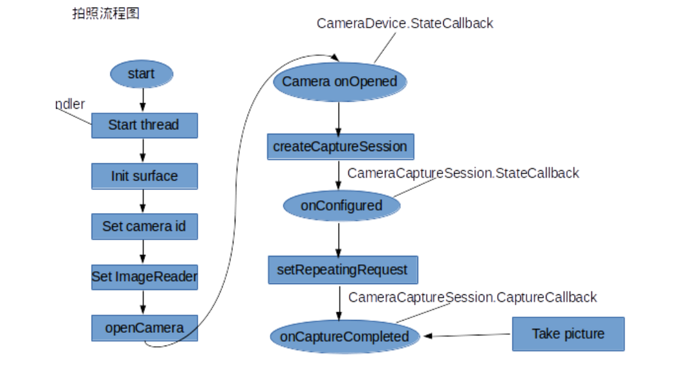

# Camera2

## Camera2 框架概述
　　Camera2 架构图：

　　Camera2 引用了管道的概念将安卓设备和摄像头之间联通起来，系统向摄像头发送 Capture 请求，而摄像头会返回 CanmeraMetadata。这一切建立在一个叫作 CameraCaptureSession 的会话中。

　　Camera2 拍照流程图：

## camera2 中比较重要的类及方法

#### 1. CameraManager
　　摄像头管理器，用于打开和关闭系统摄像头。

* getCameraIdList()
	返回当前设备中可用的相机列表。

* getCameraCharacteristics(String cameraId)
	根据摄像头 id 返回该摄像头的相关信息。

* openCamera(String cameraId,final CameraDevice.StateCallback callback,Handler handler);
	打开指定 cameraId 的相机。参数 callback 为相机打开时的回调，参数 handler 为 callback 被调用时所在的线程。

#### 2.CameraDevice
　　描述系统摄像头，类似于早期的 Camera。

* createCaptureRequest(int templateType)
	创建一个新的 Capture 请求。参数 templateType 代表了请求类型，请求类型一共分为六种，分别是：
1. TEMPLATE_PREVIEW：创建预览的请求。
2. TEMPLATE_STILL_CAPTURE：创建一个适合于静态图像捕获的请求，图像质量优先于帧速率。
3. TEMPLATE_RECORD：创建视频录制的请求。
4. TEMPLATE_VIDEO_SNAPSHOT：创建视频录制时截屏的请求。
5. TEMPLATE_ZERO_SHUTTER_LAG：创建一个适用于零快门延迟的请求。在不影响预览帧率的情况下最大化图像质量。
6. TEMPLATE_MANUAL：创建一个基本捕获请求，这种请求中所有的自动控制都是禁用的（自动曝光、自动白平衡、自动焦点）。

* createCaptureSession(List< Surface > outputs,CameraCaptureSession.StateCallback callback,Handler handler)
	创建 CaptureSession 会话。第一个参数 outputs 是一个 List 数组，相机会把捕捉到的图片数据传递给该参数中的 Surface。第二个参数 StateCallback 是创建会话的状态回调。第三个参数描述了 StateCallback 被调用时所在的线程。

## 查阅资料
1.[Android Camera2 教程 · 第一章 · 概览](https://www.jianshu.com/p/9a2e66916fcb)
2.[Android Camera2 教程 · 第二章 · 开关相机](https://www.jianshu.com/p/df3c8683bb90)
3.[Android Camera2 教程 · 第三章 · 预览](https://www.jianshu.com/p/067889611ae7)
4.[Android Camera2 教程 · 第四章 · 拍照](https://www.jianshu.com/p/2ae0a737c686)
5.[Android:Camera2开发详解(上)：实现预览、拍照、保存照片等功能](https://www.jianshu.com/p/0ea5e201260f)
6.[Android:Camera2开发详解(下)：实现人脸检测功能并实时显示人脸框](https://www.jianshu.com/p/331af6dc2772)