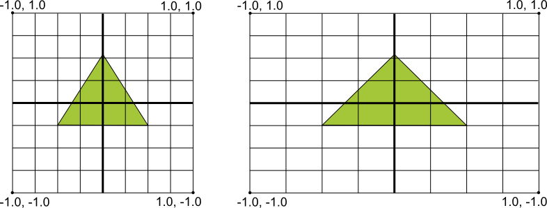

# OpenGL

## 基础知识
　　Android 使用 OpenGL 图形库支持高性能的 2D 和 3D 图形，特别是 OpenGL ES API。OpenGL 是一个跨平台的图形 API，它为 3D 图形处理硬件指定了标准的软件接口。 Opengl ES 是面向嵌入式设备的 OpenGL 规范的一种风格。Android 支持多种版本的 OpenGL ES API:

　　OpenGL SE 1.0 和 1.1 - Android 1.0 以及更高版本支持此 API 规范。

　　OpenGL ES 2.0 - Android 2.2(API level 8) 以及更高版本支持此 API 规范。

　　OpenGL ES 3.0 - Android 4.3（API level 18）以及更高支持此 API 规范。

　　OpenGL ES 3.1 - Android 5.0(API level 21)以及更高版本支持此 API 规范。

　　注意：在设备上支持 OpenGL ES 3.0 API 需要设备制造商提供图形管道的实现。运行 Android 4.3 或更低版本的设备可能不支持 OpenGL ES 3.0 API。

　　在 Android 应用程序中使用 OpenGL ，有两个基础类：GLSurfaceView 和 GLSurfaceView.Renderer，用于创建和操作图形。

#### GLSurfaceView

　　GLSurfaceView 是一个 View，在使用 OpenGl API 时调用用于绘制和操作对象，和 SurfaceView 类似。可以通过创建 GLSurfaceView 并且为它添加 Renderer 来使用它。但是，如果箱套捕获触摸事件，则需要扩展 GLSurfaceView 类实现触摸监听器。

#### GLSurfaceView.Renderer

　　此接口定义了在 GLSurfaceView 绘制图形所需要的方法。必须将该接口的实现类作为单独的类，并调用 GLSurfaceView.setRenderer() 方法将其附加给 GLSurfaceView 实例上。

　　GLSurfaceView.Renderer 接口要求实现以下方法：

* onSurfaceCreated()：系统只会在创建 GLSurfaceView 的时候调用此方法一次。使用此方法执行只需要执行一次的操作，例如设置 OpenGL 的环境参数或者初始化 OpenGL 图形对象。
* onDrawFrame()：系统在 GLSurfaceView 的每一次重绘时调用此方法，使用此方法作为绘制（和重绘）图形对象的主要执行点。
* onSurfaceChanged()：系统在 GLSurfaceView 集合变化时调用此方法，包括改变 GLSurfaceView 的大小，或者设备屏幕方向变化。举例，当设备屏幕方向从纵向改变为横向是系统会调用此方法。使用此方法去响应 GLSurfaceView 容器的变化。


## 声明 OpenGL 要求

#### OpenGL ES 版本要求

　　如果应用使用在并非所有设备都支持 OpenGL 功能，就需要在 AndroidManifest.xml 文件中声明该要求，下面是最常见的 OpenGL 清单声明：

　　对于 OpenGL ES 2.0：

```
<!-- Tell the system this app requires OpenGL ES 2.0. -->
<uses-feature android:glEsVersion="0x00020000" android:required="true" />

```
　　添加此声明后，如果设备不支持 OpenGL ES 2.0 ，Google Play 将拒绝你的应用安装到设备上。

　　如果你的应用程序需要支持 OpenGL ES 3.0，则需要在清单中添加如下：

　　对于 OpenGL ES 3.0：
```
<!-- Tell the system this app requires OpenGL ES 3.0. -->
<uses-feature android:glEsVersion="0x00030000" android:required="true" />

```

　　对于 OpenGL ES 3.1：
```
<!-- Tell the system this app requires OpenGL ES 3.1. -->
<uses-feature android:glEsVersion="0x00030001" android:required="true" />

```

　　注意：OpenGL 3.x API 是向后兼容 2.0 API，这意味着你可以更加灵活的在应用程序中使用 OpenGL ES。在清单中声明 OpenGL ES 2.0 API 为必需项，将 2.0 版本作为默认版本，在运行时检查 3.x API 的可用性，然后在设备支持的情况下使用 OpenGL ES 3.x 功能。

#### 纹理压缩要求
　　如果应用程序使用纹理压缩格式，则必须使用 < supports-gl-texture > 在清单文件中声明应用程序支持的格式。

　　在清单中声明纹理压缩会要求向不具有支持至少一种声明压缩类型的设备用户隐藏应用程序。

## 绘制对象的映射坐标
　　在 Android 设备上显示徒刑又一个基本问题就是它们的屏幕大小和形状可能是不同的。OpenGL 假设的是一个正方形、同一的坐标系，并且在通常情况下，将典型的非正方形的屏幕上，将它作为完美的正方形一样将左边绘制上去。



　　上图左侧显示了 OpenGL 框架的同一坐标系，以及这些坐标实际上是如何映射到右侧横向的典型设备屏幕上。为了解决这个问题，你需要应用 OpenGL 投影模式和相机视图来变换坐标，以便你的图形对象在任何显示上都有一个正确的比例。

　　为了使用投影和相机视图，需要你创建一个投影矩阵和一个相机视图举证，并且在 OpenGL 渲染管道上应用它们。投影矩阵重新计算图形的坐标，以便它们正确的映射到 Android 设备屏幕上。相机视图矩阵创建了一个变换，该变换从从特定的眼睛位置渲染对象。

#### OpenGL ES 1.0 中的投影和相机视图
　　在 ES 1.0 API 中，通过创建每个矩阵，将它们添加到 OpenGL 环境中，使用投影和相机视图。

1.投影矩阵--使用设备屏幕的几何图形创建一个投影矩阵，为了计算对象坐标以便正确的比例绘制它们。下面的示例代码演示如何去实现 GLSurfaceView.Renderder 的 onSurfaceChanged() 方法，创建一个根据屏幕纵横比的映射矩阵，并且在 OpenGL 渲染环境下使用它。
```
public void onSurfaceChanged(GL10 gl, int width, int height) {
    gl.glViewport(0, 0, width, height);

    // make adjustments for screen ratio
    float ratio = (float) width / height;
    gl.glMatrixMode(GL10.GL_PROJECTION);        // set matrix to projection mode
    gl.glLoadIdentity();                        // reset the matrix to its default state
    gl.glFrustumf(-ratio, ratio, -1, 1, 3, 7);  // apply the projection matrix
}
```

2.相机变换矩阵--使用投影举证调整过坐标系之后，你还必须使用相机视图。下面的示例代码展示了如何去实现 GLSurfaceView.Renderer 的 onDrawFrame() 方法去饮用一个模型视图，并使用 GLU.gluLookAt() 模拟一个相机位置的视图转换。

```
public void onDrawFrame(GL10 gl) {
    ...
    // Set GL_MODELVIEW transformation mode
    gl.glMatrixMode(GL10.GL_MODELVIEW);
    gl.glLoadIdentity();                      // reset the matrix to its default state

    // When using GL_MODELVIEW, you must set the camera view
    GLU.gluLookAt(gl, 0, 0, -5, 0f, 0f, 0f, 0f, 1.0f, 0.0f);
    ...
}
```

### OpenGL ES 2.0 以及更高版本的映射和相机视图
　　在 ES 2.0 和 3.0 API 上，你使用映射和相机视图，首先需要将矩阵成员添加到图形对象的顶点着色器，添加矩阵成员后，可以生成并且使用映射和相机视图矩阵到对象上。

1.添加矩阵到顶点着色器--为视图投影矩阵创建一个变量，并且将它作为着色器位置的倍增。在下面的顶点着色器示例代码中，报刊的 uMVPMatrix 成员允许将映射和相机视图矩阵应用于使用找色齐的对象坐标。

```
private final String vertexShaderCode =

    // This matrix member variable provides a hook to manipulate
    // the coordinates of objects that use this vertex shader.
    "uniform mat4 uMVPMatrix;   \n" +

    "attribute vec4 vPosition;  \n" +
    "void main(){               \n" +
    // The matrix must be included as part of gl_Position
    // Note that the uMVPMatrix factor *must be first* in order
    // for the matrix multiplication product to be correct.
    " gl_Position = uMVPMatrix * vPosition; \n" +

    "}  \n";
```

　　注意：上面的示例定义了顶点找色齐的一个单例转换举证成员，你可以使用组合投影举证和相机视图举证。根据你应用需要，可能需要在顶点着色器中定义单独的投影矩阵和相机视图矩阵成员，方便独立的去改变它们。

2.访问着色器矩阵--在对你的顶点着色器使用映射和相机视图创建一个钩（hook）之后，你就可以访问应用投影和相机视图矩阵的比边框。下面的代码展示了如何去实现 GLSurfaceView.Renderer 的 onSurfaceCreated() 方法，以访问上面顶点着色器定义的矩阵变量。
```
public void onSurfaceCreated(GL10 unused, EGLConfig config) {
    ...
    muMVPMatrixHandle = GLES20.glGetUniformLocation(program, "uMVPMatrix");
    ...
}
```

3.创建投影和相机视图矩阵-生成投影和视图剧中应用于图形对象。下面的示例代码展示了如何使用 GLSurfaceView.Renderer 的 onSurfaceCreate() 和 onSurfaceChanged() 方法，创建根据设备屏幕纵横比的相机视图矩阵和投影矩阵。
```
public void onSurfaceCreated(GL10 unused, EGLConfig config) {
    ...
    // Create a camera view matrix
    Matrix.setLookAtM(vMatrix, 0, 0, 0, -3, 0f, 0f, 0f, 0f, 1.0f, 0.0f);
}

public void onSurfaceChanged(GL10 unused, int width, int height) {
    GLES20.glViewport(0, 0, width, height);

    float ratio = (float) width / height;

    // create a projection matrix from device screen geometry
    Matrix.frustumM(projMatrix, 0, -ratio, ratio, -1, 1, 3, 7);
}
```

4.应用投影和相机视图矩阵--为了使用投影和相机视图转换，将矩阵相乘，然后设置给顶点着色器。下面的示例代码展示了如何使用 GLSurfaceView.Renderer 的 onDraeFrame() 方法，将创建的投影矩阵和相机视图组合起来，然后将其应用于由 OpenGL 呈现的图形对象。

```
public void onDrawFrame(GL10 unused) {
    ...
    // Combine the projection and camera view matrices
    Matrix.multiplyMM(vPMatrix, 0, projMatrix, 0, vMatrix, 0);

    // Apply the combined projection and camera view transformations
    GLES20.glUniformMatrix4fv(muMVPMatrixHandle, 1, false, vPMatrix, 0);

    // Draw objects
    ...
}
```

## 成形面（shape faces）和扭曲（winding）
　　在 OpenGL，形状的面是由三维空间中的三个或者多个点定义的曲面。一组三个或者多个三维点（在 OpenGL 中称为顶点）由一个正面和一个反面。你如何知道哪个是正面和哪个是反面？答案是与扭曲有关，或者与定义形状点的方向有关。


　　在示例中，三角形的点是按逆时针方向定义的顺序绘制的。这个坐标的绘制顺序定义了形状的扭曲方向。默认情况下，在 OpenGL，逆时针绘制的面是正面。上图中所示的三角形定义是：你可以看到形状的正面（由 OpenGL 解释），而另一边是反面。

　　为什么知道一个形状的哪个面是正面很重要？答案与 OpenGL 的一个常用特性有关，称为面剔除（face culling）。面剔除是 OpenGL 环境的一个选项，它允许渲染管道忽略（不计算和绘制）形状的反面，节省时间、内存和处理周期。

```
// enable face culling feature
gl.glEnable(GL10.GL_CULL_FACE);
// specify which faces to not draw
gl.glCullFace(GL10.GL_BACK);
```

　　如果你想要使用面剔除功能但是不知道你的形状哪一面是正面哪一面是反面，那么你的 OpenGL 的图形就会看起来有点薄，或者可能根本不会显示出来。所以，请始终按照逆时针绘制顺序定义 OpenGL 图形的坐标。

　　注意：可以设置一个 OpenGL 环境来将顺时针方法的面作为正面，但是这样做需要更多的代码。建议不要这样做。

## OpenGL 版本和设备兼容性
　　OpenGL ES 1.0 和 1.1 规范从 Android 1.0 就得到了支持。从 Android 2.2(API Level 8)开始，框架就支持 OpenGL ES 2.0 API 规范。大多数 Android 设备支持 OpenGL ES 2.0，并且建议开发使用 OpenGL 的新应用使用 OpenGL ES 2.0。在提供 OpenGL ES 3.0 API 实现的 Android 4.3(API Level 18) 以及更高的设备上支持 OpenGL ES 3.0 。

　　OpenGL ES 1.0/1.1 API 的图形编程与 使用 2.0 以及更改版本的图形编程有着显著的不同。1.x 版本的 API 有更方便的方法和固定的图形管道，而 OpenGL ES 2.0 和 3.0 APIs 通过使用 OpenGl 着色器提供了对管道更直接的控制。你要仔细的考虑图形的需求，然后选择最合适你的应用程序的 API 版本。

　　OpenGL ES 3.0 API 提供了比 2.0 API 更多的特性和更好的性能，并且也向后兼容。这意味着你可以编写针对 OpenGL ES 2.0 的应用程序，如果 OpenES ES 3.0 是可用的，那么也可以包括 OpenGL ES 3.0 的图形功能。

##### 纹理压缩支持
　　通过减少内存需求和更有效地利用内存带宽，纹理压缩就可以显著的提高 OpenGL 应用程序的性能。

　　Android 框架使用支持的 ETC1 压缩格式作为标准特性，包括 ETC1Util 公共程序类和 etc1tool 严肃哦工具（位于 Android  SDK 中 < sdk >tools/目录下）

　　注意：大多数 Android 设备都支持 ETC1 格式，但是不能保证它是可用的。要检查设备是否是支持 ETC1 格式，可以调用 ETC1Util.isEtc1supported() 方法检查。

　　注意：ETC1 纹理压缩格式不支持具有透明度的纹理（alpha 管道）。如果应用程序需要透明度的纹理，则需要研究你的目标设备上可以用的其他纹理压缩格式。

　　使用 OpenGL ES 3.0 API 时，ETC2/EAC 纹理压缩格式是可以放心使用的。这种纹理格式提供了出色的压缩比、高质量的视觉，并且格式也支持透明度（alpha 管道）。

　　除了 ETC 格式之外，Android 设备还对基于其 GPU 芯片组和 OpenGL 实现对压缩纹理提供了多种支持。你应该研究你的设备支持的纹理压缩，以确定你的应用程序应该支持的压缩类型。为了确定给定设备锁支持的纹理格式，你需要查询设备并查看 OpenGL 的扩展名，这些扩展名标识设备支持哪些纹理压缩格式（以及其他的 OpenGL 功能）。一些常用的纹理压缩格式如下：

* ATIITC(ATC) - ATI 纹理压缩（ATTIC 或者 ATC） 可在多种设备上使用，并支持有或者无 透明通道（alpha channel）的 RGB 纹理固定速率压缩。此格式可能由几个 OpenGL 扩展名代表，例如：**GL_AMD_compressed_ATC_texture**、**GL_ATI_texture_compression_atitc**。

* PVRTC - PowerVR 纹理压缩（PVRTC）可在多种设备上使用，支持有或者没有透明通道(alpha channel)de 每像素 2-bit 和 4-bit 纹理。此格式由下面 OpenGL 扩展名表示：**GL_IMG_texture_compression_pvrtc**。

* S3TC(DXTn/DXTC)--S3 纹理压缩（S3TC）有几种格式变化（DXT1 到 DXT5），并且不太普遍。该格式支持带有 4-bit 或者 8-bit 透明通道（alpha）的 RGB 纹理，此格式有下面 OpenGL 扩展名表示：**GL_EXT_texture_compression_s3tc**。

某些设备仅支持 DXT1 格式变化，这种悠闲的支持由下面 OpenGL 扩展名表示：**GL_EXT_texture_compression_dxt1**。

* 3DC -- 3DC 纹理压缩（3DC）是一种不太广泛使用的格式，它支持带有透明通道的 RGB 纹理，此格式由以下 OpenGL 扩展名表示：**GL_AMD_compressed_3DC_texture**。

　　警告：并非所有设备都支持这些纹理压缩格式。对这些格式的支持可能因制造商和设备而异。

　　注意：一旦确定应用程序将支持哪些纹理压缩格式，请确保使用 < support-gl-texture > 在清单中声明它们。使用此声明可以按外部服务（如 Google Play）进行筛选，以便应用程序仅安装在支持应用程序所需格式的设备上。

#### 确定 OpenGL 扩展
　　OpenGL 的实现根据 Android 设备对 OpenGL ES API 的支持的扩展而而有所不同。这些扩展包括纹理压缩，但通常也包括 OpenGL 功能集合的其他扩展。

　　要确定特定的设置支持哪些纹理压缩格式和其他的 OpenGL 扩展，请执行下面的操作：

1.在目标设备上运行下面的代码，以确定支持哪些纹理压缩格式：

```
String extensions = gl.glGetString(GL10.GL_EXTENSIONS);
```

　　警告：此调用的结果因设备型号而异！必须在多个目标设备上运行此调用，以确定通常支持哪些压缩类型。

2.查看此方法的输出，以确定设备上支持哪些 OpenGL 扩展。

##### 安卓扩展包（AEP）
　　AEP 可以确保你的应用程序支持一组标准化的 OpenGL 扩展，包含了 OpenGL 3.1 规范中描述的核心集。将这些扩展打包在一起，促使跨设备的一组一致功能，同时允许开发者充分利用最新的移动 GPU 设备。

　　AEP 还改进了对图像的支持、着色器存储缓冲和片段着色器的原子计算。

　　

#### 检查 OpenGL ES 版本
　　

## 选择 OpenGL API 版本

　　
## 查阅资料
1. [Learn OpenGL](learnopengl.com)
2. [Android OpenGL 的基本使用](https://www.jianshu.com/p/6581703e1d98)
3. [Android OpenGL 顶点及绘制基础知识](https://www.jianshu.com/p/0701d9c7f01b)
4. [Android openGL 开发详解（1） - 绘制简单图形](https://blog.csdn.net/qq_32175491/article/details/79091647#4-glsurfaceviewrenderer%E6%98%AF%E4%BB%80%E4%B9%88glsurfaceviewrenderer%E7%9A%84%E4%BD%9C%E7%94%A8glsurfaceviewrenderer%E7%9A%84%E7%94%A8%E6%B3%95)
5. [SurfaceView、TextureView、GLSurfaceView 显示相机预览](https://blog.csdn.net/qq_32175491/article/details/79755424)
6. [通俗易懂的Android OpenGL入门 ](http://dy.163.com/v2/article/detail/E9TAA40N0511IFOV.html)
7. [android opengl教程](https://blog.csdn.net/lf12345678910/article/details/73832423)
8. [Android 开发之 OpenGL、OpenGL ES 的概念和实例讲解](https://www.2cto.com/kf/201806/752471.html)
8. [android opengl | Android Developers](https://developer.android.google.cn/guide/topics/graphics/opengl.html)

